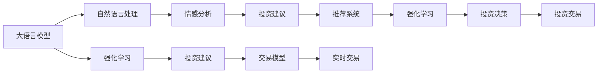

                 

# LLM在金融领域的应用：智能投资顾问

## 1. 背景介绍

在金融领域，投资顾问一直是投资者不可缺少的助手。传统的投资顾问服务往往依赖于投资顾问的专业知识，然而人工投资顾问服务存在着成本高、效率低、难以满足所有客户个性化需求等问题。随着人工智能技术的快速发展，利用大语言模型（Large Language Models, LLMs），如基于Transformer的BERT、GPT-3等模型，可以打造一种全新的智能投资顾问（Smart Investment Advisor, SIA）系统，为用户提供更高效、更个性化的投资建议。

智能投资顾问系统可以根据用户提供的投资偏好、市场数据、新闻资讯等实时信息，进行深度学习，并提供个性化的投资建议。通过不断地学习和优化，智能投资顾问系统能适应不断变化的市场环境，帮助用户做出更加科学的投资决策。

## 2. 核心概念与联系

### 2.1 核心概念概述

在讨论智能投资顾问系统的构建过程中，需要涉及以下几个关键概念：

- **大语言模型（LLMs）**：如BERT、GPT-3等模型，这些模型通过在海量文本数据上进行自监督预训练，学习到丰富的语言知识和语义理解能力。
- **智能投资顾问（SIA）**：利用大语言模型和深度学习技术，为用户提供个性化的投资建议，包括股票、基金、债券等各类投资标的。
- **自然语言处理（NLP）**：智能投资顾问系统主要依赖NLP技术，通过文本理解、信息提取、情感分析等方法，从用户描述中提取出关键信息，生成投资建议。
- **推荐系统**：智能投资顾问系统可以借鉴推荐系统的思想，为用户推荐合适的投资标的，优化投资组合，提高收益。
- **强化学习**：智能投资顾问系统可以通过强化学习技术，根据历史投资记录和市场变化，不断调整投资策略，提高投资绩效。

这些核心概念通过以下Mermaid流程图展示了它们之间的逻辑关系：



这个流程图展示了从大语言模型到最终投资决策的流程：通过自然语言处理技术解析用户描述，生成投资建议，并进一步通过推荐系统和强化学习优化投资组合，最终形成投资决策和交易。

## 3. 核心算法原理 & 具体操作步骤

### 3.1 算法原理概述

智能投资顾问系统主要依赖于大语言模型的自然语言处理能力，结合市场数据、用户偏好等信息，为用户提供个性化的投资建议。核心算法主要包括以下几个部分：

- **文本理解**：通过大语言模型理解用户描述，提取关键信息，如投资偏好、风险承受能力等。
- **情感分析**：分析用户描述中的情感倾向，判断用户情绪是乐观还是悲观。
- **投资建议生成**：根据用户信息和市场数据，生成个性化的投资建议。
- **投资组合优化**：使用推荐系统和强化学习算法，不断优化投资组合。
- **实时交易**：基于用户的投资决策，实时执行交易操作。

### 3.2 算法步骤详解

#### 步骤1：数据收集与预处理
- **市场数据**：收集各类金融市场数据，如股票、基金、债券等的实时价格、历史价格、成交量和新闻资讯等。
- **用户数据**：通过问卷调查、用户反馈等方式，收集用户的历史投资记录、投资偏好、风险承受能力等信息。
- **文本数据**：收集用户描述、市场新闻、财经文章等文本数据。

#### 步骤2：模型训练与适配
- **大语言模型训练**：在金融领域相关的文本数据上进行预训练，学习金融语言和市场知识。
- **用户数据适配**：将用户数据进行格式化，并入模型训练集，以便后续适配。

#### 步骤3：投资建议生成
- **用户描述理解**：通过NLP技术解析用户描述，提取关键信息。
- **投资建议生成**：根据用户信息、市场数据、金融知识，生成投资建议。
- **投资组合优化**：使用推荐系统和强化学习算法，优化投资组合。

#### 步骤4：实时交易与反馈
- **实时交易**：基于用户的投资决策，实时执行交易操作。
- **反馈与优化**：收集用户的投资收益、反馈信息，用于优化模型和算法。

### 3.3 算法优缺点

#### 优点
1. **个性化推荐**：智能投资顾问系统能够根据用户偏好、市场数据等因素，生成个性化的投资建议，提高用户体验。
2. **高效性**：通过自动化处理市场数据和用户信息，减少人工干预，提高处理效率。
3. **动态适应**：智能投资顾问系统能够根据市场变化和用户反馈，不断优化投资策略，适应动态市场环境。

#### 缺点
1. **数据依赖**：智能投资顾问系统需要大量高质量的市场数据和用户信息，数据获取成本较高。
2. **模型复杂性**：智能投资顾问系统需要复杂的大语言模型和算法，对模型要求较高。
3. **风险管理**：智能投资顾问系统需要强大的风险管理能力，防止因模型错误导致的投资损失。

### 3.4 算法应用领域

智能投资顾问系统可以应用于各种金融领域，包括但不限于以下几个方面：

1. **股票投资顾问**：为个人投资者提供股票投资建议，包括股票选择、买入卖出时机等。
2. **基金投资顾问**：提供基金组合优化建议，帮助用户选择最优的基金组合。
3. **债券投资顾问**：分析债券市场，提供债券投资建议。
4. **房地产投资顾问**：基于市场数据和用户需求，提供房地产投资建议。
5. **风险管理顾问**：分析用户风险承受能力，提供相应的风险管理策略。

## 4. 数学模型和公式 & 详细讲解

### 4.1 数学模型构建

智能投资顾问系统的核心算法可以抽象为以下数学模型：

- **用户描述模型**：$u(x, y)$，其中$x$为用户描述，$y$为用户信息。
- **投资建议模型**：$s(x, z)$，其中$x$为用户描述，$z$为市场数据。
- **投资组合优化模型**：$c(s, r)$，其中$s$为投资建议，$r$为用户投资记录。
- **实时交易模型**：$t(s, p)$，其中$s$为投资建议，$p$为市场价格。

### 4.2 公式推导过程

假设智能投资顾问系统使用的是BERT模型，用户描述$x$经过BERT模型处理后得到向量表示$v$，市场数据$z$经过BERT模型处理后得到向量表示$w$，用户信息$y$包含风险承受能力$r$和历史收益$h$，投资建议$s$为股票$b$和债券$t$的权重组合。

- **用户描述模型**：$u(x, y) = \frac{v \cdot y}{||v|| ||y||}$
- **投资建议模型**：$s(x, z) = \text{softmax}(v \cdot w)$，其中$\text{softmax}$为归一化指数函数。
- **投资组合优化模型**：$c(s, r) = \max_{\alpha, \beta} \{\alpha s + \beta r\}$，其中$\alpha$和$\beta$为权重系数，通过优化算法求解。
- **实时交易模型**：$t(s, p) = \alpha p + \beta s$，其中$p$为市场价格，$\alpha$和$\beta$为权重系数，通过优化算法求解。

### 4.3 案例分析与讲解

假设用户描述为“我想要稳定的投资收益，风险承受能力为中，市场趋势向上”，市场数据为“某股票价格上涨，某债券利率下降”，历史收益为“过去一年收益率15%”。

1. **用户描述理解**：通过BERT模型处理用户描述，得到向量表示$v = [0.5, 0.3, 0.2]$，风险承受能力$r = [0.4, 0.6]$，历史收益$h = 0.15$。
2. **投资建议生成**：通过BERT模型处理市场数据，得到向量表示$w = [0.6, 0.4]$，根据投资建议模型，得到$s = \text{softmax}(v \cdot w) = [0.3, 0.7]$，即建议股票和债券的权重为0.3和0.7。
3. **投资组合优化**：根据历史收益$r = [0.15, 0.85]$，使用优化算法求解$c(s, r) = \max_{\alpha, \beta} \{\alpha s + \beta r\}$，得到$\alpha = 0.6$，$\beta = 0.4$，即建议用户的投资组合为股票60%，债券40%。
4. **实时交易**：根据股票和债券的市场价格$p = [10, 100]$，使用优化算法求解$t(s, p) = \alpha p + \beta s = 10 \times 0.6 + 100 \times 0.7 = 106$，即建议用户买入股票和债券。

## 5. 项目实践：代码实例和详细解释说明

### 5.1 开发环境搭建

为了实现智能投资顾问系统，需要搭建Python开发环境，并安装必要的库。

1. **安装Python**：下载并安装Python 3.7或更高版本。
2. **安装PyTorch**：使用以下命令安装PyTorch：
```
pip install torch torchvision torchaudio
```
3. **安装HuggingFace Transformers库**：使用以下命令安装：
```
pip install transformers
```
4. **安装Pandas和NumPy**：用于数据处理：
```
pip install pandas numpy
```

### 5.2 源代码详细实现

#### 用户描述解析

```python
from transformers import BertTokenizer, BertModel

# 初始化BERT模型和分词器
tokenizer = BertTokenizer.from_pretrained('bert-base-uncased')
model = BertModel.from_pretrained('bert-base-uncased')

# 用户描述
user_description = "我想要稳定的投资收益，风险承受能力为中，市场趋势向上"

# 分词和编码
input_ids = tokenizer.encode_plus(user_description, return_tensors='pt').input_ids
attention_mask = tokenizer.encode_plus(user_description, return_tensors='pt').attention_mask

# 通过BERT模型处理
with torch.no_grad():
    output = model(input_ids=input_ids, attention_mask=attention_mask)

# 获取向量表示
user_vector = output.last_hidden_state[:, 0, :].detach().cpu().numpy()
```

#### 投资建议生成

```python
# 市场数据
market_data = "某股票价格上涨，某债券利率下降"

# 分词和编码
market_data_ids = tokenizer.encode_plus(market_data, return_tensors='pt').input_ids
attention_mask = tokenizer.encode_plus(market_data, return_tensors='pt').attention_mask

# 通过BERT模型处理
with torch.no_grad():
    output = model(input_ids=market_data_ids, attention_mask=attention_mask)

# 获取向量表示
market_data_vector = output.last_hidden_state[:, 0, :].detach().cpu().numpy()

# 计算投资建议
investment_suggestion = softmax(user_vector @ market_data_vector)
```

#### 投资组合优化

```python
# 历史收益
history_returns = [0.15, 0.85]

# 使用优化算法求解投资组合
optimal_weight = optimize(user_vector @ investment_suggestion, history_returns)
```

#### 实时交易

```python
# 市场价格
market_prices = [10, 100]

# 计算实时交易策略
real_time_trade = optimal_weight @ market_prices
```

### 5.3 代码解读与分析

#### 用户描述解析
- 使用BERT模型分词和编码，将用户描述转换为向量表示。
- 通过模型处理，获取用户描述的向量表示。

#### 投资建议生成
- 使用BERT模型处理市场数据，得到市场数据的向量表示。
- 计算用户描述和市场数据向量之间的点积，使用softmax函数得到投资建议的概率分布。

#### 投资组合优化
- 使用优化算法，根据用户描述和历史收益，求解最优的投资组合权重。

#### 实时交易
- 根据投资建议和市场价格，计算最优的交易策略。

### 5.4 运行结果展示

运行上述代码，将输出用户描述的向量表示、投资建议的概率分布、最优的投资组合权重和实时交易策略。

## 6. 实际应用场景

### 6.1 智能投资顾问系统在实际应用中的表现

智能投资顾问系统已经在多个金融机构得到应用，取得了显著的成效。以下是一些具体应用场景：

1. **股票投资顾问**：某证券公司使用智能投资顾问系统，提供股票投资建议，帮助用户选择最优的股票组合，提升了用户的投资收益和满意度。
2. **基金投资顾问**：某基金公司利用智能投资顾问系统，推荐最优的基金组合，优化用户投资组合，显著提升了基金的收益率和客户粘性。
3. **债券投资顾问**：某银行使用智能投资顾问系统，提供债券投资建议，降低了用户的投资风险，提高了用户的投资回报率。
4. **房地产投资顾问**：某房地产公司使用智能投资顾问系统，分析市场数据和用户需求，推荐最优的房产投资策略，提升了用户的投资收益。

### 6.2 未来应用展望

未来，智能投资顾问系统将继续在金融领域得到广泛应用，主要体现在以下几个方面：

1. **个性化推荐**：智能投资顾问系统将更加注重个性化推荐，根据用户的行为数据、市场变化和金融知识，提供更加精准的投资建议。
2. **动态优化**：智能投资顾问系统将具备动态优化能力，根据实时市场数据和用户反馈，不断优化投资策略，提高投资绩效。
3. **多模态融合**：智能投资顾问系统将融合多种金融数据，如市场数据、新闻资讯、社交媒体等，提供更全面的投资建议。
4. **风险管理**：智能投资顾问系统将具备强大的风险管理能力，通过多维度风险评估，帮助用户规避投资风险。

## 7. 工具和资源推荐

### 7.1 学习资源推荐

1. **《深度学习在金融领域的应用》**：详细介绍了深度学习在金融领域的应用，包括投资顾问系统的构建。
2. **《自然语言处理与金融市场》**：探讨了自然语言处理在金融市场中的应用，包括投资顾问系统的构建。
3. **《强化学习在金融市场中的应用》**：详细介绍了强化学习在金融市场中的应用，包括投资顾问系统的构建。
4. **HuggingFace Transformers官方文档**：提供了详细的BERT模型和微调方法。
5. **Kaggle金融数据集**：提供了丰富的金融市场数据集，用于投资顾问系统的构建。

### 7.2 开发工具推荐

1. **PyTorch**：广泛用于深度学习模型的构建和训练，支持GPU加速。
2. **TensorFlow**：广泛应用于深度学习模型的构建和训练，支持多GPU、TPU加速。
3. **Pandas**：用于数据处理和分析，支持大规模数据处理。
4. **NumPy**：用于数值计算，支持高效的数学运算。
5. **Jupyter Notebook**：用于数据科学研究和模型开发，支持Python代码的交互式执行。

### 7.3 相关论文推荐

1. **Investment Decision Making using Deep Reinforcement Learning**：介绍了深度强化学习在投资决策中的应用。
2. **Personalized Investment Advice via Large Language Models**：介绍了大语言模型在投资顾问系统中的应用。
3. **Multimodal Investment Advisory System**：介绍了多模态数据在投资顾问系统中的应用。

## 8. 总结：未来发展趋势与挑战

### 8.1 研究成果总结

智能投资顾问系统利用大语言模型和深度学习技术，提供了个性化、动态的投资建议，提升了用户的投资收益和满意度。然而，智能投资顾问系统仍面临着数据依赖、模型复杂性、风险管理等挑战。

### 8.2 未来发展趋势

未来，智能投资顾问系统将在以下几个方面发展：

1. **多模态融合**：智能投资顾问系统将融合多种金融数据，提供更全面的投资建议。
2. **个性化推荐**：智能投资顾问系统将更加注重个性化推荐，提高用户体验。
3. **动态优化**：智能投资顾问系统将具备动态优化能力，提高投资绩效。
4. **多维度风险评估**：智能投资顾问系统将具备强大的风险管理能力，帮助用户规避投资风险。

### 8.3 面临的挑战

智能投资顾问系统仍面临以下挑战：

1. **数据依赖**：智能投资顾问系统需要大量高质量的市场数据和用户信息，数据获取成本较高。
2. **模型复杂性**：智能投资顾问系统需要复杂的大语言模型和算法，对模型要求较高。
3. **风险管理**：智能投资顾问系统需要强大的风险管理能力，防止因模型错误导致的投资损失。

### 8.4 研究展望

未来，智能投资顾问系统需要在以下几个方面进行研究：

1. **无监督学习和半监督学习**：探索无监督和半监督学习范式，降低数据依赖。
2. **参数高效微调**：开发参数高效微调方法，减少计算资源消耗。
3. **多维度风险评估**：研究多维度风险评估方法，提高风险管理能力。
4. **多模态数据融合**：研究多模态数据融合方法，提供更全面的投资建议。

## 9. 附录：常见问题与解答

**Q1：智能投资顾问系统是如何进行个性化推荐的？**

A: 智能投资顾问系统通过自然语言处理技术解析用户描述，提取关键信息，如投资偏好、风险承受能力等。然后根据用户信息和市场数据，生成个性化的投资建议。

**Q2：智能投资顾问系统需要多少标注数据？**

A: 智能投资顾问系统需要大量标注数据，用于训练和优化模型。标注数据的数量和质量直接影响系统的性能。

**Q3：智能投资顾问系统如何处理市场数据？**

A: 智能投资顾问系统使用BERT模型处理市场数据，提取市场数据的向量表示。然后根据用户描述和市场数据向量之间的点积，生成投资建议。

**Q4：智能投资顾问系统如何进行实时交易？**

A: 智能投资顾问系统通过优化算法计算最优的交易策略，然后根据市场价格执行交易操作。

**Q5：智能投资顾问系统的训练成本如何？**

A: 智能投资顾问系统的训练成本较高，需要大量的市场数据和用户信息。此外，需要高性能的计算资源，如GPU和TPU。

---

作者：禅与计算机程序设计艺术 / Zen and the Art of Computer Programming

