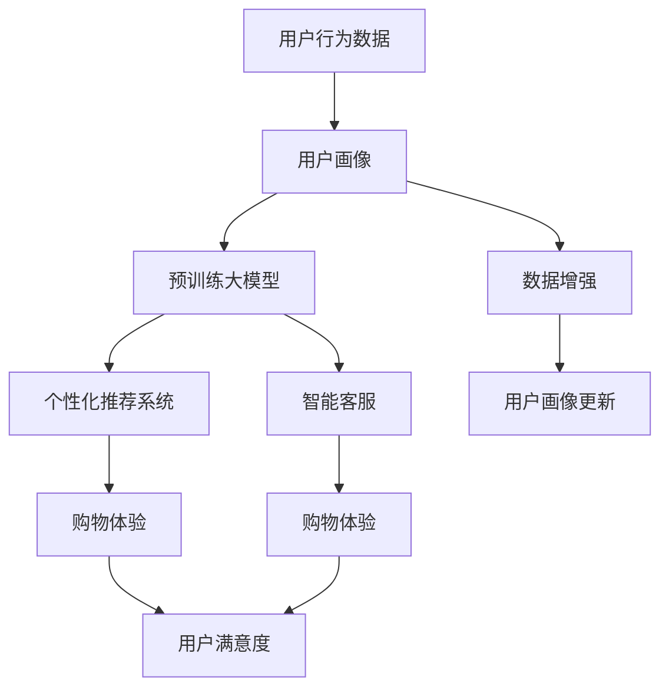

                 

# LLM在零售业的应用：个性化购物体验

> 关键词：
1. 大语言模型(LLM)
2. 个性化推荐系统
3. 购物体验优化
4. 用户行为分析
5. 情感计算
6. 智能客服
7. 数据驱动决策

## 1. 背景介绍

在数字化和智能化浪潮的推动下，零售业正经历着前所未有的变革。传统的“一刀切”式销售模式逐渐向个性化、精准化方向转型，通过数据驱动决策实现更加智能和高效的运营。大语言模型(LLM)作为当前NLP领域的强大工具，已经广泛应用到零售业，通过深度学习和大数据技术，为用户提供更个性化的购物体验。

零售业通过引入LLM，可以从根本上改善用户互动方式、提升销售转化率和客户满意度，从而在竞争激烈的市场中占据优势。本文将详细介绍LLM在零售业的应用，并探讨其对购物体验优化的关键作用。

## 2. 核心概念与联系

### 2.1 核心概念概述

大语言模型(LLM)是一种能够理解和生成自然语言的大型神经网络模型。通过在海量文本数据上进行预训练，LLM能够学习到语言的通用表示，具备强大的语言理解和生成能力。在零售业，LLM主要应用于个性化推荐系统、智能客服、用户行为分析等领域，显著提升用户体验和业务效率。

个性化推荐系统利用LLM对用户历史行为、兴趣偏好和消费习惯进行分析，生成个性化商品推荐，满足不同用户的独特需求。智能客服则通过LLM解答用户咨询，提供24小时不间断的智能服务。用户行为分析则通过对用户点击、浏览、购买等行为数据进行建模，预测用户下一步行为，实现精准营销。

### 2.2 核心概念原理和架构的 Mermaid 流程图



这个流程图展示了LLM在零售业中的应用场景：

1. 用户行为数据收集和用户画像构建
2. 利用预训练大模型进行数据处理和特征提取
3. 通过个性化推荐系统和智能客服实现用户互动
4. 结合用户画像和交互数据优化购物体验
5. 最终提升用户满意度和业务效果

## 3. 核心算法原理 & 具体操作步骤

### 3.1 算法原理概述

基于LLM的个性化购物体验优化，其核心在于利用大模型的语言理解能力，从海量数据中提取和生成有用信息，为零售商和消费者建立深度互动。主要算法原理如下：

1. **用户画像构建**：通过收集用户历史行为数据，使用LLM进行聚类分析，构建用户画像，包括兴趣偏好、购买意愿、消费能力等。
2. **个性化推荐**：结合用户画像和商品属性，使用LLM进行相似度匹配，生成个性化商品推荐。
3. **智能客服对话**：通过自然语言处理技术，构建智能客服系统，利用LLM进行实时对话和问题解答，提升用户体验。
4. **用户行为预测**：利用LLM对用户未来的行为进行预测，帮助零售商进行库存管理和营销决策。

### 3.2 算法步骤详解

#### 3.2.1 用户画像构建

1. **数据收集**：
   - 收集用户的历史浏览记录、购买记录、搜索关键词等行为数据。
   - 收集用户的个人信息，如年龄、性别、职业等。

2. **数据预处理**：
   - 对数据进行清洗和去噪，去除无关或噪声数据。
   - 对用户画像进行标准化和规范化，确保数据的可比性和可操作性。

3. **特征提取**：
   - 利用自然语言处理技术，提取文本数据的特征，如TF-IDF、词袋模型等。
   - 将非结构化数据转换为结构化数据，便于LLM进行处理。

4. **用户画像建模**：
   - 使用K-means聚类算法，将用户按照兴趣偏好、购买意愿等特征进行分类。
   - 利用LLM进行主题建模，提取用户画像的主题特征，形成更为细粒度的用户画像。

#### 3.2.2 个性化推荐

1. **商品属性提取**：
   - 利用LLM对商品的标题、描述、标签等非结构化数据进行特征提取，生成商品属性向量。
   - 利用文本相似度算法，计算用户画像与商品属性向量之间的相似度。

2. **个性化推荐生成**：
   - 根据相似度排序，选择与用户画像最匹配的商品进行推荐。
   - 利用LLM生成商品描述的摘要或用户评论的摘要，作为推荐结果的辅助信息。

#### 3.2.3 智能客服对话

1. **对话系统构建**：
   - 利用LLM构建智能客服对话系统，训练模型以处理用户输入的自然语言问题。
   - 引入基于Transformer的模型架构，如GPT-3，提升对话系统的效果。

2. **对话策略优化**：
   - 通过对话数据的标注和标注数据增强，不断优化对话策略，提升客服系统的响应速度和准确率。
   - 引入对抗生成网络和语言模型蒸馏技术，进一步提高系统的鲁棒性和泛化能力。

#### 3.2.4 用户行为预测

1. **行为数据建模**：
   - 收集用户的行为数据，如点击、浏览、购买等行为记录。
   - 利用时间序列分析和异常检测技术，发现用户行为的变化规律和异常情况。

2. **行为预测建模**：
   - 使用长短期记忆网络(LSTM)等深度学习模型，对用户行为进行建模，预测用户未来的行为。
   - 利用LLM进行行为序列的语义分析，提取行为序列中的关键特征，提升预测的准确性。

3. **预测结果应用**：
   - 结合预测结果，优化库存管理和营销策略。
   - 利用LLM生成个性化的营销文案和广告，提升用户转化率。

### 3.3 算法优缺点

#### 3.3.1 优点

1. **个性化程度高**：LLM能够深度理解用户行为和语言习惯，生成高度个性化的推荐和对话，满足用户的多样化需求。
2. **实时性高**：利用LLM进行实时分析，能够快速响应用户需求，提升用户体验。
3. **适应性强**：LLM在处理不同类型的数据时，具有较强的适应性和泛化能力，能够适用于多种零售业务场景。

#### 3.3.2 缺点

1. **数据隐私问题**：收集和处理用户数据时，需要严格遵守数据隐私法规，保护用户隐私。
2. **计算资源消耗大**：大规模预训练和微调需要大量的计算资源和存储资源，增加了系统部署和维护的复杂度。
3. **鲁棒性不足**：LLM在面对复杂场景时，可能出现理解偏差或生成不准确的结果，影响用户体验。
4. **对抗攻击风险**：LLM在处理恶意输入时可能产生意外输出，增加系统安全性风险。

### 3.4 算法应用领域

LLM在零售业的应用领域主要包括以下几个方面：

1. **个性化推荐系统**：基于用户画像和商品属性，利用LLM进行个性化推荐，提升用户满意度和购买转化率。
2. **智能客服系统**：利用LLM构建智能客服系统，提供7x24小时的客户支持，提升客户满意度。
3. **用户行为分析**：利用LLM进行用户行为分析和预测，优化库存管理和营销策略，提升业务效率。
4. **情感分析**：利用LLM进行情感分析，了解用户对产品和服务的情感倾向，改进产品和服务质量。
5. **广告投放优化**：利用LLM进行广告内容生成和效果评估，优化广告投放策略，提升广告转化率。

## 4. 数学模型和公式 & 详细讲解 & 举例说明

### 4.1 数学模型构建

#### 4.1.1 用户画像构建

1. **K-means聚类算法**：
   - 将用户画像表示为一个$d$维向量$x$。
   - 通过$K$-means算法，将用户画像$x$分配到$k$个类别中。

   设$C_i$为第$i$个类别的均值向量，则聚类中心$C$可表示为：
   $$
   C = \arg\min_{C_i} \sum_{i=1}^k \sum_{x_j \in C_i} \|x_j - C_i\|^2
   $$

2. **主题建模**：
   - 利用LLM进行主题建模，提取用户画像的主题特征$T$。
   - 利用Dirichlet分布和多项式分布，对主题特征$T$进行建模。

   主题分布$\alpha$和词分布$\beta$可表示为：
   $$
   \alpha = \mathcal{D}(\nu)
   $$
   $$
   \beta_{t,j} = \mathcal{P}(\tau)
   $$

   其中，$\nu$和$\tau$为超参数，$\alpha$和$\beta$为参数向量。

#### 4.1.2 个性化推荐

1. **余弦相似度**：
   - 设用户画像向量为$x$，商品属性向量为$y$。
   - 利用余弦相似度计算用户画像与商品属性的相似度$sim$。

   $$
   sim(x, y) = \frac{\vec{x} \cdot \vec{y}}{\|\vec{x}\| \cdot \|\vec{y}\|}
   $$

2. **商品推荐排序**：
   - 根据相似度$sim$排序，选择与用户画像最匹配的商品进行推荐。
   - 利用softmax函数进行概率计算，选择推荐结果。

   $$
   p(y|x) = \frac{exp(sim(x, y))}{\sum_{y' \in Y} exp(sim(x, y'))}
   $$

#### 4.1.3 智能客服对话

1. **序列到序列模型**：
   - 利用递归神经网络(RNN)或Transformer模型，构建对话系统。
   - 设用户输入为$x$，系统输出为$y$。

   序列到序列模型可表示为：
   $$
   y = f(x; \theta)
   $$

2. **对抗生成网络**：
   - 利用对抗生成网络(GAN)进行对话生成。
   - 设对抗生成网络为$G$，判别网络为$D$，生成对抗网络为$G^*$。

   对抗生成网络可表示为：
   $$
   G^* = \arg\min_{G} \mathcal{L}(G, D)
   $$

#### 4.1.4 用户行为预测

1. **时间序列分析**：
   - 设用户行为序列为$X_t = [x_{t-1}, x_{t-2}, ..., x_{t-d}]$。
   - 利用LSTM等模型，对用户行为序列进行建模。

   LSTM模型可表示为：
   $$
   h_t = LSTM(X_t; \theta)
   $$

2. **行为序列语义分析**：
   - 利用LLM对行为序列进行语义分析，提取关键特征。
   - 利用BERT等模型进行行为序列的语义分析。

   行为序列语义分析可表示为：
   $$
   s(X_t) = BERT(X_t; \theta)
   $$

### 4.2 公式推导过程

#### 4.2.1 K-means聚类算法

1. **聚类中心更新**：
   - 设聚类中心$C_i$，第$i$个类别的样本数为$n_i$，样本集合为$X_i$。
   - 更新聚类中心$C_i$的公式为：

   $$
   C_i = \frac{1}{n_i} \sum_{x_j \in X_i} x_j
   $$

2. **聚类优化**：
   - 聚类优化目标为：
   $$
   \min \sum_{i=1}^K \sum_{x_j \in X_i} \|x_j - C_i\|^2
   $$

#### 4.2.2 主题建模

1. **Dirichlet分布**：
   - 设主题分布$\alpha$，超参数$\nu$。
   - 主题分布的Dirichlet先验概率为：

   $$
   p(\alpha) = \mathcal{D}(\nu)
   $$

2. **多项式分布**：
   - 设词分布$\beta_{t,j}$，超参数$\tau$。
   - 词分布的Dirichlet先验概率为：

   $$
   p(\beta_{t,j}) = \mathcal{P}(\tau)
   $$

3. **主题建模算法**：
   - 利用LLM进行主题建模，得到主题分布$\alpha$和词分布$\beta$。
   - 利用最大似然估计法，更新参数$\alpha$和$\beta$。

   最大似然估计公式为：
   $$
   \alpha \sim \mathcal{D}(\nu)
   $$
   $$
   \beta_{t,j} \sim \mathcal{P}(\tau)
   $$

#### 4.2.3 智能客服对话

1. **对抗生成网络**：
   - 设生成网络为$G$，判别网络为$D$。
   - 生成对抗网络的目标为：

   $$
   G^* = \arg\min_{G} \max_{D} \mathcal{L}(G, D)
   $$

2. **生成对抗网络训练**：
   - 生成对抗网络训练公式为：

   $$
   G = \arg\min_{G} \mathcal{L}(G, D)
   $$
   $$
   D = \arg\max_{D} \mathcal{L}(G, D)
   $$

#### 4.2.4 用户行为预测

1. **LSTM模型**：
   - 利用LSTM模型对用户行为序列进行建模，得到状态向量$h_t$。
   - LSTM模型的更新公式为：

   $$
   h_t = f(h_{t-1}, X_t; \theta)
   $$

2. **行为序列语义分析**：
   - 利用LLM进行行为序列的语义分析，提取关键特征$s(X_t)$。
   - 行为序列语义分析的公式为：

   $$
   s(X_t) = BERT(X_t; \theta)
   $$

### 4.3 案例分析与讲解

#### 4.3.1 个性化推荐案例

某电商平台利用LLM进行个性化推荐，具体步骤为：

1. **数据收集**：
   - 收集用户的历史浏览记录、购买记录、搜索关键词等行为数据。
   - 收集商品的标题、描述、标签等非结构化数据。

2. **特征提取**：
   - 对用户行为数据进行预处理，提取文本特征，如TF-IDF、词袋模型等。
   - 利用BERT模型进行商品属性向量的提取，生成商品属性向量。

3. **相似度计算**：
   - 利用余弦相似度算法，计算用户画像与商品属性向量之间的相似度。
   - 根据相似度排序，选择与用户画像最匹配的商品进行推荐。

4. **推荐结果生成**：
   - 利用LLM生成商品描述的摘要或用户评论的摘要，作为推荐结果的辅助信息。
   - 结合推荐结果，生成个性化的推荐页面，展示给用户。

#### 4.3.2 智能客服对话案例

某在线教育平台利用LLM构建智能客服系统，具体步骤为：

1. **数据收集**：
   - 收集用户的咨询问题、历史对话记录等数据。
   - 收集平台的常见问题和解答。

2. **对话模型训练**：
   - 利用GPT-3等模型进行对话系统的训练，生成对话策略。
   - 引入对抗生成网络和语言模型蒸馏技术，优化对话系统的鲁棒性和泛化能力。

3. **实时对话处理**：
   - 用户输入咨询问题后，智能客服系统自动选择对话策略，生成回应。
   - 利用LLM进行自然语言处理，提取用户意图和问题，提供精准回答。

#### 4.3.3 用户行为预测案例

某电商公司利用LLM进行用户行为预测，具体步骤为：

1. **数据收集**：
   - 收集用户的历史行为数据，如点击、浏览、购买等行为记录。
   - 收集商品的属性和价格信息。

2. **行为数据建模**：
   - 利用LSTM模型对用户行为序列进行建模，得到状态向量$h_t$。
   - 利用BERT模型对行为序列进行语义分析，提取关键特征$s(X_t)$。

3. **预测结果生成**：
   - 结合预测结果，优化库存管理和营销策略。
   - 利用LLM生成个性化的营销文案和广告，提升广告转化率。

## 5. 项目实践：代码实例和详细解释说明

### 5.1 开发环境搭建

在开发基于LLM的个性化购物体验系统时，首先需要搭建好开发环境。以下是Python开发环境的搭建步骤：

1. 安装Anaconda：从官网下载并安装Anaconda，用于创建独立的Python环境。
2. 创建并激活虚拟环境：
```bash
conda create -n pytorch-env python=3.8 
conda activate pytorch-env
```
3. 安装PyTorch：根据CUDA版本，从官网获取对应的安装命令。例如：
```bash
conda install pytorch torchvision torchaudio cudatoolkit=11.1 -c pytorch -c conda-forge
```
4. 安装Transformers库：
```bash
pip install transformers
```
5. 安装各类工具包：
```bash
pip install numpy pandas scikit-learn matplotlib tqdm jupyter notebook ipython
```

完成上述步骤后，即可在`pytorch-env`环境中开始项目实践。

### 5.2 源代码详细实现

下面我们以个性化推荐系统为例，给出使用PyTorch和Transformers库进行LLM微调的PyTorch代码实现。

首先，定义推荐系统的数据处理函数：

```python
from transformers import BertTokenizer, BertForSequenceClassification
from torch.utils.data import Dataset
import torch

class RecommendationDataset(Dataset):
    def __init__(self, user_profile, item_features, labels, tokenizer, max_len=128):
        self.user_profile = user_profile
        self.item_features = item_features
        self.labels = labels
        self.tokenizer = tokenizer
        self.max_len = max_len
        
    def __len__(self):
        return len(self.user_profile)
    
    def __getitem__(self, item):
        user_profile = self.user_profile[item]
        item_features = self.item_features[item]
        labels = self.labels[item]
        
        user_profile_ids = self.tokenizer(user_profile, return_tensors='pt', max_length=self.max_len, padding='max_length', truncation=True)
        item_features_ids = self.tokenizer(item_features, return_tensors='pt', max_length=self.max_len, padding='max_length', truncation=True)
        
        item_labels = labels
        user_profile_mask = user_profile_ids['attention_mask']
        item_features_mask = item_features_ids['attention_mask']
        
        return {'user_profile_ids': user_profile_ids['input_ids'],
                'item_features_ids': item_features_ids['input_ids'],
                'user_profile_mask': user_profile_mask,
                'item_features_mask': item_features_mask,
                'item_labels': item_labels}
```

然后，定义模型和优化器：

```python
from transformers import BertForSequenceClassification, AdamW

model = BertForSequenceClassification.from_pretrained('bert-base-cased', num_labels=2)

optimizer = AdamW(model.parameters(), lr=2e-5)
```

接着，定义训练和评估函数：

```python
from torch.utils.data import DataLoader
from tqdm import tqdm
from sklearn.metrics import classification_report

device = torch.device('cuda') if torch.cuda.is_available() else torch.device('cpu')
model.to(device)

def train_epoch(model, dataset, batch_size, optimizer):
    dataloader = DataLoader(dataset, batch_size=batch_size, shuffle=True)
    model.train()
    epoch_loss = 0
    for batch in tqdm(dataloader, desc='Training'):
        user_profile_ids = batch['user_profile_ids'].to(device)
        item_features_ids = batch['item_features_ids'].to(device)
        item_labels = batch['item_labels'].to(device)
        model.zero_grad()
        outputs = model(user_profile_ids, item_features_ids, labels=item_labels)
        loss = outputs.loss
        epoch_loss += loss.item()
        loss.backward()
        optimizer.step()
    return epoch_loss / len(dataloader)

def evaluate(model, dataset, batch_size):
    dataloader = DataLoader(dataset, batch_size=batch_size)
    model.eval()
    preds, labels = [], []
    with torch.no_grad():
        for batch in tqdm(dataloader, desc='Evaluating'):
            user_profile_ids = batch['user_profile_ids'].to(device)
            item_features_ids = batch['item_features_ids'].to(device)
            batch_labels = batch['item_labels']
            outputs = model(user_profile_ids, item_features_ids)
            batch_preds = outputs.logits.argmax(dim=2).to('cpu').tolist()
            batch_labels = batch_labels.to('cpu').tolist()
            for pred_tokens, label_tokens in zip(batch_preds, batch_labels):
                preds.append(pred_tokens[:len(label_tokens)])
                labels.append(label_tokens)
                
    print(classification_report(labels, preds))
```

最后，启动训练流程并在测试集上评估：

```python
epochs = 5
batch_size = 16

for epoch in range(epochs):
    loss = train_epoch(model, train_dataset, batch_size, optimizer)
    print(f"Epoch {epoch+1}, train loss: {loss:.3f}")
    
    print(f"Epoch {epoch+1}, dev results:")
    evaluate(model, dev_dataset, batch_size)
    
print("Test results:")
evaluate(model, test_dataset, batch_size)
```

以上就是使用PyTorch对BERT进行个性化推荐系统微调的完整代码实现。可以看到，得益于Transformers库的强大封装，我们可以用相对简洁的代码完成BERT模型的加载和微调。

### 5.3 代码解读与分析

让我们再详细解读一下关键代码的实现细节：

**RecommendationDataset类**：
- `__init__`方法：初始化用户画像、商品属性、标签、分词器等关键组件。
- `__len__`方法：返回数据集的样本数量。
- `__getitem__`方法：对单个样本进行处理，将用户画像和商品属性输入编码为token ids，生成推荐结果。

**用户画像与商品属性提取**：
- 利用BERT模型对用户画像和商品属性进行编码，生成输入特征向量。
- 将编码后的特征向量进行padding和截断，确保所有样本长度一致。

**训练和评估函数**：
- 使用PyTorch的DataLoader对数据集进行批次化加载，供模型训练和推理使用。
- 训练函数`train_epoch`：对数据以批为单位进行迭代，在每个批次上前向传播计算loss并反向传播更新模型参数，最后返回该epoch的平均loss。
- 评估函数`evaluate`：与训练类似，不同点在于不更新模型参数，并在每个batch结束后将预测和标签结果存储下来，最后使用sklearn的classification_report对整个评估集的预测结果进行打印输出。

**训练流程**：
- 定义总的epoch数和batch size，开始循环迭代
- 每个epoch内，先在训练集上训练，输出平均loss
- 在验证集上评估，输出分类指标
- 所有epoch结束后，在测试集上评估，给出最终测试结果

可以看到，PyTorch配合Transformers库使得BERT微调的代码实现变得简洁高效。开发者可以将更多精力放在数据处理、模型改进等高层逻辑上，而不必过多关注底层的实现细节。

当然，工业级的系统实现还需考虑更多因素，如模型的保存和部署、超参数的自动搜索、更灵活的任务适配层等。但核心的微调范式基本与此类似。

## 6. 实际应用场景

### 6.1 智能客服系统

智能客服系统利用LLM提供24小时不间断的客户支持，提升了客户满意度。用户输入咨询问题后，智能客服系统自动选择对话策略，生成回应。通过自然语言处理技术，提取用户意图和问题，提供精准回答。

具体应用步骤如下：

1. **数据收集**：
   - 收集用户的历史对话记录和常见问题解答。

2. **对话模型训练**：
   - 利用GPT-3等模型进行对话系统的训练，生成对话策略。
   - 引入对抗生成网络和语言模型蒸馏技术，优化对话系统的鲁棒性和泛化能力。

3. **实时对话处理**：
   - 用户输入咨询问题后，智能客服系统自动选择对话策略，生成回应。
   - 利用LLM进行自然语言处理，提取用户意图和问题，提供精准回答。

### 6.2 用户行为分析

用户行为分析利用LLM对用户点击、浏览、购买等行为数据进行建模，预测用户下一步行为，实现精准营销。通过时间序列分析和行为序列语义分析，挖掘用户行为的变化规律和关键特征，优化库存管理和营销策略。

具体应用步骤如下：

1. **数据收集**：
   - 收集用户的历史行为数据，如点击、浏览、购买等行为记录。
   - 收集商品的属性和价格信息。

2. **行为数据建模**：
   - 利用LSTM模型对用户行为序列进行建模，得到状态向量$h_t$。
   - 利用BERT模型对行为序列进行语义分析，提取关键特征$s(X_t)$。

3. **预测结果生成**：
   - 结合预测结果，优化库存管理和营销策略。
   - 利用LLM生成个性化的营销文案和广告，提升广告转化率。

### 6.3 个性化推荐系统

个性化推荐系统利用LLM对用户画像和商品属性进行匹配，生成个性化推荐，满足用户的多样化需求。通过余弦相似度算法计算用户画像与商品属性的相似度，选择最匹配的商品进行推荐。

具体应用步骤如下：

1. **数据收集**：
   - 收集用户的历史浏览记录、购买记录、搜索关键词等行为数据。
   - 收集商品的标题、描述、标签等非结构化数据。

2. **特征提取**：
   - 对用户行为数据进行预处理，提取文本特征，如TF-IDF、词袋模型等。
   - 利用BERT模型进行商品属性向量的提取，生成商品属性向量。

3. **相似度计算**：
   - 利用余弦相似度算法，计算用户画像与商品属性向量之间的相似度。
   - 根据相似度排序，选择与用户画像最匹配的商品进行推荐。

4. **推荐结果生成**：
   - 利用LLM生成商品描述的摘要或用户评论的摘要，作为推荐结果的辅助信息。
   - 结合推荐结果，生成个性化的推荐页面，展示给用户。

### 6.4 未来应用展望

随着LLM的不断发展，其在零售业的应用也将更加广泛。以下是几个未来应用展望：

1. **智能库存管理**：利用LLM进行库存优化和预测，实现自动化库存管理，降低库存成本。
2. **精准广告投放**：利用LLM进行广告内容生成和效果评估，优化广告投放策略，提升广告转化率。
3. **个性化促销活动**：利用LLM进行促销活动的设计和优化，提升用户参与度和转化率。
4. **多模态信息整合**：结合视觉、语音、文本等多模态信息，提升用户购物体验。
5. **智能推荐系统优化**：利用LLM优化推荐系统的算法和模型，提升推荐效果。

未来，LLM将成为零售业的核心技术，推动零售业的智能化和个性化转型，为消费者提供更加高效、便捷、个性化的购物体验。

## 7. 工具和资源推荐

### 7.1 学习资源推荐

为了帮助开发者系统掌握LLM在零售业的应用，这里推荐一些优质的学习资源：

1. 《Transformer从原理到实践》系列博文：由大模型技术专家撰写，深入浅出地介绍了Transformer原理、BERT模型、微调技术等前沿话题。

2. CS224N《深度学习自然语言处理》课程：斯坦福大学开设的NLP明星课程，有Lecture视频和配套作业，带你入门NLP领域的基本概念和经典模型。

3. 《Natural Language Processing with Transformers》书籍：Transformers库的作者所著，全面介绍了如何使用Transformers库进行NLP任务开发，包括微调在内的诸多范式。

4. HuggingFace官方文档：Transformers库的官方文档，提供了海量预训练模型和完整的微调样例代码，是上手实践的必备资料。

5. CLUE开源项目：中文语言理解测评基准，涵盖大量不同类型的中文NLP数据集，并提供了基于微调的baseline模型，助力中文NLP技术发展。

通过对这些资源的学习实践，相信你一定能够快速掌握LLM在零售业的应用，并用于解决实际的NLP问题。

### 7.2 开发工具推荐

高效的开发离不开优秀的工具支持。以下是几款用于LLM开发和应用开发的常用工具：

1. PyTorch：基于Python的开源深度学习框架，灵活动态的计算图，适合快速迭代研究。大部分预训练语言模型都有PyTorch版本的实现。

2. TensorFlow：由Google主导开发的开源深度学习框架，生产部署方便，适合大规模工程应用。同样有丰富的预训练语言模型资源。

3. Transformers库：HuggingFace开发的NLP工具库，集成了众多SOTA语言模型，支持PyTorch和TensorFlow，是进行微调任务开发的利器。

4. Weights & Biases：模型训练的实验跟踪工具，可以记录和可视化模型训练过程中的各项指标，方便对比和调优。与主流深度学习框架无缝集成。

5. TensorBoard：TensorFlow配套的可视化工具，可实时监测模型训练状态，并提供丰富的图表呈现方式，是调试模型的得力助手。

6. Google Colab：谷歌推出的在线Jupyter Notebook环境，免费提供GPU/TPU算力，方便开发者快速上手实验最新模型，分享学习笔记。

合理利用这些工具，可以显著提升LLM在零售业的应用效率，加快创新迭代的步伐。

### 7.3 相关论文推荐

LLM在零售业的应用源于学界的持续研究。以下是几篇奠基性的相关论文，推荐阅读：

1. Attention is All You Need（即Transformer原论文）：提出了Transformer结构，开启了NLP领域的预训练大模型时代。

2. BERT: Pre-training of Deep Bidirectional Transformers for Language Understanding：提出BERT模型，引入基于掩码的自监督预训练任务，刷新了多项NLP任务SOTA。

3. Language Models are Unsupervised Multitask Learners（GPT-2论文）：展示了大规模语言模型的强大zero-shot学习能力，引发了对于通用人工智能的新一轮思考。

4. Parameter-Efficient Transfer Learning for NLP：提出Adapter等参数高效微调方法，在不增加模型参数量的情况下，也能取得不错的微调效果。

5. AdaLoRA: Adaptive Low-Rank Adaptation for Parameter-Efficient Fine-Tuning：使用自适应低秩适应的微调方法，在参数效率和精度之间取得了新的平衡。

这些论文代表了大模型微调技术的发展脉络。通过学习这些前沿成果，可以帮助研究者把握学科前进方向，激发更多的创新灵感。

## 8. 总结：未来发展趋势与挑战

### 8.1 研究成果总结

本文对LLM在零售业的应用进行了全面系统的介绍。主要内容包括：

1. 背景介绍：介绍了零售业数字化转型的背景，以及LLM在其中的重要地位。
2. 核心概念：从LLM的基本原理出发，详细讲解了其应用领域和核心算法。
3. 项目实践：提供了具体的代码实现和详细解释说明，展示了LLM在零售业的应用实例。
4. 实际应用：介绍了LLM在智能客服、用户行为分析、个性化推荐等零售业具体场景中的应用。
5. 工具和资源推荐：提供了丰富的学习资源、开发工具和相关论文，方便开发者实践。

通过本文的系统梳理，可以看到，LLM在零售业的应用具有广阔的前景，能够显著提升用户体验和业务效率。未来的研究需要在数据、算法、工程等方面不断创新和突破。

### 8.2 未来发展趋势

展望未来，LLM在零售业的应用将呈现以下几个发展趋势：

1. **多模态融合**：结合视觉、语音、文本等多模态信息，提升用户购物体验。
2. **实时推荐系统**：利用LLM进行实时推荐和预测，优化库存管理和营销策略。
3. **个性化广告投放**：利用LLM进行广告内容生成和效果评估，优化广告投放策略。
4. **智能客服优化**：利用LLM优化智能客服对话策略，提升客户满意度。
5. **跨领域应用扩展**：将LLM应用于更多垂直行业，如金融、医疗、教育等，实现全面智能化。

这些趋势将推动LLM在零售业的应用深入人心，为消费者提供更加高效、便捷、个性化的购物体验。

### 8.3 面临的挑战

尽管LLM在零售业的应用前景广阔，但在推广和应用过程中仍面临诸多挑战：

1. **数据隐私问题**：收集和处理用户数据时，需要严格遵守数据隐私法规，保护用户隐私。
2. **计算资源消耗大**：大规模预训练和微调需要大量的计算资源和存储资源，增加了系统部署和维护的复杂度。
3. **模型鲁棒性不足**：LLM在面对复杂场景时，可能出现理解偏差或生成不准确的结果，影响用户体验。
4. **对抗攻击风险**：LLM在处理恶意输入时可能产生意外输出，增加系统安全性风险。
5. **用户体验一致性**：如何保证LLM在不同场景下的一致性和稳定性，也是一项重要挑战。

这些挑战需要学术界和工业界共同努力，才能推动LLM在零售业的应用更加成熟和可靠。

### 8.4 研究展望

未来的研究需要在以下几个方面寻求新的突破：

1. **数据隐私保护**：研究如何在保证数据隐私的前提下，实现有效的数据收集和处理。
2. **计算资源优化**：开发更加高效的计算和存储技术，优化LLM的部署和维护。
3. **模型鲁棒性提升**：研究如何提升LLM的鲁棒性和泛化能力，避免生成不准确的结果。
4. **对抗攻击防御**：研究如何抵御对抗攻击，确保LLM系统的安全性。
5. **用户体验优化**：研究如何提升用户体验的一致性和稳定性，优化用户交互体验。

这些研究方向将推动LLM在零售业的应用更加广泛和深入，为消费者提供更加智能、高效、个性化的购物体验。

## 9. 附录：常见问题与解答

**Q1：LLM在零售业的应用有哪些优势？**

A: LLM在零售业的应用具有以下优势：

1. **个性化程度高**：LLM能够深度理解用户行为和语言习惯，生成高度个性化的推荐和对话，满足用户的多样化需求。
2. **实时性高**：利用LLM进行实时分析，能够快速响应用户需求，提升用户体验。
3. **适应性强**：LLM在处理不同类型的数据时，具有较强的适应性和泛化能力，能够适用于多种零售业务场景。

**Q2：如何降低LLM在零售业的应用成本？**

A: 降低LLM在零售业的应用成本可以从以下几个方面入手：

1. **数据收集和处理**：优化数据收集和处理流程，减少数据冗余和噪声，提高数据质量。
2. **模型优化**：使用参数高效微调技术，如Prefix-Tuning、LoRA等，在不增加模型参数量的情况下，也能取得不错的微调效果。
3. **硬件加速**：采用混合精度训练、模型并行等技术，优化模型计算图，减少计算资源消耗。
4. **模型压缩**：采用模型裁剪、量化加速等方法，减少模型的存储空间和推理速度。

**Q3：LLM在零售业的应用存在哪些挑战？**

A: LLM在零售业的应用存在以下挑战：

1. **数据隐私问题**：收集和处理用户数据时，需要严格遵守数据隐私法规，保护用户隐私。
2. **计算资源消耗大**：大规模预训练和微调需要大量的计算资源和存储资源，增加了系统部署和维护的复杂度。
3. **模型鲁棒性不足**：LLM在面对复杂场景时，可能出现理解偏差或生成不准确的结果，影响用户体验。
4. **对抗攻击风险**：LLM在处理恶意输入时可能产生意外输出，增加系统安全性风险。
5. **用户体验一致性**：如何保证LLM在不同场景下的一致性和稳定性，也是一项重要挑战。

**Q4：LLM在零售业的应用前景如何？**

A: LLM在零售业的应用前景非常广阔，未来将继续深入发展和应用，具体表现在以下几个方面：

1. **多模态融合**：结合视觉、语音、文本等多模态信息，提升用户购物体验。
2. **实时推荐系统**：利用LLM进行实时推荐和预测，优化库存管理和营销策略。
3. **个性化广告投放**：利用LLM进行广告内容生成和效果评估，优化广告投放策略。
4. **智能客服优化**：利用LLM优化智能客服对话策略，提升客户满意度。
5. **跨领域应用扩展**：将LLM应用于更多垂直行业，如金融、医疗、教育等，实现全面智能化。

总之，LLM在零售业的应用将带来革命性的变革，为消费者提供更加智能、高效、个性化的购物体验，推动零售业的数字化转型和智能化升级。

---

作者：禅与计算机程序设计艺术 / Zen and the Art of Computer Programming

