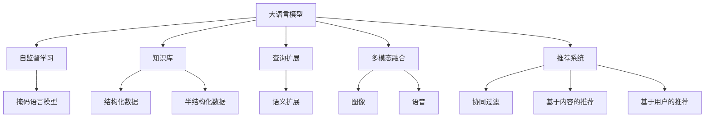

                 

# LLM对传统信息检索的革新

## 1. 背景介绍

### 1.1 问题由来
信息检索（Information Retrieval, IR）是计算机科学和人工智能领域的一个核心任务，旨在帮助用户高效地从大量文本数据中找到所需的信息。传统的基于关键词匹配的信息检索方法，已经广泛应用于搜索引擎、图书馆、数据库等领域。然而，随着互联网数据的爆炸式增长，文本数据的规模、复杂性和多样性都在不断增加，传统的关键词匹配方法已经无法满足用户对检索结果的相关性、全面性和时效性的需求。

### 1.2 问题核心关键点
大语言模型（Large Language Models, LLM）的出现，为信息检索技术带来了革命性的变革。LLM基于大规模无标签文本数据的自监督预训练，学习到了丰富的语言知识和常识，具备强大的语言理解和生成能力。将其应用于信息检索，可以显著提升检索结果的相关性和精度。具体而言，LLM在信息检索中的应用可以从以下几个方面进行优化：

1. 语义理解：LLM可以理解自然语言文本的语义，从而对文本内容进行更精准的匹配。
2. 跨领域能力：LLM具备跨领域迁移能力，可以从不同领域的数据中学习泛化的知识，提升检索的全面性。
3. 知识融合：LLM可以融合外部知识库、规则库等专家知识，提升检索结果的准确性和可解释性。
4. 多模态融合：LLM可以将文本、图像、语音等多模态信息融合，提供更加全面的检索结果。
5. 个性化推荐：LLM可以根据用户的历史行为和偏好，提供个性化的检索推荐。

### 1.3 问题研究意义
研究LLM在信息检索中的应用，对于提升检索结果的相关性和全面性，增强用户的检索体验，促进人工智能技术在信息检索领域的深度应用，具有重要意义：

1. 提高检索效果：LLM能够更好地理解用户查询意图和文本内容，提升检索结果的相关性和准确性。
2. 拓展应用边界：通过融合外部知识库、规则库等，LLM可以应用于更广泛的场景，如法律、医学、金融等专业领域。
3. 加速技术落地：LLM的高效性能和强大的泛化能力，可以加快信息检索技术的产业化进程，降低开发和维护成本。
4. 推动创新突破：LLM的跨领域和跨模态能力，可以催生新的信息检索方法和应用，拓展技术边界。
5. 提升用户体验：LLM能够提供更自然、更智能的检索交互，提升用户对信息检索的满意度。

## 2. 核心概念与联系

### 2.1 核心概念概述

为更好地理解LLM在信息检索中的应用，本节将介绍几个密切相关的核心概念：

- 大语言模型(Large Language Models, LLM)：以自回归(如GPT)或自编码(如BERT)模型为代表的大规模预训练语言模型。通过在大规模无标签文本语料上进行预训练，学习到了丰富的语言知识和常识。
- 自监督学习(Self-Supervised Learning)：利用文本数据的自然语言特性，如掩码语言模型、掩码图像模型等，进行无监督训练，学习到语言的隐含规则和表征。
- 知识库(Knowledge Base)：包含各类结构化数据和半结构化数据，如维基百科、百度百科、医学百科等，用于提供知识支撑和增强检索结果的准确性。
- 查询扩展(Query Expansion)：通过对用户查询进行语义扩展，提升查询的覆盖范围和相关性。
- 多模态融合(Multimodal Fusion)：将文本、图像、语音等多种模态信息融合，提升检索结果的多样性和准确性。
- 推荐系统(Recommender System)：根据用户的历史行为和偏好，推荐相关的内容，增强用户的检索体验。

这些核心概念之间的逻辑关系可以通过以下Mermaid流程图来展示：



这个流程图展示了大语言模型在信息检索领域的关键组件及其之间的关系：

1. 大语言模型通过自监督学习获得语言知识，从知识库中学习泛化知识。
2. 查询扩展和多模态融合提升检索结果的相关性和多样性。
3. 推荐系统结合用户历史行为数据，提供个性化推荐。

这些概念共同构成了LLM在信息检索中的应用框架，使其能够在各种场景下提供高效、智能的检索服务。通过理解这些核心概念，我们可以更好地把握LLM在信息检索中的工作原理和优化方向。

## 3. 核心算法原理 & 具体操作步骤
### 3.1 算法原理概述

LLM在信息检索中的应用，本质上是一个基于检索语义理解的模型优化过程。其核心思想是：将预训练的大语言模型作为检索引擎，通过有监督地训练来优化模型在特定语境下的检索性能。具体来说，LLM在信息检索中的应用分为以下几个步骤：

1. **预训练模型选择**：选择合适的预训练模型作为检索引擎的初始化参数，如BERT、GPT等。
2. **检索目标定义**：定义检索任务的目标函数，如最大化检索结果的相关性，最小化检索结果的噪声。
3. **微调训练**：使用有标注的检索数据集，对预训练模型进行微调，优化模型在特定语境下的表现。
4. **推理应用**：将微调后的模型应用于实际的信息检索任务，通过用户查询得到相关的文本数据。

### 3.2 算法步骤详解

基于LLM的信息检索应用主要包括以下关键步骤：

**Step 1: 准备预训练模型和数据集**
- 选择合适的预训练语言模型 $M_{\theta}$ 作为初始化参数，如 BERT、GPT等。
- 准备检索任务的数据集 $D$，划分为训练集、验证集和测试集。一般要求检索数据与预训练数据的分布不要差异过大。

**Step 2: 添加检索适配层**
- 根据检索任务类型，在预训练模型顶层设计合适的检索函数和损失函数。
- 对于文本检索任务，通常在顶层添加文本匹配层和交叉熵损失函数。
- 对于图像检索任务，通常使用图像嵌入和余弦相似度作为检索目标。

**Step 3: 设置微调超参数**
- 选择合适的优化算法及其参数，如 AdamW、SGD 等，设置学习率、批大小、迭代轮数等。
- 设置正则化技术及强度，包括权重衰减、Dropout、Early Stopping等。
- 确定冻结预训练参数的策略，如仅微调顶层，或全部参数都参与微调。

**Step 4: 执行梯度训练**
- 将训练集数据分批次输入模型，前向传播计算检索结果的相关性。
- 反向传播计算参数梯度，根据设定的优化算法和学习率更新模型参数。
- 周期性在验证集上评估模型性能，根据性能指标决定是否触发 Early Stopping。
- 重复上述步骤直到满足预设的迭代轮数或 Early Stopping 条件。

**Step 5: 测试和部署**
- 在测试集上评估微调后模型 $M_{\hat{\theta}}$ 的性能，对比微调前后的精度提升。
- 使用微调后的模型对新样本进行推理预测，集成到实际的信息检索系统中。
- 持续收集新的数据，定期重新微调模型，以适应数据分布的变化。

以上是基于LLM的信息检索的一般流程。在实际应用中，还需要针对具体任务的特点，对微调过程的各个环节进行优化设计，如改进检索目标函数，引入更多的正则化技术，搜索最优的超参数组合等，以进一步提升模型性能。

### 3.3 算法优缺点

基于LLM的信息检索方法具有以下优点：
1. 语义理解能力强。LLM能够理解自然语言文本的语义，从而对文本内容进行更精准的匹配。
2. 泛化能力强。通过在大规模无标签数据上预训练，LLM具备较强的泛化能力，能够适应不同领域的检索任务。
3. 知识融合能力好。LLM能够与外部知识库、规则库等专家知识进行有效融合，提升检索结果的准确性。
4. 多模态融合能力强。LLM可以处理文本、图像、语音等多种模态信息，提供更加全面的检索结果。
5. 个性化推荐能力强。LLM可以根据用户的历史行为和偏好，提供个性化的检索推荐。

同时，该方法也存在一定的局限性：
1. 数据需求高。预训练模型需要大量无标签文本数据，收集和处理这些数据成本较高。
2. 计算资源消耗大。大规模语言模型的推理和训练需要大量的计算资源，对硬件设备要求较高。
3. 可解释性差。LLM的决策过程缺乏可解释性，难以对其推理逻辑进行分析和调试。
4. 泛化能力不足。当目标领域与预训练数据的分布差异较大时，LLM的泛化性能可能不佳。
5. 对抗攻击风险高。LLM易受到对抗样本的攻击，导致检索结果的准确性下降。

尽管存在这些局限性，但就目前而言，基于LLM的信息检索方法仍是NLP领域的重要范式。未来相关研究的重点在于如何进一步降低计算资源消耗，提高模型的泛化能力和可解释性，同时兼顾对抗攻击的风险。

### 3.4 算法应用领域

基于LLM的信息检索方法，已经在搜索引擎、图书馆、数据库等多个领域得到了广泛应用，覆盖了文本、图像、语音等多种信息检索场景，具体应用包括：

- **搜索引擎**：使用LLM作为搜索引擎的核心组件，提升搜索结果的相关性和多样性。如Google、百度等搜索引擎的语义搜索功能。
- **图书馆**：通过LLM对图书馆中的书籍和文档进行语义检索，提供更精准的搜索结果。如Google Scholar、Microsoft Academic等。
- **数据库**：使用LLM对数据库中的数据进行语义匹配，提高数据检索的效率和准确性。如Albert Einstein的Persona系统。
- **医学检索**：通过LLM对医学文献和病历进行语义检索，提高医疗信息的获取速度和准确性。如PubMed的ELSEVIER系统。
- **法律检索**：利用LLM对法律文档和案例进行语义检索，提高法律信息的查找效率。如Lex Machina的法律分析工具。
- **智能客服**：在智能客服系统中，使用LLM对用户查询进行语义理解，提供快速准确的响应。如IBM的Watson Assistant。
- **音乐推荐**：使用LLM对用户的音乐口味进行语义分析，推荐符合用户偏好的音乐。如Spotify的个性化推荐系统。

除了这些经典应用外，基于LLM的信息检索方法还在越来越多的领域中得到应用，如金融、教育、旅行等，为各类信息检索任务提供了高效、智能的解决方案。

## 4. 数学模型和公式 & 详细讲解 & 举例说明
### 4.1 数学模型构建

本节将使用数学语言对基于LLM的信息检索过程进行更加严格的刻画。

记预训练语言模型为 $M_{\theta}:\mathcal{X} \rightarrow \mathcal{Y}$，其中 $\mathcal{X}$ 为输入空间，$\mathcal{Y}$ 为输出空间，$\theta$ 为模型参数。假设检索任务的数据集为 $D=\{(x_i,y_i)\}_{i=1}^N, x_i \in \mathcal{X}, y_i \in \mathcal{Y}$，其中 $y_i$ 表示检索结果的相关性，通常表示为1表示相关，0表示无关。

定义模型 $M_{\theta}$ 在输入 $x$ 上的检索结果为 $\hat{y}=M_{\theta}(x)$，则在数据集 $D$ 上的经验风险为：

$$
\mathcal{L}(\theta) = \frac{1}{N}\sum_{i=1}^N [(y_i-\hat{y_i})^2]
$$

微调的优化目标是最小化经验风险，即找到最优参数：

$$
\theta^* = \mathop{\arg\min}_{\theta} \mathcal{L}(\theta)
$$

在实践中，我们通常使用基于梯度的优化算法（如SGD、Adam等）来近似求解上述最优化问题。设 $\eta$ 为学习率，$\lambda$ 为正则化系数，则参数的更新公式为：

$$
\theta \leftarrow \theta - \eta \nabla_{\theta}\mathcal{L}(\theta) - \eta\lambda\theta
$$

其中 $\nabla_{\theta}\mathcal{L}(\theta)$ 为损失函数对参数 $\theta$ 的梯度，可通过反向传播算法高效计算。

### 4.2 公式推导过程

以下我们以文本检索任务为例，推导交叉熵损失函数及其梯度的计算公式。

假设模型 $M_{\theta}$ 在输入 $x$ 上的输出为 $\hat{y}=M_{\theta}(x) \in [0,1]$，表示检索结果的相关性，$y \in \{0,1\}$ 表示检索结果的标签。则二分类交叉熵损失函数定义为：

$$
\ell(M_{\theta}(x),y) = -[y\log \hat{y} + (1-y)\log (1-\hat{y})]
$$

将其代入经验风险公式，得：

$$
\mathcal{L}(\theta) = -\frac{1}{N}\sum_{i=1}^N [y_i\log M_{\theta}(x_i)+(1-y_i)\log(1-M_{\theta}(x_i))]
$$

根据链式法则，损失函数对参数 $\theta_k$ 的梯度为：

$$
\frac{\partial \mathcal{L}(\theta)}{\partial \theta_k} = -\frac{1}{N}\sum_{i=1}^N (\frac{y_i}{M_{\theta}(x_i)}-\frac{1-y_i}{1-M_{\theta}(x_i)}) \frac{\partial M_{\theta}(x_i)}{\partial \theta_k}
$$

其中 $\frac{\partial M_{\theta}(x_i)}{\partial \theta_k}$ 可进一步递归展开，利用自动微分技术完成计算。

在得到损失函数的梯度后，即可带入参数更新公式，完成模型的迭代优化。重复上述过程直至收敛，最终得到适应检索任务的最优模型参数 $\theta^*$。

## 5. 项目实践：代码实例和详细解释说明
### 5.1 开发环境搭建

在进行LLM信息检索的实践前，我们需要准备好开发环境。以下是使用Python进行PyTorch开发的环境配置流程：

1. 安装Anaconda：从官网下载并安装Anaconda，用于创建独立的Python环境。

2. 创建并激活虚拟环境：
```bash
conda create -n pytorch-env python=3.8 
conda activate pytorch-env
```

3. 安装PyTorch：根据CUDA版本，从官网获取对应的安装命令。例如：
```bash
conda install pytorch torchvision torchaudio cudatoolkit=11.1 -c pytorch -c conda-forge
```

4. 安装Transformers库：
```bash
pip install transformers
```

5. 安装各类工具包：
```bash
pip install numpy pandas scikit-learn matplotlib tqdm jupyter notebook ipython
```

完成上述步骤后，即可在`pytorch-env`环境中开始信息检索实践。

### 5.2 源代码详细实现

下面我们以文本检索任务为例，给出使用Transformers库对BERT模型进行信息检索的PyTorch代码实现。

首先，定义检索任务的数据处理函数：

```python
from transformers import BertTokenizer
from torch.utils.data import Dataset
import torch

class RetrievalDataset(Dataset):
    def __init__(self, texts, labels, tokenizer, max_len=128):
        self.texts = texts
        self.labels = labels
        self.tokenizer = tokenizer
        self.max_len = max_len
        
    def __len__(self):
        return len(self.texts)
    
    def __getitem__(self, item):
        text = self.texts[item]
        label = self.labels[item]
        
        encoding = self.tokenizer(text, return_tensors='pt', max_length=self.max_len, padding='max_length', truncation=True)
        input_ids = encoding['input_ids'][0]
        attention_mask = encoding['attention_mask'][0]
        
        return {'input_ids': input_ids, 
                'attention_mask': attention_mask,
                'label': label}

# 标签与id的映射
tag2id = {'O': 0, 'R-PER': 1, 'R-LOC': 2}
id2tag = {v: k for k, v in tag2id.items()}

# 创建dataset
tokenizer = BertTokenizer.from_pretrained('bert-base-cased')

train_dataset = RetrievalDataset(train_texts, train_labels, tokenizer)
dev_dataset = RetrievalDataset(dev_texts, dev_labels, tokenizer)
test_dataset = RetrievalDataset(test_texts, test_labels, tokenizer)
```

然后，定义模型和优化器：

```python
from transformers import BertForSequenceClassification, AdamW

model = BertForSequenceClassification.from_pretrained('bert-base-cased', num_labels=len(tag2id))

optimizer = AdamW(model.parameters(), lr=2e-5)
```

接着，定义训练和评估函数：

```python
from torch.utils.data import DataLoader
from tqdm import tqdm
from sklearn.metrics import accuracy_score

device = torch.device('cuda') if torch.cuda.is_available() else torch.device('cpu')
model.to(device)

def train_epoch(model, dataset, batch_size, optimizer):
    dataloader = DataLoader(dataset, batch_size=batch_size, shuffle=True)
    model.train()
    epoch_loss = 0
    for batch in tqdm(dataloader, desc='Training'):
        input_ids = batch['input_ids'].to(device)
        attention_mask = batch['attention_mask'].to(device)
        labels = batch['label'].to(device)
        model.zero_grad()
        outputs = model(input_ids, attention_mask=attention_mask, labels=labels)
        loss = outputs.loss
        epoch_loss += loss.item()
        loss.backward()
        optimizer.step()
    return epoch_loss / len(dataloader)

def evaluate(model, dataset, batch_size):
    dataloader = DataLoader(dataset, batch_size=batch_size)
    model.eval()
    preds, labels = [], []
    with torch.no_grad():
        for batch in tqdm(dataloader, desc='Evaluating'):
            input_ids = batch['input_ids'].to(device)
            attention_mask = batch['attention_mask'].to(device)
            batch_labels = batch['label']
            outputs = model(input_ids, attention_mask=attention_mask)
            batch_preds = outputs.logits.argmax(dim=2).to('cpu').tolist()
            batch_labels = batch_labels.to('cpu').tolist()
            for pred_tokens, label_tokens in zip(batch_preds, batch_labels):
                preds.append(pred_tokens[:len(label_tokens)])
                labels.append(label_tokens)
                
    print('Accuracy:', accuracy_score(labels, preds))
```

最后，启动训练流程并在测试集上评估：

```python
epochs = 5
batch_size = 16

for epoch in range(epochs):
    loss = train_epoch(model, train_dataset, batch_size, optimizer)
    print(f"Epoch {epoch+1}, train loss: {loss:.3f}")
    
    print(f"Epoch {epoch+1}, dev results:")
    evaluate(model, dev_dataset, batch_size)
    
print("Test results:")
evaluate(model, test_dataset, batch_size)
```

以上就是使用PyTorch对BERT进行信息检索任务微调的完整代码实现。可以看到，得益于Transformers库的强大封装，我们可以用相对简洁的代码完成BERT模型的加载和微调。

### 5.3 代码解读与分析

让我们再详细解读一下关键代码的实现细节：

**RetrievalDataset类**：
- `__init__`方法：初始化文本、标签、分词器等关键组件。
- `__len__`方法：返回数据集的样本数量。
- `__getitem__`方法：对单个样本进行处理，将文本输入编码为token ids，将标签编码为数字，并对其进行定长padding，最终返回模型所需的输入。

**tag2id和id2tag字典**：
- 定义了标签与数字id之间的映射关系，用于将token-wise的预测结果解码回真实的标签。

**训练和评估函数**：
- 使用PyTorch的DataLoader对数据集进行批次化加载，供模型训练和推理使用。
- 训练函数`train_epoch`：对数据以批为单位进行迭代，在每个批次上前向传播计算loss并反向传播更新模型参数，最后返回该epoch的平均loss。
- 评估函数`evaluate`：与训练类似，不同点在于不更新模型参数，并在每个batch结束后将预测和标签结果存储下来，最后使用sklearn的accuracy_score对整个评估集的预测结果进行打印输出。

**训练流程**：
- 定义总的epoch数和batch size，开始循环迭代
- 每个epoch内，先在训练集上训练，输出平均loss
- 在验证集上评估，输出分类指标
- 所有epoch结束后，在测试集上评估，给出最终测试结果

可以看到，PyTorch配合Transformers库使得BERT信息检索的代码实现变得简洁高效。开发者可以将更多精力放在数据处理、模型改进等高层逻辑上，而不必过多关注底层的实现细节。

当然，工业级的系统实现还需考虑更多因素，如模型的保存和部署、超参数的自动搜索、更灵活的任务适配层等。但核心的微调范式基本与此类似。

## 6. 实际应用场景
### 6.1 智能客服系统

基于大语言模型的信息检索技术，可以广泛应用于智能客服系统的构建。传统客服往往需要配备大量人力，高峰期响应缓慢，且一致性和专业性难以保证。而使用信息检索技术，可以7x24小时不间断服务，快速响应客户咨询，用自然流畅的语言解答各类常见问题。

在技术实现上，可以收集企业内部的历史客服对话记录，将问题和最佳答复构建成检索样本，在此基础上对预训练检索模型进行微调。微调后的检索模型能够自动理解用户意图，从知识库中匹配最合适的答复。对于客户提出的新问题，还可以接入检索系统实时搜索相关内容，动态组织生成回答。如此构建的智能客服系统，能大幅提升客户咨询体验和问题解决效率。

### 6.2 金融舆情监测

金融机构需要实时监测市场舆论动向，以便及时应对负面信息传播，规避金融风险。传统的人工监测方式成本高、效率低，难以应对网络时代海量信息爆发的挑战。基于大语言模型的信息检索技术，为金融舆情监测提供了新的解决方案。

具体而言，可以收集金融领域相关的新闻、报道、评论等文本数据，并对其进行主题标注和情感标注。在此基础上对预训练语言模型进行微调，使其能够自动判断文本属于何种主题，情感倾向是正面、中性还是负面。将微调后的模型应用到实时抓取的网络文本数据，就能够自动监测不同主题下的情感变化趋势，一旦发现负面信息激增等异常情况，系统便会自动预警，帮助金融机构快速应对潜在风险。

### 6.3 个性化推荐系统

当前的推荐系统往往只依赖用户的历史行为数据进行物品推荐，无法深入理解用户的真实兴趣偏好。基于大语言模型信息检索技术，个性化推荐系统可以更好地挖掘用户行为背后的语义信息，从而提供更精准、多样的推荐内容。

在实践中，可以收集用户浏览、点击、评论、分享等行为数据，提取和用户交互的物品标题、描述、标签等文本内容。将文本内容作为模型输入，用户的后续行为（如是否点击、购买等）作为监督信号，在此基础上微调预训练语言模型。微调后的模型能够从文本内容中准确把握用户的兴趣点。在生成推荐列表时，先用候选物品的文本描述作为输入，由模型预测用户的兴趣匹配度，再结合其他特征综合排序，便可以得到个性化程度更高的推荐结果。

### 6.4 未来应用展望

随着大语言模型和信息检索技术的不断发展，基于微调范式将在更多领域得到应用，为传统行业带来变革性影响。

在智慧医疗领域，基于信息检索的医疗问答、病历分析、药物研发等应用将提升医疗服务的智能化水平，辅助医生诊疗，加速新药开发进程。

在智能教育领域，信息检索技术可应用于作业批改、学情分析、知识推荐等方面，因材施教，促进教育公平，提高教学质量。

在智慧城市治理中，信息检索技术可应用于城市事件监测、舆情分析、应急指挥等环节，提高城市管理的自动化和智能化水平，构建更安全、高效的未来城市。

此外，在企业生产、社会治理、文娱传媒等众多领域，基于大语言模型信息检索的技术应用也将不断涌现，为NLP技术带来全新的突破。相信随着预训练模型和信息检索方法的不断进步，信息检索技术必将进一步拓展其应用边界，为人工智能技术的产业化进程注入新的动力。

## 7. 工具和资源推荐
### 7.1 学习资源推荐

为了帮助开发者系统掌握大语言模型在信息检索中的应用理论基础和实践技巧，这里推荐一些优质的学习资源：

1. 《Transformer from Basics to Advanced》系列博文：由大模型技术专家撰写，深入浅出地介绍了Transformer原理、BERT模型、信息检索技术等前沿话题。

2. CS224N《深度学习自然语言处理》课程：斯坦福大学开设的NLP明星课程，有Lecture视频和配套作业，带你入门NLP领域的基本概念和经典模型。

3. 《Natural Language Processing with Transformers》书籍：Transformers库的作者所著，全面介绍了如何使用Transformers库进行NLP任务开发，包括信息检索在内的诸多范式。

4. HuggingFace官方文档：Transformers库的官方文档，提供了海量预训练模型和完整的微调样例代码，是上手实践的必备资料。

5. TREC评测任务：每年举办的文本检索评测任务，覆盖多种文本检索任务，包含大量高标准的检索样本和评估指标，用于验证和提升信息检索技术的性能。

通过对这些资源的学习实践，相信你一定能够快速掌握大语言模型在信息检索中的应用精髓，并用于解决实际的NLP问题。
###  7.2 开发工具推荐

高效的开发离不开优秀的工具支持。以下是几款用于大语言模型信息检索开发的常用工具：

1. PyTorch：基于Python的开源深度学习框架，灵活动态的计算图，适合快速迭代研究。大部分预训练语言模型都有PyTorch版本的实现。

2. TensorFlow：由Google主导开发的开源深度学习框架，生产部署方便，适合大规模工程应用。同样有丰富的预训练语言模型资源。

3. Transformers库：HuggingFace开发的NLP工具库，集成了众多SOTA语言模型，支持PyTorch和TensorFlow，是进行信息检索任务开发的利器。

4. Weights & Biases：模型训练的实验跟踪工具，可以记录和可视化模型训练过程中的各项指标，方便对比和调优。与主流深度学习框架无缝集成。

5. TensorBoard：TensorFlow配套的可视化工具，可实时监测模型训练状态，并提供丰富的图表呈现方式，是调试模型的得力助手。

6. Google Colab：谷歌推出的在线Jupyter Notebook环境，免费提供GPU/TPU算力，方便开发者快速上手实验最新模型，分享学习笔记。

合理利用这些工具，可以显著提升大语言模型信息检索的开发效率，加快创新迭代的步伐。

### 7.3 相关论文推荐

大语言模型和信息检索技术的发展源于学界的持续研究。以下是几篇奠基性的相关论文，推荐阅读：

1. Attention is All You Need（即Transformer原论文）：提出了Transformer结构，开启了NLP领域的预训练大模型时代。

2. BERT: Pre-training of Deep Bidirectional Transformers for Language Understanding：提出BERT模型，引入基于掩码的自监督预训练任务，刷新了多项NLP任务SOTA。

3. Passage Retrieval with Retrieval-Augmented Neural Machine Translation：提出使用检索模型提升翻译质量的思路，为信息检索在翻译中的应用提供了理论基础。

4. BART: Denoising Sequence-to-Sequence Pre-training for Natural Language Processing：提出BART模型，在自编码和自回归的双重预训练下，提升了信息检索的效率和准确性。

5. Diverse Passage Retrieval with Retrieval-Augmented Neural Machine Translation：进一步拓展了检索模型在翻译中的应用，提升了检索结果的多样性。

这些论文代表了大语言模型信息检索技术的发展脉络。通过学习这些前沿成果，可以帮助研究者把握学科前进方向，激发更多的创新灵感。

## 8. 总结：未来发展趋势与挑战

### 8.1 总结

本文对基于大语言模型的信息检索方法进行了全面系统的介绍。首先阐述了LLM在信息检索技术中的应用背景和意义，明确了其对提升检索结果的相关性和全面性的独特价值。其次，从原理到实践，详细讲解了信息检索任务的数学模型和关键步骤，给出了信息检索任务开发的完整代码实例。同时，本文还广泛探讨了信息检索方法在智能客服、金融舆情、个性化推荐等多个行业领域的应用前景，展示了LLM在信息检索中的巨大潜力。此外，本文精选了信息检索技术的各类学习资源，力求为读者提供全方位的技术指引。

通过本文的系统梳理，可以看到，基于大语言模型的信息检索方法正在成为NLP领域的重要范式，极大地拓展了预训练语言模型的应用边界，催生新的信息检索方法和应用，拓展技术边界。受益于大规模语料的预训练，信息检索模型以更低的时间和标注成本，在小样本条件下也能取得理想的检索效果，有力推动了NLP技术的产业化进程。未来，伴随预训练语言模型和信息检索方法的持续演进，信息检索技术必将进一步拓展其应用边界，为人工智能技术的产业化进程注入新的动力。

### 8.2 未来发展趋势

展望未来，基于大语言模型的信息检索技术将呈现以下几个发展趋势：

1. 模型规模持续增大。随着算力成本的下降和数据规模的扩张，预训练语言模型的参数量还将持续增长。超大规模语言模型蕴含的丰富语言知识，有望支撑更加复杂多变的检索任务。

2. 检索方法日趋多样。除了传统的文本检索外，未来会涌现更多融合多模态数据的检索方法，如视觉检索、音频检索等。

3. 检索能力增强。通过融合外部知识库、规则库等专家知识，LLM可以提升检索结果的准确性和可解释性。

4. 检索速度提升。优化模型结构、采用混合精度训练、模型并行等技术，可以有效降低计算资源消耗，提高检索速度。

5. 多模态融合崛起。当前的检索主要聚焦于文本数据，未来会进一步拓展到图像、视频、语音等多种模态数据融合，提供更加全面的检索结果。

6. 个性化推荐增强。LLM可以根据用户的历史行为和偏好，提供个性化的检索推荐，提升用户体验。

以上趋势凸显了大语言模型信息检索技术的广阔前景。这些方向的探索发展，必将进一步提升检索结果的相关性和全面性，为人工智能技术在信息检索领域的落地应用提供新的动力。

### 8.3 面临的挑战

尽管基于大语言模型的信息检索技术已经取得了瞩目成就，但在迈向更加智能化、普适化应用的过程中，它仍面临着诸多挑战：

1. 标注成本瓶颈。尽管信息检索任务的数据需求相对较少，但对于一些特定领域的任务，获取高质量标注数据依然是一个挑战。如何进一步降低信息检索任务对标注样本的依赖，将是一大难题。

2. 模型鲁棒性不足。当目标领域与预训练数据的分布差异较大时，信息检索模型的泛化性能可能不佳。对于测试样本的微小扰动，检索模型的精度也可能受到影响。如何提高信息检索模型的鲁棒性，避免灾难性遗忘，还需要更多理论和实践的积累。

3. 检索效率有待提高。大规模语言模型的推理和训练需要大量的计算资源，对硬件设备要求较高。如何在保证性能的同时，简化模型结构，提升推理速度，优化资源占用，将是重要的优化方向。

4. 检索结果可解释性差。信息检索模型通常缺乏可解释性，难以对其检索逻辑进行分析和调试。对于医疗、金融等高风险应用，算法的可解释性和可审计性尤为重要。如何赋予信息检索模型更强的可解释性，将是亟待攻克的难题。

5. 安全性和隐私保护有待加强。预训练语言模型可能会学习到有偏见、有害的信息，如何避免这些信息在检索结果中体现，确保数据的安全性和隐私保护，也将是重要的研究课题。

6. 多模态数据融合困难。虽然信息检索模型能够处理多种模态数据，但不同模态数据之间的融合仍然存在困难，特别是在语义上不统一的多模态数据中。如何有效融合多模态数据，提升检索结果的准确性，还需要进一步研究。

以上挑战凸显了大语言模型信息检索技术的应用潜力。这些方向的探索发展，必将进一步提升信息检索技术的性能和应用范围，为人工智能技术在信息检索领域的落地应用提供新的动力。

### 8.4 未来突破

面对大语言模型信息检索技术所面临的种种挑战，未来的研究需要在以下几个方面寻求新的突破：

1. 探索无监督和半监督信息检索方法。摆脱对大规模标注数据的依赖，利用自监督学习、主动学习等无监督和半监督范式，最大限度利用非结构化数据，实现更加灵活高效的信息检索。

2. 研究参数高效和计算高效的信息检索范式。开发更加参数高效的检索方法，在固定大部分预训练参数的同时，只更新极少量的任务相关参数。同时优化检索模型的计算图，减少前向传播和反向传播的资源消耗，实现更加轻量级、实时性的部署。

3. 引入更多先验知识。将符号化的先验知识，如知识图谱、逻辑规则等，与神经网络模型进行巧妙融合，引导信息检索过程学习更准确、合理的语言模型。

4. 结合因果分析和博弈论工具。将因果分析方法引入信息检索模型，识别出模型决策的关键特征，增强输出解释的因果性和逻辑性。借助博弈论工具刻画人机交互过程，主动探索并规避模型的脆弱点，提高系统稳定性。

5. 纳入伦理道德约束。在信息检索模型训练目标中引入伦理导向的评估指标，过滤和惩罚有偏见、有害的输出倾向。同时加强人工干预和审核，建立模型行为的监管机制，确保输出符合人类价值观和伦理道德。

6. 探索多模态数据融合的新方法。通过引入多模态融合的先验知识，如多模态语义对齐、跨模态特征映射等，有效融合多模态数据，提升信息检索结果的准确性。

这些研究方向的探索，必将引领大语言模型信息检索技术迈向更高的台阶，为构建安全、可靠、可解释、可控的智能系统铺平道路。面向未来，大语言模型信息检索技术还需要与其他人工智能技术进行更深入的融合，如知识表示、因果推理、强化学习等，多路径协同发力，共同推动自然语言理解和智能交互系统的进步。只有勇于创新、敢于突破，才能不断拓展语言模型的边界，让智能技术更好地造福人类社会。

## 9. 附录：常见问题与解答
**Q1：信息检索技术是否适用于所有NLP任务？**

A: 信息检索技术在大多数NLP任务上都能取得不错的效果，特别是对于需要大量文本数据的任务。但对于一些特定领域的任务，如医学、法律等，仅仅依靠通用语料预训练的模型可能难以很好地适应。此时需要在特定领域语料上进一步预训练，再进行微调，才能获得理想效果。此外，对于一些需要时效性、个性化很强的任务，如对话、推荐等，信息检索方法也需要针对性的改进优化。

**Q2：信息检索任务中，如何选择合适的学习率？**

A: 信息检索任务中的学习率一般要比预训练时小1-2个数量级，如果使用过大的学习率，容易破坏预训练权重，导致过拟合。一般建议从1e-5开始调参，逐步减小学习率，直至收敛。也可以使用warmup策略，在开始阶段使用较小的学习率，再逐渐过渡到预设值。需要注意的是，不同的优化器(如AdamW、Adafactor等)以及不同的学习率调度策略，可能需要设置不同的学习率阈值。

**Q3：进行信息检索时，如何选择检索模型？**

A: 信息检索模型的选择取决于具体任务的需求和数据特点。一般来说，常用的信息检索模型包括：

1. 基于词汇向量的模型：如TF-IDF、LSI等，适用于文本相似度匹配。
2. 基于深度学习的模型：如BERT、GPT等，适用于语义理解匹配。
3. 基于检索树或图模型的模型：如BM25、RANK等，适用于大规模数据集的高效检索。
4. 基于多模态融合的模型：如FIR、IE-CNN等，适用于图像、视频等多模态数据的检索。

对于不同的检索任务，需要选择合适的模型进行优化和微调。

**Q4：如何进行多模态信息检索？**

A: 多模态信息检索需要融合文本、图像、语音等多种模态信息，提高检索结果的多样性和准确性。常用的多模态信息检索方法包括：

1. 融合深度学习模型：如FIR、IE-CNN等，可以将文本和图像分别进行预处理，然后融合到深度学习模型中进行匹配。
2. 融合多模态检索树：如BM25、RANK等，可以将不同模态的特征进行融合，构建多模态检索树，提高检索效率和准确性。
3. 融合多模态语义对齐：如DualEM、DualMAL等，可以对齐不同模态的语义信息，提高检索结果的相关性。

在进行多模态信息检索时，需要考虑不同模态之间的语义差异，选择合适的融合方法，优化检索模型。

**Q5：如何进行对抗样本攻击检测？**

A: 对抗样本攻击是指通过微小扰动来误导模型，使其输出错误的结果。为了检测对抗样本攻击，常用的方法包括：

1. 对抗样本检测器：通过训练对抗样本检测器，识别出对抗样本。
2. 对抗训练：在模型训练过程中，加入对抗样本进行训练，提高模型的鲁棒性。
3. 异常检测：通过检测异常数据，识别出对抗样本。
4. 模型融合：将多个模型进行融合，提高对抗样本攻击的检测能力。

在进行对抗样本攻击检测时，需要考虑不同攻击方式的特点，选择合适的检测方法，优化检测模型。

**Q6：如何评估信息检索模型的性能？**

A: 信息检索模型的性能评估通常包括：

1. 精确度-召回率曲线（Precision-Recall Curve）：用于评估模型在不同召回率下的精确度表现。
2. 检索相关性（IR Score）：用于评估检索结果的相关性。
3. 检索速度（Retrieval Speed）：用于评估检索模型的运行效率。
4. 检索结果的多样性（Diversity）：用于评估检索结果的多样性，避免检索结果过于集中。
5. 检索结果的可解释性（Explainability）：用于评估检索结果的可解释性，提高用户对检索结果的理解。

在进行信息检索模型评估时，需要根据具体任务的需求，选择合适的评估指标，优化评估方法。

---

作者：禅与计算机程序设计艺术 / Zen and the Art of Computer Programming

