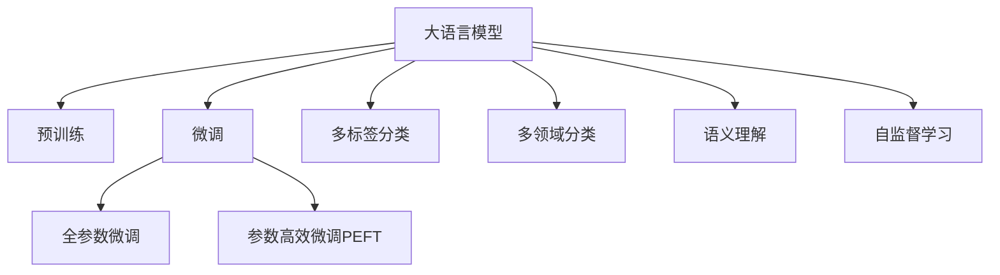

                 

# LLM对传统文本分类的挑战

> 关键词：大语言模型, 文本分类, 监督学习, 预训练, 微调, 多标签分类, 多领域分类, 语义理解

## 1. 背景介绍

### 1.1 问题由来
文本分类（Text Classification）是自然语言处理（NLP）领域中最为基础的机器学习任务之一。传统文本分类通常依赖于手动设计的特征提取器和监督学习模型，如朴素贝叶斯、支持向量机、逻辑回归等，通过特征向量和标签构建训练集，训练得到文本分类器。然而，随着深度学习技术的飞速发展，尤其是大语言模型（Large Language Models, LLMs）的出现，这一领域正经历着颠覆性的变革。

大语言模型（如BERT、GPT、RoBERTa等）通过在大规模无标签文本数据上进行自监督预训练，学习到了丰富的语言表示和语义理解能力，具备强大的文本表示能力。以BERT为例，它在大规模语料上进行预训练，学习到了词向量、上下文关系等语言特征，并通过微调的方式，对下游任务进行适应，取得了比传统方法更好的效果。

### 1.2 问题核心关键点
大语言模型对文本分类带来了哪些挑战？主要包括以下几个方面：

1. **预训练与微调**：大语言模型通常需要在特定任务上进行调整，以适应任务特定的需求。预训练-微调的过程可以充分利用已有知识，提升模型的泛化能力和性能。

2. **多标签分类**：现实世界中的许多文本分类任务都涉及多个标签，如新闻分类、情感分析等，大语言模型在处理多标签分类任务时，需要优化模型结构，使其能够同时学习多个标签。

3. **多领域分类**：文本分类任务多样，不同领域的数据特征和标签体系不同，大语言模型需要具备跨领域迁移能力，能够灵活适应不同领域的分类需求。

4. **语义理解**：传统分类方法往往依赖于词袋模型和手工特征提取，难以捕捉文本的语义关系。大语言模型通过深度神经网络，可以学习到更丰富的语义信息，提升分类效果。

5. **自监督学习**：大语言模型在预训练阶段通常采用自监督学习，如掩码语言模型（Masked Language Model, MLM）、下一句预测（Next Sentence Prediction, NSP）等，这些技术可以增强模型的语言理解能力，提高分类的准确性。

6. **高效计算**：大语言模型通常具有数十亿参数，推理和训练过程需要大量的计算资源和时间，需要优化算法和硬件设备支持。

## 2. 核心概念与联系

### 2.1 核心概念概述

为更好地理解大语言模型在文本分类中的应用，本节将介绍几个关键概念：

- **大语言模型（LLM）**：通过在大规模无标签文本数据上进行预训练，学习到丰富语言知识和表示能力的深度学习模型。典型的LLM包括BERT、GPT、RoBERTa等。

- **预训练（Pre-training）**：在大规模无标签文本数据上进行自监督学习，学习语言表示。如BERT的掩码语言模型（MLM）和下一句预测（NSP）任务。

- **微调（Fine-tuning）**：在大规模预训练模型的基础上，通过下游任务的有监督学习，进一步优化模型性能。

- **多标签分类**：文本分类任务中，一个样本可能属于多个类别。多标签分类模型需要预测一个样本属于哪些类别。

- **多领域分类**：文本分类任务种类繁多，不同领域的分类需求和特征差异较大，模型需要具备跨领域迁移能力。

- **语义理解**：理解文本的语义关系，而不仅仅是词汇层面的特征。大语言模型通过深度神经网络，可以学习到更丰富的语义信息。

这些核心概念通过以下Mermaid流程图展示其联系：



这个流程图展示了大语言模型的工作流程：

1. 大语言模型通过预训练获得基础能力。
2. 微调是对预训练模型进行任务特定的优化。
3. 多标签分类和语义理解是大语言模型需要特别关注的特性。
4. 自监督学习在预训练阶段发挥重要作用。
5. 参数高效微调和多领域分类是大语言模型微调过程中需要考虑的关键技术。

## 3. 核心算法原理 & 具体操作步骤
### 3.1 算法原理概述

大语言模型在文本分类任务中的应用，主要依赖于预训练和微调两个阶段。预训练阶段，模型通过自监督任务学习语言表示；微调阶段，模型通过下游任务的有监督学习，进一步优化分类性能。

### 3.2 算法步骤详解

**Step 1: 准备数据集**
- 收集特定领域的文本数据集，并标注好相应的类别标签。
- 数据集应划分为训练集、验证集和测试集，确保模型在未见过的数据上也能泛化良好。

**Step 2: 数据预处理**
- 对文本数据进行清洗，去除无关信息。
- 对文本进行分词、向量化处理，转换为模型能够处理的输入格式。
- 构建标签编码，将类别标签转换为模型能够理解的数值编码。

**Step 3: 模型初始化**
- 选择合适的预训练语言模型，如BERT、GPT等。
- 加载预训练权重，设置模型参数。

**Step 4: 构建模型**
- 根据任务类型，在预训练模型的基础上构建分类器。
- 对于多标签分类，通常使用sigmoid函数构建输出层。
- 对于多领域分类，模型需要具备跨领域迁移能力，可以使用注意力机制等技术。

**Step 5: 微调模型**
- 设置合适的学习率，选择优化器。
- 定义损失函数，如交叉熵损失函数。
- 使用训练集进行模型微调，在验证集上评估模型性能。
- 根据性能调整超参数，进行多轮微调迭代。

**Step 6: 模型评估和部署**
- 在测试集上评估微调后模型的性能。
- 根据需求，将模型部署到实际应用中，进行推理预测。

### 3.3 算法优缺点

大语言模型在文本分类任务中的优点包括：

- **性能优越**：通过预训练和微调，模型可以学习到丰富的语言表示，提升分类精度。
- **灵活性高**：能够处理多标签分类和多领域分类等复杂任务。
- **自适应能力**：具有跨领域迁移能力，适应不同领域的文本分类需求。
- **高效推理**：基于神经网络架构，可以高效处理大规模文本数据。

然而，大语言模型在文本分类中也存在一些缺点：

- **计算资源消耗大**：预训练和微调需要大量的计算资源，对硬件设备要求较高。
- **过拟合风险**：微调过程中容易过拟合，特别是标注样本较少时，需要优化正则化技术。
- **参数数量庞大**：大规模语言模型具有数十亿参数，推理和训练过程需要优化算法和硬件设备支持。
- **模型复杂性高**：模型结构和参数众多，调试和优化难度较大。

### 3.4 算法应用领域

大语言模型在文本分类任务中的应用非常广泛，涵盖了许多重要领域：

- **新闻分类**：将新闻文章分类为不同的主题或类别。
- **情感分析**：分析文本中的情感倾向，如正面、负面、中性等。
- **垃圾邮件过滤**：识别和过滤垃圾邮件或垃圾评论。
- **医学诊断**：分析医学文本，提取疾病信息或诊断结果。
- **法律分析**：对法律文件进行分类或标注。
- **金融分析**：分析金融新闻或公告，提取情感或事件信息。
- **社交媒体分析**：分析社交媒体内容，提取用户情感或观点。

以上应用领域只是冰山一角，随着大语言模型的不断演进，其在文本分类任务中的应用将会更加广泛和深入。

## 4. 数学模型和公式 & 详细讲解  
### 4.1 数学模型构建

大语言模型在文本分类任务中的数学模型构建，主要涉及预训练和微调两个阶段。

**预训练模型**：以BERT为例，其预训练任务包括掩码语言模型（MLM）和下一句预测（NSP）。设预训练模型为$M_{\theta}$，预训练任务的数据集为$D_{pre}$，则预训练过程的损失函数为：

$$
\mathcal{L}_{pre} = \mathcal{L}_{MLM} + \mathcal{L}_{NSP}
$$

其中，$\mathcal{L}_{MLM}$和$\mathcal{L}_{NSP}$分别为掩码语言模型和下一句预测任务的损失函数。

**微调模型**：假设文本分类任务为二分类任务，则微调模型的损失函数为：

$$
\mathcal{L}_{fine} = -\frac{1}{N}\sum_{i=1}^N (y_i \log \hat{y}_i + (1-y_i) \log (1-\hat{y}_i))
$$

其中，$y_i$为样本的真实标签，$\hat{y}_i$为模型预测的概率。

### 4.2 公式推导过程

以BERT为代表的预训练模型，采用掩码语言模型和下一句预测任务进行训练。掩码语言模型的目标是预测被掩码的单词，下一句预测任务是判断两个句子是否相邻。以下是掩码语言模型和下一句预测任务的详细推导：

**掩码语言模型（MLM）**
- 输入一个句子$x=\{x_1, \ldots, x_n\}$，其中$x_i$表示第$i$个单词。
- 将句子$x$随机掩码一部分单词，得到一个掩码序列$\tilde{x}=\{ \tilde{x}_1, \ldots, \tilde{x}_n \}$，其中$\tilde{x}_i=x_i$或[MASK]，[MASK]表示掩码。
- 模型需要预测每个[MASK]对应的真实单词。
- 目标函数为：

$$
\mathcal{L}_{MLM} = -\sum_{i=1}^n \log P(x_i | M_{\theta}(\tilde{x}_i))
$$

其中，$P(x_i | M_{\theta}(\tilde{x}_i))$表示模型在掩码序列$\tilde{x}_i$下预测单词$x_i$的概率。

**下一句预测（NSP）**
- 输入两个句子$x_i=\{x_{i-1}, x_i\}$，模型需要判断$x_{i-1}$和$x_i$是否相邻。
- 对于两个句子，模型分别预测其对应的下一个句子，即预测$x_{i+1}$或$x_{i-1}$。
- 目标函数为：

$$
\mathcal{L}_{NSP} = -\frac{1}{2N}\sum_{i=1}^N (y_{i+1} \log P(x_i | M_{\theta}(x_{i-1})) + y_{i-1} \log P(x_{i+1} | M_{\theta}(x_i))
$$

其中，$y_{i+1}$和$y_{i-1}$分别为$x_{i-1}$和$x_i$是否相邻的标签，$P(x_i | M_{\theta}(x_{i-1}))$表示模型在$x_{i-1}$下预测下一个句子$x_i$的概率。

### 4.3 案例分析与讲解

以医疗领域的文本分类为例，分析大语言模型在特定领域文本分类中的应用。

**数据集**：收集医学领域的论文、病例报告、医生评论等文本数据，并标注好相应的医疗分类标签。

**预训练模型**：使用BERT等大语言模型在预训练数据集上进行预训练。

**微调模型**：构建多标签分类器，如使用sigmoid函数进行输出层设计，构建交叉熵损失函数。在微调过程中，设置合适的学习率和正则化参数。

**案例分析**：
- **输入处理**：将文本进行分词和向量化处理，转换为模型能够接受的输入格式。
- **模型构建**：在BERT的基础上，构建多标签分类器，如使用sigmoid函数进行输出层设计。
- **微调过程**：使用训练集进行模型微调，在验证集上评估模型性能，根据性能调整学习率和正则化参数，进行多轮微调迭代。
- **测试与部署**：在测试集上评估微调后模型的性能，将模型部署到实际应用中，进行推理预测。

## 5. 项目实践：代码实例和详细解释说明
### 5.1 开发环境搭建

在进行文本分类项目实践前，我们需要准备好开发环境。以下是使用Python进行PyTorch开发的环境配置流程：

1. 安装Anaconda：从官网下载并安装Anaconda，用于创建独立的Python环境。

2. 创建并激活虚拟环境：
```bash
conda create -n pytorch-env python=3.8 
conda activate pytorch-env
```

3. 安装PyTorch：根据CUDA版本，从官网获取对应的安装命令。例如：
```bash
conda install pytorch torchvision torchaudio cudatoolkit=11.1 -c pytorch -c conda-forge
```

4. 安装Transformers库：
```bash
pip install transformers
```

5. 安装各类工具包：
```bash
pip install numpy pandas scikit-learn matplotlib tqdm jupyter notebook ipython
```

完成上述步骤后，即可在`pytorch-env`环境中开始文本分类项目实践。

### 5.2 源代码详细实现

这里我们以多标签分类任务为例，给出使用Transformers库对BERT模型进行文本分类的PyTorch代码实现。

首先，定义数据处理函数：

```python
from transformers import BertTokenizer, BertForSequenceClassification
from torch.utils.data import Dataset, DataLoader
from sklearn.metrics import classification_report
import torch

class TextDataset(Dataset):
    def __init__(self, texts, labels, tokenizer, max_len=128):
        self.texts = texts
        self.labels = labels
        self.tokenizer = tokenizer
        self.max_len = max_len
        
    def __len__(self):
        return len(self.texts)
    
    def __getitem__(self, item):
        text = self.texts[item]
        labels = self.labels[item]
        
        encoding = self.tokenizer(text, return_tensors='pt', max_length=self.max_len, padding='max_length', truncation=True)
        input_ids = encoding['input_ids'][0]
        attention_mask = encoding['attention_mask'][0]
        
        # 对token-wise的标签进行编码
        encoded_labels = [tag2id[tag] for tag in labels] 
        encoded_labels.extend([tag2id['O']] * (self.max_len - len(encoded_labels)))
        labels = torch.tensor(encoded_labels, dtype=torch.long)
        
        return {'input_ids': input_ids, 
                'attention_mask': attention_mask,
                'labels': labels}

# 标签与id的映射
tag2id = {'O': 0, 'LABEL1': 1, 'LABEL2': 2, 'LABEL3': 3}
id2tag = {v: k for k, v in tag2id.items()}

# 创建dataset
tokenizer = BertTokenizer.from_pretrained('bert-base-cased')

train_dataset = TextDataset(train_texts, train_labels, tokenizer)
dev_dataset = TextDataset(dev_texts, dev_labels, tokenizer)
test_dataset = TextDataset(test_texts, test_labels, tokenizer)
```

然后，定义模型和优化器：

```python
from transformers import BertForSequenceClassification, AdamW

model = BertForSequenceClassification.from_pretrained('bert-base-cased', num_labels=len(tag2id))

optimizer = AdamW(model.parameters(), lr=2e-5)
```

接着，定义训练和评估函数：

```python
from tqdm import tqdm

device = torch.device('cuda') if torch.cuda.is_available() else torch.device('cpu')
model.to(device)

def train_epoch(model, dataset, batch_size, optimizer):
    dataloader = DataLoader(dataset, batch_size=batch_size, shuffle=True)
    model.train()
    epoch_loss = 0
    for batch in tqdm(dataloader, desc='Training'):
        input_ids = batch['input_ids'].to(device)
        attention_mask = batch['attention_mask'].to(device)
        labels = batch['labels'].to(device)
        model.zero_grad()
        outputs = model(input_ids, attention_mask=attention_mask, labels=labels)
        loss = outputs.loss
        epoch_loss += loss.item()
        loss.backward()
        optimizer.step()
    return epoch_loss / len(dataloader)

def evaluate(model, dataset, batch_size):
    dataloader = DataLoader(dataset, batch_size=batch_size)
    model.eval()
    preds, labels = [], []
    with torch.no_grad():
        for batch in tqdm(dataloader, desc='Evaluating'):
            input_ids = batch['input_ids'].to(device)
            attention_mask = batch['attention_mask'].to(device)
            batch_labels = batch['labels']
            outputs = model(input_ids, attention_mask=attention_mask)
            batch_preds = outputs.logits.argmax(dim=2).to('cpu').tolist()
            batch_labels = batch_labels.to('cpu').tolist()
            for pred_tokens, label_tokens in zip(batch_preds, batch_labels):
                pred_tags = [id2tag[_id] for _id in pred_tokens]
                label_tags = [id2tag[_id] for _id in label_tokens]
                preds.append(pred_tags[:len(label_tags)])
                labels.append(label_tags)
                
    print(classification_report(labels, preds))
```

最后，启动训练流程并在测试集上评估：

```python
epochs = 5
batch_size = 16

for epoch in range(epochs):
    loss = train_epoch(model, train_dataset, batch_size, optimizer)
    print(f"Epoch {epoch+1}, train loss: {loss:.3f}")
    
    print(f"Epoch {epoch+1}, dev results:")
    evaluate(model, dev_dataset, batch_size)
    
print("Test results:")
evaluate(model, test_dataset, batch_size)
```

以上就是使用PyTorch对BERT进行多标签分类任务开发的完整代码实现。可以看到，得益于Transformers库的强大封装，我们可以用相对简洁的代码完成BERT模型的加载和微调。

### 5.3 代码解读与分析

让我们再详细解读一下关键代码的实现细节：

**TextDataset类**：
- `__init__`方法：初始化文本、标签、分词器等关键组件。
- `__len__`方法：返回数据集的样本数量。
- `__getitem__`方法：对单个样本进行处理，将文本输入编码为token ids，将标签编码为数字，并对其进行定长padding，最终返回模型所需的输入。

**tag2id和id2tag字典**：
- 定义了标签与数字id之间的映射关系，用于将token-wise的预测结果解码回真实的标签。

**训练和评估函数**：
- 使用PyTorch的DataLoader对数据集进行批次化加载，供模型训练和推理使用。
- 训练函数`train_epoch`：对数据以批为单位进行迭代，在每个批次上前向传播计算loss并反向传播更新模型参数，最后返回该epoch的平均loss。
- 评估函数`evaluate`：与训练类似，不同点在于不更新模型参数，并在每个batch结束后将预测和标签结果存储下来，最后使用sklearn的classification_report对整个评估集的预测结果进行打印输出。

**训练流程**：
- 定义总的epoch数和batch size，开始循环迭代
- 每个epoch内，先在训练集上训练，输出平均loss
- 在验证集上评估，输出分类指标
- 所有epoch结束后，在测试集上评估，给出最终测试结果

可以看到，PyTorch配合Transformers库使得BERT文本分类的代码实现变得简洁高效。开发者可以将更多精力放在数据处理、模型改进等高层逻辑上，而不必过多关注底层的实现细节。

当然，工业级的系统实现还需考虑更多因素，如模型的保存和部署、超参数的自动搜索、更灵活的任务适配层等。但核心的微调范式基本与此类似。

## 6. 实际应用场景
### 6.1 新闻分类

新闻分类是文本分类任务中最典型的应用之一。新闻通常包含丰富的信息，通过文本分类可以将新闻文章分为政治、经济、体育等不同类别。大语言模型在新闻分类任务中，可以通过微调直接适应新闻数据的分类需求，取得优异的分类效果。

在实际应用中，大语言模型可以通过以下步骤进行新闻分类：

1. 收集新闻网站的文章数据集，并进行人工标注。
2. 对新闻文章进行预处理，如去除停用词、分词等。
3. 使用BERT等大语言模型进行预训练，学习语言表示。
4. 构建新闻分类模型，如使用sigmoid函数进行输出层设计。
5. 在新闻数据集上进行微调，优化分类器。
6. 在验证集上评估模型性能，调整超参数。
7. 在测试集上评估模型性能，将模型部署到实际应用中，进行推理预测。

### 6.2 情感分析

情感分析是文本分类任务的另一个典型应用，旨在分析文本中的情感倾向，如正面、负面、中性等。通过情感分析，可以了解公众对某一事件或产品的情感态度，为品牌营销、舆情监测等提供重要信息。

大语言模型在情感分析任务中，可以通过微调直接适应情感数据集的分类需求，取得优异的分类效果。具体步骤包括：

1. 收集情感评论、社交媒体帖子等文本数据集，并进行人工标注。
2. 对情感文本进行预处理，如去除停用词、分词等。
3. 使用BERT等大语言模型进行预训练，学习语言表示。
4. 构建情感分类模型，如使用sigmoid函数进行输出层设计。
5. 在情感数据集上进行微调，优化分类器。
6. 在验证集上评估模型性能，调整超参数。
7. 在测试集上评估模型性能，将模型部署到实际应用中，进行推理预测。

### 6.3 垃圾邮件过滤

垃圾邮件过滤是文本分类任务中的一个重要应用。通过文本分类，可以将垃圾邮件识别出来，并进行过滤，保护用户免受垃圾邮件的干扰。

大语言模型在垃圾邮件过滤任务中，可以通过微调直接适应垃圾邮件数据的分类需求，取得优异的分类效果。具体步骤包括：

1. 收集垃圾邮件和非垃圾邮件的文本数据集，并进行人工标注。
2. 对邮件文本进行预处理，如去除停用词、分词等。
3. 使用BERT等大语言模型进行预训练，学习语言表示。
4. 构建垃圾邮件分类模型，如使用sigmoid函数进行输出层设计。
5. 在垃圾邮件数据集上进行微调，优化分类器。
6. 在验证集上评估模型性能，调整超参数。
7. 在测试集上评估模型性能，将模型部署到实际应用中，进行推理预测。

### 6.4 未来应用展望

随着大语言模型的不断发展，其在文本分类任务中的应用将会更加广泛和深入。未来可能的新趋势包括：

1. **多领域分类**：大语言模型可以适应不同领域的分类需求，如医疗、法律、金融等。通过微调，模型可以学习到特定领域的知识，提升分类效果。
2. **多标签分类**：现实世界中的许多分类任务涉及多个标签，如新闻分类、情感分析等。大语言模型可以处理多标签分类任务，预测一个样本属于哪些类别。
3. **实时分类**：大语言模型可以实时对新文本进行分类，如社交媒体舆情监测等。通过在线微调，模型可以不断更新，适应新数据分布。
4. **跨语言分类**：大语言模型可以处理不同语言的文本分类任务。通过多语言预训练和微调，模型可以适应多种语言环境。
5. **多模态分类**：大语言模型可以处理多种模态数据的分类任务，如图像、语音、视频等。通过多模态融合，模型可以更全面地理解文本信息。

这些新趋势将推动大语言模型在文本分类任务中的广泛应用，带来更多创新和突破。

## 7. 工具和资源推荐
### 7.1 学习资源推荐

为了帮助开发者系统掌握大语言模型在文本分类中的应用，这里推荐一些优质的学习资源：

1. 《Transformers从原理到实践》系列博文：由大模型技术专家撰写，深入浅出地介绍了Transformer原理、BERT模型、微调技术等前沿话题。

2. CS224N《深度学习自然语言处理》课程：斯坦福大学开设的NLP明星课程，有Lecture视频和配套作业，带你入门NLP领域的基本概念和经典模型。

3. 《Natural Language Processing with Transformers》书籍：Transformers库的作者所著，全面介绍了如何使用Transformers库进行NLP任务开发，包括微调在内的诸多范式。

4. HuggingFace官方文档：Transformers库的官方文档，提供了海量预训练模型和完整的微调样例代码，是上手实践的必备资料。

5. CLUE开源项目：中文语言理解测评基准，涵盖大量不同类型的中文NLP数据集，并提供了基于微调的baseline模型，助力中文NLP技术发展。

通过对这些资源的学习实践，相信你一定能够快速掌握大语言模型在文本分类任务中的应用，并用于解决实际的NLP问题。
###  7.2 开发工具推荐

高效的开发离不开优秀的工具支持。以下是几款用于大语言模型文本分类开发的常用工具：

1. PyTorch：基于Python的开源深度学习框架，灵活动态的计算图，适合快速迭代研究。大部分预训练语言模型都有PyTorch版本的实现。

2. TensorFlow：由Google主导开发的开源深度学习框架，生产部署方便，适合大规模工程应用。同样有丰富的预训练语言模型资源。

3. Transformers库：HuggingFace开发的NLP工具库，集成了众多SOTA语言模型，支持PyTorch和TensorFlow，是进行文本分类任务的开发利器。

4. Weights & Biases：模型训练的实验跟踪工具，可以记录和可视化模型训练过程中的各项指标，方便对比和调优。与主流深度学习框架无缝集成。

5. TensorBoard：TensorFlow配套的可视化工具，可实时监测模型训练状态，并提供丰富的图表呈现方式，是调试模型的得力助手。

6. Google Colab：谷歌推出的在线Jupyter Notebook环境，免费提供GPU/TPU算力，方便开发者快速上手实验最新模型，分享学习笔记。

合理利用这些工具，可以显著提升大语言模型在文本分类任务中的开发效率，加快创新迭代的步伐。

### 7.3 相关论文推荐

大语言模型在文本分类任务中的应用源于学界的持续研究。以下是几篇奠基性的相关论文，推荐阅读：

1. Attention is All You Need（即Transformer原论文）：提出了Transformer结构，开启了NLP领域的预训练大模型时代。

2. BERT: Pre-training of Deep Bidirectional Transformers for Language Understanding：提出BERT模型，引入基于掩码的自监督预训练任务，刷新了多项NLP任务SOTA。

3. Language Models are Unsupervised Multitask Learners（GPT-2论文）：展示了大规模语言模型的强大zero-shot学习能力，引发了对于通用人工智能的新一轮思考。

4. Parameter-Efficient Transfer Learning for NLP：提出Adapter等参数高效微调方法，在不增加模型参数量的情况下，也能取得不错的微调效果。

5. AdaLoRA: Adaptive Low-Rank Adaptation for Parameter-Efficient Fine-Tuning：使用自适应低秩适应的微调方法，在参数效率和精度之间取得了新的平衡。

这些论文代表了大语言模型在文本分类任务中的应用进展，通过学习这些前沿成果，可以帮助研究者把握学科前进方向，激发更多的创新灵感。

## 8. 总结：未来发展趋势与挑战

### 8.1 总结

本文对大语言模型在文本分类任务中的应用进行了全面系统的介绍。首先阐述了大语言模型和微调技术的研究背景和意义，明确了微调在拓展预训练模型应用、提升分类性能方面的独特价值。其次，从原理到实践，详细讲解了监督微调的数学原理和关键步骤，给出了文本分类任务开发的完整代码实例。同时，本文还广泛探讨了文本分类任务在大语言模型中的各种应用，展示了微调范式的巨大潜力。

通过本文的系统梳理，可以看到，大语言模型在文本分类任务中的应用前景广阔，可以解决许多传统文本分类方法难以处理的复杂问题。未来，伴随大语言模型和微调方法的持续演进，相信文本分类技术必将在更多领域得到广泛应用，为各行各业带来深刻的变革。

### 8.2 未来发展趋势

展望未来，大语言模型在文本分类任务中的发展趋势将呈现以下几个方向：

1. **模型规模持续增大**：随着算力成本的下降和数据规模的扩张，预训练语言模型的参数量还将持续增长。超大规模语言模型蕴含的丰富语言知识，有望支撑更加复杂多变的文本分类任务。

2. **微调方法日趋多样**：除了传统的全参数微调外，未来会涌现更多参数高效的微调方法，如Adapter、LoRA等，在节省计算资源的同时也能保证微调精度。

3. **自监督学习与监督学习相结合**：未来的微调方法将更多地结合自监督学习，如预训练-微调-下游任务优化（PLATO）范式，进一步提升模型的泛化能力和性能。

4. **持续学习成为常态**：随着数据分布的不断变化，微调模型也需要持续学习新知识以保持性能。如何在不遗忘原有知识的同时，高效吸收新样本信息，将成为重要的研究课题。

5. **零样本学习（Zero-shot Learning）**：利用大语言模型的零样本学习能力，通过文本描述直接进行分类，无需标注数据和微调过程，实现真正的自适应学习。

6. **多模态融合**：文本分类任务不仅仅涉及文本数据，未来将更多地融合图像、语音、视频等多模态信息，提升模型的跨模态理解和分类能力。

以上趋势凸显了大语言模型在文本分类任务中的广阔前景。这些方向的探索发展，必将进一步提升文本分类系统的性能和应用范围，为各行各业带来更多创新和突破。

### 8.3 面临的挑战

尽管大语言模型在文本分类任务中取得了显著成就，但在迈向更加智能化、普适化应用的过程中，仍面临诸多挑战：

1. **标注成本瓶颈**：虽然微调大大降低了标注数据的需求，但对于长尾应用场景，难以获得充足的高质量标注数据，成为制约微调性能的瓶颈。如何进一步降低微调对标注样本的依赖，将是一大难题。

2. **模型鲁棒性不足**：当前微调模型面对域外数据时，泛化性能往往大打折扣。对于测试样本的微小扰动，微调模型的预测也容易发生波动。如何提高微调模型的鲁棒性，避免灾难性遗忘，还需要更多理论和实践的积累。

3. **推理效率有待提高**：大规模语言模型虽然精度高，但在实际部署时往往面临推理速度慢、内存占用大等效率问题。如何在保证性能的同时，简化模型结构，提升推理速度，优化资源占用，将是重要的优化方向。

4. **可解释性亟需加强**：当前微调模型更像是"黑盒"系统，难以解释其内部工作机制和决策逻辑。对于医疗、金融等高风险应用，算法的可解释性和可审计性尤为重要。如何赋予微调模型更强的可解释性，将是亟待攻克的难题。

5. **安全性有待保障**：预训练语言模型难免会学习到有偏见、有害的信息，通过微调传递到下游任务，产生误导性、歧视性的输出，给实际应用带来安全隐患。如何从数据和算法层面消除模型偏见，避免恶意用途，确保输出的安全性，也将是重要的研究课题。

6. **知识整合能力不足**：现有的微调模型往往局限于任务内数据，难以灵活吸收和运用更广泛的先验知识。如何让微调过程更好地与外部知识库、规则库等专家知识结合，形成更加全面、准确的信息整合能力，还有很大的想象空间。

正视微调面临的这些挑战，积极应对并寻求突破，将是大语言模型微调走向成熟的必由之路。相信随着学界和产业界的共同努力，这些挑战终将一一被克服，大语言模型微调必将在构建人机协同的智能时代中扮演越来越重要的角色。

### 8.4 研究展望

面对大语言模型在文本分类任务中面临的种种挑战，未来的研究需要在以下几个方面寻求新的突破：

1. **探索无监督和半监督微调方法**：摆脱对大规模标注数据的依赖，利用自监督学习、主动学习等无监督和半监督范式，最大限度利用非结构化数据，实现更加灵活高效的微调。

2. **研究参数高效和计算高效的微调范式**：开发更加参数高效的微调方法，在固定大部分预训练参数的同时，只更新极少量的任务相关参数。同时优化微调模型的计算图，减少前向传播和反向传播的资源消耗，实现更加轻量级、实时性的部署。

3. **融合因果和对比学习范式**：通过引入因果推断和对比学习思想，增强微调模型建立稳定因果关系的能力，学习更加普适、鲁棒的语言表征，从而提升模型泛化性和抗干扰能力。

4. **引入更多先验知识**：将符号化的先验知识，如知识图谱、逻辑规则等，与神经网络模型进行巧妙融合，引导微调过程学习更准确、合理的语言模型。同时加强不同模态数据的整合，实现视觉、语音等多模态信息与文本信息的协同建模。

5. **结合因果分析和博弈论工具**：将因果分析方法引入微调模型，识别出模型决策的关键特征，增强输出解释的因果性和逻辑性。借助博弈论工具刻画人机交互过程，主动探索并规避模型的脆弱点，提高系统稳定性。

6. **纳入伦理道德约束**：在模型训练目标中引入伦理导向的评估指标，过滤和惩罚有偏见、有害的输出倾向。同时加强人工干预和审核，建立模型行为的监管机制，确保输出符合人类价值观和伦理道德。

这些研究方向的探索，必将引领大语言模型在文本分类任务中的进一步发展，为构建安全、可靠、可解释、可控的智能系统铺平道路。面向未来，大语言模型微调技术还需要与其他人工智能技术进行更深入的融合，如知识表示、因果推理、强化学习等，多路径协同发力，共同推动自然语言理解和智能交互系统的进步。只有勇于创新、敢于突破，才能不断拓展语言模型的边界，让智能技术更好地造福人类社会。

## 9. 附录：常见问题与解答

**Q1：大语言模型在文本分类任务中的性能如何？**

A: 大语言模型在文本分类任务中通常具有优越的性能。通过预训练-微调范式，模型可以学习到丰富的语言表示和语义理解能力，提升分类精度。特别是多标签分类和多领域分类等复杂任务，大语言模型通过微调可以取得更好的效果。

**Q2：大语言模型在文本分类任务中如何处理多标签分类？**

A: 大语言模型在处理多标签分类任务时，通常使用sigmoid函数进行输出层设计，构建交叉熵损失函数。在微调过程中，模型需要同时预测一个样本属于哪些标签，标签之间采用"softmax"函数进行归一化。

**Q3：大语言模型在文本分类任务中如何处理多领域分类？**

A: 大语言模型在处理多领域分类任务时，需要具备跨领域迁移能力。模型可以通过注意力机制、多任务学习等技术，学习到不同领域的语言表示。在微调过程中，模型可以学习特定领域的知识，提升分类效果。

**Q4：大语言模型在文本分类任务中如何进行多模态分类？**

A: 大语言模型在处理多模态分类任务时，可以融合图像、语音、视频等多模态信息。通过多模态数据增强、多模态特征融合等技术，模型可以更全面地理解文本信息，提升分类效果。

**Q5：大语言模型在文本分类任务中如何进行持续学习？**

A: 大语言模型在文本分类任务中进行持续学习，可以通过在线微调、增量学习等技术，不断更新模型参数，适应新数据分布。模型还可以结合知识图谱、规则库等外部知识，进行知识增强和模型更新。

这些问题的解答，可以帮助开发者更好地理解大语言模型在文本分类任务中的应用，并指导实际开发工作。

---

作者：禅与计算机程序设计艺术 / Zen and the Art of Computer Programming

