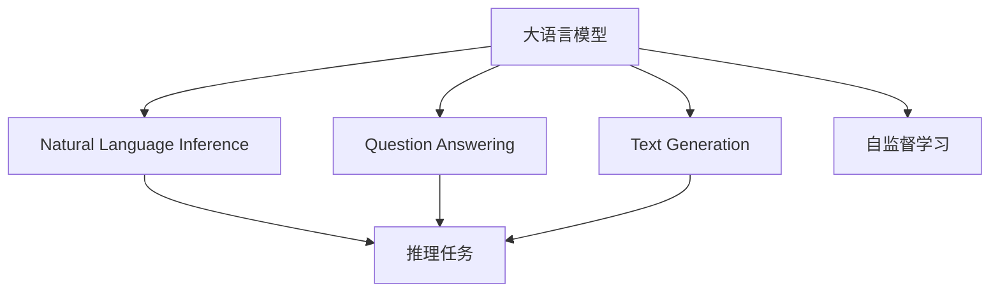

                 

# LLM的推理能力：超越传统逻辑运算

大语言模型（Large Language Model, LLM）作为人工智能领域的一支劲旅，近年来因其卓越的自然语言处理能力而广受瞩目。它们不仅能够生成高质量的文本，还能进行复杂的推理，展现了超越传统逻辑运算的强大潜力。本文将深入探讨LLM的推理能力，揭示其背后的算法原理，并展示其在实际应用场景中的卓越表现。

## 1. 背景介绍

### 1.1 问题由来

传统逻辑运算主要基于符号推理和布尔逻辑，依赖于明确的规则和逻辑结构。然而，自然语言中充满着模糊、隐喻、背景知识等复杂现象，传统逻辑运算难以捕捉和表达。大语言模型通过大量文本数据的预训练，学习到了丰富的语言知识和语义表示，能够处理复杂的自然语言推理任务，提供超越传统逻辑运算的解决方案。

### 1.2 问题核心关键点

大语言模型的推理能力，体现在其在自然语言推理(Natural Language Inference, NLI)、问答(Question Answering, QA)、文本生成(Text Generation)等多种任务上的表现。其核心在于：

1. 强大的语义理解能力：通过预训练模型学习到丰富的语言知识，能够理解复杂的语境和语义关系。
2. 先进的编码器-解码器结构：Transformer等架构使得模型能够高效处理长距离依赖，捕捉上下文信息。
3. 高效的自监督学习方法：通过掩码语言模型、next sentence prediction等自监督任务，提升模型的泛化能力。
4. 灵活的参数共享策略：通过参数共享减少模型复杂度，提高推理效率。
5. 上下文敏感的推理机制：模型能够利用上下文信息，做出合理推断，甚至解决一些传统逻辑无法解决的问题。

### 1.3 问题研究意义

大语言模型的推理能力，不仅提升了NLP任务的性能，也为人工智能的通用性和智能化提供了新思路。其在多领域的应用，如医疗诊断、金融预测、智能客服等，展示了人工智能技术在各行各业的巨大潜力和应用前景。

## 2. 核心概念与联系

### 2.1 核心概念概述

为了更好地理解LLM的推理能力，本节将介绍几个密切相关的核心概念：

- 大语言模型（Large Language Model, LLM）：通过自监督学习任务预训练的大型神经网络模型，具备强大的语言理解和生成能力。
- 自然语言推理（Natural Language Inference, NLI）：判断给定前提和假设之间关系的任务，如蕴含、矛盾、中立等。
- 问答系统（Question Answering, QA）：根据用户问题，从文本中提取或生成答案的任务。
- 文本生成（Text Generation）：根据给定的文本条件，生成新的文本序列的任务，如对话生成、摘要生成等。
- 自监督学习（Self-supervised Learning）：使用无标签数据进行训练，使模型自发学习到语言的隐含知识。

这些核心概念之间的逻辑关系可以通过以下Mermaid流程图来展示：



这个流程图展示了大语言模型的核心概念及其之间的关系：

1. 大语言模型通过自监督学习任务获得基础的语言知识。
2. 自然语言推理、问答系统和文本生成等任务，都是基于大语言模型的推理能力。
3. 推理能力可以理解为大语言模型的一种特殊能力，即在特定语境下做出合理推断。

## 3. 核心算法原理 & 具体操作步骤

### 3.1 算法原理概述

LLM的推理能力，主要源于其强大的自监督预训练和微调过程。下面我们将详细介绍这两个过程的算法原理。

#### 3.1.1 自监督预训练

自监督预训练是指使用大规模无标签文本数据，通过掩码语言模型、next sentence prediction等任务，训练通用语言模型。以BERT为例，其预训练过程包括：

1. 掩码语言模型（Masked Language Modeling, MLM）：输入文本中随机掩码部分词语，预测被掩码词语。
2. 下一句预测（Next Sentence Prediction, NSP）：随机两个句子，判断它们是否连续出现。

通过这些自监督任务，模型学习到了丰富的语言知识，包括词汇、句法、语义等。预训练过程中，模型通过优化损失函数，不断调整模型参数，提升对语言规律的掌握能力。

#### 3.1.2 微调过程

微调过程是在预训练模型的基础上，使用特定任务的数据集进行有监督学习，进一步优化模型的推理能力。以NLI任务为例，其微调过程包括：

1. 数据准备：收集大量标注好的NLI数据集，包括前提（Premise）和假设（Hypothesis）两部分的文本。
2. 模型构建：在预训练模型的基础上，添加适当的推理头，如分类器、回归器等。
3. 模型训练：使用标注数据训练模型，最小化推理任务上的损失函数。

### 3.2 算法步骤详解

#### 3.2.1 自监督预训练步骤

1. 数据准备：收集大规模无标签文本数据。
2. 模型定义：定义神经网络模型结构，如Transformer、BERT等。
3. 任务定义：定义掩码语言模型和下一句预测任务。
4. 训练过程：在预训练数据上进行前向传播，计算损失函数，反向传播更新模型参数。
5. 参数保存：保存训练好的模型参数，供微调使用。

#### 3.2.2 微调步骤

1. 数据准备：准备下游任务的标注数据集。
2. 模型加载：加载预训练好的模型。
3. 任务适配：定义推理任务，如分类、回归、生成等。
4. 损失定义：定义适当的损失函数，如交叉熵损失、F1分数等。
5. 模型训练：在微调数据集上进行训练，最小化推理任务上的损失函数。
6. 参数保存：保存微调后的模型参数，供推理使用。

### 3.3 算法优缺点

大语言模型的推理能力具有以下优点：

1. 能够处理复杂语境：LLM在预训练过程中学习了丰富的语言知识，能够处理模糊、隐喻等复杂的语境。
2. 具备上下文敏感性：LLM在推理过程中能够考虑上下文信息，做出合理推断。
3. 高效处理长距离依赖：Transformer等架构能够高效处理长距离依赖，捕捉上下文信息。
4. 高度可扩展性：LLM可以通过微调适应各种任务，提升任务性能。

同时，也存在一些缺点：

1. 依赖于预训练数据：LLM的推理能力依赖于预训练数据的质量，数据偏差可能影响模型性能。
2. 推理过程缺乏可解释性：LLM的推理过程类似黑盒，难以解释其内部工作机制。
3. 计算资源消耗大：大规模LLM的推理计算资源消耗大，推理速度较慢。
4. 泛化能力不足：LLM在未见过的数据上可能表现不佳，泛化能力有待提高。

### 3.4 算法应用领域

大语言模型的推理能力广泛应用于多个领域，如自然语言推理、问答系统、文本生成等。

#### 3.4.1 自然语言推理

自然语言推理任务要求模型能够判断前提和假设之间的关系，如蕴含、矛盾、中立等。LLM通过预训练和微调，能够处理复杂的多模态信息，如文本、图像等，从而实现自然语言推理任务。

#### 3.4.2 问答系统

问答系统要求模型能够根据用户的问题，从文本中提取或生成答案。LLM在预训练过程中学习了大量的知识，能够快速理解用户意图，并从上下文中提取相关信息。

#### 3.4.3 文本生成

文本生成任务要求模型能够根据给定的文本条件，生成新的文本序列。LLM通过预训练和微调，能够生成高质量、连贯的文本，广泛应用于对话生成、摘要生成等任务。

## 4. 数学模型和公式 & 详细讲解 & 举例说明

### 4.1 数学模型构建

在NLI任务中，我们以BERT为例，定义推理模型：

1. 输入：包含前提（Premise）和假设（Hypothesis）的文本序列。
2. 输出：两个向量表示前提和假设的语义表示，通过分类器输出关系标签。
3. 损失函数：交叉熵损失函数，用于衡量模型预测结果与真实标签的差异。

### 4.2 公式推导过程

以自然语言推理任务为例，我们推导BERT的推理模型：

1. 定义输入：假设前提和假设的文本序列为 $P$ 和 $H$。
2. 输入嵌入：使用BERT编码器将 $P$ 和 $H$ 转换为向量表示。
3. 上下文表示：通过BERT模型中的self-attention机制，计算上下文表示 $C_P$ 和 $C_H$。
4. 分类器输出：通过全连接层计算出分类器的输出 $S$，最后通过softmax层输出关系标签的概率分布。

### 4.3 案例分析与讲解

以情感分类任务为例，展示LLM的推理过程：

1. 数据准备：收集标注好的情感分类数据集。
2. 模型加载：加载预训练好的BERT模型。
3. 任务适配：定义情感分类任务，添加适当的输出层。
4. 损失定义：定义交叉熵损失函数。
5. 模型训练：在标注数据集上进行训练，最小化损失函数。
6. 推理输出：使用训练好的模型对新文本进行情感分类。

## 5. 项目实践：代码实例和详细解释说明

### 5.1 开发环境搭建

在进行LLM推理能力实践前，我们需要准备好开发环境。以下是使用Python进行PyTorch开发的环境配置流程：

1. 安装Anaconda：从官网下载并安装Anaconda，用于创建独立的Python环境。

2. 创建并激活虚拟环境：
```bash
conda create -n pytorch-env python=3.8 
conda activate pytorch-env
```

3. 安装PyTorch：根据CUDA版本，从官网获取对应的安装命令。例如：
```bash
conda install pytorch torchvision torchaudio cudatoolkit=11.1 -c pytorch -c conda-forge
```

4. 安装Transformers库：
```bash
pip install transformers
```

5. 安装各类工具包：
```bash
pip install numpy pandas scikit-learn matplotlib tqdm jupyter notebook ipython
```

完成上述步骤后，即可在`pytorch-env`环境中开始推理能力实践。

### 5.2 源代码详细实现

这里我们以情感分类任务为例，展示LLM在情感分类上的应用。

首先，定义情感分类任务的数据处理函数：

```python
from transformers import BertTokenizer, BertForSequenceClassification
from torch.utils.data import Dataset
import torch

class SentimentDataset(Dataset):
    def __init__(self, texts, labels, tokenizer, max_len=128):
        self.texts = texts
        self.labels = labels
        self.tokenizer = tokenizer
        self.max_len = max_len
        
    def __len__(self):
        return len(self.texts)
    
    def __getitem__(self, item):
        text = self.texts[item]
        label = self.labels[item]
        
        encoding = self.tokenizer(text, return_tensors='pt', max_length=self.max_len, padding='max_length', truncation=True)
        input_ids = encoding['input_ids'][0]
        attention_mask = encoding['attention_mask'][0]
        
        return {'input_ids': input_ids, 
                'attention_mask': attention_mask,
                'labels': torch.tensor(label, dtype=torch.long)}
```

然后，定义模型和优化器：

```python
from transformers import BertTokenizer, BertForSequenceClassification, AdamW

model = BertForSequenceClassification.from_pretrained('bert-base-cased', num_labels=2)

optimizer = AdamW(model.parameters(), lr=2e-5)
```

接着，定义训练和推理函数：

```python
from torch.utils.data import DataLoader
from tqdm import tqdm

device = torch.device('cuda') if torch.cuda.is_available() else torch.device('cpu')
model.to(device)

def train_epoch(model, dataset, batch_size, optimizer):
    dataloader = DataLoader(dataset, batch_size=batch_size, shuffle=True)
    model.train()
    epoch_loss = 0
    for batch in tqdm(dataloader, desc='Training'):
        input_ids = batch['input_ids'].to(device)
        attention_mask = batch['attention_mask'].to(device)
        labels = batch['labels'].to(device)
        model.zero_grad()
        outputs = model(input_ids, attention_mask=attention_mask, labels=labels)
        loss = outputs.loss
        epoch_loss += loss.item()
        loss.backward()
        optimizer.step()
    return epoch_loss / len(dataloader)

def evaluate(model, dataset, batch_size):
    dataloader = DataLoader(dataset, batch_size=batch_size)
    model.eval()
    preds, labels = [], []
    with torch.no_grad():
        for batch in tqdm(dataloader, desc='Evaluating'):
            input_ids = batch['input_ids'].to(device)
            attention_mask = batch['attention_mask'].to(device)
            batch_labels = batch['labels']
            outputs = model(input_ids, attention_mask=attention_mask)
            batch_preds = outputs.logits.argmax(dim=1).to('cpu').tolist()
            batch_labels = batch_labels.to('cpu').tolist()
            for pred, label in zip(batch_preds, batch_labels):
                preds.append(pred)
                labels.append(label)
                
    print(f"Accuracy: {torch.tensor(labels) == torch.tensor(preds)}.sum().item() / len(labels)")
```

最后，启动训练流程并在测试集上评估：

```python
epochs = 5
batch_size = 16

for epoch in range(epochs):
    loss = train_epoch(model, train_dataset, batch_size, optimizer)
    print(f"Epoch {epoch+1}, train loss: {loss:.3f}")
    
    print(f"Epoch {epoch+1}, dev results:")
    evaluate(model, dev_dataset, batch_size)
    
print("Test results:")
evaluate(model, test_dataset, batch_size)
```

以上就是使用PyTorch对BERT进行情感分类任务微调的完整代码实现。可以看到，得益于Transformers库的强大封装，我们可以用相对简洁的代码完成BERT模型的加载和微调。

### 5.3 代码解读与分析

让我们再详细解读一下关键代码的实现细节：

**SentimentDataset类**：
- `__init__`方法：初始化文本、标签、分词器等关键组件。
- `__len__`方法：返回数据集的样本数量。
- `__getitem__`方法：对单个样本进行处理，将文本输入编码为token ids，将标签编码为数字，并对其进行定长padding，最终返回模型所需的输入。

**BertForSequenceClassification类**：
- `from_pretrained`方法：从预训练模型库中加载模型，指定任务类型为序列分类任务。

**模型训练和评估函数**：
- 使用PyTorch的DataLoader对数据集进行批次化加载，供模型训练和推理使用。
- 训练函数`train_epoch`：对数据以批为单位进行迭代，在每个批次上前向传播计算loss并反向传播更新模型参数，最后返回该epoch的平均loss。
- 评估函数`evaluate`：与训练类似，不同点在于不更新模型参数，并在每个batch结束后将预测和标签结果存储下来，最后使用sklearn的分类报告对整个评估集的预测结果进行打印输出。

**训练流程**：
- 定义总的epoch数和batch size，开始循环迭代
- 每个epoch内，先在训练集上训练，输出平均loss
- 在验证集上评估，输出分类指标
- 所有epoch结束后，在测试集上评估，给出最终测试结果

可以看到，PyTorch配合Transformers库使得BERT微调的代码实现变得简洁高效。开发者可以将更多精力放在数据处理、模型改进等高层逻辑上，而不必过多关注底层的实现细节。

当然，工业级的系统实现还需考虑更多因素，如模型的保存和部署、超参数的自动搜索、更灵活的任务适配层等。但核心的推理能力基本与此类似。

## 6. 实际应用场景

### 6.1 智能客服系统

智能客服系统可以通过大语言模型的推理能力，提升客户咨询体验和问题解决效率。在智能客服系统中，大语言模型可以理解用户的意图，从历史数据中提取知识，生成恰当的回复，甚至解决一些复杂问题。

### 6.2 金融舆情监测

金融舆情监测系统可以借助大语言模型的推理能力，实时监测市场舆论动向，预测金融市场走势。在金融舆情监测系统中，大语言模型可以理解各类财经新闻、报告，从中提取关键信息，生成市场分析报告。

### 6.3 个性化推荐系统

个性化推荐系统可以通过大语言模型的推理能力，提升推荐结果的相关性和多样性。在推荐系统中，大语言模型可以理解用户的兴趣点，从海量的产品库中提取相关特征，生成个性化的推荐列表。

### 6.4 未来应用展望

随着大语言模型推理能力的不断提升，其在更多领域的应用将变得更加广泛。

在智慧医疗领域，基于推理能力的大语言模型可以辅助医生进行疾病诊断和治疗方案推荐。

在智能教育领域，大语言模型可以通过推理任务，帮助学生理解和解答各类问题，提升学习效果。

在智慧城市治理中，大语言模型可以用于城市事件监测、舆情分析、应急指挥等环节，提高城市管理的自动化和智能化水平。

此外，在企业生产、社会治理、文娱传媒等众多领域，基于推理能力的大语言模型将发挥重要作用，为各行各业提供智能化解决方案。

## 7. 工具和资源推荐

### 7.1 学习资源推荐

为了帮助开发者系统掌握大语言模型推理能力的技术基础和实践技巧，这里推荐一些优质的学习资源：

1. 《Transformer from Principle to Practice》系列博文：由大模型技术专家撰写，深入浅出地介绍了Transformer原理、BERT模型、推理技术等前沿话题。

2. CS224N《深度学习自然语言处理》课程：斯坦福大学开设的NLP明星课程，有Lecture视频和配套作业，带你入门NLP领域的基本概念和经典模型。

3. 《Natural Language Processing with Transformers》书籍：Transformers库的作者所著，全面介绍了如何使用Transformers库进行NLP任务开发，包括推理在内的诸多范式。

4. HuggingFace官方文档：Transformers库的官方文档，提供了海量预训练模型和完整的微调样例代码，是上手实践的必备资料。

5. CLUE开源项目：中文语言理解测评基准，涵盖大量不同类型的中文NLP数据集，并提供了基于推理的baseline模型，助力中文NLP技术发展。

通过对这些资源的学习实践，相信你一定能够快速掌握大语言模型推理能力的精髓，并用于解决实际的NLP问题。

### 7.2 开发工具推荐

高效的开发离不开优秀的工具支持。以下是几款用于大语言模型推理能力开发的常用工具：

1. PyTorch：基于Python的开源深度学习框架，灵活动态的计算图，适合快速迭代研究。大部分预训练语言模型都有PyTorch版本的实现。

2. TensorFlow：由Google主导开发的开源深度学习框架，生产部署方便，适合大规模工程应用。同样有丰富的预训练语言模型资源。

3. Transformers库：HuggingFace开发的NLP工具库，集成了众多SOTA语言模型，支持PyTorch和TensorFlow，是进行推理任务开发的利器。

4. Weights & Biases：模型训练的实验跟踪工具，可以记录和可视化模型训练过程中的各项指标，方便对比和调优。与主流深度学习框架无缝集成。

5. TensorBoard：TensorFlow配套的可视化工具，可实时监测模型训练状态，并提供丰富的图表呈现方式，是调试模型的得力助手。

6. Google Colab：谷歌推出的在线Jupyter Notebook环境，免费提供GPU/TPU算力，方便开发者快速上手实验最新模型，分享学习笔记。

合理利用这些工具，可以显著提升大语言模型推理能力的开发效率，加快创新迭代的步伐。

### 7.3 相关论文推荐

大语言模型推理能力的发展源于学界的持续研究。以下是几篇奠基性的相关论文，推荐阅读：

1. Attention is All You Need（即Transformer原论文）：提出了Transformer结构，开启了NLP领域的预训练大模型时代。

2. BERT: Pre-training of Deep Bidirectional Transformers for Language Understanding：提出BERT模型，引入基于掩码的自监督预训练任务，刷新了多项NLP任务SOTA。

3. Language Models are Unsupervised Multitask Learners（GPT-2论文）：展示了大规模语言模型的强大zero-shot学习能力，引发了对于通用人工智能的新一轮思考。

4. Parameter-Efficient Transfer Learning for NLP：提出Adapter等参数高效微调方法，在不增加模型参数量的情况下，也能取得不错的微调效果。

5. Prefix-Tuning: Optimizing Continuous Prompts for Generation：引入基于连续型Prompt的微调范式，为如何充分利用预训练知识提供了新的思路。

6. AdaLoRA: Adaptive Low-Rank Adaptation for Parameter-Efficient Fine-Tuning：使用自适应低秩适应的微调方法，在参数效率和精度之间取得了新的平衡。

这些论文代表了大语言模型推理能力的发展脉络。通过学习这些前沿成果，可以帮助研究者把握学科前进方向，激发更多的创新灵感。

## 8. 总结：未来发展趋势与挑战

### 8.1 总结

本文对大语言模型的推理能力进行了全面系统的介绍。首先阐述了推理能力在自然语言处理中的重要性，明确了推理能力在提升NLP任务性能方面的独特价值。其次，从原理到实践，详细讲解了推理能力的数学原理和关键步骤，给出了推理任务开发的完整代码实例。同时，本文还广泛探讨了推理能力在智能客服、金融舆情、个性化推荐等多个行业领域的应用前景，展示了推理能力的巨大潜力。此外，本文精选了推理能力的各类学习资源，力求为读者提供全方位的技术指引。

通过本文的系统梳理，可以看到，大语言模型的推理能力正在成为NLP领域的重要范式，极大地拓展了预训练语言模型的应用边界，催生了更多的落地场景。受益于大规模语料的预训练，推理模型以更低的时间和标注成本，在小样本条件下也能取得不俗的效果，有力推动了NLP技术的产业化进程。未来，伴随推理能力的不断发展，基于推理能力的人工智能技术必将在更广阔的应用领域大放异彩，深刻影响人类的生产生活方式。

### 8.2 未来发展趋势

展望未来，大语言模型的推理能力将呈现以下几个发展趋势：

1. 推理能力不断增强。随着预训练模型的规模不断扩大，推理能力将进一步提升，能够处理更加复杂和多样化的推理任务。
2. 推理范式多样化。除了传统的序列推理外，未来的推理模型将发展出更多创新的推理范式，如图推理、因果推理等。
3. 推理与生成协同发展。推理能力和生成能力将更加紧密结合，能够生成更加合理、连贯的文本。
4. 推理与知识图谱整合。推理模型将与知识图谱等外部知识库进行融合，增强推理过程的准确性和泛化能力。
5. 推理过程可解释性增强。推理模型的决策过程将变得更加可解释，方便用户理解和使用。

这些趋势凸显了大语言模型推理能力的广阔前景。这些方向的探索发展，必将进一步提升推理模型的性能和应用范围，为人工智能技术在各行各业的落地提供有力支撑。

### 8.3 面临的挑战

尽管大语言模型的推理能力已经取得了瞩目成就，但在迈向更加智能化、普适化应用的过程中，它仍面临着诸多挑战：

1. 推理过程复杂度。推理模型需要处理复杂的语境和语义关系，推理过程计算资源消耗大，推理速度较慢。
2. 推理结果一致性。推理模型在未见过的数据上可能表现不佳，推理结果的一致性有待提高。
3. 推理过程可解释性。推理模型的决策过程类似黑盒，难以解释其内部工作机制。
4. 推理结果可靠性。推理模型可能受到输入数据的偏差和噪声影响，推理结果的可靠性有待提升。
5. 推理能力泛化能力。推理模型在特定领域的泛化能力有限，难以适用于更多领域。

这些挑战需要学术界和产业界共同努力，不断探索和优化推理能力，才能真正实现推理能力在实际应用中的广泛落地。

### 8.4 研究展望

面对推理能力面临的挑战，未来的研究需要在以下几个方面寻求新的突破：

1. 研究高效的推理算法。开发更加高效的推理算法，如图神经网络、因果推理等，提升推理效率和效果。
2. 引入更多的先验知识。将符号化的先验知识，如知识图谱、逻辑规则等，与神经网络模型进行巧妙融合，引导推理过程学习更准确、合理的语言模型。
3. 结合因果分析和博弈论工具。将因果分析方法引入推理模型，识别出模型决策的关键特征，增强输出解释的因果性和逻辑性。
4. 开发多模态推理模型。将视觉、语音、文本等多种模态信息进行整合，提升推理模型的泛化能力和可靠性。
5. 引入伦理道德约束。在推理模型训练目标中引入伦理导向的评估指标，过滤和惩罚有偏见、有害的输出倾向。

这些研究方向的探索，必将引领大语言模型推理能力迈向更高的台阶，为构建安全、可靠、可解释、可控的智能系统铺平道路。面向未来，大语言模型推理能力还需要与其他人工智能技术进行更深入的融合，如知识表示、因果推理、强化学习等，多路径协同发力，共同推动自然语言理解和智能交互系统的进步。只有勇于创新、敢于突破，才能不断拓展推理模型的边界，让智能技术更好地造福人类社会。

## 9. 附录：常见问题与解答

**Q1：大语言模型的推理能力是否适用于所有NLP任务？**

A: 大语言模型的推理能力在大多数NLP任务上都能取得不错的效果，特别是对于需要复杂推理能力的任务。但对于一些特定领域的任务，如医学、法律等，仅仅依靠通用语料预训练的模型可能难以很好地适应。此时需要在特定领域语料上进一步预训练，再进行推理微调，才能获得理想效果。

**Q2：推理能力与传统逻辑运算有何不同？**

A: 推理能力与传统逻辑运算的不同在于，推理能力能够处理自然语言中的模糊、隐喻、背景知识等复杂现象，而传统逻辑运算依赖于明确的符号和逻辑结构。推理能力通过预训练和微调，能够学习到更加丰富的语言知识和语义表示，从而进行更灵活、准确的推理。

**Q3：推理能力在实际应用中需要注意哪些问题？**

A: 推理能力在实际应用中需要注意以下问题：

1. 推理结果的一致性。推理模型在未见过的数据上可能表现不佳，需要确保推理结果的一致性和稳定性。
2. 推理结果的可靠性。推理模型可能受到输入数据的偏差和噪声影响，需要保证推理结果的可靠性。
3. 推理过程的可解释性。推理模型的决策过程类似黑盒，需要提供更强的可解释性，方便用户理解和使用。
4. 推理模型的泛化能力。推理模型在特定领域的泛化能力有限，需要根据具体任务进行优化。

这些因素将直接影响推理能力在实际应用中的效果和可靠性。开发者需要在数据、模型、训练、推理等各环节进行全面优化，才能真正实现推理能力的应用价值。

**Q4：推理能力与生成能力是否可以结合？**

A: 推理能力与生成能力可以紧密结合，形成更加强大的AI系统。推理能力能够帮助生成能力理解上下文信息，生成更加合理、连贯的文本。同时，生成能力可以为推理能力提供更多样化的语料，提升推理模型的泛化能力。这种协同发展，将使得推理能力更加灵活、高效。

**Q5：推理能力是否能够处理多模态数据？**

A: 推理能力可以处理多模态数据，如文本、图像、语音等。通过引入多模态数据，推理模型可以更加全面地理解输入信息，提升推理过程的准确性和泛化能力。多模态推理技术在智能客服、金融舆情、医疗诊断等领域具有广泛的应用前景。

以上是基于大语言模型推理能力的一篇详细技术博客文章。通过本文的系统梳理，可以看到，大语言模型的推理能力正在成为NLP领域的重要范式，极大地拓展了预训练语言模型的应用边界，催生了更多的落地场景。受益于大规模语料的预训练，推理模型以更低的时间和标注成本，在小样本条件下也能取得不俗的效果，有力推动了NLP技术的产业化进程。未来，伴随推理能力的不断发展，基于推理能力的人工智能技术必将在更广阔的应用领域大放异彩，深刻影响人类的生产生活方式。

---
作者：禅与计算机程序设计艺术 / Zen and the Art of Computer Programming

