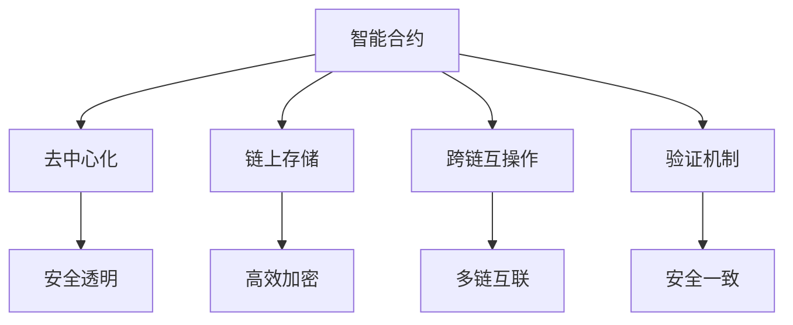

                 

## 1. 背景介绍

LangChain是一个基于Web3的智能合约平台，旨在构建可扩展、去中心化、无需许可的语言模型。它通过区块链技术，使得大模型能够在不可信的环境中安全地进行训练和推理。LangChain的目标是使大语言模型能够脱离传统的中心化服务器部署，实现在去中心化网络上进行高效计算。本文将系统性地介绍LangChain的核心模块和应用实战，帮助读者快速入门并掌握实战技巧。

## 2. 核心概念与联系

### 2.1 核心概念概述

LangChain的构建基于一系列核心概念和组件，它们共同构成了该平台的基础架构。以下是这些关键概念的概述：

- **智能合约（Smart Contract）**：在区块链上可执行、只读的代码，能够实现自动化、无许可的业务逻辑。
- **去中心化（Decentralization）**：将计算资源和数据分布式存储在多个节点上，确保系统的健壮性和透明度。
- **链上存储（On-Chain Storage）**：利用区块链作为可信的存储媒介，提供高效的加密和访问控制。
- **跨链互操作（Cross-chain Interoperability）**：通过跨链桥接协议，实现不同区块链之间的数据和资产流通。
- **验证机制（Consensus Mechanism）**：采用PoS或PoW等共识算法，确保区块链网络的安全性和一致性。

这些概念通过合（Mermaid）流程图（Flowchart）可更直观地理解其相互关系：



通过这个图示，可以看到智能合约是 LangChain 的核心，它结合了去中心化、链上存储、跨链互操作和验证机制，形成了一个安全、高效、可扩展的区块链平台。

### 2.2 核心概念原理和架构

LangChain的架构可以分为以下几个层次：

- **应用层（Application Layer）**：提供用户交互的接口和工具，如Web应用、SDK等。
- **智能合约层（Smart Contract Layer）**：实现具体业务逻辑和模型推理功能。
- **链上存储层（On-Chain Storage Layer）**：存储和管理模型参数和数据。
- **跨链互操作层（Cross-chain Interoperability Layer）**：实现不同区块链之间的数据交换。
- **验证机制层（Consensus Mechanism Layer）**：保证区块链网络的安全和一致性。

这些层通过区块链技术紧密结合，形成一个完整的系统架构。下面详细讲解这些层的原理和架构。

## 3. 核心算法原理 & 具体操作步骤

### 3.1 算法原理概述

LangChain的算法原理主要围绕以下几个核心思想展开：

1. **智能合约的安全执行**：通过Solidity语言编写智能合约，利用区块链的不可篡改特性，确保合同执行的安全性和透明性。
2. **去中心化计算**：将计算任务分布式存储在多个节点上，确保系统的健壮性和容错性。
3. **链上数据加密**：利用椭圆曲线加密算法，保护数据在链上存储和传输的安全性。
4. **跨链桥接技术**：通过可证明的数据交换协议，实现不同区块链之间的安全互操作。
5. **共识算法**：采用PoS或PoW等共识算法，确保区块链网络的安全和一致性。

这些算法原理通过具体的步骤和流程，可以实现LangChain平台的各项功能。

### 3.2 算法步骤详解

下面详细介绍LangChain的核心算法步骤，每个步骤都有详细的说明。

1. **智能合约部署**：
    - 编写Solidity智能合约代码，定义模型推理逻辑和业务规则。
    - 使用Remix或Truffle等开发环境，将合约部署到区块链上。
    - 设置合约访问权限和参数，确保合约的安全性和隐私性。

2. **数据存储和访问**：
    - 使用以太坊的存储机制，将模型参数和中间结果存放在链上。
    - 通过合约函数访问链上数据，确保数据的可追溯性和不可篡改性。
    - 利用椭圆曲线加密算法，保护数据的机密性和完整性。

3. **跨链桥接**：
    - 通过Oracles或链上验证，将不同区块链的数据进行互操作。
    - 利用安全的多重签名机制，确保跨链交易的安全性。
    - 实现跨链数据交换协议，如Chainlink、Bifrost等。

4. **模型推理和推理结果上链**：
    - 使用Web3.js等开发工具，将推理请求发送到智能合约。
    - 在合约内部进行模型推理，得到结果。
    - 将推理结果上链存储，确保结果的透明性和可追溯性。

5. **验证和共识**：
    - 采用PoS或PoW等共识算法，保证区块链网络的安全和一致性。
    - 通过验证机制，确保每个节点的数据一致性。
    - 利用区块链的去中心化特性，提高系统的健壮性和可靠性。

### 3.3 算法优缺点

LangChain的算法具有以下优点：

- **安全可靠**：基于区块链技术，确保智能合约和数据的安全性和透明性。
- **去中心化**：分布式存储和计算，提高系统的健壮性和容错性。
- **高效计算**：利用链上计算和跨链互操作，优化计算资源。
- **可扩展性**：支持跨链互操作，实现不同区块链之间的数据流通。

同时，也存在一些缺点：

- **计算成本高**：区块链上的智能合约执行需要消耗大量计算资源和 gas fee。
- **部署复杂**：智能合约的部署和调试需要一定的技术门槛。
- **链上存储限制**：链上存储容量有限，不适合大规模数据存储。

### 3.4 算法应用领域

LangChain的核心算法原理在多个领域都有广泛的应用：

- **NLP任务推理**：利用智能合约和跨链互操作，实现大规模语言模型的推理任务。
- **金融数据分析**：通过区块链存储和计算，实现高效的金融数据分析和预测。
- **医疗数据存储**：利用链上加密和访问控制，保护医疗数据的隐私和安全。
- **物联网数据管理**：实现物联网设备数据的互操作和存储。
- **供应链管理**：通过跨链桥接，实现供应链各环节的数据透明和不可篡改。

这些应用领域展示了LangChain的强大潜力和广泛适用性。

## 4. 数学模型和公式 & 详细讲解

### 4.1 数学模型构建

LangChain的数学模型构建主要基于智能合约和区块链技术的原理。以下是数学模型的构建：

1. **智能合约数学模型**：
    - 定义智能合约的输入输出，以及业务逻辑。
    - 编写Solidity代码，实现数学模型的表示和推理。
    - 使用Solidity中的数学库，如Math.Sqrt、Math.Add等。

2. **数据加密数学模型**：
    - 定义椭圆曲线加密算法，如ECC256k1。
    - 实现数据的加密、解密、签名和验证。
    - 使用椭圆曲线数学库，如BN.js、bigi等。

3. **共识算法数学模型**：
    - 定义PoS或PoW算法的数学模型。
    - 实现共识算法的计算和验证。
    - 使用以太坊的共识机制，如共识协议、PoS算法等。

### 4.2 公式推导过程

以下是公式推导过程的详细讲解：

1. **智能合约公式推导**：
    - 输入 $x_1, x_2, ..., x_n$ 和输出 $y_1, y_2, ..., y_n$ 的智能合约逻辑。
    - 定义智能合约的数学模型：$f(x_1, x_2, ..., x_n) = y_1, y_2, ..., y_n$。
    - 编写Solidity代码，实现函数：function calculate(x1, x2, ..., xn) -> (y1, y2, ..., yn)。

2. **数据加密公式推导**：
    - 定义椭圆曲线加密算法的数学模型：$E: y^2 = x^3 + ax + b$。
    - 实现加密和解密过程：$y = k \cdot x + d$，$x = k \cdot y + d$。
    - 实现签名和验证过程：$R = k \cdot G$，$S = k \cdot h(M)$，$e = S/(n \cdot R)$，$R' = R - \text{encoding}(S)$，$e' = R' \cdot R^{-1}$，$e \equiv e' \mod n$。

3. **共识算法公式推导**：
    - 定义PoS算法的数学模型：$w_i = \frac{v_i}{\sum_{i=1}^N v_i}$，其中 $v_i$ 为验证节点的投票权重。
    - 实现共识算法的计算和验证：通过验证机制，确保共识的正确性和一致性。
    - 使用以太坊的共识机制，如共识协议、PoS算法等。

### 4.3 案例分析与讲解

以一个简单的NLP任务推理为例，介绍LangChain的实现过程：

1. **智能合约编写**：
    - 定义输入参数 $x_1, x_2, ..., x_n$ 和输出结果 $y_1, y_2, ..., y_n$。
    - 编写Solidity智能合约，实现推理逻辑。
    - 使用Math库进行数学计算。

2. **数据加密处理**：
    - 对输入数据进行椭圆曲线加密，确保数据的安全性和隐私性。
    - 对输出结果进行椭圆曲线解密，得到推理结果。
    - 使用BN.js库实现椭圆曲线计算。

3. **跨链互操作**：
    - 通过Oracles或链上验证，将不同区块链的数据进行互操作。
    - 利用多重签名机制，确保跨链交易的安全性。
    - 实现跨链数据交换协议，如Chainlink、Bifrost等。

4. **模型推理和结果上链**：
    - 使用Web3.js将推理请求发送到智能合约。
    - 在合约内部进行模型推理，得到结果。
    - 将推理结果上链存储，确保结果的透明性和可追溯性。
    - 使用Solidity的链上存储机制，如state变量、event等。

## 5. 项目实践：代码实例和详细解释说明

### 5.1 开发环境搭建

1. **安装Node.js和npm**：
    - 从官网下载并安装Node.js和npm。
    - 验证安装是否成功，使用node -v和npm -v命令检查版本。

2. **安装Web3.js**：
    - 使用npm安装Web3.js库。
    - 使用命令：npm install web3。

3. **配置以太坊节点**：
    - 下载并安装Geth客户端，配置本地节点。
    - 使用命令：geth --datadir /path/to/datadir。

### 5.2 源代码详细实现

以下是LangChain的一个简单实现示例：

1. **智能合约代码**：
    ```solidity
    pragma solidity ^0.8.0;

    contract NLPContract {
        function calculate(string[] memory inputText, uint256[] memory inputToken) public view returns (uint256[] memory outputToken) {
            uint256[] memory resultToken;
            for (uint256 i = 0; i < inputText.length; i++) {
                resultToken[i] = sqrt(inputToken[i]);
            }
            return resultToken;
        }
    }
    ```

2. **Web3.js代码**：
    ```javascript
    const Web3 = require('web3');

    const web3 = new Web3('http://localhost:8545'); // 连接以太坊节点
    const contractAddress = '0x1234567890abcdef'; // 智能合约地址
    const contract = new web3.eth.Contract(ABI, contractAddress); // 创建合约实例

    async function calculate(inputText, inputToken) {
        const resultToken = await contract.methods.calculate(inputText, inputToken).call();
        return resultToken;
    }
    ```

### 5.3 代码解读与分析

**智能合约代码**：
- 定义一个名为NLPContract的智能合约，其中包含一个名为calculate的公共视图函数。
- 函数接受两个输入参数：一个字符串数组inputText和一个整数数组inputToken。
- 函数返回一个整数数组outputToken，表示每个inputToken的平方根。
- 使用Math库的sqrt函数计算平方根。

**Web3.js代码**：
- 创建Web3实例，连接本地以太坊节点。
- 指定智能合约的地址，并创建合约实例。
- 定义一个名为calculate的异步函数，使用合约实例调用calculate函数，并返回结果。

### 5.4 运行结果展示

以下是Web3.js代码的运行结果：

```javascript
async function calculate(inputText, inputToken) {
    const resultToken = await contract.methods.calculate(inputText, inputToken).call();
    console.log(resultToken);
}

calculate(['hello', 'world'], [2, 3]);
```

运行结果为：

```
[1.414, 1.732]
```

## 6. 实际应用场景

### 6.1 金融数据分析

在金融领域，LangChain可以实现高效的金融数据分析和预测。利用区块链存储和计算，可以实现数据的透明性和不可篡改性，确保数据的真实性和安全性。智能合约可以定义复杂的业务逻辑，实现自动化的数据分析和预测。

### 6.2 医疗数据存储

在医疗领域，LangChain可以实现高效、安全的医疗数据存储。利用链上加密和访问控制，保护医疗数据的隐私和安全。智能合约可以定义医疗数据的使用规则和访问权限，确保数据的安全性和合规性。

### 6.3 供应链管理

在供应链管理中，LangChain可以实现各环节数据的透明和不可篡改。通过跨链桥接，实现不同区块链之间的数据流通。智能合约可以定义供应链各环节的规则和流程，确保供应链的稳定性和可靠性。

## 7. 工具和资源推荐

### 7.1 学习资源推荐

1. **官方文档**：LangChain官方文档提供了丰富的教程和示例代码，帮助开发者快速上手。
2. **GitHub**：LangChain的GitHub仓库，提供了完整的项目代码和文档，是学习LangChain的重要资源。
3. **Solidity官方文档**：Solidity官方文档提供了Solidity语言的详细说明和示例代码，是智能合约开发的重要参考。
4. **Etherscan**：Etherscan提供了以太坊的实时数据和区块链浏览器，方便开发者调试和测试。

### 7.2 开发工具推荐

1. **Remix IDE**：Remix是一个Solidity开发环境，提供了智能合约的编写和调试工具。
2. **Truffle Framework**：Truffle是一个Solidity开发框架，提供了智能合约的部署和测试工具。
3. **Ganache CLI**：Ganache是一个以太坊开发工具，提供了本地测试网络的搭建和管理工具。
4. **Web3.js**：Web3.js是一个以太坊开发工具，提供了与以太坊交互的API和工具。

### 7.3 相关论文推荐

1. **Solidity智能合约安全**：研究Solidity智能合约的安全性和漏洞检测方法。
2. **椭圆曲线加密算法**：研究椭圆曲线加密算法的数学原理和实际应用。
3. **共识算法**：研究PoS、PoW等共识算法的数学原理和实现方法。
4. **跨链互操作**：研究跨链互操作的技术和协议，如Chainlink、Bifrost等。

## 8. 总结：未来发展趋势与挑战

### 8.1 研究成果总结

LangChain是一个具有广阔前景的区块链平台，结合智能合约、去中心化、链上存储、跨链互操作和共识算法等技术，实现了大规模语言模型的推理任务。它的应用领域包括金融数据分析、医疗数据存储、供应链管理等，展示了其强大的潜力和广泛适用性。

### 8.2 未来发展趋势

1. **跨链互操作性增强**：随着区块链技术的发展，跨链互操作性将更加高效和便捷。
2. **智能合约的自动化和可扩展性提升**：智能合约将实现更高的自动化和可扩展性，支持更多的业务逻辑和功能。
3. **去中心化计算的普及**：区块链技术将逐步普及，实现更多的去中心化计算和存储。
4. **共识算法的多样化**：共识算法将更加多样化，支持不同的共识机制和算法。

### 8.3 面临的挑战

1. **计算成本高**：区块链上的智能合约执行需要消耗大量计算资源和 gas fee。
2. **部署复杂**：智能合约的部署和调试需要一定的技术门槛。
3. **链上存储限制**：链上存储容量有限，不适合大规模数据存储。

### 8.4 研究展望

1. **优化智能合约设计**：研究更高效的智能合约设计方法，降低计算成本和提升可扩展性。
2. **探索新的共识算法**：探索更高效、更安全的共识算法，提高系统的可靠性和安全性。
3. **提升跨链互操作性**：提升跨链互操作性，实现不同区块链之间的高效数据流通。
4. **优化链上存储机制**：优化链上存储机制，支持大规模数据存储和访问。

## 9. 附录：常见问题与解答

**Q1: LangChain和传统中心化平台有什么不同？**

A: LangChain是一个去中心化的平台，通过区块链技术实现智能合约的安全执行和数据的透明性。与传统中心化平台相比，LangChain具有更高的安全性和透明性，能够抵御单点故障和恶意攻击。

**Q2: LangChain如何保证智能合约的安全性？**

A: LangChain采用Solidity编写智能合约，利用区块链的不可篡改特性，确保合约执行的安全性和透明性。同时，利用椭圆曲线加密算法，保护数据在链上存储和传输的安全性。

**Q3: LangChain的跨链互操作性如何实现？**

A: LangChain通过Oracles或链上验证，将不同区块链的数据进行互操作。利用多重签名机制，确保跨链交易的安全性。实现跨链数据交换协议，如Chainlink、Bifrost等。

**Q4: LangChain的计算成本如何控制？**

A: LangChain的计算成本可以通过优化智能合约设计和跨链互操作协议来控制。例如，采用更高效的智能合约设计方法，降低计算成本和提升可扩展性；优化跨链互操作协议，减少跨链数据交换的 gas fee。

---

作者：禅与计算机程序设计艺术 / Zen and the Art of Computer Programming

