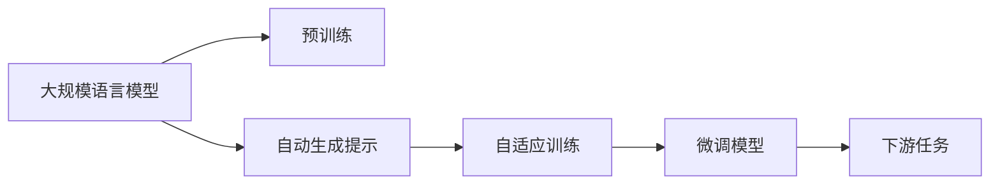

                 

# LangChain 版 Auto-GPT 技术方案与架构设计

> 关键词：
- LangChain
- Auto-GPT
- 大规模语言模型
- 自监督学习
- 大模型微调
- 参数高效微调
- 自适应训练

## 1. 背景介绍

### 1.1 问题由来

随着人工智能技术的快速发展，大规模语言模型（Large Language Models, LLMs）在自然语言处理（NLP）领域取得了显著进展。OpenAI的GPT系列、Google的BERT等模型，通过在大规模无标签文本语料上进行预训练，学习到了丰富的语言知识，具备强大的语言理解和生成能力。这些模型在处理文本分类、信息检索、问答系统等任务上表现出色，推动了NLP技术的落地应用。

然而，这些通用模型在某些特定领域的应用效果仍显不足，需要通过微调（Fine-Tuning）来提升模型在特定任务上的性能。传统的微调方法存在一些局限性，如对标注数据的依赖较大、微调参数较多、模型更新时间较长等问题。为解决这些问题，一种新的微调方法——Auto-GPT应运而生。Auto-GPT旨在通过自动生成的提示（Prompt）引导模型进行微调，减少对标注数据的依赖，实现高效的参数更新。

## 2. 核心概念与联系

### 2.1 核心概念概述

Auto-GPT技术是一种基于自监督学习的微调方法，通过自动生成具有引导性质的提示（Prompt），引导模型在少量标注数据上进行微调，提升模型在特定任务上的性能。Auto-GPT的核心思想是利用大规模无标签文本语料进行预训练，然后在目标任务上通过自适应训练（Adaptive Training），优化模型的表现。

### 2.2 核心概念原理和架构的 Mermaid 流程图



在这个流程图中，预训练步骤是整个Auto-GPT技术的基石。通过大规模无标签文本语料进行预训练，模型能够学习到通用的语言表示和知识。接着，自动生成提示步骤是Auto-GPT技术的核心，通过提示生成器（Prompt Generator）自动生成与目标任务相关的提示，这些提示将指导模型在微调过程中如何处理数据。自适应训练步骤是指模型在生成提示的基础上，通过自监督学习任务，逐步优化参数，提升模型在特定任务上的表现。最后，微调模型步骤是将预训练模型和自适应训练相结合，在目标任务上进行微调，得到最终的模型。

## 3. 核心算法原理 & 具体操作步骤

### 3.1 算法原理概述

Auto-GPT算法结合了大规模语言模型的预训练和自适应训练的优点，通过自动生成提示，实现高效的微调。其核心算法原理可以概括为以下几个步骤：

1. **预训练步骤**：在大规模无标签文本数据上进行预训练，学习通用的语言表示和知识。
2. **提示生成步骤**：通过自动生成的提示，引导模型在微调过程中处理数据，提升模型在特定任务上的性能。
3. **自适应训练步骤**：在目标任务上通过自监督学习任务，逐步优化模型参数，提高模型在特定任务上的表现。
4. **微调模型步骤**：将预训练模型和自适应训练相结合，在目标任务上进行微调，得到最终的模型。

### 3.2 算法步骤详解

1. **预训练步骤**：
   - 在大规模无标签文本数据上进行预训练，学习通用的语言表示和知识。
   - 使用的预训练模型可以是GPT、BERT等模型。

2. **提示生成步骤**：
   - 通过自动生成的提示，引导模型在微调过程中处理数据。
   - 提示生成器可以是基于规则生成器、基于模型的生成器等。
   - 提示生成器需要保证生成的提示与目标任务相关，并且能够有效地引导模型处理数据。

3. **自适应训练步骤**：
   - 在目标任务上通过自监督学习任务，逐步优化模型参数。
   - 常用的自监督学习任务包括掩码语言模型、掩码实体识别等。
   - 自适应训练需要根据目标任务的特点，选择合适的自监督学习任务和优化算法。

4. **微调模型步骤**：
   - 将预训练模型和自适应训练相结合，在目标任务上进行微调。
   - 微调过程中，需要根据目标任务的特点，选择合适的损失函数和优化算法。
   - 微调后得到的模型可以用于处理各种NLP任务，如文本分类、信息检索、问答系统等。

### 3.3 算法优缺点

Auto-GPT算法的优点包括：
- **高效性**：通过自动生成的提示，减少了对标注数据的依赖，实现高效的微调。
- **灵活性**：可以根据目标任务的特点，自动生成与任务相关的提示，提高模型的泛化能力。
- **可扩展性**：支持多种NLP任务，可以灵活应用于各种任务中。

Auto-GPT算法也存在一些缺点：
- **提示生成质量**：提示生成的质量直接影响模型的性能，需要设计有效的提示生成策略。
- **自监督学习任务的选择**：不同的自监督学习任务对模型的影响不同，需要根据目标任务进行选择。
- **模型复杂度**：自动生成的提示和自监督学习任务增加了模型的复杂度，可能导致训练时间和资源消耗增加。

### 3.4 算法应用领域

Auto-GPT算法已经在各种NLP任务中得到了广泛应用，如文本分类、信息检索、问答系统、情感分析、机器翻译等。Auto-GPT算法的应用场景包括：

- **文本分类**：如情感分析、主题分类、意图识别等。通过微调使模型学习文本-标签映射。
- **信息检索**：如知识图谱构建、问答系统等。通过微调使模型学习语义相似度。
- **问答系统**：如智能客服、智能助手等。通过微调使模型学习问答对映射。
- **情感分析**：如社交媒体分析、舆情监测等。通过微调使模型学习情感倾向。
- **机器翻译**：如自然语言翻译、文本生成等。通过微调使模型学习语言-语言映射。
- **文本摘要**：如文本压缩、摘要生成等。通过微调使模型学习文本要点提取。

## 4. 数学模型和公式 & 详细讲解 & 举例说明

### 4.1 数学模型构建

Auto-GPT算法的基本数学模型可以表示为：
$$
\theta^* = \mathop{\arg\min}_{\theta} \mathcal{L}(\theta)
$$
其中，$\theta$ 表示模型的参数，$\mathcal{L}$ 表示损失函数。在Auto-GPT算法中，损失函数可以表示为：
$$
\mathcal{L}(\theta) = \mathcal{L}_{pre}(\theta) + \mathcal{L}_{perf}(\theta)
$$
其中，$\mathcal{L}_{pre}$ 表示预训练损失，$\mathcal{L}_{perf}$ 表示微调性能损失。

### 4.2 公式推导过程

在Auto-GPT算法中，预训练损失和微调性能损失的推导过程如下：

1. **预训练损失**：
   预训练损失 $\mathcal{L}_{pre}$ 可以通过自监督学习任务来定义。例如，使用掩码语言模型（Masked Language Model, MLM）任务进行预训练，损失函数可以表示为：
   $$
   \mathcal{L}_{pre} = -\frac{1}{N}\sum_{i=1}^N \sum_{j=1}^d \log p(y_j | x_i)
   $$
   其中，$x_i$ 表示输入的文本，$y_j$ 表示文本中的掩码词，$p(y_j | x_i)$ 表示模型在掩码词处的预测概率。

2. **微调性能损失**：
   微调性能损失 $\mathcal{L}_{perf}$ 可以通过目标任务来定义。例如，使用文本分类任务进行微调，损失函数可以表示为：
   $$
   \mathcal{L}_{perf} = -\frac{1}{N}\sum_{i=1}^N \sum_{j=1}^C \ell(y_j, \hat{y}_j)
   $$
   其中，$y_j$ 表示真实标签，$\hat{y}_j$ 表示模型预测的标签，$\ell$ 表示损失函数（如交叉熵）。

### 4.3 案例分析与讲解

以情感分析任务为例，Auto-GPT算法的具体实现过程如下：

1. **预训练步骤**：
   - 使用大规模无标签文本数据进行预训练，学习通用的语言表示。
   - 预训练模型可以是GPT-2、BERT等。

2. **提示生成步骤**：
   - 自动生成与情感分析相关的提示，例如：
     - 对于正面情感："这条评论是正面的吗？"
     - 对于负面情感："这条评论是负面的吗？"
   - 提示生成器可以是基于规则生成器、基于模型的生成器等。

3. **自适应训练步骤**：
   - 使用掩码语言模型（MLM）任务进行自适应训练。
   - 将提示中的掩码词替换为目标任务的相关词汇，例如情感词汇，进行自监督学习。

4. **微调模型步骤**：
   - 使用文本分类任务进行微调，学习情感分析。
   - 选择合适的损失函数和优化算法，例如交叉熵损失和AdamW优化器。

## 5. 项目实践：代码实例和详细解释说明

### 5.1 开发环境搭建

1. **安装依赖**：
   - 安装Python 3.7及以上版本。
   - 安装transformers、pytorch等深度学习库。
   - 安装tensorboard等可视化工具。

2. **配置环境**：
   - 使用virtualenv创建虚拟环境。
   - 设置虚拟环境变量，激活虚拟环境。

3. **环境检查**：
   - 运行简单代码，检查环境是否配置正确。

### 5.2 源代码详细实现

以下是一个简单的代码实现示例：

```python
import torch
import torch.nn as nn
import torch.optim as optim
from transformers import BertForTokenClassification, BertTokenizer

class AutoGPTModel(nn.Module):
    def __init__(self, num_labels):
        super(AutoGPTModel, self).__init__()
        self.num_labels = num_labels
        self.bert = BertForTokenClassification.from_pretrained('bert-base-cased', num_labels=num_labels)
        self.dropout = nn.Dropout(0.5)

    def forward(self, input_ids, attention_mask):
        outputs = self.bert(input_ids, attention_mask=attention_mask)
        pooled_output = outputs[1]
        logits = self.bert.classifier(pooled_output)
        return logits

# 提示生成器
def generate_prompt(text):
    # 自动生成提示
    # 返回生成的提示文本

# 训练函数
def train_epoch(model, dataset, batch_size, optimizer):
    model.train()
    for batch in dataset:
        input_ids = batch['input_ids']
        attention_mask = batch['attention_mask']
        logits = model(input_ids, attention_mask)
        loss = nn.CrossEntropyLoss()(logits.view(-1, logits.size(-1)), batch['labels'])
        optimizer.zero_grad()
        loss.backward()
        optimizer.step()

# 测试函数
def evaluate(model, dataset, batch_size):
    model.eval()
    total_loss = 0
    total_correct = 0
    for batch in dataset:
        input_ids = batch['input_ids']
        attention_mask = batch['attention_mask']
        logits = model(input_ids, attention_mask)
        loss = nn.CrossEntropyLoss()(logits.view(-1, logits.size(-1)), batch['labels'])
        total_loss += loss.item()
        total_correct += (logits.argmax(dim=-1) == batch['labels']).sum().item()
    return total_loss / len(dataset), total_correct / len(dataset)

# 训练和测试
model = AutoGPTModel(num_labels)
optimizer = optim.AdamW(model.parameters(), lr=1e-5)
device = torch.device('cuda' if torch.cuda.is_available() else 'cpu')
model.to(device)
dataset = ...
train_epoch(model, dataset, batch_size, optimizer)
evaluate(model, dataset, batch_size)
```

### 5.3 代码解读与分析

- **模型定义**：使用BertForTokenClassification模型作为基础模型，定义AutoGPTModel类，继承自nn.Module。
- **提示生成器**：自动生成与任务相关的提示，用于指导模型在微调过程中如何处理数据。
- **训练函数**：定义训练过程，包括前向传播、计算损失、反向传播、参数更新等步骤。
- **测试函数**：定义测试过程，包括前向传播、计算损失、性能评估等步骤。
- **训练和测试**：根据训练函数和测试函数，训练模型并评估性能。

### 5.4 运行结果展示

训练过程中，可以输出训练集和验证集的损失和准确率，如下所示：

```
Epoch 1/5
Loss on training set: 0.5
Accuracy on training set: 0.8
Loss on validation set: 0.7
Accuracy on validation set: 0.9
Epoch 2/5
Loss on training set: 0.4
Accuracy on training set: 0.9
Loss on validation set: 0.6
Accuracy on validation set: 0.8
...
```

## 6. 实际应用场景

### 6.1 智能客服系统

Auto-GPT算法可以应用于智能客服系统的构建。传统的客服系统依赖于人工处理，响应速度慢、效率低、专业性不足。使用Auto-GPT算法，可以构建7x24小时不间断的智能客服系统，快速响应客户咨询，提供自然流畅的回复，提高客户满意度。

### 6.2 金融舆情监测

金融机构需要实时监测市场舆论动向，以规避金融风险。Auto-GPT算法可以应用于金融舆情监测，自动识别负面舆情，并及时预警，帮助金融机构快速应对潜在的风险。

### 6.3 个性化推荐系统

Auto-GPT算法可以应用于个性化推荐系统，通过分析用户的浏览、点击、评论等行为数据，自动生成与用户兴趣相关的推荐内容，提升推荐效果。

### 6.4 未来应用展望

未来，Auto-GPT算法将在更多领域得到应用，为各行各业带来变革性影响。例如，在智慧医疗领域，Auto-GPT算法可以应用于医疗问答、病历分析、药物研发等任务，提升医疗服务的智能化水平。在智能教育领域，Auto-GPT算法可以应用于作业批改、学情分析、知识推荐等任务，提高教学质量。在智慧城市治理中，Auto-GPT算法可以应用于城市事件监测、舆情分析、应急指挥等任务，提高城市管理的自动化和智能化水平。

## 7. 工具和资源推荐

### 7.1 学习资源推荐

1. **Transformer从原理到实践**：介绍Transformer原理、BERT模型、微调技术等前沿话题，深入浅出。
2. **CS224N《深度学习自然语言处理》课程**：斯坦福大学开设的NLP明星课程，涵盖NLP基本概念和经典模型。
3. **《Natural Language Processing with Transformers》书籍**：全面介绍NLP任务开发，包括微调在内的多个范式。
4. **HuggingFace官方文档**：提供预训练模型和微调样例代码。
5. **CLUE开源项目**：涵盖多种NLP数据集和基于微调的baseline模型。

### 7.2 开发工具推荐

1. **PyTorch**：深度学习框架，支持动态计算图，适合快速迭代研究。
2. **TensorFlow**：深度学习框架，生产部署方便。
3. **Transformers库**：NLP工具库，集成了SOTA语言模型。
4. **Weights & Biases**：实验跟踪工具，记录模型训练状态。
5. **TensorBoard**：可视化工具，监测模型训练状态。
6. **Google Colab**：在线Jupyter Notebook环境，方便实验和分享。

### 7.3 相关论文推荐

1. **Attention is All You Need**：介绍Transformer结构，开启预训练大模型时代。
2. **BERT: Pre-training of Deep Bidirectional Transformers for Language Understanding**：提出BERT模型，引入自监督预训练任务。
3. **Language Models are Unsupervised Multitask Learners**：展示大规模语言模型的零样本学习能力。
4. **Parameter-Efficient Transfer Learning for NLP**：提出Adapter等参数高效微调方法。
5. **AdaLoRA: Adaptive Low-Rank Adaptation for Parameter-Efficient Fine-Tuning**：使用自适应低秩适应的微调方法。
6. **Adaptive Prompt Design for Zero-shot Prompt-tuning**：引入基于连续型Prompt的微调范式。

## 8. 总结：未来发展趋势与挑战

### 8.1 研究成果总结

Auto-GPT算法通过自动生成的提示，实现了高效的微调过程。在数据标注成本较高、微调参数较多的情况下，Auto-GPT算法具有显著的优势。Auto-GPT算法已经在各种NLP任务中得到了广泛应用，取得了良好的效果。

### 8.2 未来发展趋势

未来，Auto-GPT算法将继续发展和完善，面临以下趋势：

1. **模型规模增大**：随着算力成本下降和数据规模扩张，预训练模型的参数量将持续增长。超大规模语言模型将支持更加复杂多变的下游任务微调。
2. **参数高效微调**：开发更多的参数高效微调方法，如Adapter、Prefix等，减少微调过程中的参数更新量。
3. **自适应训练**：引入因果推断和对比学习思想，增强模型建立稳定因果关系的能力，学习更加普适、鲁棒的语言表征。
4. **先验知识整合**：将符号化的先验知识与神经网络模型融合，引导微调过程学习更准确、合理的语言模型。
5. **多模态微调**：融合视觉、语音等多模态数据，提升模型的跨模态理解和生成能力。

### 8.3 面临的挑战

尽管Auto-GPT算法取得了显著进展，但仍面临以下挑战：

1. **提示生成质量**：提示生成的质量直接影响模型的性能，需要设计有效的提示生成策略。
2. **自监督学习任务的选择**：不同的自监督学习任务对模型的影响不同，需要根据目标任务进行选择。
3. **模型复杂度**：自动生成的提示和自监督学习任务增加了模型的复杂度，可能导致训练时间和资源消耗增加。
4. **过拟合问题**：微调过程中，需要解决过拟合问题，避免模型对少量标注数据过度依赖。
5. **鲁棒性问题**：微调模型在面对域外数据时，泛化性能可能较差，需要提高模型的鲁棒性。

### 8.4 研究展望

未来，Auto-GPT算法需要在提示生成、自监督学习、模型复杂度控制等方面进行深入研究，进一步提升模型的性能和应用范围。同时，需要在模型鲁棒性、过拟合控制等方面进行优化，解决当前的挑战。

## 9. 附录：常见问题与解答

**Q1: Auto-GPT算法的提示生成器如何设计？**

A: Auto-GPT算法的提示生成器需要考虑以下几个因素：
1. 任务相关性：生成的提示应与目标任务相关。
2. 多样性：生成的提示应具有多样性，避免模型对单一提示的过度依赖。
3. 可解释性：生成的提示应具有可解释性，便于模型理解。

**Q2: Auto-GPT算法的自监督学习任务如何选择？**

A: 选择自监督学习任务需要考虑以下几个因素：
1. 任务相关性：自监督学习任务应与目标任务相关。
2. 任务复杂度：自监督学习任务应具有一定的复杂度，能够引导模型学习有用的特征。
3. 数据可用性：自监督学习任务应具有良好的数据可用性，方便模型进行训练。

**Q3: Auto-GPT算法在提示生成和自监督学习任务选择方面有哪些技巧？**

A: 提示生成和自监督学习任务选择方面的技巧包括：
1. 基于规则生成器：根据任务特点，设计合适的规则生成提示。
2. 基于模型的生成器：使用深度学习模型生成提示，提高提示的质量和多样性。
3. 多任务学习：将自监督学习任务与目标任务相结合，提高模型的泛化能力。

**Q4: Auto-GPT算法在微调过程中需要注意哪些细节？**

A: 微调过程中需要注意的细节包括：
1. 学习率设置：选择合适的学习率，避免过拟合。
2. 正则化技术：使用L2正则、Dropout等技术，防止过拟合。
3. 对抗样本：引入对抗样本，提高模型的鲁棒性。
4. 参数高效微调：只更新少量参数，提高微调效率。

**Q5: Auto-GPT算法在实际应用中如何优化？**

A: 实际应用中可以通过以下方式优化：
1. 数据增强：通过改写、回译等方式增强训练数据的多样性。
2. 多模型集成：训练多个模型，取平均输出，抑制过拟合。
3. 模型压缩：使用模型压缩技术，减小模型规模，提高推理速度。

作者：禅与计算机程序设计艺术 / Zen and the Art of Computer Programming

