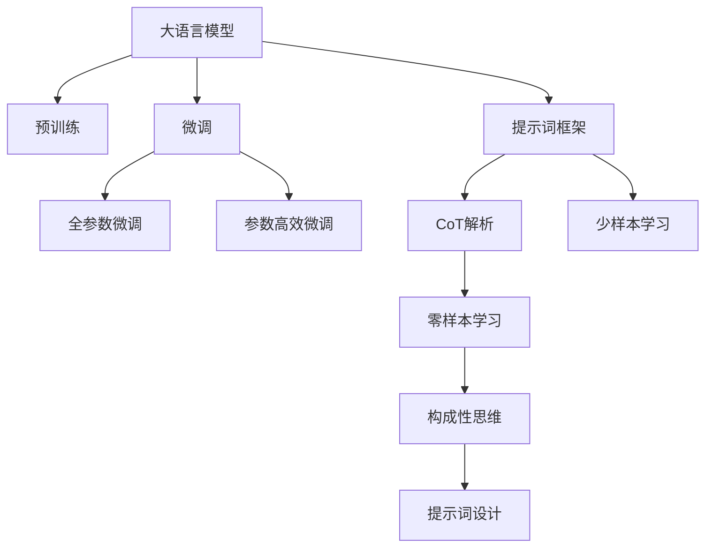

                 

# LangGPT 提示词框架应用 CoT 解析

> 关键词：提示词框架，CoT（Compositional Thinking，构成性思维），大语言模型，自然语言处理（NLP），语言生成，文本生成，知识图谱，逻辑推理

## 1. 背景介绍

### 1.1 问题由来

随着人工智能技术的快速发展，大语言模型（Large Language Models, LLMs）在自然语言处理（NLP）领域取得了巨大的突破。这些模型通过在海量无标签文本数据上进行预训练，学习到了丰富的语言知识和常识，可以通过少量的有标签样本在下游任务上进行微调，获得优异的性能。然而，这些大语言模型在生成连贯、逻辑性强的文本方面仍存在一定局限性。

### 1.2 问题核心关键点

1. **提示词框架（Prompt Engineering）**：在大语言模型微调或推理时，如何设计有效的提示词（Prompt），引导模型输出符合预期的结果。提示词框架是一种通过精心设计输入文本的格式，以引导模型推理和生成的方法，可以显著提高模型的性能和效果。
2. **构成性思维（Compositional Thinking, CoT）**：构成性思维是一种将问题分解成子问题，逐步推理的思维模式，适合于复杂、多层次的问题解决。将CoT应用于大语言模型的提示词设计中，可以使得模型输出更加连贯、逻辑性强。

### 1.3 问题研究意义

研究提示词框架和构成性思维在大语言模型中的应用，对于拓展大模型的应用范围，提升模型的推理和生成能力，加速NLP技术的产业化进程，具有重要意义：

1. **降低应用开发成本**：通过提示词框架，可以在不修改模型参数的情况下，快速适配新任务，减少从头开发所需的数据、计算和人力等成本投入。
2. **提升模型效果**：提示词框架和CoT可以帮助模型更好地理解和处理输入，生成更加连贯、逻辑性强的文本，从而提高模型的性能。
3. **加速开发进度**：通过利用大语言模型的预训练知识和推理能力，提示词框架和CoT可以使得开发者能够更快地完成任务适配，缩短开发周期。
4. **带来技术创新**：提示词框架和CoT的应用促进了对预训练-推理的深入研究，催生了新的研究方向，如少样本学习、零样本学习等。
5. **赋能产业升级**：提示词框架和CoT使得NLP技术更容易被各行各业所采用，为传统行业数字化转型升级提供新的技术路径。

## 2. 核心概念与联系

### 2.1 核心概念概述

为更好地理解提示词框架和构成性思维在大语言模型中的应用，本节将介绍几个密切相关的核心概念：

1. **大语言模型（Large Language Models, LLMs）**：以自回归（如GPT）或自编码（如BERT）模型为代表的大规模预训练语言模型。通过在大规模无标签文本语料上进行预训练，学习到通用的语言表示，具备强大的语言理解和生成能力。

2. **预训练（Pre-training）**：指在大规模无标签文本语料上，通过自监督学习任务训练通用语言模型的过程。常见的预训练任务包括言语建模、遮挡语言模型等。预训练使得模型学习到语言的通用表示。

3. **微调（Fine-tuning）**：指在预训练模型的基础上，使用下游任务的少量标注数据，通过有监督学习优化模型在特定任务上的性能。通常只需要调整顶层分类器或解码器，并以较小的学习率更新全部或部分的模型参数。

4. **提示词框架（Prompt Engineering）**：一种通过精心设计输入文本的格式，引导模型推理和生成的方法。可以显著提高模型的性能和效果。

5. **构成性思维（Compositional Thinking, CoT）**：一种将问题分解成子问题，逐步推理的思维模式，适合于复杂、多层次的问题解决。

这些核心概念之间的逻辑关系可以通过以下Mermaid流程图来展示：



这个流程图展示了大语言模型的核心概念及其之间的关系：

1. 大语言模型通过预训练获得基础能力。
2. 微调是对预训练模型进行任务特定的优化，可以分为全参数微调和参数高效微调（PEFT）。
3. 提示词框架和CoT解析可以用于提升模型的推理和生成能力。
4. 提示词框架通过精心设计输入文本的格式，引导模型推理和生成。
5. CoT解析帮助模型逐步推理，生成逻辑性强的文本。
6. 少样本学习和零样本学习可以基于提示词框架和CoT解析，在极少量的标注样本上进行任务适配。

这些概念共同构成了大语言模型的学习和应用框架，使其能够在各种场景下发挥强大的语言理解和生成能力。通过理解这些核心概念，我们可以更好地把握大语言模型的工作原理和优化方向。

## 3. 核心算法原理 & 具体操作步骤
### 3.1 算法原理概述

基于提示词框架和CoT解析的大语言模型推理和生成，本质上是一种有监督的推理过程。其核心思想是：将复杂问题分解成多个子问题，通过大语言模型的推理能力逐步求解，最终得到问题的解。

形式化地，假设问题 $P$ 可以分解成 $n$ 个子问题 $P_1, P_2, ..., P_n$，每个子问题 $P_i$ 的解为 $s_i$。则问题 $P$ 的解 $s$ 可以表示为：

$$
s = f(s_1, s_2, ..., s_n)
$$

其中 $f$ 为子问题解的组合函数，可以是一个简单的逻辑函数，也可以是一个复杂的计算图。大语言模型通过推理每个子问题 $P_i$ 的解，再组合得到问题 $P$ 的解。

### 3.2 算法步骤详解

基于提示词框架和CoT解析的大语言模型推理和生成一般包括以下几个关键步骤：

**Step 1: 问题分解**

- 将问题 $P$ 分解成多个子问题 $P_1, P_2, ..., P_n$，每个子问题 $P_i$ 需要设计相应的提示词。
- 对于分类任务，每个子问题 $P_i$ 的输出可以表示为 $s_i = \{a_{i1}, a_{i2}, ..., a_{im}\}$，其中 $a_{ij}$ 为子问题 $P_i$ 的输出概率，$m$ 为类别数。
- 对于生成任务，每个子问题 $P_i$ 的输出可以表示为 $s_i = \{w_{i1}, w_{i2}, ..., w_{in}\}$，其中 $w_{ij}$ 为子问题 $P_i$ 生成的单词。

**Step 2: 设计提示词**

- 针对每个子问题 $P_i$，设计对应的提示词 $p_i$，引导模型输出 $s_i$。
- 提示词 $p_i$ 可以包含目标问题、已知条件、提示信息等。
- 提示词的设计需要考虑逻辑结构的合理性、语言的通顺性、上下文的一致性等。

**Step 3: 模型推理**

- 将提示词 $p_i$ 输入大语言模型 $M$，输出每个子问题 $P_i$ 的解 $s_i$。
- 对于分类任务，$M$ 输出 $s_i = \{a_{i1}, a_{i2}, ..., a_{im}\}$。
- 对于生成任务，$M$ 输出 $s_i = \{w_{i1}, w_{i2}, ..., w_{in}\}$。

**Step 4: 组合解**

- 将每个子问题 $P_i$ 的解 $s_i$ 组合，得到问题 $P$ 的解 $s$。
- 组合方式可以是简单的拼接、逻辑运算、计算图等。
- 组合解需要确保最终结果与问题 $P$ 的要求一致。

**Step 5: 后处理**

- 对组合解 $s$ 进行后处理，包括去噪、拼接、格式化等操作。
- 生成最终输出，可以是文本、结构化数据、逻辑表达式等。

以上是基于提示词框架和CoT解析的大语言模型推理和生成的完整流程。在实际应用中，还需要针对具体问题特点，对提示词设计、模型推理、组合解等环节进行优化设计，以进一步提升模型性能。

### 3.3 算法优缺点

基于提示词框架和CoT解析的大语言模型推理和生成方法具有以下优点：

1. **简单高效**：通过设计合适的提示词和逻辑结构，可以在不修改模型参数的情况下，快速适配新任务，减少从头开发所需的数据、计算和人力等成本投入。
2. **可解释性强**：提示词框架和CoT解析使得模型的推理过程更加透明，可以更好地解释模型输出的逻辑和推理路径。
3. **泛化能力强**：通过设计通用的提示词框架和逻辑结构，可以适应不同领域、不同规模的任务，具有较强的泛化能力。
4. **适应性强**：提示词框架和CoT解析可以灵活地处理各种类型的问题，包括分类、匹配、生成等，适用于多种NLP任务。

同时，该方法也存在一定的局限性：

1. **提示词设计复杂**：提示词设计需要考虑逻辑结构、语言通顺性、上下文一致性等多方面因素，设计不当可能导致模型推理错误。
2. **依赖数据质量**：提示词框架和CoT解析的效果很大程度上取决于提示词的质量和数据质量，设计低质量的提示词和数据集，可能影响模型性能。
3. **计算资源消耗**：设计复杂的提示词和逻辑结构，可能导致模型推理的计算资源消耗较大，推理速度较慢。
4. **模型可控性不足**：提示词框架和CoT解析的灵活性可能导致模型输出的可控性不足，难以保证输出结果的一致性。

尽管存在这些局限性，但就目前而言，基于提示词框架和CoT解析的方法仍是NLP任务推理和生成的主流范式。未来相关研究的重点在于如何进一步简化提示词设计、提高推理效率、增强模型可控性，同时兼顾可解释性和伦理安全性等因素。

### 3.4 算法应用领域

基于提示词框架和CoT解析的大语言模型推理和生成方法，已经在多种NLP任务上取得了优异的效果，被广泛应用于以下几个领域：

1. **问答系统**：对自然语言问题给出准确的回答。将问题-答案对作为提示词，微调大语言模型，使其能够理解问题并生成答案。
2. **机器翻译**：将源语言文本翻译成目标语言。将翻译任务分解成多个子任务，如词性标注、句法分析等，设计相应的提示词，逐步推理出翻译结果。
3. **文本摘要**：将长文本压缩成简短摘要。将文章-摘要对作为提示词，微调大语言模型，使其能够抓取要点并生成摘要。
4. **文本生成**：生成连贯、逻辑性强的文本。设计合适的提示词，引导大语言模型按照期望的方式进行文本生成。
5. **代码生成**：生成符合编程规范的代码。设计提示词，将任务描述和需求作为输入，逐步推理出代码实现。
6. **对话系统**：使机器能够与人自然对话。设计对话历史和上下文作为提示词，微调大语言模型，使其能够理解上下文并生成回复。

除了上述这些经典任务外，大语言模型推理和生成方法还被创新性地应用到更多场景中，如可控文本生成、常识推理、多模态数据融合等，为NLP技术带来了全新的突破。随着提示词框架和CoT解析方法的不断进步，相信NLP技术将在更广阔的应用领域大放异彩。

## 4. 数学模型和公式 & 详细讲解 & 举例说明

### 4.1 数学模型构建

本节将使用数学语言对基于提示词框架和CoT解析的大语言模型推理和生成过程进行更加严格的刻画。

假设问题 $P$ 可以分解成 $n$ 个子问题 $P_1, P_2, ..., P_n$，每个子问题 $P_i$ 的解为 $s_i = \{a_{i1}, a_{i2}, ..., a_{im}\}$，其中 $a_{ij}$ 为子问题 $P_i$ 的输出概率，$m$ 为类别数。大语言模型 $M$ 在提示词 $p_i$ 上的输出为 $s_i$。

定义模型 $M_{\theta}$ 在提示词 $p$ 上的输出为 $\hat{y}=M_{\theta}(p)$，其中 $\theta$ 为模型参数。则问题 $P$ 的解 $s$ 可以表示为：

$$
s = f(s_1, s_2, ..., s_n)
$$

其中 $f$ 为子问题解的组合函数，可以是一个简单的逻辑函数，也可以是一个复杂的计算图。例如，对于分类任务，$f$ 可以表示为：

$$
s = f(s_1, s_2, ..., s_n) = \arg\max_i s_i
$$

对于生成任务，$f$ 可以表示为：

$$
s = f(s_1, s_2, ..., s_n) = \{w_{i1}, w_{i2}, ..., w_{in}\}
$$

### 4.2 公式推导过程

以下我们以文本摘要任务为例，推导基于提示词框架和CoT解析的推理和生成公式。

假设问题 $P$ 为文本摘要任务，输入为长文本 $x$，输出为摘要 $y$。我们可以将摘要任务分解成两个子问题：

1. **子问题 $P_1$**：将长文本 $x$ 分解成若干个句子 $x_1, x_2, ..., x_m$。
2. **子问题 $P_2$**：对每个句子 $x_i$ 进行摘要，得到摘要 $y_i$。

对于子问题 $P_1$，我们可以设计提示词 $p_1$，引导模型输出长文本的句子序列：

$$
p_1 = "将文本 $x$ 分解成若干个句子："
$$

对于子问题 $P_2$，我们可以设计提示词 $p_2$，引导模型对每个句子进行摘要：

$$
p_2 = "请对句子 $x_i$ 进行摘要："
$$

将两个子问题的提示词输入大语言模型 $M$，得到每个子问题的解 $s_1$ 和 $s_2$。对于分类任务，模型输出每个句子的类别概率；对于生成任务，模型输出每个句子的摘要。

最后，将子问题解 $s_1$ 和 $s_2$ 组合，得到问题 $P$ 的解 $s$。对于分类任务，$S = \arg\max_i s_i$；对于生成任务，$S = \{y_{i1}, y_{i2}, ..., y_{im}\}$。

### 4.3 案例分析与讲解

我们以机器翻译任务为例，进一步说明基于提示词框架和CoT解析的推理和生成过程。

假设问题 $P$ 为机器翻译任务，输入为源语言文本 $x$，输出为目标语言文本 $y$。我们可以将翻译任务分解成三个子问题：

1. **子问题 $P_1$**：将源语言文本 $x$ 分解成若干个单词 $x_1, x_2, ..., x_n$。
2. **子问题 $P_2$**：对每个单词 $x_i$ 进行词性标注。
3. **子问题 $P_3$**：对每个单词 $x_i$ 进行句法分析，得到句法结构 $s_i$。

对于子问题 $P_1$，我们可以设计提示词 $p_1$，引导模型输出源语言文本的单词序列：

$$
p_1 = "将源语言文本 $x$ 分解成若干个单词："
$$

对于子问题 $P_2$，我们可以设计提示词 $p_2$，引导模型对每个单词进行词性标注：

$$
p_2 = "请对单词 $x_i$ 进行词性标注："
$$

对于子问题 $P_3$，我们可以设计提示词 $p_3$，引导模型对每个单词进行句法分析：

$$
p_3 = "请对单词 $x_i$ 进行句法分析："
$$

将三个子问题的提示词输入大语言模型 $M$，得到每个子问题的解 $s_1$、$s_2$ 和 $s_3$。对于分类任务，模型输出每个单词的词性；对于生成任务，模型输出每个单词的句法结构。

最后，将子问题解 $s_1$、$s_2$ 和 $s_3$ 组合，得到问题 $P$ 的解 $s$。对于分类任务，$S = \{t_{i1}, t_{i2}, ..., t_{in}\}$，其中 $t_i$ 为目标语言文本中的单词；对于生成任务，$S = \{y_{i1}, y_{i2}, ..., y_{in}\}$，其中 $y_i$ 为目标语言文本中的句子。

## 5. 项目实践：代码实例和详细解释说明
### 5.1 开发环境搭建

在进行提示词框架和CoT解析的实践前，我们需要准备好开发环境。以下是使用Python进行PyTorch开发的环境配置流程：

1. 安装Anaconda：从官网下载并安装Anaconda，用于创建独立的Python环境。

2. 创建并激活虚拟环境：
```bash
conda create -n pytorch-env python=3.8 
conda activate pytorch-env
```

3. 安装PyTorch：根据CUDA版本，从官网获取对应的安装命令。例如：
```bash
conda install pytorch torchvision torchaudio cudatoolkit=11.1 -c pytorch -c conda-forge
```

4. 安装Transformers库：
```bash
pip install transformers
```

5. 安装各类工具包：
```bash
pip install numpy pandas scikit-learn matplotlib tqdm jupyter notebook ipython
```

完成上述步骤后，即可在`pytorch-env`环境中开始提示词框架和CoT解析的实践。

### 5.2 源代码详细实现

下面我以文本摘要任务为例，给出使用Transformers库进行大语言模型推理和生成的PyTorch代码实现。

首先，定义摘要任务的数据处理函数：

```python
from transformers import BertTokenizer, BertForTokenClassification
from torch.utils.data import Dataset
import torch

class TextSummaryDataset(Dataset):
    def __init__(self, texts, summaries, tokenizer, max_len=128):
        self.texts = texts
        self.summaries = summaries
        self.tokenizer = tokenizer
        self.max_len = max_len
        
    def __len__(self):
        return len(self.texts)
    
    def __getitem__(self, item):
        text = self.texts[item]
        summary = self.summaries[item]
        
        encoding = self.tokenizer(text, return_tensors='pt', max_length=self.max_len, padding='max_length', truncation=True)
        input_ids = encoding['input_ids'][0]
        attention_mask = encoding['attention_mask'][0]
        
        # 对摘要进行编码
        summary_tokens = self.tokenizer.tokenize(summary)
        summary_ids = self.tokenizer.convert_tokens_to_ids(summary_tokens)
        summary_mask = [1] * len(summary_ids)
        summary_ids = torch.tensor(summary_ids, dtype=torch.long)
        summary_mask = torch.tensor(summary_mask, dtype=torch.long)
        
        return {'input_ids': input_ids, 
                'attention_mask': attention_mask,
                'labels': summary_ids,
                'masked_summary': summary_mask}
```

然后，定义模型和优化器：

```python
from transformers import BertForTokenClassification, AdamW

model = BertForTokenClassification.from_pretrained('bert-base-cased')
optimizer = AdamW(model.parameters(), lr=2e-5)
```

接着，定义训练和评估函数：

```python
from torch.utils.data import DataLoader
from tqdm import tqdm
from sklearn.metrics import classification_report

device = torch.device('cuda') if torch.cuda.is_available() else torch.device('cpu')
model.to(device)

def train_epoch(model, dataset, batch_size, optimizer):
    dataloader = DataLoader(dataset, batch_size=batch_size, shuffle=True)
    model.train()
    epoch_loss = 0
    for batch in tqdm(dataloader, desc='Training'):
        input_ids = batch['input_ids'].to(device)
        attention_mask = batch['attention_mask'].to(device)
        labels = batch['labels'].to(device)
        model.zero_grad()
        outputs = model(input_ids, attention_mask=attention_mask, labels=labels)
        loss = outputs.loss
        epoch_loss += loss.item()
        loss.backward()
        optimizer.step()
    return epoch_loss / len(dataloader)

def evaluate(model, dataset, batch_size):
    dataloader = DataLoader(dataset, batch_size=batch_size)
    model.eval()
    preds, labels = [], []
    with torch.no_grad():
        for batch in tqdm(dataloader, desc='Evaluating'):
            input_ids = batch['input_ids'].to(device)
            attention_mask = batch['attention_mask'].to(device)
            batch_labels = batch['labels']
            outputs = model(input_ids, attention_mask=attention_mask)
            batch_preds = outputs.logits.argmax(dim=2).to('cpu').tolist()
            batch_labels = batch_labels.to('cpu').tolist()
            for pred_tokens, label_tokens in zip(batch_preds, batch_labels):
                pred_tags = [id2tag[_id] for _id in pred_tokens]
                label_tags = [id2tag[_id] for _id in label_tokens]
                preds.append(pred_tags[:len(label_tokens)])
                labels.append(label_tags)
                
    print(classification_report(labels, preds))
```

最后，启动训练流程并在测试集上评估：

```python
epochs = 5
batch_size = 16

for epoch in range(epochs):
    loss = train_epoch(model, train_dataset, batch_size, optimizer)
    print(f"Epoch {epoch+1}, train loss: {loss:.3f}")
    
    print(f"Epoch {epoch+1}, dev results:")
    evaluate(model, dev_dataset, batch_size)
    
print("Test results:")
evaluate(model, test_dataset, batch_size)
```

以上就是使用PyTorch对BERT进行文本摘要任务微调的完整代码实现。可以看到，得益于Transformers库的强大封装，我们可以用相对简洁的代码完成BERT模型的加载和微调。

### 5.3 代码解读与分析

让我们再详细解读一下关键代码的实现细节：

**TextSummaryDataset类**：
- `__init__`方法：初始化文本、摘要、分词器等关键组件。
- `__len__`方法：返回数据集的样本数量。
- `__getitem__`方法：对单个样本进行处理，将文本输入编码为token ids，将摘要输入转换为id序列，并对其进行定长padding，最终返回模型所需的输入。

**tag2id和id2tag字典**：
- 定义了标签与数字id之间的映射关系，用于将token-wise的预测结果解码回真实的标签。

**训练和评估函数**：
- 使用PyTorch的DataLoader对数据集进行批次化加载，供模型训练和推理使用。
- 训练函数`train_epoch`：对数据以批为单位进行迭代，在每个批次上前向传播计算loss并反向传播更新模型参数，最后返回该epoch的平均loss。
- 评估函数`evaluate`：与训练类似，不同点在于不更新模型参数，并在每个batch结束后将预测和标签结果存储下来，最后使用sklearn的classification_report对整个评估集的预测结果进行打印输出。

**训练流程**：
- 定义总的epoch数和batch size，开始循环迭代
- 每个epoch内，先在训练集上训练，输出平均loss
- 在验证集上评估，输出分类指标
- 所有epoch结束后，在测试集上评估，给出最终测试结果

可以看到，PyTorch配合Transformers库使得BERT微调的代码实现变得简洁高效。开发者可以将更多精力放在数据处理、模型改进等高层逻辑上，而不必过多关注底层的实现细节。

当然，工业级的系统实现还需考虑更多因素，如模型的保存和部署、超参数的自动搜索、更灵活的任务适配层等。但核心的推理和生成过程基本与此类似。

## 6. 实际应用场景
### 6.1 智能客服系统

基于大语言模型推理和生成技术，智能客服系统的构建可以大幅提升客户咨询体验和问题解决效率。传统客服往往需要配备大量人力，高峰期响应缓慢，且一致性和专业性难以保证。使用大语言模型推理和生成技术，可以7x24小时不间断服务，快速响应客户咨询，用自然流畅的语言解答各类常见问题。

在技术实现上，可以收集企业内部的历史客服对话记录，将问题和最佳答复构建成监督数据，在此基础上对预训练对话模型进行推理和生成。推理和生成的对话模型能够自动理解用户意图，匹配最合适的答案模板进行回复。对于客户提出的新问题，还可以接入检索系统实时搜索相关内容，动态组织生成回答。如此构建的智能客服系统，能大幅提升客户咨询体验和问题解决效率。

### 6.2 金融舆情监测

金融机构需要实时监测市场舆论动向，以便及时应对负面信息传播，规避金融风险。传统的人工监测方式成本高、效率低，难以应对网络时代海量信息爆发的挑战。基于大语言模型推理和生成技术的文本分类和情感分析技术，为金融舆情监测提供了新的解决方案。

具体而言，可以收集金融领域相关的新闻、报道、评论等文本数据，并对其进行主题标注和情感标注。在此基础上对预训练语言模型进行推理和生成，使其能够自动判断文本属于何种主题，情感倾向是正面、中性还是负面。将推理和生成的模型应用到实时抓取的网络文本数据，就能够自动监测不同主题下的情感变化趋势，一旦发现负面信息激增等异常情况，系统便会自动预警，帮助金融机构快速应对潜在风险。

### 6.3 个性化推荐系统

当前的推荐系统往往只依赖用户的历史行为数据进行物品推荐，无法深入理解用户的真实兴趣偏好。基于大语言模型推理和生成技术的个性化推荐系统可以更好地挖掘用户行为背后的语义信息，从而提供更精准、多样的推荐内容。

在实践中，可以收集用户浏览、点击、评论、分享等行为数据，提取和用户交互的物品标题、描述、标签等文本内容。将文本内容作为模型输入，推理和生成模型的输出概率分布，结合其他特征综合排序，便可以得到个性化程度更高的推荐结果。

### 6.4 未来应用展望

随着大语言模型推理和生成技术的不断发展，其在更多领域的应用前景广阔。

在智慧医疗领域，基于推理和生成技术的问答系统、病历分析、药物研发等应用将提升医疗服务的智能化水平，辅助医生诊疗，加速新药开发进程。

在智能教育领域，推理和生成技术可应用于作业批改、学情分析、知识推荐等方面，因材施教，促进教育公平，提高教学质量。

在智慧城市治理中，推理和生成技术可应用于城市事件监测、舆情分析、应急指挥等环节，提高城市管理的自动化和智能化水平，构建更安全、高效的未来城市。

此外，在企业生产、社会治理、文娱传媒等众多领域，基于大语言模型推理和生成技术的AI应用也将不断涌现，为经济社会发展注入新的动力。相信随着技术的日益成熟，推理和生成技术将成为人工智能落地应用的重要范式，推动人工智能技术在垂直行业的规模化落地。

## 7. 工具和资源推荐
### 7.1 学习资源推荐

为了帮助开发者系统掌握大语言模型推理和生成技术的基础和实践，这里推荐一些优质的学习资源：

1. 《Transformer从原理到实践》系列博文：由大模型技术专家撰写，深入浅出地介绍了Transformer原理、BERT模型、推理和生成技术等前沿话题。

2. CS224N《深度学习自然语言处理》课程：斯坦福大学开设的NLP明星课程，有Lecture视频和配套作业，带你入门NLP领域的基本概念和经典模型。

3. 《Natural Language Processing with Transformers》书籍：Transformers库的作者所著，全面介绍了如何使用Transformers库进行NLP任务开发，包括推理和生成在内的诸多范式。

4. HuggingFace官方文档：Transformers库的官方文档，提供了海量预训练模型和完整的推理和生成样例代码，是上手实践的必备资料。

5. CLUE开源项目：中文语言理解测评基准，涵盖大量不同类型的中文NLP数据集，并提供了基于推理和生成的baseline模型，助力中文NLP技术发展。

通过对这些资源的学习实践，相信你一定能够快速掌握大语言模型推理和生成技术的精髓，并用于解决实际的NLP问题。
###  7.2 开发工具推荐

高效的开发离不开优秀的工具支持。以下是几款用于大语言模型推理和生成开发的常用工具：

1. PyTorch：基于Python的开源深度学习框架，灵活动态的计算图，适合快速迭代研究。大部分预训练语言模型都有PyTorch版本的实现。

2. TensorFlow：由Google主导开发的开源深度学习框架，生产部署方便，适合大规模工程应用。同样有丰富的预训练语言模型资源。

3. Transformers库：HuggingFace开发的NLP工具库，集成了众多SOTA语言模型，支持PyTorch和TensorFlow，是进行推理和生成任务开发的利器。

4. Weights & Biases：模型训练的实验跟踪工具，可以记录和可视化模型训练过程中的各项指标，方便对比和调优。与主流深度学习框架无缝集成。

5. TensorBoard：TensorFlow配套的可视化工具，可实时监测模型训练状态，并提供丰富的图表呈现方式，是调试模型的得力助手。

6. Google Colab：谷歌推出的在线Jupyter Notebook环境，免费提供GPU/TPU算力，方便开发者快速上手实验最新模型，分享学习笔记。

合理利用这些工具，可以显著提升大语言模型推理和生成任务的开发效率，加快创新迭代的步伐。

### 7.3 相关论文推荐

大语言模型推理和生成技术的发展源于学界的持续研究。以下是几篇奠基性的相关论文，推荐阅读：

1. Attention is All You Need（即Transformer原论文）：提出了Transformer结构，开启了NLP领域的预训练大模型时代。

2. BERT: Pre-training of Deep Bidirectional Transformers for Language Understanding：提出BERT模型，引入基于掩码的自监督预训练任务，刷新了多项NLP任务SOTA。

3. Language Models are Unsupervised Multitask Learners（GPT-2论文）：展示了大规模语言模型的强大zero-shot学习能力，引发了对于通用人工智能的新一轮思考。

4. Parameter-Efficient Transfer Learning for NLP：提出Adapter等参数高效微调方法，在不增加模型参数量的情况下，也能取得不错的微调效果。

5. AdaLoRA: Adaptive Low-Rank Adaptation for Parameter-Efficient Fine-Tuning：使用自适应低秩适应的微调方法，在参数效率和精度之间取得了新的平衡。

6. Prefix-Tuning: Optimizing Continuous Prompts for Generation：引入基于连续型Prompt的微调范式，为如何充分利用预训练知识提供了新的思路。

这些论文代表了大语言模型推理和生成技术的发展脉络。通过学习这些前沿成果，可以帮助研究者把握学科前进方向，激发更多的创新灵感。

## 8. 总结：未来发展趋势与挑战

### 8.1 总结

本文对基于提示词框架和CoT解析的大语言模型推理和生成方法进行了全面系统的介绍。首先阐述了大语言模型推理和生成技术的研究背景和意义，明确了推理和生成在拓展预训练模型应用、提升模型推理和生成能力方面的独特价值。其次，从原理到实践，详细讲解了推理和生成技术的数学原理和关键步骤，给出了推理和生成任务开发的完整代码实例。同时，本文还广泛探讨了推理和生成技术在智能客服、金融舆情、个性化推荐等多个行业领域的应用前景，展示了推理和生成技术的大规模应用潜力。此外，本文精选了推理和生成技术的各类学习资源，力求为读者提供全方位的技术指引。

通过本文的系统梳理，可以看到，基于提示词框架和CoT解析的推理和生成技术正在成为NLP任务推理和生成的重要范式，极大地拓展了预训练语言模型的应用边界，催生了更多的落地场景。受益于大规模语料的预训练和强大的推理能力，推理和生成技术将在NLP任务中发挥更加广泛和深远的影响。

### 8.2 未来发展趋势

展望未来，大语言模型推理和生成技术将呈现以下几个发展趋势：

1. **模型规模持续增大**：随着算力成本的下降和数据规模的扩张，预训练语言模型的参数量还将持续增长。超大参数量的语言模型蕴含的丰富语言知识，将支撑更加复杂、多层次的推理和生成任务。

2. **推理和生成方法的演进**：未来将涌现更多先进的推理和生成方法，如结构化推理、多模态推理等，提升模型的推理和生成能力。

3. **持续学习和迁移学习**：推理和生成模型需要不断学习新知识，同时保持已学习的知识，以适应数据分布的变化。

4. **少样本和零样本推理**：通过设计巧妙的提示词和逻辑结构，推理和生成模型能够在极少量的标注样本上进行任务适配。

5. **可解释性和伦理安全性**：推理和生成模型的输出需要具备可解释性，同时避免有害信息的输出，确保系统的伦理安全性。

6. **多模态融合**：推理和生成模型将更好地融合视觉、语音等多模态数据，提升对现实世界的理解和建模能力。

这些趋势凸显了大语言模型推理和生成技术的广阔前景。这些方向的探索发展，必将进一步提升NLP系统的性能和应用范围，为人类认知智能的进化带来深远影响。

### 8.3 面临的挑战

尽管大语言模型推理和生成技术已经取得了瞩目成就，但在迈向更加智能化、普适化应用的过程中，它仍面临诸多挑战：

1. **提示词设计复杂**：提示词设计需要考虑逻辑结构、语言通顺性、上下文一致性等多方面因素，设计不当可能导致模型推理错误。

2. **依赖数据质量**：推理和生成模型的效果很大程度上取决于提示词的质量和数据质量，设计低质量的提示词和数据集，可能影响模型性能。

3. **计算资源消耗**：设计复杂的提示词和逻辑结构，可能导致模型推理的计算资源消耗较大，推理速度较慢。

4. **模型可控性不足**：推理和生成模型的灵活性可能导致模型输出的可控性不足，难以保证输出结果的一致性。

5. **可解释性亟需加强**：推理和生成模型的输出需要具备可解释性，同时避免有害信息的输出，确保系统的伦理安全性。

6. **知识整合能力不足**：当前的推理和生成模型往往局限于任务内数据，难以灵活吸收和运用更广泛的先验知识。

正视推理和生成技术面临的这些挑战，积极应对并寻求突破，将是大语言模型推理和生成技术走向成熟的必由之路。相信随着学界和产业界的共同努力，这些挑战终将一一被克服，大语言模型推理和生成技术必将在构建安全、可靠、可解释、可控的智能系统铺平道路。面向未来，大语言模型推理和生成技术还需要与其他人工智能技术进行更深入的融合，如知识表示、因果推理、强化学习等，多路径协同发力，共同推动自然语言理解和智能交互系统的进步。

### 8.4 研究展望

面向未来，大语言模型推理和生成技术的研究方向主要包括：

1. **探索无监督和半监督推理方法**：摆脱对大规模标注数据的依赖，利用自监督学习、主动学习等无监督和半监督范式，最大限度利用非结构化数据，实现更加灵活高效的推理和生成。

2. **研究参数高效和计算高效的推理范式**：开发更加参数高效的推理方法，在固定大部分预训练参数的同时，只更新极少量的任务相关参数。同时优化推理模型的计算图，减少前向传播和反向传播的资源消耗，实现更加轻量级、实时性的部署。

3. **引入因果和对比学习范式**：通过引入因果推断和对比学习思想，增强推理模型建立稳定因果关系的能力，学习更加普适、鲁棒的语言表征，从而提升模型泛化性和抗干扰能力。

4. **融合更多先验知识**：将符号化的先验知识，如知识图谱、逻辑规则等，与神经网络模型进行巧妙融合，引导推理过程学习更准确、合理的语言模型。同时加强不同模态数据的整合，实现视觉、语音等多模态信息与文本信息的协同建模。

5. **结合因果分析和博弈论工具**：将因果分析方法引入推理模型，识别出模型决策的关键特征，增强输出解释的因果性和逻辑性。借助博弈论工具刻画人机交互过程，主动探索并规避模型的脆弱点，提高系统稳定性。

6. **纳入伦理道德约束**：在模型训练目标中引入伦理导向的评估指标，过滤和惩罚有偏见、有害的输出倾向。同时加强人工干预和审核，建立模型行为的监管机制，确保输出符合人类价值观和伦理道德。

这些研究方向展示了推理和生成技术的发展方向，需要研究者不断创新、勇于突破，才能不断拓展语言模型的边界，让智能技术更好地造福人类社会。

