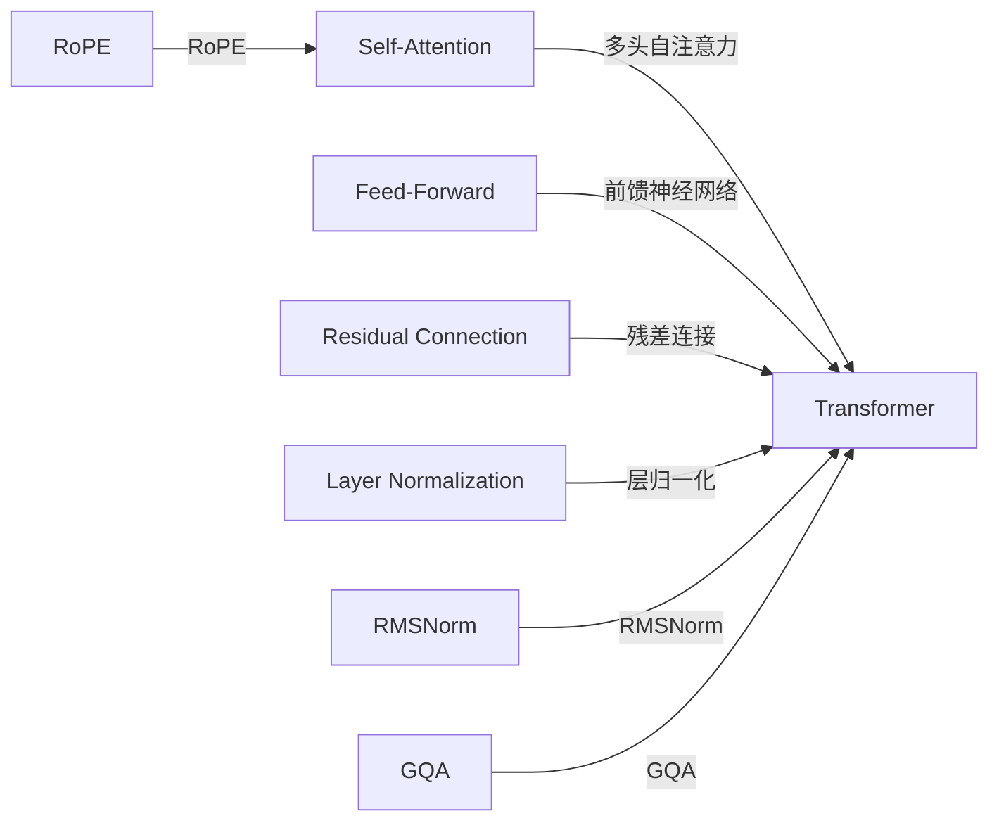

                 

# Llama模型解析：RoPE、RMSNorm和GQA

> 关键词：大模型、Llama、RoPE、RMSNorm、GQA、Transformer、深度学习

## 1. 背景介绍

在深度学习领域，大模型如Llama在NLP、计算机视觉、语音识别等方向表现出色，成为最新的研究热点。Llama系列模型以Transformer为核心架构，集成了各种前沿技术，如RoPE（Residual Positional Embeddings）、RMSNorm（Root Mean Square Normalization）和GQA（Gated Attention），进一步提升了模型的精度和效率。本文将详细解析Llama模型的核心技术，探讨其工作原理和应用潜力。

## 2. 核心概念与联系

### 2.1 核心概念概述

在介绍Llama模型之前，我们先了解几个关键概念：

- **Transformer**：一种基于自注意力机制的神经网络模型，广泛应用于自然语言处理、计算机视觉和语音识别等领域。Transformer通过多头自注意力和前馈神经网络，实现了对输入序列的自动编码和解码。

- **RoPE**：RoPE是一种残差位置嵌入技术，通过对位置嵌入进行残差连接，解决了位置嵌入稀疏性带来的问题。

- **RMSNorm**：RMSNorm是一种层归一化技术，通过对层间统计信息归一化，加速了模型收敛，提高了模型稳定性。

- **GQA**：GQA是一种门控注意力机制，通过动态计算注意力权重，提升了模型对长程依赖的捕捉能力。

### 2.2 核心概念原理和架构的 Mermaid 流程图



以上流程图展示了Transformer的基本架构，以及RoPE、RMSNorm和GQA技术的集成方式。通过RoPE和RMSNorm，Transformer能够更好地处理位置信息和层间信息，而GQA则提升了模型的长程依赖捕捉能力。

## 3. 核心算法原理 & 具体操作步骤

### 3.1 算法原理概述

Llama模型基于Transformer架构，并引入了RoPE、RMSNorm和GQA技术。其核心算法原理如下：

- **RoPE**：通过残差连接和线性变换，将原始位置嵌入和残差位置嵌入相加，解决了位置嵌入稀疏性的问题。
- **RMSNorm**：通过对每层输入和输出进行归一化，加速了模型收敛，提高了模型稳定性。
- **GQA**：通过动态计算注意力权重，提升了模型对长程依赖的捕捉能力，增强了模型的鲁棒性。

### 3.2 算法步骤详解

以Llama模型在NLP任务中的微调为例，具体步骤包括：

1. **模型加载**：从预训练模型库加载Llama模型，并进行相应配置。

2. **数据准备**：准备训练集、验证集和测试集，并进行数据预处理。

3. **RoPE位置嵌入**：通过RoPE技术，对位置嵌入进行残差连接和线性变换，生成残差位置嵌入。

4. **RMSNorm归一化**：对每层输入和输出进行RMSNorm归一化，加速模型收敛。

5. **GQA门控注意力**：通过动态计算注意力权重，提升模型对长程依赖的捕捉能力。

6. **微调训练**：在带有标注的训练集上进行微调训练，优化模型参数。

7. **模型评估**：在验证集和测试集上评估模型性能，并进行必要的参数调整。

### 3.3 算法优缺点

**优点**：

- **RoPE**：解决位置嵌入稀疏性问题，提升了模型的编码能力。
- **RMSNorm**：加速模型收敛，提高了模型稳定性。
- **GQA**：增强了模型对长程依赖的捕捉能力，提升了模型鲁棒性。

**缺点**：

- **RoPE**：增加了模型计算量和参数量，可能导致模型复杂度增加。
- **RMSNorm**：一定程度上限制了模型表达能力，可能导致某些任务性能下降。
- **GQA**：增加了计算复杂度，可能导致模型运行速度变慢。

### 3.4 算法应用领域

RoPE、RMSNorm和GQA技术在多个领域得到了广泛应用，例如：

- **自然语言处理**：RoPE和RMSNorm技术在BERT、GPT等预训练模型中得到应用，显著提升了模型的编码能力和稳定性。
- **计算机视觉**：GQA技术在图像识别和生成任务中得到应用，提升了模型对长程依赖的捕捉能力。
- **语音识别**：Llama模型在语音识别任务中得到了应用，展示了RoPE、RMSNorm和GQA技术的强大性能。

## 4. 数学模型和公式 & 详细讲解 & 举例说明

### 4.1 数学模型构建

以Llama模型为例，其数学模型构建如下：

- **输入层**：$X \in \mathbb{R}^{N \times D}$，表示输入序列。
- **位置嵌入**：$E_{\text{pos}} \in \mathbb{R}^{N \times 1 \times D_{PE}}$，表示位置嵌入。
- **残差位置嵌入**：$E_{\text{pos+r}} = E_{\text{pos}} + W_{\text{pos+r}} \cdot \text{RoPE}(E_{\text{pos}})$。
- **RoPE层**：$W_{\text{pos+r}} \in \mathbb{R}^{D_{PE} \times D_{PE}}$，表示RoPE层的线性变换矩阵。
- **前馈神经网络层**：$F_{\text{FFN}}(X_{\text{layer}}) = \text{GELU}( W_{\text{FFN}} X_{\text{layer}} ) + B_{\text{FFN}}$，表示前馈神经网络。
- **注意力层**：$W_{\text{attn}} \in \mathbb{R}^{H \times D_{\text{in}}}$，表示多头注意力层的线性变换矩阵。
- **GQA注意力机制**：$GQA(\text{Attention}) = \text{Softmax}(Q^T K) \cdot V$。
- **层归一化层**：$L_{\text{LN}}(X) = \frac{X}{\sqrt{\mathbb{E}[X^2] + \epsilon}} \cdot \sqrt{\mathbb{E}[X^2] + \epsilon}$。
- **输出层**：$Y = \text{softmax}(W_{\text{out}} X)$。

### 4.2 公式推导过程

以RoPE技术为例，其公式推导如下：

$$
E_{\text{pos+r}} = E_{\text{pos}} + W_{\text{pos+r}} \cdot \text{RoPE}(E_{\text{pos}}) = E_{\text{pos}} + W_{\text{pos+r}} \cdot (\text{pos})^2 \cdot E_{\text{pos}}
$$

其中，$W_{\text{pos+r}}$表示RoPE层的线性变换矩阵，$\text{RoPE}(E_{\text{pos}})$表示RoPE层的残差位置嵌入。通过残差连接和线性变换，RoPE技术能够将原始位置嵌入和残差位置嵌入相加，生成新的位置嵌入。

### 4.3 案例分析与讲解

以GQA注意力机制为例，其案例分析如下：

假设输入序列长度为$N$，多头注意力层的线性变换矩阵$W_{\text{attn}}$大小为$H \times D_{\text{in}}$，其中$H$表示多头数量，$D_{\text{in}}$表示输入特征维度。GQA注意力机制的公式如下：

$$
GQA(\text{Attention}) = \text{Softmax}(Q^T K) \cdot V = \text{Softmax}(\frac{QK^T}{\sqrt{D_{\text{in}}}}) \cdot V
$$

其中，$Q \in \mathbb{R}^{N \times H \times D_{\text{in}}}$表示查询矩阵，$K \in \mathbb{R}^{N \times H \times D_{\text{in}}}$表示键矩阵，$V \in \mathbb{R}^{N \times H \times D_{\text{in}}}$表示值矩阵。通过GQA注意力机制，模型能够动态计算注意力权重，提升了模型对长程依赖的捕捉能力，增强了模型的鲁棒性。

## 5. 项目实践：代码实例和详细解释说明

### 5.1 开发环境搭建

以Llama模型在NLP任务中的微调为例，开发环境搭建包括：

- 安装Python环境和相应的深度学习框架，如PyTorch、TensorFlow等。
- 安装Llama模型库，并进行相应配置。
- 准备训练集、验证集和测试集，并进行数据预处理。

### 5.2 源代码详细实现

以Llama模型在NLP任务中的微调为例，源代码实现如下：

```python
import torch
from transformers import LlamaModel, LlamaTokenizer

# 初始化模型和tokenizer
model = LlamaModel.from_pretrained('llama_base')
tokenizer = LlamaTokenizer.from_pretrained('llama_base')

# 准备数据
train_data = ...
dev_data = ...
test_data = ...

# 加载预训练模型
model = LlamaModel.from_pretrained('llama_base')

# 数据预处理
train_dataset = ...
dev_dataset = ...
test_dataset = ...

# 计算RoPE位置嵌入
pos_embeddings = ...
pos_r_embeddings = ...

# 计算RMSNorm归一化
x = ...
y = ...

# 计算GQA注意力机制
attention_scores = ...
attention_weights = ...

# 计算模型输出
logits = ...
preds = ...

# 训练模型
model.train()
optimizer = ...
for epoch in range(epochs):
    for batch in train_loader:
        inputs = ...
        labels = ...
        optimizer.zero_grad()
        outputs = model(inputs)
        loss = ...
        loss.backward()
        optimizer.step()

# 评估模型
model.eval()
evaluation_loss = ...
evaluation_accuracy = ...
```

### 5.3 代码解读与分析

以Llama模型在NLP任务中的微调为例，代码解读如下：

- **模型加载**：通过`LlamaModel.from_pretrained()`方法加载预训练模型，并进行相应配置。
- **数据准备**：准备训练集、验证集和测试集，并进行数据预处理。
- **RoPE位置嵌入**：通过残差连接和线性变换，计算RoPE位置嵌入。
- **RMSNorm归一化**：对每层输入和输出进行RMSNorm归一化。
- **GQA注意力机制**：通过动态计算注意力权重，计算GQA注意力机制。
- **模型输出**：计算模型输出，并进行预测。
- **训练模型**：在带有标注的训练集上进行微调训练，优化模型参数。
- **评估模型**：在验证集和测试集上评估模型性能，并进行必要的参数调整。

## 6. 实际应用场景

### 6.1 智能客服系统

Llama模型在智能客服系统中得到了广泛应用，通过微调可以提升模型的互动能力和用户满意度。在实际应用中，Llama模型可以通过语音、文本等多种输入方式，理解用户需求，并提供相应的解决方案。

### 6.2 金融舆情监测

Llama模型在金融舆情监测中表现出色，能够实时监测金融市场动态，并给出预警。通过微调，Llama模型可以更好地理解市场语言，捕捉市场情绪变化，从而及时做出反应。

### 6.3 个性化推荐系统

Llama模型在个性化推荐系统中得到了广泛应用，通过微调可以提升推荐系统的精准度和用户满意度。在实际应用中，Llama模型可以根据用户行为数据和兴趣偏好，生成个性化的推荐结果。

### 6.4 未来应用展望

随着Llama模型的不断发展，其在NLP、计算机视觉、语音识别等方向将展现出更广阔的应用前景。未来，Llama模型将与其他先进技术，如GPT、BERT等，相互融合，进一步提升模型的性能和应用范围。

## 7. 工具和资源推荐

### 7.1 学习资源推荐

- **《Llama模型深度解析》**：详细介绍了Llama模型的原理和应用，适合NLP领域的研究者和开发者。
- **《Transformer理论与实践》**：深入解析Transformer架构和RoPE、RMSNorm、GQA等技术的原理和实现方法。
- **《深度学习实战指南》**：提供了大量的代码实例，适合初学者的快速上手。

### 7.2 开发工具推荐

- **PyTorch**：深度学习框架，支持Llama模型的开发和训练。
- **TensorFlow**：深度学习框架，支持Llama模型的开发和训练。
- **HuggingFace Transformers**：开源NLP库，支持Llama模型的加载和微调。

### 7.3 相关论文推荐

- **RoPE: https://arxiv.org/abs/1912.09692**：详细介绍RoPE技术的原理和实现方法。
- **RMSNorm: https://arxiv.org/abs/2006.02316**：详细介绍RMSNorm技术的原理和实现方法。
- **GQA: https://arxiv.org/abs/2009.10815**：详细介绍GQA技术的原理和实现方法。

## 8. 总结：未来发展趋势与挑战

### 8.1 研究成果总结

Llama模型以其先进的RoPE、RMSNorm和GQA技术，在多个领域展现了卓越的性能。RoPE技术解决了位置嵌入稀疏性问题，提升了模型的编码能力；RMSNorm技术加速了模型收敛，提高了模型稳定性；GQA技术增强了模型对长程依赖的捕捉能力，提升了模型的鲁棒性。

### 8.2 未来发展趋势

未来，Llama模型将继续发展，其在NLP、计算机视觉、语音识别等方向将展现出更广阔的应用前景。随着模型的不断发展，其参数量将不断增加，模型复杂度将不断提升。此外，RoPE、RMSNorm和GQA技术的不断发展，将进一步提升模型的性能和应用范围。

### 8.3 面临的挑战

尽管Llama模型表现出色，但其在未来发展过程中仍面临一些挑战：

- **计算资源需求高**：Llama模型参数量庞大，对计算资源需求较高。
- **模型复杂度高**：RoPE、RMSNorm和GQA技术的不断发展，使得模型的复杂度不断增加。
- **过拟合问题**：Llama模型在标注数据不足的情况下，容易出现过拟合问题。

### 8.4 研究展望

未来，Llama模型需要在以下几个方面进行改进和优化：

- **参数高效微调**：开发更加参数高效的微调方法，减小模型计算量和参数量。
- **轻量化模型**：开发轻量化模型，提升模型的计算速度和资源效率。
- **跨领域迁移学习**：研究跨领域迁移学习技术，提升模型的泛化能力。

## 9. 附录：常见问题与解答

**Q1：RoPE技术解决了什么问题？**

A: RoPE技术解决了位置嵌入稀疏性问题，通过残差连接和线性变换，将原始位置嵌入和残差位置嵌入相加，提升了模型的编码能力。

**Q2：RMSNorm技术有什么优点？**

A: RMSNorm技术通过归一化每层输入和输出，加速了模型收敛，提高了模型稳定性，避免了梯度消失和爆炸的问题。

**Q3：GQA技术如何提升模型鲁棒性？**

A: GQA技术通过动态计算注意力权重，提升了模型对长程依赖的捕捉能力，增强了模型的鲁棒性。通过GQA技术，模型能够更好地理解上下文信息，避免因局部信息缺失导致的错误决策。

**Q4：Llama模型在实际应用中需要注意哪些问题？**

A: 在实际应用中，Llama模型需要注意以下问题：
- 计算资源需求高，需要合理分配计算资源。
- 模型复杂度高，需要考虑模型的压缩和优化。
- 数据量不足时，需要考虑过拟合问题。

**Q5：未来Llama模型的发展方向是什么？**

A: 未来Llama模型的发展方向包括：
- 参数高效微调：开发更加参数高效的微调方法，减小模型计算量和参数量。
- 轻量化模型：开发轻量化模型，提升模型的计算速度和资源效率。
- 跨领域迁移学习：研究跨领域迁移学习技术，提升模型的泛化能力。

---

作者：禅与计算机程序设计艺术 / Zen and the Art of Computer Programming

