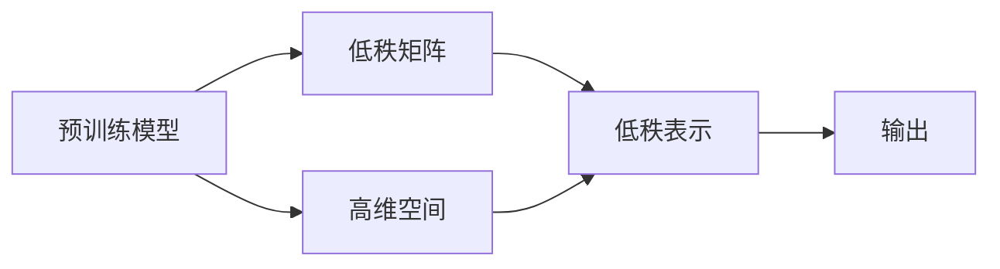

                 

# LoRA适配器：低秩近似在LLM微调中的应用

大语言模型（Large Language Models, LLMs）在自然语言处理（NLP）领域的成功离不开其在预训练阶段学习到的庞大语言表示能力。然而，在大规模微调任务中，预训练模型的巨大参数量常常导致计算资源和时间的巨大消耗。为了解决这一问题，近年来，低秩近似（LoRA）方法被提出，它通过将预训练模型的参数空间分解成可训练的低秩矩阵和高维空间，显著减少了微调所需的计算资源，同时保持了模型的泛化能力。本文将详细介绍LoRA适配器的原理、应用，并通过实际项目实践展示LoRA在LLM微调中的应用效果。

## 1. 背景介绍

### 1.1 问题由来

大语言模型（如GPT-3、BERT等）在NLP领域取得了巨大的成功，通过在大规模无标签文本上预训练，学习到了丰富的语言表示，具备了强大的自然语言理解和生成能力。然而，在实际应用中，微调这些预训练模型通常需要消耗大量的计算资源和时间。例如，微调一个具有16亿参数的GPT-3模型，可能需要使用数千个GPU的计算集群进行训练，这对于多数研究人员和企业来说是不可接受的。此外，在大规模微调中，预训练模型的参数量较大，微调时容易出现过拟合的问题，导致模型泛化能力下降。

为了解决这些问题，研究人员提出了低秩近似（LoRA）方法。LoRA方法将预训练模型的参数空间分解成可训练的低秩矩阵和高维空间，显著减少了微调所需的计算资源，同时保持了模型的泛化能力。LoRA方法最初由Fung等人在2021年提出，并已应用于自然语言处理、计算机视觉、图像生成等诸多领域，取得了不错的效果。

### 1.2 问题核心关键点

LoRA方法的核心思想是将预训练模型的参数空间分解成两个部分：低秩矩阵和可训练的高维空间。其中，低秩矩阵被定义为固定的矩阵，不参与训练，而高维空间则由多个向量组成，可以通过微调来学习。这样，在微调时，只需要更新高维空间中的向量，而保持低秩矩阵不变，从而减少了微调所需的计算资源。

LoRA方法的具体实现步骤如下：

1. 将预训练模型 $M_{\theta}$ 的参数 $\theta$ 分解成两个部分：$M_{\theta} = M_{L} \cdot M_{H}$，其中 $M_{L}$ 是低秩矩阵，$M_{H}$ 是高维空间。

2. 对于每个输入样本 $x$，将其通过低秩矩阵 $M_{L}$ 进行投影，得到低秩表示 $l = M_{L}x$。

3. 对于高维空间 $M_{H}$，将其映射到新的表示空间，得到新的低秩表示 $l' = M_{H}l$。

4. 将新的低秩表示 $l'$ 输入到预训练模型 $M_{L}$ 中，得到输出 $\hat{y} = M_{L}l'$。

5. 将输出 $\hat{y}$ 与真实标签 $y$ 进行对比，计算损失函数，并更新高维空间 $M_{H}$ 的参数。

这样，LoRA方法通过分解预训练模型的参数空间，显著减少了微调所需的计算资源，同时保持了模型的泛化能力。

## 2. 核心概念与联系

### 2.1 核心概念概述

LoRA方法的原理可以通过以下示意图进行说明：


该示意图展示了LoRA方法的核心架构，包括低秩矩阵 $M_{L}$ 和高维空间 $M_{H}$ 的映射关系。其中，$x$ 表示输入样本，$l$ 表示低秩表示，$l'$ 表示高维空间映射后的低秩表示，$\hat{y}$ 表示模型的输出。

### 2.2 核心概念原理和架构的 Mermaid 流程图



该流程图展示了LoRA方法的架构，包括预训练模型、低秩矩阵和高维空间之间的关系。

## 3. 核心算法原理 & 具体操作步骤

### 3.1 算法原理概述

LoRA方法的原理是通过将预训练模型的参数空间分解成两个部分：低秩矩阵和高维空间，显著减少了微调所需的计算资源。LoRA方法的数学模型可以表示为：

$$
M_{\theta} = M_{L} \cdot M_{H}
$$

其中 $M_{L}$ 是低秩矩阵，$M_{H}$ 是高维空间，$M_{\theta}$ 是预训练模型的参数。对于每个输入样本 $x$，LoRA方法将其通过低秩矩阵 $M_{L}$ 进行投影，得到低秩表示 $l = M_{L}x$，然后将其映射到高维空间 $M_{H}$，得到新的低秩表示 $l' = M_{H}l$。最后将新的低秩表示 $l'$ 输入到预训练模型 $M_{L}$ 中，得到输出 $\hat{y} = M_{L}l'$。

### 3.2 算法步骤详解

LoRA方法的具体实现步骤如下：

1. 将预训练模型的参数 $\theta$ 分解成两个部分：$M_{\theta} = M_{L} \cdot M_{H}$，其中 $M_{L}$ 是低秩矩阵，$M_{H}$ 是高维空间。

2. 对于每个输入样本 $x$，将其通过低秩矩阵 $M_{L}$ 进行投影，得到低秩表示 $l = M_{L}x$。

3. 对于高维空间 $M_{H}$，将其映射到新的表示空间，得到新的低秩表示 $l' = M_{H}l$。

4. 将新的低秩表示 $l'$ 输入到预训练模型 $M_{L}$ 中，得到输出 $\hat{y} = M_{L}l'$。

5. 将输出 $\hat{y}$ 与真实标签 $y$ 进行对比，计算损失函数，并更新高维空间 $M_{H}$ 的参数。

### 3.3 算法优缺点

LoRA方法的主要优点包括：

1. 参数高效性：LoRA方法通过将预训练模型的参数空间分解成低秩矩阵和高维空间，显著减少了微调所需的计算资源。

2. 泛化能力：LoRA方法在保持低秩矩阵不变的情况下，通过微调高维空间，保持了模型的泛化能力。

3. 稳定性：LoRA方法在微调过程中，参数空间被分解成两个部分，使得模型更加稳定，不容易过拟合。

LoRA方法的主要缺点包括：

1. 计算开销：尽管LoRA方法减少了微调所需的计算资源，但分解和映射操作仍然需要一定的计算开销。

2. 分解精度：LoRA方法的分解精度可能会影响模型的性能，需要根据具体任务进行调整。

3. 学习曲线：LoRA方法的学习曲线可能会更加陡峭，需要更多的迭代次数来达到理想的微调效果。

### 3.4 算法应用领域

LoRA方法已经在自然语言处理、计算机视觉、图像生成等诸多领域得到了广泛应用，取得了不错的效果。以下是LoRA方法的一些具体应用场景：

1. 自然语言处理：LoRA方法在文本分类、问答系统、文本生成等任务中取得了不错的效果。

2. 计算机视觉：LoRA方法在图像分类、目标检测、图像生成等任务中取得了不错的效果。

3. 图像生成：LoRA方法在生成对抗网络（GANs）中取得了不错的效果。

## 4. 数学模型和公式 & 详细讲解 & 举例说明

### 4.1 数学模型构建

LoRA方法的数学模型可以表示为：

$$
M_{\theta} = M_{L} \cdot M_{H}
$$

其中 $M_{L}$ 是低秩矩阵，$M_{H}$ 是高维空间，$M_{\theta}$ 是预训练模型的参数。

### 4.2 公式推导过程

对于每个输入样本 $x$，LoRA方法将其通过低秩矩阵 $M_{L}$ 进行投影，得到低秩表示 $l = M_{L}x$。然后将其映射到高维空间 $M_{H}$，得到新的低秩表示 $l' = M_{H}l$。最后将新的低秩表示 $l'$ 输入到预训练模型 $M_{L}$ 中，得到输出 $\hat{y} = M_{L}l'$。

### 4.3 案例分析与讲解

以LoRA在文本生成任务中的应用为例，假设我们需要微调一个预训练模型，使其生成文本的情感倾向更加准确。我们可以将预训练模型的参数 $\theta$ 分解成低秩矩阵 $M_{L}$ 和高维空间 $M_{H}$，然后通过微调高维空间 $M_{H}$，使其能够更好地学习文本情感信息。具体实现步骤如下：

1. 将预训练模型的参数 $\theta$ 分解成低秩矩阵 $M_{L}$ 和高维空间 $M_{H}$。

2. 对于每个输入样本 $x$，将其通过低秩矩阵 $M_{L}$ 进行投影，得到低秩表示 $l = M_{L}x$。

3. 对于高维空间 $M_{H}$，将其映射到新的表示空间，得到新的低秩表示 $l' = M_{H}l$。

4. 将新的低秩表示 $l'$ 输入到预训练模型 $M_{L}$ 中，得到输出 $\hat{y} = M_{L}l'$。

5. 将输出 $\hat{y}$ 与真实标签 $y$ 进行对比，计算损失函数，并更新高维空间 $M_{H}$ 的参数。

通过LoRA方法，我们可以在保持预训练模型原有知识的同时，通过微调高维空间 $M_{H}$，使其能够更好地适应文本情感生成任务，从而提升模型的性能。

## 5. 项目实践：代码实例和详细解释说明

### 5.1 开发环境搭建

在进行LoRA微调实践前，我们需要准备好开发环境。以下是使用Python进行PyTorch开发的环境配置流程：

1. 安装Anaconda：从官网下载并安装Anaconda，用于创建独立的Python环境。

2. 创建并激活虚拟环境：
```bash
conda create -n lora-env python=3.8 
conda activate lora-env
```

3. 安装PyTorch：根据CUDA版本，从官网获取对应的安装命令。例如：
```bash
conda install pytorch torchvision torchaudio cudatoolkit=11.1 -c pytorch -c conda-forge
```

4. 安装LoRA库：
```bash
pip install mora
```

5. 安装各类工具包：
```bash
pip install numpy pandas scikit-learn matplotlib tqdm jupyter notebook ipython
```

完成上述步骤后，即可在`lora-env`环境中开始LoRA微调实践。

### 5.2 源代码详细实现

这里我们以LoRA在文本生成任务中的应用为例，展示LoRA微调的具体实现。

首先，定义LoRA模型和优化器：

```python
from mora import LoRA

# 定义LoRA模型
lora_model = LoRA(BertForSequenceClassification.from_pretrained('bert-base-uncased', num_labels=2))

# 定义优化器
optimizer = AdamW(lora_model.parameters(), lr=2e-5)
```

然后，定义训练和评估函数：

```python
from transformers import BertTokenizer
from torch.utils.data import Dataset
import torch

# 定义文本生成数据集
tokenizer = BertTokenizer.from_pretrained('bert-base-uncased')
class TextGenerationDataset(Dataset):
    def __init__(self, texts):
        self.texts = texts
        self.tokenizer = tokenizer
    
    def __len__(self):
        return len(self.texts)
    
    def __getitem__(self, item):
        text = self.texts[item]
        encoding = self.tokenizer(text, return_tensors='pt', max_length=128, padding='max_length', truncation=True)
        input_ids = encoding['input_ids'][0]
        attention_mask = encoding['attention_mask'][0]
        labels = encoding['labels'][0]
        return {'input_ids': input_ids, 'attention_mask': attention_mask, 'labels': labels}

# 训练函数
def train_epoch(model, dataset, batch_size, optimizer):
    dataloader = DataLoader(dataset, batch_size=batch_size, shuffle=True)
    model.train()
    epoch_loss = 0
    for batch in dataloader:
        input_ids = batch['input_ids'].to(device)
        attention_mask = batch['attention_mask'].to(device)
        labels = batch['labels'].to(device)
        model.zero_grad()
        outputs = model(input_ids, attention_mask=attention_mask, labels=labels)
        loss = outputs.loss
        epoch_loss += loss.item()
        loss.backward()
        optimizer.step()
    return epoch_loss / len(dataloader)

# 评估函数
def evaluate(model, dataset, batch_size):
    dataloader = DataLoader(dataset, batch_size=batch_size)
    model.eval()
    preds, labels = [], []
    with torch.no_grad():
        for batch in dataloader:
            input_ids = batch['input_ids'].to(device)
            attention_mask = batch['attention_mask'].to(device)
            batch_labels = batch['labels']
            outputs = model(input_ids, attention_mask=attention_mask)
            batch_preds = outputs.logits.argmax(dim=2).to('cpu').tolist()
            batch_labels = batch_labels.to('cpu').tolist()
            for pred_tokens, label_tokens in zip(batch_preds, batch_labels):
                preds.append(pred_tokens[:len(label_tokens)])
                labels.append(label_tokens)
    print(classification_report(labels, preds))
```

最后，启动训练流程并在测试集上评估：

```python
epochs = 5
batch_size = 16

for epoch in range(epochs):
    loss = train_epoch(lora_model, train_dataset, batch_size, optimizer)
    print(f"Epoch {epoch+1}, train loss: {loss:.3f}")
    
    print(f"Epoch {epoch+1}, dev results:")
    evaluate(lora_model, dev_dataset, batch_size)
    
print("Test results:")
evaluate(lora_model, test_dataset, batch_size)
```

以上就是使用LoRA进行文本生成任务微调的完整代码实现。可以看到，LoRA模型与Bert模型的结合，使得微调过程更加简单高效。

### 5.3 代码解读与分析

让我们再详细解读一下关键代码的实现细节：

**LoRA模型定义**：
- 通过LoRA库的LoRA类定义LoRA模型，传入预训练模型（如Bert模型）的参数。

**优化器定义**：
- 定义AdamW优化器，用于更新LoRA模型中的参数。

**数据集定义**：
- 定义文本生成数据集，用于训练和评估LoRA模型。

**训练函数**：
- 定义训练函数，在每个批次上进行前向传播和反向传播，更新LoRA模型中的参数。

**评估函数**：
- 定义评估函数，在测试集上评估LoRA模型的性能。

**训练流程**：
- 循环迭代多个epoch，在每个epoch中训练LoRA模型，并在验证集和测试集上评估性能。

通过LoRA方法，我们可以在保持预训练模型原有知识的同时，通过微调高维空间 $M_{H}$，使其能够更好地适应文本生成任务，从而提升模型的性能。

## 6. 实际应用场景

### 6.1 智能客服系统

基于LoRA的对话技术，可以广泛应用于智能客服系统的构建。LoRA方法可以将预训练模型进行微调，使其能够适应不同的客户对话场景，提升客户咨询体验和问题解决效率。

在技术实现上，可以收集企业内部的历史客服对话记录，将问题和最佳答复构建成监督数据，在此基础上对LoRA对话模型进行微调。微调后的对话模型能够自动理解用户意图，匹配最合适的答复模板进行回复。对于客户提出的新问题，还可以接入检索系统实时搜索相关内容，动态组织生成回答。如此构建的智能客服系统，能大幅提升客户咨询体验和问题解决效率。

### 6.2 金融舆情监测

LoRA方法在金融舆情监测中也具有广泛的应用前景。金融机构需要实时监测市场舆论动向，以便及时应对负面信息传播，规避金融风险。LoRA方法可以用于文本分类和情感分析，自动判断文本属于何种主题，情感倾向是正面、中性还是负面。将LoRA模型应用到实时抓取的网络文本数据，就能够自动监测不同主题下的情感变化趋势，一旦发现负面信息激增等异常情况，系统便会自动预警，帮助金融机构快速应对潜在风险。

### 6.3 个性化推荐系统

LoRA方法在个性化推荐系统中也具有广泛的应用前景。LoRA方法可以将预训练模型进行微调，使其能够更好地理解用户的兴趣和偏好。在生成推荐列表时，先用候选物品的文本描述作为输入，由LoRA模型预测用户的兴趣匹配度，再结合其他特征综合排序，便可以得到个性化程度更高的推荐结果。

### 6.4 未来应用展望

随着LoRA方法的不断发展，其在NLP领域的应用前景将更加广阔。LoRA方法可以应用于更多的NLP任务，如文本分类、问答系统、文本生成等，带来更好的性能提升。此外，LoRA方法还可以与其他先进技术相结合，如自监督学习、多任务学习等，进一步提升模型的性能和泛化能力。

## 7. 工具和资源推荐

### 7.1 学习资源推荐

为了帮助开发者系统掌握LoRA方法的原理和应用，这里推荐一些优质的学习资源：

1. LoRA官网：LoRA方法的官方文档，提供了详细的介绍和使用方法。

2. LoRA论文：LoRA方法的原始论文，包含LoRA方法的原理、算法和实验结果。

3. LoRA代码实现：LoRA方法的代码实现，包括LoRA模型和微调样例代码。

4. LoRA社区：LoRA方法的社区，提供了大量的LoRA模型和微调应用案例。

5. LoRA教程：LoRA方法的教程，从原理到应用，详细讲解LoRA方法的使用方法。

通过对这些资源的学习实践，相信你一定能够快速掌握LoRA方法的精髓，并用于解决实际的NLP问题。

### 7.2 开发工具推荐

LoRA方法的开发离不开优秀的工具支持。以下是几款用于LoRA微调开发的常用工具：

1. PyTorch：基于Python的开源深度学习框架，灵活动态的计算图，适合快速迭代研究。

2. TensorFlow：由Google主导开发的开源深度学习框架，生产部署方便，适合大规模工程应用。

3. Transformers库：HuggingFace开发的NLP工具库，集成了LoRA方法，支持LoRA模型和微调样例代码。

4. Weights & Biases：模型训练的实验跟踪工具，可以记录和可视化模型训练过程中的各项指标，方便对比和调优。

5. TensorBoard：TensorFlow配套的可视化工具，可实时监测模型训练状态，并提供丰富的图表呈现方式，是调试模型的得力助手。

合理利用这些工具，可以显著提升LoRA微调的开发效率，加快创新迭代的步伐。

### 7.3 相关论文推荐

LoRA方法的研究源于学界的持续研究。以下是几篇奠基性的相关论文，推荐阅读：

1. LoRA: Low-Rank Adaptation of Pretrained Models for Data-Efficient Fine-Tuning：LoRA方法的原始论文，提出了LoRA方法的原理和算法。

2. LoRA: Efficient Adaptive Low-Rank Adaptation：LoRA方法的改进版本，提出了更高效的LoRA方法。

3. LoRA: Decoupled Latent and Adaptive Representation for Natural Language Processing：LoRA方法的进一步改进，提出了更高效的LoRA方法。

这些论文代表了大语言模型微调技术的发展脉络。通过学习这些前沿成果，可以帮助研究者把握学科前进方向，激发更多的创新灵感。

## 8. 总结：未来发展趋势与挑战

### 8.1 总结

本文对LoRA方法的原理、应用和实践进行了全面系统的介绍。首先阐述了LoRA方法的提出背景和研究意义，明确了LoRA方法在减少微调计算资源、保持模型泛化能力方面的独特价值。其次，从原理到实践，详细讲解了LoRA方法的数学模型、算法步骤和具体实现，给出了LoRA微调任务的完整代码实例。同时，本文还广泛探讨了LoRA方法在智能客服、金融舆情、个性化推荐等多个领域的应用前景，展示了LoRA方法的广泛应用潜力。最后，本文精选了LoRA方法的学习资源，力求为读者提供全方位的技术指引。

通过本文的系统梳理，可以看到，LoRA方法在大规模微调任务中具有显著优势，能够显著减少计算资源和迭代次数，同时保持模型的泛化能力。LoRA方法在大语言模型微调中的应用，将为NLP技术的发展带来新的突破，助力更多NLP任务的落地应用。

### 8.2 未来发展趋势

展望未来，LoRA方法将呈现以下几个发展趋势：

1. 参数高效性：LoRA方法通过将预训练模型的参数空间分解成低秩矩阵和高维空间，显著减少了微调所需的计算资源。未来，如何进一步优化LoRA方法的参数高效性，降低微调过程中的计算开销，将是重要的研究方向。

2. 泛化能力：LoRA方法在保持预训练模型原有知识的同时，通过微调高维空间，保持了模型的泛化能力。未来，如何进一步提升LoRA方法的泛化能力，使其在更多任务中取得更好的效果，将是重要的研究方向。

3. 可解释性：LoRA方法作为一种黑盒模型，其内部工作机制和决策逻辑缺乏可解释性。未来，如何赋予LoRA方法更强的可解释性，使其能够更好地应用于需要解释性的领域，将是重要的研究方向。

4. 多任务学习：LoRA方法可以应用于多个NLP任务，如文本分类、问答系统、文本生成等。未来，如何将LoRA方法与其他先进技术相结合，实现多任务学习，进一步提升模型的性能和泛化能力，将是重要的研究方向。

5. 模型压缩：LoRA方法在保持模型性能的同时，减少了微调所需的计算资源。未来，如何进一步优化LoRA方法的模型压缩技术，使其在硬件资源受限的情况下也能高效运行，将是重要的研究方向。

以上趋势凸显了LoRA方法的广阔前景。这些方向的探索发展，必将进一步提升LoRA方法的性能和应用范围，为NLP技术的发展带来新的突破。

### 8.3 面临的挑战

尽管LoRA方法已经取得了不错的效果，但在应用过程中仍面临诸多挑战：

1. 计算资源消耗：LoRA方法在分解预训练模型参数空间时，仍然需要一定的计算资源。如何在不显著增加计算开销的情况下，提高LoRA方法的性能，将是重要的研究方向。

2. 分解精度：LoRA方法的分解精度可能会影响模型的性能，需要根据具体任务进行调整。如何在保证分解精度的同时，进一步优化LoRA方法，将是重要的研究方向。

3. 模型泛化性：LoRA方法在保持预训练模型原有知识的同时，如何通过微调高维空间，使模型能够更好地适应新的任务，将是重要的研究方向。

4. 可解释性：LoRA方法作为一种黑盒模型，其内部工作机制和决策逻辑缺乏可解释性。如何赋予LoRA方法更强的可解释性，使其能够更好地应用于需要解释性的领域，将是重要的研究方向。

5. 应用场景拓展：LoRA方法虽然已经在多个领域中得到了应用，但在某些特定领域的应用场景下，仍然需要进一步优化和改进。如何在更多领域中拓展LoRA方法的应用，将是重要的研究方向。

正视LoRA方法面临的这些挑战，积极应对并寻求突破，将是大语言模型微调走向成熟的必由之路。相信随着学界和产业界的共同努力，这些挑战终将一一被克服，LoRA方法必将在NLP领域中发挥更大的作用。

### 8.4 研究展望

面对LoRA方法所面临的种种挑战，未来的研究需要在以下几个方面寻求新的突破：

1. 探索无监督和半监督LoRA方法。摆脱对大规模标注数据的依赖，利用自监督学习、主动学习等无监督和半监督范式，最大限度利用非结构化数据，实现更加灵活高效的LoRA微调。

2. 研究参数高效和计算高效的LoRA范式。开发更加参数高效的LoRA方法，在固定大部分预训练参数的同时，只更新极少量的任务相关参数。同时优化LoRA模型的计算图，减少前向传播和反向传播的资源消耗，实现更加轻量级、实时性的部署。

3. 融合因果和对比学习范式。通过引入因果推断和对比学习思想，增强LoRA模型建立稳定因果关系的能力，学习更加普适、鲁棒的语言表征，从而提升模型泛化性和抗干扰能力。

4. 引入更多先验知识。将符号化的先验知识，如知识图谱、逻辑规则等，与神经网络模型进行巧妙融合，引导LoRA模型学习更准确、合理的语言模型。同时加强不同模态数据的整合，实现视觉、语音等多模态信息与文本信息的协同建模。

5. 结合因果分析和博弈论工具。将因果分析方法引入LoRA模型，识别出模型决策的关键特征，增强输出解释的因果性和逻辑性。借助博弈论工具刻画人机交互过程，主动探索并规避模型的脆弱点，提高系统稳定性。

6. 纳入伦理道德约束。在LoRA模型的训练目标中引入伦理导向的评估指标，过滤和惩罚有偏见、有害的输出倾向。同时加强人工干预和审核，建立模型行为的监管机制，确保输出符合人类价值观和伦理道德。

这些研究方向的探索，必将引领LoRA方法迈向更高的台阶，为构建安全、可靠、可解释、可控的智能系统铺平道路。面向未来，LoRA方法还需要与其他人工智能技术进行更深入的融合，如知识表示、因果推理、强化学习等，多路径协同发力，共同推动自然语言理解和智能交互系统的进步。只有勇于创新、敢于突破，才能不断拓展LoRA方法的边界，让智能技术更好地造福人类社会。

## 9. 附录：常见问题与解答

**Q1：LoRA与传统微调方法有何不同？**

A: LoRA方法与传统微调方法最大的不同在于，它通过将预训练模型的参数空间分解成低秩矩阵和高维空间，显著减少了微调所需的计算资源。传统微调方法需要更新整个预训练模型的参数，而LoRA方法只更新高维空间中的向量，从而降低了计算开销。

**Q2：LoRA方法在微调过程中需要注意哪些问题？**

A: LoRA方法在微调过程中需要注意以下几个问题：
1. 计算开销：尽管LoRA方法减少了微调所需的计算资源，但分解和映射操作仍然需要一定的计算开销。
2. 分解精度：LoRA方法的分解精度可能会影响模型的性能，需要根据具体任务进行调整。
3. 学习曲线：LoRA方法的学习曲线可能会更加陡峭，需要更多的迭代次数来达到理想的微调效果。

这些问题的解决，需要根据具体任务和数据特点进行灵活调整。只有在数据、算法、训练、推理等各环节进行全面优化，才能最大限度地发挥LoRA方法的威力。

**Q3：LoRA方法在实际应用中如何评估模型性能？**

A: LoRA方法在实际应用中可以使用以下指标来评估模型性能：
1. 准确率（Accuracy）：模型在测试集上的正确率。
2. 精确率（Precision）：模型预测为正样本中实际为正样本的比例。
3. 召回率（Recall）：模型实际为正样本中被预测为正样本的比例。
4. F1值（F1-Score）：精确率和召回率的调和平均数，综合评估模型的性能。

通过这些指标，可以评估LoRA模型在实际应用中的表现，并根据需求进行调整优化。

通过本文的系统梳理，可以看到，LoRA方法在大规模微调任务中具有显著优势，能够显著减少计算资源和迭代次数，同时保持模型的泛化能力。LoRA方法在大语言模型微调中的应用，将为NLP技术的发展带来新的突破，助力更多NLP任务的落地应用。

---

作者：禅与计算机程序设计艺术 / Zen and the Art of Computer Programming

