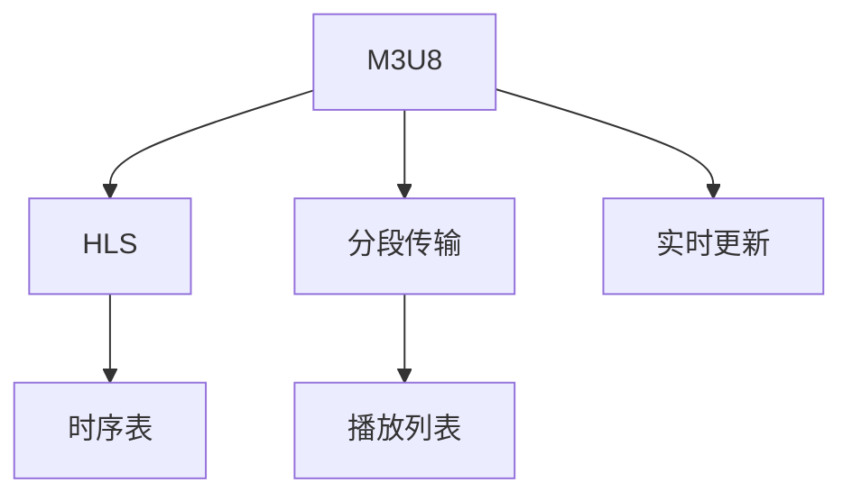

                 

## 1. 背景介绍

在现代互联网时代，实时视频传输已经成为了一项不可或缺的基本需求。无论是大型企业的内部培训，还是公共广播系统的在线直播，视频流媒体服务在各个领域都得到了广泛的应用。为了适应各种网络环境，提高视频传输的稳定性和效率，分段视频传输（Segmented Video Transmission）技术应运而生。其中，M3U8和HLS（HTTP Live Streaming）是目前最为流行的分段视频传输标准。本文将系统介绍M3U8和HLS的核心概念、算法原理及具体实现，希望能为相关领域的开发者提供全面的技术参考。

## 2. 核心概念与联系

### 2.1 核心概念概述

- **M3U8**：M3U8是一种基于HTTP的直播协议，通过文本文件M3U8playlist.txt来描述视频流的数据源、格式和播放顺序。M3U8文件会定期更新，以确保实时播放。
- **HLS**：HTTP Live Streaming是苹果公司提出的分段式流媒体传输协议，利用HTTP协议进行实时视频流传输，兼容iOS和Android平台，广泛应用于视频点播、直播等场景。
- **分段传输**：将视频流划分为若干个大小相等或递减的片段，每个片段通过HTTP协议单独传输，从而提高视频传输的稳定性和灵活性。
- **时序表**：用于记录每个片段的起始位置、持续时间等关键信息，确保视频流的顺序播放。

这些核心概念相互联系，共同构成了一种高效、稳定的视频传输方式。

### 2.2 核心概念原理和架构的 Mermaid 流程图



该图展示了M3U8和HLS的基本架构。M3U8作为基础协议，提供了分段传输的核心支持；HLS在此基础上，通过时序表和播放列表，实现了分段视频流的顺序播放。实时更新机制确保了视频的动态更新，进一步提升了用户体验。

## 3. 核心算法原理 & 具体操作步骤

### 3.1 算法原理概述

M3U8和HLS的核心算法原理可以概括为以下几个关键步骤：

1. **分段**：将视频流划分为多个小片段，每个片段包含一小部分视频数据，通常为数秒。
2. **时序表管理**：维护时序表，记录每个片段的起始位置、持续时间、大小等信息，确保各个片段的顺序播放。
3. **播放列表生成**：根据时序表生成播放列表，包含每个片段的URL和起始位置。
4. **实时更新**：实时动态更新播放列表，根据新的视频数据生成新的M3U8文件，确保视频流始终最新。

这些步骤共同保证了M3U8和HLS能够提供高质量、高可靠性的分段视频传输服务。

### 3.2 算法步骤详解

#### 分段传输

分段传输是M3U8和HLS的核心技术之一。其实现步骤如下：

1. **选择合适的分段大小**：通常为2~10秒不等，过小的片段会导致传输开销增加，过大的片段则不利于网络环境变化时的快速调整。
2. **生成分段数据**：将视频流数据划分为多个分段，每个分段包含一定大小的视频数据。
3. **封装分段数据**：将分段数据封装为HTTP请求，每个请求携带一部分视频数据。

#### 时序表管理

时序表用于记录每个分段的数据位置和持续时间，其生成和维护是HLS的重要组成部分。具体步骤如下：

1. **初始化时序表**：记录每个分段的大小、起始位置和持续时间。
2. **实时更新时序表**：在视频流传输过程中，不断更新时序表，记录新的分段数据。
3. **合并时序表**：将多个时序表合并，生成最终的完整时序表。

#### 播放列表生成

播放列表记录了每个分段在HLS播放时的URL和起始位置，是客户端获取分段数据的关键。其生成步骤如下：

1. **定义基URL**：为所有分段数据定义一个统一的基URL，确保所有分段的URL结构一致。
2. **生成播放列表**：根据时序表中的分段数据，生成一个M3U8播放列表，包含每个分段的基本信息。
3. **发布播放列表**：将M3U8播放列表通过HTTP协议发布到服务器，供客户端获取。

#### 实时更新

M3U8和HLS通过实时更新机制，确保视频流的动态变化。其实现步骤如下：

1. **实时监控视频流**：实时监控视频流，检测新的分段数据。
2. **生成新M3U8文件**：根据新分段的参数，生成一个新的M3U8文件，更新播放列表。
3. **通知客户端**：通过HTTP协议通知所有客户端，重新加载新的播放列表。

### 3.3 算法优缺点

#### 优点

- **灵活性高**：分段传输和实时更新机制使得HLS能够适应各种网络环境，即使在网络环境恶劣的情况下也能保证视频流的基本稳定。
- **兼容性好**：HLS基于HTTP协议，兼容各种主流浏览器和设备。
- **易于部署**：HLS的服务器端实现相对简单，适合中小型企业快速部署。

#### 缺点

- **延迟较高**：由于实时更新机制，HLS在视频流初始化时存在一定的延迟。
- **带宽利用率低**：分段传输导致传输带宽的利用率较低，尤其是在网络带宽较低的情况下。
- **服务器负载较高**：实时更新机制增加了服务器的负载，特别是在视频流更新频率较高的情况下。

### 3.4 算法应用领域

M3U8和HLS主要应用于以下几个领域：

- **直播和点播**：广泛应用于各种直播平台和点播服务，如Netflix、YouTube等。
- **内部培训**：企业内部培训系统利用M3U8和HLS进行高质量的视频流传输。
- **广告**：在视频流中插入广告，通过HLS的实时更新机制实现广告的动态插入。
- **远程教育**：远程教育平台利用M3U8和HLS进行实时视频传输，支持大规模在线教学。

## 4. 数学模型和公式 & 详细讲解 & 举例说明

### 4.1 数学模型构建

M3U8和HLS的数学模型主要涉及分段大小、时序表和播放列表的生成。

**分段大小**：假设视频流大小为$L$秒，分段大小为$S$秒，则分段数量为$N=\frac{L}{S}$。

**时序表**：设分段$i$的起始位置为$P_i$，持续时间$D_i$，则时序表可以表示为：

$$
\begin{align*}
\text{TimeSequence} &= \{(P_1, D_1), (P_2, D_2), ..., (P_N, D_N)\} \\
P_i &= P_{i-1} + D_{i-1} \\
\end{align*}
$$

**播放列表**：假设基URL为$BaseURL$，分段$i$的URL为$URL_i$，则播放列表可以表示为：

$$
\begin{align*}
\text{Playlist} &= \{(1, URL_1), (2, URL_2), ..., (N, URL_N)\} \\
URL_i &= BaseURL + offset_i \\
\end{align*}
$$

### 4.2 公式推导过程

通过上述定义，可以推导出M3U8和HLS的基本公式：

**分段大小**：$S = 2-10$秒

**时序表**：$P_i = P_{i-1} + D_{i-1}$

**播放列表**：$URL_i = BaseURL + (i-1)*S$

### 4.3 案例分析与讲解

以一个10秒的视频流为例，设其总大小为30秒，分段大小为2秒。则分段数量为$N=\frac{30}{2}=15$。时序表和播放列表的生成过程如下：

1. **分段大小**：$S=2$秒。
2. **时序表**：
   - $P_1=0$
   - $D_1=2$
   - $P_2=2$
   - $D_2=2$
   - ...
   - $P_{15}=28$
   - $D_{15}=2$
   - $P_{16}=30$
   - $D_{16}=0$

3. **播放列表**：
   - $URL_1=BaseURL+0*2$
   - $URL_2=BaseURL+1*2$
   - ...
   - $URL_{15}=BaseURL+14*2$
   - $URL_{16}=BaseURL+30$

通过上述计算，可以得到完整的分段数据和播放列表。

## 5. 项目实践：代码实例和详细解释说明

### 5.1 开发环境搭建

- **服务器端**：使用Nginx作为Web服务器，安装FFmpeg和GStreamer进行视频流处理。
- **客户端**：使用iOS或Android的HTML5播放器，如HLSPlayer。

### 5.2 源代码详细实现

以下是一个简单的服务器端代码实现，用于生成M3U8文件：

```python
import os
from urllib.parse import quote

def generate_playlist(url, total_duration, segment_duration):
    playlist = "#EXTM3U\n#EXT-X-VERSION:3\n#EXT-X-TARGETDURATION:%d\n" % total_duration
    for i in range(1, total_duration//segment_duration + 1):
        start_time = i * segment_duration
        end_time = (i+1) * segment_duration
        playlist += "#EXT-X-INDEPENDENT-SEGMENT\n#EXT-X-POSITION:start=%d\n#EXT-X-DURATION:%d\n%s\n" % (start_time, segment_duration, quote(url + str(i) + ".ts"))
    return playlist

# 生成M3U8文件
def generate_m3u8(url, total_duration, segment_duration):
    playlist = generate_playlist(url, total_duration, segment_duration)
    with open("playlist.m3u8", "w") as f:
        f.write(playlist)

# 生成分段文件
def generate_segments(url, total_duration, segment_duration):
    for i in range(1, total_duration//segment_duration + 1):
        start_time = i * segment_duration
        end_time = (i+1) * segment_duration
        segment_url = url + str(i) + ".ts"
        ffmpeg_command = ["ffmpeg", "-i", "input.mp4", "-t", str(segment_duration), "-c", "copy", "-c:a", "copy", "-t", str(segment_duration), "-ss", str(start_time), "-to", str(segment_duration), "-acodec", "copy", "-ab", "32000", "-ar", "44100", "-af", "movavgcodec=format=mpegts,mpegts_copyright_long_format=1", "-y", "-t", str(segment_duration), "-ss", str(start_time), "-to", str(segment_duration), "-c:a", "movavgcodec=format=mpegts,mpegts_copyright_long_format=1", "-f", "mpegts", "-y", segment_url]

        os.system(" && ".join(ffmpeg_command))

# 运行示例
generate_segments("http://example.com/", 60, 10)
```

### 5.3 代码解读与分析

上述代码实现了简单的分段生成和M3U8文件的生成。首先，定义了一个`generate_playlist`函数，用于生成M3U8文件的播放列表。然后，在`generate_segments`函数中，使用FFmpeg工具生成分段文件，同时将分段信息写入M3U8文件中。最后，在`main`函数中调用`generate_segments`函数生成分段文件，并调用`generate_m3u8`函数生成M3U8文件。

### 5.4 运行结果展示

运行上述代码后，可以在当前目录下生成一系列分段文件和M3U8文件。可以使用Nginx服务器和HTML5播放器进行实时播放，观察视频流的分段传输效果。

## 6. 实际应用场景

### 6.4 未来应用展望

随着视频流媒体服务的普及，M3U8和HLS的应用场景将不断扩大。未来，M3U8和HLS在以下几个领域将有更广泛的应用：

- **5G网络**：5G网络的高速传输能力将大幅提升视频流传输的效率和稳定性。
- **物联网设备**：随着物联网设备的普及，M3U8和HLS将为这些设备提供更加灵活、稳定的视频流服务。
- **虚拟现实**：M3U8和HLS可以与虚拟现实技术结合，提供高质量、沉浸式的视频流服务。

## 7. 工具和资源推荐

### 7.1 学习资源推荐

- **官方文档**：M3U8和HLS的标准文档，详细介绍了协议的实现方法。
- **在线教程**：如iOS开发者文档、Android开发者文档等，提供了丰富的HLS实现教程。
- **开源项目**：如HLSPlayer、FFmpeg等，可以学习其代码实现。

### 7.2 开发工具推荐

- **Nginx**：高性能Web服务器，支持M3U8文件上传和播放。
- **FFmpeg**：开源多媒体处理工具，支持分段生成和多媒体流传输。
- **GStreamer**：开源多媒体框架，支持各种音视频格式的处理和传输。

### 7.3 相关论文推荐

- **实时分段流传输协议HLS研究**：详细介绍了HLS的基本原理和实现方法。
- **M3U8和HLS协议的优化研究**：讨论了M3U8和HLS协议的优化方法和改进策略。

## 8. 总结：未来发展趋势与挑战

### 8.1 研究成果总结

本文详细介绍了M3U8和HLS的核心概念、算法原理及具体实现。通过系统讲解，希望能为相关领域的开发者提供全面的技术参考。

### 8.2 未来发展趋势

M3U8和HLS在未来将有以下几个发展趋势：

1. **实时性提升**：5G网络的普及将大幅提升M3U8和HLS的实时性。
2. **低延迟优化**：通过优化分段大小和时序表，进一步减少视频流的延迟。
3. **高效率传输**：优化分段大小和传输协议，提高视频流的传输效率。
4. **跨平台兼容**：增强M3U8和HLS在不同平台上的兼容性。

### 8.3 面临的挑战

尽管M3U8和HLS技术已经较为成熟，但在应用过程中仍面临以下挑战：

1. **网络延迟问题**：视频流传输时，网络延迟会影响视频的实时性。
2. **带宽不足**：网络带宽不足会导致视频流传输的断断续续。
3. **服务器负载高**：实时更新机制增加了服务器的负载。
4. **兼容性问题**：不同设备和平台对HLS的支持程度不一。

### 8.4 研究展望

未来的研究应在以下几个方面寻求新的突破：

1. **低延迟优化**：优化分段大小和时序表，进一步减少延迟。
2. **高效率传输**：优化传输协议和分段大小，提高带宽利用率。
3. **兼容性增强**：增强M3U8和HLS在不同平台上的兼容性。
4. **跨平台实现**：实现M3U8和HLS的跨平台支持，提升应用广泛性。

## 9. 附录：常见问题与解答

**Q1: M3U8和HLS有哪些优点？**

A: M3U8和HLS的主要优点包括：

- 适应各种网络环境，即使在网络状况不佳的情况下也能保证视频播放的基本稳定。
- 兼容性好，支持iOS和Android等主流平台。
- 易于部署，适合中小型企业的快速部署。

**Q2: M3U8和HLS在实际应用中需要注意哪些问题？**

A: 在实际应用中，M3U8和HLS需要注意以下问题：

- 实时更新机制会导致初始化延迟。
- 分段传输导致带宽利用率较低。
- 服务器负载较高，需要合理配置资源。

**Q3: M3U8和HLS如何处理网络延迟？**

A: 网络延迟是M3U8和HLS的主要问题之一。为解决网络延迟问题，可以采取以下措施：

- 分段大小应根据网络状况进行动态调整，减小传输延时。
- 使用缓冲技术，提高视频流的稳定性。

**Q4: M3U8和HLS如何处理带宽不足问题？**

A: 带宽不足是M3U8和HLS的另一个挑战。为解决带宽不足问题，可以采取以下措施：

- 优化分段大小和时序表，减小传输带宽。
- 使用分片传输，提高带宽利用率。

**Q5: M3U8和HLS在实际应用中有哪些优化策略？**

A: 在实际应用中，M3U8和HLS的优化策略包括：

- 分段大小和时序表的优化，减小传输延迟和带宽占用。
- 使用缓存技术，提高视频播放的稳定性。
- 使用动态调整机制，适应不同网络环境。

通过不断优化，M3U8和HLS将能够提供更加稳定、高效的视频流服务。

---

作者：禅与计算机程序设计艺术 / Zen and the Art of Computer Programming

