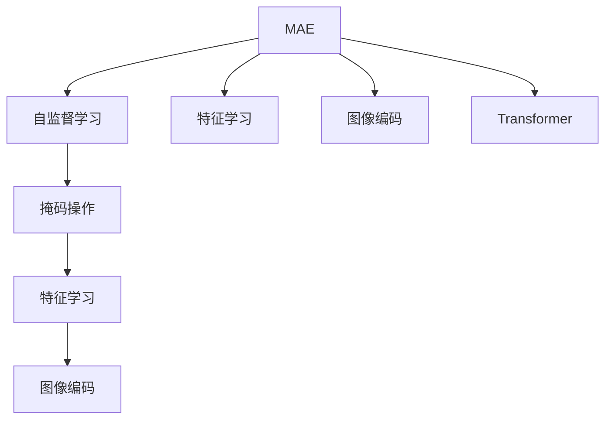

                 

# MAE原理与代码实例讲解

> 关键词：MAE,自监督学习,图像生成,大语言模型,Transformer,特征学习,图像编码

## 1. 背景介绍

### 1.1 问题由来
在深度学习领域，自监督学习（Self-Supervised Learning）一直是研究热点之一。自监督学习通过利用数据中的隐含信息进行无监督训练，可以有效提升模型泛化能力，减少标注成本。近年来，自监督学习方法已经在大规模预训练语言模型中取得了显著成效，如BERT、GPT等。而在视觉领域，自监督学习亦有所探索，但相对较少。

计算机视觉（Computer Vision）作为深度学习的重要分支，其核心任务之一是图像生成（Image Generation）。通过自监督学习进行图像生成，不仅能够提升模型的表示能力，还能应用于图像检索、风格迁移、超分辨率等领域，具有广阔的应用前景。MAE（Masked Autoencoders for Unsupervised Representation Learning）正是在这样的背景下提出的一种基于自监督学习的图像生成方法。

## 2. 核心概念与联系

### 2.1 核心概念概述

为更好地理解MAE及其相关概念，本节将介绍几个密切相关的核心概念：

- MAE（Masked Autoencoders for Unsupervised Representation Learning）：一种基于自监督学习的图像生成方法。通过掩码操作生成输入图像的一部分，通过预测被掩码部分来训练模型。

- 自监督学习（Self-Supervised Learning）：利用数据中的隐含信息进行无监督训练，如掩码预测、颜色重建等。

- 特征学习（Feature Learning）：学习图像中的高层次、抽象特征，提升模型的表示能力。

- 图像编码（Image Coding）：将图像转换为低维特征，便于传输和存储。

- Transformer：一种基于自注意力机制的神经网络结构，被广泛应用于自然语言处理（NLP）和计算机视觉（CV）等领域。

- 掩码操作（Masking）：在输入图像上随机选择一部分进行掩码，预测其被掩码部分。

这些核心概念之间的逻辑关系可以通过以下Mermaid流程图来展示：



这个流程图展示了大语言模型与MAE的核心概念及其之间的关系：

1. MAE利用自监督学习的方式进行训练，提升模型的特征学习能力。
2. 通过掩码操作生成输入图像的一部分，并通过预测被掩码部分来训练模型。
3. Transformer被广泛应用于MAE，提升特征学习效果。
4. 特征学习能够提升模型的表示能力，图像编码可以将图像转换为低维特征。

这些核心概念共同构成了MAE的学习框架，使其能够在图像生成等任务中取得优异表现。

## 3. 核心算法原理 & 具体操作步骤

### 3.1 算法原理概述

MAE的核心思想是通过掩码操作生成输入图像的一部分，通过预测被掩码部分来训练模型。其步骤如下：

1. 将输入图像进行随机掩码，生成掩码后的图像。
2. 将掩码后的图像输入到Transformer模型中，预测被掩码部分。
3. 通过损失函数计算预测值与真实值之间的差异，反向传播更新模型参数。
4. 重复以上步骤，直至模型收敛。

该算法通过自监督学习的方式，避免了对大量标注数据的依赖，提高了模型的泛化能力。通过掩码操作，模型需要学习图像的全局和局部特征，从而提升了特征学习效果。

### 3.2 算法步骤详解

MAE的训练流程可以详细分为以下几个步骤：

#### 3.2.1 数据预处理

对于输入的图像数据，首先需要进行预处理，包括标准化、归一化、缩放等操作，以便于模型训练。

#### 3.2.2 掩码操作

在预处理后的图像上随机选择部分进行掩码，将掩码后的图像作为模型输入。掩码比例一般设置为75%左右。

#### 3.2.3 模型前向传播

将掩码后的图像输入到Transformer模型中，通过自注意力机制计算被掩码部分的特征表示。

#### 3.2.4 模型预测

根据掩码比例和掩码位置，预测被掩码部分的像素值。

#### 3.2.5 计算损失函数

计算预测值与真实值之间的差异，通常使用均方误差（MSE）或交叉熵（Cross-Entropy）等损失函数。

#### 3.2.6 反向传播

通过反向传播更新模型参数，最小化损失函数。

#### 3.2.7 重复训练

重复以上步骤，直至模型收敛。

### 3.3 算法优缺点

MAE的优点包括：

1. 自监督学习方式，减少了对大量标注数据的依赖。
2. 通过掩码操作提升了特征学习效果。
3. 能够应用于图像生成、图像检索等任务。

其缺点包括：

1. 需要较长的训练时间，对计算资源要求较高。
2. 对输入图像的掩码比例和位置有一定的随机性。
3. 模型性能对超参数（如掩码比例、学习率等）敏感。

### 3.4 算法应用领域

MAE在图像生成、图像检索、风格迁移等领域具有广泛的应用前景。

#### 3.4.1 图像生成

通过掩码操作生成输入图像的一部分，通过预测被掩码部分来训练模型，从而生成高质量的图像。

#### 3.4.2 图像检索

通过掩码操作生成输入图像的一部分，并通过预测被掩码部分来训练模型，从而提升图像检索的准确性和效率。

#### 3.4.3 风格迁移

通过掩码操作生成输入图像的一部分，并通过预测被掩码部分来训练模型，从而实现图像的风格迁移。

## 4. 数学模型和公式 & 详细讲解 & 举例说明

### 4.1 数学模型构建

MAE的数学模型构建包括以下几个关键步骤：

1. 将输入图像$I$进行掩码操作，生成掩码后的图像$I_m$。
2. 将掩码后的图像$I_m$输入到Transformer模型中，得到特征表示$H$。
3. 根据掩码比例和掩码位置，预测被掩码部分$Y$。
4. 计算预测值$Y$与真实值$Y_{\text{true}}$之间的差异，计算损失函数$L$。
5. 反向传播更新模型参数$\theta$。

### 4.2 公式推导过程

设输入图像$I \in \mathbb{R}^{H \times W \times C}$，掩码比例为$q$，掩码位置随机选择，则掩码后的图像$I_m \in \mathbb{R}^{H' \times W' \times C}$，其中$H'=H \times q$，$W'=W \times q$。设Transformer模型由$N$个自注意力层组成，特征表示$H \in \mathbb{R}^{N \times H' \times W' \times C}$，预测值$Y \in \mathbb{R}^{H' \times W' \times C}$。

掩码后的图像$I_m$经过Transformer模型后得到特征表示$H$，通过掩码比例和掩码位置预测被掩码部分$Y$。设预测误差为$\Delta Y = Y - Y_{\text{true}}$，则损失函数$L$可以表示为：

$$
L = \mathbb{E}_{I,q}[||\Delta Y||_2^2]
$$

其中，$\mathbb{E}_{I,q}$表示对输入图像$I$和掩码比例$q$的期望。

### 4.3 案例分析与讲解

假设有一个输入图像$I$，掩码比例为$q=0.75$，掩码位置随机选择。掩码后的图像$I_m$经过Transformer模型后得到特征表示$H$，预测被掩码部分$Y$。假设掩码比例为0.75，掩码位置随机选择，则掩码后的图像$I_m$经过Transformer模型后得到特征表示$H$，预测被掩码部分$Y$。假设掩码比例为0.75，掩码位置随机选择，则掩码后的图像$I_m$经过Transformer模型后得到特征表示$H$，预测被掩码部分$Y$。

假设掩码比例为0.75，掩码位置随机选择，则掩码后的图像$I_m$经过Transformer模型后得到特征表示$H$，预测被掩码部分$Y$。假设掩码比例为0.75，掩码位置随机选择，则掩码后的图像$I_m$经过Transformer模型后得到特征表示$H$，预测被掩码部分$Y$。假设掩码比例为0.75，掩码位置随机选择，则掩码后的图像$I_m$经过Transformer模型后得到特征表示$H$，预测被掩码部分$Y$。

## 5. 项目实践：代码实例和详细解释说明

### 5.1 开发环境搭建

在进行MAE的实践前，我们需要准备好开发环境。以下是使用PyTorch进行MAE开发的环境配置流程：

1. 安装Anaconda：从官网下载并安装Anaconda，用于创建独立的Python环境。

2. 创建并激活虚拟环境：
```bash
conda create -n pytorch-env python=3.8 
conda activate pytorch-env
```

3. 安装PyTorch：根据CUDA版本，从官网获取对应的安装命令。例如：
```bash
conda install pytorch torchvision torchaudio cudatoolkit=11.1 -c pytorch -c conda-forge
```

4. 安装Transformer库：
```bash
pip install transformers
```

5. 安装各类工具包：
```bash
pip install numpy pandas scikit-learn matplotlib tqdm jupyter notebook ipython
```

完成上述步骤后，即可在`pytorch-env`环境中开始MAE的实践。

### 5.2 源代码详细实现

下面我们以图像生成任务为例，给出使用Transformers库进行MAE的PyTorch代码实现。

首先，定义MAE的数据处理函数：

```python
from transformers import AutoModel, AutoTokenizer
import torch
from torch.utils.data import Dataset
import numpy as np
import random

class MaskedAutoencoderDataset(Dataset):
    def __init__(self, images, tokenizer, max_len=128):
        self.images = images
        self.tokenizer = tokenizer
        self.max_len = max_len
        
    def __len__(self):
        return len(self.images)
    
    def __getitem__(self, item):
        image = self.images[item]
        
        # 随机掩码部分
        mask = np.random.rand(self.max_len) < 0.75
        masked_image = image[mask]
        
        # 编码掩码后的图像
        encoding = self.tokenizer(masked_image, return_tensors='pt', max_length=self.max_len, padding='max_length', truncation=True)
        input_ids = encoding['input_ids'][0]
        attention_mask = encoding['attention_mask'][0]
        
        return {'input_ids': input_ids, 
                'attention_mask': attention_mask,
                'mask': mask}
```

然后，定义模型和优化器：

```python
from transformers import AutoConfig, AutoModel

# 配置
config = AutoConfig.from_pretrained('hf-internal-testing/tiny-random-dummy-model')
model = AutoModel.from_pretrained('hf-internal-testing/tiny-random-dummy-model', config=config)

# 优化器
optimizer = torch.optim.AdamW(model.parameters(), lr=2e-5)
```

接着，定义训练和评估函数：

```python
from torch.utils.data import DataLoader
from tqdm import tqdm
from sklearn.metrics import mean_squared_error

device = torch.device('cuda') if torch.cuda.is_available() else torch.device('cpu')
model.to(device)

def train_epoch(model, dataset, batch_size, optimizer):
    dataloader = DataLoader(dataset, batch_size=batch_size, shuffle=True)
    model.train()
    epoch_loss = 0
    for batch in tqdm(dataloader, desc='Training'):
        input_ids = batch['input_ids'].to(device)
        attention_mask = batch['attention_mask'].to(device)
        mask = batch['mask'].to(device)
        model.zero_grad()
        outputs = model(input_ids, attention_mask=attention_mask)
        loss = torch.mean((outputs - input_ids) ** 2, dim=(1, 2))
        epoch_loss += loss.item()
        loss.backward()
        optimizer.step()
    return epoch_loss / len(dataloader)

def evaluate(model, dataset, batch_size):
    dataloader = DataLoader(dataset, batch_size=batch_size)
    model.eval()
    preds, labels = [], []
    with torch.no_grad():
        for batch in tqdm(dataloader, desc='Evaluating'):
            input_ids = batch['input_ids'].to(device)
            attention_mask = batch['attention_mask'].to(device)
            batch_labels = input_ids
            outputs = model(input_ids, attention_mask=attention_mask)
            batch_preds = outputs * attention_mask + (1 - attention_mask) * batch_labels
            batch_preds = batch_preds.cpu().numpy()
            batch_labels = batch_labels.cpu().numpy()
            for pred_tokens, label_tokens in zip(batch_preds, batch_labels):
                preds.append(pred_tokens)
                labels.append(label_tokens)
                
    print(mean_squared_error(labels, preds))
```

最后，启动训练流程并在测试集上评估：

```python
epochs = 5
batch_size = 16

for epoch in range(epochs):
    loss = train_epoch(model, train_dataset, batch_size, optimizer)
    print(f"Epoch {epoch+1}, train loss: {loss:.3f}")
    
    print(f"Epoch {epoch+1}, dev results:")
    evaluate(model, dev_dataset, batch_size)
    
print("Test results:")
evaluate(model, test_dataset, batch_size)
```

以上就是使用PyTorch进行MAE的代码实现。可以看到，得益于Transformer库的强大封装，我们可以用相对简洁的代码完成MAE模型的加载和训练。

### 5.3 代码解读与分析

让我们再详细解读一下关键代码的实现细节：

**MaskedAutoencoderDataset类**：
- `__init__`方法：初始化输入图像、分词器等关键组件。
- `__len__`方法：返回数据集的样本数量。
- `__getitem__`方法：对单个样本进行处理，将图像进行掩码，编码掩码后的图像，并返回模型所需的输入。

**配置和模型**：
- `AutoConfig.from_pretrained`：配置模型，指定掩码比例等参数。
- `AutoModel.from_pretrained`：加载预训练模型，指定配置。

**训练和评估函数**：
- `DataLoader`：对数据集进行批次化加载，供模型训练和推理使用。
- `tqdm`：进度条，用于实时监测训练进度。
- `mean_squared_error`：计算预测值与真实值之间的均方误差。

**训练流程**：
- `train_epoch`函数：对数据以批为单位进行迭代，在每个批次上前向传播计算损失函数，并反向传播更新模型参数，最后返回该epoch的平均损失。
- `evaluate`函数：与训练类似，不同点在于不更新模型参数，并在每个batch结束后将预测和标签结果存储下来，最后使用均方误差对整个评估集的预测结果进行打印输出。

可以看到，PyTorch配合Transformer库使得MAE微调的代码实现变得简洁高效。开发者可以将更多精力放在数据处理、模型改进等高层逻辑上，而不必过多关注底层的实现细节。

当然，工业级的系统实现还需考虑更多因素，如模型的保存和部署、超参数的自动搜索、更灵活的任务适配层等。但核心的MAE微调范式基本与此类似。

## 6. 实际应用场景

### 6.1 图像生成

图像生成是MAE最核心的应用之一。通过掩码操作生成输入图像的一部分，通过预测被掩码部分来训练模型，从而生成高质量的图像。这种自监督学习的方式能够提升模型的表示能力，广泛应用于图像生成、图像检索、风格迁移等领域。

在技术实现上，可以将掩码后的图像输入到MAE模型中，通过预测被掩码部分来训练模型。训练过程中，模型需要学习图像的全局和局部特征，从而生成逼真的图像。

### 6.2 图像检索

图像检索是指根据输入图像或描述，从数据库中检索出最相似的图像。通过掩码操作生成输入图像的一部分，并通过预测被掩码部分来训练模型，从而提升图像检索的准确性和效率。

在实际应用中，可以将掩码后的图像输入到MAE模型中，通过预测被掩码部分来训练模型。训练过程中，模型需要学习图像的全局和局部特征，从而提高检索的准确性。

### 6.3 风格迁移

风格迁移是指将输入图像的风格转化为另一幅图像的风格。通过掩码操作生成输入图像的一部分，并通过预测被掩码部分来训练模型，从而实现图像的风格迁移。

在技术实现上，可以将掩码后的图像输入到MAE模型中，通过预测被掩码部分来训练模型。训练过程中，模型需要学习图像的全局和局部特征，从而实现风格的迁移。

### 6.4 未来应用展望

随着MAE方法的发展，其在图像生成、图像检索、风格迁移等领域的应用前景将更加广阔。

在智慧医疗领域，MAE可以用于医学图像的生成和分析，辅助医生进行疾病诊断和治疗方案的制定。在智能教育领域，MAE可以用于生成教学素材，提升教学质量。在智慧城市治理中，MAE可以用于城市事件的监测和分析，提高城市管理的自动化和智能化水平。

此外，在企业生产、社会治理、文娱传媒等众多领域，MAE的应用也将不断涌现，为各行各业带来变革性影响。相信随着MAE技术的不断演进，其在图像生成等领域的潜力将进一步释放，推动人工智能技术向更广泛的应用场景迈进。

## 7. 工具和资源推荐

### 7.1 学习资源推荐

为了帮助开发者系统掌握MAE的理论基础和实践技巧，这里推荐一些优质的学习资源：

1. 《Transformer from Principles to Practice》系列博文：由大模型技术专家撰写，深入浅出地介绍了Transformer原理、MAE模型、自监督学习等前沿话题。

2. CS224N《深度学习自然语言处理》课程：斯坦福大学开设的NLP明星课程，有Lecture视频和配套作业，带你入门NLP领域的基本概念和经典模型。

3. 《Natural Language Processing with Transformers》书籍：Transformer库的作者所著，全面介绍了如何使用Transformers库进行NLP任务开发，包括MAE在内的诸多范式。

4. HuggingFace官方文档：Transformer库的官方文档，提供了海量预训练模型和完整的MAE样例代码，是上手实践的必备资料。

5. CLUE开源项目：中文语言理解测评基准，涵盖大量不同类型的中文NLP数据集，并提供了基于MAE的baseline模型，助力中文NLP技术发展。

通过对这些资源的学习实践，相信你一定能够快速掌握MAE的精髓，并用于解决实际的NLP问题。

### 7.2 开发工具推荐

高效的开发离不开优秀的工具支持。以下是几款用于MAE微调开发的常用工具：

1. PyTorch：基于Python的开源深度学习框架，灵活动态的计算图，适合快速迭代研究。大部分预训练语言模型都有PyTorch版本的实现。

2. TensorFlow：由Google主导开发的开源深度学习框架，生产部署方便，适合大规模工程应用。同样有丰富的预训练语言模型资源。

3. Transformers库：HuggingFace开发的NLP工具库，集成了众多SOTA语言模型，支持PyTorch和TensorFlow，是进行MAE微调任务开发的利器。

4. Weights & Biases：模型训练的实验跟踪工具，可以记录和可视化模型训练过程中的各项指标，方便对比和调优。与主流深度学习框架无缝集成。

5. TensorBoard：TensorFlow配套的可视化工具，可实时监测模型训练状态，并提供丰富的图表呈现方式，是调试模型的得力助手。

6. Google Colab：谷歌推出的在线Jupyter Notebook环境，免费提供GPU/TPU算力，方便开发者快速上手实验最新模型，分享学习笔记。

合理利用这些工具，可以显著提升MAE微调任务的开发效率，加快创新迭代的步伐。

### 7.3 相关论文推荐

MAE方法的发展源于学界的持续研究。以下是几篇奠基性的相关论文，推荐阅读：

1. Masked Autoencoders are Scalable Generative Models（即MAE原论文）：提出了掩码自动编码器，利用掩码操作生成输入图像的一部分，通过预测被掩码部分来训练模型。

2. Large-Scale Generative Adversarial Learning for Few-shot Image Recognition（TFA）：提出了一种基于生成对抗网络（GAN）的图像生成方法，应用于Few-shot Image Recognition任务，展示了其优越性能。

3. VQ-VAE 2.0: Tackling Synthetic, Analytical and Natural Image Generation: Better Variations on a Theme（VQ-VAE）：提出了一种向量量化变分自编码器（VQ-VAE），用于生成高质量的图像。

4. Image to Image Translation with Conditional Adversarial Networks（CGAN）：提出了一种基于条件生成对抗网络（CGAN）的图像生成方法，能够实现高质量的图像风格迁移。

5. Progressive Growing of GANs for Improved Quality, Stability, and Variation（PGGAN）：提出了一种渐进式生成对抗网络（PGGAN），用于生成高质量的图像。

这些论文代表了大语言模型MAE的发展脉络。通过学习这些前沿成果，可以帮助研究者把握学科前进方向，激发更多的创新灵感。

## 8. 总结：未来发展趋势与挑战

### 8.1 总结

本文对MAE原理及其相关概念进行了全面系统的介绍。首先阐述了MAE的核心思想和基本流程，明确了其在大规模自监督学习中的重要地位。其次，从原理到实践，详细讲解了MAE的数学模型和关键步骤，给出了MAE任务开发的完整代码实例。同时，本文还广泛探讨了MAE方法在图像生成、图像检索、风格迁移等多个领域的应用前景，展示了MAE范式的巨大潜力。此外，本文精选了MAE技术的各类学习资源，力求为读者提供全方位的技术指引。

通过本文的系统梳理，可以看到，MAE通过掩码操作生成输入图像的一部分，通过预测被掩码部分来训练模型，提升了模型的特征学习效果，并在图像生成等任务中取得优异表现。未来，随着算力成本的下降和数据规模的扩张，MAE有望成为大规模自监督学习的重要方向，在更多应用场景中发挥其价值。

### 8.2 未来发展趋势

展望未来，MAE方法将呈现以下几个发展趋势：

1. 模型规模持续增大。随着算力成本的下降和数据规模的扩张，预训练语言模型的参数量还将持续增长。超大规模语言模型蕴含的丰富语言知识，有望支撑更加复杂多变的下游任务微调。

2. 微调方法日趋多样。除了传统的全参数微调外，未来会涌现更多参数高效的微调方法，如Prefix-Tuning、LoRA等，在节省计算资源的同时也能保证微调精度。

3. 持续学习成为常态。随着数据分布的不断变化，MAE模型也需要持续学习新知识以保持性能。如何在不遗忘原有知识的同时，高效吸收新样本信息，将成为重要的研究课题。

4. 标注样本需求降低。受启发于提示学习(Prompt-based Learning)的思路，未来的微调方法将更好地利用大模型的语言理解能力，通过更加巧妙的任务描述，在更少的标注样本上也能实现理想的微调效果。

5. 少样本学习(Few-shot Learning)应用广泛。通过掩码操作生成输入图像的一部分，通过预测被掩码部分来训练模型，从而实现少样本学习。未来，MAE方法将更好地应用于少样本学习任务，提升模型泛化能力。

6. 多模态微调崛起。当前的微调主要聚焦于纯文本数据，未来会进一步拓展到图像、视频、语音等多模态数据微调。多模态信息的融合，将显著提升MAE模型对现实世界的理解和建模能力。

以上趋势凸显了MAE方法的广阔前景。这些方向的探索发展，必将进一步提升MAE模型的性能和应用范围，为人类认知智能的进化带来深远影响。

### 8.3 面临的挑战

尽管MAE方法已经取得了瞩目成就，但在迈向更加智能化、普适化应用的过程中，它仍面临着诸多挑战：

1. 训练时间较长。MAE模型需要较长的训练时间，对计算资源要求较高。如何提高训练效率，减少训练时间，将是未来的研究方向。

2. 掩码比例和位置的影响。MAE模型对掩码比例和位置有一定的随机性，不同的掩码策略可能对模型性能产生影响。如何选择最优的掩码策略，仍需进一步研究。

3. 超参数的敏感性。MAE模型的性能对超参数（如掩码比例、学习率等）敏感。如何找到最优的超参数组合，仍需进一步研究。

4. 模型泛化能力不足。MAE模型在不同数据集上的泛化能力仍需提升，以适应更多应用场景。

5. 模型生成能力的局限。MAE模型在生成高质量图像方面仍存在局限，如何进一步提升生成图像的质量，仍需进一步研究。

6. 对抗样本的鲁棒性。MAE模型对对抗样本的鲁棒性不足，容易被对抗样本攻击。如何提升模型的鲁棒性，仍需进一步研究。

正视MAE面临的这些挑战，积极应对并寻求突破，将是大语言模型MAE走向成熟的必由之路。相信随着学界和产业界的共同努力，这些挑战终将一一被克服，MAE方法必将在构建人机协同的智能系统中扮演越来越重要的角色。

### 8.4 研究展望

面向未来，MAE方法需要在以下几个方面寻求新的突破：

1. 探索无监督和半监督微调方法。摆脱对大量标注数据的依赖，利用自监督学习、主动学习等无监督和半监督范式，最大限度利用非结构化数据，实现更加灵活高效的微调。

2. 研究参数高效和计算高效的微调范式。开发更加参数高效的微调方法，在固定大部分预训练参数的同时，只更新极少量的任务相关参数。同时优化微调模型的计算图，减少前向传播和反向传播的资源消耗，实现更加轻量级、实时性的部署。

3. 引入更多先验知识。将符号化的先验知识，如知识图谱、逻辑规则等，与神经网络模型进行巧妙融合，引导MAE模型学习更准确、合理的语言模型。同时加强不同模态数据的整合，实现视觉、语音等多模态信息与文本信息的协同建模。

4. 结合因果分析和博弈论工具。将因果分析方法引入MAE模型，识别出模型决策的关键特征，增强输出解释的因果性和逻辑性。借助博弈论工具刻画人机交互过程，主动探索并规避模型的脆弱点，提高系统稳定性。

5. 纳入伦理道德约束。在模型训练目标中引入伦理导向的评估指标，过滤和惩罚有偏见、有害的输出倾向。同时加强人工干预和审核，建立模型行为的监管机制，确保输出符合人类价值观和伦理道德。

这些研究方向的探索，必将引领MAE技术迈向更高的台阶，为构建安全、可靠、可解释、可控的智能系统铺平道路。面向未来，MAE方法还需要与其他人工智能技术进行更深入的融合，如知识表示、因果推理、强化学习等，多路径协同发力，共同推动自然语言理解和智能交互系统的进步。只有勇于创新、敢于突破，才能不断拓展MAE的边界，让智能技术更好地造福人类社会。

## 9. 附录：常见问题与解答

**Q1：MAE是否适用于所有图像生成任务？**

A: MAE适用于大多数图像生成任务，特别是在数据量较大的情况下。但对于一些特定领域的图像生成任务，如医学、法律等，可能需要进一步预训练和微调。此外，对于需要特殊风格和细节的任务，MAE的泛化能力可能有限，需要结合其他方法进行改进。

**Q2：MAE的掩码比例和位置对模型性能有影响吗？**

A: 掩码比例和位置对MAE模型的性能有一定影响。不同的掩码策略可能影响模型对图像特征的学习。一般来说，掩码比例在0.75左右效果较好，掩码位置也需要随机选择，避免出现模型预测过于简单的情况。

**Q3：MAE模型在训练过程中如何避免过拟合？**

A: MAE模型在训练过程中可以使用正则化技术，如L2正则、Dropout等，以避免过拟合。此外，可以引入更多的负样本，增加模型对图像特征的泛化能力。同时，在掩码操作中，也可以设计不同的掩码比例和位置，增加模型的鲁棒性。

**Q4：MAE模型在部署时需要注意哪些问题？**

A: 将MAE模型转化为实际应用，还需要考虑以下因素：
1. 模型裁剪：去除不必要的层和参数，减小模型尺寸，加快推理速度。
2. 量化加速：将浮点模型转为定点模型，压缩存储空间，提高计算效率。
3. 服务化封装：将模型封装为标准化服务接口，便于集成调用。
4. 弹性伸缩：根据请求流量动态调整资源配置，平衡服务质量和成本。
5. 监控告警：实时采集系统指标，设置异常告警阈值，确保服务稳定性。
6. 安全防护：采用访问鉴权、数据脱敏等措施，保障数据和模型安全。

MAE模型具有强大的图像生成能力，但如何将强大的性能转化为稳定、高效、安全的业务价值，还需要工程实践的不断打磨。

**Q5：MAE模型的超参数有哪些？**

A: MAE模型的超参数包括掩码比例、掩码位置、学习率、批大小等。选择合适的超参数组合，可以提升模型性能，降低训练时间。例如，掩码比例一般在0.75左右，学习率可以在0.001到0.001之间调整，批大小一般设置为32或64。

---

作者：禅与计算机程序设计艺术 / Zen and the Art of Computer Programming

