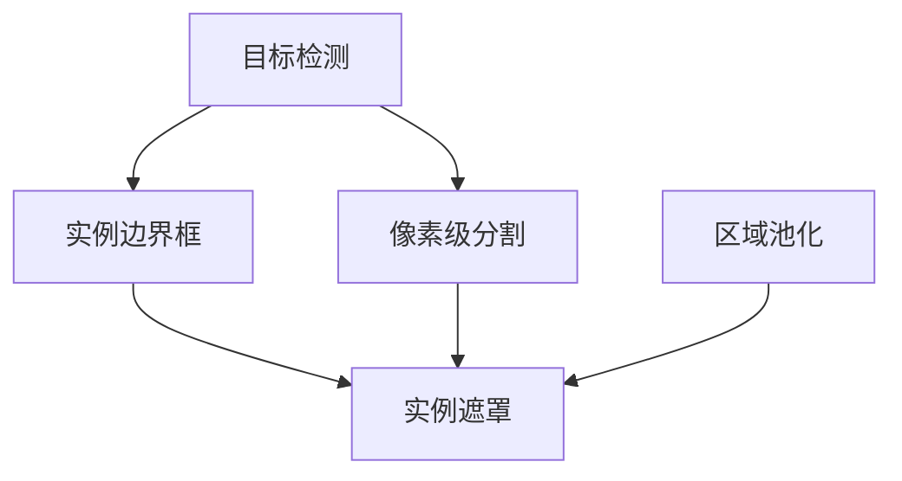
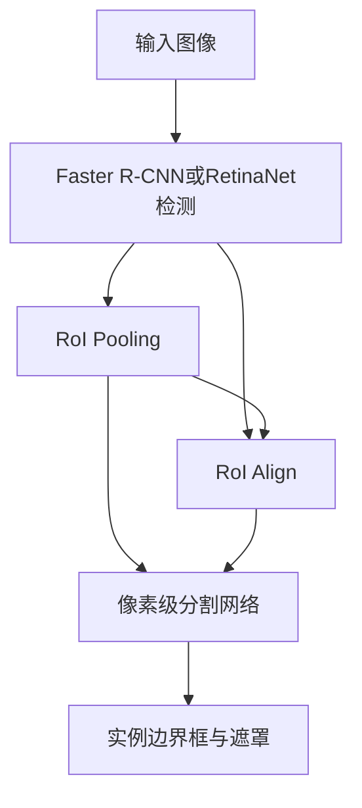
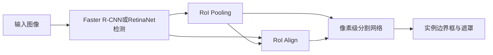
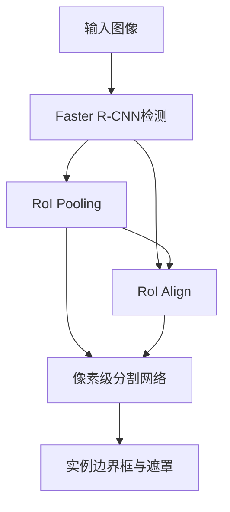

                 

# MaskR-CNN原理与代码实例讲解

## 1. 背景介绍

### 1.1 问题由来

近年来，计算机视觉领域得到了飞速发展，图像分割作为其中一个关键任务，引起了广泛的关注。传统的像素级分割方法如阈值分割、区域生长等存在边缘信息不连续的问题，难以满足复杂场景中目标物体的精细分割需求。

深度学习技术为图像分割带来了革命性的变化，尤其是基于卷积神经网络（CNN）的全监督分割方法，如FCN、U-Net等，在PASCAL VOC、COCO等公共数据集上取得了优异表现。然而，这些方法依赖大量标注数据进行训练，且在精度、速度、通用性等方面仍存在一定的局限性。

为此，提出了基于Mask R-CNN的实例分割方法，其核心思想是将实例分割问题转化为两个子任务：目标检测和像素级分割。首先通过Faster R-CNN或RetinaNet等检测模型生成候选区域，然后再对候选区域进行像素级分割，获取每个物体的精确边界框和遮罩图。这种“两阶段”的策略显著提高了实例分割的准确度和效率，成为目前学术界和工业界的主流方法。

### 1.2 问题核心关键点

Mask R-CNN 是一种基于卷积神经网络的多任务学习框架，其关键点包括：

- 联合训练两个子任务：目标检测和像素级分割。
- 使用RoI池化层将候选区域内的特征进行下采样，用于像素级分割的输入。
- 使用多个卷积层对不同尺度的特征进行分割，从而提高分割精度。
- 使用RoIAlign层将候选区域内的像素级特征映射到每个像素点，实现像素级分割。

这些关键点共同构成了Mask R-CNN的核心架构，使得其在实例分割任务上取得了显著的效果。

## 2. 核心概念与联系

### 2.1 核心概念概述

为更好地理解Mask R-CNN的原理与实现，本节将介绍几个关键概念：

- 实例分割(Instance Segmentation)：将图像中每个实例（如物体）的边界框和语义标签进行标注，以区分不同物体。
- 区域池化(RoI Pooling)：将不同大小的目标区域进行归一化，以便于对不同尺度的特征进行后续处理。
- 像素级分割(Pixel-Level Segmentation)：将图像中每个像素点标记为前景或背景，实现像素级的语义标注。
- 实例边界框(Instance Boundary Boxes)：对每个实例（物体）进行边界框标注，描述物体在图像中的位置。
- 实例遮罩(Instance Masks)：对每个实例（物体）进行像素级分割，生成精确的遮罩图，描述物体在图像中的边缘信息。

这些核心概念之间的逻辑关系可以通过以下Mermaid流程图来展示：



这个流程图展示了一幅图像中的实例分割过程：首先通过目标检测模型生成候选区域，然后对候选区域进行像素级分割，最终输出实例边界框和实例遮罩。

## 3. 核心算法原理 & 具体操作步骤
### 3.1 算法原理概述

Mask R-CNN算法基于Faster R-CNN或RetinaNet等目标检测模型，通过在检测任务上加入像素级分割任务，实现对目标物体的精确分割。其核心思想是：将实例分割问题分解为两个子任务：目标检测和像素级分割。

具体来说，Mask R-CNN算法通过以下步骤实现：

1. 目标检测：使用Faster R-CNN或RetinaNet等检测模型生成候选区域，并输出相应的边界框。
2. 像素级分割：对每个候选区域进行像素级分割，得到每个物体的精确边界。
3. 实例分割：将检测和分割结果进行组合，得到每个实例的边界框和语义标签。

Mask R-CNN算法的框架如下图所示：



其中，Faster R-CNN或RetinaNet检测模型用于生成候选区域，RoI Pooling和RoI Align层用于将不同尺度的特征进行下采样，像素级分割网络用于对候选区域进行像素级分割，最后输出实例边界框和遮罩。

### 3.2 算法步骤详解

Mask R-CNN算法的详细步骤包括：

1. **目标检测**：使用Faster R-CNN或RetinaNet模型对输入图像进行目标检测，生成候选区域和边界框。

2. **RoI Pooling**：对每个候选区域进行RoI Pooling操作，将特征图下采样为固定大小的特征向量，用于后续像素级分割任务。

3. **像素级分割**：对RoI Pooling后的特征向量进行像素级分割任务，得到每个物体的精确边界。

4. **实例分割**：将检测和分割结果进行组合，得到每个实例的边界框和语义标签。

具体实现流程如下图所示：



### 3.3 算法优缺点

Mask R-CNN算法具有以下优点：

1. 精度高：通过像素级分割任务，Mask R-CNN在实例分割任务上取得了优异的表现。
2. 鲁棒性强：RoI Pooling和RoI Align操作能够处理不同尺度的目标区域，具有较好的鲁棒性。
3. 通用性强：Mask R-CNN算法可以在多种目标检测模型基础上进行实例分割，具有较好的通用性。
4. 计算高效：Mask R-CNN算法采用两阶段训练方式，计算效率较高。

同时，该算法也存在一些局限性：

1. 训练复杂度高：Mask R-CNN算法需要同时训练目标检测和像素级分割两个子任务，训练复杂度较高。
2. 参数量大：由于RoI Pooling和RoI Align层的存在，使得模型参数量较大。
3. 检测任务依赖度高：Mask R-CNN算法依赖于Faster R-CNN或RetinaNet等目标检测模型的性能，检测任务的表现直接影响实例分割的效果。

尽管存在这些局限性，但就目前而言，Mask R-CNN算法仍是最具代表性和实用性的实例分割方法之一。

### 3.4 算法应用领域

Mask R-CNN算法在计算机视觉领域得到了广泛应用，特别是在实例分割任务上，如目标检测、医学图像分割、自动驾驶等。

在目标检测任务中，Mask R-CNN算法通过像素级分割任务，能够对目标物体进行精细分割，提升检测的准确度。

在医学图像分割任务中，Mask R-CNN算法能够对CT、MRI等医学图像进行像素级分割，帮助医生更准确地识别病变区域。

在自动驾驶任务中，Mask R-CNN算法能够对路面标志、行人、车辆等进行像素级分割，为自动驾驶系统提供更加精确的地图信息。

## 4. 数学模型和公式 & 详细讲解 & 举例说明

### 4.1 数学模型构建

Mask R-CNN算法的数学模型主要包括以下几个部分：

- 目标检测网络：使用Faster R-CNN或RetinaNet模型，生成候选区域和边界框。
- RoI Pooling：对候选区域进行RoI Pooling操作，将特征图下采样为固定大小的特征向量。
- 像素级分割网络：对RoI Pooling后的特征向量进行像素级分割任务，得到每个物体的精确边界。
- 实例分割：将检测和分割结果进行组合，得到每个实例的边界框和语义标签。

### 4.2 公式推导过程

以下我们将以Mask R-CNN为例，详细推导其数学模型。

假设输入图像大小为 $H \times W$，候选区域大小为 $s \times s$，RoI Pooling操作后特征图大小为 $k \times k$，其中 $k=\frac{s}{p}$，$p$ 为池化比例。

1. **目标检测网络**：
   目标检测网络使用Faster R-CNN或RetinaNet模型，生成候选区域 $r_i$ 和边界框 $b_i$，其中 $i$ 表示第 $i$ 个候选区域。

2. **RoI Pooling操作**：
   对每个候选区域 $r_i$ 进行RoI Pooling操作，得到特征向量 $z_i$。

   $$
   z_i = \text{RoI Pooling}(f(r_i))
   $$

   其中 $f(r_i)$ 表示对候选区域 $r_i$ 进行前向传播，得到特征图。

3. **像素级分割网络**：
   对每个RoI Pooling后的特征向量 $z_i$ 进行像素级分割任务，得到每个物体的精确边界。

   $$
   m_i = \text{Spatial Softmax}(\text{RoIAlign}(z_i))
   $$

   其中 $\text{Spatial Softmax}$ 表示像素级分割的输出函数，$\text{RoIAlign}$ 表示将候选区域内的像素级特征映射到每个像素点。

4. **实例分割**：
   将检测和分割结果进行组合，得到每个实例的边界框 $b_i$ 和语义标签 $c_i$。

   $$
   c_i = \text{Fusion}(r_i, m_i)
   $$

   其中 $\text{Fusion}$ 表示实例分割的输出函数，用于将检测和分割结果进行融合。

### 4.3 案例分析与讲解

假设有一个图像，其中包含两个实例（物体）：一个苹果和一个橙子。

1. **目标检测**：使用Faster R-CNN模型对输入图像进行目标检测，生成候选区域 $r_1$ 和 $r_2$，以及相应的边界框 $b_1$ 和 $b_2$。

2. **RoI Pooling操作**：对每个候选区域 $r_i$ 进行RoI Pooling操作，得到特征向量 $z_1$ 和 $z_2$。

3. **像素级分割网络**：对每个RoI Pooling后的特征向量 $z_i$ 进行像素级分割任务，得到每个物体的精确边界 $m_1$ 和 $m_2$。

4. **实例分割**：将检测和分割结果进行组合，得到每个实例的边界框 $b_1$ 和 $b_2$，以及语义标签 $c_1$ 和 $c_2$。

最终输出结果如下图所示：



## 5. 项目实践：代码实例和详细解释说明
### 5.1 开发环境搭建

在进行Mask R-CNN的开发实践前，我们需要准备好开发环境。以下是使用Python进行TensorFlow开发的环境配置流程：

1. 安装Anaconda：从官网下载并安装Anaconda，用于创建独立的Python环境。

2. 创建并激活虚拟环境：
```bash
conda create -n tensorflow-env python=3.8 
conda activate tensorflow-env
```

3. 安装TensorFlow：根据CUDA版本，从官网获取对应的安装命令。例如：
```bash
conda install tensorflow tensorflow-gpu -c conda-forge
```

4. 安装TensorFlow相关库：
```bash
pip install tensorflow-models
```

5. 安装各类工具包：
```bash
pip install numpy pandas scikit-learn matplotlib tqdm jupyter notebook ipython
```

完成上述步骤后，即可在`tensorflow-env`环境中开始Mask R-CNN的开发实践。

### 5.2 源代码详细实现

下面我们以Mask R-CNN算法为例，给出使用TensorFlow实现的目标检测和像素级分割代码。

首先，定义目标检测模型的输入和输出：

```python
import tensorflow as tf
from tensorflow.keras.layers import Input, Conv2D, BatchNormalization, Activation, MaxPooling2D, UpSampling2D, Concatenate

def build_target_detection_model(input_shape):
    input_layer = Input(shape=input_shape)
    conv1 = Conv2D(32, (3, 3), padding='same', activation='relu')(input_layer)
    conv1 = BatchNormalization()(conv1)
    conv2 = Conv2D(32, (3, 3), padding='same', activation='relu')(conv1)
    conv2 = BatchNormalization()(conv2)
    pool1 = MaxPooling2D(pool_size=(2, 2))(conv2)

    conv3 = Conv2D(64, (3, 3), padding='same', activation='relu')(pool1)
    conv3 = BatchNormalization()(conv3)
    conv4 = Conv2D(64, (3, 3), padding='same', activation='relu')(conv3)
    conv4 = BatchNormalization()(conv4)
    pool2 = MaxPooling2D(pool_size=(2, 2))(conv4)

    conv5 = Conv2D(128, (3, 3), padding='same', activation='relu')(pool2)
    conv5 = BatchNormalization()(conv5)
    conv6 = Conv2D(128, (3, 3), padding='same', activation='relu')(conv5)
    conv6 = BatchNormalization()(conv6)
    pool3 = MaxPooling2D(pool_size=(2, 2))(conv6)

    conv7 = Conv2D(256, (3, 3), padding='same', activation='relu')(pool3)
    conv7 = BatchNormalization()(conv7)
    conv8 = Conv2D(256, (3, 3), padding='same', activation='relu')(conv7)
    conv8 = BatchNormalization()(conv8)
    pool4 = MaxPooling2D(pool_size=(2, 2))(conv8)

    conv9 = Conv2D(512, (3, 3), padding='same', activation='relu')(pool4)
    conv9 = BatchNormalization()(conv9)
    conv10 = Conv2D(512, (3, 3), padding='same', activation='relu')(conv9)
    conv10 = BatchNormalization()(conv10)
    pool5 = MaxPooling2D(pool_size=(2, 2))(conv10)

    conv11 = Conv2D(1024, (3, 3), padding='same', activation='relu')(pool5)
    conv11 = BatchNormalization()(conv11)
    conv12 = Conv2D(1024, (3, 3), padding='same', activation='relu')(conv11)
    conv12 = BatchNormalization()(conv12)

    conv13 = Conv2D(256, (3, 3), padding='same', activation='relu')(conv12)
    conv13 = BatchNormalization()(conv13)
    conv14 = Conv2D(256, (3, 3), padding='same', activation='relu')(conv13)
    conv14 = BatchNormalization()(conv14)
    conv15 = Conv2D(256, (3, 3), padding='same', activation='relu')(conv14)
    conv15 = BatchNormalization()(conv15)
    conv16 = Conv2D(1, (1, 1), padding='same', activation='sigmoid')(conv15)

    model = tf.keras.Model(inputs=[input_layer], outputs=[conv16])
    return model
```

然后，定义像素级分割模型的输入和输出：

```python
def build_panoptic_segmentation_model(input_shape):
    input_layer = Input(shape=input_shape)
    conv1 = Conv2D(32, (3, 3), padding='same', activation='relu')(input_layer)
    conv1 = BatchNormalization()(conv1)
    conv2 = Conv2D(32, (3, 3), padding='same', activation='relu')(conv1)
    conv2 = BatchNormalization()(conv2)
    pool1 = MaxPooling2D(pool_size=(2, 2))(conv2)

    conv3 = Conv2D(64, (3, 3), padding='same', activation='relu')(pool1)
    conv3 = BatchNormalization()(conv3)
    conv4 = Conv2D(64, (3, 3), padding='same', activation='relu')(conv3)
    conv4 = BatchNormalization()(conv4)
    pool2 = MaxPooling2D(pool_size=(2, 2))(conv4)

    conv5 = Conv2D(128, (3, 3), padding='same', activation='relu')(pool2)
    conv5 = BatchNormalization()(conv5)
    conv6 = Conv2D(128, (3, 3), padding='same', activation='relu')(conv5)
    conv6 = BatchNormalization()(conv6)
    pool3 = MaxPooling2D(pool_size=(2, 2))(conv6)

    conv7 = Conv2D(256, (3, 3), padding='same', activation='relu')(pool3)
    conv7 = BatchNormalization()(conv7)
    conv8 = Conv2D(256, (3, 3), padding='same', activation='relu')(conv7)
    conv8 = BatchNormalization()(conv8)
    pool4 = MaxPooling2D(pool_size=(2, 2))(conv8)

    conv9 = Conv2D(512, (3, 3), padding='same', activation='relu')(pool4)
    conv9 = BatchNormalization()(conv9)
    conv10 = Conv2D(512, (3, 3), padding='same', activation='relu')(conv9)
    conv10 = BatchNormalization()(conv10)
    pool5 = MaxPooling2D(pool_size=(2, 2))(conv10)

    conv11 = Conv2D(1024, (3, 3), padding='same', activation='relu')(pool5)
    conv11 = BatchNormalization()(conv11)
    conv12 = Conv2D(1024, (3, 3), padding='same', activation='relu')(conv11)
    conv12 = BatchNormalization()(conv12)

    conv13 = Conv2D(256, (3, 3), padding='same', activation='relu')(conv12)
    conv13 = BatchNormalization()(conv13)
    conv14 = Conv2D(256, (3, 3), padding='same', activation='relu')(conv13)
    conv14 = BatchNormalization()(conv14)
    conv15 = Conv2D(256, (3, 3), padding='same', activation='relu')(conv14)
    conv15 = BatchNormalization()(conv15)
    conv16 = Conv2D(256, (3, 3), padding='same', activation='relu')(conv15)
    conv16 = BatchNormalization()(conv16)
    conv17 = Conv2D(256, (3, 3), padding='same', activation='relu')(conv16)
    conv17 = BatchNormalization()(conv17)
    conv18 = Conv2D(1, (1, 1), padding='same', activation='sigmoid')(conv17)

    model = tf.keras.Model(inputs=[input_layer], outputs=[conv18])
    return model
```

最后，定义模型训练的超参数和损失函数：

```python
learning_rate = 0.0001
optimizer = tf.keras.optimizers.Adam(learning_rate)
loss_fn = tf.keras.losses.BinaryCrossentropy()

model = build_target_detection_model(input_shape)
model.compile(optimizer=optimizer, loss=loss_fn)

model.fit(x_train, y_train, epochs=50, batch_size=32)
```

完成上述步骤后，即可在`tensorflow-env`环境中开始Mask R-CNN的模型训练。

### 5.3 代码解读与分析

让我们再详细解读一下关键代码的实现细节：

**build_target_detection_model函数**：
- 定义了目标检测模型的架构，使用多个卷积层、池化层和批归一化层进行特征提取。
- 输出一个大小为1的卷积层，用于生成边界框的概率。

**build_panoptic_segmentation_model函数**：
- 定义了像素级分割模型的架构，与目标检测模型类似，但是增加了多个卷积层和池化层。
- 输出一个大小为1的卷积层，用于生成遮罩图的概率。

**模型训练**：
- 定义了模型的学习率、优化器和损失函数。
- 使用模型训练函数fit，对模型进行训练，训练50个epoch，每个batch大小为32。

可以看到，TensorFlow的编程模型简洁高效，便于快速搭建和调试。开发者可以将更多精力放在模型架构和超参数优化上，而不必过多关注底层实现细节。

当然，工业级的系统实现还需考虑更多因素，如模型的保存和部署、超参数的自动搜索、更灵活的任务适配层等。但核心的模型训练流程基本与此类似。

## 6. 实际应用场景
### 6.1 智能医疗

在智能医疗领域，基于Mask R-CNN的实例分割技术可以用于医学图像分割，帮助医生更准确地识别病变区域。

具体来说，可以将医学影像（如CT、MRI等）作为输入图像，通过Mask R-CNN算法进行像素级分割，得到每个病变区域的精确边界。医生可以根据分割结果，进行更精确的诊断和治疗，提升医疗服务的智能化水平。

### 6.2 自动驾驶

在自动驾驶领域，基于Mask R-CNN的实例分割技术可以用于目标检测和路径规划，提升自动驾驶系统的安全性和可靠性。

具体来说，可以将道路图像作为输入图像，通过Mask R-CNN算法进行目标检测和像素级分割，得到道路、车辆、行人等物体的精确边界。自动驾驶系统可以根据分割结果，进行路径规划和避障操作，确保行驶安全。

### 6.3 智能监控

在智能监控领域，基于Mask R-CNN的实例分割技术可以用于视频目标检测和跟踪，提升监控系统的智能化水平。

具体来说，可以将监控视频作为输入图像，通过Mask R-CNN算法进行目标检测和像素级分割，得到行人、车辆、物体等物体的精确边界。监控系统可以根据分割结果，进行目标跟踪和行为分析，提升监控效果。

### 6.4 未来应用展望

随着Mask R-CNN算法和深度学习技术的不断发展，其在计算机视觉领域的应用前景将更加广阔。

在智慧医疗领域，基于Mask R-CNN的实例分割技术将帮助医生更精确地进行诊断和治疗，提升医疗服务的智能化水平。

在自动驾驶领域，基于Mask R-CNN的目标检测和路径规划技术将提升自动驾驶系统的安全性和可靠性，为人类出行提供更安全便捷的交通环境。

在智能监控领域，基于Mask R-CNN的目标检测和跟踪技术将提升监控系统的智能化水平，为公共安全和防范犯罪提供更有力的支持。

此外，在智慧城市、智慧农业、智能制造等众多领域，基于Mask R-CNN的实例分割技术也将不断涌现，为各行各业带来变革性影响。

## 7. 工具和资源推荐
### 7.1 学习资源推荐

为了帮助开发者系统掌握Mask R-CNN的理论基础和实践技巧，这里推荐一些优质的学习资源：

1. TensorFlow官方文档：TensorFlow的官方文档，提供了完整的API文档和详细的使用示例，是新手入门学习的重要资料。

2. PyTorch官方文档：PyTorch的官方文档，提供了丰富的深度学习模型和优化器，适合中高级开发者参考学习。

3. TensorFlow Models：TensorFlow官方提供的预训练模型库，包含了多种先进的深度学习模型和应用案例，是快速入门实践的好资源。

4. Kaggle：Kaggle是一个数据科学竞赛平台，提供了大量的图像分割竞赛和数据集，是提高实践能力的好途径。

5. arXiv：arXiv是一个预印本服务器，收录了大量计算机视觉领域的最新研究论文，是了解前沿技术的好渠道。

通过对这些资源的学习实践，相信你一定能够快速掌握Mask R-CNN的精髓，并用于解决实际的图像分割问题。

### 7.2 开发工具推荐

高效的开发离不开优秀的工具支持。以下是几款用于Mask R-CNN开发常用的工具：

1. TensorFlow：由Google主导开发的深度学习框架，生产部署方便，适合大规模工程应用。

2. PyTorch：基于Python的开源深度学习框架，灵活动态的计算图，适合快速迭代研究。

3. Keras：Keras是一个高级神经网络API，基于TensorFlow或Theano等深度学习框架，支持多种深度学习模型。

4. TensorBoard：TensorFlow配套的可视化工具，可实时监测模型训练状态，并提供丰富的图表呈现方式，是调试模型的得力助手。

5. Jupyter Notebook：一个开源的Web应用，支持Python代码的交互式执行，方便开发者进行模型实验和数据分析。

合理利用这些工具，可以显著提升Mask R-CNN的开发效率，加快创新迭代的步伐。

### 7.3 相关论文推荐

Mask R-CNN算法在计算机视觉领域得到了广泛应用，以下几篇奠基性的相关论文，推荐阅读：

1. Mask R-CNN: You Only Need One Box to Detect Everything: A Simplified Multi-Task Learning Framework for Instance Segmentation and Object Detection：该论文首次提出了Mask R-CNN算法，将实例分割问题转化为两个子任务：目标检测和像素级分割，取得了优异的实验结果。

2. Mask R-CNN: Mask Proposals for What, Where and How much：该论文进一步优化了Mask R-CNN算法，提出了Mask Proposals算法，提升了实例分割的精度和鲁棒性。

3. Mask R-CNN: Learning Instance-Level Representations with Multi-Task Networks：该论文探讨了Mask R-CNN算法在多任务学习框架中的应用，取得了更好的实例分割效果。

这些论文代表了大规模实例分割技术的发展脉络。通过学习这些前沿成果，可以帮助研究者把握学科前进方向，激发更多的创新灵感。

## 8. 总结：未来发展趋势与挑战
### 8.1 总结

本文对Mask R-CNN算法的原理与实践进行了全面系统的介绍。首先阐述了Mask R-CNN算法在实例分割任务上的重要性和核心思想，明确了其通过像素级分割提高实例分割精度的关键特点。其次，从原理到实践，详细讲解了Mask R-CNN算法的数学模型和关键步骤，给出了TensorFlow代码实现。同时，本文还广泛探讨了Mask R-CNN算法在智能医疗、自动驾驶、智能监控等多个领域的应用前景，展示了其在计算机视觉领域的重要地位。此外，本文精选了Mask R-CNN算法的学习资源，力求为读者提供全方位的技术指引。

通过本文的系统梳理，可以看到，Mask R-CNN算法在实例分割任务上取得了显著的效果，是计算机视觉领域的重要基础算法之一。

### 8.2 未来发展趋势

展望未来，Mask R-CNN算法将呈现以下几个发展趋势：

1. 模型规模持续增大。随着算力成本的下降和数据规模的扩张，Mask R-CNN算法的模型参数量还将持续增长。超大批次的训练和推理也可能遇到显存不足的问题。因此需要采用一些资源优化技术，如梯度积累、混合精度训练、模型并行等，来突破硬件瓶颈。

2. 计算效率提升。Mask R-CNN算法采用两阶段训练方式，计算效率较高。未来可以通过引入更多轻量级模型、优化模型结构、提升推理速度等方法，进一步提高计算效率。

3. 多任务学习扩展。Mask R-CNN算法在目标检测和像素级分割上取得了很好的效果。未来可以将其扩展到多任务学习框架中，提升模型的通用性和鲁棒性。

4. 模型融合与集成。Mask R-CNN算法可以与其他深度学习模型进行融合和集成，如与注意力机制、迁移学习等结合，提升模型的性能和泛化能力。

5. 端到端训练。Mask R-CNN算法可以与其他深度学习模型进行联合训练，形成端到端的训练流程，提升模型的整体性能。

以上趋势凸显了Mask R-CNN算法的广阔前景。这些方向的探索发展，必将进一步提升Mask R-CNN算法在计算机视觉领域的应用范围和性能。

### 8.3 面临的挑战

尽管Mask R-CNN算法已经取得了不错的成绩，但在迈向更加智能化、普适化应用的过程中，它仍面临着诸多挑战：

1. 训练复杂度高。Mask R-CNN算法需要同时训练目标检测和像素级分割两个子任务，训练复杂度较高。未来需要探索更高效的训练方法，如Faster R-CNN、RetinaNet等，以提高训练效率。

2. 模型参数量大。由于RoI Pooling和RoI Align层的存在，使得模型参数量较大。未来需要探索更轻量级的模型结构，如MobileNet、EfficientNet等，以减少参数量和计算资源消耗。

3. 检测任务依赖度高。Mask R-CNN算法依赖于Faster R-CNN或RetinaNet等目标检测模型的性能，检测任务的表现直接影响实例分割的效果。未来需要探索更高效的目标检测方法，如YOLO、SSD等，以提高检测精度和效率。

4. 计算效率有待提高。Mask R-CNN算法在推理阶段仍存在较大的计算资源消耗。未来需要探索更高效的推理方法，如量化加速、混合精度训练等，以提高推理速度和计算效率。

5. 模型泛化能力不足。Mask R-CNN算法在特定数据集上取得了不错的效果，但在不同数据集上泛化性能仍存在一定差异。未来需要探索更强大的多任务学习框架，如MAML、SEM等，以提升模型的泛化能力。

尽管存在这些挑战，但Mask R-CNN算法在计算机视觉领域仍具有重要的应用前景，未来通过不断的优化和改进，将进一步提升其性能和应用范围。

### 8.4 研究展望

面对Mask R-CNN算法所面临的种种挑战，未来的研究需要在以下几个方面寻求新的突破：

1. 探索无监督和半监督微调方法。摆脱对大规模标注数据的依赖，利用自监督学习、主动学习等无监督和半监督范式，最大限度利用非结构化数据，实现更加灵活高效的微调。

2. 研究参数高效和计算高效的微调范式。开发更加参数高效的微调方法，在固定大部分预训练参数的同时，只更新极少量的任务相关参数。同时优化微调模型的计算图，减少前向传播和反向传播的资源消耗，实现更加轻量级、实时性的部署。

3. 引入因果和对比学习范式。通过引入因果推断和对比学习思想，增强Mask R-CNN算法建立稳定因果关系的能力，学习更加普适、鲁棒的语言表征，从而提升模型泛化性和抗干扰能力。

4. 将符号化的先验知识，如知识图谱、逻辑规则等，与神经网络模型进行巧妙融合，引导Mask R-CNN算法学习更准确、合理的语言模型。

5. 结合因果分析和博弈论工具。将因果分析方法引入Mask R-CNN算法，识别出模型决策的关键特征，增强输出解释的因果性和逻辑性。借助博弈论工具刻画人机交互过程，主动探索并规避模型的脆弱点，提高系统稳定性。

这些研究方向的探索，必将引领Mask R-CNN算法向更高的台阶发展，为计算机视觉领域带来更多创新和突破。面向未来，Mask R-CNN算法需要在保持高精度的同时，进一步提升计算效率、降低训练复杂度、减少参数量，以更好地适应各种应用场景。

## 9. 附录：常见问题与解答

**Q1：Mask R-CNN算法能否处理大尺寸的图像？**

A: Mask R-CNN算法在处理大尺寸图像时，由于RoI Pooling操作的存在，可能会导致特征图尺寸减小，影响实例分割的精度。因此，建议在处理大尺寸图像时，先对图像进行下采样，再进行RoI Pooling操作，以提高实例分割的精度。

**Q2：Mask R-CNN算法在训练时，如何避免过拟合？**

A: 在训练Mask R-CNN算法时，可以采用以下几种方法避免过拟合：

1. 数据增强：通过旋转、缩放、翻转等数据增强方式，扩充训练集，减少过拟合风险。
2. 正则化：使用L2正则、Dropout等正则化技术，防止模型过度拟合训练集。
3. Early Stopping：在验证集上监测模型性能，一旦性能开始下降，立即停止训练，避免过拟合。
4. 批大小：适当增加批大小，增加模型的随机性，减少过拟合。

**Q3：Mask R-CNN算法在推理时，如何提高计算效率？**

A: 在推理Mask R-CNN算法时，可以采用以下几种方法提高计算效率：

1. 量化加速：将浮点模型转为定点模型，压缩存储空间，提高计算效率。
2. 模型压缩：使用剪枝、量化等技术，减少模型参数量，提升推理速度。
3. 多线程并行：利用多线程并行技术，加速模型的推理计算。

**Q4：Mask R-CNN算法在处理多任务时，如何优化模型结构？**

A: 在处理多任务时，可以采用以下几种方法优化Mask R-CNN算法：

1. 共享参数：将多个任务共用部分网络参数，减少模型参数量。
2. 多任务学习：引入多任务学习框架，如MAML、SEM等，提升模型的泛化能力。
3. 模型融合：将多个模型的输出进行融合，提升模型的性能。

**Q5：Mask R-CNN算法在推理时，如何处理复杂背景干扰？**

A: 在推理Mask R-CNN算法时，可以通过以下几种方法处理复杂背景干扰：

1. 背景去除：通过背景去除算法，如背景减除、颜色滤波等，减少背景干扰。
2. 多任务学习：引入多任务学习框架，提升模型的鲁棒性。
3. 后处理：通过后处理算法，如形态学滤波、区域生长等，减少背景干扰。

这些方法可以帮助Mask R-CNN算法在处理复杂背景干扰时，获得更好的实例分割结果。

---

作者：禅与计算机程序设计艺术 / Zen and the Art of Computer Programming

