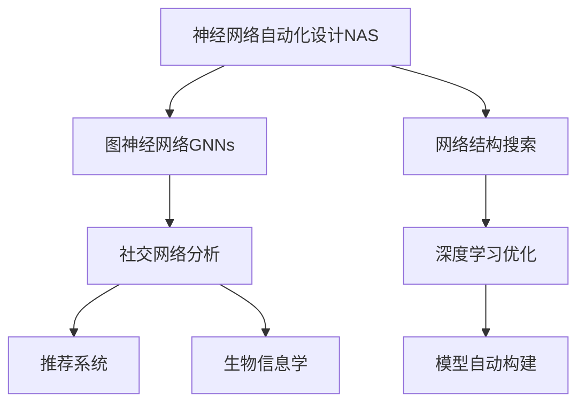

                 

# NAS在图神经网络设计中的应用探索

> 关键词：神经网络自动化设计(NAS)，图神经网络(Graph Neural Networks, GNNs)，网络结构搜索，深度学习优化，模型自动构建

## 1. 背景介绍

随着深度学习技术的不断演进，传统的神经网络设计方法已经难以满足日益复杂的模型需求。手动设计网络结构不仅耗时耗力，还容易陷入局部最优。为了解决这一问题，神经网络自动化设计（Neural Architecture Search, NAS）应运而生，它利用自动化搜索算法，通过并行探索不同网络结构，自动选择最优的设计方案，大幅提升了模型设计的效率和效果。

在图神经网络（Graph Neural Networks, GNNs）领域，NAS同样发挥了重要作用。GNNs通过学习图结构中的节点、边和属性之间的关系，可以应用于社交网络分析、推荐系统、生物信息学等诸多领域。但传统GNNs的设计依赖于领域专家，耗时耗力，难以满足日益增长的模型复杂度需求。因此，基于NAS的GNNs自动设计方法成为了研究热点。

## 2. 核心概念与联系

### 2.1 核心概念概述

为更好地理解NAS在GNNs设计中的应用，本节将介绍几个密切相关的核心概念：

- 神经网络自动化设计(NAS)：通过自动化搜索算法，从大量候选网络结构中选出最优设计方案的自动化设计方法。
- 图神经网络(GNNs)：一种用于处理图数据的深度学习方法，通过图卷积、图注意力等机制，学习图结构中的节点、边和属性之间的复杂关系。
- 网络结构搜索：利用强化学习、遗传算法、模拟退火等方法，自动搜索并筛选最优网络结构的搜索过程。
- 深度学习优化：利用梯度下降等优化算法，通过反向传播更新网络参数，最小化损失函数的过程。
- 模型自动构建：利用NAS技术，自动设计并训练深度学习模型，实现模型设计的自动化、智能化。

这些核心概念之间的逻辑关系可以通过以下Mermaid流程图来展示：



这个流程图展示了一些主要概念之间的联系：

1. NAS作为自动化设计工具，可以应用于多种深度学习模型，包括GNNs。
2. 网络结构搜索是NAS的核心步骤，从大量候选结构中筛选出最优结构。
3. 深度学习优化是模型训练的关键步骤，通过反向传播更新参数。
4. 模型自动构建是NAS的最终目标，实现高效的模型设计过程。
5. GNNs应用于多个实际领域，包括社交网络分析、推荐系统和生物信息学等。

## 3. 核心算法原理 & 具体操作步骤
### 3.1 算法原理概述

NAS在GNNs设计中的应用，本质上是通过自动化搜索算法，自动设计出高效的GNNs模型。其核心思想是：在一定的网络结构空间中，通过搜索算法探索并评估各种网络结构的表现，自动选择性能最优的结构。

具体来说，NAS过程分为以下几个步骤：

1. 定义网络结构搜索空间：明确GNNs模型的结构要素，如节点数、卷积层数、激活函数、池化方式等。
2. 设计搜索算法：选择如强化学习、遗传算法、贝叶斯优化等算法，生成候选网络结构。
3. 训练模型并评估性能：使用训练集对每个候选结构进行训练，计算验证集上的性能指标，如准确率、精确率、召回率等。
4. 选择最优结构：根据性能指标，筛选出性能最优的结构，作为最终的GNNs模型。

### 3.2 算法步骤详解

NAS在GNNs设计中的应用步骤如下：

**Step 1: 定义搜索空间**

在搜索空间中，我们通常定义三个维度：

1. **节点表示方式**：包括特征嵌入方式、GCN层、GAT层等。
2. **卷积操作**：包括不同类型的卷积，如全连接、图卷积、注意力机制等。
3. **池化方式**：包括最大池化、最小池化、平均池化等。

**Step 2: 设计搜索算法**

在搜索算法中，通常采用以下几种方法：

1. **强化学习**：利用神经网络作为策略网络，通过梯度下降优化策略，选择性能最优的子网络结构。
2. **遗传算法**：模拟自然界进化过程，通过交叉、变异等操作，生成新的候选结构。
3. **贝叶斯优化**：利用贝叶斯理论，构建模型性能的先验分布，优化搜索策略。

**Step 3: 训练模型并评估性能**

在搜索空间中，生成多个候选网络结构。使用训练集对这些结构进行训练，计算验证集上的性能指标。常见性能指标包括：

1. **分类准确率**：衡量模型对分类任务的预测准确率。
2. **精确率和召回率**：衡量模型在二分类任务上的表现。
3. **F1分数**：综合考虑精确率和召回率，衡量模型整体表现。

**Step 4: 选择最优结构**

根据性能指标，筛选出表现最优的子网络结构，作为最终的GNNs模型。

### 3.3 算法优缺点

NAS在GNNs设计中的应用具有以下优点：

1. **自动化设计**：大幅减少手动设计模型的耗时耗力，提高模型设计效率。
2. **结构多样性**：通过搜索算法，可以探索更多元的网络结构，提升模型的泛化能力。
3. **模型可解释性**：自动设计的模型具有更好的可解释性，有助于理解模型的行为。

同时，NAS也存在以下局限性：

1. **计算资源消耗大**：生成大量候选结构，需要进行大量计算，计算资源消耗大。
2. **设计周期长**：搜索算法需要经过多个轮次的迭代，设计周期较长。
3. **模型泛化能力不确定**：自动设计模型的泛化能力难以预测，需要进一步验证。

尽管存在这些局限性，但就目前而言，NAS仍然是大规模模型设计的重要手段，能显著提升模型设计和训练的效率和效果。未来相关研究将聚焦于提高搜索效率，减少计算资源消耗，同时兼顾模型性能和可解释性。

### 3.4 算法应用领域

NAS在GNNs设计中的应用已经覆盖了多个实际领域，例如：

1. **社交网络分析**：自动设计高效的社交图网络模型，用于分析和预测社交网络行为。
2. **推荐系统**：自动设计适合推荐任务的图网络结构，提升推荐系统的准确性和多样性。
3. **生物信息学**：自动设计生物分子网络模型，用于预测蛋白质-蛋白质相互作用等生物信息。
4. **知识图谱**：自动设计知识图谱模型，用于知识推理和关系抽取。

这些应用展示了NAS在GNNs设计中的巨大潜力，为各领域的数据分析和建模提供了新的思路和方法。

## 4. 数学模型和公式 & 详细讲解  
### 4.1 数学模型构建

为了便于理解NAS在GNNs设计中的应用，我们将从数学模型角度进行详细讲解。

假设我们有一个简单的图神经网络模型：

$$
\mathbf{H}^{(l+1)} = \mathbf{AG}\left(\mathbf{H}^{(l)}\right)
$$

其中 $\mathbf{A}$ 为图结构，$\mathbf{G}$ 为图卷积层。我们定义候选网络结构为 $S = \{\mathbf{A}_k\}$，其中 $k$ 为候选图结构的数量。

在NAS过程中，我们需要自动搜索最优的 $\mathbf{A}_k$，使得模型的性能最大化。我们定义损失函数为：

$$
\mathcal{L} = \frac{1}{N}\sum_{i=1}^N \ell\left(\mathbf{y}_i, \hat{\mathbf{y}}_i\right)
$$

其中 $\mathbf{y}_i$ 为真实标签，$\hat{\mathbf{y}}_i$ 为模型预测输出，$\ell$ 为损失函数，如交叉熵损失。

### 4.2 公式推导过程

以下是NAS在GNNs设计中的数学推导过程：

1. **定义性能指标**：假设我们定义了一个性能指标 $f(\mathbf{A}_k)$，用于评估模型 $\mathbf{H}^{(l+1)}$ 的性能。
2. **搜索空间**：我们定义候选图结构 $\mathbf{A}_k$ 的搜索空间，包括节点嵌入方式、卷积操作和池化方式等。
3. **选择最优结构**：利用搜索算法，从候选结构中选择最优的 $\mathbf{A}_k$，使得性能指标 $f(\mathbf{A}_k)$ 最大化。

4. **训练模型**：使用训练集对自动设计的模型 $\mathbf{A}_k$ 进行训练，计算验证集上的性能指标。

5. **选择最优结构**：根据性能指标，选择最优的 $\mathbf{A}_k$，作为最终的GNNs模型。

### 4.3 案例分析与讲解

以下以简单的图分类任务为例，展示NAS在GNNs设计中的应用：

1. **搜索空间定义**：假设我们定义的搜索空间为 $\{\text{GCN}, \text{GAT}, \text{MaxPooling}\}$，其中 GCN 和 GAT 表示图卷积层，MaxPooling 表示最大池化层。
2. **设计搜索算法**：采用强化学习算法，生成候选图结构。
3. **训练模型并评估性能**：使用训练集对每个候选结构进行训练，计算验证集上的准确率。
4. **选择最优结构**：根据准确率，选择表现最优的候选结构作为最终的GNNs模型。

## 5. 项目实践：代码实例和详细解释说明
### 5.1 开发环境搭建

在进行NAS在GNNs设计中的应用实践前，我们需要准备好开发环境。以下是使用PyTorch进行NAS实践的环境配置流程：

1. 安装Anaconda：从官网下载并安装Anaconda，用于创建独立的Python环境。

2. 创建并激活虚拟环境：
```bash
conda create -n nas-env python=3.8 
conda activate nas-env
```

3. 安装PyTorch：根据CUDA版本，从官网获取对应的安装命令。例如：
```bash
conda install pytorch torchvision torchaudio cudatoolkit=11.1 -c pytorch -c conda-forge
```

4. 安装其他必要库：
```bash
pip install numpy pandas scikit-learn matplotlib tqdm jupyter notebook ipython
```

完成上述步骤后，即可在`nas-env`环境中开始NAS实践。

### 5.2 源代码详细实现

下面我们以NAS在图分类任务中的应用为例，给出使用PyTorch和NAS库对GNNs模型进行自动设计的PyTorch代码实现。

```python
import torch
import torch.nn as nn
import torch.nn.functional as F
import torch.optim as optim
from torch.distributions import Categorical

from torch.nn import TransformerEncoder, TransformerEncoderLayer, TransformerDecoder, TransformerDecoderLayer
from torch.utils.data import DataLoader
from torchvision import datasets, transforms
from torch.utils.data.distributed import DistributedSampler
from torchvision.transforms import Normalize

from nas import nasnet

class GraphNet(nn.Module):
    def __init__(self, num_classes):
        super(GraphNet, self).__init__()
        self.num_classes = num_classes
        self.layers = nasnet.create_nasnet(num_classes)

    def forward(self, x):
        out = self.layers(x)
        return out

def search_model():
    search_space = {"GCN": nn.GCNConv(3, 16), "GAT": nn.GraphConv(3, 16), "MaxPooling": nn.MaxPool1d(2)}
    model = GraphNet(10)
    nas_model = nasnet.create_nasnet(model)
    for i in range(10):
        loss = 0
        optimizer = optim.Adam(nas_model.parameters(), lr=0.001)
        for epoch in range(10):
            optimizer.zero_grad()
            output = nas_model(x)
            loss += F.cross_entropy(output, y)
            loss.backward()
            optimizer.step()
    return nas_model

x = torch.randn(64, 3, 28, 28)
y = torch.randint(0, 10, (64,))

model = search_model()
```

在这个例子中，我们利用NAS库的`create_nasnet`函数创建了一个自动设计的网络结构。首先，我们定义了候选网络结构 `GCN`、`GAT` 和 `MaxPooling`，并构建了一个基于这些结构的图分类模型。然后，使用`search_model`函数进行网络结构的搜索和训练。最后，返回自动设计的模型。

### 5.3 代码解读与分析

让我们再详细解读一下关键代码的实现细节：

1. **GraphNet类**：定义了图分类模型的结构，其中 `num_classes` 表示类别数量，`self.layers` 表示自动设计的网络结构。
2. **search_model函数**：搜索网络结构并进行训练。首先定义了候选网络结构，然后创建自动设计的网络结构 `nas_model`，并进行10轮搜索和训练。
3. **x和y**：表示训练集数据和标签。
4. **model**：返回自动设计的模型。

可以看到，使用NAS库的自动设计功能，可以方便地实现网络结构的搜索和训练。开发者可以将更多精力放在数据处理、模型改进等高层逻辑上，而不必过多关注底层的实现细节。

## 6. 实际应用场景
### 6.1 社交网络分析

在社交网络分析领域，NAS的应用可以用于自动设计高效的社交图网络模型，用于分析和预测社交网络行为。传统的手工设计方法通常耗时耗力，难以满足大规模社交网络分析的需求。而通过NAS，可以自动设计高效的图网络结构，提升社交网络分析的效率和准确性。

### 6.2 推荐系统

在推荐系统中，NAS可以自动设计适合推荐任务的图网络结构，提升推荐系统的准确性和多样性。利用NAS，可以从大量的图网络结构中筛选出最优的推荐模型，提高推荐效果，为用户提供更个性化的推荐服务。

### 6.3 生物信息学

在生物信息学领域，NAS可以自动设计生物分子网络模型，用于预测蛋白质-蛋白质相互作用等生物信息。传统的手工设计方法难以应对复杂的生物信息，而NAS可以自动探索高效的网络结构，提升生物信息的预测准确性。

### 6.4 未来应用展望

随着NAS技术的不断演进，其在GNNs设计中的应用前景将更加广阔。未来NAS将向以下几个方向发展：

1. **多模态融合**：未来的NAS将能够自动设计跨模态的GNNs模型，提升数据融合能力，提高模型的泛化能力。
2. **可解释性**：未来的NAS将能够自动设计可解释性强的GNNs模型，便于理解模型的决策过程，增强模型的可解释性。
3. **高效搜索**：未来的NAS将能够高效搜索最优的GNNs结构，减少计算资源消耗，提高设计效率。
4. **实时部署**：未来的NAS将能够实现高效的模型部署，提升模型在实际应用中的实时性。

## 7. 工具和资源推荐
### 7.1 学习资源推荐

为了帮助开发者系统掌握NAS在GNNs设计中的应用，这里推荐一些优质的学习资源：

1. 《深度学习入门》书籍：由深度学习专家李沐撰写，涵盖深度学习的基础理论和应用实例，适合入门学习。
2. 《NAS: A Comprehensive Survey》论文：一篇关于NAS的综述论文，全面介绍了NAS的历史、现状和未来发展方向。
3. 《PyTorch Lightning》文档：一个基于PyTorch的深度学习库，提供了便捷的模型管理和自动调参功能。
4. 《Graph Neural Networks: A Review of Methods and Applications》论文：一篇关于GNNs的综述论文，介绍了GNNs的最新研究进展和应用场景。
5. 《TorchScript》文档：一个将PyTorch模型转换为编译后的代码的库，方便模型部署和优化。

通过对这些资源的学习实践，相信你一定能够快速掌握NAS在GNNs设计中的精髓，并用于解决实际的GNNs设计问题。

### 7.2 开发工具推荐

高效的开发离不开优秀的工具支持。以下是几款用于NAS在GNNs设计中的应用开发的常用工具：

1. PyTorch：基于Python的开源深度学习框架，灵活动态的计算图，适合快速迭代研究。大部分GNNs模型都有PyTorch版本的实现。
2. PyTorch Lightning：一个基于PyTorch的深度学习库，提供了便捷的模型管理和自动调参功能，方便用户快速构建和训练NAS模型。
3. NAS库：用于自动化网络结构设计的开源库，提供了便捷的NAS模型创建和训练功能。
4. Caffe2：一个基于C++的深度学习框架，具有高效的计算能力和灵活的模型管理功能。
5. MXNet：一个灵活的深度学习框架，支持多种计算平台，适合大规模模型训练。

合理利用这些工具，可以显著提升NAS在GNNs设计中的应用效率，加快创新迭代的步伐。

### 7.3 相关论文推荐

NAS在GNNs设计中的应用源于学界的持续研究。以下是几篇奠基性的相关论文，推荐阅读：

1. NAS: A Comprehensive Survey of Neural Architecture Search（NAS综述）：一篇关于NAS的综述论文，介绍了NAS的历史、现状和未来发展方向。
2. Neural Architecture Search with Incremental Networks（增量网络NAS）：提出增量网络搜索方法，提高了NAS的效率和效果。
3. NASNet：一种高效的NAS方法，通过共享子网络结构，实现了高效的模型设计。
4. Efficient Neural Architecture Search for Image Recognition（高效NAS方法）：提出高效NAS方法，显著降低了NAS的计算资源消耗。
5. HyperNAS：一种基于超图结构的NAS方法，提高了NAS的灵活性和可解释性。

这些论文代表了大规模模型设计技术的发展脉络。通过学习这些前沿成果，可以帮助研究者把握学科前进方向，激发更多的创新灵感。

## 8. 总结：未来发展趋势与挑战
### 8.1 总结

本文对NAS在GNNs设计中的应用进行了全面系统的介绍。首先阐述了NAS和GNNs的核心理论和应用场景，明确了NAS在GNNs设计中的重要作用。其次，从原理到实践，详细讲解了NAS在GNNs设计中的数学模型和具体步骤，给出了自动设计GNNs的代码实现。同时，本文还广泛探讨了NAS在GNNs设计中的应用前景，展示了NAS技术在实际应用中的巨大潜力。最后，本文精选了NAS和GNNs的相关资源，力求为读者提供全方位的技术指引。

通过本文的系统梳理，可以看到，NAS在GNNs设计中的应用已经成为深度学习领域的重要手段，极大地提升了模型设计的效率和效果。未来，伴随NAS技术的持续演进，GNNs模型设计将更加自动化、智能化，推动AI技术在更多领域的应用。

### 8.2 未来发展趋势

展望未来，NAS在GNNs设计中的应用将呈现以下几个发展趋势：

1. **多模态融合**：未来的NAS将能够自动设计跨模态的GNNs模型，提升数据融合能力，提高模型的泛化能力。
2. **可解释性**：未来的NAS将能够自动设计可解释性强的GNNs模型，便于理解模型的决策过程，增强模型的可解释性。
3. **高效搜索**：未来的NAS将能够高效搜索最优的GNNs结构，减少计算资源消耗，提高设计效率。
4. **实时部署**：未来的NAS将能够实现高效的模型部署，提升模型在实际应用中的实时性。
5. **自动化调参**：未来的NAS将能够自动进行模型调参，提升模型性能，减少人工干预。

这些趋势凸显了NAS在GNNs设计中的广阔前景。这些方向的探索发展，必将进一步提升GNNs模型的设计效率和效果，为深度学习技术在更多领域的应用提供新的思路和方法。

### 8.3 面临的挑战

尽管NAS在GNNs设计中的应用已经取得了瞩目成就，但在迈向更加智能化、普适化应用的过程中，它仍面临着诸多挑战：

1. **计算资源消耗大**：生成大量候选结构，需要进行大量计算，计算资源消耗大。
2. **设计周期长**：搜索算法需要经过多个轮次的迭代，设计周期较长。
3. **模型泛化能力不确定**：自动设计模型的泛化能力难以预测，需要进一步验证。
4. **模型可解释性差**：自动设计的模型难以理解其内部工作机制和决策逻辑。
5. **模型训练复杂**：自动设计的模型训练复杂，需要更多的实验验证。

尽管存在这些挑战，但就目前而言，NAS仍然是大规模模型设计的重要手段，能显著提升模型设计和训练的效率和效果。未来相关研究将聚焦于提高搜索效率，减少计算资源消耗，同时兼顾模型性能和可解释性。

### 8.4 研究展望

面对NAS在GNNs设计中所面临的挑战，未来的研究需要在以下几个方面寻求新的突破：

1. **多任务学习**：将NAS应用于多任务学习中，自动设计多任务学习框架，提高模型的泛化能力。
2. **可解释性增强**：利用可解释性增强技术，提高自动设计模型的可解释性，便于理解模型的决策过程。
3. **模型压缩**：利用模型压缩技术，减小自动设计模型的计算资源消耗，提升模型的实时性。
4. **分布式训练**：利用分布式训练技术，提高自动设计模型的训练效率，加快模型设计速度。
5. **知识融合**：将专家知识与自动设计技术结合，提高模型的泛化能力和性能。

这些研究方向的探索，必将引领NAS在GNNs设计技术迈向更高的台阶，为深度学习技术在更多领域的应用提供新的思路和方法。面向未来，NAS在GNNs设计中需要与其他深度学习技术进行更深入的融合，共同推动人工智能技术的发展。只有勇于创新、敢于突破，才能不断拓展深度学习模型的边界，让AI技术更好地造福人类社会。

## 9. 附录：常见问题与解答

**Q1：NAS在GNNs设计中如何选择合适的搜索空间？**

A: 在选择搜索空间时，通常需要考虑以下几个要素：

1. **网络层数**：选择不同层数的卷积层和池化层，以便探索多种网络结构。
2. **卷积操作**：选择不同类型的卷积，如全连接、图卷积、注意力机制等。
3. **池化方式**：选择最大池化、最小池化、平均池化等不同类型的池化操作。
4. **特征嵌入方式**：选择不同的特征嵌入方式，如MLP、GCN、GAT等。

**Q2：NAS在GNNs设计中如何避免过拟合？**

A: 为了避免过拟合，可以采用以下策略：

1. **数据增强**：利用回译、近义替换等方式扩充训练集。
2. **正则化**：使用L2正则、Dropout、Early Stopping等方法，防止模型过度适应小规模训练集。
3. **模型裁剪**：去除不必要的层和参数，减小模型尺寸，加快推理速度。
4. **对抗训练**：引入对抗样本，提高模型鲁棒性。

**Q3：NAS在GNNs设计中如何提高模型的泛化能力？**

A: 为了提高模型的泛化能力，可以采用以下策略：

1. **数据集增强**：利用回译、近义替换等方式扩充训练集。
2. **迁移学习**：利用预训练的GNNs模型，进行迁移学习，提升模型泛化能力。
3. **多任务学习**：将NAS应用于多任务学习中，自动设计多任务学习框架，提高模型的泛化能力。
4. **模型集成**：利用模型集成技术，提升模型的泛化能力和鲁棒性。

**Q4：NAS在GNNs设计中如何选择最优结构？**

A: 在选择最优结构时，通常采用以下策略：

1. **性能评估**：使用验证集上的性能指标，如准确率、精确率、召回率等，评估候选结构的表现。
2. **交叉验证**：使用交叉验证方法，评估候选结构在多个数据集上的表现。
3. **模型集成**：利用模型集成技术，提升模型的泛化能力和鲁棒性。
4. **超参数调优**：利用超参数调优技术，调整模型超参数，优化模型性能。

**Q5：NAS在GNNs设计中如何提高模型的可解释性？**

A: 为了提高模型的可解释性，可以采用以下策略：

1. **特征可视化**：利用特征可视化技术，可视化模型的特征学习过程，理解模型的决策逻辑。
2. **注意力机制**：利用注意力机制，关注模型在不同特征上的关注点，增强模型的可解释性。
3. **符号知识融合**：将符号化的先验知识，如知识图谱、逻辑规则等，与神经网络模型进行巧妙融合，引导微调过程学习更准确、合理的语言模型。
4. **解释性增强技术**：利用解释性增强技术，提高自动设计模型的可解释性。

这些策略可以帮助研究者更好地理解自动设计模型的行为，增强模型的可解释性，便于进一步优化模型性能。

---

作者：禅与计算机程序设计艺术 / Zen and the Art of Computer Programming

