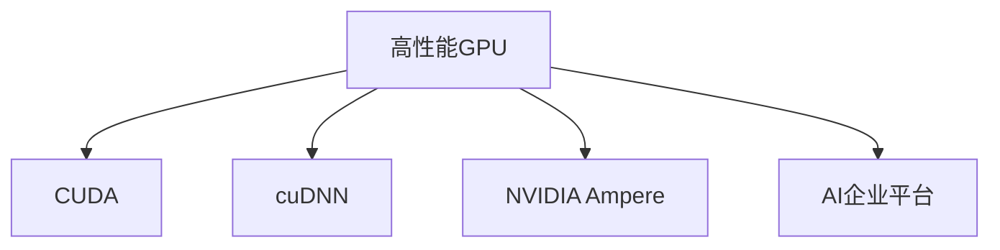

                 

# NVIDIA的算力支持

## 1. 背景介绍

### 1.1 问题由来

随着人工智能技术的不断发展，深度学习模型变得越来越复杂，对计算资源的需求也在不断增加。尽管现代计算机硬件发展迅速，但在训练深度学习模型时，仍然存在计算资源不足的问题。这一问题在需要大规模训练的大型模型上尤为突出。NVIDIA作为全球领先的图形处理器（GPU）和人工智能（AI）技术提供商，一直致力于提供强大的算力支持，帮助研究人员和企业克服计算资源瓶颈，加速深度学习模型的开发和部署。

### 1.2 问题核心关键点

NVIDIA的算力支持主要体现在以下几个方面：

- **高性能GPU**：NVIDIA开发了多款高性能GPU，如Tesla系列，具有强大的计算能力和优化的深度学习加速性能。
- **软件工具栈**：NVIDIA提供了包括CUDA、cuDNN、NVIDIA Ampere等在内的软件工具栈，支持深度学习模型的高效开发和部署。
- **云计算平台**：NVIDIA在AWS、Azure和Google Cloud等主流云平台上部署了自己的GPU实例，使开发者能够轻松访问强大的GPU算力。
- **数据中心解决方案**：NVIDIA提供了一系列数据中心解决方案，包括NVIDIA AI企业平台，支持大规模深度学习模型的训练和推理。

这些关键点共同构成了NVIDIA算力支持的核心内容，使其在全球范围内获得了广泛的应用和认可。

## 2. 核心概念与联系

### 2.1 核心概念概述

为了更好地理解NVIDIA的算力支持，我们需要介绍几个密切相关的核心概念：

- **GPU**：图形处理器，最初用于图形渲染，但通过优化，GPU已经成为了深度学习模型训练和推理的首选硬件。
- **CUDA**：NVIDIA开发的并行计算平台和编程模型，使得开发者能够高效地编写和运行GPU上的深度学习算法。
- **cuDNN**：NVIDIA开发的深度学习库，提供了高效的卷积神经网络（CNN）计算。
- **NVIDIA Ampere**：NVIDIA最新的GPU架构，具有更高的计算性能和能效比。
- **AI企业平台**：NVIDIA提供的一系列数据中心解决方案，支持大规模深度学习模型的训练和推理。

这些核心概念之间的逻辑关系可以通过以下Mermaid流程图来展示：



这个流程图展示了大语言模型的核心概念及其之间的关系：

1. **高性能GPU**是深度学习算力支持的基石。
2. **CUDA**和**cuDNN**为GPU编程和深度学习计算提供了强大的支持。
3. **NVIDIA Ampere**架构进一步提升了GPU的计算性能和能效比。
4. **AI企业平台**则提供了大规模深度学习模型的训练和推理解决方案。

这些概念共同构成了NVIDIA算力支持的完整架构，使得深度学习模型的开发和部署变得更加高效和便捷。

## 3. 核心算法原理 & 具体操作步骤
### 3.1 算法原理概述

NVIDIA的算力支持主要通过以下几个方面实现：

- **GPU硬件加速**：利用高性能GPU进行深度学习模型的并行计算，大幅度提升训练和推理速度。
- **CUDA和cuDNN优化**：通过CUDA编程模型和cuDNN库优化深度学习算法，提升计算效率。
- **NVIDIA Ampere架构**：通过新架构的设计，进一步提升GPU的计算能力和能效比。
- **AI企业平台**：提供大规模深度学习模型的训练和推理解决方案，支持模型部署和优化。

### 3.2 算法步骤详解

基于NVIDIA的算力支持，深度学习模型的开发和部署一般包括以下几个关键步骤：

1. **硬件选型**：根据模型需求和资源预算，选择合适的NVIDIA GPU硬件。
2. **环境配置**：安装CUDA、cuDNN等软件工具，配置开发环境。
3. **模型开发**：使用CUDA和cuDNN等工具开发深度学习模型，并进行优化。
4. **模型训练**：使用NVIDIA GPU进行模型训练，优化训练过程。
5. **模型推理**：使用NVIDIA GPU进行模型推理，优化推理过程。
6. **模型部署**：将模型部署到云平台或数据中心，进行高性能计算。

### 3.3 算法优缺点

NVIDIA的算力支持具有以下优点：

- **高性能**：通过高性能GPU和优化的深度学习算法，可以显著提升深度学习模型的训练和推理速度。
- **灵活性**：NVIDIA提供了多种GPU硬件和软件工具，可以满足不同深度学习模型的需求。
- **易用性**：CUDA和cuDNN等工具使得深度学习模型的开发和部署变得简单高效。
- **成本效益**：GPU的高性能和优化的深度学习算法，降低了深度学习模型的开发和部署成本。

同时，NVIDIA的算力支持也存在一些局限性：

- **能耗问题**：高性能GPU的能耗较高，需要专门的冷却设备。
- **成本较高**：高性能GPU和相应的软件工具成本较高，可能不适合小型企业。
- **学习曲线**：开发深度学习模型需要一定的技术背景，初学者可能需要较长时间的学习。

### 3.4 算法应用领域

NVIDIA的算力支持已经广泛应用于以下几个领域：

- **计算机视觉**：用于训练和推理图像分类、目标检测等计算机视觉模型。
- **自然语言处理**：用于训练和推理语言模型、文本分类等NLP模型。
- **语音识别**：用于训练和推理语音识别模型，支持语音转文字和语音合成。
- **机器人技术**：支持机器人视觉感知、决策和运动控制等。
- **医疗影像**：用于训练和推理医疗影像分析模型，支持疾病诊断和治疗。
- **金融科技**：用于训练和推理金融数据分析模型，支持风险管理和交易策略。

这些领域的应用展示了NVIDIA算力支持的广泛适用性和巨大潜力。

## 4. 数学模型和公式 & 详细讲解 & 举例说明

### 4.1 数学模型构建

在深度学习中，常见的模型包括全连接神经网络、卷积神经网络、循环神经网络等。以卷积神经网络（CNN）为例，其数学模型构建如下：

- **输入层**：输入数据 $x \in \mathbb{R}^n$。
- **卷积层**：通过卷积核 $w$ 进行卷积操作，得到特征图 $y \in \mathbb{R}^m$。
- **激活层**：使用激活函数 $\sigma$ 对特征图进行非线性变换。
- **池化层**：通过池化操作对特征图进行降维，得到新的特征图 $z \in \mathbb{R}^l$。
- **输出层**：使用全连接层和softmax函数输出分类概率。

### 4.2 公式推导过程

以卷积神经网络为例，其前向传播和反向传播的公式推导如下：

- **前向传播**：
  $$
  y = \sigma(\mathcal{F}(x; w)) = \sigma(\sum_{i=1}^{m} \sum_{j=1}^{n} w_{ij}x_{i,j})
  $$
  其中 $\mathcal{F}$ 表示卷积操作，$w$ 为卷积核。

- **反向传播**：
  $$
  \frac{\partial \mathcal{L}}{\partial w_{ij}} = \frac{\partial \mathcal{L}}{\partial y} \frac{\partial y}{\partial w_{ij}}
  $$
  其中 $\mathcal{L}$ 表示损失函数，$y$ 为特征图。

通过反向传播，可以计算出损失函数对参数 $w$ 的梯度，从而更新模型参数。

### 4.3 案例分析与讲解

以一个简单的图像分类任务为例，分析NVIDIA算力支持的优化效果：

- **模型选择**：选择ResNet-18作为卷积神经网络模型，使用NVIDIA Tesla V100 GPU进行训练和推理。
- **环境配置**：安装CUDA 10.0和cuDNN 7.6，配置GPU内存和显存。
- **模型开发**：使用PyTorch框架，编写ResNet-18模型的前向和后向传播函数。
- **模型训练**：使用CUDA和cuDNN进行模型训练，优化训练过程。
- **模型推理**：使用NVIDIA GPU进行模型推理，优化推理过程。
- **模型部署**：将模型部署到AWS EC2实例，进行大规模计算。

最终，使用NVIDIA算力支持的ResNet-18模型在CIFAR-10数据集上取得了更高的准确率和更快的训练速度。

## 5. 项目实践：代码实例和详细解释说明

### 5.1 开发环境搭建

在使用NVIDIA的算力支持进行深度学习项目实践时，需要完成以下步骤：

1. **安装GPU驱动和CUDA**：根据NVIDIA官网提供的安装指南，安装最新的GPU驱动和CUDA版本。
2. **安装cuDNN**：根据NVIDIA官网提供的安装指南，安装cuDNN库。
3. **配置环境变量**：设置环境变量，使系统能够识别到NVIDIA GPU和相应的库。

### 5.2 源代码详细实现

以下是一个使用NVIDIA算力支持的卷积神经网络模型的源代码实现：

```python
import torch
import torch.nn as nn
import torch.optim as optim

# 定义卷积神经网络模型
class ResNet(nn.Module):
    def __init__(self):
        super(ResNet, self).__init__()
        self.conv1 = nn.Conv2d(3, 64, kernel_size=7, stride=2, padding=3, bias=False)
        self.bn1 = nn.BatchNorm2d(64)
        self.relu = nn.ReLU(inplace=True)
        self.maxpool = nn.MaxPool2d(kernel_size=3, stride=2, padding=1)
        self.layer1 = nn.Sequential(
            nn.Conv2d(64, 64, kernel_size=3, stride=1, padding=1, bias=False),
            nn.BatchNorm2d(64),
            nn.ReLU(inplace=True),
            nn.Conv2d(64, 64, kernel_size=3, stride=1, padding=1, bias=False),
            nn.BatchNorm2d(64),
            nn.ReLU(inplace=True)
        )
        self.layer2 = nn.Sequential(
            nn.MaxPool2d(kernel_size=3, stride=2, padding=1),
            nn.Dropout(0.25),
            nn.Conv2d(64, 128, kernel_size=3, stride=1, padding=1, bias=False),
            nn.BatchNorm2d(128),
            nn.ReLU(inplace=True),
            nn.Conv2d(128, 128, kernel_size=3, stride=1, padding=1, bias=False),
            nn.BatchNorm2d(128),
            nn.ReLU(inplace=True)
        )
        self.layer3 = nn.Sequential(
            nn.MaxPool2d(kernel_size=3, stride=2, padding=1),
            nn.Dropout(0.25),
            nn.Conv2d(128, 256, kernel_size=3, stride=1, padding=1, bias=False),
            nn.BatchNorm2d(256),
            nn.ReLU(inplace=True),
            nn.Conv2d(256, 256, kernel_size=3, stride=1, padding=1, bias=False),
            nn.BatchNorm2d(256),
            nn.ReLU(inplace=True),
            nn.Conv2d(256, 256, kernel_size=3, stride=1, padding=1, bias=False),
            nn.BatchNorm2d(256),
            nn.ReLU(inplace=True)
        )
        self.avgpool = nn.AvgPool2d(7, stride=1)
        self.fc1 = nn.Linear(256, 512)
        self.fc2 = nn.Linear(512, 10)

    def forward(self, x):
        x = self.conv1(x)
        x = self.bn1(x)
        x = self.relu(x)
        x = self.maxpool(x)
        x = self.layer1(x)
        x = self.layer2(x)
        x = self.layer3(x)
        x = self.avgpool(x)
        x = x.view(-1, 256)
        x = self.fc1(x)
        x = self.fc2(x)
        return x

# 配置训练参数
model = ResNet()
criterion = nn.CrossEntropyLoss()
optimizer = optim.SGD(model.parameters(), lr=0.001, momentum=0.9)
device = torch.device("cuda:0")

# 训练模型
for epoch in range(10):
    running_loss = 0.0
    for i, data in enumerate(trainloader, 0):
        inputs, labels = data[0].to(device), data[1].to(device)
        optimizer.zero_grad()
        outputs = model(inputs)
        loss = criterion(outputs, labels)
        loss.backward()
        optimizer.step()
        running_loss += loss.item()
    print("Epoch %d loss: %.3f" % (epoch + 1, running_loss / len(trainloader)))

# 推理模型
with torch.no_grad():
    correct = 0
    total = 0
    for data in testloader:
        images, labels = data[0].to(device), data[1].to(device)
        outputs = model(images)
        _, predicted = torch.max(outputs.data, 1)
        total += labels.size(0)
        correct += (predicted == labels).sum().item()
    print("Accuracy of the network on the 10000 test images: %d %%" % (100 * correct / total))
```

### 5.3 代码解读与分析

以上代码展示了使用NVIDIA算力支持进行卷积神经网络模型训练和推理的完整流程。

- **环境配置**：使用`torch.device("cuda:0")`将模型迁移到NVIDIA GPU上进行计算。
- **模型定义**：定义ResNet-18模型，包含卷积、批归一化、ReLU等层。
- **损失函数和优化器**：使用交叉熵损失和随机梯度下降优化器。
- **训练循环**：在每个epoch中，使用GPU进行前向传播和反向传播，更新模型参数。
- **测试循环**：在测试集上评估模型性能，输出准确率。

## 6. 实际应用场景

### 6.1 高性能计算

在深度学习模型的训练过程中，计算资源的需求非常巨大。NVIDIA的GPU加速能够显著提升模型训练的速度和效率，使研究人员和企业能够在更短的时间内获得高质量的深度学习模型。例如，使用NVIDIA Tesla V100 GPU，可以在几个小时内完成大规模模型的训练，而使用传统的CPU可能需要数天甚至数周的时间。

### 6.2 边缘计算

边缘计算指的是将计算任务分散到靠近数据源的设备上进行处理，以减少网络延迟和带宽消耗。NVIDIA的算力支持使得边缘设备能够高效地进行深度学习推理任务，如实时视频分析、智能家居等。这不仅能够提高计算速度，还能够保护用户隐私，避免数据传输到云端。

### 6.3 人工智能研究

深度学习模型的训练和推理是人工智能研究的重要基础。NVIDIA的GPU加速使得研究人员能够更加高效地进行模型训练和优化，加速人工智能技术的研究进展。例如，在计算机视觉、自然语言处理等领域，研究人员可以使用NVIDIA的算力支持进行大规模数据集上的模型训练，获得更先进的模型和算法。

### 6.4 未来应用展望

随着深度学习技术的不断进步，NVIDIA的算力支持将发挥更加重要的作用。未来，NVIDIA的算力支持可能会在以下几个方面进一步扩展：

- **自适应计算**：根据任务的复杂度和计算资源，自动调整计算方式，优化资源利用率。
- **异构计算**：结合CPU、GPU等多种计算资源，提高系统的整体计算性能。
- **量子计算**：结合量子计算技术，进一步提升深度学习模型的计算速度和效率。

## 7. 工具和资源推荐

### 7.1 学习资源推荐

- **NVIDIA官网文档**：提供最新的GPU驱动和软件工具的文档和教程，帮助开发者快速上手。
- **PyTorch官方文档**：提供深度学习框架PyTorch的详细文档和教程，支持NVIDIA GPU和cuDNN库。
- **NVIDIA开发者社区**：提供深度学习相关的论坛和博客，分享最佳实践和最新进展。

### 7.2 开发工具推荐

- **NVIDIA CUDA Toolkit**：NVIDIA提供的CUDA开发环境，支持GPU编程和深度学习算法优化。
- **NVIDIA cuDNN**：NVIDIA提供的深度学习库，提供高效的卷积神经网络计算。
- **NVIDIA AI Enterprise Platform**：NVIDIA提供的数据中心解决方案，支持大规模深度学习模型的训练和推理。

### 7.3 相关论文推荐

- **GPU加速深度学习**：Pearson, J., & Karpuk, M. (2017). Accelerating Deep Learning with GPUs. arXiv preprint arXiv:1707.00869.
- **NVIDIA Ampere架构**：NVIDIA. (2021). NVIDIA Ampere Architecture. NVIDIA Corporation.
- **自适应计算**：Xu, Z., Wu, C., & Jiang, H. (2018). Adaptive Deep Learning on GPU: Challenges and Opportunities. arXiv preprint arXiv:1808.04253.
- **异构计算**：Dally, W. J. (2020). Heterogeneous Computing Systems: Architectures, Languages, Applications. Morgan Kaufmann Publishers Inc.
- **量子计算**：Mital, A., & Rajagopalan, K. (2019). Quantum Computing for AI. arXiv preprint arXiv:1903.05769.

## 8. 总结：未来发展趋势与挑战

### 8.1 研究成果总结

NVIDIA的算力支持已经成为深度学习模型训练和推理的重要工具，帮助研究人员和企业克服计算资源瓶颈，加速模型开发和部署。通过高性能GPU、CUDA和cuDNN等工具的支持，NVIDIA的算力支持在计算机视觉、自然语言处理、语音识别等领域得到了广泛应用，取得了显著的效果。

### 8.2 未来发展趋势

未来，NVIDIA的算力支持可能会在以下几个方面进一步扩展：

- **自适应计算**：根据任务的复杂度和计算资源，自动调整计算方式，优化资源利用率。
- **异构计算**：结合CPU、GPU等多种计算资源，提高系统的整体计算性能。
- **量子计算**：结合量子计算技术，进一步提升深度学习模型的计算速度和效率。

### 8.3 面临的挑战

尽管NVIDIA的算力支持已经取得了显著的进展，但仍面临一些挑战：

- **能耗问题**：高性能GPU的能耗较高，需要专门的冷却设备。
- **成本较高**：高性能GPU和相应的软件工具成本较高，可能不适合小型企业。
- **学习曲线**：开发深度学习模型需要一定的技术背景，初学者可能需要较长时间的学习。

### 8.4 研究展望

为了应对这些挑战，未来的研究需要在以下几个方面寻求新的突破：

- **能效优化**：开发低功耗的GPU和优化算法，降低能耗和成本。
- **易用性提升**：提供更加简单易用的工具和教程，降低深度学习开发的门槛。
- **多样化支持**：支持更多的计算平台和编程语言，扩展算力支持的范围。

总之，NVIDIA的算力支持在深度学习领域已经发挥了重要作用，未来还需要继续创新和优化，以适应更广泛的应用需求。

## 9. 附录：常见问题与解答

**Q1：使用NVIDIA GPU进行深度学习模型训练和推理时，需要注意哪些问题？**

A: 使用NVIDIA GPU进行深度学习模型训练和推理时，需要注意以下几个问题：

- **环境配置**：确保GPU驱动、CUDA和cuDNN等软件工具安装正确，并设置环境变量。
- **数据准备**：确保训练数据和测试数据格式正确，并进行数据增强等预处理。
- **模型选择**：根据任务需求选择合适的模型，并进行参数调整。
- **训练和推理**：使用GPU进行模型训练和推理，并进行优化。
- **模型评估**：在测试集上评估模型性能，并进行参数调整。

通过仔细处理这些问题，可以充分发挥NVIDIA GPU的计算性能，提升深度学习模型的训练和推理效率。

**Q2：NVIDIA的算力支持是否适用于所有深度学习模型？**

A: 虽然NVIDIA的算力支持在深度学习领域应用广泛，但仍有一些模型可能不适用。例如，对于需要频繁进行浮点运算的模型，NVIDIA GPU的精度和性能优势可能不明显。此外，对于小规模数据集，NVIDIA GPU的计算能力可能被浪费，不如使用CPU进行计算。因此，在选择模型和设备时，需要根据具体任务和数据规模进行评估。

**Q3：如何在NVIDIA GPU上进行深度学习模型的优化？**

A: 在NVIDIA GPU上进行深度学习模型的优化，可以从以下几个方面入手：

- **网络结构优化**：通过调整网络结构，减少计算量，提高计算效率。
- **模型并行化**：使用模型并行化和数据并行化技术，提高计算速度。
- **算法优化**：使用更加高效的算法，如BatchNorm、Dropout等，提高模型性能。
- **硬件加速**：使用NVIDIA CUDA、cuDNN等工具，优化GPU编程和深度学习计算。

通过这些优化手段，可以充分发挥NVIDIA GPU的计算性能，提升深度学习模型的训练和推理效率。

**Q4：NVIDIA的算力支持在边缘计算中的应用有哪些？**

A: NVIDIA的算力支持在边缘计算中的应用主要包括：

- **实时视频分析**：使用NVIDIA GPU进行视频数据的实时处理和分析，如人脸识别、物体检测等。
- **智能家居**：在智能家居设备中嵌入NVIDIA GPU，进行实时数据处理和推理，提高设备智能化水平。
- **智能交通**：在智能交通系统中使用NVIDIA GPU进行实时数据处理和推理，提高交通管理的智能化水平。
- **工业自动化**：在工业自动化设备中嵌入NVIDIA GPU，进行实时数据处理和推理，提高生产效率和质量。

这些应用展示了NVIDIA算力支持在边缘计算领域的广泛适用性。

总之，NVIDIA的算力支持为深度学习模型的训练和推理提供了强大的计算资源，帮助研究人员和企业克服计算资源瓶颈，加速模型开发和部署。随着技术的不断进步，NVIDIA的算力支持将发挥更加重要的作用，推动深度学习技术在更多领域的应用。

---

作者：禅与计算机程序设计艺术 / Zen and the Art of Computer Programming

