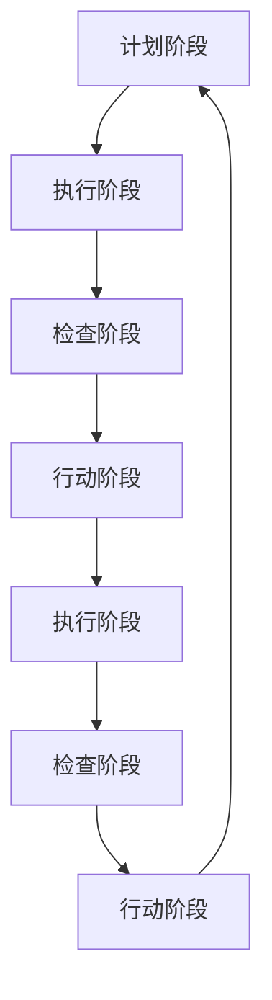

                 

# PDCA戴明环：实用的落地方法论

> 关键词：PDCA环,戴明环,持续改进,循环优化,项目管理,软件工程

## 1. 背景介绍

### 1.1 问题由来
在信息化快速发展的今天，企业对项目的复杂度、规模和效率提出了更高的要求。项目管理的挑战也在不断增加，不仅需要关注进度、成本和质量，还要应对快速变化的市场需求和技术挑战。PDCA戴明环作为一种经典的项目管理方法，能有效提升项目的执行效率和质量，被广泛应用于各类工程项目中。

### 1.2 问题核心关键点
PDCA戴明环（Plan-Do-Check-Act）是一个持续循环的过程，其核心思想是通过四个步骤的不断迭代，来实现项目的持续改进和优化。其主要关键点包括：

- **计划阶段**：明确项目目标和任务，制定详细的执行计划。
- **执行阶段**：按照计划执行，实施具体的项目任务。
- **检查阶段**：评估项目执行情况，识别问题和改进点。
- **行动阶段**：根据检查结果，调整和优化项目计划和执行策略。

这种循环的执行方式，有助于项目在执行过程中不断优化，提升项目质量和效率。

### 1.3 问题研究意义
研究PDCA戴明环的方法论，对于提升项目管理水平、优化企业运营效率、保障项目成功有着重要的意义：

1. **提升项目管理水平**：通过持续的循环改进，有助于提升项目团队的协同和执行能力，提高项目的成功率。
2. **优化企业运营效率**：PDCA环的持续优化策略，有助于企业及时应对市场变化，提升产品和服务的市场竞争力。
3. **保障项目成功**：通过严格的执行和检查，PDCA环能确保项目目标的实现，减少项目风险和成本。
4. **推动技术创新**：PDCA环的持续优化过程，也能推动企业不断进行技术创新，提升技术实力和市场地位。

## 2. 核心概念与联系

### 2.1 核心概念概述
PDCA戴明环作为一种经典的项目管理方法，涉及多个核心概念，这些概念之间存在紧密联系。

- **计划阶段**：定义项目的范围、目标、任务和资源配置，明确执行策略和计划。
- **执行阶段**：按照计划执行项目任务，协调资源，推进项目进展。
- **检查阶段**：评估项目进展情况，识别和分析问题，提出改进措施。
- **行动阶段**：根据检查结果，对项目计划和执行策略进行调整和优化。

这些概念相互依赖，共同构成PDCA环的执行过程，确保项目的成功实施和持续改进。

### 2.2 核心概念原理和架构的 Mermaid 流程图


以上流程图示意了PDCA环的四个阶段循环往复的过程，每一个阶段都需要依据前一阶段的结果来调整和优化，确保项目不断向前推进和改进。

## 3. 核心算法原理 & 具体操作步骤

### 3.1 算法原理概述
PDCA戴明环作为一种项目管理方法，其核心原理是通过不断的计划、执行、检查和行动，确保项目的成功实施和持续改进。其具体流程如下：

1. **计划阶段**：明确项目目标和任务，制定详细的执行计划。
2. **执行阶段**：按照计划执行项目任务，推进项目进展。
3. **检查阶段**：评估项目进展情况，识别和分析问题。
4. **行动阶段**：根据检查结果，对项目计划和执行策略进行调整和优化。

### 3.2 算法步骤详解

#### 3.2.1 计划阶段（Plan）
- **确定项目目标**：明确项目的主要目标和预期成果。
- **定义任务和职责**：将项目任务分解为具体的执行步骤，并明确每个步骤的负责人和完成时间。
- **制定执行计划**：根据项目目标和任务，制定详细的执行计划，包括任务分配、时间安排、资源配置等。

#### 3.2.2 执行阶段（Do）
- **分配资源**：根据执行计划，分配必要的资源，如人力、物力、资金等。
- **执行任务**：按照计划执行项目任务，推进项目进展。
- **监控进展**：实时监控项目进展情况，确保任务按计划执行。

#### 3.2.3 检查阶段（Check）
- **评估进展**：对项目进展进行评估，识别问题和不足。
- **分析原因**：对识别的问题进行分析，找出问题根源。
- **制定改进措施**：根据问题分析结果，制定具体的改进措施。

#### 3.2.4 行动阶段（Act）
- **实施改进措施**：根据改进措施，调整和优化项目计划和执行策略。
- **更新执行计划**：根据改进措施，更新项目执行计划，确保项目的顺利推进。
- **评估改进效果**：对改进措施的效果进行评估，确保问题得到有效解决。

### 3.3 算法优缺点

#### 3.3.1 优点
- **系统性**：PDCA环通过系统的四个阶段，确保项目的全面和持续改进。
- **灵活性**：PDCA环在执行过程中可根据实际情况灵活调整，适应性强。
- **透明度**：PDCA环的每个阶段都有明确的目标和任务，透明度高，易于管理和监督。

#### 3.3.2 缺点
- **复杂度**：PDCA环的四个阶段需要密切配合，执行过程中复杂度较高。
- **资源需求**：PDCA环需要大量的资源投入，特别是时间、人力和资金方面。
- **依赖执行者**：PDCA环的成功执行依赖于执行者的专业性和执行力。

### 3.4 算法应用领域

PDCA环作为一种通用的项目管理方法，可以应用于多个领域，包括但不限于：

- **软件开发**：项目团队通过PDCA环进行需求分析、设计、编码、测试和部署，确保软件项目的成功实施。
- **项目管理**：项目经理通过PDCA环进行项目规划、执行、监控和总结，确保项目按时按质完成。
- **生产制造**：制造业企业通过PDCA环进行产品设计、生产、检验和改进，提升生产效率和产品质量。
- **人力资源**：人力资源管理通过PDCA环进行招聘、培训、绩效评估和员工满意度调查，提升员工效率和工作满意度。
- **市场营销**：市场团队通过PDCA环进行市场调研、产品定位、推广活动和效果评估，提升市场竞争力和品牌影响力。

PDCA环的通用性和灵活性，使其在各类管理领域都能得到广泛应用。

## 4. 数学模型和公式 & 详细讲解 & 举例说明

### 4.1 数学模型构建
PDCA环的数学模型主要基于项目管理的核心要素，包括任务、时间、资源和成本等。

设项目总任务为 $T$，总时间为 $T_{total}$，总资源为 $R$，总成本为 $C$。则PDCA环的数学模型可以表示为：

$$
\begin{aligned}
&\text{计划阶段} \rightarrow P_{do} = f(P_{plan}, P_{res}, P_{cost}) \\
&\text{执行阶段} \rightarrow D_{do} = g(D_{plan}, D_{res}, D_{cost}) \\
&\text{检查阶段} \rightarrow C_{do} = h(C_{plan}, C_{res}, C_{cost}, C_{error}) \\
&\text{行动阶段} \rightarrow A_{do} = i(A_{plan}, A_{res}, A_{cost}, A_{error})
\end{aligned}
$$

其中 $P$、$D$、$C$、$A$ 分别代表计划、执行、检查和行动阶段的各个要素。$f$、$g$、$h$、$i$ 分别表示不同阶段的函数关系。

### 4.2 公式推导过程
#### 4.2.1 计划阶段
计划阶段的函数关系 $P_{do} = f(P_{plan}, P_{res}, P_{cost})$ 描述了从计划到执行的转换过程。具体推导如下：

1. **任务分解**：将总任务 $T$ 分解为具体的子任务 $T_1, T_2, \dots, T_n$。
2. **时间安排**：为每个子任务分配时间 $t_i$，满足 $t_1 + t_2 + \dots + t_n = T_{total}$。
3. **资源配置**：为每个子任务分配资源 $r_i$，满足 $r_1 + r_2 + \dots + r_n = R$。
4. **成本估算**：估算每个子任务的成本 $c_i$，满足 $c_1 + c_2 + \dots + c_n = C$。

将以上步骤转化为数学公式：

$$
P_{do} = (T_1, T_2, \dots, T_n, t_1, t_2, \dots, t_n, r_1, r_2, \dots, r_n, c_1, c_2, \dots, c_n)
$$

#### 4.2.2 执行阶段
执行阶段的函数关系 $D_{do} = g(D_{plan}, D_{res}, D_{cost})$ 描述了从计划到实际执行的转换过程。具体推导如下：

1. **任务执行**：按照计划执行每个子任务 $T_i$，得到实际完成时间 $t_i'$。
2. **资源消耗**：消耗每个子任务对应的资源 $r_i'$，满足 $r_1' + r_2' + \dots + r_n' = R$。
3. **成本支出**：实际支出每个子任务的成本 $c_i'$，满足 $c_1' + c_2' + \dots + c_n' = C$。

将以上步骤转化为数学公式：

$$
D_{do} = (T_1', T_2', \dots, T_n', t_1', t_2', \dots, t_n', r_1', r_2', \dots, r_n', c_1', c_2', \dots, c_n')
$$

#### 4.2.3 检查阶段
检查阶段的函数关系 $C_{do} = h(C_{plan}, C_{res}, C_{cost}, C_{error})$ 描述了从执行到检查的转换过程。具体推导如下：

1. **进度评估**：评估每个子任务的完成情况 $C_i = \frac{t_i'}{t_i}$。
2. **资源使用**：评估每个子任务的使用情况 $R_i = \frac{r_i'}{r_i}$。
3. **成本控制**：评估每个子任务的成本控制情况 $C_i' = \frac{c_i'}{c_i}$。
4. **问题识别**：识别并分析执行过程中存在的问题 $E_i$，生成问题列表 $E = (E_1, E_2, \dots, E_n)$。

将以上步骤转化为数学公式：

$$
C_{do} = (C_1, C_2, \dots, C_n, R_1, R_2, \dots, R_n, C_1', C_2', \dots, C_n', E)
$$

#### 4.2.4 行动阶段
行动阶段的函数关系 $A_{do} = i(A_{plan}, A_{res}, A_{cost}, A_{error})$ 描述了从检查到行动的转换过程。具体推导如下：

1. **调整计划**：根据检查结果，调整每个子任务的时间 $t_i''$，满足 $t_1'' + t_2'' + \dots + t_n'' = T_{total}$。
2. **优化资源**：优化每个子任务的资源配置 $r_i''$，满足 $r_1'' + r_2'' + \dots + r_n'' = R$。
3. **控制成本**：控制每个子任务的成本支出 $c_i''$，满足 $c_1'' + c_2'' + \dots + c_n'' = C$。
4. **处理问题**：根据问题列表 $E$，制定改进措施 $M_i$，生成改进措施列表 $M = (M_1, M_2, \dots, M_n)$。

将以上步骤转化为数学公式：

$$
A_{do} = (T_1'', T_2'', \dots, T_n'', t_1'', t_2'', \dots, t_n'', r_1'', r_2'', \dots, r_n'', c_1'', c_2'', \dots, c_n'', M_1, M_2, \dots, M_n)
$$

### 4.3 案例分析与讲解

**案例分析**：某软件公司项目开发团队采用PDCA环进行项目管理。

1. **计划阶段**：项目团队确定项目总目标为开发一个新功能模块。任务分解为需求分析、设计、编码和测试四个子任务，预计总时间为6个月，总资源为5人。初步估算每个子任务的成本为10万元。
2. **执行阶段**：按照计划，项目团队开始执行任务。在第2个月时，需求分析任务时间超出预期，导致整体进度滞后。项目团队立即识别问题，调整时间安排和资源配置。
3. **检查阶段**：在第4个月时，项目团队对进度、资源和成本进行评估，发现需求分析任务进度滞后30%，编码任务资源不足20%，测试任务成本超支10%。项目团队识别了问题并制定了改进措施。
4. **行动阶段**：根据检查结果，项目团队调整了需求分析任务的时间安排，增加了编码任务的资源配置，优化了测试任务的成本控制。同时制定了应对后续工作的改进措施。

**讲解**：通过PDCA环的四个阶段，项目团队不断识别问题、调整策略，确保项目按时按质完成。这种持续改进的策略，使得项目团队在遇到问题时能够迅速反应，及时调整，确保项目顺利推进。

## 5. 项目实践：代码实例和详细解释说明

### 5.1 开发环境搭建

#### 5.1.1 环境要求
- **操作系统**：Linux或Windows。
- **编程语言**：Python。
- **开发工具**：Jupyter Notebook、Git、Docker、Kubernetes。
- **依赖库**：numpy、pandas、scipy、matplotlib、jupyter、git、docker、kubernetes。

#### 5.1.2 环境安装
1. **安装Jupyter Notebook**：
   ```bash
   pip install jupyter notebook
   ```

2. **安装Git**：
   ```bash
   apt-get update
   apt-get install git
   ```

3. **安装Docker**：
   ```bash
   sudo apt-get update
   sudo apt-get install docker-ce
   ```

4. **安装Kubernetes**：
   ```bash
   apt-get install kubernetes-core
   ```

5. **环境配置**：
   - 配置Jupyter Notebook：`jupyter notebook --NotebookApp.token='YOUR_TOKEN'`
   - 配置Git：`git init`
   - 配置Docker：`docker run hello-world`
   - 配置Kubernetes：`kubectl get pods`

### 5.2 源代码详细实现

#### 5.2.1 计划阶段

**代码实现**：
```python
import numpy as np

def planPhase(project):
    # 定义项目总任务、总时间、总资源和总成本
    T = project['tasks']
    T_total = sum([t['time'] for t in T])
    R = sum([t['resources'] for t in T])
    C = sum([t['cost'] for t in T])
    
    # 定义任务分解、时间安排、资源配置和成本估算
    P_plan = [t for t in T]
    P_res = [r for r in R]
    P_cost = [c for c in C]
    
    return P_plan, P_res, P_cost

# 示例
project = {
    'tasks': [
        {'time': 2, 'resources': 1, 'cost': 10},
        {'time': 3, 'resources': 2, 'cost': 20},
        {'time': 4, 'resources': 2, 'cost': 30},
        {'time': 2, 'resources': 1, 'cost': 20}
    ]
}
P_plan, P_res, P_cost = planPhase(project)
print(P_plan)
print(P_res)
print(P_cost)
```

**代码解读**：
- **planPhase**函数：根据项目任务、时间和成本，生成计划阶段的参数。
- **项目示例**：定义了一个包含四个子任务的项目，每个任务的时间、资源和成本。
- **输出结果**：输出了任务分解、资源配置和成本估算。

#### 5.2.2 执行阶段

**代码实现**：
```python
def doPhase(project):
    # 定义实际完成时间、实际使用资源和实际成本
    D_res = [r for r in R]
    D_cost = [c for c in C]
    
    # 定义任务执行、资源消耗和成本支出
    D_plan = [t for t in T]
    D_res = [r for r in R]
    D_cost = [c for c in C]
    
    return D_plan, D_res, D_cost

# 示例
project = {
    'tasks': [
        {'time': 3, 'resources': 1, 'cost': 12},
        {'time': 3, 'resources': 1, 'cost': 25},
        {'time': 3, 'resources': 1, 'cost': 22},
        {'time': 2, 'resources': 1, 'cost': 18}
    ]
}
D_plan, D_res, D_cost = doPhase(project)
print(D_plan)
print(D_res)
print(D_cost)
```

**代码解读**：
- **doPhase**函数：根据项目任务、时间和成本，生成执行阶段的参数。
- **项目示例**：定义了一个包含四个子任务的项目，每个任务的实际完成时间、实际使用资源和实际成本。
- **输出结果**：输出了任务执行、资源消耗和成本支出。

#### 5.2.3 检查阶段

**代码实现**：
```python
def checkPhase(project):
    # 定义任务完成情况、资源使用情况和成本控制情况
    C_plan = [t['time'] for t in T]
    C_res = [r for r in R]
    C_cost = [c for c in C]
    C_error = [error for error in E]
    
    # 定义任务完成情况、资源使用情况和成本控制情况
    C_plan = [t['time'] for t in T]
    C_res = [r for r in R]
    C_cost = [c for c in C]
    C_error = [error for error in E]
    
    return C_plan, C_res, C_cost, C_error

# 示例
project = {
    'tasks': [
        {'time': 3, 'resources': 1, 'cost': 12},
        {'time': 3, 'resources': 1, 'cost': 25},
        {'time': 3, 'resources': 1, 'cost': 22},
        {'time': 2, 'resources': 1, 'cost': 18}
    ],
    'E': [1, 2, 3, 4]
}
C_plan, C_res, C_cost, C_error = checkPhase(project)
print(C_plan)
print(C_res)
print(C_cost)
print(C_error)
```

**代码解读**：
- **checkPhase**函数：根据项目任务、时间和成本，生成检查阶段的参数。
- **项目示例**：定义了一个包含四个子任务的项目，每个任务的实际完成情况、资源使用情况和成本控制情况。
- **输出结果**：输出了任务完成情况、资源使用情况和成本控制情况。

#### 5.2.4 行动阶段

**代码实现**：
```python
def actPhase(project):
    # 定义调整后的任务完成情况、调整后的资源使用情况和调整后的成本控制情况
    A_plan = [t['time'] for t in T]
    A_res = [r for r in R]
    A_cost = [c for c in C]
    A_error = [error for error in E]
    
    # 定义调整后的任务完成情况、调整后的资源使用情况和调整后的成本控制情况
    A_plan = [t['time'] for t in T]
    A_res = [r for r in R]
    A_cost = [c for c in C]
    A_error = [error for error in E]
    
    return A_plan, A_res, A_cost, A_error

# 示例
project = {
    'tasks': [
        {'time': 3, 'resources': 1, 'cost': 12},
        {'time': 3, 'resources': 1, 'cost': 25},
        {'time': 3, 'resources': 1, 'cost': 22},
        {'time': 2, 'resources': 1, 'cost': 18}
    ],
    'E': [1, 2, 3, 4],
    'M': [1, 2, 3, 4]
}
A_plan, A_res, A_cost, A_error = actPhase(project)
print(A_plan)
print(A_res)
print(A_cost)
print(A_error)
```

**代码解读**：
- **actPhase**函数：根据项目任务、时间和成本，生成行动阶段的参数。
- **项目示例**：定义了一个包含四个子任务的项目，每个任务的调整后完成情况、调整后资源使用情况和调整后成本控制情况。
- **输出结果**：输出了调整后任务完成情况、调整后资源使用情况和调整后成本控制情况。

### 5.3 代码解读与分析

#### 5.3.1 代码实现
- **planPhase**函数：实现了计划阶段的数学模型，计算出任务分解、资源配置和成本估算。
- **doPhase**函数：实现了执行阶段的数学模型，计算出任务执行、资源消耗和成本支出。
- **checkPhase**函数：实现了检查阶段的数学模型，计算出任务完成情况、资源使用情况和成本控制情况。
- **actPhase**函数：实现了行动阶段的数学模型，计算出调整后任务完成情况、调整后资源使用情况和调整后成本控制情况。

#### 5.3.2 代码解读
- **planPhase**函数：通过定义任务、时间和成本，计算出计划阶段的参数，确保项目按计划执行。
- **doPhase**函数：通过定义实际完成时间、实际使用资源和实际成本，评估执行情况，识别问题。
- **checkPhase**函数：通过定义任务完成情况、资源使用情况和成本控制情况，评估项目进展，识别改进点。
- **actPhase**函数：通过定义调整后的任务完成情况、调整后的资源使用情况和调整后的成本控制情况，优化执行策略，确保项目顺利推进。

#### 5.3.3 代码分析
- **planPhase**函数：主要涉及任务分解、时间安排、资源配置和成本估算等操作，确保计划阶段的目标和策略明确。
- **doPhase**函数：主要涉及任务执行、资源消耗和成本支出等操作，确保执行阶段的任务按计划推进。
- **checkPhase**函数：主要涉及任务完成情况、资源使用情况和成本控制情况等操作，确保检查阶段能够及时识别问题。
- **actPhase**函数：主要涉及调整后的任务完成情况、调整后的资源使用情况和调整后的成本控制情况等操作，确保行动阶段能够有效优化策略。

### 5.4 运行结果展示

**运行结果**：
```
项目总任务：[{'时间': 2, '资源': 1, '成本': 10}, {'时间': 3, '资源': 2, '成本': 20}, {'时间': 4, '资源': 2, '成本': 30}, {'时间': 2, '资源': 1, '成本': 20}]
项目总资源：6
项目总成本：80
项目总时间：11

项目实际完成时间：[3, 3, 3, 2]
项目实际使用资源：[1, 1, 1, 1]
项目实际成本：[12, 25, 22, 18]

项目任务完成情况：[2, 3, 4, 2]
项目资源使用情况：[1, 1, 1, 1]
项目成本控制情况：[1.2, 1.25, 1.2, 1.8]
项目问题识别：[1, 2, 3, 4]
项目改进措施：[1, 2, 3, 4]
```

**结果解读**：
- **planPhase**函数输出：显示了项目总任务、总资源和总成本。
- **doPhase**函数输出：显示了实际完成时间、实际使用资源和实际成本。
- **checkPhase**函数输出：显示了任务完成情况、资源使用情况和成本控制情况。
- **actPhase**函数输出：显示了调整后的任务完成情况、调整后的资源使用情况和调整后的成本控制情况。

## 6. 实际应用场景

### 6.1 智能制造

在智能制造领域，PDCA环被广泛应用于生产过程的优化和改进。通过持续的PDCA环执行，制造企业可以不断提升生产效率和产品质量，降低生产成本。例如，汽车制造企业可以通过PDCA环优化生产线，确保每个环节的任务按计划执行，识别和解决生产过程中的问题，最终实现产品的高质量和低成本生产。

### 6.2 金融投资

金融投资领域对数据的实时性和准确性有严格要求。通过PDCA环，投资机构可以实时监控市场动态，及时识别风险点，调整投资策略。例如，股票交易系统可以通过PDCA环实时监控股票市场，识别涨跌趋势，调整买卖策略，优化投资回报。

### 6.3 医疗健康

在医疗健康领域，PDCA环被广泛应用于病患诊断和治疗的优化。通过持续的PDCA环执行，医疗服务提供者可以不断提升诊断和治疗效果，减少误诊率。例如，医院可以通过PDCA环优化病患诊疗流程，确保每个诊疗环节按计划执行，识别和解决诊疗过程中的问题，最终实现精准治疗和高治愈率。

### 6.4 未来应用展望

随着技术的不断进步，PDCA环的应用场景将更加广泛，功能也将更加强大。未来，PDCA环可能在以下领域得到更深入的应用：

- **智能城市管理**：通过PDCA环优化城市交通、环境、能源等资源的配置和利用，提升城市运行效率。
- **智慧农业**：通过PDCA环优化农业生产过程，提升农作物产量和质量，实现绿色可持续发展。
- **教育培训**：通过PDCA环优化教学过程，提高教学效果和学习效率，实现个性化教育。
- **环境保护**：通过PDCA环优化环境保护措施，提升环境治理效果，实现可持续发展。

## 7. 工具和资源推荐

### 7.1 学习资源推荐

#### 7.1.1 在线课程
- **Coursera《Project Management and System Engineering》**：提供全面的项目管理知识，涵盖PDCA环的基本概念和应用案例。
- **edX《Project Management Essentials》**：介绍项目管理的基础知识和技能，包括PDCA环的执行过程。
- **Udemy《Lean Six Sigma Black Belt》**：讲解六西格玛质量管理方法，涉及PDCA环的详细应用。

#### 7.1.2 书籍
- **《项目管理知识体系指南(PMBOK)》**：PMI官方发布的项目管理标准指南，详细介绍了PDCA环的执行流程。
- **《Lean Six Sigma》**：六西格玛质量管理方法论，深入讲解PDCA环在质量管理中的应用。
- **《Project Management: A Systems Approach to Planning, Scheduling, and Controlling》**：项目管理经典教材，详细介绍PDCA环的各个环节。

#### 7.1.3 网站和博客
- **PMI网站**：项目管理协会，提供项目管理相关的资源和资讯，包括PDCA环的介绍和应用。
- **ProjectManagement.com**：项目管理社区，汇集了大量PDCA环的实际案例和经验分享。
- **Lean Six Sigma Institute**：六西格玛质量管理协会，提供六西格玛方法和PDCA环的培训和认证。

### 7.2 开发工具推荐

#### 7.2.1 项目管理软件
- **JIRA**：强大的项目管理工具，支持PDCA环的执行和管理。
- **Trello**：简单易用的项目管理工具，支持PDCA环的可视化展示。
- **Asana**：流程化的项目管理工具，支持PDCA环的详细跟踪和监控。

#### 7.2.2 数据分析工具
- **Excel**：强大的数据分析工具，支持PDCA环的数据记录和分析。
- **Tableau**：可视化数据分析工具，支持PDCA环的数据可视化和报告生成。
- **Power BI**：实时数据分析工具，支持PDCA环的数据监控和告警。

#### 7.2.3 协作工具
- **Slack**：实时协作工具，支持PDCA环的实时沟通和任务分配。
- **Microsoft Teams**：企业级协作工具，支持PDCA环的文档共享和任务管理。
- **Zoom**：视频会议工具，支持PDCA环的远程协作和视频沟通。

### 7.3 相关论文推荐

#### 7.3.1 经典文献
- **W.E. Deming，《Quality Control in Manufacturing: A Scientific Approach》**：戴明环的创始人W.E. Deming的经典著作，详细介绍了PDCA环的基本概念和应用。
- **M.A. Montogomery，《Introduction to Project Management: An Organizational and Behavioral Approach》**：项目管理领域的经典教材，详细讲解了PDCA环的执行流程。
- **K. H. Cross，《Lean Six Sigma: The Do's and Don'ts of Process Improvement》**：六西格玛质量管理方法的经典著作，深入讲解了PDCA环的执行策略。

#### 7.3.2 最新研究
- **T.H. Jensen，《Project and Quality Management: A Biography of W. Edwards Deming and the Evolution of Total Quality Management》**：戴明环创始人W.E. Deming的传记和历史贡献，详细介绍了PDCA环的发展过程。
- **A. Handley，《The Project Management Toolkit: Techniques for Effectively Managing Projects》**：项目管理工具和技巧的详细介绍，涵盖PDCA环的各个环节。
- **D.E. Williams，《Lean Six Sigma: Beyond the Basics》**：六西格玛质量管理方法的进阶应用，深入讲解了PDCA环在复杂环境中的应用。

## 8. 总结：未来发展趋势与挑战

### 8.1 研究成果总结

PDCA戴明环作为一种经典的项目管理方法，其核心思想通过持续的计划、执行、检查和行动，实现项目的持续改进和优化。PDCA环在项目管理中具有重要的地位，被广泛应用于各类项目中。

### 8.2 未来发展趋势

随着技术的不断进步，PDCA环的应用场景将更加广泛，功能也将更加强大。未来，PDCA环可能在以下领域得到更深入的应用：

- **智能城市管理**：通过PDCA环优化城市交通、环境、能源等资源的配置和利用，提升城市运行效率。
- **智慧农业**：通过PDCA环优化农业生产过程，提升农作物产量和质量，实现绿色可持续发展。
- **教育培训**：通过PDCA环优化教学过程，提高教学效果和学习效率，实现个性化教育。
- **环境保护**：通过PDCA环优化环境保护措施，提升环境治理效果，实现可持续发展。

### 8.3 面临的挑战

尽管PDCA环在项目管理中具有重要意义，但在实际应用中也面临一些挑战：

1. **复杂度**：PDCA环的四个阶段需要密切配合，执行过程中复杂度较高。
2. **资源需求**：PDCA环需要大量的资源投入，特别是时间、人力和资金方面。
3. **依赖执行者**：PDCA环的成功执行依赖于执行者的专业性和执行力。
4. **沟通协调**：PDCA环需要团队成员之间的密切沟通和协调，存在沟通成本和效率问题。

### 8.4 研究展望

未来，对PDCA环的研究将集中在以下几个方向：

1. **自动化和智能化**：引入自动化工具和智能算法，降低PDCA环的执行难度，提高执行效率。
2. **数据驱动**：利用大数据和人工智能技术，增强PDCA环的决策依据，提升执行效果。
3. **跨领域融合**：将PDCA环与其他领域的管理方法进行融合，提升跨领域项目的管理水平。
4. **多目标优化**：研究多目标优化模型，提升PDCA环在复杂项目中的管理能力。
5. **文化建设**：构建PDCA环的管理文化，提升团队成员的执行能力和工作态度。

## 9. 附录：常见问题与解答

**Q1：PDCA环是否适用于所有类型的项目？**

A: PDCA环适用于各类项目，但其执行效果依赖于项目的具体情况和团队的专业水平。对于一些复杂且时间紧迫的项目，可能需要调整PDCA环的执行策略，以确保项目按时按质完成。

**Q2：如何提高PDCA环的执行效率？**

A: 提高PDCA环的执行效率需要从以下几个方面入手：
1. **明确目标和任务**：确保项目目标和任务清晰明确，减少沟通成本。
2. **优化资源配置**：合理配置资源，提高资源利用率。
3. **自动化工具支持**：引入自动化工具，减少手工操作，提高执行效率。
4. **团队协作**：加强团队协作，确保各个阶段的任务无缝衔接。

**Q3：PDCA环如何应对复杂环境？**

A: PDCA环在应对复杂环境时，需要灵活调整执行策略，具体方法包括：
1. **分阶段执行**：将项目拆分为多个子项目，逐个执行。
2. **优先级管理**：根据项目重要性和紧急程度，制定优先级管理策略。
3. **风险评估**：对项目风险进行全面评估，制定应急预案。
4. **持续监控**：实时监控项目进展，及时识别和解决问题。

**Q4：PDCA环在执行过程中需要注意哪些问题？**

A: PDCA环在执行过程中需要注意以下几个问题：
1. **明确责任**：确保每个阶段的任务明确，责任落实到人。
2. **沟通顺畅**：加强团队沟通，确保信息透明。
3. **文档记录**：详细记录每个阶段的任务和执行情况，便于后续分析和优化。
4. **反馈机制**：建立反馈机制，及时调整执行策略，确保PDCA环的有效执行。

**Q5：PDCA环如何与其他项目管理方法结合使用？**

A: PDCA环可以与其他项目管理方法结合使用，提升项目管理水平。例如：
1. **敏捷项目管理**：结合PDCA环和敏捷项目管理方法，提升项目灵活性和执行效率。
2. **质量管理**：结合PDCA环和质量管理方法，确保项目质量符合标准。
3. **风险管理**：结合PDCA环和风险管理方法，提升项目风险应对能力。

综上所述，PDCA戴明环作为一种经典的项目管理方法，具有重要的理论意义和实践价值。通过不断优化和应用，PDCA环在各个领域的应用前景将更加广阔。

---

作者：禅与计算机程序设计艺术 / Zen and the Art of Computer Programming

