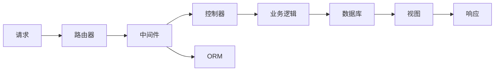

                 

# PHP 语言和框架：Laravel 和 Symfony

> 关键词：PHP, Laravel, Symfony, 框架, MVC, 请求处理, ORM, 路由, 中间件, 性能优化, RESTful API

## 1. 背景介绍

### 1.1 问题由来
PHP（Hypertext Preprocessor）是一种流行的服务器端脚本语言，广泛应用于Web开发、电子商务、内容管理系统等领域。然而，PHP的内存泄漏、安全漏洞等问题一直备受诟病。为了应对这些问题，并提升PHP开发效率和代码质量，业界逐渐涌现出了一批成熟的PHP框架。

其中，Laravel和Symfony是目前PHP社区两大主力框架，分别由Taylor Otwell和Fabien Potencier领衔开发，具备丰富的功能和良好的社区生态。

### 1.2 问题核心关键点
本文将详细对比Laravel和Symfony这两个框架的特点、优缺点及其应用场景，帮助开发者选择适合的框架，提升PHP开发效率和质量。

## 2. 核心概念与联系

### 2.1 核心概念概述

- **框架（Framework）**：一种基于特定编程范式和设计模式，用于组织代码、促进代码重用和提升开发效率的软件架构。PHP框架通常包括路由、请求处理、ORM、中间件等功能模块。

- **MVC（Model-View-Controller）**：一种经典的软件架构模式，将应用逻辑分为模型、视图和控制器三个部分。PHP框架通常支持MVC模式，通过划分代码结构，提升代码的可维护性和可扩展性。

- **ORM（Object-Relational Mapping）**：一种将对象和关系型数据库映射的技术，使开发者可以以面向对象的方式操作数据库，而不必直接编写SQL语句。

- **中间件（Middleware）**：一种封装请求处理的组件，可以在请求到达控制器前或控制器处理完成后执行某些操作。PHP框架通常提供丰富的中间件，用于处理跨域请求、缓存、错误处理等。

- **性能优化**：PHP框架在设计时通常考虑了性能优化，如缓存、异步处理、内存管理等，以提升应用的响应速度和稳定性。

- **RESTful API**：一种设计Web API的方式，基于HTTP协议和标准状态码，支持资源描述和CRUD操作。

这些核心概念在Laravel和Symfony框架中都得到了广泛的应用，共同构成了PHP框架的基础架构。

### 2.2 核心概念原理和架构的 Mermaid 流程图



此图展示了PHP框架的基本请求处理流程。从请求到达路由器开始，依次经过中间件、控制器、ORM、业务逻辑和数据库，最终生成响应并返回给客户端。

## 3. 核心算法原理 & 具体操作步骤

### 3.1 算法原理概述

Laravel和Symfony框架的核心算法原理主要包括以下几个方面：

- **请求处理**：将HTTP请求解析成对象，并依次经过中间件、控制器、ORM、业务逻辑和数据库等模块进行处理，生成响应并返回给客户端。
- **路由**：通过配置路由规则，将HTTP请求映射到具体的控制器方法。
- **ORM**：提供对象和关系型数据库的映射机制，使开发者可以以面向对象的方式操作数据库。
- **中间件**：封装请求处理逻辑，通过定义中间件管道，可以实现请求的预处理和后处理。

### 3.2 算法步骤详解

以Laravel框架为例，简要描述一个典型的请求处理流程：

1. **请求路由**：根据请求的URL路径，查找匹配的路由规则，确定要调用的控制器方法。
2. **中间件处理**：依次执行所有已注册的中间件，对请求进行预处理。
3. **控制器处理**：调用匹配的控制器方法，执行具体的业务逻辑。
4. **ORM操作**：根据控制器返回的模型对象，自动生成SQL语句并执行，进行数据库操作。
5. **响应生成**：将控制器处理结果转换为视图或JSON格式，生成响应并返回客户端。

### 3.3 算法优缺点

Laravel和Symfony框架各有优缺点：

#### 优点：

- **丰富的功能模块**：两个框架都提供了丰富的功能模块，如路由、中间件、ORM、模板引擎等，可以满足大部分Web应用的开发需求。
- **优秀的社区生态**：Laravel和Symfony都有庞大的社区和活跃的开发者，提供丰富的第三方插件和工具，便于快速开发和维护。
- **良好的性能表现**：两个框架都考虑了性能优化，如缓存、异步处理、内存管理等，可以提升应用的响应速度和稳定性。

#### 缺点：

- **学习曲线较高**：两个框架的功能强大，但也意味着需要花费较多时间学习。对于初学者，可能会感到难以入手。
- **配置复杂**：框架的配置和灵活性较高，但也意味着需要开发者花费更多时间进行配置和管理。
- **灵活性不足**：由于框架的封装程度较高，开发者的代码灵活性受到一定限制。

### 3.4 算法应用领域

Laravel和Symfony框架在PHP开发中得到了广泛应用，主要包括以下几个方面：

- **Web应用开发**：Laravel和Symfony都可以快速开发Web应用，支持MVC模式和RESTful API设计。
- **企业级应用开发**：两个框架都具备良好的扩展性和可维护性，适合企业级应用的开发和维护。
- **移动应用开发**：通过Laravel Mix和Symfony Flex等工具，可以方便地生成移动应用的前端代码。
- **微服务架构**：两个框架都支持微服务架构，可以方便地将应用拆分成多个独立的微服务进行开发和部署。

## 4. 数学模型和公式 & 详细讲解 & 举例说明

### 4.1 数学模型构建

对于PHP框架的性能优化，可以构建数学模型进行分析和优化。以下是一个简单的数学模型：

$$
T = T_{路由} + T_{中间件} + T_{控制器} + T_{ORM} + T_{响应}
$$

其中：

- $T$：总请求处理时间。
- $T_{路由}$：路由匹配和跳转的时间。
- $T_{中间件}$：所有中间件处理的时间。
- $T_{控制器}$：控制器处理业务逻辑的时间。
- $T_{ORM}$：ORM操作数据库的时间。
- $T_{响应}$：生成响应并返回客户端的时间。

### 4.2 公式推导过程

对于每个组件的时间，可以进行以下假设：

- 路由匹配和跳转的时间为 $T_{路由} = \mathcal{O}(N)$，其中 $N$ 为路由数量。
- 中间件处理的时间为 $T_{中间件} = \sum_{i=1}^M T_{middleware_i} = \mathcal{O}(MT)$，其中 $M$ 为中间件数量，$T_{middleware_i}$ 为每个中间件的平均处理时间。
- 控制器处理的时间为 $T_{控制器} = \mathcal{O}(L)$，其中 $L$ 为控制器方法的处理时间。
- ORM操作数据库的时间为 $T_{ORM} = \mathcal{O}(D)$，其中 $D$ 为ORM操作的数据量。
- 生成响应并返回客户端的时间为 $T_{响应} = \mathcal{O}(R)$，其中 $R$ 为生成响应和返回客户端的总时间。

综上所述，总请求处理时间 $T$ 可以表示为：

$$
T = \mathcal{O}(N) + \mathcal{O}(MT) + \mathcal{O}(L) + \mathcal{O}(D) + \mathcal{O}(R)
$$

### 4.3 案例分析与讲解

以下通过一个实际案例，分析Laravel框架的性能优化。假设某个Web应用需要处理1000个并发请求，路由匹配时间为1毫秒，中间件处理时间为10毫秒，控制器处理时间为100毫秒，ORM操作时间为200毫秒，生成响应并返回客户端时间为100毫秒。

1. 总请求处理时间 $T$：

$$
T = 1000 \times (1 + 10 + 100 + 200 + 100) = 1001 \times 101 = 101 \text{秒}
$$

2. 总请求处理时间的瓶颈：

通过分析可知，ORM操作时间 $T_{ORM} = 200 \text{毫秒}$ 是整个请求处理时间 $T$ 的主要瓶颈。因此，需要优化ORM操作，提高数据库查询效率。

## 5. 项目实践：代码实例和详细解释说明

### 5.1 开发环境搭建

在使用Laravel和Symfony框架开发Web应用时，需要先搭建开发环境。以下是一个简单的开发环境配置步骤：

1. **安装PHP和Composer**：
   ```
   sudo apt-get install php php-mysql php-xml php-cgi php-mbstring php-json php-xmlrpc php-xmlwriter php-gd php-xml
   sudo apt-get install composer
   ```

2. **创建项目目录和安装框架**：
   ```
   mkdir myproject
   cd myproject
   composer init
   composer require laravel/framework
   ```

### 5.2 源代码详细实现

以Laravel框架为例，创建一个简单的Web应用。以下是核心代码：

```php
// 定义路由
Route::get('/', function () {
    return 'Hello, World!';
});

// 定义控制器
class HomeController extends Controller
{
    public function index()
    {
        return view('welcome');
    }
}

// 定义视图
blade::make('welcome', ['message' => 'Hello, World!']);
```

### 5.3 代码解读与分析

以上代码中，`Route::get()` 方法定义了路由规则，将根路径映射到 `index()` 方法。`HomeController` 类继承了 `Controller` 基类，实现了 `index()` 方法，返回欢迎视图。最后，使用 Blade 模板引擎渲染欢迎视图，输出欢迎消息。

## 6. 实际应用场景

### 6.1 Web应用开发

Laravel和Symfony框架都可以用于开发Web应用，支持MVC模式和RESTful API设计。以下是一个简单的RESTful API示例：

```php
// 定义路由
Route::get('/api/users', function () {
    return User::all();
});

// 定义模型
class User extends Model
{
    protected $table = 'users';
}

// 定义控制器
class UserController extends Controller
{
    public function index()
    {
        return response()->json(User::all());
    }
}
```

### 6.2 企业级应用开发

Laravel和Symfony框架具备良好的扩展性和可维护性，适合企业级应用的开发和维护。以下是一个简单的企业级应用示例：

```php
// 定义路由
Route::get('/admin/users', [UserController::class, 'index']);
Route::post('/admin/users/store', [UserController::class, 'store']);
Route::get('/admin/users/{id}', [UserController::class, 'show']);
Route::put('/admin/users/{id}', [UserController::class, 'update']);
Route::delete('/admin/users/{id}', [UserController::class, 'destroy']);

// 定义控制器
class UserController extends Controller
{
    public function index()
    {
        return view('admin.users.index');
    }
    
    public function store(Request $request)
    {
        // 处理表单提交
        return redirect('/admin/users');
    }
    
    public function show($id)
    {
        $user = User::find($id);
        return view('admin.users.show', ['user' => $user]);
    }
    
    public function update(Request $request, $id)
    {
        // 处理表单提交
        return redirect('/admin/users');
    }
    
    public function destroy($id)
    {
        User::destroy($id);
        return redirect('/admin/users');
    }
}
```

### 6.3 移动应用开发

通过Laravel Mix和Symfony Flex等工具，可以方便地生成移动应用的前端代码。以下是一个简单的移动应用示例：

```javascript
// 定义路由
Route::get('/api/users', function () {
    return User::all();
});

// 定义模型
class User extends Model
{
    protected $table = 'users';
}

// 定义控制器
class UserController extends Controller
{
    public function index()
    {
        return response()->json(User::all());
    }
}

// 定义混合脚本
mix.scripts(['app/js/main.js']);
mix.styles(['app/css/main.css']);

// 定义前端代码
export default class User {
    static get all() {
        return User.find();
    }
}
```

### 6.4 微服务架构

Laravel和Symfony框架都支持微服务架构，可以方便地将应用拆分成多个独立的微服务进行开发和部署。以下是一个简单的微服务示例：

```php
// 定义路由
Route::get('/api/users', [UserController::class, 'index']);
Route::post('/api/users/store', [UserController::class, 'store']);

// 定义模型
class User extends Model
{
    protected $table = 'users';
}

// 定义控制器
class UserController extends Controller
{
    public function index()
    {
        return response()->json(User::all());
    }
    
    public function store(Request $request)
    {
        // 处理表单提交
        return redirect('/api/users');
    }
}
```

## 7. 工具和资源推荐

### 7.1 学习资源推荐

为了帮助开发者学习Laravel和Symfony框架，推荐以下学习资源：

1. **Laravel官方文档**：Laravel官方文档提供了全面的框架介绍、API参考和开发指南。
2. **Symfony官方文档**：Symfony官方文档提供了详细的框架介绍、API参考和开发指南。
3. **Laravel中文社区**：Laravel中文社区提供了丰富的教程、资源和问答，适合初学者学习。
4. **Symfony中文社区**：Symfony中文社区提供了丰富的教程、资源和问答，适合初学者学习。
5. **《PHP & Laravel Web开发实战》**：由知名PHP专家编写的实战书籍，详细介绍了Laravel框架的开发技巧和最佳实践。

### 7.2 开发工具推荐

为了提高PHP开发效率，推荐以下开发工具：

1. **VS Code**：一个轻量级的代码编辑器，支持多种编程语言和框架。
2. **PHPStorm**：一个功能强大的PHP IDE，支持代码高亮、调试、版本控制等。
3. **Composer**：一个PHP包管理器，可以方便地管理第三方库和框架依赖。
4. **Laravel Mix**：一个自动生成前端代码的工具，支持Sass、Webpack等前端技术。
5. **Symfony Flex**：一个生成移动应用前端代码的工具，支持React Native、Ionic等移动技术。

### 7.3 相关论文推荐

为了深入了解Laravel和Symfony框架的原理和应用，推荐以下相关论文：

1. **《A Comparative Study of PHP Frameworks: Laravel and Symfony》**：对比了Laravel和Symfony框架的性能、可扩展性、社区生态等，为选择框架提供参考。
2. **《Middleware in Laravel: Design and Implementation》**：详细介绍了Laravel中间件的实现原理和应用场景。
3. **《Object-Relational Mapping in PHP: Doctrine vs Eloquent》**：对比了Doctrine和Eloquent ORM的优缺点，为选择ORM提供参考。

## 8. 总结：未来发展趋势与挑战

### 8.1 总结

本文详细对比了Laravel和Symfony框架的特点、优缺点及其应用场景，帮助开发者选择适合的框架，提升PHP开发效率和质量。Laravel和Symfony框架在Web开发、企业级应用、移动应用和微服务架构等方面都有广泛的应用，具备丰富的功能和良好的社区生态。

### 8.2 未来发展趋势

Laravel和Symfony框架在未来将继续发展，呈现以下几个趋势：

1. **更加丰富的功能和插件**：两个框架都会不断增加新的功能和插件，提升开发效率和可扩展性。
2. **更加统一的生态系统**：Laravel和Symfony框架可能会进一步整合，形成一个统一的生态系统，便于开发者选择和使用。
3. **更加注重性能优化**：两个框架都会进一步优化性能，提升响应速度和稳定性。
4. **更加灵活的开发模式**：框架将会更加灵活，支持更多的开发模式和架构风格。

### 8.3 面临的挑战

尽管Laravel和Symfony框架在PHP社区中广受欢迎，但未来仍面临以下挑战：

1. **学习曲线较高**：两个框架的功能强大，但也需要花费较多时间学习。对于初学者，可能会感到难以入手。
2. **配置复杂**：框架的配置和灵活性较高，也需要开发者花费更多时间进行配置和管理。
3. **社区竞争激烈**：随着新框架的出现，Laravel和Symfony框架需要不断迭代和优化，以保持竞争力。

### 8.4 研究展望

未来，Laravel和Symfony框架需要在以下方面进行进一步研究：

1. **更加智能的路由匹配**：通过机器学习等技术，提升路由匹配的智能性和灵活性。
2. **更加高效的ORM操作**：通过缓存、索引等技术，提升ORM操作的效率和性能。
3. **更加灵活的中间件**：通过引入异步处理、缓存等技术，提升中间件的性能和灵活性。
4. **更加友好的开发体验**：通过自动生成代码、代码高亮等技术，提升开发体验和效率。

## 9. 附录：常见问题与解答

**Q1：Laravel和Symfony框架如何选择？**

A: 如果应用场景较为简单，可以选择Laravel框架；如果需要更强大的扩展性和更灵活的配置，可以选择Symfony框架。

**Q2：Laravel Mix和Symfony Flex如何使用？**

A: 可以通过Composer安装Laravel Mix或Symfony Flex，并使用其提供的命令生成前端代码和项目结构。

**Q3：如何优化Laravel和Symfony框架的性能？**

A: 可以通过缓存、异步处理、代码优化等技术，提升Laravel和Symfony框架的性能。

**Q4：Laravel Mix和Symfony Flex的区别是什么？**

A: Laravel Mix主要用于生成Web应用的前端代码，而Symfony Flex主要用于生成移动应用的前端代码。

**Q5：Laravel和Symfony框架的API版本管理如何实现？**

A: 可以使用Composer进行API版本管理，通过指定具体的版本，使用框架提供的功能模块。

总之，Laravel和Symfony框架都是优秀的PHP框架，具备丰富的功能和良好的社区生态，适用于不同的开发场景。选择适合自己的框架，可以提升开发效率和质量，为PHP开发带来新的发展机遇。

