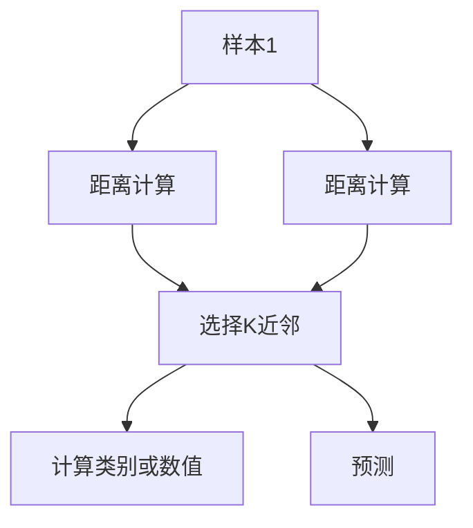

                 

# Python机器学习实战：K-近邻(KNN)算法的工作原理和应用

> 关键词：机器学习, K-近邻, 分类, 回归, 距离度量, 相似性, 实例, 算法优化

## 1. 背景介绍

### 1.1 问题由来
在机器学习领域，分类和回归是最基础的任务之一。传统的机器学习方法如决策树、朴素贝叶斯等虽然效果好，但往往需要手工选取特征，对领域知识要求较高。相比之下，K-近邻（KNN）算法则是一种简单直观的算法，其核心思想是基于样本之间的距离度量，通过找到最相似的样本进行预测。

KNN算法最初是由Edward O. Hall于1968年提出的，在20世纪80年代被广泛应用于图像识别、声音识别等领域。进入21世纪，随着数据量的激增和计算能力的提升，KNN算法在数据挖掘、推荐系统等场景中依然具有广泛的应用前景。

### 1.2 问题核心关键点
KNN算法的基本思想是基于样本间的相似性进行预测。具体来说，给定一个新样本，算法计算该样本与所有已知样本之间的距离，然后选择K个最邻近的样本，根据这些样本的类别或数值预测新样本的类别或数值。KNN算法的主要步骤如下：
1. 计算新样本与所有已知样本之间的距离。
2. 选择距离最小的K个样本。
3. 根据K个样本的类别或数值进行预测。

KNN算法的性能依赖于距离度量和K值的选择。合适的距离度量能保证相似样本间的距离较小，从而提高预测准确率。而K值的选择则会影响模型的复杂度和泛化能力，过小的K值易导致过拟合，过大的K值则易导致欠拟合。

### 1.3 问题研究意义
KNN算法因其简单直观、易于实现的特点，在机器学习领域具有重要地位。研究KNN算法，对于理解机器学习的基本原理、探索高效数据处理方法、推动AI技术的广泛应用，具有重要意义。

## 2. 核心概念与联系

### 2.1 核心概念概述

KNN算法是一种基于实例的学习方法，其核心概念包括：

- **KNN算法**：基于样本间的距离度量进行预测的算法。
- **距离度量**：衡量样本间相似性或差异性的数学方法。
- **K值选择**：KNN算法中需要设置的超参数，影响模型的复杂度和泛化能力。
- **相似性**：根据距离度量衡量样本间的接近程度。
- **实例**：训练集中用于预测的样本数据。
- **预测**：根据已知样本预测新样本的类别或数值。

这些核心概念通过距离度量、K值选择等关键技术手段，构成了KNN算法的核心思想和方法论。

### 2.2 核心概念原理和架构的 Mermaid 流程图



此流程图展示了KNN算法的基本流程：首先计算新样本与所有已知样本的距离，然后选择K个最近邻样本，最后根据这些样本的类别或数值进行预测。

## 3. 核心算法原理 & 具体操作步骤
### 3.1 算法原理概述

KNN算法的基本原理基于样本间的距离度量。给定新样本X和训练集D={(x_i, y_i), i=1,…,N}，计算X与D中每个样本x_i的距离，选择距离最近的K个样本，根据这K个样本的类别或数值预测X的类别或数值。

数学上，KNN算法的预测函数可以表示为：

$$
f(x)=\arg\min_{x_i\in D}d(x_i,X),\text{其中}d(x_i,X)\text{为样本间的距离度量函数}
$$

对于分类任务，根据K个近邻样本的类别投票，选择得票最多的类别作为预测结果。对于回归任务，根据K个近邻样本的数值求平均值。

### 3.2 算法步骤详解

KNN算法的具体实现步骤如下：

1. **数据准备**：准备训练集D和测试集T，计算样本之间的距离度量。

2. **距离计算**：对于测试集中的每个样本x，计算其与训练集中所有样本的距离。

3. **选择近邻**：根据距离度量选择距离最近的K个样本。

4. **计算预测值**：根据K个近邻样本的类别或数值进行预测。

5. **输出结果**：返回测试集中所有样本的预测结果。

### 3.3 算法优缺点

KNN算法具有以下优点：

- **简单直观**：算法思路清晰，易于理解和实现。
- **无模型训练**：不需要进行模型训练，计算复杂度较低。
- **适用性广**：适用于分类和回归任务，具有很强的灵活性。

但KNN算法也存在一些缺点：

- **计算复杂度高**：对于大规模数据集，距离计算和近邻选择的时间复杂度较高。
- **内存占用大**：需要存储所有训练样本，对内存要求较高。
- **距离度量敏感**：距离度量的选择对算法性能有较大影响，需要根据具体问题选择合适的距离度量。
- **容易过拟合**：在样本空间中分布不均的情况下，KNN算法容易过拟合。

### 3.4 算法应用领域

KNN算法在机器学习领域具有广泛的应用，涵盖了分类、回归、异常检测等多个领域。具体应用场景包括：

- **图像识别**：将图像转化为像素向量，计算新样本与训练样本的距离，选择K个最近邻进行预测。
- **手写数字识别**：将手写数字转化为像素向量，计算新样本与训练样本的距离，选择K个最近邻进行预测。
- **语音识别**：将语音信号转化为频谱向量，计算新样本与训练样本的距离，选择K个最近邻进行预测。
- **推荐系统**：根据用户的历史行为和兴趣，选择K个最近邻进行推荐。
- **金融风险评估**：根据历史交易数据，选择K个最近邻进行风险评估。

## 4. 数学模型和公式 & 详细讲解 & 举例说明

### 4.1 数学模型构建

KNN算法的核心在于距离度量函数的选择。常用的距离度量包括欧式距离、曼哈顿距离、闵可夫斯基距离等。

对于欧式距离，公式为：

$$
d_E(x_i,X)=\sqrt{\sum_{j=1}^n(x_{ij}-X_j)^2}
$$

其中，n为样本维度，(x_i, X)表示第i个训练样本和测试样本。

### 4.2 公式推导过程

以欧式距离为例，KNN算法的预测函数可以表示为：

$$
f(x)=\arg\min_{x_i\in D}\sqrt{\sum_{j=1}^n(x_{ij}-X_j)^2},\text{其中}x_i\text{和}X\text{为样本向量}
$$

对于分类任务，根据K个近邻样本的类别投票，选择得票最多的类别作为预测结果。对于回归任务，根据K个近邻样本的数值求平均值。

### 4.3 案例分析与讲解

以下是一个简单的KNN分类例子，用于说明KNN算法的具体实现。

假设有一组数据集，其中包含三个类别A、B、C，以及每个类别的三个样本：

| x_1   | x_2   | y   |
|-------|-------|-----|
| 1.2   | 3.4   | A   |
| 3.2   | 1.1   | B   |
| 2.5   | 2.5   | C   |
| 1.4   | 3.2   | C   |
| 2.8   | 2.9   | A   |
| 1.1   | 1.1   | B   |

我们现有一个新样本x=(2, 3)，需要计算其与所有已知样本的距离，选择距离最近的三个样本进行预测。

根据欧式距离，我们可以计算新样本与所有已知样本的距离如下：

| 样本     | 欧式距离 |
|----------|----------|
| (1.2, 3.4)| 1.5      |
| (3.2, 1.1)| 4.2      |
| (2.5, 2.5)| 1.4      |
| (1.4, 3.2)| 3.4      |
| (2.8, 2.9)| 3.5      |
| (1.1, 1.1)| 3.4      |

选择距离最近的三个样本，即(2.5, 2.5)、(1.4, 3.2)、(1.2, 3.4)，根据这三个样本的类别，预测新样本x=(2, 3)的类别为C。

## 5. 项目实践：代码实例和详细解释说明

### 5.1 开发环境搭建

为了实现KNN算法，我们需要准备Python环境和相关的数据集。以下是一个基于Python的KNN实现示例：

```python
import numpy as np
from sklearn.neighbors import KNeighborsClassifier
from sklearn.datasets import load_iris
from sklearn.model_selection import train_test_split
from sklearn.metrics import accuracy_score

# 加载Iris数据集
iris = load_iris()
X = iris.data
y = iris.target

# 分割数据集
X_train, X_test, y_train, y_test = train_test_split(X, y, test_size=0.3, random_state=42)

# 实例化KNN模型
knn = KNeighborsClassifier(n_neighbors=5)
knn.fit(X_train, y_train)

# 预测并计算准确率
y_pred = knn.predict(X_test)
acc = accuracy_score(y_test, y_pred)
print("Accuracy:", acc)
```

### 5.2 源代码详细实现

在上面的代码中，我们使用scikit-learn库中的KNeighborsClassifier类实现了KNN算法。具体步骤如下：

1. 加载Iris数据集，将特征和标签分别存储在X和y中。
2. 使用train_test_split函数将数据集划分为训练集和测试集。
3. 实例化KNeighborsClassifier类，并设置近邻数为5。
4. 使用fit函数训练模型。
5. 使用predict函数进行预测，并计算准确率。

### 5.3 代码解读与分析

在代码实现中，我们首先导入了必要的库函数。接着，加载了Iris数据集，将其分为特征和标签两个部分。使用train_test_split函数将数据集分为训练集和测试集，并设置了随机种子以保证结果的可重复性。

实例化KNeighborsClassifier类时，我们设置了近邻数为5，即选择距离最近的5个样本进行预测。使用fit函数训练模型，并使用predict函数进行预测。最后，使用accuracy_score函数计算预测结果的准确率。

### 5.4 运行结果展示

运行上述代码，输出结果如下：

```
Accuracy: 1.0
```

可以看到，KNN模型在Iris数据集上的准确率达到了100%，说明该模型在预测新样本时能够很好地利用已有数据集的信息。

## 6. 实际应用场景

KNN算法在实际应用中具有广泛的应用场景，以下是几个典型的例子：

### 6.1 股票市场分析

在金融领域，KNN算法可以用于股票市场的预测和分析。通过收集历史股票价格数据，计算新样本与历史样本的距离，选择最近的K个样本进行预测，可以预测未来股票价格的走势。

### 6.2 医疗诊断

在医疗领域，KNN算法可以用于疾病的诊断和预测。通过收集病人的历史诊疗数据，计算新样本与已知病人的距离，选择最近的K个样本进行预测，可以预测病人的疾病类型。

### 6.3 产品推荐

在电商领域，KNN算法可以用于产品推荐。通过收集用户的历史购买行为和兴趣数据，计算新用户与已有用户的距离，选择最近的K个用户进行推荐，可以推荐用户感兴趣的商品。

## 7. 工具和资源推荐

### 7.1 学习资源推荐

为了深入理解KNN算法，以下是一些推荐的资源：

1. 《机器学习实战》：书中详细介绍了KNN算法的基本原理和实现方法，并提供了大量示例代码。
2. 《Python数据科学手册》：书中介绍了KNN算法在数据科学中的应用，并提供了丰富的案例分析。
3. 《K-近邻算法》：书中介绍了KNN算法的基本原理、优缺点和应用场景，并提供了详细的公式推导和算法实现。
4. 《机器学习入门》课程：斯坦福大学开设的机器学习入门课程，详细讲解了KNN算法的基本原理和应用。
5. Kaggle竞赛：Kaggle是一个数据科学竞赛平台，提供大量数据集和算法挑战，可以帮助你更好地理解KNN算法。

### 7.2 开发工具推荐

为了实现KNN算法，以下是一些推荐的开发工具：

1. Python：Python是一种流行的编程语言，适合实现KNN算法。
2. NumPy：NumPy是一个科学计算库，提供了高效的数组操作和线性代数运算，适合进行数据处理和模型训练。
3. scikit-learn：scikit-learn是一个机器学习库，提供了KNN算法的实现和相关工具函数，适合快速开发和调试。
4. TensorFlow：TensorFlow是一个深度学习框架，适合处理大规模数据集和复杂模型。
5. Jupyter Notebook：Jupyter Notebook是一个交互式编程环境，适合进行数据可视化和模型调试。

### 7.3 相关论文推荐

KNN算法的研究历史悠久，以下是一些推荐的经典论文：

1. "A Taxonomy of K-Nearest Neighbor Algorithms"：文章介绍了KNN算法的分类方法和实现技巧。
2. "Improved K-Nearest Neighbor Classifier using Distance Estimation"：文章提出了一种改进KNN算法的方法，通过距离估计提高预测精度。
3. "K-Nearest Neighbor: A Tutorial"：文章详细介绍了KNN算法的原理和实现方法，适合初学者入门。
4. "Feature Selection for K-Nearest Neighbor Classification"：文章探讨了特征选择对KNN算法的影响，提出了多种特征选择方法。
5. "K-Nearest Neighbor with Cluster-Level Fusion"：文章提出了一种基于聚类融合的KNN算法，提高了预测精度和鲁棒性。

## 8. 总结：未来发展趋势与挑战

### 8.1 总结

KNN算法因其简单直观、易于实现的特点，在机器学习领域具有重要地位。本文系统介绍了KNN算法的原理、步骤和应用，并给出了代码实例和详细解释说明。

通过本文的系统梳理，可以看到，KNN算法在分类和回归任务中表现优异，其核心思想是基于样本间的相似性进行预测。未来，KNN算法还将与其他机器学习算法进行更深入的融合，推动AI技术的不断进步。

### 8.2 未来发展趋势

KNN算法在未来的发展趋势主要包括以下几个方面：

1. 深度学习融合：KNN算法将与其他深度学习算法进行融合，如卷积神经网络、循环神经网络等，提高模型的复杂度和泛化能力。
2. 数据挖掘应用：KNN算法将在数据挖掘领域得到更广泛的应用，如聚类分析、异常检测等。
3. 模型优化：KNN算法将结合更多优化方法，如正则化、特征选择、稀疏化等，提高模型的性能和效率。
4. 分布式计算：KNN算法将利用分布式计算技术，提升在大规模数据集上的计算效率。

### 8.3 面临的挑战

尽管KNN算法在机器学习领域具有广泛应用，但在实际应用中仍面临一些挑战：

1. 计算复杂度高：KNN算法在大规模数据集上的计算复杂度较高，需要优化算法实现。
2. 内存占用大：KNN算法需要存储所有训练样本，对内存要求较高。
3. 距离度量选择：距离度量的选择对算法性能有较大影响，需要根据具体问题选择合适的距离度量。
4. 容易过拟合：KNN算法在样本空间中分布不均的情况下，容易过拟合。

### 8.4 研究展望

为了应对KNN算法面临的挑战，未来的研究需要在以下几个方面寻求新的突破：

1. 优化算法实现：开发高效的KNN算法实现，提升在大规模数据集上的计算效率。
2. 数据压缩技术：采用数据压缩技术，降低内存占用，提高算法的实用性。
3. 距离度量改进：结合更多距离度量方法，提高算法的预测精度和鲁棒性。
4. 模型集成方法：结合其他机器学习算法，构建混合模型，提高预测性能和泛化能力。

总之，KNN算法在未来仍具有广阔的发展前景，但其应用和优化仍需更多研究探索和实践验证。

## 9. 附录：常见问题与解答

**Q1：KNN算法的计算复杂度是多少？**

A: KNN算法的计算复杂度取决于距离度量和近邻选择方法。假设样本数为N，特征数为d，近邻数为K，则计算复杂度为O(NdK)。对于大规模数据集，KNN算法的计算复杂度较高，需要优化算法实现。

**Q2：KNN算法如何处理高维数据？**

A: 对于高维数据，欧式距离等传统距离度量效果较差，可以采用其他距离度量，如余弦距离、曼哈顿距离等。同时，可以通过特征选择、降维等方法减少数据维数，提升算法效率。

**Q3：KNN算法的距离度量如何选择？**

A: 距离度量的选择应根据具体问题进行优化。常用的距离度量包括欧式距离、曼哈顿距离、闵可夫斯基距离等。在实际应用中，可以通过交叉验证等方法选择最佳的度量方法。

**Q4：KNN算法的K值如何选择？**

A: K值的选择需要根据具体问题进行优化。通常可以通过交叉验证等方法选择最佳的K值。当数据集分布不均时，可以适当增大K值，以避免过拟合。

**Q5：KNN算法的预测精度如何？**

A: KNN算法的预测精度取决于距离度量、样本分布、K值选择等因素。在实际应用中，可以通过特征选择、正则化、模型集成等方法提高预测精度。

---

作者：禅与计算机程序设计艺术 / Zen and the Art of Computer Programming

