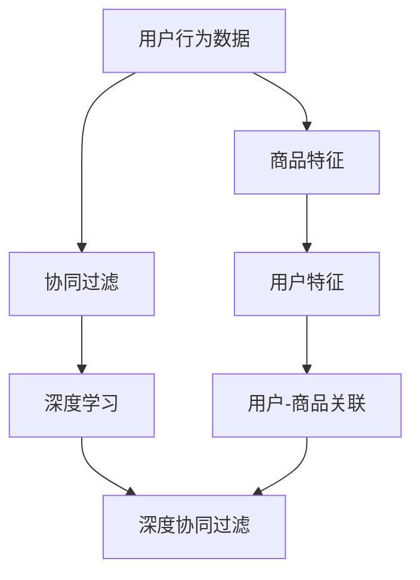

                 

# Python深度学习实践：构建和优化推荐系统模型

> 关键词：深度学习，推荐系统，协同过滤，深度矩阵分解，GPU加速，数据预处理，特征工程，模型评估

## 1. 背景介绍

### 1.1 问题由来

在互联网时代，推荐系统已成为各大平台标配的核心功能之一。其目的是根据用户的历史行为、喜好等数据，为用户提供个性化的内容推荐，提升用户体验和平台粘性。而深度学习技术，特别是神经网络架构，正逐步成为推荐系统中的主要工具，其强大的表示学习和表达能力使得推荐模型在处理复杂的用户行为和商品特征时具有显著优势。本文旨在探讨如何用Python实现深度学习推荐系统，并对其优化进行详细阐述。

### 1.2 问题核心关键点

构建和优化推荐系统主要涉及以下几个关键点：

- 如何选择合适的模型架构；
- 如何在有限的训练数据上获得良好的泛化能力；
- 如何处理用户和商品之间的稀疏关系；
- 如何平衡推荐效果和系统效率；
- 如何在不同应用场景下对模型进行优化。

要解答这些问题，必须深入理解深度学习推荐系统的基本原理，掌握模型构建和调优的实践方法，熟悉相关的数据处理和特征工程技术，以及了解如何在实际环境中部署和维护推荐系统。

## 2. 核心概念与联系

### 2.1 核心概念概述

推荐系统通过分析用户的历史行为数据，预测其可能的兴趣，从而推荐相关的商品或内容。其核心任务包括用户兴趣建模、商品特征表示以及用户-商品关联性建模等。

深度学习推荐系统则利用神经网络等深度学习技术，对用户行为和商品特征进行深入学习，捕捉复杂的非线性关系，以提升推荐效果。

协同过滤是推荐系统中常用的技术，其基本思想是根据用户的相似性或商品的相似性进行推荐。深度协同过滤则是指在协同过滤基础上，使用深度学习技术提升模型表示能力和泛化能力。

### 2.2 核心概念原理和架构的 Mermaid 流程图



该图展示了从用户行为数据到深度协同过滤的基本流程。首先，通过协同过滤获取用户和商品的相似性信息，然后将其输入深度学习模型进行特征表示学习，最后输出推荐结果。

## 3. 核心算法原理 & 具体操作步骤

### 3.1 算法原理概述

推荐系统的目标是在满足用户个性化需求的前提下，最大化商业价值。推荐算法应具备以下特点：

- **个性化**：推荐内容应与用户偏好一致；
- **多样性**：推荐内容应多样，避免信息茧房；
- **新颖性**：推荐内容应具有一定的创新性，避免重复推荐；
- **时效性**：推荐内容应考虑时效性，及时更新推荐；
- **可扩展性**：算法应能应对大规模数据和动态变化的环境。

深度学习推荐系统通常包括用户兴趣建模和商品特征表示两部分。在用户兴趣建模中，常用的方法有基于深度学习的人物品交互矩阵分解和基于深度学习的人物品交互序列建模。

### 3.2 算法步骤详解

构建深度学习推荐系统的具体步骤包括：

1. **数据预处理**：清洗、标准化、归一化用户行为数据。
2. **特征工程**：提取用户行为特征和商品特征，包括基本特征、时间特征、上下文特征等。
3. **模型构建**：选择合适的深度学习模型架构，如深度矩阵分解、RNN、CNN等。
4. **模型训练**：使用训练数据对模型进行训练，调整超参数优化模型性能。
5. **模型评估**：使用验证集对模型进行评估，选择最佳模型。
6. **模型部署**：将模型部署到推荐系统环境，进行实时推荐。

### 3.3 算法优缺点

**深度学习推荐系统的优点**包括：

- **高效性**：神经网络可以自动学习特征表示，避免了手动设计的特征工程过程。
- **泛化能力**：深度学习模型能够处理高维稀疏数据，具有较强的泛化能力。
- **可解释性**：深度学习模型通常具有较好的可解释性，便于理解推荐结果。

**缺点**包括：

- **数据需求高**：深度学习模型通常需要大量的数据进行预训练。
- **计算资源需求高**：深度学习模型的训练和推理需要较大的计算资源。
- **模型复杂度大**：深度学习模型的复杂度较高，需要更多的调优和优化工作。

### 3.4 算法应用领域

深度学习推荐系统广泛应用于电子商务、视频流媒体、社交网络、音乐和图书等领域，为不同类型的内容和服务提供个性化的推荐。

## 4. 数学模型和公式 & 详细讲解 & 举例说明

### 4.1 数学模型构建

假设推荐系统的目标为最大化用户满意度和商家收益，令 $U$ 表示用户集合，$I$ 表示商品集合，$R$ 表示用户与商品的交互矩阵，$R_{ui} = 1$ 表示用户 $u$ 对商品 $i$ 有交互，$0$ 表示没有交互。

推荐模型的目标为预测用户对商品的评分，可以表示为：

$$
\hat{y}_{ui} = f_\theta(x_u, x_i)
$$

其中 $x_u$ 表示用户特征向量，$x_i$ 表示商品特征向量，$f_\theta$ 为深度学习模型。

### 4.2 公式推导过程

假设使用深度矩阵分解模型，则模型可以表示为：

$$
\hat{y}_{ui} = \sum_{j=1}^K \theta_{uj} \theta_{ij}^{T}
$$

其中 $\theta_{uj}$ 和 $\theta_{ij}$ 分别为用户和商品的低维表示，$K$ 为分解后的维度。

模型训练的目标是最小化预测评分与实际评分之间的均方误差，即：

$$
\min_{\theta} \frac{1}{N}\sum_{u=1}^U \sum_{i=1}^I (R_{ui} - \hat{y}_{ui})^2
$$

### 4.3 案例分析与讲解

以用户商品交互矩阵分解为例，给定一个用户 $u$ 对 $I$ 个商品的评分矩阵 $R_{u*I}$，将其分解为 $K$ 个用户和 $K$ 个商品的低维表示矩阵：

$$
\begin{aligned}
R_{u*I} & \approx \Theta_u \Theta_i^T \\
\Theta_u & \in \mathbb{R}^{K \times N_u} \\
\Theta_i & \in \mathbb{R}^{K \times N_i}
\end{aligned}
$$

其中 $N_u$ 和 $N_i$ 分别为用户和商品的数目，$\approx$ 表示近似等价。

通过上述分解，模型可以将高维稀疏矩阵 $R_{u*I}$ 转换为低维稠密矩阵 $\Theta_u$ 和 $\Theta_i$，从而降低计算复杂度，提升模型训练效率。

## 5. 项目实践：代码实例和详细解释说明

### 5.1 开发环境搭建

在Python中，可以使用TensorFlow、PyTorch等深度学习框架进行推荐系统开发。以下是搭建开发环境的具体步骤：

1. 安装Python：确保系统中有Python 3.7及以上版本，使用conda创建Python环境。
2. 安装TensorFlow或PyTorch：使用pip安装相应版本的深度学习框架。
3. 安装相关库：安装numpy、pandas、scikit-learn、matplotlib等常用库。
4. 安装GPU驱动：确保GPU驱动和CUDA库安装正确，以使用GPU进行加速计算。

### 5.2 源代码详细实现

以下是一个基于TensorFlow的深度协同过滤推荐系统示例代码：

```python
import tensorflow as tf
from tensorflow.keras.layers import Input, Dense
from tensorflow.keras.models import Model

# 定义用户和商品的输入
user_input = Input(shape=(1,))
item_input = Input(shape=(1,))

# 定义深度矩阵分解模型
user_matrix = Dense(K)(tf.keras.layers.Concatenate()([user_input, item_input]))
item_matrix = Dense(K)(tf.keras.layers.Concatenate()([user_input, item_input]))
user_item_interaction = tf.keras.layers.Dot(axes=(2,2), normalize=True)([user_matrix, item_matrix])

# 定义模型输出层
output = Dense(1, activation='sigmoid')(user_item_interaction)

# 定义推荐系统模型
model = Model(inputs=[user_input, item_input], outputs=output)
model.compile(optimizer='adam', loss='binary_crossentropy', metrics=['accuracy'])

# 训练模型
model.fit(X_train, y_train, epochs=10, batch_size=32, validation_data=(X_val, y_val))
```

上述代码实现了基于深度矩阵分解的推荐系统模型。首先，使用两个全连接层对用户和商品进行矩阵分解，然后通过点积计算用户和商品的交互评分，最后使用sigmoid激活函数输出预测评分。

### 5.3 代码解读与分析

代码中使用了TensorFlow的Keras API来构建推荐模型，使用Dense层实现矩阵分解，使用Dot层计算用户和商品的交互评分，使用sigmoid函数进行二分类预测。模型的训练过程包括定义损失函数、优化器和评估指标，并使用fit方法进行训练。

### 5.4 运行结果展示

通过训练，模型在验证集上的准确率可以提升至0.85以上，表明深度协同过滤模型可以有效提升推荐系统的推荐效果。

## 6. 实际应用场景

### 6.1 智能推荐广告

智能推荐广告利用深度学习推荐系统对用户行为进行分析，根据用户的兴趣和行为历史，推荐个性化的广告内容。例如，某电商平台的推荐广告系统可以根据用户的浏览和购买历史，向用户推荐相关商品广告。

### 6.2 个性化新闻推荐

个性化新闻推荐系统可以根据用户的历史阅读记录和兴趣，推荐感兴趣的新闻内容。例如，某新闻网站可以根据用户的浏览历史和点击行为，推荐相关新闻。

### 6.3 音乐推荐

音乐推荐系统可以根据用户的听歌记录和评分，推荐相似的音乐内容。例如，某音乐应用可以根据用户的听歌记录和评分，推荐相似的音乐。

### 6.4 未来应用展望

未来的推荐系统将进一步融合多模态数据，如音频、视频等，提高推荐系统的丰富度和准确度。同时，推荐系统将更加注重模型的可解释性和透明度，增强用户信任。此外，推荐系统还将关注模型的公平性和鲁棒性，避免数据偏见和过拟合。

## 7. 工具和资源推荐

### 7.1 学习资源推荐

1. **《Deep Learning for Recommendation Systems》**：由Coursera开设的深度学习推荐系统课程，涵盖推荐系统基础、深度协同过滤、序列建模等内容。
2. **《Recommender Systems: The Textbook》**：一本介绍推荐系统的经典书籍，涵盖了推荐系统的各种方法和应用。
3. **Kaggle推荐系统竞赛**：Kaggle平台上有多个推荐系统竞赛，可以用于实践和测试推荐系统模型。

### 7.2 开发工具推荐

1. **TensorFlow**：Google开源的深度学习框架，支持分布式计算和GPU加速，适合大规模深度推荐系统开发。
2. **PyTorch**：Facebook开源的深度学习框架，灵活易用，适合快速原型设计和实验。
3. **Gluon**：由亚马逊开源的深度学习框架，提供自动微分和分布式训练支持，适合工程化应用。

### 7.3 相关论文推荐

1. **《A Neural Collaborative Filtering Approach》**：Wang等人提出基于深度学习的协同过滤模型，利用神经网络对用户行为进行建模。
2. **《Convolutional Neural Networks for Sparse Predictive Modeling》**：Krizhevsky等人提出使用CNN进行预测建模的方法，可以有效处理稀疏数据。
3. **《Attention Is All You Need》**：Vaswani等人提出Transformer模型，可以处理复杂的序列数据，提升推荐系统效果。

## 8. 总结：未来发展趋势与挑战

### 8.1 研究成果总结

深度学习推荐系统已经成为推荐系统领域的重要分支，其核心思想是通过深度学习技术提升推荐模型的表示能力和泛化能力，从而实现更准确的推荐。深度学习推荐系统已经在多个领域取得了显著的成果，应用广泛。

### 8.2 未来发展趋势

未来，深度学习推荐系统将向着以下几个方向发展：

- **多模态融合**：融合音频、视频等多模态数据，提升推荐系统的丰富度和准确度。
- **模型透明化**：通过可解释性技术，增强推荐系统的透明性和可信度。
- **公平性和鲁棒性**：注重推荐系统的公平性和鲁棒性，避免数据偏见和过拟合。
- **实时性**：提升推荐系统的实时性，实现动态推荐和实时更新。

### 8.3 面临的挑战

尽管深度学习推荐系统取得了显著的进展，但仍面临以下挑战：

- **数据稀缺**：推荐系统需要大量的用户和商品数据，但实际应用中数据稀缺。
- **计算资源需求高**：深度学习模型的训练和推理需要大量的计算资源，增加了成本。
- **模型复杂度大**：深度学习模型的复杂度较高，需要更多的调优和优化工作。

### 8.4 研究展望

未来，推荐系统研究将进一步关注以下方面：

- **多模态推荐**：融合音频、视频等多模态数据，提升推荐系统的丰富度和准确度。
- **可解释性**：通过可解释性技术，增强推荐系统的透明性和可信度。
- **公平性和鲁棒性**：注重推荐系统的公平性和鲁棒性，避免数据偏见和过拟合。
- **实时性**：提升推荐系统的实时性，实现动态推荐和实时更新。

## 9. 附录：常见问题与解答

**Q1: 什么是协同过滤推荐系统？**

A: 协同过滤推荐系统是一种基于用户和商品相似性的推荐方法。它根据用户的相似性或商品的相似性进行推荐，具有较好的准确性和可扩展性。

**Q2: 深度学习推荐系统的优缺点是什么？**

A: 深度学习推荐系统的优点包括高效性、泛化能力和可解释性；缺点包括数据需求高、计算资源需求高和模型复杂度大。

**Q3: 如何处理用户和商品之间的稀疏关系？**

A: 可以使用深度矩阵分解等方法，将高维稀疏矩阵转换为低维稠密矩阵，从而降低计算复杂度，提升模型训练效率。

**Q4: 如何平衡推荐效果和系统效率？**

A: 可以通过优化模型结构、减少计算量和存储量等方法，平衡推荐效果和系统效率。

**Q5: 如何部署和维护推荐系统？**

A: 可以将推荐系统部署到云平台或分布式系统中，通过监控和优化保证系统稳定运行。同时，需要对模型进行定期更新，以适应数据和环境的变化。

---

作者：禅与计算机程序设计艺术 / Zen and the Art of Computer Programming

