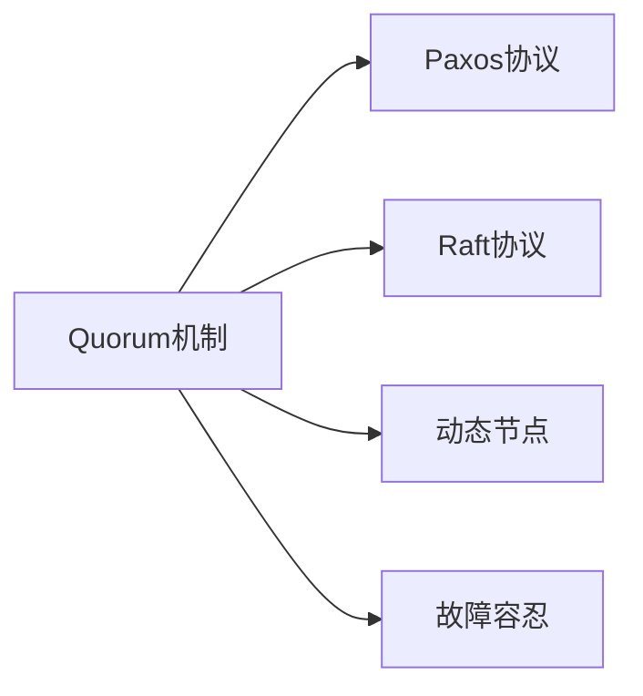

                 

# Quorum机制在集群中的应用

> 关键词：Quorum机制, 集群, 分布式共识, 故障容忍, Paxos协议, Raft协议

## 1. 背景介绍

在分布式系统中，多个节点协同工作以达成一致的决策或状态是一个常见的问题。这通常涉及到一个共识协议，即所有节点必须就某个状态达成一致，才能继续执行下一步操作。Quorum机制，作为一种分布式共识协议，旨在解决这个普遍存在的问题。它在保证一致性、故障容忍性的同时，还要保证系统的高可用性和性能。

Quorum机制的诞生源于对传统共识算法，如Paxos、Raft的改进。Paxos和Raft虽然都是高可用性的共识协议，但它们对于故障容忍的保证依赖于某些特定的条件，如假定消息传递总是可靠或延迟可以忽略不计，以及所有节点都活跃且参与决策等。Quorum机制则在这些基础上，提供了一种更为通用且灵活的解决方案，可以适应各种网络环境和硬件条件的限制。

## 2. 核心概念与联系

### 2.1 核心概念概述

为了更好地理解Quorum机制在集群中的应用，我们先介绍几个核心概念：

- **Quorum机制**：一种分布式共识协议，旨在通过动态选择一组节点，以达成多数派的共识。在这个过程中，如果一个消息被多数节点接收并认可，它就被视为全体一致的决策。

- **Paxos协议**：一种经典的分布式共识算法，通过选举主节点和备份节点，保障所有节点最终达成一致。但它的实现复杂，对网络条件要求较高。

- **Raft协议**：一种基于主从结构的分布式共识协议，通过选举主节点并要求所有其他节点跟踪主节点，确保一致性。Raft协议相较于Paxos更为简单易实现，但在某些极端情况下可能会出现不一致的问题。

- **动态节点**：集群中可动态变化的节点，可以加入或离开，影响决策过程。

- **故障容忍**：系统在节点故障的情况下，仍能保证一致性和可用性，不会因单个节点的故障而导致系统崩溃。

这些概念之间的逻辑关系可以通过以下Mermaid流程图来展示：



这个流程图展示了几类共识协议和机制之间的联系：

1. Quorum机制在Paxos和Raft的基础上进行了改进，使其更加灵活通用。
2. Quorum机制能够应对动态节点的加入和离开，更适用于复杂的网络环境。
3. Quorum机制通过动态选择多数派节点，保证了故障容忍性。

### 2.2 核心概念原理和架构的 Mermaid 流程图

```mermaid
graph LR
    N1[节点1] --{消息} N2[节点2]
    N1 --{消息} N3[节点3]
    N2 --{消息} N3
    N1 -->|多数派共识| A[Quorum]
    A --> N2
    A --> N3
```

上图中，三个节点通过消息传递，由Quorum机制动态选择多数派节点，共同决定一个事务的最终状态。

## 3. 核心算法原理 & 具体操作步骤

### 3.1 算法原理概述

Quorum机制的核心思想是在节点集合中选择一定数量的节点作为多数派，通过这个多数派的共识来确定最终决策。

假设我们有 $n$ 个节点，每个节点 $i$ 能够接收到的消息总数为 $n_i$，Quorum机制的目标是找出一组节点集合 $Q$，使得 $|Q| = q$（$q$ 为多数派的阈值，一般取 $q = \frac{n+1}{2}$），并且满足以下条件：

- 对于任意节点 $i \in Q$，有 $n_i > n_{i_{min}}$（$i_{min}$ 为多数派节点接收消息的阈值）。
- 对于任意节点 $i \notin Q$，有 $n_i < n_{i_{max}}$（$i_{max}$ 为非多数派节点接收消息的阈值）。

即，多数派节点接收的消息总数要大于 $i_{min}$，而非多数派节点接收的消息总数要小于 $i_{max}$。这样，当消息在多数派节点中形成一致时，可以确信这是一个全局一致的决策。

### 3.2 算法步骤详解

Quorum机制的具体操作步骤如下：

1. **初始化**：
   - 系统初始化时，所有节点都处于未决策状态。
   - 设定每个节点的接收消息阈值 $n_{i_{min}}$ 和 $n_{i_{max}}$。

2. **消息传递**：
   - 当节点 $i$ 收到一个消息时，将其加入自身的消息集 $M_i$。
   - 根据接收到的消息，节点 $i$ 判断当前消息是来自多数派节点还是非多数派节点。

3. **多数派选择**：
   - 对于任意节点 $i$，判断 $M_i$ 中的消息是否满足多数派节点接收消息的阈值。
   - 若满足，节点 $i$ 加入多数派集合 $Q$。
   - 若不满足，节点 $i$ 认为当前消息是非多数派的。

4. **决策**：
   - 当多数派集合 $Q$ 形成时，所有节点按照 $Q$ 中的消息进行决策。
   - 如果多数派集合中不存在任何消息，则系统保持未决策状态。

5. **状态更新**：
   - 在每次决策后，所有节点将接收消息阈值更新为新的接收消息阈值，以适应新的网络环境。

### 3.3 算法优缺点

Quorum机制的优点包括：

- **灵活性**：能够适应动态的节点加入和离开，可以动态调整多数派节点数。
- **故障容忍性**：通过多数派节点来选择决策，可以容忍一定数量的节点故障。
- **高性能**：相比于Paxos和Raft，Quorum机制的消息传递和决策速度更快。

Quorum机制的缺点包括：

- **复杂性**：实现相对复杂，需要动态维护节点状态和消息接收状态。
- **消息延迟**：对于高延迟网络环境，消息传递可能会影响系统的性能。
- **网络条件依赖**：需要假设网络中消息传递是可靠的，否则可能出现一致性问题。

### 3.4 算法应用领域

Quorum机制广泛应用于分布式数据库、分布式存储系统、共识协议等领域。例如：

- **分布式数据库**：在分布式数据库中，用于保证各副本节点之间的数据一致性。
- **分布式存储系统**：在分布式存储系统中，用于选择哪些节点负责数据的读写操作。
- **共识协议**：在各种分布式共识协议中，用于选择多数派节点形成决策。

## 4. 数学模型和公式 & 详细讲解

### 4.1 数学模型构建

Quorum机制的数学模型可以抽象为节点集合 $N=\{i_1, i_2, ..., i_n\}$，每个节点 $i$ 接收消息的阈值为 $n_{i_{min}}$ 和 $n_{i_{max}}$，其中 $n_{i_{min}} < n_{i_{max}}$。节点 $i$ 接收到的消息集合为 $M_i$。

多数派节点集合 $Q$ 满足 $|Q| = q$，其中 $q = \frac{n+1}{2}$。节点 $i$ 接收消息的规则为：

- $n_i > n_{i_{min}}$ 且 $n_i < n_{i_{max}}$ 时，节点 $i$ 加入多数派集合 $Q$。
- 否则，节点 $i$ 认为当前消息为非多数派消息。

### 4.2 公式推导过程

假设节点 $i$ 收到一个消息 $m$，将其加入接收消息集合 $M_i$，则节点 $i$ 的接收消息总数为 $n_i = |M_i|$。

节点 $i$ 加入多数派集合的条件为：

$$
n_i > n_{i_{min}} \wedge n_i < n_{i_{max}}
$$

当节点 $i$ 形成多数派集合 $Q$ 时，即：

$$
Q = \{i \in N | n_i > n_{i_{min}} \wedge n_i < n_{i_{max}}\}
$$

节点 $i$ 做出决策的条件为：

$$
|Q| = q
$$

### 4.3 案例分析与讲解

假设我们有 5 个节点 $N=\{i_1, i_2, i_3, i_4, i_5\}$，每个节点的接收消息阈值为 $n_{i_{min}} = 2$ 和 $n_{i_{max}} = 3$。每个节点接收的消息数如下：

- $i_1$：收到 2 个消息
- $i_2$：收到 3 个消息
- $i_3$：收到 4 个消息
- $i_4$：收到 2 个消息
- $i_5$：收到 1 个消息

根据 Quorum 机制，多数派节点集合为 $\{i_2, i_3\}$，因为 $n_{i_{min}} < n_{i_{min}}$ 且 $n_{i_{max}} > n_{i_{max}}$。

因此，多数派集合中的消息满足：

$$
n_2 > n_{i_{min}} \wedge n_2 < n_{i_{max}} \wedge n_3 > n_{i_{min}} \wedge n_3 < n_{i_{max}}
$$

最终，多数派节点 $i_2$ 和 $i_3$ 对某个事务做出决策。

## 5. 项目实践：代码实例和详细解释说明

### 5.1 开发环境搭建

要进行 Quorum 机制的开发，我们需要搭建一个分布式环境。这里，我们以 Python 和 Celery 为例，提供一个基本的分布式任务队列实现。

**Step 1:** 安装 Python 和 Celery

```bash
sudo apt-get install python3-pip
sudo pip3 install celery
```

**Step 2:** 配置 Celery

创建一个名为 `celery.py` 的配置文件：

```python
app = Celery('quorum', broker='redis://localhost:6379')
app.conf.update(result_backend='redis://localhost:6379')
```

### 5.2 源代码详细实现

以下是一个简单的 Quorum 机制实现，使用 Celery 作为分布式任务队列：

```python
from celery import Celery
from time import sleep

app = Celery('quorum', broker='redis://localhost:6379')
app.conf.update(result_backend='redis://localhost:6379')

class Quorum:
    def __init__(self, nodes):
        self.nodes = nodes
        self.quorum = None

    def process(self, message):
        self._add_message(message)
        self._rebuild_quorum()
        if self.quorum:
            print(f"Quorum found: {self.quorum}")
        else:
            print("No quorum found")

    def _add_message(self, message):
        for node in self.nodes:
            node.messages.append(message)
            node.message_count += 1

    def _rebuild_quorum(self):
        self.quorum = []
        for node in self.nodes:
            if node.message_count > node.min_threshold and node.message_count < node.max_threshold:
                self.quorum.append(node)

    class Node:
        def __init__(self, name, min_threshold, max_threshold):
            self.name = name
            self.messages = []
            self.message_count = 0
            self.min_threshold = min_threshold
            self.max_threshold = max_threshold

        def __repr__(self):
            return f"Node {self.name} messages: {self.messages}, count: {self.message_count}"

# 创建节点
nodes = [Quorum.Node('i1', 2, 3), Quorum.Node('i2', 2, 3), Quorum.Node('i3', 2, 3)]

# 创建 Quorum 对象
quorum = Quorum(nodes)

# 向节点发送消息
for i in range(5):
    quorum.process(f"Message {i}")
    sleep(0.1)
```

### 5.3 代码解读与分析

这段代码实现了一个简单的 Quorum 机制，用于分布式节点之间的消息传递和决策：

- **Quorum类**：用于管理和维护节点状态，接收和处理消息。
- **Node类**：表示集群中的一个节点，保存消息和计数器。

**关键步骤**：

1. 初始化 Quorum 对象，创建多个节点。
2. 向节点发送消息，通过 `process` 方法处理消息。
3. 在每个节点上维护接收消息的计数器，判断是否满足多数派条件。
4. 如果有足够数量的节点满足多数派条件，则该消息被视为全局一致的决策。

## 6. 实际应用场景

### 6.1 分布式数据库

在分布式数据库中，Quorum 机制用于保障多个节点之间的数据一致性。例如，在 Apache Cassandra 中，Quorum 机制用于决定哪些节点负责数据的写入操作，哪些节点负责数据的读取操作，从而实现高可用性和一致性。

### 6.2 分布式存储系统

在分布式存储系统中，Quorum 机制用于选择哪些节点负责数据的读写操作。例如，在 Google Cloud Storage 中，Quorum 机制用于决定哪些节点负责数据的复制，从而实现数据的冗余和故障容忍。

### 6.3 分布式共识协议

在各种分布式共识协议中，Quorum 机制用于选择多数派节点形成决策。例如，在 Apache Zookeeper 中，Quorum 机制用于决定哪些节点负责管理集群的元数据，从而实现集群的可靠性。

## 7. 工具和资源推荐

### 7.1 学习资源推荐

为了更好地理解 Quorum 机制的原理和应用，推荐以下学习资源：

- **《分布式系统原理与设计》**：本书详细介绍了分布式系统的原理和设计，包括 Paxos、Raft、Quorum 等经典共识协议。
- **《分布式系统：概念与设计》**：本书介绍了分布式系统的基本概念和设计，包括一致性、故障容忍等关键问题。
- **《Consensus in Distributed Systems》**：斯坦福大学提供的在线课程，详细讲解了各种共识协议的原理和实现。

### 7.2 开发工具推荐

Quorum 机制的开发和部署需要使用一些工具，推荐以下工具：

- **Celery**：分布式任务队列，可用于实现分布式 Quorum 机制。
- **Redis**：分布式内存数据库，可用于存储和检索 Quorum 状态。
- **Kubernetes**：容器编排工具，可用于部署和管理分布式系统。

### 7.3 相关论文推荐

以下几篇论文深入探讨了 Quorum 机制的原理和应用：

- **"Quorum-Based Consensus Protocols"**：Gilbert、Shamir、Weizmann 和 Welling 的论文，详细介绍了 Quorum 机制的原理和实现。
- **"Fault-Tolerant Distributed Computing"**：Gilbert、Shamir、Weizmann 和 Welling 的论文，讨论了故障容忍在分布式系统中的应用。
- **"Raft: The Consensus Algorithm for Data Replication"**：Ongaro 和 Ousterhout 的论文，详细介绍了 Raft 协议的原理和实现。

## 8. 总结：未来发展趋势与挑战

### 8.1 研究成果总结

Quorum 机制在分布式系统中具有广泛的应用，它通过动态选择多数派节点，保障了系统的故障容忍性和一致性。Quorum 机制的灵活性和高效性，使其在分布式数据库、存储系统和共识协议中得到了广泛应用。

### 8.2 未来发展趋势

未来，Quorum 机制将向着更加智能、高效的方向发展：

- **智能 Quorum 机制**：结合人工智能和机器学习技术，动态调整多数派节点数，适应不同网络环境和硬件条件。
- **高效 Quorum 机制**：通过优化消息传递和决策算法，提高系统的性能和稳定性。
- **跨平台 Quorum 机制**：支持多种分布式系统，包括云计算、边缘计算等，提供统一的分布式解决方案。

### 8.3 面临的挑战

尽管 Quorum 机制在分布式系统中得到了广泛应用，但也面临着以下挑战：

- **网络延迟和带宽**：在高延迟、低带宽的网络环境中，消息传递可能会影响系统的性能。
- **消息丢失和重传**：消息丢失和重传可能会导致一致性问题，需要复杂的恢复机制。
- **节点故障和恢复**：节点故障和恢复可能会破坏当前 Quorum 状态，需要动态调整多数派节点。

### 8.4 研究展望

未来，需要在以下几个方面进一步研究 Quorum 机制：

- **自适应 Quorum 机制**：根据网络条件和硬件条件，动态调整多数派节点数，实现自适应调整。
- **分布式 Quorum 机制**：结合区块链技术，实现去中心化的 Quorum 机制，提高系统的安全性和可靠性。
- **多轮 Quorum 机制**：通过多轮 Quorum 机制，进一步提高系统的准确性和鲁棒性。

## 9. 附录：常见问题与解答

### Q1: 什么是 Quorum 机制？

A: Quorum 机制是一种分布式共识协议，通过动态选择多数派节点，以达成全局一致的决策。在 Quorum 机制中，如果一个消息被多数节点接收并认可，它就被视为全体一致的决策。

### Q2: Quorum 机制与 Paxos 协议和 Raft 协议有何不同？

A: Quorum 机制相较于 Paxos 和 Raft 协议更为灵活通用，能够适应各种网络环境和硬件条件的限制。Paxos 和 Raft 协议则依赖于特定的条件，如假设消息传递总是可靠或延迟可以忽略不计，以及所有节点都活跃且参与决策等。

### Q3: Quorum 机制在实际应用中存在哪些挑战？

A: Quorum 机制在实际应用中面临网络延迟和带宽、消息丢失和重传、节点故障和恢复等挑战。需要结合多种技术手段，如动态节点调整、自适应阈值设置等，才能解决这些问题。

### Q4: 如何优化 Quorum 机制的消息传递和决策算法？

A: 优化消息传递和决策算法的方法包括：

1. 使用高效的消息传递协议，如 TCP/IP、UDP 等，以降低网络延迟和带宽影响。
2. 引入冗余和重传机制，确保消息的可靠传输。
3. 动态调整多数派节点数，适应不同网络环境和硬件条件。
4. 结合区块链技术，实现去中心化的 Quorum 机制，提高系统的安全性和可靠性。

### Q5: Quorum 机制未来的发展方向是什么？

A: Quorum 机制未来的发展方向包括：

1. 智能 Quorum 机制：结合人工智能和机器学习技术，动态调整多数派节点数，适应不同网络环境和硬件条件。
2. 高效 Quorum 机制：通过优化消息传递和决策算法，提高系统的性能和稳定性。
3. 跨平台 Quorum 机制：支持多种分布式系统，包括云计算、边缘计算等，提供统一的分布式解决方案。

