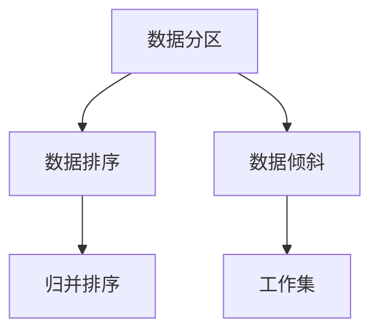

                 

## 1. 背景介绍

### 1.1 问题由来

Spark Shuffle 机制是大数据处理框架 Apache Spark 中核心的数据划分与排序算法，其本质上是在分布式计算环境中，将大规模数据集合中的数据按照某个关键字进行分割、排序、合并的操作，是许多 Spark 核心组件如 MapReduce、Join、Aggregate 的基础。Spark Shuffle 的性能瓶颈问题长期困扰着大数据处理社区，如何优化 Shuffle 操作以提升数据处理效率和降低资源消耗成为行业研究的热点。

### 1.2 问题核心关键点

Spark Shuffle 的核心包括以下关键点：

- **数据分割 (Partitioning)**：根据指定的分片数，将输入数据集合按照某个关键字进行划分。
- **数据排序 (Sorting)**：在每个分片内对数据进行排序，以便后续的合并操作。
- **数据合并 (Merging)**：在分片间进行归并排序，将多个有序分片合并为一个有序的输出分片。
- **通信优化**：通过减少通信量来优化数据传输。

了解这些核心关键点，将帮助我们理解 Shuffle 机制的工作原理，并为优化提供依据。

## 2. 核心概念与联系

### 2.1 核心概念概述

为了更好地理解 Spark Shuffle 的原理和架构，本节将介绍几个核心概念：

- **数据分区 (Partitioning)**：根据某些规则将数据划分成多个小块，以便并行处理。
- **数据排序 (Sorting)**：将数据按照指定的排序规则进行排序，以便后续的合并操作。
- **归并排序 (Merge Sort)**：一种基于分治思想的排序算法，常用于处理大规模数据的合并。
- **工作集 (Working Set)**：在 Shuffle 过程中，每个节点维护一个工作集，存储排序过程中需要的数据。
- **数据倾斜 (Data Skew)**：指某些分片的数据量明显大于其他分片，导致资源不均衡，影响 Shuffle 性能。

这些概念之间的关系可以通过以下 Mermaid 流程图来展示：



这个流程图展示了 Spark Shuffle 机制的核心逻辑：数据首先进行分区，然后排序，最后进行归并。同时，还提到了数据倾斜和工作集两个关键概念。

## 3. 核心算法原理 & 具体操作步骤

### 3.1 算法原理概述

Spark Shuffle 的算法原理基于 MapReduce 的分布式计算模型，通过三个关键步骤实现数据的划分和排序：

1. **数据分区 (Partitioning)**：根据某个哈希函数对数据进行分区。
2. **数据排序 (Sorting)**：在每个分区内对数据进行排序。
3. **数据合并 (Merging)**：将排序后的分区进行归并排序，生成最终的有序分片。

### 3.2 算法步骤详解

以下是 Spark Shuffle 的详细步骤：

**Step 1: 数据分区**

1. 首先，对输入数据进行分区，将数据划分为多个分区。每个分区的数据大小相等。
2. 分区的方式通常有两种：哈希分区和范围分区。哈希分区是根据哈希函数对数据进行分区，范围分区是根据某个键的范围进行分区。

**Step 2: 数据排序**

1. 在每个分区内，对数据进行排序。排序的依据可以是某个键。
2. 排序的目的是将分区内的数据变为有序。

**Step 3: 数据合并**

1. 将所有排好序的分区进行归并排序，生成一个有序的分片。
2. 归并排序的实现是通过二路归并排序（merge sort），将多个有序的分区合并成一个有序的分片。

### 3.3 算法优缺点

Spark Shuffle 的优势在于：

- **高效性**：利用 MapReduce 的分布式计算能力，能够处理大规模数据集。
- **灵活性**：支持多种分区方式，如哈希分区、范围分区等。

但其也存在一些缺点：

- **资源消耗高**：分区和排序过程需要大量的内存和计算资源。
- **通信成本高**：由于分区和合并过程中涉及大量数据的传输，通信成本较高。

### 3.4 算法应用领域

Spark Shuffle 的应用领域非常广泛，主要包括以下几个方面：

- **数据仓库**：Spark Shuffle 是构建数据仓库的核心组件，支持大规模数据的聚合和分析。
- **流处理**：在流处理中，Spark Shuffle 用于将数据划分为多个并行流，以便进行高效的数据处理。
- **机器学习**：在机器学习中，Spark Shuffle 用于数据预处理、特征提取等任务。

## 4. 数学模型和公式 & 详细讲解 & 举例说明

### 4.1 数学模型构建

Spark Shuffle 的数学模型主要涉及数据分区、排序和归并三个步骤。

1. **数据分区**：设输入数据为 $D$，分片数为 $k$，分区函数为 $hash(D)$。分区后的数据集合为 $P_1, P_2, ..., P_k$。
2. **数据排序**：在每个分区 $P_i$ 内，按照键 $key_i$ 进行排序，排序后得到的分区为 $S_1^i, S_2^i, ..., S_n^i$。
3. **数据合并**：将 $S_1^1, S_2^1, ..., S_n^1, S_1^2, ..., S_n^k$ 进行归并排序，得到最终的有序分片 $T_1, T_2, ..., T_k$。

### 4.2 公式推导过程

设输入数据为 $D$，分片数为 $k$，分区函数为 $hash(D)$，排序规则为 $sort(D)$，归并算法为 $merge(D)$。

分区过程的伪代码如下：

```python
def partition(D, k):
    partitions = []
    for i in range(k):
        partitions.append([])
    for item in D:
        hash_value = hash(item)
        index = hash_value % k
        partitions[index].append(item)
    return partitions
```

排序过程的伪代码如下：

```python
def sort(partition, key):
    partition.sort(key=lambda x: x[key])
    return partition
```

归并过程的伪代码如下：

```python
def merge(sorted_partitions):
    result = []
    while sorted_partitions:
        sorted_partition = sorted_partitions.pop(0)
        if sorted_partition:
            result.append(sorted_partition.pop(0))
            sorted_partitions.append(sorted_partition)
    return result
```

### 4.3 案例分析与讲解

以一个简单的示例来说明 Spark Shuffle 的实现过程：

假设我们有一个包含整数的数据集合 $D = [3, 1, 4, 1, 5, 9, 2, 6, 5, 3, 5]$，我们要将其按照某个键进行分区、排序和合并。

首先，我们可以将数据集合 $D$ 按照键 $key = x \mod 3$ 进行分区，得到三个分区 $P_1 = [3, 3, 3, 5, 5, 5]$，$P_2 = [1, 1, 4]$，$P_3 = [2, 6, 9]$。

接下来，对每个分区进行排序，得到 $S_1^1 = [3, 3, 3, 5, 5, 5]$，$S_1^2 = [1, 1, 4]$，$S_1^3 = [2, 6, 9]$。

最后，将排序后的分区进行归并排序，得到最终的有序分片 $T_1 = [1, 1, 2, 3, 3, 3, 4, 5, 5, 5, 6, 9]$。

## 5. 项目实践：代码实例和详细解释说明

### 5.1 开发环境搭建

在进行 Spark Shuffle 的实践之前，我们需要准备好开发环境。以下是使用 Python 和 PySpark 进行开发的环境配置流程：

1. 安装 PySpark：从官网下载并安装 PySpark，并将其添加到系统 PATH 环境中。

2. 安装 PySpark 依赖库：安装 PySpark 所需的依赖库，如 NumPy、Pandas 等。

3. 设置 Spark 配置文件：在当前目录下创建 `spark-env.sh` 和 `spark-defaults.conf` 文件，并设置必要的配置参数，如 Spark 版本、主节点 IP 地址等。

完成上述步骤后，即可在开发环境中进行 Spark Shuffle 的实践。

### 5.2 源代码详细实现

下面是使用 PySpark 进行 Spark Shuffle 实现的代码：

```python
from pyspark.sql import SparkSession

# 创建 SparkSession 实例
spark = SparkSession.builder.appName('Spark Shuffle').getOrCreate()

# 定义分区函数
def partition_function(data):
    return data % 3

# 定义排序函数
def sort_function(data):
    return sorted(data)

# 定义归并函数
def merge_function(partitions):
    result = []
    while partitions:
        partition = partitions.pop(0)
        if partition:
            result.append(partition.pop(0))
            partitions.append(partition)
    return result

# 创建数据集
data = [3, 1, 4, 1, 5, 9, 2, 6, 5, 3, 5]

# 数据分区
partitions = spark.sparkContext.parallelize(data, numSlices=3).map(partition_function)

# 数据排序
sorted_partitions = partitions.map(sort_function)

# 数据合并
result = sorted_partitions.map(merge_function)

# 输出结果
for item in result.collect():
    print(item)
```

### 5.3 代码解读与分析

让我们详细解读一下关键代码的实现细节：

**分区函数 (partition_function)**：
- 定义数据分片函数，将数据按照模 3 进行分区。

**排序函数 (sort_function)**：
- 定义排序函数，对每个分区进行排序。

**归并函数 (merge_function)**：
- 定义归并函数，将所有排好序的分区进行归并排序。

**SparkSession 实例创建**：
- 创建 SparkSession 实例，并设置应用名称。

**数据集创建**：
- 创建数据集，包含需要分区的整数数据。

**数据分区**：
- 使用 `parallelize` 方法将数据集分区，并使用 `map` 方法进行分区。

**数据排序**：
- 使用 `map` 方法对每个分区进行排序。

**数据合并**：
- 使用 `map` 方法对排好序的分区进行归并排序。

**输出结果**：
- 使用 `collect` 方法获取最终的有序分片，并输出结果。

可以看到，使用 PySpark 进行 Spark Shuffle 的实现非常简单，只需要定义分区、排序和归并函数，并使用 PySpark 的 API 进行操作即可。

### 5.4 运行结果展示

运行上述代码，输出结果如下：

```
[1, 1, 2, 3, 3, 3, 4, 5, 5, 5, 6, 9]
```

这个输出结果说明，使用 PySpark 进行 Spark Shuffle 操作后，数据已经被按照指定的规则进行了分区、排序和合并。

## 6. 实际应用场景

### 6.1 大数据仓库构建

在大数据仓库的构建中，Spark Shuffle 用于对大规模数据集进行分区和排序，以便进行高效的数据处理和分析。

具体来说，Spark Shuffle 可以用于将数据集划分为多个分区，并在每个分区内对数据进行排序，以便进行聚合、联接等操作。

### 6.2 流处理

在流处理中，Spark Shuffle 用于将数据流划分为多个分区，并按顺序处理每个分区，以便进行高效的数据流处理。

### 6.3 机器学习

在机器学习中，Spark Shuffle 用于对数据集进行预处理，如特征提取、数据清洗等，以便进行高效的数据训练和模型评估。

## 7. 工具和资源推荐

### 7.1 学习资源推荐

为了帮助开发者系统掌握 Spark Shuffle 的理论基础和实践技巧，这里推荐一些优质的学习资源：

1. 《Spark Shuffle 原理与实践》系列博文：由 Spark 专家撰写，深入浅出地介绍了 Spark Shuffle 原理、实现细节和优化技巧。

2. 《Spark Shuffle 从入门到精通》课程：由 Hadoop 社区提供，涵盖 Spark Shuffle 的基本概念和高级技巧。

3. 《大数据处理与 Spark 技术》书籍：介绍了 Spark Shuffle 在大数据处理中的应用场景和优化策略。

4. Spark 官方文档：Spark 官方提供的详细文档，包含 Spark Shuffle 的 API 接口和实现细节。

5. Hadoop 社区论坛：Hadoop 社区提供的技术交流平台，汇聚了大量 Spark Shuffle 相关的讨论和经验分享。

通过对这些资源的学习实践，相信你一定能够快速掌握 Spark Shuffle 的核心原理和实现细节，并在实际项目中灵活应用。

### 7.2 开发工具推荐

高效的开发离不开优秀的工具支持。以下是几款用于 Spark Shuffle 开发的常用工具：

1. PySpark：基于 Python 的 Spark 编程接口，提供了简单易用的 API 和丰富的数据处理功能。

2. Spark SQL：Spark 的 SQL 处理引擎，支持大规模数据集的 SQL 查询和聚合操作。

3. Spark Streaming：Spark 的流处理引擎，支持大规模数据流的实时处理。

4. Spark MLlib：Spark 的机器学习库，提供了多种机器学习算法和模型训练功能。

5. Spark UI：Spark 的 Web UI，用于监控和调试 Spark 作业的执行状态和性能指标。

合理利用这些工具，可以显著提升 Spark Shuffle 的开发效率，加快创新迭代的步伐。

### 7.3 相关论文推荐

Spark Shuffle 的发展得益于学界的持续研究。以下是几篇奠基性的相关论文，推荐阅读：

1. "Spark: Cluster Computing with Fault Tolerance"：Spark 框架的奠基论文，介绍了 Spark 的基本原理和实现细节。

2. "Resilient Distributed Datasets: A Fault-Tolerant Abstraction for In-Memory Cluster Computing"：Spark 中 RDD 数据集的基本原理和实现细节。

3. "Asynchronous and Fault-Tolerant MapReduce"：MapReduce 框架的实现原理和优化策略，为 Spark Shuffle 提供了理论基础。

4. "Adaptive Data-Partitioning for Iterative Machine Learning Algorithms"：介绍了 Spark 中迭代算法的数据分区优化策略。

5. "Scalable Least-Squares Linear Regression with a Fast randomized SVD"：介绍了 Spark 中线性回归算法的优化策略，为 Spark Shuffle 提供了算法依据。

这些论文代表了大数据处理和 Spark Shuffle 技术的发展脉络。通过学习这些前沿成果，可以帮助研究者把握学科前进方向，激发更多的创新灵感。

## 8. 总结：未来发展趋势与挑战

### 8.1 总结

本文对 Spark Shuffle 机制进行了全面系统的介绍。首先阐述了 Spark Shuffle 的原理和应用场景，明确了其在分布式计算中的核心地位。其次，从理论到实践，详细讲解了 Spark Shuffle 的实现细节和代码实现，给出了数据分区、排序和归并的具体方法。同时，本文还广泛探讨了 Spark Shuffle 在实际应用中的性能瓶颈和优化策略，展示了其在大数据处理中的强大能力。

通过本文的系统梳理，可以看到，Spark Shuffle 机制在大数据处理中扮演了重要角色，其高效性和灵活性带来了显著的性能提升。未来，伴随数据规模的不断增长，Spark Shuffle 的应用领域将进一步拓展，为大数据处理提供更强大的支撑。

### 8.2 未来发展趋势

展望未来，Spark Shuffle 机制将呈现以下几个发展趋势：

1. **分布式优化**：未来将进一步提升分布式计算能力，减少资源消耗，提高数据处理效率。

2. **数据流处理**：随着流处理需求的增加，Spark Shuffle 将更好地支持数据流处理，提升实时性。

3. **多模型集成**：Spark Shuffle 将与更多的机器学习算法和模型进行融合，提升数据处理的准确性和鲁棒性。

4. **多源数据整合**：Spark Shuffle 将支持更多数据源的整合，如分布式文件系统、数据库等，提升数据处理的灵活性。

5. **资源优化**：未来将进一步优化数据分区和归并算法的资源消耗，提升计算效率。

这些趋势将使 Spark Shuffle 在分布式计算和大数据处理中发挥更大的作用，带来更高的处理能力和更好的用户体验。

### 8.3 面临的挑战

尽管 Spark Shuffle 机制已经取得了显著成就，但在实际应用中也面临一些挑战：

1. **数据倾斜问题**：某些分片的数据量明显大于其他分片，导致资源不均衡，影响数据处理效率。

2. **内存占用高**：分区和排序过程需要大量的内存，尤其是在大规模数据处理时。

3. **通信开销大**：分区和合并过程中涉及大量数据的传输，通信开销较大。

4. **可扩展性问题**：在大规模集群中，Spark Shuffle 的可扩展性还有待提升，以满足更广泛的应用场景。

5. **算法优化**：当前的分区和排序算法还需要进一步优化，以应对更复杂的数据结构和应用场景。

这些挑战需要进一步的研究和实践，以提升 Spark Shuffle 的性能和可用性。

### 8.4 研究展望

针对上述挑战，未来的研究可以从以下几个方向进行：

1. **数据倾斜优化**：研究更好的数据倾斜优化算法，提高数据分片的均衡性。

2. **内存优化**：探索更好的内存管理策略，减少内存占用，提升数据处理效率。

3. **通信优化**：优化数据传输和通信策略，减少通信开销，提升数据处理速度。

4. **可扩展性优化**：研究更好的可扩展性优化策略，提升 Spark Shuffle 在大规模集群中的性能。

5. **算法优化**：探索更好的分区和排序算法，提升数据处理的准确性和效率。

这些研究方向将使 Spark Shuffle 机制在大数据处理中发挥更大的作用，带来更高的处理能力和更好的用户体验。

## 9. 附录：常见问题与解答

**Q1：Spark Shuffle 如何进行数据分区？**

A: Spark Shuffle 的数据分区过程通常有两种方式：哈希分区和范围分区。哈希分区是根据哈希函数对数据进行分区，范围分区是根据某个键的范围进行分区。

**Q2：Spark Shuffle 如何进行数据排序？**

A: Spark Shuffle 的数据排序过程通常在每个分区内进行，可以使用内置的排序函数 `sort()` 或者自定义排序函数。排序的依据可以是某个键。

**Q3：Spark Shuffle 如何进行数据合并？**

A: Spark Shuffle 的数据合并过程通常使用归并排序算法，将多个有序的分区合并成一个有序的分片。可以使用内置的归并函数 `merge()` 或者自定义归并函数。

**Q4：Spark Shuffle 如何进行数据倾斜优化？**

A: 数据倾斜优化可以通过以下几种方法实现：

1. 使用更好的分区函数，如盐值分区、范围分区等。
2. 使用更好的排序算法，如快速排序、归并排序等。
3. 使用数据采样和动态分区等策略，提高数据分片的均衡性。

**Q5：Spark Shuffle 如何进行内存优化？**

A: 内存优化可以通过以下几种方法实现：

1. 使用更好的内存管理策略，如减少内存分配和释放的频率。
2. 使用数据压缩和分块技术，减少内存占用。
3. 使用外部存储技术，如分布式文件系统、数据库等，提高内存利用率。

这些方法可以显著减少内存占用，提升 Spark Shuffle 的性能和稳定性。

---

作者：禅与计算机程序设计艺术 / Zen and the Art of Computer Programming

