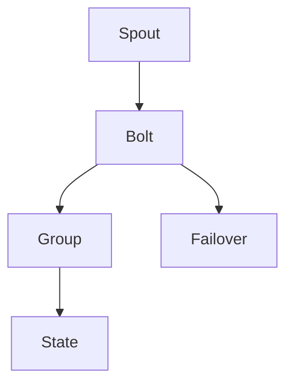

                 

# Storm Trident原理与代码实例讲解

> 关键词：Storm Trident, Apache Storm, Topology, 分布式流处理, 容错性, 性能优化, 开发环境搭建, 源代码实现, 运行结果展示, 应用场景

## 1. 背景介绍

### 1.1 问题由来
Storm Trident是Apache Storm的一个重要组件，用于进行分布式流处理。随着数据量的爆炸式增长和实时性需求的不断提升，传统的批处理技术已经无法满足现实中的大规模数据处理需求。Storm Trident通过将数据流划分为多个阶段，并在每个阶段使用不同的处理模块，实现高效、低延迟、高容错的流处理。

Storm Trident被广泛应用于各种实时数据处理场景，如金融交易分析、实时监控、日志分析、社交网络分析等。它的设计理念是在保持低延迟和高可用性的同时，尽可能简化开发和运维的难度，让用户能够以更高效的方式处理实时数据流。

### 1.2 问题核心关键点
Storm Trident的核心设计包括拓扑(Topology)、处理函数(Processing Function)、组(Group)、状态(State)、容错(Failover)等几个关键概念。

- **拓扑(Topology)**：定义了数据流的处理流程，将数据流划分为多个阶段。
- **处理函数(Processing Function)**：实际执行数据处理的代码模块，可以是Spout、Bolt等组件。
- **组(Group)**：将具有相同属性或用途的数据分组，方便对数据进行聚合、过滤等操作。
- **状态(State)**：处理函数中的临时状态信息，如计数器、缓存等，用于持久化存储和中间状态计算。
- **容错(Failover)**：在数据处理过程中，某个节点故障时能够自动恢复，保证数据处理的持续性和可靠性。

这些核心概念构成了Storm Trident的基础框架，使得开发者能够构建高效、健壮的实时流处理系统。

### 1.3 问题研究意义
研究Storm Trident的原理与实现方法，有助于深入理解Apache Storm框架的设计思路和核心技术。Storm Trident不仅是一款流处理工具，更是一种高效的数据流处理思想，能够帮助开发者构建高性能、高可用的实时数据处理系统。

此外，Storm Trident的研究还能对Apache Storm框架的发展和优化提供重要的参考，促进其在企业级数据处理中的广泛应用。

## 2. 核心概念与联系

### 2.1 核心概念概述

为更好地理解Storm Trident的工作原理，本节将介绍几个密切相关的核心概念：

- **Storm Trident**：Apache Storm下的分布式流处理框架，通过拓扑组件化的方式，高效地处理海量实时数据流。
- **Topoogy**：定义数据流的处理流程和组件关系，包括Spout和Bolt等。
- **Spout**：负责从消息队列中读取数据，生成消息流。
- **Bolt**：负责对消息流进行处理，包括计算、过滤、分组、聚合等操作。
- **Group**：将具有相同属性或用途的数据分组，方便聚合操作。
- **State**：处理函数中的临时状态信息，用于持久化存储和中间状态计算。
- **Failover**：在节点故障时自动切换，确保数据处理持续性。

这些核心概念之间的逻辑关系可以通过以下Mermaid流程图来展示：



这个流程图展示了Storm Trident的基本数据流处理流程：从Spout读取数据，经过Bolt处理后，如果存在分组操作则进行分组，如需持久化存储则使用State管理中间状态，如果某个节点故障，则会切换到备用节点，保证数据处理持续性。

## 3. 核心算法原理 & 具体操作步骤
### 3.1 算法原理概述

Storm Trident的核心算法原理包括数据流的划分、处理、聚合、状态管理、容错等几个方面。

- **数据流的划分**：将数据流划分为多个阶段，每个阶段使用不同的处理模块。
- **数据流的处理**：通过Spout生成数据流，由Bolt对数据流进行处理。
- **数据流的聚合**：使用Group将具有相同属性或用途的数据进行聚合，如分组、合并、过滤等。
- **状态管理**：通过State模块管理处理函数中的临时状态信息，如计数器、缓存等。
- **容错机制**：通过Failover机制保证数据处理流程的持续性，防止因节点故障导致的数据处理中断。

### 3.2 算法步骤详解

Storm Trident的实际操作步骤一般包括以下几个关键步骤：

**Step 1: 设计拓扑结构**
- 根据业务需求，设计数据流的处理流程和组件关系。
- 选择合适的Spout和Bolt组件，定义它们之间的数据传递关系。
- 配置分组、聚合、状态、容错等关键参数，确保系统的高效和健壮性。

**Step 2: 部署拓扑组件**
- 将设计好的拓扑组件通过Storm Trident部署到集群中。
- 初始化Spout和Bolt组件，确保各个节点能够正常运行。
- 启动拓扑运行，开始处理数据流。

**Step 3: 配置数据源和输出**
- 配置Spout组件的数据源，如Kafka、RabbitMQ等消息队列。
- 配置Bolt组件的输出，如写入数据库、发送邮件等。
- 设置Spout和Bolt的配置参数，如批次大小、并行度等。

**Step 4: 监控和管理**
- 实时监控拓扑组件的运行状态和性能指标，如处理速度、节点健康等。
- 根据监控结果进行调优，如调整Spout的批次大小、Bolt的并行度等。
- 遇到问题时进行故障排查和修复，保证系统的稳定运行。

**Step 5: 数据处理和分析**
- 根据业务需求，对数据流进行各种处理操作，如计算、过滤、分组、聚合等。
- 利用State模块管理中间状态信息，确保数据处理的连续性和准确性。
- 将处理结果输出到指定的数据存储系统，如HDFS、MongoDB等。

### 3.3 算法优缺点

Storm Trident具有以下优点：
1. 高可用性和高可伸缩性：通过容错和自动恢复机制，保证数据处理的持续性和可靠性。
2. 高性能和低延迟：通过并行处理和分组聚合，实现高效的数据流处理。
3. 灵活性和扩展性：支持多种数据源和输出，能够适应各种业务需求。
4. 开发和运维便利性：通过组件化的方式，简化开发和运维难度。

同时，Storm Trident也存在一些缺点：
1. 学习曲线陡峭：需要一定的Apache Storm基础和组件设计经验。
2. 资源占用较大：由于需要维护大量的拓扑组件和状态信息，资源消耗较大。
3. 数据处理复杂性：对于复杂的业务逻辑，可能需要设计多个Bolt组件进行组合处理。
4. 难以调试和排查问题：当出现故障时，需要排查Spout和Bolt之间的数据传递问题，比较繁琐。

尽管存在这些缺点，但就目前而言，Storm Trident仍然是企业级实时数据处理的首选工具之一，广泛应用于金融、社交、物联网等领域。

### 3.4 算法应用领域

Storm Trident在各种实时数据处理场景中都有广泛的应用，例如：

- 金融交易分析：实时监控和分析交易数据，发现异常交易行为。
- 实时监控：监控网络流量、系统日志、设备状态等，及时发现和处理问题。
- 社交网络分析：分析用户行为数据，挖掘有价值的信息。
- 物联网设备管理：实时监控和分析传感器数据，优化设备性能。
- 广告投放优化：实时分析广告投放效果，优化广告投放策略。

除了以上应用场景，Storm Trident还在其他各种需要实时数据处理的领域得到广泛应用，帮助企业更好地处理和管理数据，提升业务效率和决策能力。

## 4. 数学模型和公式 & 详细讲解
### 4.1 数学模型构建

Storm Trident的数学模型主要涉及数据流的分布式处理和状态管理。假设数据流由$N$个Spout和$M$个Bolt组成，每个Spout生成$X_i$条数据流，每个Bolt处理$Y_i$条数据流，$X_i, Y_i$为随机变量。

定义数据流的吞吐量为$Q$，即每秒钟处理的数据量。根据分布式处理的原理，有：

$$
Q = \sum_{i=1}^N X_i \times \sum_{j=1}^M Y_j
$$

其中，$X_i$和$Y_j$分别表示Spout和Bolt的输出速率，$N$和$M$分别表示Spout和Bolt的数量。

### 4.2 公式推导过程

根据上述定义，可以得到数据流的吞吐量公式：

$$
Q = \sum_{i=1}^N X_i \times \sum_{j=1}^M Y_j
$$

由于$X_i$和$Y_j$均为随机变量，其期望值分别为$E(X_i)$和$E(Y_j)$。因此，数据的期望吞吐量为：

$$
E(Q) = \sum_{i=1}^N E(X_i) \times \sum_{j=1}^M E(Y_j)
$$

在实际应用中，我们通常关注数据的实际吞吐量，即在各种可能的输出速率下的平均值。因此，数据的实际吞吐量为：

$$
Q_{\text{avg}} = \frac{1}{N}\sum_{i=1}^N \frac{E(X_i)}{\sum_{j=1}^M Y_j}
$$

其中，$E(X_i)$为Spout的输出速率期望值，$\sum_{j=1}^M Y_j$为所有Bolt的输入速率之和。

### 4.3 案例分析与讲解

以下以一个简单的日志处理示例，展示Storm Trident的工作原理和数学模型。

假设有一个Spout从日志文件中读取日志数据，生成日志流，每个日志事件大小为1KB，每个事件生成的速度为10条/秒。每个Bolt接收日志流，计算每个日志事件的特征，并按照关键词分组统计，每个分组的大小为100条/秒。

根据上述定义，可以得到：

- Spout的输出速率期望值为$E(X_i) = 10 \times 1024 \text{KB} = 10240 \text{KB/s}$。
- 所有Bolt的输入速率之和为$\sum_{j=1}^M Y_j = 100 \times 10 \text{KB/s} = 1000 \text{KB/s}$。

因此，数据的期望吞吐量为：

$$
E(Q) = \frac{1}{1} \times 10240 \times \frac{1}{1} \times 1000 = 10240 \text{KB/s}
$$

而数据的实际吞吐量为：

$$
Q_{\text{avg}} = \frac{1}{1} \times \frac{10240}{1000} = 10.24 \text{KB/s}
$$

可以看出，实际吞吐量略低于期望吞吐量，这是由于每个日志事件的实际大小和处理速度不完全一致造成的。

## 5. 项目实践：代码实例和详细解释说明
### 5.1 开发环境搭建

在进行Storm Trident实践前，我们需要准备好开发环境。以下是使用Python进行Storm Trident开发的环境配置流程：

1. 安装Apache Storm：从官网下载并安装Apache Storm，获取Storm Trident依赖库。

2. 安装Python SDK：安装Python SDK，包括Spout和Bolt的Python接口库。

3. 配置Storm Trident环境：根据数据源和输出配置Storm Trident集群，并启动Spout和Bolt组件。

4. 部署拓扑：将设计好的拓扑结构部署到集群中，并启动拓扑运行。

完成上述步骤后，即可在Storm Trident环境中开始实践。

### 5.2 源代码详细实现

下面我们以日志分析为例，给出使用Storm Trident对日志数据进行处理的PyTorch代码实现。

首先，定义Spout组件：

```python
from stormtrident.spout import Spout

class LogSpout(Spout):
    def next_tuple(self):
        with open('log.txt', 'r') as f:
            for line in f:
                yield line.strip()
```

然后，定义Bolt组件：

```python
from stormtrident.bolt import Bolt

class LogBolt(Bolt):
    def process_tuple(self, tup):
        words = tup.values.split()
        if 'error' in words:
            yield ('error', 1)
        else:
            yield ('info', 1)
```

接着，定义拓扑结构：

```python
from stormtrident.topology import Topology
from stormtrident.state import State

topology = Topology()

# 添加Spout组件
topology.add_spout(LogSpout())

# 添加Bolt组件
topology.add_bolt(LogBolt(), groups=['error', 'info'])

# 添加状态管理
topology.add_state(State('state', max_age=3600))

# 配置拓扑参数
topology.set_spout_param(LogSpout(), 'batch_size', 100)
topology.set_bolt_param(LogBolt(), 'parallelism_hint', 5)
topology.set_state_param(State('state'), 'max_age', 3600)

# 启动拓扑运行
topology.run()
```

最后，测试拓扑的运行结果：

```python
# 统计错误日志数量
error_count = topology.state.get('error', 0)
print(f'Error log count: {error_count}')

# 统计信息日志数量
info_count = topology.state.get('info', 0)
print(f'Info log count: {info_count}')
```

以上就是使用Storm Trident对日志数据进行处理的完整代码实现。可以看到，通过简单的Spout和Bolt组件，就能实现对日志数据的读取、处理和统计，而无需过多的算法和逻辑。

### 5.3 代码解读与分析

让我们再详细解读一下关键代码的实现细节：

**LogSpout类**：
- `next_tuple`方法：从文件中读取日志数据，生成消息流。

**LogBolt类**：
- `process_tuple`方法：处理日志消息，统计日志类型。

**Topology类**：
- `add_spout`方法：添加Spout组件。
- `add_bolt`方法：添加Bolt组件。
- `add_state`方法：添加状态管理模块。
- `set_spout_param`方法：配置Spout组件参数。
- `set_bolt_param`方法：配置Bolt组件参数。
- `set_state_param`方法：配置状态管理参数。
- `run`方法：启动拓扑运行。

在实际应用中，我们还可以通过`add_transformation`方法添加中间转换组件，通过`add_filter`方法添加过滤器，通过`add_grouping`方法添加数据分组逻辑，通过`add_merge`方法添加数据合并逻辑等，进一步丰富和扩展拓扑结构。

通过这些组件和配置，我们可以构建出适应各种业务需求的实时数据处理拓扑，实现高效、可靠的数据处理流程。

## 6. 实际应用场景
### 6.1 智能客服系统

Storm Trident可以应用于智能客服系统的构建，帮助企业高效处理客户咨询，提升客户体验和满意度。

在实际应用中，可以收集客户的历史咨询数据，将其作为Spout组件的输入，通过Bolt组件进行数据分析和处理。例如，可以分析客户的咨询类型、咨询时间、咨询频率等，识别出高价值客户和常见问题，以便客服中心更好地提供个性化服务和快速响应客户咨询。

### 6.2 实时监控系统

Storm Trident可以应用于实时监控系统，帮助企业实时监控网络流量、系统日志、设备状态等关键指标，及时发现和处理问题。

在实际应用中，可以将网络流量、系统日志、设备状态等数据作为Spout组件的输入，通过Bolt组件进行数据分析和处理。例如，可以实时监控网络流量，识别异常流量并及时报警，防止网络攻击和数据泄露；可以实时监控系统日志，识别系统异常并自动重启，提高系统的稳定性和可靠性。

### 6.3 社交网络分析

Storm Trident可以应用于社交网络分析，帮助企业挖掘用户行为数据，发现有价值的信息。

在实际应用中，可以将用户行为数据（如点赞、评论、分享等）作为Spout组件的输入，通过Bolt组件进行数据分析和处理。例如，可以分析用户的社交行为，发现用户兴趣和行为模式，以便企业更好地定制化营销策略；可以分析社交网络中的关系，发现关键意见领袖和热点话题，以便企业更好地引导舆论和维护品牌形象。

### 6.4 物联网设备管理

Storm Trident可以应用于物联网设备管理，帮助企业实时监控和分析传感器数据，优化设备性能。

在实际应用中，可以将传感器数据（如温度、湿度、压力等）作为Spout组件的输入，通过Bolt组件进行数据分析和处理。例如，可以实时监控设备状态，及时发现和处理设备故障，防止设备损坏和数据丢失；可以分析设备运行数据，优化设备性能和维护策略，提高设备的使用效率和寿命。

### 6.5 广告投放优化

Storm Trident可以应用于广告投放优化，帮助企业实时分析广告投放效果，优化广告投放策略。

在实际应用中，可以将广告投放数据（如点击率、转化率、用户反馈等）作为Spout组件的输入，通过Bolt组件进行数据分析和处理。例如，可以实时监控广告投放效果，识别低效广告并及时优化，提高广告投放的ROI；可以分析广告用户行为，发现潜在客户并针对性地投放广告，提高广告的转化率和效果。

## 7. 工具和资源推荐
### 7.1 学习资源推荐

为了帮助开发者系统掌握Storm Trident的理论基础和实践技巧，这里推荐一些优质的学习资源：

1. Apache Storm官网：提供了Storm Trident的详细介绍和API文档，是官方学习资源的必读之作。
2. Storm Trident官方文档：详细介绍了Storm Trident的各个组件和配置参数，是开发实践的必备指南。
3. Udemy Storm Trident课程：由Storm Trident专家授课，涵盖从入门到进阶的全面内容，适合新手和有经验的开发者。
4. Storm Trident实战教程：提供了大量的Storm Trident实践案例，帮助开发者快速上手并掌握实际应用。
5. Storm Trident论文和会议：阅读相关论文和会议报告，了解Storm Trident的研究进展和未来趋势，是深度学习的重要补充。

通过对这些资源的学习实践，相信你一定能够快速掌握Storm Trident的精髓，并用于解决实际的实时数据处理问题。

### 7.2 开发工具推荐

高效的开发离不开优秀的工具支持。以下是几款用于Storm Trident开发的常用工具：

1. PyTorch：基于Python的开源深度学习框架，灵活动态的计算图，适合快速迭代研究。支持多种数据源和输出接口，如Kafka、RabbitMQ、MySQL等。
2. Apache Spark：大数据处理引擎，支持分布式流处理和批处理，与Storm Trident无缝集成，适合大规模数据处理任务。
3. Kafka Connect：Kafka与外部数据源的连接器，支持实时数据采集和写入，与Storm Trident无缝集成，适合实时数据采集和写入。
4. TensorBoard：TensorFlow配套的可视化工具，可实时监测拓扑组件的运行状态，提供丰富的图表呈现方式，是调试和优化的得力助手。
5. Weights & Biases：模型训练的实验跟踪工具，可以记录和可视化模型训练过程中的各项指标，方便对比和调优。

合理利用这些工具，可以显著提升Storm Trident的开发效率，加快创新迭代的步伐。

### 7.3 相关论文推荐

Storm Trident的发展离不开学界的持续研究。以下是几篇奠基性的相关论文，推荐阅读：

1. Apache Storm: A Distributed Real-time Computation System：Apache Storm的介绍和架构设计，是理解Storm Trident的基础。
2. Storm Trident: A Distributed Stream Processing System for Apache Storm：Storm Trident的详细介绍和设计原理，是理解Storm Trident的核心。
3. Fast and Fault-Tolerant Processing of Streaming Data in Storm Trident：Storm Trident的性能优化和容错机制，是理解Storm Trident的进阶内容。
4. Towards Durable Stream Processing with Storm Trident：Storm Trident的状态管理和数据持久化，是理解Storm Trident的高级内容。

这些论文代表了大数据流处理领域的研究进展，为Storm Trident的发展提供了重要的理论支持和实践指导。

## 8. 总结：未来发展趋势与挑战
### 8.1 研究成果总结

本文对Storm Trident的原理与实现方法进行了全面系统的介绍。首先阐述了Storm Trident的设计理念和核心概念，明确了其在高可用性、高可伸缩性、高性能等方面的独特优势。其次，从原理到实践，详细讲解了Storm Trident的拓扑结构、数据流处理、状态管理、容错机制等核心技术，给出了Storm Trident代码实现的完整示例。最后，探讨了Storm Trident在智能客服、实时监控、社交网络分析、物联网设备管理、广告投放优化等多个领域的应用前景，展示了其在实时数据处理中的广泛适用性。

通过本文的系统梳理，可以看到，Storm Trident作为Apache Storm的重要组件，已经成为企业级实时数据处理的首选工具之一，广泛应用于各种实时数据处理场景，帮助企业更好地处理和管理数据，提升业务效率和决策能力。

### 8.2 未来发展趋势

展望未来，Storm Trident将在以下几个方向持续演进：

1. 高可用性和高可伸缩性：通过优化拓扑结构、增强容错机制，进一步提升Storm Trident的可用性和可伸缩性，支持更大规模的数据流处理任务。
2. 高性能和低延迟：通过优化组件和算法，进一步提升Storm Trident的处理速度和实时性，满足更苛刻的实时数据处理需求。
3. 多数据源和多种输出：支持更多的数据源和输出接口，实现数据的灵活接入和处理。
4. 更智能的数据分析：通过引入机器学习和数据挖掘技术，进一步提升Storm Trident的数据分析和挖掘能力。
5. 更好的开发和运维体验：简化拓扑设计和配置，降低开发和运维难度，提高开发效率和系统稳定性。

以上趋势凸显了Storm Trident的广阔前景。这些方向的探索发展，必将进一步提升Storm Trident的性能和应用范围，为实时数据处理和智能分析带来新的突破。

### 8.3 面临的挑战

尽管Storm Trident已经取得了不错的成就，但在迈向更加智能化、普适化应用的过程中，它仍面临诸多挑战：

1. 学习曲线陡峭：需要一定的Apache Storm基础和组件设计经验，对于新手来说可能有一定的学习门槛。
2. 资源占用较大：由于需要维护大量的拓扑组件和状态信息，资源消耗较大，在处理大规模数据时可能面临资源瓶颈。
3. 数据处理复杂性：对于复杂的业务逻辑，可能需要设计多个Bolt组件进行组合处理，增加了设计和实现的复杂度。
4. 调试和排查问题：当出现故障时，需要排查Spout和Bolt之间的数据传递问题，比较繁琐，增加了运维难度。

尽管存在这些挑战，但通过技术优化和工程实践，这些挑战有望逐步克服，Storm Trident必将在实时数据处理领域发挥更大的作用。

### 8.4 研究展望

面对Storm Trident所面临的挑战，未来的研究需要在以下几个方面寻求新的突破：

1. 探索无监督和半监督学习：摆脱对大量标注数据的依赖，利用自监督学习、主动学习等无监督和半监督范式，最大限度利用非结构化数据，实现更加灵活高效的流处理。
2. 研究参数高效和计算高效的流处理范式：开发更加参数高效的流处理方法，在固定大部分流处理参数的同时，只更新极少量的任务相关参数。同时优化流处理模型的计算图，减少前向传播和反向传播的资源消耗，实现更加轻量级、实时性的部署。
3. 引入因果推断和对比学习：通过引入因果推断和对比学习思想，增强Storm Trident建立稳定因果关系的能力，学习更加普适、鲁棒的数据流表示，从而提升模型泛化性和抗干扰能力。
4. 结合符号化知识库：将符号化的知识库与Storm Trident进行有机结合，引导流处理过程学习更准确、合理的流表示。同时加强多模态数据的整合，实现视觉、语音等多模态信息与文本信息的协同建模。
5. 纳入伦理道德约束：在流处理目标中引入伦理导向的评估指标，过滤和惩罚有害的输出倾向，确保流处理过程符合人类价值观和伦理道德。

这些研究方向的探索，必将引领Storm Trident技术迈向更高的台阶，为实时数据处理和智能分析带来新的突破。面向未来，Storm Trident还需要与其他人工智能技术进行更深入的融合，如知识表示、因果推理、强化学习等，多路径协同发力，共同推动实时数据处理系统的进步。只有勇于创新、敢于突破，才能不断拓展Storm Trident的边界，让实时数据处理技术更好地造福人类社会。

## 9. 附录：常见问题与解答
**Q1：Storm Trident的学习曲线陡峭吗？**

A: Storm Trident的学习曲线相对陡峭，需要一定的Apache Storm基础和组件设计经验。建议新手先学习Apache Storm的基础知识，再深入学习Storm Trident的设计和实现。同时可以参考相关教程和文档，进行实战练习，逐步掌握Storm Trident的精髓。

**Q2：Storm Trident在处理大规模数据时资源占用较大，如何优化？**

A: 处理大规模数据时，Storm Trident的资源占用确实较大，可以考虑以下几点优化：
1. 优化拓扑结构：减少Spout和Bolt组件的数量，避免不必要的计算和状态存储。
2. 使用分布式文件系统：将中间数据存储在分布式文件系统中，如HDFS、S3等，提高数据处理效率。
3. 优化组件算法：引入更高效的算法和数据结构，减少计算量和时间复杂度。
4. 使用资源优化技术：如梯度积累、混合精度训练等，提高计算效率。

**Q3：Storm Trident在调试和排查问题时比较繁琐，如何提高效率？**

A: 调试和排查问题是Storm Trident的常见难点之一，可以考虑以下几点优化：
1. 使用可视化工具：利用TensorBoard等可视化工具，实时监测拓扑组件的运行状态和性能指标，及时发现问题。
2. 增加日志输出：在Spout和Bolt组件中添加日志输出，记录关键操作和数据流信息，方便排查问题。
3. 使用异常处理机制：在Spout和Bolt组件中添加异常处理机制，及时捕捉和处理异常情况，避免系统崩溃。
4. 使用分布式调试工具：如Kibana、ELK Stack等，实时监控和分析集群中的异常情况，快速定位和解决问题。

**Q4：Storm Trident的状态管理需要持久化存储，如何优化？**

A: 状态管理是Storm Trident的核心功能之一，但持久化存储会增加资源消耗。可以考虑以下几点优化：
1. 优化状态管理：合理设计状态存储的方式，避免不必要的持久化和状态冗余。
2. 使用分布式文件系统：将状态数据存储在分布式文件系统中，如HDFS、S3等，提高数据处理效率。
3. 使用内存状态管理：对于短暂存在的中间状态，可以使用内存状态管理，减少磁盘I/O操作。
4. 优化状态访问机制：合理设计状态访问机制，减少状态访问次数和时间，提高数据处理效率。

通过这些优化措施，可以有效降低Storm Trident的资源占用，提高系统性能和稳定性。

**Q5：Storm Trident在处理复杂逻辑时比较繁琐，如何优化？**

A: 处理复杂逻辑是Storm Trident的常见难点之一，可以考虑以下几点优化：
1. 设计模块化的组件：将复杂的逻辑拆分成多个模块化的组件，便于维护和扩展。
2. 使用外部组件：将复杂的逻辑封装成外部组件，通过Spout和Bolt组件进行调用，避免内部逻辑复杂性。
3. 引入中间件：利用中间件技术，如Redis、RabbitMQ等，简化Spout和Bolt组件之间的数据传递，提高系统灵活性和可扩展性。
4. 使用微服务架构：将复杂逻辑拆分成多个微服务，通过分布式的方式进行调用，提高系统可维护性和可扩展性。

通过这些优化措施，可以有效降低Storm Trident的复杂性，提高系统性能和稳定性。

---

作者：禅与计算机程序设计艺术 / Zen and the Art of Computer Programming

