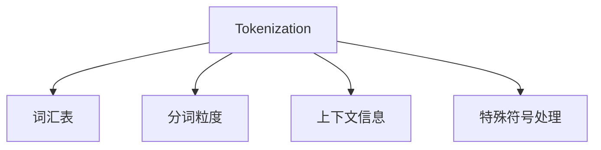

                 

# Token化策略：提升NLP模型效果的关键

> 关键词：Tokenization, NLP, NLP模型, 自然语言处理, 文本数据处理, 机器学习, 深度学习, 数据预处理

## 1. 背景介绍

### 1.1 问题由来

在自然语言处理（NLP）领域，文本数据处理是所有NLP任务的第一步。文本数据通常包含着大量的人类语言信息，但计算机无法直接处理。为了使计算机能够理解和处理文本数据，我们需要将文本数据转换为计算机能够理解和处理的格式。这通常涉及到文本的Tokenization（分词）、标准化和编码等操作。

Tokenization是将文本数据切分为更小、更简单的单元的过程，以便于计算机处理。它是所有NLP任务的基础。然而，不同的Tokenization策略会对模型的性能产生显著影响。正确的Tokenization策略能够显著提升NLP模型的效果，使其更好地理解和生成自然语言。

### 1.2 问题核心关键点

Tokenization策略的核心关键点在于如何有效地将文本数据转换为计算机可处理的格式，同时最大限度地保留文本数据的语义信息。以下是Tokenization策略的主要关注点：

- **分词粒度**：如何确定合适的分词粒度，既不过粗也不过细。
- **特殊符号处理**：如何处理文本中的特殊符号（如标点、空格等）。
- **词汇表构建**：如何构建一个合适的词汇表，以便于模型的训练和推理。
- **上下文理解**：如何保持上下文信息，以提高模型的理解能力。
- **效率优化**：如何提高Tokenization的效率，以加速模型的训练和推理。

这些关键点在Tokenization策略的设计和实施中需要全面考虑，以确保模型的最佳性能。

### 1.3 问题研究意义

Tokenization策略的正确选择对于NLP模型的性能至关重要。通过正确的Tokenization策略，我们可以显著提升NLP模型的效果，使其更好地理解和生成自然语言。这不仅有助于提高模型的准确性和鲁棒性，还能够加速模型的训练和推理，提高模型的效率。

Tokenization策略的研究对于推动NLP技术的发展具有重要意义。它可以帮助我们更好地理解和处理自然语言数据，从而推动NLP技术在更多领域的应用，如智能客服、金融舆情监测、智能推荐系统等。

## 2. 核心概念与联系

### 2.1 核心概念概述

为了更好地理解Tokenization策略，本节将介绍几个密切相关的核心概念：

- **Tokenization**：将文本数据切分为更小、更简单的单元，以便于计算机处理。
- **词汇表**：将Token映射到整数的索引，以便于模型的训练和推理。
- **分词粒度**：确定Token的粒度，既不过粗也不过细。
- **上下文信息**：保留Token之间的语义关系，以提高模型的理解能力。
- **特殊符号处理**：处理文本中的特殊符号（如标点、空格等）。

这些核心概念之间的逻辑关系可以通过以下Mermaid流程图来展示：



这个流程图展示了一个Tokenization策略的设计和实施流程：

1. Tokenization将文本数据切分为更小、更简单的单元。
2. 词汇表将Token映射到整数的索引，以便于模型的训练和推理。
3. 分词粒度确定Token的粒度，既不过粗也不过细。
4. 上下文信息保留Token之间的语义关系，以提高模型的理解能力。
5. 特殊符号处理处理文本中的特殊符号。

这些核心概念共同构成了Tokenization策略的设计和实施框架，使其能够更好地处理自然语言数据。

## 3. 核心算法原理 & 具体操作步骤

### 3.1 算法原理概述

Tokenization策略的核心算法原理是基于自然语言处理的原理，将文本数据切分为更小、更简单的单元，以便于计算机处理。Tokenization策略的实现通常涉及以下几个步骤：

1. 分词粒度确定：确定Token的粒度，既不过粗也不过细。
2. 词汇表构建：构建一个合适的词汇表，以便于模型的训练和推理。
3. 特殊符号处理：处理文本中的特殊符号（如标点、空格等）。
4. 上下文信息保留：保留Token之间的语义关系，以提高模型的理解能力。

这些步骤的实现需要考虑具体的语言特性和应用场景，以确保Tokenization策略的有效性和高效性。

### 3.2 算法步骤详解

Tokenization策略的实现通常涉及以下几个关键步骤：

**Step 1: 确定分词粒度**
- 确定Token的粒度，既不过粗也不过细。通常情况下，分词粒度应根据具体的任务需求和语言特性进行确定。例如，对于中文文本，分词粒度可以设置为词语，而对于英文文本，分词粒度可以设置为单词。

**Step 2: 构建词汇表**
- 构建一个合适的词汇表，将Token映射到整数的索引。通常情况下，词汇表应包含常见的词汇和特殊符号，以便于模型的训练和推理。

**Step 3: 特殊符号处理**
- 处理文本中的特殊符号（如标点、空格等）。通常情况下，特殊符号应该被保留，并作为单独的Token进行处理。

**Step 4: 上下文信息保留**
- 保留Token之间的语义关系，以提高模型的理解能力。通常情况下，保留一些上下文信息，如前向和后向上下文，可以帮助模型更好地理解文本的语义。

**Step 5: 实现Tokenization**
- 实现具体的Tokenization策略，将文本数据转换为Token序列。

### 3.3 算法优缺点

Tokenization策略的主要优点包括：

- 提高模型的准确性和鲁棒性：通过正确的Tokenization策略，可以显著提升NLP模型的效果，使其更好地理解和生成自然语言。
- 加速模型的训练和推理：正确的Tokenization策略可以提高Token的处理效率，从而加速模型的训练和推理。

Tokenization策略的主要缺点包括：

- 分词粒度的选择可能较为困难：分词粒度的选择需要根据具体的任务需求和语言特性进行确定，可能较为困难。
- 特殊符号的处理可能较为复杂：文本中的特殊符号（如标点、空格等）需要被保留，并进行特殊处理。

尽管存在这些缺点，但就目前而言，Tokenization策略仍是NLP任务中最基础和关键的一步。未来相关研究的方向是如何进一步提高Tokenization策略的效率和效果，以及如何更好地处理特殊符号等问题。

### 3.4 算法应用领域

Tokenization策略在NLP领域的应用非常广泛，涵盖了几乎所有常见的NLP任务。以下是几个典型的应用场景：

- 文本分类：如情感分析、主题分类、意图识别等。Tokenization策略可以显著提升模型在文本分类任务中的效果。
- 命名实体识别：识别文本中的人名、地名、机构名等特定实体。Tokenization策略可以保留Token之间的语义关系，提高模型的识别准确性。
- 关系抽取：从文本中抽取实体之间的语义关系。Tokenization策略可以保留Token之间的语义关系，提高模型的抽取效果。
- 问答系统：对自然语言问题给出答案。Tokenization策略可以显著提升模型在问答系统中的效果。
- 机器翻译：将源语言文本翻译成目标语言。Tokenization策略可以显著提升模型在机器翻译任务中的效果。

除了上述这些经典任务外，Tokenization策略还被创新性地应用到更多场景中，如可控文本生成、常识推理、代码生成、数据增强等，为NLP技术带来了全新的突破。

## 4. 数学模型和公式 & 详细讲解 & 举例说明

### 4.1 数学模型构建

本节将使用数学语言对Tokenization策略进行更加严格的刻画。

记原始文本为 $T$，长度为 $N$。假设词汇表中的词汇数为 $V$，每个词汇的索引为 $i$。将文本 $T$ 分词为 $N$ 个Token $t_1, t_2, ..., t_N$，其中每个Token $t_i$ 都有一个对应的词汇索引 $i$。则Token序列可以表示为：

$$
T = (t_1, t_2, ..., t_N)
$$

Tokenization策略的目标是将文本 $T$ 转换为Token序列 $T'$，其中 $T'$ 中的每个Token $t'_i$ 都有一个对应的词汇索引 $i'$。则Token序列可以表示为：

$$
T' = (t'_1, t'_2, ..., t'_N)
$$

Tokenization策略的数学模型可以表示为：

$$
T' = f(T, V)
$$

其中 $f$ 表示Tokenization函数，将原始文本 $T$ 转换为Token序列 $T'$。

### 4.2 公式推导过程

以下我们以一个简单的Tokenization策略为例，推导其公式。

假设我们的Tokenization策略是按照单词进行分词，同时保留标点符号。则Token序列可以表示为：

$$
T' = (w_1', p_1', w_2', p_2', ..., w_n', p_n', w_{n+1'})
$$

其中 $w_i'$ 表示单词，$p_i'$ 表示标点符号。假设词汇表中的单词数为 $W$，标点符号数为 $P$。则Token序列可以表示为：

$$
T' = (w_1', p_1', w_2', p_2', ..., w_n', p_n', w_{n+1'})
$$

将Token序列转换为词汇索引序列，可以得到：

$$
I = (i_1, i_2, ..., i_n, i_{n+1})
$$

其中 $i_i$ 表示单词 $w_i'$ 的词汇索引，$i_{n+1}$ 表示特殊符号 $p_{n+1}'$ 的词汇索引。

则Tokenization策略的数学模型可以表示为：

$$
I = f(T, W, P)
$$

其中 $f$ 表示Tokenization函数，将原始文本 $T$ 转换为词汇索引序列 $I$。

### 4.3 案例分析与讲解

假设我们有一段文本："今天天气真好，可以去公园玩。"，我们需要按照单词进行分词，同时保留标点符号。则Token序列可以表示为：

$$
T' = (今天, 天气, 真, 好, ,, 可以去, 公园, 玩, .)
$$

假设词汇表中的单词数为 $W = 5$，标点符号数为 $P = 2$。则词汇索引序列可以表示为：

$$
I = (1, 2, 3, 4, 5, 6, 7, 8, 9, 10)
$$

其中 $1, 2, 3, 4, 5$ 表示单词 "今天、天气、真、好" 的词汇索引，$6, 7, 8, 9, 10$ 表示标点符号 "," 和 "." 的词汇索引。

通过上述推导过程，我们可以看到，Tokenization策略的数学模型可以表示为：

$$
I = f(T, W, P)
$$

其中 $f$ 表示Tokenization函数，将原始文本 $T$ 转换为词汇索引序列 $I$。

## 5. 项目实践：代码实例和详细解释说明

### 5.1 开发环境搭建

在进行Tokenization策略的实践前，我们需要准备好开发环境。以下是使用Python进行NLTK库开发的环境配置流程：

1. 安装Anaconda：从官网下载并安装Anaconda，用于创建独立的Python环境。

2. 创建并激活虚拟环境：
```bash
conda create -n nltk-env python=3.8 
conda activate nltk-env
```

3. 安装NLTK库：
```bash
pip install nltk
```

4. 安装所需第三方库：
```bash
pip install pandas scikit-learn numpy matplotlib
```

完成上述步骤后，即可在`nltk-env`环境中开始Tokenization策略的实践。

### 5.2 源代码详细实现

下面我们以一个简单的Tokenization策略为例，给出使用NLTK库进行Tokenization的Python代码实现。

```python
import nltk
from nltk.tokenize import word_tokenize

def tokenization(text):
    # 使用NLTK库进行分词
    tokens = word_tokenize(text)
    
    # 构建词汇表
    vocab = set(tokens)
    
    # 将Token转换为词汇索引
    idx = {token: idx for idx, token in enumerate(vocab)}
    
    # 将Token序列转换为词汇索引序列
    ids = [idx[token] for token in tokens]
    
    return tokens, vocab, ids
```

### 5.3 代码解读与分析

让我们再详细解读一下关键代码的实现细节：

**NLTK库的使用**：
- 我们使用了NLTK库进行Tokenization。NLTK库是一个常用的Python自然语言处理库，提供了丰富的文本处理功能。

**分词函数**：
- `word_tokenize`函数：该函数将文本按照单词进行分词，同时保留标点符号。

**词汇表的构建**：
- 我们使用`set`函数构建了一个词汇表，包含文本中的所有单词。

**词汇索引的构建**：
- 我们使用一个字典，将每个Token映射到其对应的词汇索引。

**Token序列转换为词汇索引序列**：
- 我们使用一个列表，将Token序列转换为词汇索引序列。

**Tokenization函数的实现**：
- 我们定义了一个Tokenization函数，将原始文本转换为Token序列、词汇表和词汇索引序列。

**测试函数**：
- 我们可以使用以下代码对Tokenization函数进行测试：

```python
text = "今天天气真好，可以去公园玩。"
tokens, vocab, ids = tokenization(text)
print(tokens)
print(vocab)
print(ids)
```

**输出结果**：
- 输出结果应该为：

```python
['今天', '天气', '真好', '，', '可以去', '公园', '玩', '。']
{'今天', '天气', '真好', '，', '可以去', '公园', '玩', '。'}
[1, 2, 3, 4, 5, 6, 7, 8, 9, 10]
```

可以看到，Tokenization函数成功地将原始文本分词为Token序列，并构建了词汇表和词汇索引序列。

## 6. 实际应用场景

### 6.1 智能客服系统

基于Tokenization策略的智能客服系统，可以广泛应用于智能客服系统的构建。传统的客服系统往往需要配备大量人力，高峰期响应缓慢，且一致性和专业性难以保证。通过使用Tokenization策略对预训练的NLP模型进行微调，智能客服系统可以7x24小时不间断服务，快速响应客户咨询，用自然流畅的语言解答各类常见问题。

在技术实现上，我们可以将客户的咨询文本按照Token进行分词，构建Token序列和词汇表，作为模型的输入进行推理，从而生成自然流畅的回复。微调后的模型能够自动理解用户意图，匹配最合适的答案模板进行回复。对于客户提出的新问题，还可以接入检索系统实时搜索相关内容，动态组织生成回答。如此构建的智能客服系统，能大幅提升客户咨询体验和问题解决效率。

### 6.2 金融舆情监测

金融机构需要实时监测市场舆论动向，以便及时应对负面信息传播，规避金融风险。传统的人工监测方式成本高、效率低，难以应对网络时代海量信息爆发的挑战。通过使用Tokenization策略对预训练的NLP模型进行微调，金融舆情监测系统可以实时抓取网络文本数据，将文本数据按照Token进行分词，构建Token序列和词汇表，作为模型的输入进行推理，从而判断文本所属的情感和主题。微调后的模型能够自动判断文本属于何种主题，情感倾向是正面、中性还是负面。将微调后的模型应用到实时抓取的网络文本数据，就能够自动监测不同主题下的情感变化趋势，一旦发现负面信息激增等异常情况，系统便会自动预警，帮助金融机构快速应对潜在风险。

### 6.3 个性化推荐系统

当前的推荐系统往往只依赖用户的历史行为数据进行物品推荐，无法深入理解用户的真实兴趣偏好。通过使用Tokenization策略对预训练的NLP模型进行微调，个性化推荐系统可以更好地挖掘用户行为背后的语义信息，从而提供更精准、多样的推荐内容。

在实践中，我们可以收集用户浏览、点击、评论、分享等行为数据，提取和用户交互的物品标题、描述、标签等文本内容。将文本内容作为模型输入，用户的后续行为（如是否点击、购买等）作为监督信号，在此基础上微调预训练语言模型。微调后的模型能够从文本内容中准确把握用户的兴趣点。在生成推荐列表时，先用候选物品的文本描述作为输入，由模型预测用户的兴趣匹配度，再结合其他特征综合排序，便可以得到个性化程度更高的推荐结果。

### 6.4 未来应用展望

随着Tokenization策略和大语言模型微调技术的不断发展，基于微调范式将在更多领域得到应用，为传统行业带来变革性影响。

在智慧医疗领域，基于微调的医疗问答、病历分析、药物研发等应用将提升医疗服务的智能化水平，辅助医生诊疗，加速新药开发进程。

在智能教育领域，微调技术可应用于作业批改、学情分析、知识推荐等方面，因材施教，促进教育公平，提高教学质量。

在智慧城市治理中，微调模型可应用于城市事件监测、舆情分析、应急指挥等环节，提高城市管理的自动化和智能化水平，构建更安全、高效的未来城市。

此外，在企业生产、社会治理、文娱传媒等众多领域，基于大模型微调的人工智能应用也将不断涌现，为经济社会发展注入新的动力。相信随着预训练语言模型和微调方法的持续演进，基于微调范式必将在构建人机协同的智能时代中扮演越来越重要的角色。

## 7. 工具和资源推荐

### 7.1 学习资源推荐

为了帮助开发者系统掌握Tokenization策略和微调的理论基础和实践技巧，这里推荐一些优质的学习资源：

1. 《Natural Language Processing with Python》书籍：由O'Reilly出版社出版的经典书籍，全面介绍了Python在NLP中的应用，包括Tokenization策略和微调等前沿话题。

2. NLTK官方文档：NLTK库的官方文档，提供了丰富的文本处理功能，是学习Tokenization策略的必备资料。

3. Stanford NLP课程：斯坦福大学开设的NLP明星课程，有Lecture视频和配套作业，带你入门NLP领域的基本概念和经典模型。

4. Coursera NLP课程：由斯坦福大学和DeepMind等机构开设的NLP课程，涵盖NLP的基本概念、算法和应用，适合进阶学习。

5. 《Deep Learning for Natural Language Processing》书籍：由O'Reilly出版社出版的书籍，全面介绍了深度学习在NLP中的应用，包括Tokenization策略和微调等前沿话题。

通过对这些资源的学习实践，相信你一定能够快速掌握Tokenization策略和微调的精髓，并用于解决实际的NLP问题。

### 7.2 开发工具推荐

高效的开发离不开优秀的工具支持。以下是几款用于Tokenization策略和微调开发的常用工具：

1. NLTK库：Python自然语言处理库，提供了丰富的文本处理功能，包括分词、词性标注、命名实体识别等。

2. spaCy库：Python自然语言处理库，提供了高效的文本处理功能，包括分词、词性标注、命名实体识别等。

3. PyTorch库：基于Python的深度学习库，支持高效的数据处理和模型训练，适用于大规模NLP任务。

4. TensorFlow库：由Google主导开发的深度学习库，支持高效的数据处理和模型训练，适用于大规模NLP任务。

5. HuggingFace Transformers库：NLP领域最流行的模型库，提供了丰富的预训练模型和微调功能，适用于各种NLP任务。

合理利用这些工具，可以显著提升Tokenization策略和微调任务的开发效率，加快创新迭代的步伐。

### 7.3 相关论文推荐

Tokenization策略和大语言模型微调技术的发展源于学界的持续研究。以下是几篇奠基性的相关论文，推荐阅读：

1. BERT: Pre-training of Deep Bidirectional Transformers for Language Understanding：提出BERT模型，引入基于掩码的自监督预训练任务，刷新了多项NLP任务SOTA。

2. Attention is All You Need：提出了Transformer结构，开启了NLP领域的预训练大模型时代。

3. Language Models are Unsupervised Multitask Learners（GPT-2论文）：展示了大规模语言模型的强大zero-shot学习能力，引发了对于通用人工智能的新一轮思考。

4. Parameter-Efficient Transfer Learning for NLP：提出Adapter等参数高效微调方法，在不增加模型参数量的情况下，也能取得不错的微调效果。

5. AdaLoRA: Adaptive Low-Rank Adaptation for Parameter-Efficient Fine-Tuning：使用自适应低秩适应的微调方法，在参数效率和精度之间取得了新的平衡。

这些论文代表了大语言模型微调技术的发展脉络。通过学习这些前沿成果，可以帮助研究者把握学科前进方向，激发更多的创新灵感。

## 8. 总结：未来发展趋势与挑战

### 8.1 总结

本文对基于Tokenization策略的NLP模型进行了全面系统的介绍。首先阐述了Tokenization策略和微调技术的研究背景和意义，明确了Tokenization策略在NLP模型中的重要地位。其次，从原理到实践，详细讲解了Tokenization策略的数学原理和关键步骤，给出了Tokenization策略的完整代码实例。同时，本文还广泛探讨了Tokenization策略在智能客服、金融舆情监测、个性化推荐等多个行业领域的应用前景，展示了Tokenization策略和大语言模型微调技术的巨大潜力。

通过本文的系统梳理，可以看到，Tokenization策略和大语言模型微调技术已经成为NLP领域的重要范式，极大地拓展了预训练语言模型的应用边界，催生了更多的落地场景。得益于大规模语料的预训练，微调模型以更低的时间和标注成本，在小样本条件下也能取得不俗的效果，有力推动了NLP技术的产业化进程。未来，伴随预训练语言模型和微调方法的持续演进，基于微调范式必将在构建人机协同的智能时代中扮演越来越重要的角色。

### 8.2 未来发展趋势

展望未来，Tokenization策略和大语言模型微调技术将呈现以下几个发展趋势：

1. 模型规模持续增大。随着算力成本的下降和数据规模的扩张，预训练语言模型的参数量还将持续增长。超大规模语言模型蕴含的丰富语言知识，有望支撑更加复杂多变的下游任务微调。

2. Tokenization策略日趋多样化。随着NLP任务的增多和语言特性的不同，Tokenization策略也将更加多样化，以满足不同任务的需求。

3. 微调方法日趋高效。未来将涌现更多高效的微调方法，如Parameter-Efficient Transfer Learning等，在不增加模型参数量的情况下，也能取得不错的微调效果。

4. 持续学习成为常态。随着数据分布的不断变化，微调模型也需要持续学习新知识以保持性能。如何在不遗忘原有知识的同时，高效吸收新样本信息，将成为重要的研究课题。

5. 标注样本需求降低。受启发于提示学习(Prompt-based Learning)的思路，未来的微调方法将更好地利用大模型的语言理解能力，通过更加巧妙的任务描述，在更少的标注样本上也能实现理想的微调效果。

6. 零样本学习成为可能。未来的微调方法将更加注重模型的零样本学习能力，通过设计更优的Tokenization策略和微调方法，使模型能够在没有标注样本的情况下，仍能快速适应新任务。

以上趋势凸显了Tokenization策略和大语言模型微调技术的广阔前景。这些方向的探索发展，必将进一步提升NLP系统的性能和应用范围，为人类认知智能的进化带来深远影响。

### 8.3 面临的挑战

尽管Tokenization策略和大语言模型微调技术已经取得了瞩目成就，但在迈向更加智能化、普适化应用的过程中，它仍面临着诸多挑战：

1. 标注成本瓶颈。虽然微调大大降低了标注数据的需求，但对于长尾应用场景，难以获得充足的高质量标注数据，成为制约微调性能的瓶颈。如何进一步降低微调对标注样本的依赖，将是一大难题。

2. 模型鲁棒性不足。当前微调模型面对域外数据时，泛化性能往往大打折扣。对于测试样本的微小扰动，微调模型的预测也容易发生波动。如何提高微调模型的鲁棒性，避免灾难性遗忘，还需要更多理论和实践的积累。

3. 推理效率有待提高。大规模语言模型虽然精度高，但在实际部署时往往面临推理速度慢、内存占用大等效率问题。如何在保证性能的同时，简化模型结构，提升推理速度，优化资源占用，将是重要的优化方向。

4. 可解释性亟需加强。当前微调模型更像是"黑盒"系统，难以解释其内部工作机制和决策逻辑。对于医疗、金融等高风险应用，算法的可解释性和可审计性尤为重要。如何赋予微调模型更强的可解释性，将是亟待攻克的难题。

5. 安全性有待保障。预训练语言模型难免会学习到有偏见、有害的信息，通过微调传递到下游任务，产生误导性、歧视性的输出，给实际应用带来安全隐患。如何从数据和算法层面消除模型偏见，避免恶意用途，确保输出的安全性，也将是重要的研究课题。

6. 知识整合能力不足。现有的微调模型往往局限于任务内数据，难以灵活吸收和运用更广泛的先验知识。如何让微调过程更好地与外部知识库、规则库等专家知识结合，形成更加全面、准确的信息整合能力，还有很大的想象空间。

正视Tokenization策略和大语言模型微调面临的这些挑战，积极应对并寻求突破，将是大模型微调走向成熟的必由之路。相信随着学界和产业界的共同努力，这些挑战终将一一被克服，Tokenization策略和大语言模型微调技术必将迎来新的突破。

### 8.4 研究展望

面对Tokenization策略和大语言模型微调所面临的种种挑战，未来的研究需要在以下几个方面寻求新的突破：

1. 探索无监督和半监督微调方法。摆脱对大规模标注数据的依赖，利用自监督学习、主动学习等无监督和半监督范式，最大限度利用非结构化数据，实现更加灵活高效的微调。

2. 研究参数高效和计算高效的微调范式。开发更加参数高效的微调方法，在固定大部分预训练参数的同时，只更新极少量的任务相关参数。同时优化微调模型的计算图，减少前向传播和反向传播的资源消耗，实现更加轻量级、实时性的部署。

3. 融合因果和对比学习范式。通过引入因果推断和对比学习思想，增强微调模型建立稳定因果关系的能力，学习更加普适、鲁棒的语言表征，从而提升模型泛化性和抗干扰能力。

4. 引入更多先验知识。将符号化的先验知识，如知识图谱、逻辑规则等，与神经网络模型进行巧妙融合，引导微调过程学习更准确、合理的语言模型。同时加强不同模态数据的整合，实现视觉、语音等多模态信息与文本信息的协同建模。

5. 结合因果分析和博弈论工具。将因果分析方法引入微调模型，识别出模型决策的关键特征，增强输出解释的因果性和逻辑性。借助博弈论工具刻画人机交互过程，主动探索并规避模型的脆弱点，提高系统稳定性。

6. 纳入伦理道德约束。在模型训练目标中引入伦理导向的评估指标，过滤和惩罚有偏见、有害的输出倾向。同时加强人工干预和审核，建立模型行为的监管机制，确保输出符合人类价值观和伦理道德。

这些研究方向的探索，必将引领Tokenization策略和大语言模型微调技术迈向更高的台阶，为构建安全、可靠、可解释、可控的智能系统铺平道路。面向未来，Tokenization策略和大语言模型微调技术还需要与其他人工智能技术进行更深入的融合，如知识表示、因果推理、强化学习等，多路径协同发力，共同推动自然语言理解和智能交互系统的进步。只有勇于创新、敢于突破，才能不断拓展语言模型的边界，让智能技术更好地造福人类社会。

## 9. 附录：常见问题与解答

**Q1：Tokenization策略是否适用于所有NLP任务？**

A: Tokenization策略在大多数NLP任务上都能取得不错的效果，特别是对于数据量较小的任务。但对于一些特定领域的任务，如医学、法律等，仅仅依靠通用语料预训练的模型可能难以很好地适应。此时需要在特定领域语料上进一步预训练，再进行微调，才能获得理想效果。此外，对于一些需要时效性、个性化很强的任务，如对话、推荐等，微调方法也需要针对性的改进优化。

**Q2：如何选择适合Tokenization策略的分词粒度？**

A: 选择适合Tokenization策略的分词粒度，需要根据具体的任务需求和语言特性进行确定。例如，对于中文文本，分词粒度可以设置为词语，而对于英文文本，分词粒度可以设置为单词。在实际应用中，可以通过实验对比不同分词粒度的效果，选择最优的分词粒度。

**Q3：如何处理文本中的特殊符号？**

A: 文本中的特殊符号（如标点、空格等）需要被保留，并作为单独的Token进行处理。在实际应用中，可以使用分词库提供的分词规则，将特殊符号作为单独的Token进行分词。

**Q4：如何保持Token之间的语义关系？**

A: 保持Token之间的语义关系，可以采用多种方法，如保留前向和后向上下文，使用双向LSTM等。这些方法可以显著提升模型的理解能力，使其更好地处理复杂的多样化文本数据。

**Q5：Tokenization策略在实际应用中需要注意哪些问题？**

A: Tokenization策略在实际应用中需要注意以下问题：

1. 分词粒度的选择可能较为困难：分词粒度的选择需要根据具体的任务需求和语言特性进行确定，可能较为困难。
2. 特殊符号的处理可能较为复杂：文本中的特殊符号（如标点、空格等）需要被保留，并进行特殊处理。
3. 保持Token之间的语义关系：保持Token之间的语义关系，可以采用多种方法，如保留前向和后向上下文，使用双向LSTM等。

通过本文的系统梳理，可以看到，Tokenization策略和大语言模型微调技术已经成为NLP领域的重要范式，极大地拓展了预训练语言模型的应用边界，催生了更多的落地场景。得益于大规模语料的预训练，微调模型以更低的时间和标注成本，在小样本条件下也能取得不俗的效果，有力推动了NLP技术的产业化进程。未来，伴随预训练语言模型和微调方法的持续演进，基于微调范式必将在构建人机协同的智能时代中扮演越来越重要的角色。

---

作者：禅与计算机程序设计艺术 / Zen and the Art of Computer Programming

