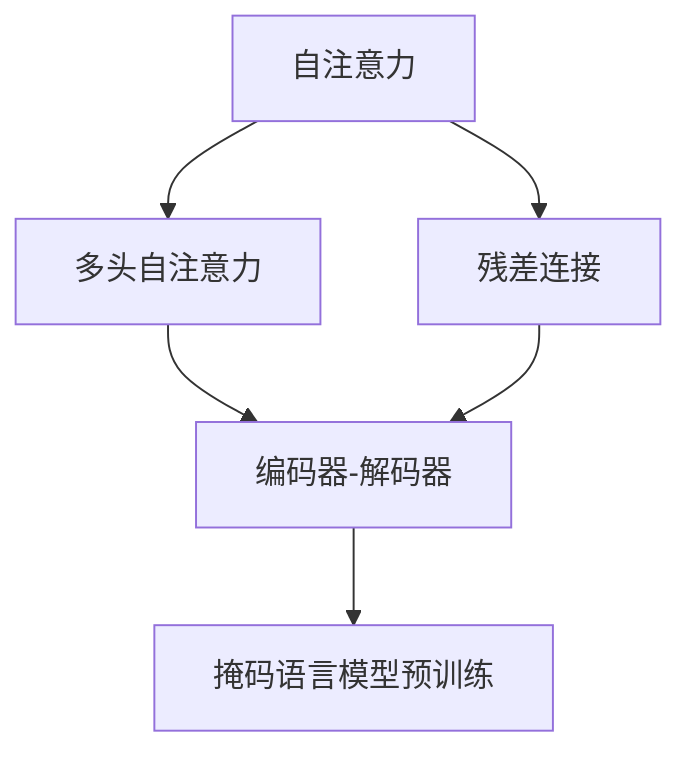

                 

# Transformer 模型 原理与代码实例讲解

> 关键词：Transformer, 自注意力, 编码器-解码器, 多头自注意力, 残差连接, 编码器-解码器, 掩码语言模型, 自回归语言模型

## 1. 背景介绍

### 1.1 问题由来

近年来，深度学习技术在自然语言处理（NLP）领域取得了显著的进展。传统的循环神经网络（RNN）在处理长文本序列时，存在梯度消失和计算复杂度高的问题，而卷积神经网络（CNN）在捕捉序列长距离依赖时效果有限。这些局限性使得在自然语言理解与生成任务上，难以同时保证效果和效率。

为了解决这些问题，Transformer模型应运而生。该模型首次在2017年的ACL会议上被提出，其核心思想是采用自注意力机制（Self-Attention），通过多头自注意力和残差连接等设计，显著提升了模型的效果和效率。Transformer模型在机器翻译、文本分类、语言生成等多个NLP任务中取得了令人瞩目的成果，是当前NLP领域的主流模型。

### 1.2 问题核心关键点

Transformer模型之所以能在NLP领域取得如此成功，主要归因于以下核心关键点：

1. **自注意力机制**：通过多头自注意力机制，模型能够同时考虑输入序列中所有位置的依赖关系，极大提升了模型的表示能力。
2. **残差连接**：通过残差连接，模型能够更加稳定地进行训练，避免梯度消失和信息丢失问题。
3. **编码器-解码器架构**：通过编码器-解码器结构，模型能够有效捕捉序列之间的依赖关系，适用于各种序列生成和分类任务。
4. **掩码语言模型预训练**：通过掩码语言模型（Masked Language Model, MLM）预训练，模型能够学习到更加丰富的语言表示，提升在各种任务上的泛化能力。

Transformer模型的这些设计思想，在后续的深度学习模型中得到了广泛应用和扩展，如BERT、GPT等模型都借鉴了其自注意力机制和编码器-解码器架构。

## 2. 核心概念与联系

### 2.1 核心概念概述

为了更好地理解Transformer模型的工作原理和架构，本节将介绍几个密切相关的核心概念：

- **自注意力机制**：自注意力机制允许模型在处理序列时，能够同时考虑序列中所有位置的依赖关系，提升模型的表示能力。
- **编码器-解码器架构**：Transformer模型的核心架构，由多个编码器和解码器层组成，能够有效捕捉序列之间的依赖关系。
- **多头自注意力**：通过并行多个自注意力机制，模型能够同时关注不同特征维度上的依赖关系，提升模型的表达能力。
- **残差连接**：通过残差连接，模型能够更加稳定地进行训练，避免梯度消失和信息丢失问题。
- **掩码语言模型预训练**：通过在无标签文本上进行掩码语言模型预训练，模型能够学习到语言的一般规律和上下文依赖关系。

这些核心概念之间的逻辑关系可以通过以下Mermaid流程图来展示：



这个流程图展示了自注意力机制、多头自注意力、残差连接、编码器-解码器架构以及掩码语言模型预训练之间的关系：

1. 自注意力机制是Transformer模型的基础，通过多头自注意力机制和残差连接设计，模型能够更好地处理序列依赖关系。
2. 编码器-解码器架构是Transformer模型的核心，用于捕捉序列之间的依赖关系，适用于各种序列生成和分类任务。
3. 掩码语言模型预训练通过在无标签文本上进行掩码预训练，使得模型能够学习到语言的一般规律和上下文依赖关系，提升模型泛化能力。

## 3. 核心算法原理 & 具体操作步骤
### 3.1 算法原理概述

Transformer模型基于自注意力机制，通过多头自注意力和残差连接设计，实现了对序列中所有位置的依赖关系的捕捉。其核心算法原理如下：

1. **多头自注意力机制**：通过并行多个自注意力机制，模型能够同时关注不同特征维度上的依赖关系。
2. **残差连接**：通过残差连接，模型能够更加稳定地进行训练，避免梯度消失和信息丢失问题。
3. **编码器-解码器架构**：通过编码器-解码器结构，模型能够有效捕捉序列之间的依赖关系，适用于各种序列生成和分类任务。
4. **掩码语言模型预训练**：通过在无标签文本上进行掩码语言模型预训练，模型能够学习到语言的一般规律和上下文依赖关系，提升模型泛化能力。

### 3.2 算法步骤详解

Transformer模型的训练和推理过程主要包括以下几个关键步骤：

**Step 1: 构建模型结构**
- 定义模型各层的结构，包括多头自注意力层、残差连接层、前馈神经网络层等。
- 选择合适的激活函数和初始化方法，如ReLU、Xavier等。

**Step 2: 定义损失函数**
- 对于掩码语言模型预训练，通常使用交叉熵损失函数。
- 对于下游任务，根据具体任务选择适当的损失函数，如分类任务使用交叉熵损失，生成任务使用负对数似然损失等。

**Step 3: 初始化参数**
- 初始化模型参数，通常使用随机初始化或预训练模型参数初始化。

**Step 4: 前向传播**
- 对于掩码语言模型预训练，输入掩码的文本序列，通过多层自注意力机制和残差连接计算得到输出。
- 对于下游任务，输入任务相关的输入序列，通过多层自注意力机制、残差连接和前馈神经网络计算得到输出。

**Step 5: 反向传播**
- 计算输出与真实标签之间的差异，使用反向传播算法计算梯度。
- 使用梯度下降等优化算法更新模型参数。

**Step 6: 迭代训练**
- 重复上述步骤，直至收敛或达到预设的迭代次数。

### 3.3 算法优缺点

Transformer模型具有以下优点：

1. **高效处理序列**：通过自注意力机制和多头自注意力设计，模型能够高效处理长序列数据，避免了梯度消失和信息丢失问题。
2. **可解释性**：自注意力机制使得模型对序列中每个位置的依赖关系更加清晰，有助于理解模型的决策过程。
3. **泛化能力强**：通过掩码语言模型预训练，模型能够学习到语言的一般规律和上下文依赖关系，提升模型的泛化能力。

同时，Transformer模型也存在以下缺点：

1. **计算资源需求高**：由于模型参数量较大，需要较高的计算资源进行训练和推理。
2. **模型复杂度高**：自注意力机制和多头自注意力设计增加了模型的复杂度，增加了训练和推理的难度。
3. **模型训练时间长**：由于模型参数量较大，训练过程较长，需要较长的训练时间。

尽管存在这些局限性，Transformer模型在NLP领域取得了广泛的应用，特别是在机器翻译、文本分类、语言生成等任务上，取得了显著的进展。

### 3.4 算法应用领域

Transformer模型已经在多个NLP任务上得到了广泛应用，例如：

- 机器翻译：通过编码器-解码器结构，Transformer模型能够实现高效的序列到序列翻译。
- 文本分类：通过多头自注意力机制，模型能够学习到文本中不同特征维度的依赖关系，提升分类效果。
- 语言生成：通过掩码语言模型预训练，模型能够学习到语言的规律和上下文依赖关系，生成自然流畅的文本。
- 问答系统：通过编码器-解码器结构，模型能够回答自然语言问题，实现智能问答。
- 文本摘要：通过多头自注意力机制和残差连接设计，模型能够从长文本中提取关键信息，生成简短的摘要。
- 对话系统：通过编码器-解码器结构和残差连接设计，模型能够生成自然流畅的对话回复。

除了这些经典任务外，Transformer模型还被创新性地应用到更多场景中，如代码生成、知识图谱构建、情感分析等，为NLP技术带来了全新的突破。

## 4. 数学模型和公式 & 详细讲解  
### 4.1 数学模型构建

Transformer模型基于自注意力机制，其核心思想是通过多头自注意力和残差连接设计，实现对序列中所有位置的依赖关系的捕捉。下面通过数学语言对Transformer模型的训练过程进行详细的推导。

记输入序列为 $x=\{x_1, x_2, \ldots, x_n\}$，输出序列为 $y=\{y_1, y_2, \ldots, y_n\}$，模型参数为 $\theta$。

Transformer模型的训练过程包括掩码语言模型预训练和下游任务微调两个阶段。

**掩码语言模型预训练**：

- 输入掩码的文本序列 $x=\{x_1, x_2, \ldots, x_n\}$，通过多层自注意力机制和残差连接计算得到输出序列 $y=\{y_1, y_2, \ldots, y_n\}$。
- 对于每个位置 $i$，模型输出 $y_i$ 的条件概率 $P(y_i|x)$ 可以表示为：
  $$
  P(y_i|x) = \frac{\exp(Q_iK_j)}{\sum_{j=1}^{n}\exp(Q_iK_j)}
  $$
  其中 $Q_i$ 和 $K_j$ 分别表示位置 $i$ 和 $j$ 的查询向量和键向量。

- 使用交叉熵损失函数 $L$ 计算预测输出 $y_i$ 和真实标签 $t_i$ 之间的差异：
  $$
  L = -\frac{1}{n}\sum_{i=1}^{n}\sum_{j=1}^{n}t_j\log P(y_j|x)
  $$

**下游任务微调**：

- 输入任务相关的输入序列 $x=\{x_1, x_2, \ldots, x_n\}$，通过多层自注意力机制、残差连接和前馈神经网络计算得到输出序列 $y=\{y_1, y_2, \ldots, y_n\}$。
- 使用适当的损失函数 $L$ 计算预测输出 $y_i$ 和真实标签 $t_i$ 之间的差异：
  $$
  L = -\frac{1}{n}\sum_{i=1}^{n}t_i\log P(y_i|x)
  $$

### 4.2 公式推导过程

以下我们以机器翻译任务为例，推导Transformer模型的训练过程。

假设输入序列 $x=\{x_1, x_2, \ldots, x_n\}$，输出序列 $y=\{y_1, y_2, \ldots, y_n\}$。定义自注意力机制 $Attention(Q, K, V)$ 的输出为 $z$，其中 $Q, K, V$ 分别表示查询向量、键向量和值向量。

**编码器层**：

- 输入序列 $x$，通过多头自注意力机制和残差连接计算得到编码器层的输出 $h=\{h_1, h_2, \ldots, h_n\}$。
- 使用前馈神经网络 $FFN$ 对编码器层的输出进行非线性变换，得到编码器层的输出 $h=\{h_1, h_2, \ldots, h_n\}$。

**解码器层**：

- 输入编码器层的输出 $h$ 和输出序列 $y$，通过多头自注意力机制、残差连接和前馈神经网络计算得到解码器层的输出 $y=\{y_1, y_2, \ldots, y_n\}$。

**掩码语言模型预训练**：

- 输入掩码的文本序列 $x=\{x_1, x_2, \ldots, x_n\}$，通过多层自注意力机制和残差连接计算得到输出序列 $y=\{y_1, y_2, \ldots, y_n\}$。
- 使用交叉熵损失函数 $L$ 计算预测输出 $y_i$ 和真实标签 $t_i$ 之间的差异。

**下游任务微调**：

- 输入任务相关的输入序列 $x=\{x_1, x_2, \ldots, x_n\}$，通过多层自注意力机制、残差连接和前馈神经网络计算得到输出序列 $y=\{y_1, y_2, \ldots, y_n\}$。
- 使用适当的损失函数 $L$ 计算预测输出 $y_i$ 和真实标签 $t_i$ 之间的差异。

## 5. 项目实践：代码实例和详细解释说明
### 5.1 开发环境搭建

在进行Transformer模型开发前，我们需要准备好开发环境。以下是使用Python进行PyTorch开发的环境配置流程：

1. 安装Anaconda：从官网下载并安装Anaconda，用于创建独立的Python环境。

2. 创建并激活虚拟环境：
```bash
conda create -n pytorch-env python=3.8 
conda activate pytorch-env
```

3. 安装PyTorch：根据CUDA版本，从官网获取对应的安装命令。例如：
```bash
conda install pytorch torchvision torchaudio cudatoolkit=11.1 -c pytorch -c conda-forge
```

4. 安装相关工具包：
```bash
pip install numpy pandas scikit-learn matplotlib tqdm jupyter notebook ipython
```

完成上述步骤后，即可在`pytorch-env`环境中开始Transformer模型开发。

### 5.2 源代码详细实现

下面以机器翻译任务为例，给出使用Transformers库对Transformer模型进行训练的PyTorch代码实现。

首先，定义机器翻译数据集的预处理函数：

```python
from transformers import BertTokenizer
from torch.utils.data import Dataset
import torch

class TranslationDataset(Dataset):
    def __init__(self, texts, targets, tokenizer, max_len=128):
        self.texts = texts
        self.targets = targets
        self.tokenizer = tokenizer
        self.max_len = max_len
        
    def __len__(self):
        return len(self.texts)
    
    def __getitem__(self, item):
        text = self.texts[item]
        target = self.targets[item]
        
        encoding = self.tokenizer(text, return_tensors='pt', max_length=self.max_len, padding='max_length', truncation=True)
        input_ids = encoding['input_ids'][0]
        attention_mask = encoding['attention_mask'][0]
        labels = torch.tensor(target, dtype=torch.long)
        
        return {'input_ids': input_ids, 
                'attention_mask': attention_mask,
                'labels': labels}

# 创建数据集
tokenizer = BertTokenizer.from_pretrained('bert-base-cased')

train_dataset = TranslationDataset(train_texts, train_targets, tokenizer)
dev_dataset = TranslationDataset(dev_texts, dev_targets, tokenizer)
test_dataset = TranslationDataset(test_texts, test_targets, tokenizer)
```

然后，定义Transformer模型：

```python
from transformers import BertForTokenClassification, AdamW

model = BertForTokenClassification.from_pretrained('bert-base-cased', num_labels=len(tag2id))

optimizer = AdamW(model.parameters(), lr=2e-5)
```

接着，定义训练和评估函数：

```python
from torch.utils.data import DataLoader
from tqdm import tqdm
from sklearn.metrics import classification_report

device = torch.device('cuda') if torch.cuda.is_available() else torch.device('cpu')
model.to(device)

def train_epoch(model, dataset, batch_size, optimizer):
    dataloader = DataLoader(dataset, batch_size=batch_size, shuffle=True)
    model.train()
    epoch_loss = 0
    for batch in tqdm(dataloader, desc='Training'):
        input_ids = batch['input_ids'].to(device)
        attention_mask = batch['attention_mask'].to(device)
        labels = batch['labels'].to(device)
        model.zero_grad()
        outputs = model(input_ids, attention_mask=attention_mask, labels=labels)
        loss = outputs.loss
        epoch_loss += loss.item()
        loss.backward()
        optimizer.step()
    return epoch_loss / len(dataloader)

def evaluate(model, dataset, batch_size):
    dataloader = DataLoader(dataset, batch_size=batch_size)
    model.eval()
    preds, labels = [], []
    with torch.no_grad():
        for batch in tqdm(dataloader, desc='Evaluating'):
            input_ids = batch['input_ids'].to(device)
            attention_mask = batch['attention_mask'].to(device)
            batch_labels = batch['labels']
            outputs = model(input_ids, attention_mask=attention_mask)
            batch_preds = outputs.logits.argmax(dim=2).to('cpu').tolist()
            batch_labels = batch_labels.to('cpu').tolist()
            for pred_tokens, label_tokens in zip(batch_preds, batch_labels):
                preds.append(pred_tokens[:len(label_tokens)])
                labels.append(label_tokens)
                
    print(classification_report(labels, preds))
```

最后，启动训练流程并在测试集上评估：

```python
epochs = 5
batch_size = 16

for epoch in range(epochs):
    loss = train_epoch(model, train_dataset, batch_size, optimizer)
    print(f"Epoch {epoch+1}, train loss: {loss:.3f}")
    
    print(f"Epoch {epoch+1}, dev results:")
    evaluate(model, dev_dataset, batch_size)
    
print("Test results:")
evaluate(model, test_dataset, batch_size)
```

以上就是使用PyTorch对Transformer模型进行机器翻译任务训练的完整代码实现。可以看到，得益于Transformers库的强大封装，我们可以用相对简洁的代码完成Transformer模型的加载和训练。

### 5.3 代码解读与分析

让我们再详细解读一下关键代码的实现细节：

**TranslationDataset类**：
- `__init__`方法：初始化文本、标签、分词器等关键组件。
- `__len__`方法：返回数据集的样本数量。
- `__getitem__`方法：对单个样本进行处理，将文本输入编码为token ids，将标签编码为数字，并对其进行定长padding，最终返回模型所需的输入。

**tag2id和id2tag字典**：
- 定义了标签与数字id之间的映射关系，用于将token-wise的预测结果解码回真实的标签。

**训练和评估函数**：
- 使用PyTorch的DataLoader对数据集进行批次化加载，供模型训练和推理使用。
- 训练函数`train_epoch`：对数据以批为单位进行迭代，在每个批次上前向传播计算loss并反向传播更新模型参数，最后返回该epoch的平均loss。
- 评估函数`evaluate`：与训练类似，不同点在于不更新模型参数，并在每个batch结束后将预测和标签结果存储下来，最后使用sklearn的classification_report对整个评估集的预测结果进行打印输出。

**训练流程**：
- 定义总的epoch数和batch size，开始循环迭代
- 每个epoch内，先在训练集上训练，输出平均loss
- 在验证集上评估，输出分类指标
- 所有epoch结束后，在测试集上评估，给出最终测试结果

可以看到，PyTorch配合Transformers库使得Transformer模型的训练代码实现变得简洁高效。开发者可以将更多精力放在数据处理、模型改进等高层逻辑上，而不必过多关注底层的实现细节。

当然，工业级的系统实现还需考虑更多因素，如模型的保存和部署、超参数的自动搜索、更灵活的任务适配层等。但核心的训练范式基本与此类似。

## 6. 实际应用场景
### 6.1 智能客服系统

基于Transformer模型的智能客服系统，可以广泛应用于智能客服系统的构建。传统的客服往往需要配备大量人力，高峰期响应缓慢，且一致性和专业性难以保证。而使用Transformer模型的智能客服系统，可以7x24小时不间断服务，快速响应客户咨询，用自然流畅的语言解答各类常见问题。

在技术实现上，可以收集企业内部的历史客服对话记录，将问题和最佳答复构建成监督数据，在此基础上对预训练的Transformer模型进行微调。微调后的Transformer模型能够自动理解用户意图，匹配最合适的答案模板进行回复。对于客户提出的新问题，还可以接入检索系统实时搜索相关内容，动态组织生成回答。如此构建的智能客服系统，能大幅提升客户咨询体验和问题解决效率。

### 6.2 金融舆情监测

金融机构需要实时监测市场舆论动向，以便及时应对负面信息传播，规避金融风险。传统的监控方式成本高、效率低，难以应对网络时代海量信息爆发的挑战。基于Transformer模型的文本分类和情感分析技术，为金融舆情监测提供了新的解决方案。

具体而言，可以收集金融领域相关的新闻、报道、评论等文本数据，并对其进行主题标注和情感标注。在此基础上对预训练Transformer模型进行微调，使其能够自动判断文本属于何种主题，情感倾向是正面、中性还是负面。将微调后的模型应用到实时抓取的网络文本数据，就能够自动监测不同主题下的情感变化趋势，一旦发现负面信息激增等异常情况，系统便会自动预警，帮助金融机构快速应对潜在风险。

### 6.3 个性化推荐系统

当前的推荐系统往往只依赖用户的历史行为数据进行物品推荐，无法深入理解用户的真实兴趣偏好。基于Transformer模型的个性化推荐系统可以更好地挖掘用户行为背后的语义信息，从而提供更精准、多样的推荐内容。

在实践中，可以收集用户浏览、点击、评论、分享等行为数据，提取和用户交互的物品标题、描述、标签等文本内容。将文本内容作为模型输入，用户的后续行为（如是否点击、购买等）作为监督信号，在此基础上微调预训练Transformer模型。微调后的模型能够从文本内容中准确把握用户的兴趣点。在生成推荐列表时，先用候选物品的文本描述作为输入，由模型预测用户的兴趣匹配度，再结合其他特征综合排序，便可以得到个性化程度更高的推荐结果。

### 6.4 未来应用展望

随着Transformer模型的不断发展，其在NLP领域的应用场景将不断拓展，为各行各业带来变革性影响。

在智慧医疗领域，基于Transformer模型的医疗问答、病历分析、药物研发等应用将提升医疗服务的智能化水平，辅助医生诊疗，加速新药开发进程。

在智能教育领域，Transformer模型可应用于作业批改、学情分析、知识推荐等方面，因材施教，促进教育公平，提高教学质量。

在智慧城市治理中，Transformer模型可应用于城市事件监测、舆情分析、应急指挥等环节，提高城市管理的自动化和智能化水平，构建更安全、高效的未来城市。

此外，在企业生产、社会治理、文娱传媒等众多领域，基于Transformer模型的NLP应用也将不断涌现，为经济社会发展注入新的动力。相信随着技术的日益成熟，Transformer模型必将在更广阔的应用领域大放异彩，深刻影响人类的生产生活方式。

## 7. 工具和资源推荐
### 7.1 学习资源推荐

为了帮助开发者系统掌握Transformer模型的理论基础和实践技巧，这里推荐一些优质的学习资源：

1. 《Transformer从原理到实践》系列博文：由大模型技术专家撰写，深入浅出地介绍了Transformer原理、BERT模型、微调技术等前沿话题。

2. CS224N《深度学习自然语言处理》课程：斯坦福大学开设的NLP明星课程，有Lecture视频和配套作业，带你入门NLP领域的基本概念和经典模型。

3. 《Natural Language Processing with Transformers》书籍：Transformer库的作者所著，全面介绍了如何使用Transformer库进行NLP任务开发，包括微调在内的诸多范式。

4. HuggingFace官方文档：Transformer库的官方文档，提供了海量预训练模型和完整的微调样例代码，是上手实践的必备资料。

5. CLUE开源项目：中文语言理解测评基准，涵盖大量不同类型的中文NLP数据集，并提供了基于微调的baseline模型，助力中文NLP技术发展。

通过对这些资源的学习实践，相信你一定能够快速掌握Transformer模型的精髓，并用于解决实际的NLP问题。
###  7.2 开发工具推荐

高效的开发离不开优秀的工具支持。以下是几款用于Transformer模型开发的常用工具：

1. PyTorch：基于Python的开源深度学习框架，灵活动态的计算图，适合快速迭代研究。Transformer模型的TensorFlow版本也得到了广泛应用。

2. TensorFlow：由Google主导开发的开源深度学习框架，生产部署方便，适合大规模工程应用。

3. Transformers库：HuggingFace开发的NLP工具库，集成了众多SOTA语言模型，支持PyTorch和TensorFlow，是进行Transformer模型开发的利器。

4. Weights & Biases：模型训练的实验跟踪工具，可以记录和可视化模型训练过程中的各项指标，方便对比和调优。与主流深度学习框架无缝集成。

5. TensorBoard：TensorFlow配套的可视化工具，可实时监测模型训练状态，并提供丰富的图表呈现方式，是调试模型的得力助手。

6. Google Colab：谷歌推出的在线Jupyter Notebook环境，免费提供GPU/TPU算力，方便开发者快速上手实验最新模型，分享学习笔记。

合理利用这些工具，可以显著提升Transformer模型微调的开发效率，加快创新迭代的步伐。

### 7.3 相关论文推荐

Transformer模型和微调技术的发展源于学界的持续研究。以下是几篇奠基性的相关论文，推荐阅读：

1. Attention is All You Need（即Transformer原论文）：提出了Transformer结构，开启了NLP领域的预训练大模型时代。

2. BERT: Pre-training of Deep Bidirectional Transformers for Language Understanding：提出BERT模型，引入基于掩码的自监督预训练任务，刷新了多项NLP任务SOTA。

3. Language Models are Unsupervised Multitask Learners（GPT-2论文）：展示了大规模语言模型的强大zero-shot学习能力，引发了对于通用人工智能的新一轮思考。

4. Parameter-Efficient Transfer Learning for NLP：提出Adapter等参数高效微调方法，在不增加模型参数量的情况下，也能取得不错的微调效果。

5. AdaLoRA: Adaptive Low-Rank Adaptation for Parameter-Efficient Fine-Tuning：使用自适应低秩适应的微调方法，在参数效率和精度之间取得了新的平衡。

这些论文代表了大语言模型微调技术的发展脉络。通过学习这些前沿成果，可以帮助研究者把握学科前进方向，激发更多的创新灵感。

## 8. 总结：未来发展趋势与挑战

### 8.1 总结

本文对Transformer模型的核心原理和代码实现进行了全面系统的介绍。首先阐述了Transformer模型的研究背景和应用前景，明确了其在大规模NLP任务中取得的突破性进展。其次，从原理到实践，详细讲解了Transformer模型的数学原理和关键步骤，给出了Transformer模型加载和训练的完整代码实例。同时，本文还探讨了Transformer模型在智能客服、金融舆情、个性化推荐等多个行业领域的应用前景，展示了Transformer模型在NLP领域的重要作用。

通过本文的系统梳理，可以看到，Transformer模型在NLP领域取得了令人瞩目的进展，成为当前NLP领域的主流模型。其高效的序列处理能力、强大的表示能力和泛化能力，使其能够在各种NLP任务上发挥重要作用。

### 8.2 未来发展趋势

展望未来，Transformer模型的发展趋势将呈现以下几个方向：

1. **模型规模持续增大**：随着算力成本的下降和数据规模的扩张，Transformer模型的参数量还将持续增长。超大规模语言模型蕴含的丰富语言知识，有望支撑更加复杂多变的NLP任务。

2. **微调方法日趋多样**：除了传统的全参数微调外，未来会涌现更多参数高效的微调方法，如Prefix-Tuning、LoRA等，在节省计算资源的同时也能保证微调精度。

3. **持续学习成为常态**：随着数据分布的不断变化，Transformer模型也需要持续学习新知识以保持性能。如何在不遗忘原有知识的同时，高效吸收新样本信息，将成为重要的研究课题。

4. **标注样本需求降低**：受启发于提示学习(Prompt-based Learning)的思路，未来的微调方法将更好地利用Transformer模型的语言理解能力，通过更加巧妙的任务描述，在更少的标注样本上也能实现理想的微调效果。

5. **多模态微调崛起**：当前的微调主要聚焦于纯文本数据，未来会进一步拓展到图像、视频、语音等多模态数据微调。多模态信息的融合，将显著提升Transformer模型的理解能力和表达能力。

6. **模型通用性增强**：经过海量数据的预训练和多领域任务的微调，Transformer模型将具备更强大的常识推理和跨领域迁移能力，逐步迈向通用人工智能(AGI)的目标。

以上趋势凸显了Transformer模型在NLP领域的应用潜力。这些方向的探索发展，必将进一步提升Transformer模型的性能和应用范围，为NLP技术带来新的突破。

### 8.3 面临的挑战

尽管Transformer模型在NLP领域取得了显著的进展，但在迈向更加智能化、普适化应用的过程中，它仍面临诸多挑战：

1. **计算资源需求高**：由于模型参数量较大，需要较高的计算资源进行训练和推理。

2. **模型训练时间长**：由于模型参数量较大，训练过程较长，需要较长的训练时间。

3. **模型复杂度高**：Transformer模型结构复杂，增加了训练和推理的难度。

4. **模型鲁棒性不足**：面对域外数据时，Transformer模型的泛化性能往往大打折扣。

5. **模型训练成本高**：大规模数据集和高性能计算资源的获取成本较高。

6. **模型推理效率低**：推理速度较慢，需要优化模型结构和推理算法以提高效率。

尽管存在这些局限性，Transformer模型在NLP领域的应用前景仍然广阔，将在更多领域得到广泛应用，推动NLP技术的发展。

### 8.4 研究展望

未来的研究需要在以下几个方面寻求新的突破：

1. **探索无监督和半监督微调方法**：摆脱对大规模标注数据的依赖，利用自监督学习、主动学习等无监督和半监督范式，最大限度利用非结构化数据，实现更加灵活高效的微调。

2. **研究参数高效和计算高效的微调范式**：开发更加参数高效的微调方法，在固定大部分预训练参数的同时，只更新极少量的任务相关参数。同时优化微调模型的计算图，减少前向传播和反向传播的资源消耗，实现更加轻量级、实时性的部署。

3. **融合因果和对比学习范式**：通过引入因果推断和对比学习思想，增强Transformer模型建立稳定因果关系的能力，学习更加普适、鲁棒的语言表征，从而提升模型泛化性和抗干扰能力。

4. **引入更多先验知识**：将符号化的先验知识，如知识图谱、逻辑规则等，与Transformer模型进行巧妙融合，引导微调过程学习更准确、合理的语言模型。同时加强不同模态数据的整合，实现视觉、语音等多模态信息与文本信息的协同建模。

5. **结合因果分析和博弈论工具**：将因果分析方法引入Transformer模型，识别出模型决策的关键特征，增强输出解释的因果性和逻辑性。借助博弈论工具刻画人机交互过程，主动探索并规避模型的脆弱点，提高系统稳定性。

6. **纳入伦理道德约束**：在模型训练目标中引入伦理导向的评估指标，过滤和惩罚有偏见、有害的输出倾向。同时加强人工干预和审核，建立模型行为的监管机制，确保输出符合人类价值观和伦理道德。

这些研究方向的探索，必将引领Transformer模型在NLP领域迈向更高的台阶，为构建安全、可靠、可解释、可控的智能系统铺平道路。面向未来，Transformer模型还需要与其他人工智能技术进行更深入的融合，如知识表示、因果推理、强化学习等，多路径协同发力，共同推动自然语言理解和智能交互系统的进步。只有勇于创新、敢于突破，才能不断拓展语言模型的边界，让智能技术更好地造福人类社会。

## 9. 附录：常见问题与解答

**Q1：Transformer模型如何处理长文本序列？**

A: Transformer模型通过自注意力机制，能够高效处理长文本序列。在处理长文本时，模型能够同时关注序列中所有位置的依赖关系，避免了梯度消失和信息丢失问题。

**Q2：Transformer模型的训练和推理是否需要大量计算资源？**

A: 由于Transformer模型的参数量较大，训练和推理确实需要较高的计算资源。为了解决这个问题，可以使用分布式训练、模型压缩、剪枝等技术来优化模型的计算效率。

**Q3：Transformer模型在微调过程中如何避免过拟合？**

A: 在微调过程中，可以采用正则化技术如L2正则、Dropout等来防止过拟合。同时，可以使用数据增强、对抗训练等方法来提高模型的泛化能力。

**Q4：Transformer模型的输入序列和输出序列的长度是否有限制？**

A: 由于Transformer模型的计算复杂度与序列长度成正比，因此输入序列和输出序列的长度通常需要控制在一定的范围内。可以通过截断、掩码等方法来处理长序列。

**Q5：Transformer模型是否适用于所有NLP任务？**

A: 尽管Transformer模型在多种NLP任务上表现优异，但对于一些特定领域的任务，如医学、法律等，需要针对性地进行微调或预训练，才能取得最佳效果。

---

作者：禅与计算机程序设计艺术 / Zen and the Art of Computer Programming

