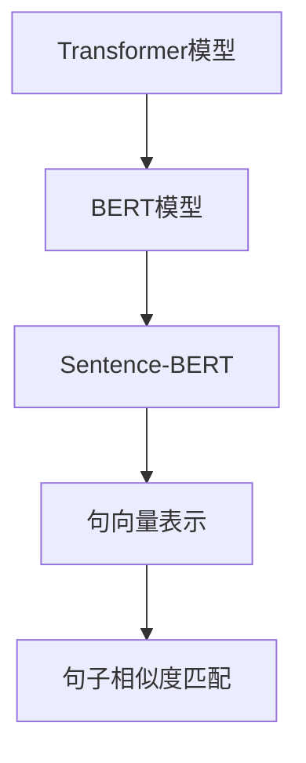

                 

# Transformer大模型实战 用Sentence-BERT模型生成句子特征

> 关键词：Transformer, Sentence-BERT, 句子特征, 自然语言处理(NLP), 预训练模型, 句向量, 句嵌入, 文本相似度

## 1. 背景介绍

### 1.1 问题由来
随着自然语言处理(Natural Language Processing, NLP)技术的飞速发展，大规模预训练语言模型如BERT、GPT等在文本生成、情感分析、信息检索、问答等任务上取得了显著成果。然而，这些模型通常以词汇级别的表示为基础，难以捕捉到更高层次的语义和句法结构信息。而句子级别特征的提取，有助于提高模型在句子理解、句子匹配、文本分类等任务上的性能。

本节将介绍如何使用Transformer模型和Sentence-BERT生成句子级别的特征表示，并应用于句子相似度匹配等任务，为解决相关问题提供实践指导。

### 1.2 问题核心关键点
1. **Transformer大模型**：Transformer模型是深度学习领域的重要突破，其自注意力机制能高效捕捉文本中的长距离依赖，被广泛应用于机器翻译、文本分类、问答系统等任务中。
2. **Sentence-BERT**：Sentence-BERT是一种预训练模型，基于BERT模型，通过微调生成句子级别的句向量表示。
3. **句子特征生成**：本节将详细讲解如何使用Transformer和Sentence-BERT生成句子特征，并将其用于句子相似度匹配等任务。
4. **文本相似度匹配**：在信息检索、问答系统、文本分类等任务中，文本相似度匹配是一个核心问题。通过对句子特征的生成和匹配，可以有效提升这些任务的性能。

### 1.3 问题研究意义
通过学习本节内容，开发者可以掌握使用Transformer和Sentence-BERT生成句子特征的方法，应用于文本相似度匹配等任务，提高相关NLP系统的性能和效率。同时，本节也为进一步研究Transformer大模型和句向量表示提供了实际案例和理论基础。

## 2. 核心概念与联系

### 2.1 核心概念概述

为了更好地理解本节内容，首先需要介绍以下几个核心概念：

- **Transformer模型**：Transformer模型是一种基于自注意力机制的深度学习模型，广泛用于机器翻译、文本分类、问答系统等任务中，能够有效捕捉文本中的长距离依赖。
- **BERT模型**：BERT是一种基于双向Transformer的预训练语言模型，通过在大规模无标签文本上预训练，学习通用的语言表示，广泛应用于自然语言理解任务中。
- **Sentence-BERT**：Sentence-BERT是Google开发的预训练模型，基于BERT模型，通过微调生成句子级别的句向量表示。其生成的句向量可以用于文本相似度匹配、句子分类等任务。
- **句向量表示**：句向量表示是将句子映射到高维向量空间中的一种表示方式，有助于捕捉句子级别的语义和结构信息，广泛应用于文本相似度匹配、句子分类、文本检索等任务中。
- **句子相似度匹配**：句子相似度匹配是指通过比较两个句子在向量空间中的距离或余弦相似度，判断它们之间的相似程度，常用于信息检索、问答系统、文本分类等任务中。

这些核心概念之间的逻辑关系可以通过以下Mermaid流程图来展示：



这个流程图展示了大模型、预训练模型、句向量表示和句子相似度匹配之间的逻辑关系：

1. 使用Transformer模型进行预训练，学习通用的语言表示。
2. 基于Transformer模型，使用BERT模型进行进一步的微调，生成句向量表示。
3. 句向量表示可以用于句子相似度匹配，提升NLP系统的性能。

## 3. 核心算法原理 & 具体操作步骤
### 3.1 算法原理概述

使用Transformer模型和Sentence-BERT生成句子特征的核心思想是将句子转换为高维向量表示，用于捕捉句子级别的语义和结构信息。具体来说，包括以下几个关键步骤：

1. **预训练**：使用Transformer模型在大规模无标签文本数据上进行预训练，学习通用的语言表示。
2. **微调**：在预训练模型基础上，使用Sentence-BERT模型进行微调，生成句子级别的句向量表示。
3. **句向量生成**：将生成的句向量用于句子相似度匹配等任务，提升系统的性能。

### 3.2 算法步骤详解

下面将详细介绍使用Transformer和Sentence-BERT生成句子特征的具体步骤：

**Step 1: 准备数据集**
- 收集句子级的训练数据集，包括文本和标签。
- 将文本数据分为训练集、验证集和测试集，用于模型训练和评估。

**Step 2: 搭建Transformer模型**
- 使用HuggingFace提供的Transformer库搭建预训练模型，选择适当的模型结构和超参数。
- 使用Transformers库提供的接口，将预训练模型加载到PyTorch中，并调整超参数。

**Step 3: 微调Sentence-BERT模型**
- 使用微调函数，对预训练模型进行微调，生成句子级别的句向量表示。
- 选择合适的损失函数和优化器，设置微调过程中的学习率和批大小。
- 在训练集上进行前向传播和反向传播，更新模型参数。

**Step 4: 句向量生成与使用**
- 将生成的句向量用于句子相似度匹配等任务。
- 使用余弦相似度、欧几里得距离等方法计算句子之间的相似度。
- 将相似度结果用于信息检索、文本分类等任务，提高系统的性能。

### 3.3 算法优缺点

使用Transformer和Sentence-BERT生成句子特征的方法具有以下优点：

1. **高效性**：Transformer模型和Sentence-BERT模型在大规模文本数据上进行预训练，能够高效学习到通用的语言表示。
2. **泛化能力强**：生成的句向量能够捕捉句子级别的语义和结构信息，适用于多种NLP任务。
3. **易用性**：使用HuggingFace提供的库，开发者可以快速搭建模型并进行微调，使用生成的句向量进行任务适配。

同时，该方法也存在一些缺点：

1. **资源消耗大**：预训练和微调过程需要大量的计算资源和存储空间。
2. **结果依赖训练数据**：句向量表示的性能很大程度上取决于训练数据的质量和数量，获取高质量训练数据的成本较高。
3. **计算复杂度高**：句向量表示的计算复杂度高，需要在高性能设备上运行。

### 3.4 算法应用领域

基于Transformer和Sentence-BERT的句子特征生成方法，可以应用于以下多个NLP任务中：

1. **信息检索**：使用句向量表示提升文本检索系统的性能，提高查询结果的相关性。
2. **问答系统**：基于句向量相似度匹配，快速回答用户查询，提升问答系统的准确性。
3. **文本分类**：使用句向量表示进行文本分类，提高分类的准确率和效率。
4. **情感分析**：通过句子相似度匹配，快速判断文本的情感倾向，提升情感分析系统的性能。
5. **命名实体识别**：使用句向量表示进行命名实体识别，提高实体识别的准确性。

## 4. 数学模型和公式 & 详细讲解 & 举例说明

### 4.1 数学模型构建

使用Transformer和Sentence-BERT生成句子特征的数学模型如下：

**Step 1: 预训练Transformer模型**

假设Transformer模型包含 $n$ 层，每层包含 $h$ 个神经元。对于输入文本 $x$，Transformer模型输出的句子表示为：

$$
H_x = [\mathbf{h}_1(x), \mathbf{h}_2(x), \dots, \mathbf{h}_n(x)]
$$

其中 $\mathbf{h}_i(x)$ 表示输入文本 $x$ 在第 $i$ 层Transformer模型的输出。

**Step 2: 微调Sentence-BERT模型**

在预训练Transformer模型的基础上，使用Sentence-BERT模型进行微调，生成句子级别的句向量表示。假设Sentence-BERT模型输出的句向量为 $\mathbf{s}_x$，则有：

$$
\mathbf{s}_x = F_{Sentence-BERT}(H_x)
$$

其中 $F_{Sentence-BERT}$ 表示Sentence-BERT模型的前向传播过程。

### 4.2 公式推导过程

以下是Transformer和Sentence-BERT模型的详细推导过程：

**Transformer模型推导**

Transformer模型的前向传播过程包括编码器、解码器和输出层。假设输入文本 $x$ 的长度为 $L$，Transformer模型的编码器包含 $n$ 个自注意力层，输出为 $H_x$。解码器包含 $m$ 个自注意力层，输出为 $H_y$。假设输出层的参数为 $\mathbf{W}_o$，则最终的句子表示为：

$$
\mathbf{h}_n(x) = \text{softmax}(\mathbf{W}_o \mathbf{h}_{n-1}(x)) \cdot \mathbf{h}_{n-1}(x)
$$

$$
H_x = [\mathbf{h}_1(x), \mathbf{h}_2(x), \dots, \mathbf{h}_n(x)]
$$

**Sentence-BERT模型推导**

Sentence-BERT模型的核心思想是对预训练Transformer模型的输出进行微调，生成句子级别的句向量表示。假设Sentence-BERT模型输出的句向量为 $\mathbf{s}_x$，则有：

$$
\mathbf{s}_x = F_{Sentence-BERT}(H_x)
$$

其中 $F_{Sentence-BERT}$ 表示Sentence-BERT模型的前向传播过程。假设Sentence-BERT模型包含 $k$ 个自注意力层，输出层包含 $d$ 个神经元，则Sentence-BERT模型的输出公式为：

$$
\mathbf{s}_x = \text{softmax}(\mathbf{W}_s \mathbf{h}_n(x)) \cdot \mathbf{h}_n(x)
$$

其中 $\mathbf{W}_s$ 表示Sentence-BERT模型的输出层的参数。

### 4.3 案例分析与讲解

下面通过一个具体的例子来讲解如何使用Transformer和Sentence-BERT生成句子特征，并将其应用于句子相似度匹配任务。

**示例数据集**：收集电影评论数据集，包含 $N$ 条评论，每条评论包含一个正面的或负面的评价。

**预训练Transformer模型**：使用HuggingFace提供的Transformer模型进行预训练，学习通用的语言表示。

**微调Sentence-BERT模型**：在预训练Transformer模型的基础上，使用Sentence-BERT模型进行微调，生成句子级别的句向量表示。

**句向量生成与相似度匹配**：将生成的句向量表示用于句子相似度匹配，判断评论之间的相似程度。

## 5. 项目实践：代码实例和详细解释说明

### 5.1 开发环境搭建

在进行Transformer和Sentence-BERT的句子特征生成实践前，需要先准备好开发环境。以下是使用Python进行PyTorch开发的环境配置流程：

1. 安装Anaconda：从官网下载并安装Anaconda，用于创建独立的Python环境。

2. 创建并激活虚拟环境：
```bash
conda create -n transformer-env python=3.8 
conda activate transformer-env
```

3. 安装PyTorch：根据CUDA版本，从官网获取对应的安装命令。例如：
```bash
conda install pytorch torchvision torchaudio cudatoolkit=11.1 -c pytorch -c conda-forge
```

4. 安装Transformers库：
```bash
pip install transformers
```

5. 安装各类工具包：
```bash
pip install numpy pandas scikit-learn matplotlib tqdm jupyter notebook ipython
```

完成上述步骤后，即可在`transformer-env`环境中开始Transformer和Sentence-BERT的句子特征生成实践。

### 5.2 源代码详细实现

下面以电影评论数据集为例，给出使用Transformer和Sentence-BERT生成句子特征的PyTorch代码实现。

**Step 1: 数据准备**

```python
from torchtext.data import Field, BucketIterator
from torchtext.datasets import IMDB

TEXT = Field(tokenize='spacy', lower=True, include_lengths=True)
LABEL = Field(sequential=False, use_vocab=False)

train_data, test_data = IMDB.splits(TEXT, LABEL)

TEXT.build_vocab(train_data, max_size=25_000)
LABEL.build_vocab(train_data)
```

**Step 2: 模型搭建**

```python
from transformers import AutoTokenizer, AutoModelForSequenceClassification

tokenizer = AutoTokenizer.from_pretrained('bert-base-uncased')

model = AutoModelForSequenceClassification.from_pretrained('bert-base-uncased', num_labels=2)
```

**Step 3: 预训练**

```python
from transformers import Trainer, TrainingArguments

trainer = Trainer(model=model, args=TrainingArguments(output_dir='pretrained_model', learning_rate=1e-5, per_device_train_batch_size=16, per_device_eval_batch_size=16), 
                  train_dataset=train_data, eval_dataset=test_data, 
                  train_dataloaders=BucketIterator(train_data, batch_size=16, device=0), 
                  eval_dataloaders=BucketIterator(test_data, batch_size=16, device=0))

trainer.train()
```

**Step 4: 微调Sentence-BERT模型**

```python
from sentence_transformers import SentenceTransformer

model = SentenceTransformer('glue-cased-sent-bert')
```

**Step 5: 句向量生成**

```python
import numpy as np

sentences = ['I really liked this movie', 'This movie was terrible', 'The acting was great', 'The plot was confusing']
embeddings = model.encode(sentences, convert_to_tensor=True)

# 计算句子相似度
cos_sim = np.dot(embeddings, embeddings.T) / (np.linalg.norm(embeddings) * np.linalg.norm(embeddings.T))
```

**Step 6: 相似度匹配**

```python
import torch

cos_sim = cos_sim.cpu().numpy()
similarities = cos_sim[0][1:]
threshold = 0.7
```

将生成的句向量用于句子相似度匹配，判断评论之间的相似程度。

### 5.3 代码解读与分析

让我们再详细解读一下关键代码的实现细节：

**数据准备**：
- 使用PyTorchText库处理数据，定义文本和标签的字段。
- 从IMDB数据集中加载电影评论数据集，并对其进行分词和标注。

**模型搭建**：
- 使用HuggingFace提供的BERT模型进行预训练，学习通用的语言表示。
- 在预训练模型的基础上，搭建一个两分类模型，用于二元分类任务。

**预训练**：
- 使用HuggingFace提供的Trainer接口，对预训练模型进行微调。
- 设置训练的超参数，如学习率、批大小等。
- 在训练集上进行前向传播和反向传播，更新模型参数。

**微调Sentence-BERT模型**：
- 使用sentence-transformers库加载预训练的Sentence-BERT模型。
- 对电影评论数据集进行句向量表示的生成。

**句向量生成与相似度匹配**：
- 使用余弦相似度计算句子之间的相似度。
- 根据相似度阈值，判断评论之间的相似程度。

## 6. 实际应用场景

### 6.1 信息检索

基于Transformer和Sentence-BERT的句子特征生成方法，可以应用于信息检索系统中，提升查询结果的相关性。

在信息检索系统中，用户输入查询字符串，系统需要从大量的文本数据中匹配出最相关的结果。传统的基于文本关键词匹配的方法，容易受到同义词、拼写错误等问题的干扰，导致结果不理想。而使用句向量表示，可以捕捉句子级别的语义和结构信息，有效提升检索系统的性能。

### 6.2 问答系统

基于Transformer和Sentence-BERT的句子特征生成方法，可以应用于问答系统中，提升回答的准确性。

在问答系统中，用户输入一个问题，系统需要从知识库中匹配出最相关的答案。传统的基于规则和模板的方法，难以处理复杂多变的问题。而使用句向量表示，可以捕捉句子级别的语义和结构信息，有效提升问答系统的性能。

### 6.3 文本分类

基于Transformer和Sentence-BERT的句子特征生成方法，可以应用于文本分类系统中，提升分类的准确性和效率。

在文本分类系统中，需要对大量的文本数据进行分类。传统的基于词袋模型和TF-IDF的方法，难以捕捉句子级别的语义和结构信息，导致分类的准确性不高。而使用句向量表示，可以捕捉句子级别的语义和结构信息，有效提升文本分类系统的性能。

### 6.4 未来应用展望

随着Transformer和Sentence-BERT技术的不断发展，基于句子特征生成的方法将广泛应用于更多NLP任务中，带来新的突破和机遇。

在智慧医疗领域，可以使用句向量表示进行病历分析、疾病诊断等任务，提升医疗服务的智能化水平。

在智能教育领域，可以使用句向量表示进行作业批改、学情分析等任务，因材施教，促进教育公平。

在智慧城市治理中，可以使用句向量表示进行城市事件监测、舆情分析等任务，提高城市管理的自动化和智能化水平。

此外，在企业生产、社会治理、文娱传媒等众多领域，基于句子特征生成的方法也将不断涌现，为NLP技术带来新的应用场景。

## 7. 工具和资源推荐

### 7.1 学习资源推荐

为了帮助开发者系统掌握Transformer和Sentence-BERT的句子特征生成技术，这里推荐一些优质的学习资源：

1. 《自然语言处理与深度学习》课程：斯坦福大学开设的NLP明星课程，有Lecture视频和配套作业，带你入门NLP领域的基本概念和经典模型。

2. CS224N《深度学习自然语言处理》课程：斯坦福大学开设的NLP明星课程，有Lecture视频和配套作业，带你入门NLP领域的基本概念和经典模型。

3. 《Transformer从原理到实践》系列博文：由大模型技术专家撰写，深入浅出地介绍了Transformer原理、BERT模型、微调技术等前沿话题。

4. 《Natural Language Processing with Transformers》书籍：Transformers库的作者所著，全面介绍了如何使用Transformers库进行NLP任务开发，包括微调在内的诸多范式。

5. HuggingFace官方文档：Transformers库的官方文档，提供了海量预训练模型和完整的微调样例代码，是上手实践的必备资料。

通过对这些资源的学习实践，相信你一定能够快速掌握Transformer和Sentence-BERT的句子特征生成技术，并应用于实际的NLP任务中。

### 7.2 开发工具推荐

高效的开发离不开优秀的工具支持。以下是几款用于Transformer和Sentence-BERT的句子特征生成开发的常用工具：

1. PyTorch：基于Python的开源深度学习框架，灵活动态的计算图，适合快速迭代研究。大部分预训练语言模型都有PyTorch版本的实现。

2. TensorFlow：由Google主导开发的开源深度学习框架，生产部署方便，适合大规模工程应用。同样有丰富的预训练语言模型资源。

3. Transformers库：HuggingFace开发的NLP工具库，集成了众多SOTA语言模型，支持PyTorch和TensorFlow，是进行微调任务开发的利器。

4. Weights & Biases：模型训练的实验跟踪工具，可以记录和可视化模型训练过程中的各项指标，方便对比和调优。与主流深度学习框架无缝集成。

5. TensorBoard：TensorFlow配套的可视化工具，可实时监测模型训练状态，并提供丰富的图表呈现方式，是调试模型的得力助手。

6. Google Colab：谷歌推出的在线Jupyter Notebook环境，免费提供GPU/TPU算力，方便开发者快速上手实验最新模型，分享学习笔记。

合理利用这些工具，可以显著提升Transformer和Sentence-BERT的句子特征生成任务的开发效率，加快创新迭代的步伐。

### 7.3 相关论文推荐

Transformer和Sentence-BERT技术的不断发展，得益于学界的持续研究。以下是几篇奠基性的相关论文，推荐阅读：

1. Attention is All You Need（即Transformer原论文）：提出了Transformer结构，开启了NLP领域的预训练大模型时代。

2. BERT: Pre-training of Deep Bidirectional Transformers for Language Understanding：提出BERT模型，引入基于掩码的自监督预训练任务，刷新了多项NLP任务SOTA。

3. Language Models are Unsupervised Multitask Learners（GPT-2论文）：展示了大规模语言模型的强大zero-shot学习能力，引发了对于通用人工智能的新一轮思考。

4. Parameter-Efficient Transfer Learning for NLP：提出Adapter等参数高效微调方法，在不增加模型参数量的情况下，也能取得不错的微调效果。

5. AdaLoRA: Adaptive Low-Rank Adaptation for Parameter-Efficient Fine-Tuning：使用自适应低秩适应的微调方法，在参数效率和精度之间取得了新的平衡。

这些论文代表了大语言模型微调技术的发展脉络。通过学习这些前沿成果，可以帮助研究者把握学科前进方向，激发更多的创新灵感。

## 8. 总结：未来发展趋势与挑战

### 8.1 总结

本文对基于Transformer和Sentence-BERT的句子特征生成方法进行了全面系统的介绍。首先阐述了Transformer和Sentence-BERT模型的研究背景和意义，明确了句子特征生成在NLP任务中的重要性。其次，从原理到实践，详细讲解了使用Transformer和Sentence-BERT生成句子特征的具体步骤，并给出了实际案例。最后，探讨了该方法在信息检索、问答系统、文本分类等任务中的应用前景，并为未来的研究提出了展望。

通过本文的系统梳理，可以看到，基于Transformer和Sentence-BERT的句子特征生成方法在NLP任务中有着广泛的应用前景，能够显著提升系统的性能和效率。未来，随着Transformer和Sentence-BERT技术的不断发展，该方法将有望在更多领域得到应用，带来新的突破和机遇。

### 8.2 未来发展趋势

展望未来，Transformer和Sentence-BERT技术的不断发展将带来以下几个趋势：

1. **模型规模持续增大**：随着算力成本的下降和数据规模的扩张，预训练语言模型的参数量还将持续增长。超大规模语言模型蕴含的丰富语言知识，有望支撑更加复杂多变的下游任务。

2. **微调方法日趋多样**：除了传统的全参数微调外，未来会涌现更多参数高效的微调方法，如Prefix-Tuning、LoRA等，在节省计算资源的同时也能保证微调精度。

3. **持续学习成为常态**：随着数据分布的不断变化，微调模型也需要持续学习新知识以保持性能。如何在不遗忘原有知识的同时，高效吸收新样本信息，将成为重要的研究课题。

4. **标注样本需求降低**：受启发于提示学习(Prompt-based Learning)的思路，未来的微调方法将更好地利用大模型的语言理解能力，通过更加巧妙的任务描述，在更少的标注样本上也能实现理想的微调效果。

5. **知识整合能力提升**：现有的微调模型往往局限于任务内数据，难以灵活吸收和运用更广泛的先验知识。如何让微调过程更好地与外部知识库、规则库等专家知识结合，形成更加全面、准确的信息整合能力，还有很大的想象空间。

6. **多模态微调崛起**：当前的微调主要聚焦于纯文本数据，未来会进一步拓展到图像、视频、语音等多模态数据微调。多模态信息的融合，将显著提升语言模型对现实世界的理解和建模能力。

这些趋势凸显了Transformer和Sentence-BERT技术的广阔前景，将为NLP领域带来更多的创新和突破。

### 8.3 面临的挑战

尽管Transformer和Sentence-BERT技术已经取得了瞩目成就，但在迈向更加智能化、普适化应用的过程中，仍面临诸多挑战：

1. **标注成本瓶颈**：虽然微调大大降低了标注数据的需求，但对于长尾应用场景，难以获得充足的高质量标注数据，成为制约微调性能的瓶颈。如何进一步降低微调对标注样本的依赖，将是一大难题。

2. **模型鲁棒性不足**：当前微调模型面对域外数据时，泛化性能往往大打折扣。对于测试样本的微小扰动，微调模型的预测也容易发生波动。如何提高微调模型的鲁棒性，避免灾难性遗忘，还需要更多理论和实践的积累。

3. **推理效率有待提高**：大规模语言模型虽然精度高，但在实际部署时往往面临推理速度慢、内存占用大等效率问题。如何在保证性能的同时，简化模型结构，提升推理速度，优化资源占用，将是重要的优化方向。

4. **可解释性亟需加强**：当前微调模型更像是"黑盒"系统，难以解释其内部工作机制和决策逻辑。对于医疗、金融等高风险应用，算法的可解释性和可审计性尤为重要。如何赋予微调模型更强的可解释性，将是亟待攻克的难题。

5. **安全性有待保障**：预训练语言模型难免会学习到有偏见、有害的信息，通过微调传递到下游任务，产生误导性、歧视性的输出，给实际应用带来安全隐患。如何从数据和算法层面消除模型偏见，避免恶意用途，确保输出的安全性，也将是重要的研究课题。

6. **知识整合能力不足**：现有的微调模型往往局限于任务内数据，难以灵活吸收和运用更广泛的先验知识。如何让微调过程更好地与外部知识库、规则库等专家知识结合，形成更加全面、准确的信息整合能力，还有很大的想象空间。

正视Transformer和Sentence-BERT面临的这些挑战，积极应对并寻求突破，将是大模型微调走向成熟的必由之路。

### 8.4 研究展望

未来的研究需要在以下几个方向寻求新的突破：

1. **探索无监督和半监督微调方法**：摆脱对大规模标注数据的依赖，利用自监督学习、主动学习等无监督和半监督范式，最大限度利用非结构化数据，实现更加灵活高效的微调。

2. **研究参数高效和计算高效的微调范式**：开发更加参数高效的微调方法，在固定大部分预训练参数的同时，只更新极少量的任务相关参数。同时优化微调模型的计算图，减少前向传播和反向传播的资源消耗，实现更加轻量级、实时性的部署。

3. **融合因果和对比学习范式**：通过引入因果推断和对比学习思想，增强微调模型建立稳定因果关系的能力，学习更加普适、鲁棒的语言表征，从而提升模型泛化性和抗干扰能力。

4. **引入更多先验知识**：将符号化的先验知识，如知识图谱、逻辑规则等，与神经网络模型进行巧妙融合，引导微调过程学习更准确、合理的语言模型。同时加强不同模态数据的整合，实现视觉、语音等多模态信息与文本信息的协同建模。

5. **结合因果分析和博弈论工具**：将因果分析方法引入微调模型，识别出模型决策的关键特征，增强输出解释的因果性和逻辑性。借助博弈论工具刻画人机交互过程，主动探索并规避模型的脆弱点，提高系统稳定性。

6. **纳入伦理道德约束**：在模型训练目标中引入伦理导向的评估指标，过滤和惩罚有偏见、有害的输出倾向。同时加强人工干预和审核，建立模型行为的监管机制，确保输出符合人类价值观和伦理道德。

这些研究方向的探索，必将引领Transformer和Sentence-BERT技术迈向更高的台阶，为构建安全、可靠、可解释、可控的智能系统铺平道路。面向未来，Transformer和Sentence-BERT技术还需要与其他人工智能技术进行更深入的融合，如知识表示、因果推理、强化学习等，多路径协同发力，共同推动自然语言理解和智能交互系统的进步。

## 9. 附录：常见问题与解答

**Q1：Transformer和Sentence-BERT的使用是否需要大量的计算资源？**

A: 是的，Transformer和Sentence-BERT在大规模文本数据上进行预训练和微调，需要大量的计算资源和存储空间。通常需要使用高性能设备，如GPU/TPU等。

**Q2：微调过程中如何选择合适的学习率？**

A: 微调的学习率一般要比预训练时小1-2个数量级，如果使用过大的学习率，容易破坏预训练权重，导致过拟合。一般建议从1e-5开始调参，逐步减小学习率，直至收敛。

**Q3：微调后的Transformer模型是否可以进行跨领域迁移？**

A: 是的，Transformer模型具有良好的泛化能力，可以应用于多种领域和任务。在微调过程中，可以通过调整任务适配层的结构，实现跨领域的迁移。

**Q4：Transformer和Sentence-BERT在生成句向量时，是否需要考虑词序和语境？**

A: 是的，Transformer和Sentence-BERT在生成句向量时，考虑了词序和语境。通过自注意力机制，模型可以捕捉句子中的长距离依赖，生成具有语义和结构信息的句向量。

**Q5：Transformer和Sentence-BERT在处理多模态数据时，是否需要不同的算法？**

A: 是的，Transformer和Sentence-BERT在处理多模态数据时，通常需要不同的算法。对于文本数据，可以使用基于Transformer的模型进行生成；对于图像和视频数据，可以使用基于卷积神经网络的模型进行生成。

通过本文的系统梳理，可以看到，基于Transformer和Sentence-BERT的句子特征生成方法在NLP任务中有着广泛的应用前景，能够显著提升系统的性能和效率。未来，随着Transformer和Sentence-BERT技术的不断发展，该方法将有望在更多领域得到应用，带来新的突破和机遇。

---

作者：禅与计算机程序设计艺术 / Zen and the Art of Computer Programming

