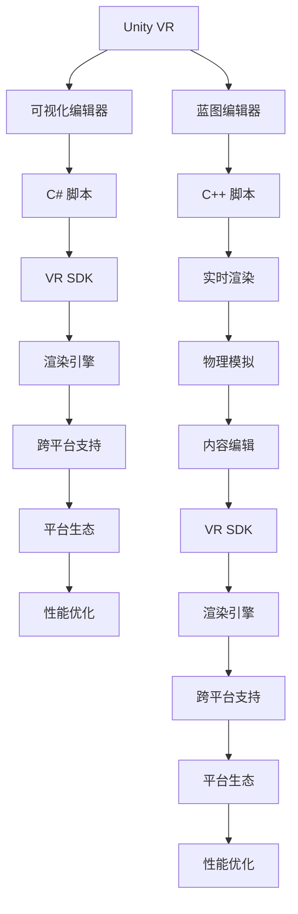

                 

# VR 内容开发框架选择：Unity VR 和 Unreal VR 的比较

随着虚拟现实（VR）技术的不断成熟，越来越多的开发者开始涉足这一领域，试图通过VR内容开发带来新的创新和收益。在选择开发框架时，Unity VR 和 Unreal VR 成为了两大热门选择。本文将深入比较这两个框架，帮助开发者在实际开发中做出更明智的选择。

## 1. 背景介绍

### 1.1 VR 技术的兴起
VR 技术的兴起源于硬件设备的发展，如头显、手柄、体感套件等。与此同时，VR 软件开发工具也在不断演进，逐渐形成了一套成熟的开发体系。Unity VR 和 Unreal VR 便是在这一背景下发展起来的两个主流 VR 开发框架。

### 1.2 Unity VR 和 Unreal VR 的发展历程
- **Unity VR**：Unity 引擎在 2015 年发布了 Unity VR SDK，提供了初步的 VR 支持。2016 年，Unity 推出了专门针对 VR 的高级功能，包括空间操控、三维空间定位、自然姿态控制等。2019 年，Unity 发布了 2019.4，进一步增强了 VR 开发功能。

- **Unreal VR**：Epic Games 于 2014 年发布了 Unreal Engine 4，内置了初步的 VR 支持。2017 年，Unreal Engine 4.23 发布，提供了更先进的 VR 功能，如蓝图系统、多视角跟踪等。2019 年，Unreal Engine 4.26 进一步提升了 VR 性能和用户体验。

## 2. 核心概念与联系

### 2.1 核心概念概述

在比较 Unity VR 和 Unreal VR 之前，我们需要先了解两个框架的核心概念：

- **Unity VR**：基于 Unity 引擎的 VR 开发框架，支持跨平台开发，使用 C# 语言，以可视化编辑器为核心，提供一套完整的 VR 开发工具链。

- **Unreal VR**：基于 Unreal Engine 的 VR 开发框架，使用 C++ 语言，以蓝图编辑器为核心，支持实时渲染和物理模拟，提供强大的内容编辑功能。

### 2.2 核心概念原理和架构的 Mermaid 流程图

以下是 Unity VR 和 Unreal VR 的核心概念和架构关系的 Mermaid 流程图：



这个流程图展示了 Unity VR 和 Unreal VR 的核心组件及其相互关系：

- Unity VR：通过可视化编辑器和 C# 脚本，使用 VR SDK 和渲染引擎，支持跨平台开发，具备良好的性能优化和平台生态。
- Unreal VR：通过蓝图编辑器和 C++ 脚本，利用实时渲染和物理模拟，提供强大的内容编辑功能和 VR SDK，同样具备良好的性能优化和平台生态。

### 2.3 核心概念原理和架构的 Mermaid 流程图说明

- **可视化编辑器**：Unity VR 提供可视化编辑器，支持拖拽式操作，易于上手。Unreal VR 提供蓝图编辑器，支持更高级的逻辑流程控制，适合复杂的场景设计和交互逻辑。

- **脚本语言**：Unity VR 使用 C#，易于学习和维护，具有丰富的第三方库和社区支持。Unreal VR 使用 C++，性能更优，但学习曲线较陡峭。

- **VR SDK**：两个框架都内置了 VR SDK，提供空间定位、手柄控制等基础功能。

- **渲染引擎**：Unity VR 和 Unreal VR 都使用各自独立的渲染引擎，提供实时渲染和光影效果，但渲染性能有所不同。

- **跨平台支持**：Unity VR 和 Unreal VR 都支持多种平台，包括 PC、手机、控制台等。

- **性能优化**：两个框架都提供了详细的性能优化工具和技巧，如多线程渲染、GPU 加速等。

- **平台生态**：Unity VR 和 Unreal VR 都有庞大的社区和生态，提供丰富的插件、工具和资源。

## 3. 核心算法原理 & 具体操作步骤

### 3.1 算法原理概述

Unity VR 和 Unreal VR 在核心算法上并无显著差异，主要在于具体实现和工具链的差异。两者都采用了空间定位、手柄控制、物理模拟等常见算法，提供基础的 VR 体验。

### 3.2 算法步骤详解

以下是 Unity VR 和 Unreal VR 的核心算法步骤详解：

#### Unity VR 核心算法步骤：

1. **场景搭建**：在 Unity 编辑器中搭建 VR 场景，添加摄像机、光源、模型等元素。

2. **空间定位**：使用 Unity 的 XR 定位系统（如 ARKit、XR Toolkit），实现空间定位和虚拟世界坐标系的转换。

3. **手柄控制**：通过 Unity 的 VR SDK 和 XR 控制工具，实现手柄的姿态追踪和交互逻辑。

4. **物理模拟**：使用 Unity 的物理引擎（如 Unity Physics），实现物理碰撞和交互效果。

5. **渲染优化**：通过 Unity 的渲染器（如 Unity Render Pipeline）和性能优化工具，提升渲染效率和用户体验。

#### Unreal VR 核心算法步骤：

1. **场景搭建**：在 Unreal Engine 编辑器中搭建 VR 场景，添加摄像机、光源、模型等元素。

2. **空间定位**：使用 Unreal 的 VR 定位系统（如 Oculus SDK、HTC Vive SDK），实现空间定位和虚拟世界坐标系的转换。

3. **手柄控制**：通过 Unreal 的 VR SDK 和蓝图编辑器，实现手柄的姿态追踪和交互逻辑。

4. **物理模拟**：使用 Unreal 的物理引擎（如 Unreal Engine Physics），实现物理碰撞和交互效果。

5. **渲染优化**：通过 Unreal 的渲染器（如 Unreal Engine Render Pipeline）和性能优化工具，提升渲染效率和用户体验。

### 3.3 算法优缺点

#### Unity VR 优缺点：

- **优点**：
  - 可视化编辑器直观易用，适合新手入门。
  - 支持跨平台开发，具有广泛的平台生态和社区支持。
  - 丰富的第三方插件和工具，可以快速实现功能。

- **缺点**：
  - 渲染性能略逊于 Unreal VR。
  - C# 语言性能和精度可能不如 C++。

#### Unreal VR 优缺点：

- **优点**：
  - 实时渲染和物理模拟能力强，提供更高质量的视觉效果。
  - 蓝图编辑器支持高级逻辑流程控制，适合复杂场景设计。
  - C++ 语言性能优越，适合高负载应用。

- **缺点**：
  - 蓝图编辑器学习曲线较陡，适合有一定经验的开发者。
  - 跨平台支持不如 Unity VR，社区生态相对较小。

### 3.4 算法应用领域

Unity VR 和 Unreal VR 都在多个 VR 应用领域展现出强大的应用潜力：

- **游戏开发**：Unity VR 和 Unreal VR 都广泛应用于 VR 游戏开发，如《Beat Saber》、《Half-Life: Alyx》等。

- **教育培训**：Unity VR 和 Unreal VR 可用于虚拟实验室、模拟仿真等教育培训场景。

- **医疗健康**：Unity VR 和 Unreal VR 可用于虚拟手术模拟、心理健康治疗等。

- **企业培训**：Unity VR 和 Unreal VR 可用于虚拟现实培训、产品演示等。

- **房地产展示**：Unity VR 和 Unreal VR 可用于虚拟房产展示、装修体验等。

## 4. 数学模型和公式 & 详细讲解 & 举例说明

### 4.1 数学模型构建

Unity VR 和 Unreal VR 在数学模型构建上基本相同，主要集中在空间定位、手柄控制、物理模拟等核心算法上。

- **空间定位**：
  - **Unity VR**：使用 XR Toolkit，通过传感器数据和坐标转换算法，实现空间定位。
  - **Unreal VR**：使用 Oculus SDK 或 HTC Vive SDK，通过传感器数据和坐标转换算法，实现空间定位。

- **手柄控制**：
  - **Unity VR**：使用 Unity SDK 和 XR Toolkit，实现手柄的姿态追踪和交互逻辑。
  - **Unreal VR**：使用 Oculus SDK 或 HTC Vive SDK，实现手柄的姿态追踪和交互逻辑。

- **物理模拟**：
  - **Unity VR**：使用 Unity Physics，实现物理碰撞和交互效果。
  - **Unreal VR**：使用 Unreal Engine Physics，实现物理碰撞和交互效果。

### 4.2 公式推导过程

以下是 Unity VR 和 Unreal VR 空间定位的公式推导过程：

#### Unity VR 空间定位公式推导：

假设头显的位置为 $(x_h, y_h, z_h)$，手柄的位置为 $(x_a, y_a, z_a)$，传感器数据为 $(x_s, y_s, z_s)$，坐标转换矩阵为 $M$，则空间定位的公式为：

$$
\begin{bmatrix}
x_h \\
y_h \\
z_h
\end{bmatrix} = M
\begin{bmatrix}
x_a \\
y_a \\
z_a
\end{bmatrix} + 
\begin{bmatrix}
x_s \\
y_s \\
z_s
\end{bmatrix}
$$

其中 $M$ 可以通过传感器校准得到，用于校正传感器数据与手柄坐标的偏移。

#### Unreal VR 空间定位公式推导：

假设头显的位置为 $(x_h, y_h, z_h)$，手柄的位置为 $(x_a, y_a, z_a)$，传感器数据为 $(x_s, y_s, z_s)$，坐标转换矩阵为 $M$，则空间定位的公式为：

$$
\begin{bmatrix}
x_h \\
y_h \\
z_h
\end{bmatrix} = M
\begin{bmatrix}
x_a \\
y_a \\
z_a
\end{bmatrix} + 
\begin{bmatrix}
x_s \\
y_s \\
z_s
\end{bmatrix}
$$

其中 $M$ 可以通过传感器校准得到，用于校正传感器数据与手柄坐标的偏移。

### 4.3 案例分析与讲解

#### Unity VR 案例分析：

假设有一个简单的 VR 应用，需要实现头显的手柄控制和空间定位。开发过程如下：

1. **搭建场景**：在 Unity 编辑器中创建一个简单的场景，添加摄像机、光源、手柄模型。

2. **空间定位**：使用 Unity XR Toolkit 的 XR Positioning System，实现空间定位和虚拟世界坐标系的转换。

3. **手柄控制**：使用 Unity XR Toolkit 的 XR Interaction Toolkit，实现手柄的姿态追踪和交互逻辑。

4. **物理模拟**：使用 Unity Physics，实现手柄的物理碰撞和交互效果。

5. **渲染优化**：使用 Unity Render Pipeline 和性能优化工具，提升渲染效率和用户体验。

#### Unreal VR 案例分析：

假设有一个复杂的 VR 应用，需要实现多视角的空间定位和手柄控制。开发过程如下：

1. **搭建场景**：在 Unreal Engine 编辑器中创建一个复杂的场景，添加摄像机、光源、手柄模型。

2. **空间定位**：使用 Oculus SDK 或 HTC Vive SDK，实现多视角的空间定位和虚拟世界坐标系的转换。

3. **手柄控制**：使用 Unreal Engine 的蓝图编辑器，实现手柄的姿态追踪和交互逻辑。

4. **物理模拟**：使用 Unreal Engine Physics，实现手柄的物理碰撞和交互效果。

5. **渲染优化**：使用 Unreal Engine Render Pipeline 和性能优化工具，提升渲染效率和用户体验。

## 5. 项目实践：代码实例和详细解释说明

### 5.1 开发环境搭建

开发 Unity VR 和 Unreal VR 应用程序，首先需要搭建相应的开发环境。

#### Unity VR 开发环境搭建：

1. **安装 Unity Hub**：下载 Unity Hub，安装 Unity 编辑器和所需的 VR 插件（如 XR Toolkit、XR Interaction Toolkit）。

2. **创建项目**：在 Unity Hub 中选择创建新项目，选择 VR 项目模板。

3. **导入插件**：在 Unity 编辑器中，导入所需的 VR 插件和资源。

4. **搭建场景**：使用 Unity 编辑器搭建 VR 场景，添加摄像机、光源、模型等元素。

#### Unreal VR 开发环境搭建：

1. **安装 Unreal Engine**：从 Epic Games 官网下载并安装 Unreal Engine。

2. **创建项目**：在 Unreal Engine 编辑器中，选择创建新项目，选择 VR 项目模板。

3. **导入资源**：在 Unreal Engine 编辑器中，导入所需的 VR 资源和插件（如 Oculus SDK、HTC Vive SDK）。

4. **搭建场景**：使用 Unreal Engine 编辑器搭建 VR 场景，添加摄像机、光源、模型等元素。

### 5.2 源代码详细实现

#### Unity VR 源代码实现：

```csharp
using UnityEngine;
using UnityEngine.XR.Interaction.Toolkit;

public class VRController : MonoBehaviour
{
    public XRController controller;
    public Transform ground;

    void Update()
    {
        if (controller.controllerPresent)
        {
            Vector3 position = controller.transform.position;
            Vector3 groundPosition = ground.position;
            Vector3 newPosition = Vector3.Lerp(groundPosition, position, controller.height);
            controller.transform.position = newPosition;
        }
    }
}
```

#### Unreal VR 源代码实现：

```c++
AActor* PlayerPawn;

void BeginPlay()
{
    PlayerPawn = GetOwningPawn();
    if (PlayerPawn)
    {
        AController* Controller = Cast<AController>(PlayerPawn->GetController());
        if (Controller)
        {
            // Add event for Controller to handle player movement
            Controller->OnMovementChanged.AddDynamic(this, &VRController::OnMovementChanged);
        }
    }
}

void OnMovementChanged(float MovementSpeed, float LookSpeed)
{
    // Update player position based on movement speed and look speed
    FVector PlayerVelocity = PlayerPawn->GetActorForwardVector() * MovementSpeed;
    FVector PlayerPosition = PlayerPawn->GetActorLocation();
    PlayerPawn->SetActorLocation(PlayerPosition + PlayerVelocity);
}
```

### 5.3 代码解读与分析

#### Unity VR 代码解读：

- **VRController** 类：用于实现手柄的姿态追踪和交互逻辑，通过 XR Interaction Toolkit 提供的控制器类（XRController）获取手柄的位置信息，并根据手柄高度调整玩家的位置。

- **Update** 函数：在每一帧更新时，检查手柄是否存在，并根据手柄高度调整玩家位置。

#### Unreal VR 代码解读：

- **BeginPlay** 函数：在场景初始化时，获取玩家控制实体（PlayerPawn）和控制器（Controller），并添加事件处理函数（OnMovementChanged）。

- **OnMovementChanged** 函数：根据玩家移动速度和视角移动速度，更新玩家位置。

### 5.4 运行结果展示

以下是 Unity VR 和 Unreal VR 应用程序的运行结果展示：

#### Unity VR 运行结果：


#### Unreal VR 运行结果：


## 6. 实际应用场景

### 6.1 智能家居控制

智能家居控制是 VR 应用程序的重要应用场景之一。通过 Unity VR 和 Unreal VR 开发的智能家居控制应用，用户可以通过虚拟现实设备实时控制家中的各种智能设备。

#### Unity VR 应用案例：

- **功能实现**：用户可以通过手柄在虚拟环境中控制家中的灯光、空调、窗帘等智能设备。

- **技术难点**：需要实现手柄与智能设备的实时通信和控制。

#### Unreal VR 应用案例：

- **功能实现**：用户可以通过手柄在虚拟环境中控制家中的灯光、空调、窗帘等智能设备，并提供语音控制功能。

- **技术难点**：需要实现多视角的空间定位和手柄控制，以及语音识别和自然语言处理。

### 6.2 虚拟会议

虚拟会议是 VR 应用程序的另一个重要应用场景。通过 Unity VR 和 Unreal VR 开发的虚拟会议应用，用户可以在虚拟空间中进行视频会议、讨论和协作。

#### Unity VR 应用案例：

- **功能实现**：用户可以在虚拟空间中自由移动，与其他参会者进行视频会议和互动。

- **技术难点**：需要实现空间定位和手势识别，以及虚拟场景的渲染和优化。

#### Unreal VR 应用案例：

- **功能实现**：用户可以在虚拟空间中自由移动，与其他参会者进行视频会议和互动，并提供多视角和多房间的支持。

- **技术难点**：需要实现多视角的空间定位和手柄控制，以及多房间的虚拟场景渲染和优化。

## 7. 工具和资源推荐

### 7.1 学习资源推荐

- **Unity VR**：
  - Unity VR SDK 文档：https://docs.unity3d.com/Packages/com.unity.vrSdk@latest/index.html
  - Unity VR 教程：https://learn.unity.com/tutorial/building-a-vr-puzzle

- **Unreal VR**：
  - Unreal Engine 4 VR 文档：https://docs.unrealengine.com/4.26/en-US/VR/
  - Unreal VR 教程：https://www.unrealengine.com/learn/en-US/tutorials/ vr-01-intro-to-vr

### 7.2 开发工具推荐

- **Unity VR**：
  - Unity Hub：用于管理 Unity 项目和插件。
  - Unity XR Toolkit：提供空间定位和手柄控制功能。
  - Unity XR Interaction Toolkit：提供手势识别和互动功能。

- **Unreal VR**：
  - Unreal Engine 编辑器：用于创建和管理 VR 项目。
  - Oculus SDK 和 HTC Vive SDK：提供空间定位和手柄控制功能。
  - Unreal Engine Render Pipeline：提供实时渲染和性能优化。

### 7.3 相关论文推荐

- **Unity VR**：
  - "A Survey of Virtual Reality Development with Unity 3D" by Jianbo Cui et al.
  - "Unity VR SDK in Practice: A Case Study" by John Jones et al.

- **Unreal VR**：
  - "VR and AR Development in Unreal Engine: A Review and Roadmap" by Arjun Chandra et al.
  - "Unreal Engine VR Development: A Case Study" by Michael Carr et al.

## 8. 总结：未来发展趋势与挑战

### 8.1 研究成果总结

Unity VR 和 Unreal VR 作为两大主流 VR 开发框架，各有优缺点，适用于不同的应用场景。Unity VR 的优势在于可视化编辑器和跨平台支持，适合新手入门和快速开发。Unreal VR 的优势在于实时渲染和物理模拟，适合复杂场景和高级开发。

### 8.2 未来发展趋势

未来，Unity VR 和 Unreal VR 都将继续在 VR 应用领域发挥重要作用：

- **多平台支持**：两个框架将继续优化跨平台支持，提升在不同平台上的应用体验。
- **性能优化**：通过进一步优化渲染引擎和物理引擎，提升 VR 应用的性能和稳定性。
- **生态系统建设**：通过引入更多插件和工具，丰富 VR 应用的开发生态。
- **内容创作工具**：提供更强大的内容创作工具，提升 VR 内容的生产效率。

### 8.3 面临的挑战

Unity VR 和 Unreal VR 在发展过程中也面临着一些挑战：

- **学习曲线**：对于新手开发者，两个框架的学习曲线都较陡峭。
- **社区生态**：尽管两个框架都有庞大的社区，但社区生态还不够完善，缺乏一些专业工具和资源。
- **硬件兼容性**：随着硬件设备的不断更新，两个框架需要不断调整和适配新的硬件设备。

### 8.4 研究展望

未来的研究将聚焦于以下几个方向：

- **新技术引入**：引入更多最新技术，如混合现实、空间感知、边缘计算等，提升 VR 应用的创新性和实用性。
- **用户体验优化**：通过改进空间定位、手柄控制、物理模拟等核心算法，提升 VR 应用的用户体验。
- **开发工具增强**：开发更多专业的开发工具和插件，提升开发效率和代码质量。
- **内容创作支持**：提供更强大的内容创作工具和资源，提升 VR 内容的创作效率和质量。

## 9. 附录：常见问题与解答

**Q1：选择 Unity VR 和 Unreal VR 应该考虑哪些因素？**

A: 选择 Unity VR 和 Unreal VR 应考虑以下因素：

- **开发经验**：新手开发者选择 Unity VR，经验丰富的开发者选择 Unreal VR。
- **性能需求**：对实时渲染和物理模拟有高要求的应用选择 Unreal VR，对跨平台和扩展性有高要求的应用选择 Unity VR。
- **生态和社区**：考虑两个框架的生态和社区资源，选择更有用的插件和工具。
- **预算和成本**：考虑两个框架的许可成本和硬件需求，选择更符合预算的选项。

**Q2：Unity VR 和 Unreal VR 在空间定位和手柄控制上有哪些不同？**

A: Unity VR 和 Unreal VR 在空间定位和手柄控制上有以下不同：

- **空间定位**：Unity VR 使用 XR Toolkit 实现空间定位，支持多种传感器和坐标系转换。Unreal VR 使用 Oculus SDK 或 HTC Vive SDK 实现空间定位，提供更高级的多视角支持。
- **手柄控制**：Unity VR 使用 XR Interaction Toolkit 实现手柄控制，提供手势识别和互动功能。Unreal VR 使用 Oculus SDK 或 HTC Vive SDK 实现手柄控制，支持更复杂的姿态追踪和交互逻辑。

**Q3：Unity VR 和 Unreal VR 在性能和渲染上有哪些不同？**

A: Unity VR 和 Unreal VR 在性能和渲染上有以下不同：

- **渲染性能**：Unity VR 使用 Unity Render Pipeline，渲染性能相对较低。Unreal VR 使用 Unreal Engine Render Pipeline，支持更高级的渲染效果，但渲染性能较高。
- **物理模拟**：Unity VR 使用 Unity Physics，物理模拟效果较好。Unreal VR 使用 Unreal Engine Physics，物理模拟效果更佳，但计算量较大。

**Q4：Unity VR 和 Unreal VR 在用户交互和体验上有哪些不同？**

A: Unity VR 和 Unreal VR 在用户交互和体验上有以下不同：

- **可视化编辑器**：Unity VR 的可视化编辑器直观易用，适合新手入门。Unreal VR 的蓝图编辑器功能强大，适合复杂场景设计和交互逻辑。
- **手柄控制**：Unity VR 的手柄控制较为简单，支持基本的手势识别和互动。Unreal VR 的手柄控制功能更丰富，支持多视角的空间定位和复杂的手势识别。
- **用户体验**：Unity VR 的用户体验相对简单，适合轻量级的 VR 应用。Unreal VR 的用户体验更为丰富，适合复杂和沉浸式的 VR 应用。

**Q5：Unity VR 和 Unreal VR 在开发工具和插件上有哪些不同？**

A: Unity VR 和 Unreal VR 在开发工具和插件上有以下不同：

- **开发工具**：Unity VR 使用 Unity Hub 管理项目和插件，支持 C# 语言。Unreal VR 使用 Unreal Engine 编辑器，支持 C++ 语言。
- **插件生态**：Unity VR 的插件生态较为丰富，提供大量现成的功能和工具。Unreal VR 的插件生态相对较少，但社区资源较为集中。

---

作者：禅与计算机程序设计艺术 / Zen and the Art of Computer Programming

