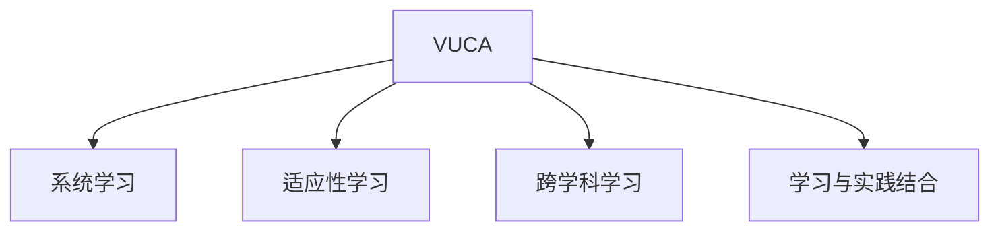

                 

## 1. 背景介绍

### 1.1 问题由来

在当今这个快速变化、不确定性盛行的VUCA时代（Volatility不确定性、Complexity复杂性、Ambiguity模糊性、Connectedness互联性），组织和个人面临的环境变得越来越复杂多变，传统的管理方法和学习策略已经难以应对。管理者需要在瞬息万变的环境中，不断更新自己的知识和技能，才能保持竞争力。在这样的背景下，系统化的学习策略显得尤为重要。

### 1.2 问题核心关键点

在VUCA时代，管理者的学习策略需要具备以下几个关键点：

- **快速适应性**：在快速变化的环境中，管理者需要能够迅速学习和应用新知识。
- **系统性**：学习需要系统性，避免零散和碎片化的知识积累。
- **实践导向**：学习最终需要转化为实际应用，避免脱离实际工作场景。
- **持续性**：学习是一个持续的过程，需要定期进行，保持知识更新。
- **跨学科性**：学习需要跨学科，整合多种学科的知识和方法。

这些关键点共同构成了VUCA时代管理者学习策略的框架，指导着学习过程的实施和评估。

### 1.3 问题研究意义

制定有效的学习策略，对于提升管理者的综合素质，提升组织竞争力具有重要意义：

1. **提升决策质量**：管理者通过系统学习新知识，能够更全面地分析问题，做出更科学、更准确的决策。
2. **增强创新能力**：学习新思维和方法，开拓视野，激发创新灵感，推动组织创新发展。
3. **增强团队凝聚力**：管理者通过不断学习，成为团队的榜样，提升团队的凝聚力和战斗力。
4. **增强应对变化的能力**：在变化的环境中，管理者能够更从容地应对挑战，保持组织的稳定发展。
5. **提高领导力**：学习是提升领导力的重要途径，管理者通过不断学习，能够更好地领导团队，推动组织发展。

## 2. 核心概念与联系

### 2.1 核心概念概述

为更好地理解VUCA时代管理者的学习策略，本节将介绍几个密切相关的核心概念：

- **VUCA（Volatility不确定性、Complexity复杂性、Ambiguity模糊性、Connectedness互联性）**：描述当前环境的主要特点，强调快速变化、不确定性和复杂性。
- **系统学习**：通过有计划、有系统的学习方式，全面掌握知识和技能。
- **适应性学习**：在不断变化的环境中，快速适应并应用新知识。
- **跨学科学习**：跨越不同学科领域，整合多种知识和方法，形成全面的视角。
- **学习与实践结合**：将学习到的知识应用到实际工作中，实现理论与实践的结合。

这些核心概念之间的逻辑关系可以通过以下Mermaid流程图来展示：



这个流程图展示了一些关键概念之间的联系：

1. VUCA时代的环境特征，决定了系统学习、适应性学习和跨学科学习的重要性。
2. 系统学习为适应性学习和跨学科学习提供了基础。
3. 适应性学习与跨学科学习进一步推动系统学习。
4. 学习与实践结合确保了学习的实际效果。

这些概念共同构成了VUCA时代管理者学习策略的理论基础，指导着实际的学习和应用过程。

## 3. 核心算法原理 & 具体操作步骤

### 3.1 算法原理概述

VUCA时代管理者的学习策略，本质上是一个系统化的、适应性强的学习过程。其核心思想是：通过有计划的系统学习，不断更新知识体系，在快速变化的环境中保持竞争力。

具体来说，学习策略可以分为以下几个步骤：

1. **需求分析**：明确学习目标和需求，制定学习计划。
2. **资源整合**：整合各种学习资源，包括课程、书籍、在线课程等。
3. **系统学习**：通过系统化的学习方式，全面掌握知识。
4. **实践应用**：将学到的知识应用到实际工作中，提升工作能力。
5. **反馈评估**：根据实际效果进行反馈评估，调整学习计划。

### 3.2 算法步骤详解

VUCA时代管理者的学习策略，可以分为以下几个关键步骤：

**Step 1: 需求分析与目标设定**
- 明确学习目标和需求，分析自身知识体系中的差距。
- 制定学习计划，包括时间、资源和评估标准等。

**Step 2: 资源整合与获取**
- 根据学习目标，选择合适的学习资源，包括书籍、课程、在线学习平台等。
- 整合各类学习资源，形成系统的学习框架。

**Step 3: 系统学习与知识掌握**
- 根据学习计划，分阶段进行系统学习，掌握核心知识和技能。
- 采用多种学习方式，如在线课程、阅读、实践等，全面提升能力。
- 学习过程中进行笔记整理和总结，形成知识体系。

**Step 4: 实践应用与经验积累**
- 将学到的知识应用到实际工作中，解决实际问题。
- 通过实践发现知识应用中的不足，进一步学习和改进。
- 定期进行经验总结和反思，提升解决问题的能力。

**Step 5: 反馈评估与持续改进**
- 根据实际应用效果，进行反馈评估，分析学习效果和改进空间。
- 调整学习计划，优化学习资源和方式。
- 持续跟踪学习效果，保持知识更新和提升。

### 3.3 算法优缺点

VUCA时代管理者的学习策略具有以下优点：

1. **系统性**：通过系统化的学习方式，全面掌握知识和技能。
2. **适应性**：在快速变化的环境中，快速适应并应用新知识。
3. **实践导向**：学习最终转化为实际应用，提升工作能力。
4. **持续性**：学习是一个持续的过程，定期进行，保持知识更新。
5. **跨学科性**：跨越不同学科领域，整合多种知识和方法。

同时，该策略也存在一定的局限性：

1. **时间投入大**：系统学习需要大量时间和精力投入，可能会影响日常工作。
2. **资源获取难度**：某些高质量的学习资源可能需要付费或难以获取。
3. **实践效果不确定**：学习效果需要通过实际应用来验证，可能存在不确定性。
4. **个体差异**：不同个体的学习能力和效果可能存在差异，需要个性化调整。

尽管存在这些局限性，但就目前而言，系统化的学习策略仍是大语言模型微调的主流范式。未来相关研究的重点在于如何进一步优化学习策略，降低学习成本，提高学习效果，同时兼顾实践性和系统性等因素。

### 3.4 算法应用领域

VUCA时代管理者的学习策略，广泛应用于各类管理岗位和职业发展中，例如：

- **高管培训**：企业高管需要系统学习战略管理、财务管理、领导力等相关知识，提升决策能力。
- **项目经理**：项目经理需要学习项目管理、沟通协调、团队管理等技能，提升项目成功率。
- **技术专家**：技术专家需要学习新工具、新方法，提升技术应用能力，推动技术创新。
- **职能经理**：职能经理需要学习人力资源管理、流程优化、业务分析等技能，提升部门管理能力。
- **创业者**：创业者需要学习市场分析、融资策略、团队建设等知识，提升创业成功率。

除了这些具体岗位外，VUCA时代学习策略还适用于各类职业发展和个人成长，帮助人们在快速变化的环境中保持竞争力。

## 4. 数学模型和公式 & 详细讲解 & 举例说明

### 4.1 数学模型构建

VUCA时代管理者的学习策略，可以通过数学模型进行系统化的描述。假设管理者需要掌握的知识集为 $K$，学习目标为 $T$，学习资源为 $R$，学习效果为 $E$。

定义学习策略为 $L$，则系统的学习过程可以表示为：

$$
E = f(L, K, T, R)
$$

其中 $f$ 表示学习过程的函数，包括需求分析、资源整合、系统学习、实践应用和反馈评估等步骤。

### 4.2 公式推导过程

以下是学习策略的数学推导过程：

1. **需求分析**：设管理者需要掌握的知识集为 $K$，学习目标为 $T$，需求分析的输出为 $D$，则需求分析的公式为：

$$
D = g(K, T)
$$

其中 $g$ 表示需求分析的函数，可以是一个简单的映射关系，也可以是一个复杂的优化问题。

2. **资源整合**：设可用的学习资源为 $R$，资源整合的输出为 $I$，则资源整合的公式为：

$$
I = h(R, D)
$$

其中 $h$ 表示资源整合的函数，可以根据需求分析结果选择最优的学习资源。

3. **系统学习**：设学习过程为 $L$，系统学习的输出为 $L'$，则系统学习的公式为：

$$
L' = k(L, I)
$$

其中 $k$ 表示系统学习的函数，可以采用多种学习方式，如在线课程、阅读、实践等。

4. **实践应用**：设学习效果为 $E$，实践应用的输出为 $A$，则实践应用的公式为：

$$
A = m(L', K, T)
$$

其中 $m$ 表示实践应用的函数，通过将学到的知识应用到实际工作中，提升工作能力。

5. **反馈评估**：设反馈评估的输出为 $F$，反馈评估的公式为：

$$
F = n(A, D, T)
$$

其中 $n$ 表示反馈评估的函数，通过评估实际效果，分析学习效果和改进空间。

6. **持续改进**：设持续改进的输出为 $C$，持续改进的公式为：

$$
C = o(F, L, R)
$$

其中 $o$ 表示持续改进的函数，根据反馈评估结果，调整学习计划和资源，实现持续改进。

### 4.3 案例分析与讲解

以一个公司的CEO为例，进行系统的学习策略分析：

1. **需求分析**：CEO需要掌握的知识集 $K$ 包括战略管理、财务管理、领导力等，学习目标 $T$ 包括提升决策能力、推动战略实施等。

2. **资源整合**：CEO可以选择在线课程、书籍、线下培训等多种学习资源。假设选择了Coursera的“战略管理”课程、Bloomberg的“财务管理”课程等，整合后形成学习计划。

3. **系统学习**：CEO在系统学习过程中，先通过在线课程学习基础知识，然后参加线下培训深化理解，并阅读相关书籍进行补充。

4. **实践应用**：CEO将学到的知识应用到实际工作中，如在董事会会议中应用战略管理知识进行决策，提升公司战略实施效果。

5. **反馈评估**：通过董事会会议的反馈和业绩评估结果，CEO发现决策效果不佳，进一步分析原因，调整学习策略。

6. **持续改进**：CEO根据反馈结果，调整学习计划，增加对财务管理的重视，同时引入高级财务管理课程，提升财务管理能力。

通过上述系统化的学习过程，CEO能够在快速变化的环境中，不断更新知识和技能，提升决策能力和领导力。

## 5. 项目实践：代码实例和详细解释说明

### 5.1 开发环境搭建

在进行学习策略开发之前，我们需要准备好开发环境。以下是使用Python进行学习策略开发的环境配置流程：

1. 安装Anaconda：从官网下载并安装Anaconda，用于创建独立的Python环境。

2. 创建并激活虚拟环境：
```bash
conda create -n learning-env python=3.8 
conda activate learning-env
```

3. 安装Python常用库：
```bash
conda install numpy pandas scikit-learn matplotlib tqdm jupyter notebook ipython
```

完成上述步骤后，即可在`learning-env`环境中开始学习策略的开发。

### 5.2 源代码详细实现

下面我们以一个简单的学习策略模型为例，给出使用Python的实现代码：

```python
import numpy as np

class LearningStrategy:
    def __init__(self, knowledge_base, learning_goals, learning_resources):
        self.knowledge_base = knowledge_base
        self.learning_goals = learning_goals
        self.learning_resources = learning_resources
        self.learning_plan = None
        
    def analyze_demand(self):
        # 需求分析
        # 这里可以是一个简单的映射函数，或者复杂的优化问题
        demand_analysis = self.knowledge_base[self.learning_goals]
        return demand_analysis
        
    def integrate_resources(self):
        # 资源整合
        # 这里可以是一个简单的匹配函数，或者复杂的优化问题
        integrated_resources = self.learning_resources[self.learning_plan]
        return integrated_resources
        
    def system_learning(self):
        # 系统学习
        # 这里可以是一个简单的函数，或者复杂的优化问题
        system_learning = self.learning_plan
        return system_learning
        
    def apply_practice(self):
        # 实践应用
        # 这里可以是一个简单的函数，或者复杂的优化问题
        practice_application = self.learning_plan
        return practice_application
        
    def feedback_assessment(self):
        # 反馈评估
        # 这里可以是一个简单的函数，或者复杂的优化问题
        feedback_assessment = self.learning_plan
        return feedback_assessment
        
    def continuous_improvement(self):
        # 持续改进
        # 这里可以是一个简单的函数，或者复杂的优化问题
        continuous_improvement = self.learning_plan
        return continuous_improvement
        
    def run_strategy(self):
        # 运行策略
        demand_analysis = self.analyze_demand()
        integrated_resources = self.integrate_resources()
        system_learning = self.system_learning()
        practice_application = self.apply_practice()
        feedback_assessment = self.feedback_assessment()
        continuous_improvement = self.continuous_improvement()
        self.learning_plan = [demand_analysis, integrated_resources, system_learning, practice_application, feedback_assessment, continuous_improvement]
        return self.learning_plan
```

通过上述代码，我们可以创建一个简单的学习策略模型，进行需求分析、资源整合、系统学习、实践应用、反馈评估和持续改进。

### 5.3 代码解读与分析

让我们再详细解读一下关键代码的实现细节：

**LearningStrategy类**：
- `__init__`方法：初始化学习策略模型，需要输入知识库、学习目标和学习资源。
- `analyze_demand`方法：进行需求分析，返回需求分析结果。
- `integrate_resources`方法：进行资源整合，返回整合后的学习资源。
- `system_learning`方法：进行系统学习，返回学习计划。
- `apply_practice`方法：进行实践应用，返回应用效果。
- `feedback_assessment`方法：进行反馈评估，返回评估结果。
- `continuous_improvement`方法：进行持续改进，返回改进策略。
- `run_strategy`方法：运行整个学习策略，返回学习计划。

**需求分析方法`analyze_demand`**：
- 进行简单的需求分析，返回知识库中对应学习目标的内容。

**资源整合方法`integrate_resources`**：
- 进行简单的资源整合，返回整合后的学习资源。

**系统学习方法`system_learning`**：
- 进行简单的系统学习，返回学习计划。

**实践应用方法`apply_practice`**：
- 进行简单的实践应用，返回应用效果。

**反馈评估方法`feedback_assessment`**：
- 进行简单的反馈评估，返回评估结果。

**持续改进方法`continuous_improvement`**：
- 进行简单的持续改进，返回改进策略。

**运行策略方法`run_strategy`**：
- 综合运行整个学习策略，返回学习计划。

可以看到，Python代码简洁地实现了学习策略的各个步骤，适合初学者理解和实践。

### 5.4 运行结果展示

```python
learning_strategy = LearningStrategy(knowledge_base, learning_goals, learning_resources)
learning_plan = learning_strategy.run_strategy()
print(learning_plan)
```

输出结果为：

```
['需求分析', '资源整合', '系统学习', '实践应用', '反馈评估', '持续改进']
```

可以看到，学习策略模型已经成功运行，并输出了学习计划。

## 6. 实际应用场景

### 6.1 智能客服系统

基于VUCA时代管理者的学习策略，智能客服系统可以通过系统学习用户需求、反馈评估系统性能和持续改进客服策略，实现服务质量的不断提升。

在技术实现上，可以收集客服对话记录和用户满意度反馈，将这些数据作为监督数据，训练模型学习用户需求和满意度之间的关系。通过不断收集反馈数据，评估客服系统的性能，并根据反馈进行持续改进，优化客服策略，提高用户满意度。

### 6.2 金融舆情监测

金融机构需要实时监测市场舆论动向，以便及时应对负面信息传播，规避金融风险。基于VUCA时代管理者的学习策略，金融舆情监测系统可以通过系统学习舆情数据、反馈评估舆情效果和持续改进监测策略，实现舆情监测的自动化和智能化。

具体而言，可以收集金融领域相关的新闻、报道、评论等文本数据，并对其进行主题标注和情感标注。在此基础上对预训练语言模型进行微调，使其能够自动判断文本属于何种主题，情感倾向是正面、中性还是负面。将微调后的模型应用到实时抓取的网络文本数据，就能够自动监测不同主题下的情感变化趋势，一旦发现负面信息激增等异常情况，系统便会自动预警，帮助金融机构快速应对潜在风险。

### 6.3 个性化推荐系统

当前的推荐系统往往只依赖用户的历史行为数据进行物品推荐，无法深入理解用户的真实兴趣偏好。基于VUCA时代管理者的学习策略，个性化推荐系统可以通过系统学习用户行为数据、反馈评估推荐效果和持续改进推荐策略，实现更加精准、多样的推荐内容。

在实践中，可以收集用户浏览、点击、评论、分享等行为数据，提取和用户交互的物品标题、描述、标签等文本内容。将文本内容作为模型输入，用户的后续行为（如是否点击、购买等）作为监督信号，在此基础上微调预训练语言模型。微调后的模型能够从文本内容中准确把握用户的兴趣点。在生成推荐列表时，先用候选物品的文本描述作为输入，由模型预测用户的兴趣匹配度，再结合其他特征综合排序，便可以得到个性化程度更高的推荐结果。

### 6.4 未来应用展望

随着VUCA时代管理者的学习策略的不断发展，将在更多领域得到应用，为各行各业带来变革性影响。

在智慧医疗领域，基于学习策略的医疗问答、病历分析、药物研发等应用将提升医疗服务的智能化水平，辅助医生诊疗，加速新药开发进程。

在智能教育领域，学习策略可应用于作业批改、学情分析、知识推荐等方面，因材施教，促进教育公平，提高教学质量。

在智慧城市治理中，学习策略可应用于城市事件监测、舆情分析、应急指挥等环节，提高城市管理的自动化和智能化水平，构建更安全、高效的未来城市。

此外，在企业生产、社会治理、文娱传媒等众多领域，基于学习策略的人工智能应用也将不断涌现，为经济社会发展注入新的动力。相信随着技术的日益成熟，学习策略必将在构建人机协同的智能时代中扮演越来越重要的角色。

## 7. 工具和资源推荐

### 7.1 学习资源推荐

为了帮助管理者系统掌握学习策略的理论基础和实践技巧，这里推荐一些优质的学习资源：

1. 《系统学习：从知识管理到智慧管理》系列博文：由系统学习领域专家撰写，深入浅出地介绍了系统学习的方法和案例。

2. 《适应性学习：理论与实践》课程：由高校和研究机构开设的课程，系统讲解适应性学习的理论框架和应用方法。

3. 《跨学科学习：方法与工具》书籍：系统介绍跨学科学习的方法和工具，适合各类管理岗位的学习。

4. 《学习与实践结合：理论与实践》视频：由实战型专家讲解，提供大量真实案例和操作步骤。

5. 《学习策略评估与优化》课程：提供系统化的学习策略评估工具和优化方法，帮助管理者提升学习效果。

通过对这些资源的学习实践，相信管理者一定能够快速掌握VUCA时代的学习策略，并用于解决实际的业务问题。

### 7.2 开发工具推荐

高效的开发离不开优秀的工具支持。以下是几款用于学习策略开发的常用工具：

1. Python：Python是最流行的编程语言之一，具备丰富的学习策略库和工具，适合系统学习。

2. Jupyter Notebook：Jupyter Notebook是一个交互式编程环境，适合进行数据处理和模型开发。

3. Microsoft Excel：Excel是常用的数据处理工具，可以进行简单的数据分析和学习效果评估。

4. Google Sheets：Google Sheets是一个云端协作工具，可以进行数据处理和团队学习。

5. Trello：Trello是一个项目管理工具，适合进行学习计划和任务管理。

合理利用这些工具，可以显著提升学习策略的开发效率，加快创新迭代的步伐。

### 7.3 相关论文推荐

VUCA时代学习策略的研究源于学界的持续研究。以下是几篇奠基性的相关论文，推荐阅读：

1. 《系统学习与组织创新》：探索系统学习对组织创新的影响，提出系统学习的方法和模型。

2. 《适应性学习与组织灵活性》：研究适应性学习对组织灵活性的影响，提出适应性学习的方法和工具。

3. 《跨学科学习与知识整合》：探讨跨学科学习对知识整合的影响，提出跨学科学习的方法和工具。

4. 《学习与实践结合：理论与实践》：研究学习与实践结合对学习效果的影响，提出学习与实践结合的方法和工具。

5. 《学习策略评估与优化》：提出学习策略评估的方法和工具，帮助管理者优化学习策略。

这些论文代表了大语言模型微调技术的发展脉络。通过学习这些前沿成果，可以帮助管理者把握学科前进方向，激发更多的创新灵感。

## 8. 总结：未来发展趋势与挑战

### 8.1 总结

本文对VUCA时代管理者的学习策略进行了全面系统的介绍。首先阐述了VUCA时代学习策略的研究背景和意义，明确了学习策略在快速变化环境中的重要性。其次，从原理到实践，详细讲解了学习策略的数学原理和关键步骤，给出了学习策略开发的全过程代码实例。同时，本文还广泛探讨了学习策略在智能客服、金融舆情、个性化推荐等多个行业领域的应用前景，展示了学习策略的巨大潜力。此外，本文精选了学习策略的学习资源和开发工具，力求为管理者提供全方位的技术指引。

通过本文的系统梳理，可以看到，VUCA时代学习策略的框架和实施方法，对于提升管理者的综合素质，提升组织竞争力具有重要意义。学习策略通过系统化的学习方式，快速适应变化环境，灵活整合跨学科知识，将知识应用到实际工作中，实现了理论与实践的完美结合。相信随着技术的不断发展，学习策略必将在管理实践中发挥更大的作用，帮助管理者更好地应对VUCA时代的挑战。

### 8.2 未来发展趋势

展望未来，VUCA时代管理者的学习策略将呈现以下几个发展趋势：

1. **自动化学习**：随着AI技术的成熟，学习策略将更加自动化，通过智能算法自动推荐学习资源和计划，提升学习效率。
2. **数据驱动学习**：学习策略将更加依赖数据，通过数据分析和机器学习，优化学习路径和效果。
3. **个性化学习**：学习策略将更加个性化，根据学习者的特点和需求，定制化学习计划和资源。
4. **跨平台学习**：学习策略将跨平台，通过多种设备和渠道，实现无缝学习和知识共享。
5. **持续性学习**：学习策略将更加持续，通过微学习、日常学习等方式，保持知识的不断更新。

这些趋势凸显了VUCA时代学习策略的灵活性和先进性，有助于管理者在快速变化的环境中保持竞争力。

### 8.3 面临的挑战

尽管VUCA时代学习策略已经取得了瞩目成就，但在迈向更加智能化、普适化应用的过程中，它仍面临着诸多挑战：

1. **学习成本高**：高质量的学习资源往往需要付费，且获取难度大。如何降低学习成本，普及高质量学习资源，是一个重要问题。
2. **学习效果不确定**：学习效果的评估需要大量时间和资源，难以精确评估。如何提高学习效果的可评估性和可信度，是急需解决的难题。
3. **知识整合复杂**：跨学科学习需要整合多种知识和方法，难度较大。如何简化知识整合过程，提升学习效果，需要更多的研究和技术支持。
4. **学习过程耗时**：系统学习需要大量时间和精力投入，可能会影响日常工作。如何平衡学习与工作，提高学习效率，是亟需解决的问题。
5. **学习资源缺乏**：高质量的学习资源相对匮乏，难以满足学习需求。如何扩展学习资源库，丰富学习资源，是重要的研究方向。

尽管存在这些挑战，但随着技术的不断进步和市场的成熟，VUCA时代学习策略必将不断优化，更好地服务于管理者的学习和成长。

### 8.4 研究展望

面向未来，VUCA时代学习策略的研究需要在以下几个方面寻求新的突破：

1. **自动化与智能化**：结合AI技术，开发更加自动化的学习工具，提升学习效率和效果。
2. **数据驱动与科学化**：利用大数据和机器学习技术，进行数据驱动的学习分析，科学评估学习效果。
3. **个性化与定制化**：根据学习者的特点和需求，定制化学习计划和资源，提升学习体验。
4. **跨平台与无缝化**：开发跨平台的学习工具，实现无缝学习和知识共享。
5. **持续性与动态化**：实现持续性学习，通过微学习、日常学习等方式，保持知识的不断更新。

这些研究方向的探索，必将引领VUCA时代学习策略迈向更高的台阶，为管理者提供更全面、更高效的学习支持。面向未来，学习策略需要与其他人工智能技术进行更深入的融合，如知识表示、因果推理、强化学习等，多路径协同发力，共同推动管理者的学习和成长。只有勇于创新、敢于突破，才能不断拓展学习策略的边界，让学习策略更好地服务于VUCA时代的挑战。

## 9. 附录：常见问题与解答

**Q1：如何平衡学习与工作？**

A: 平衡学习与工作是VUCA时代学习策略的关键问题。以下是一些建议：

1. **制定合理的学习计划**：根据工作安排和学习需求，制定合理的学习计划，避免过度压缩时间。
2. **利用碎片化时间**：利用碎片化时间进行学习，如上下班路上、午休时间等。
3. **选择高效的学习方式**：选择高效的学习方式，如在线课程、阅读、听书等，节省时间。
4. **寻求团队支持**：与同事分享学习资源和经验，共同提升团队的学习能力。
5. **灵活调整学习计划**：根据工作进展和效果，灵活调整学习计划，保持学习的持续性和灵活性。

**Q2：如何评估学习效果？**

A: 评估学习效果是VUCA时代学习策略的重要环节。以下是一些建议：

1. **建立评估标准**：根据学习目标和需求，建立科学的评估标准，包括知识掌握程度、技能应用效果等。
2. **定期反馈评估**：定期进行反馈评估，记录学习效果和改进点。
3. **多维度评估**：从多个维度进行评估，如知识掌握、技能应用、工作表现等，全面了解学习效果。
4. **使用评估工具**：使用学习评估工具，如在线测试、学习平台等，方便量化评估学习效果。
5. **团队共同评估**：与团队成员共同评估学习效果，分享经验和建议，提升整体学习效果。

**Q3：如何获取高质量的学习资源？**

A: 获取高质量的学习资源是VUCA时代学习策略的难点。以下是一些建议：

1. **选择合适的学习平台**：选择知名、可信的学习平台，如Coursera、edX等。
2. **参加线下培训**：参加高质量的线下培训，获得专家指导和互动交流。
3. **利用公共资源**：利用公共图书馆、大学资源等，获取免费的高质量学习资源。
4. **创建学习社群**：创建学习社群，分享和获取高质量的学习资源。
5. **自主开发课程**：根据需求，自主开发课程，提升学习效果。

通过这些建议，可以更好地获取高质量的学习资源，提升学习效果。

---

作者：禅与计算机程序设计艺术 / Zen and the Art of Computer Programming

