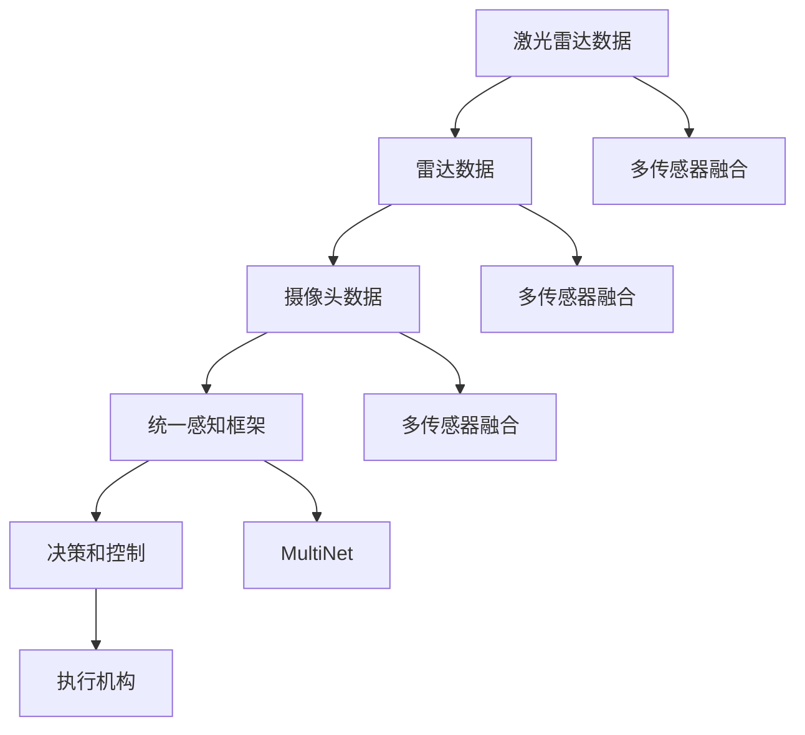

                 

## 1. 背景介绍

自动驾驶技术，作为未来智能交通的重要一环，一直备受瞩目。近年来，随着计算机视觉、深度学习等技术的迅速发展，基于神经网络自动驾驶系统逐渐成为主流。Waymo是全球领先的自动驾驶公司之一，其自动驾驶技术在全球各地进行测试并逐步部署，推动了自动驾驶技术的商业化进程。然而，自动驾驶技术在实际应用中仍面临诸多挑战，诸如车辆之间的通信、交通信号识别、复杂交通环境下的行为决策等。本文将详细探讨Waymo的自动驾驶新范式——统一感知框架MultiNet，并详细介绍其核心技术和优势。

## 2. 核心概念与联系

### 2.1 核心概念概述

Waymo的自动驾驶系统采用了基于多传感器融合的统一感知框架，其中的核心概念包括：

- **多传感器融合(Multi-sensor Fusion)**：通过集成来自激光雷达、雷达、摄像头等多种传感器的数据，实现对周边环境的全面感知。

- **统一感知框架(Unified Perception Framework)**：将感知、决策、控制等模块进行统一设计，实现多传感器数据的高效融合和处理。

- **MultiNet技术**：Waymo在统一感知框架下提出的新一代感知算法，通过大规模神经网络模型，提升感知能力。

- **端到端学习(End-to-End Learning)**：将感知、决策和控制任务集成到同一神经网络模型中，减少计算负担和中间误差。

这些核心概念通过紧密结合，形成了Waymo自动驾驶系统高效、稳健的技术架构。

### 2.2 核心概念原理和架构的 Mermaid 流程图



此图展示了Waymo自动驾驶系统从多传感器数据融合到决策和控制的整个流程，其中统一感知框架作为核心，实现数据融合和感知。

## 3. 核心算法原理 & 具体操作步骤

### 3.1 算法原理概述

Waymo的统一感知框架MultiNet，基于深度学习技术，利用大规模神经网络模型，对多传感器数据进行融合处理。其核心算法流程分为以下几个步骤：

1. **数据预处理**：将激光雷达、雷达、摄像头等传感器的原始数据进行同步和归一化，以便后续处理。
2. **特征提取**：对处理后的数据进行特征提取，包括特征点、边缘、纹理等，用于表示环境特征。
3. **多模态融合**：将不同传感器获取的特征进行融合，生成多模态特征图。
4. **时空信息编码**：将多模态特征图进行时空编码，提取更全面的环境信息。
5. **预测和决策**：基于编码后的特征，通过MultiNet模型进行预测和决策，输出车辆行为指令。

### 3.2 算法步骤详解

- **步骤1: 数据预处理**
  - 数据同步：使用时间同步算法，将激光雷达、雷达、摄像头等数据进行精确对齐。
  - 数据归一化：对不同传感器数据的分辨率、单位、范围等进行归一化，方便后续处理。

- **步骤2: 特征提取**
  - 特征点检测：利用激光雷达和摄像头进行特征点检测，如车道线、交通标志、行人等。
  - 边缘检测：使用激光雷达和雷达数据提取环境边缘信息。
  - 纹理提取：利用摄像头数据提取路面的纹理信息，用于判断路面的类型和质量。

- **步骤3: 多模态融合**
  - 特征融合算法：使用加权平均、深度学习融合等算法，将不同传感器提取的特征进行融合。
  - 特征图生成：将融合后的特征数据生成多模态特征图，作为后续处理的输入。

- **步骤4: 时空信息编码**
  - 空间信息编码：利用卷积神经网络（CNN）对特征图进行空间编码，提取局部特征。
  - 时间信息编码：使用循环神经网络（RNN）对特征图进行时间编码，提取运动趋势。
  - 时空特征融合：将空间和时间信息进行融合，生成更全面的环境表示。

- **步骤5: 预测和决策**
  - MultiNet模型：构建基于深度学习的MultiNet模型，融合时空信息，进行预测。
  - 行为决策：根据预测结果，结合其他传感器数据，做出车辆行为决策。

### 3.3 算法优缺点

**优点**：

- **全面感知**：通过多传感器融合，实现对环境的全面感知，提高了自动驾驶系统的鲁棒性和安全性。
- **端到端学习**：将感知、决策和控制集成在单一神经网络模型中，减少了中间环节的误差，提升了系统效率。
- **可扩展性**：MultiNet模型具有较强的可扩展性，可以轻松接入更多传感器数据，提升系统的综合性能。

**缺点**：

- **计算复杂度高**：大规模神经网络模型对计算资源要求较高，硬件成本相对较高。
- **模型复杂度高**：复杂模型训练和调试难度大，需要丰富的数据和经验支持。
- **训练周期长**：大规模模型的训练时间较长，对实时性要求较高的场景可能存在瓶颈。

### 3.4 算法应用领域

Waymo的统一感知框架MultiNet技术，主要应用于以下几个领域：

- **自动驾驶车辆**：通过感知、决策和控制模块，实现自动驾驶功能。
- **自动驾驶车队**：通过车辆之间的通信和协调，实现车队控制和优化。
- **交通信号灯控制**：通过感知环境信息，实现交通信号灯的智能控制。
- **交通管理平台**：通过数据融合和分析，实现交通流优化和事件监测。

## 4. 数学模型和公式 & 详细讲解 & 举例说明

### 4.1 数学模型构建

Waymo的统一感知框架MultiNet，基于深度学习技术构建，主要包括两个部分：空间信息编码和时间信息编码。

- **空间信息编码**：利用卷积神经网络（CNN）对多模态特征图进行空间编码。公式表示为：
$$
\text{encoded\_features} = \text{CNN}(\text{fused\_features})
$$
- **时间信息编码**：使用循环神经网络（RNN）对特征图进行时间编码。公式表示为：
$$
\text{time\_encoded\_features} = \text{RNN}(\text{encoded\_features})
$$

### 4.2 公式推导过程

- **CNN空间编码**：假设多模态特征图大小为$H\times W$，使用$N$个卷积核，每个卷积核大小为$k\times k$，步长为$s$，则CNN输出的特征图大小为：
$$
\text{encoded\_features}_{i,j} = \sum_{n=1}^{N} \text{filter}_{n} \ast \text{fused\_features}_{i,j}
$$
其中$\text{filter}_{n}$为卷积核，$\ast$表示卷积运算。

- **RNN时间编码**：假设时间序列长度为$T$，使用$M$个RNN单元，每个单元的时间步长为$s'$，则RNN输出的特征表示为：
$$
\text{time\_encoded\_features}_{t} = \text{RNN}_{t}(\text{encoded\_features}_{t-1})
$$
其中$\text{time\_encoded\_features}_{t}$表示第$t$步的编码结果。

### 4.3 案例分析与讲解

- **案例1: 特征点检测**
  - 使用激光雷达和摄像头进行特征点检测，激光雷达数据可以通过点云表示，摄像头数据可以通过图像表示。通过叠加两种数据的特征点信息，可以生成更准确的特征图。

- **案例2: 边缘检测**
  - 使用激光雷达和雷达数据提取环境边缘信息。激光雷达数据可以表示为点云，雷达数据可以表示为回波信号，通过对比两种数据，可以更准确地检测出环境边缘。

- **案例3: 时空信息编码**
  - 将激光雷达和摄像头数据进行空间编码，得到空间特征图；将雷达数据进行时间编码，得到时间特征图；将空间和时间特征图进行融合，得到时空编码后的特征表示。

## 5. 项目实践：代码实例和详细解释说明

### 5.1 开发环境搭建

在进行项目实践前，需要搭建相应的开发环境。以下是在Linux环境下搭建Python开发环境的步骤：

1. 安装Anaconda：
   ```bash
   wget https://repo.anaconda.com/miniconda/Miniconda3-latest-Linux-x86_64.sh
   bash Miniconda3-latest-Linux-x86_64.sh
   ```

2. 创建虚拟环境：
   ```bash
   conda create -n waymo python=3.8
   conda activate waymo
   ```

3. 安装必要的Python库：
   ```bash
   conda install numpy pandas scikit-learn matplotlib torch torchvision transformers
   ```

### 5.2 源代码详细实现

以下是在Python中使用PyTorch实现Waymo统一感知框架MultiNet的代码：

```python
import torch
import torch.nn as nn
import torchvision.transforms as transforms
from torch.utils.data import DataLoader, Dataset

# 定义特征提取器
class FeatureExtractor(nn.Module):
    def __init__(self):
        super(FeatureExtractor, self).__init__()
        self.laser = nn.Conv2d(in_channels=1, out_channels=64, kernel_size=5)
        self.radar = nn.Conv2d(in_channels=1, out_channels=64, kernel_size=5)
        self.camera = nn.Conv2d(in_channels=3, out_channels=64, kernel_size=5)
    
    def forward(self, laser_data, radar_data, camera_data):
        laser_features = self.laser(laser_data)
        radar_features = self.radar(radar_data)
        camera_features = self.camera(camera_data)
        fused_features = (laser_features + radar_features + camera_features) / 3
        return fused_features

# 定义时空信息编码器
class TemporalEncoder(nn.Module):
    def __init__(self, input_size, hidden_size, output_size):
        super(TemporalEncoder, self).__init__()
        self.gru = nn.GRU(input_size, hidden_size, batch_first=True)
        self.fc = nn.Linear(hidden_size, output_size)
    
    def forward(self, features):
        hidden_state = torch.zeros(1, features.size(0), self.fc.in_features)
        _, hidden_state = self.gru(features, hidden_state)
        encoded_features = self.fc(hidden_state[:, -1, :])
        return encoded_features

# 定义MultiNet模型
class MultiNet(nn.Module):
    def __init__(self, input_size, hidden_size, output_size):
        super(MultiNet, self).__init__()
        self.feature_extractor = FeatureExtractor()
        self.temporal_encoder = TemporalEncoder(input_size, hidden_size, output_size)
    
    def forward(self, laser_data, radar_data, camera_data):
        fused_features = self.feature_extractor(laser_data, radar_data, camera_data)
        encoded_features = self.temporal_encoder(fused_features)
        return encoded_features

# 定义数据集
class WaymoDataset(Dataset):
    def __init__(self, dataset_path):
        self.dataset_path = dataset_path
        # 加载数据集并进行预处理
        # ...
    
    def __len__(self):
        return len(self.dataset)
    
    def __getitem__(self, idx):
        # 加载数据并返回预处理后的特征
        # ...

# 加载数据集
dataset = WaymoDataset('waymo_dataset')
train_loader = DataLoader(dataset, batch_size=32, shuffle=True)
test_loader = DataLoader(dataset, batch_size=32)

# 定义模型
model = MultiNet(input_size=64, hidden_size=128, output_size=num_classes)

# 定义损失函数和优化器
criterion = nn.CrossEntropyLoss()
optimizer = torch.optim.Adam(model.parameters(), lr=1e-3)

# 定义训练和评估函数
def train_model(model, train_loader, test_loader, criterion, optimizer, num_epochs):
    # 训练函数
    # ...
    
    # 评估函数
    # ...

# 开始训练
num_epochs = 10
train_model(model, train_loader, test_loader, criterion, optimizer, num_epochs)
```

### 5.3 代码解读与分析

在上述代码中，首先定义了特征提取器（FeatureExtractor）和时空信息编码器（TemporalEncoder）两个子模块。特征提取器通过多个卷积层对多模态特征进行提取和融合，时空信息编码器使用GRU对特征进行时间编码。

接着定义了MultiNet模型，该模型通过特征提取器和时空信息编码器，将多模态数据进行统一感知处理。在训练过程中，通过定义损失函数（CrossEntropyLoss）和优化器（Adam），对模型进行优化。

在数据集处理方面，可以自定义数据集的加载和预处理函数，用于加载数据并进行特征提取和归一化等预处理操作。

## 6. 实际应用场景

### 6.1 自动驾驶车辆

Waymo的统一感知框架MultiNet，在自动驾驶车辆中得到了广泛应用。通过多传感器融合和时空信息编码，车辆能够全面感知周围环境，实现精准定位和行为决策。

- **定位和导航**：利用激光雷达和GPS数据进行车辆定位，结合摄像头和雷达数据进行环境建模，实现高精度地图构建。
- **障碍物检测**：通过多传感器数据融合，检测并分类行人、车辆、道路标志等障碍物。
- **行为决策**：结合预测结果和实时传感器数据，进行行为决策，确保车辆安全行驶。

### 6.2 自动驾驶车队

Waymo的统一感知框架MultiNet，还应用于自动驾驶车队中。通过车辆之间的通信和协调，实现车队控制和优化。

- **车队编队**：根据车队位置和行驶方向，进行车队编队和优化，确保车队行驶效率。
- **车队避障**：结合多传感器数据，实时监测车队周围环境，进行避障决策，避免交通事故。
- **车队通信**：通过车辆之间的通信，实现信息共享和决策协同，提高车队整体安全性。

### 6.3 交通信号灯控制

Waymo的统一感知框架MultiNet，可以应用于交通信号灯控制中。通过感知环境信息，实现交通信号灯的智能控制。

- **交通流监测**：利用摄像头和雷达数据，监测交通流状态，实时调整信号灯时长和相位。
- **事故预警**：结合传感器数据，检测交通事故，及时调整信号灯状态，保障交通安全。
- **交通管理优化**：根据实时交通数据，优化信号灯控制策略，提高交通效率。

## 7. 工具和资源推荐

### 7.1 学习资源推荐

为了帮助开发者系统掌握Waymo的统一感知框架MultiNet技术，以下是几本经典书籍和网站推荐：

- **《Waymo自动驾驶技术》**：由Waymo官方发布的技术手册，详细介绍了Waymo自动驾驶系统的技术架构和实现细节。
- **《深度学习理论与实践》**：由斯坦福大学李飞飞教授等编写的深度学习教材，系统讲解了深度学习的基础理论和实践应用。
- **《自动驾驶技术指南》**：由Waymo技术专家编写，介绍了自动驾驶技术的原理和应用，包括传感器融合、决策优化等。
- **Waymo官方博客**：包含Waymo最新的技术进展和应用案例，是了解Waymo自动驾驶技术的好渠道。

### 7.2 开发工具推荐

以下是在开发Waymo统一感知框架MultiNet时常用的开发工具推荐：

- **PyTorch**：基于Python的深度学习框架，功能强大，生态完善，适合自动驾驶系统的开发和训练。
- **TensorBoard**：TensorFlow配套的可视化工具，可以实时监测模型训练状态，提供丰富的图表展示。
- **Jupyter Notebook**：交互式编程环境，支持Python等多种语言，适合数据处理和模型训练。
- **Anaconda**：Python环境管理工具，支持虚拟环境创建和管理，方便开发过程中的环境配置。

### 7.3 相关论文推荐

以下是几篇Waymo自动驾驶技术的经典论文，推荐阅读：

- **Waymo: MultiNet: Unified Perception for Autonomous Vehicles**：Waymo官方发布的论文，详细介绍了MultiNet框架的技术实现和效果评估。
- **Learning to Drive with End-to-End Deep Reinforcement Learning**：Waymo的研究论文，展示了通过深度强化学习实现自动驾驶车辆控制和决策。
- **Waymo Open Dataset**：Waymo发布的开源数据集，包含自动驾驶车辆的数据记录，有助于研究自动驾驶技术。

## 8. 总结：未来发展趋势与挑战

### 8.1 研究成果总结

Waymo的统一感知框架MultiNet技术，通过多传感器融合和时空信息编码，提升了自动驾驶系统的感知能力和决策效率，在自动驾驶、交通管理和车队控制等多个领域展示了卓越的性能。

### 8.2 未来发展趋势

Waymo的统一感知框架MultiNet，将在以下几个方面继续发展：

- **多模态数据融合**：随着传感器技术的发展，未来将引入更多模态数据，如激光雷达、雷达、摄像头、毫米波雷达等，实现更全面的环境感知。
- **深度学习算法改进**：随着深度学习技术的进步，将引入更多的算法模型和优化方法，提升感知和决策性能。
- **端到端学习优化**：通过改进网络结构和优化训练策略，实现更高效的端到端学习，提升系统的综合性能。

### 8.3 面临的挑战

尽管Waymo的统一感知框架MultiNet技术已经取得了诸多进展，但在实际应用中仍面临以下挑战：

- **计算资源需求高**：大规模神经网络模型对计算资源要求较高，硬件成本较高。
- **训练和调试难度大**：复杂模型的训练和调试需要丰富的数据和经验支持，训练周期较长。
- **数据隐私和安全问题**：自动驾驶系统需要大量高精度的传感器数据，数据的隐私和安全问题需要得到充分保障。
- **实时性要求高**：自动驾驶系统对实时性要求较高，需要在保证准确性的同时，提升系统的响应速度。

### 8.4 研究展望

未来Waymo的统一感知框架MultiNet技术需要在以下几个方面进行进一步研究：

- **模型压缩和优化**：通过模型压缩和优化，减少模型参数量和计算量，提升实时性。
- **数据隐私保护**：研究如何保护数据隐私，确保传感器数据的合法使用。
- **跨模态数据融合**：研究如何实现不同模态数据的高效融合，提升感知能力。
- **智能决策优化**：研究如何优化决策算法，提升决策的准确性和鲁棒性。

## 9. 附录：常见问题与解答

**Q1: 什么是Waymo的统一感知框架MultiNet技术？**

A: Waymo的统一感知框架MultiNet技术是一种基于深度学习的自动驾驶感知算法，通过多传感器数据融合和时空信息编码，实现对环境的全面感知，从而提升自动驾驶系统的鲁棒性和安全性。

**Q2: 如何训练Waymo的统一感知框架MultiNet模型？**

A: 训练MultiNet模型需要准备大量的传感器数据，包括激光雷达、雷达、摄像头等数据，并将其进行预处理和特征提取。然后定义模型结构，选择合适的损失函数和优化器，进行模型的训练和评估。

**Q3: Waymo的统一感知框架MultiNet有哪些优点？**

A: Waymo的统一感知框架MultiNet具有以下优点：
- **全面感知**：通过多传感器融合，实现对环境的全面感知，提升了系统的鲁棒性和安全性。
- **端到端学习**：将感知、决策和控制集成在单一神经网络模型中，减少了中间环节的误差，提升了系统效率。
- **可扩展性**：具有较强的可扩展性，可以轻松接入更多传感器数据，提升系统的综合性能。

**Q4: Waymo的统一感知框架MultiNet有哪些缺点？**

A: Waymo的统一感知框架MultiNet有以下缺点：
- **计算复杂度高**：大规模神经网络模型对计算资源要求较高，硬件成本较高。
- **模型复杂度高**：复杂模型训练和调试难度大，需要丰富的数据和经验支持。
- **训练周期长**：大规模模型的训练时间较长，对实时性要求较高的场景可能存在瓶颈。

**Q5: Waymo的统一感知框架MultiNet的应用场景有哪些？**

A: Waymo的统一感知框架MultiNet主要应用于以下几个场景：
- **自动驾驶车辆**：通过感知、决策和控制模块，实现自动驾驶功能。
- **自动驾驶车队**：通过车辆之间的通信和协调，实现车队控制和优化。
- **交通信号灯控制**：通过感知环境信息，实现交通信号灯的智能控制。

---

作者：禅与计算机程序设计艺术 / Zen and the Art of Computer Programming

