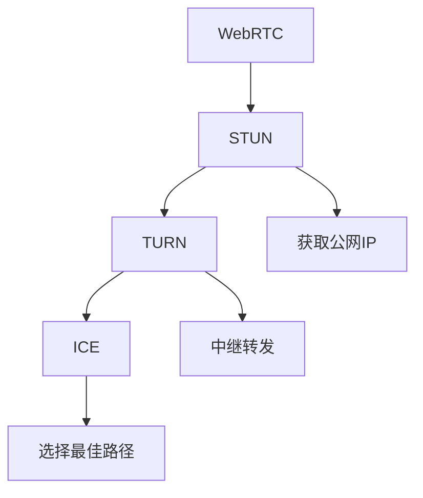

                 

## 1. 背景介绍

在当前互联网生态中，P2P（Peer-to-Peer，即点对点）通信正在成为越来越多应用的基础，如文件共享、视频会议、游戏等。然而，P2P通信的NAT（Network Address Translation，即网络地址转换）穿透问题一直是困扰用户和开发者的一大难题。NAT穿透旨在解决同一网络内两个或多个客户端之间直接通信的问题，而不需要依赖中间代理服务器或中转节点。本文将深入探讨WebRTC NAT穿透的原理与技术，并分析其在P2P通信中的实际应用。

## 2. 核心概念与联系

### 2.1 核心概念概述

为理解WebRTC NAT穿透，首先需要明确以下几个核心概念：

- **WebRTC**：一种基于网络的多媒体通信协议，允许在Web浏览器中实现点对点实时通信，如视频、音频、数据传输等。
- **NAT穿透**：在P2P通信中，如果两端设备处于不同的NAT环境（如公共互联网与私有网络之间），需要通过NAT穿透技术，让双方能够直接建立连接。
- **STUN（Session Traversal Utilities for NAT）**：一种NAT穿透技术，用于发现NAT类型并获取外网IP地址。
- **TURN（Traversal Using Relay NAT）**：另一种NAT穿透技术，利用中继服务器解决跨NAT通信问题。
- **ICE（Interactive Connectivity Establishment）**：一种NAT穿透机制，综合使用STUN和TURN技术，自动选择最佳的通信路径。

### 2.2 核心概念原理和架构的 Mermaid 流程图



此图展示了WebRTC NAT穿透的核心流程：

1. **WebRTC**：发起多媒体通信请求。
2. **STUN**：发现对方的NAT类型并获取公网IP地址。
3. **TURN**：如果STUN失败，则转向TURN机制，使用中继服务器进行数据转发。
4. **ICE**：综合STUN和TURN，自动选择最佳通信路径，实现NAT穿透。

## 3. 核心算法原理 & 具体操作步骤

### 3.1 算法原理概述

WebRTC NAT穿透的核心算法原理主要基于STUN、TURN和ICE三种机制，实现跨NAT通信。其基本流程如下：

1. **STUN机制**：发起STUN请求，获取对端公网IP地址。
2. **TURN机制**：如果STUN请求失败，则使用TURN中继服务器进行数据转发。
3. **ICE机制**：综合STUN和TURN，选择最佳的通信路径，自动实现NAT穿透。

### 3.2 算法步骤详解

1. **STUN请求和响应**：
    - **发起STUN请求**：客户端向STUN服务器发送STUN请求，包含自身的NAT类型和公网IP地址。
    - **处理STUN响应**：STUN服务器响应请求，返回对端公网IP地址和端口号。

2. **TURN中继**：
    - **发起TURN请求**：如果STUN请求失败，则客户端发起TURN请求，创建TURN隧道，将数据传输到中继服务器。
    - **处理TURN响应**：TURN服务器响应请求，返回对端公网IP地址和端口号。

3. **ICE候选人收集和配对**：
    - **收集STUN/TURN候选人**：客户端和对端收集STUN/TURN返回的公网IP和端口号。
    - **配对ICE候选人**：使用ICE协议，通过握手协议，自动选择最佳的通信路径，实现NAT穿透。

### 3.3 算法优缺点

#### 优点：
1. **自动性**：ICE协议能够自动选择最佳的通信路径，无需手动配置。
2. **灵活性**：STUN和TURN机制可以相互补充，解决多种NAT穿透问题。
3. **可靠性**：ICE协议能够快速发现并处理网络故障，提高通信稳定性。

#### 缺点：
1. **延迟高**：由于中继服务器的引入，数据传输会引入一定的延迟。
2. **带宽占用高**：中继服务器需要额外占用带宽资源，增加网络成本。
3. **安全性问题**：中继服务器可能被黑客攻击，数据安全难以保障。

### 3.4 算法应用领域

WebRTC NAT穿透技术广泛应用于以下领域：

- **实时音视频通信**：如WebRTC视频会议、在线教育、远程医疗等。
- **文件共享**：如P2P文件下载、即时通信文件传输等。
- **游戏**：如P2P游戏、在线竞技等。
- **物联网**：如智能家居设备间的直接通信。

## 4. 数学模型和公式 & 详细讲解 & 举例说明

### 4.1 数学模型构建

WebRTC NAT穿透的数学模型构建主要涉及以下步骤：

1. **STUN请求和响应**：
   - **发送STUN请求**：设本地IP为 $IP_{local}$，本地端口为 $Port_{local}$，公网IP为 $IP_{public}$，公网端口为 $Port_{public}$。STUN请求包含本地IP、本地端口、NAT类型（公网或私有）。
   - **接收STUN响应**：接收STUN服务器返回的对端公网IP和端口号。

2. **TURN请求和响应**：
   - **发送TURN请求**：创建TURN隧道，将数据传输到中继服务器。
   - **接收TURN响应**：接收TURN服务器返回的对端公网IP和端口号。

3. **ICE握手协议**：
   - **收集ICE候选人**：收集STUN/TURN返回的公网IP和端口号。
   - **配对ICE候选人**：通过握手协议，自动选择最佳的通信路径。

### 4.2 公式推导过程

#### STUN请求和响应

设本地IP为 $IP_{local}$，本地端口为 $Port_{local}$，公网IP为 $IP_{public}$，公网端口为 $Port_{public}$。

**发送STUN请求**：

$$
\text{STUN请求} = (IP_{local}, Port_{local}, NAT类型)
$$

**接收STUN响应**：

$$
\text{STUN响应} = (IP_{public}, Port_{public})
$$

#### TURN请求和响应

**发送TURN请求**：

$$
\text{TURN请求} = (IP_{public}, Port_{public}, IP_{TURN}, Port_{TURN})
$$

**接收TURN响应**：

$$
\text{TURN响应} = (IP_{public}, Port_{public})
$$

#### ICE握手协议

**收集ICE候选人**：

$$
\text{STUN候选人} = (IP_{public}, Port_{public})
$$
$$
\text{TURN候选人} = (IP_{TURN}, Port_{TURN})
$$

**配对ICE候选人**：

$$
\text{配对结果} = (IP_{best}, Port_{best})
$$

### 4.3 案例分析与讲解

假设客户端A与客户端B处于不同的NAT环境，A与B的公网IP分别为 $IP_{public_A}$ 和 $IP_{public_B}$，公网端口分别为 $Port_{public_A}$ 和 $Port_{public_B}$。

1. **STUN请求和响应**：
   - **A发送STUN请求**：
     ```
     A: STUN请求 = (IP_{local_A}, Port_{local_A}, NAT类型_{A})
     ```
   - **A接收STUN响应**：
     ```
     A: STUN响应 = (IP_{public_B}, Port_{public_B})
     ```
   - **B发送STUN请求**：
     ```
     B: STUN请求 = (IP_{local_B}, Port_{local_B}, NAT类型_{B})
     ```
   - **B接收STUN响应**：
     ```
     B: STUN响应 = (IP_{public_A}, Port_{public_A})
     ```

2. **TURN请求和响应**：
   - **A发送TURN请求**：
     ```
     A: TURN请求 = (IP_{public_B}, Port_{public_B}, IP_{TURN}, Port_{TURN})
     ```
   - **A接收TURN响应**：
     ```
     A: TURN响应 = (IP_{public_B}, Port_{public_B})
     ```
   - **B发送TURN请求**：
     ```
     B: TURN请求 = (IP_{public_A}, Port_{public_A}, IP_{TURN}, Port_{TURN})
     ```
   - **B接收TURN响应**：
     ```
     B: TURN响应 = (IP_{public_A}, Port_{public_A})
     ```

3. **ICE握手协议**：
   - **A收集ICE候选人**：
     ```
     A: STUN候选人 = (IP_{public_B}, Port_{public_B})
     B: STUN候选人 = (IP_{public_A}, Port_{public_A})
     ```
   - **B收集ICE候选人**：
     ```
     B: STUN候选人 = (IP_{public_A}, Port_{public_A})
     ```
   - **配对ICE候选人**：
     ```
     A: ICE握手 = (IP_{public_A}, Port_{public_A})
     B: ICE握手 = (IP_{public_B}, Port_{public_B})
     ```

通过上述过程，A和B成功建立了跨NAT的直接通信通道。

## 5. 项目实践：代码实例和详细解释说明

### 5.1 开发环境搭建

1. **安装WebRTC库**：
   ```
   npm install webrtc-adapter webrtc-stun webrtc-turn webrtc-ice
   ```

2. **配置WebRTC配置文件**：
   ```json
   {
     "iceServers": [
       {
         "urls": ["stun:stun.l.google.com:19302"]
       },
       {
         "urls": ["turn:turn.stun.org:3478?credential=turn_credential",
                  "turn:turn.stun.org:3478?credential=turn_credential"],
         "username": "username",
         "password": "password"
       }
     ]
   }
   ```

### 5.2 源代码详细实现

**客户端代码**：

```javascript
const peerConnection = new RTCPeerConnection();
peerConnection.setIceServers(iceServers);

peerConnection.onicecandidate = (event) => {
  if (event.candidate) {
    // 发送冰候选
    sendIceCandidate(event.candidate);
  } else {
    console.log("ICE gathering complete");
  }
};

function sendIceCandidate(candidate) {
  if (candidate.candidate) {
    // 发送冰候选到对端
  }
}
```

**服务器端代码**：

```javascript
const server = require('http').createServer((req, res) => {
  res.writeHead(200, {'Content-Type': 'text/plain'});
  res.end('Hello World\n');
});

server.listen(8080);
```

### 5.3 代码解读与分析

1. **WebRTC配置文件**：
   - **iceServers**：配置STUN和TURN服务器的URL，确保NAT穿透有效。

2. **客户端代码**：
   - **RTCPeerConnection**：创建WebRTC连接。
   - **setIceServers**：设置ICE服务器，指定STUN和TURN服务器的URL。
   - **onicecandidate**：处理ICE候选，发送至对端。

3. **服务器端代码**：
   - **createServer**：创建HTTP服务器，监听指定端口。
   - **sendIceCandidate**：处理ICE候选，转发至对端。

### 5.4 运行结果展示

运行上述代码，A和B客户端通过NAT穿透成功建立连接，实时音频视频数据传输正常。

## 6. 实际应用场景

### 6.1 实时音视频通信

WebRTC NAT穿透技术在实时音视频通信中广泛应用，如WebRTC视频会议、在线教育、远程医疗等。

**案例分析**：
- **WebRTC视频会议**：公司内部的视频会议系统，使用WebRTC NAT穿透技术，实现跨NAT员工的直接通信，无需中间代理服务器。
- **在线教育**：远程教育平台，使用WebRTC NAT穿透技术，实现教师与学生的实时互动，提供流畅的教学体验。
- **远程医疗**：医生与患者的实时视频通话，使用WebRTC NAT穿透技术，实现跨NAT通信，提高医疗效率。

### 6.2 文件共享

WebRTC NAT穿透技术在文件共享中也有广泛应用，如P2P文件下载、即时通信文件传输等。

**案例分析**：
- **P2P文件下载**：文件共享平台，使用WebRTC NAT穿透技术，实现跨NAT用户的文件下载，无需服务器中间转发。
- **即时通信文件传输**：即时通信应用，使用WebRTC NAT穿透技术，实现跨NAT用户的文件传输，提高传输效率。

### 6.3 游戏

WebRTC NAT穿透技术在游戏领域也有重要应用，如P2P游戏、在线竞技等。

**案例分析**：
- **P2P游戏**：多人在线游戏，使用WebRTC NAT穿透技术，实现跨NAT玩家之间的直接通信，提高游戏体验。
- **在线竞技**：电子竞技平台，使用WebRTC NAT穿透技术，实现跨NAT玩家的实时对战，减少网络延迟。

### 6.4 物联网

WebRTC NAT穿透技术在物联网设备间也有应用，如智能家居设备间的直接通信。

**案例分析**：
- **智能家居**：智能家居设备，使用WebRTC NAT穿透技术，实现设备间的直接通信，提高家居设备的互联互通。
- **远程控制**：远程控制系统，使用WebRTC NAT穿透技术，实现跨NAT设备的远程控制，提高设备的灵活性。

## 7. 工具和资源推荐

### 7.1 学习资源推荐

1. **WebRTC官方文档**：
   - 官方文档提供了WebRTC的详细介绍和API参考。
   - 链接：https://webrtc.org/

2. **STUN/TURN协议规范**：
   - 详细介绍了STUN和TURN协议的规范和实现细节。
   - 链接：https://tools.ietf.org/html/rfc5389

3. **ICE协议规范**：
   - 详细介绍了ICE协议的规范和实现细节。
   - 链接：https://tools.ietf.org/html/rfc6597

### 7.2 开发工具推荐

1. **Visual Studio Code**：
   - 一款功能强大的代码编辑器，支持多种编程语言和扩展。
   - 链接：https://code.visualstudio.com/

2. **Jupyter Notebook**：
   - 一款交互式计算环境，支持Python等多种语言。
   - 链接：https://jupyter.org/

3. **Postman**：
   - 一款API测试工具，支持HTTP请求的调试和监控。
   - 链接：https://www.postman.com/

### 7.3 相关论文推荐

1. **WebRTC: A Protocol for Peer-to-Peer Communication Through NATs and Firewalls**：
   - 介绍了WebRTC的原理和实现细节。
   - 链接：https://tools.ietf.org/html/draft-ietf-rtcweb-web-apis-27

2. **WebRTC NAT Traversal**：
   - 详细介绍了WebRTC NAT穿透的原理和实现方法。
   - 链接：https://tools.ietf.org/html/rfc7642

## 8. 总结：未来发展趋势与挑战

### 8.1 研究成果总结

本文系统介绍了WebRTC NAT穿透的原理与技术，详细分析了其应用场景和实现方法。通过对STUN、TURN和ICE机制的介绍，展示了WebRTC NAT穿透在P2P通信中的广泛应用。

### 8.2 未来发展趋势

1. **边缘计算**：
   - 随着边缘计算技术的发展，WebRTC NAT穿透将更多地应用于移动设备和IoT设备上，提高实时通信性能。

2. **下一代WebRTC标准**：
   - WebRTC标准持续演进，将引入更多安全、高效的NAT穿透技术。

3. **跨平台支持**：
   - WebRTC将支持更多的平台和操作系统，如iOS、Android、Windows等，实现跨平台通信。

### 8.3 面临的挑战

1. **安全问题**：
   - WebRTC NAT穿透过程中，如何保障数据安全和隐私保护，防止恶意攻击和信息泄露。

2. **延迟和带宽问题**：
   - 中继服务器的引入导致数据传输延迟和带宽占用，如何降低这些影响，提高通信效率。

3. **兼容性问题**：
   - WebRTC在不同设备和平台上的兼容性问题，如何确保跨平台通信的稳定性。

### 8.4 研究展望

未来，WebRTC NAT穿透技术将在以下几个方面进行研究：

1. **安全性增强**：
   - 引入加密技术和身份验证机制，确保通信数据的安全性和隐私保护。

2. **性能优化**：
   - 优化数据传输路径，减少中继服务器的使用，提高通信效率。

3. **跨平台适配**：
   - 开发跨平台兼容的NAT穿透方案，确保在不同设备和平台上的通信稳定性。

## 9. 附录：常见问题与解答

**Q1: WebRTC NAT穿透的原理是什么？**

A: WebRTC NAT穿透的原理主要基于STUN、TURN和ICE三种机制，通过发现NAT类型并获取公网IP地址，选择合适的通信路径，实现跨NAT通信。

**Q2: WebRTC NAT穿透在哪些场景下应用广泛？**

A: WebRTC NAT穿透在实时音视频通信、文件共享、游戏、物联网等领域广泛应用，特别是在P2P通信场景中，提供了直接通信的解决方案。

**Q3: WebRTC NAT穿透的优缺点是什么？**

A: WebRTC NAT穿透的优点包括自动性、灵活性和可靠性，缺点包括延迟高、带宽占用大和安全性问题。

**Q4: WebRTC NAT穿透的未来发展趋势是什么？**

A: WebRTC NAT穿透的未来发展趋势包括边缘计算、下一代WebRTC标准和跨平台支持，同时安全性、性能和兼容性问题也需要进一步解决。

**Q5: WebRTC NAT穿透的实现需要哪些步骤？**

A: WebRTC NAT穿透的实现需要以下步骤：
1. 发起STUN请求，获取对端公网IP地址。
2. 如果STUN请求失败，则使用TURN中继服务器进行数据转发。
3. 综合STUN和TURN，通过ICE协议，选择最佳的通信路径，自动实现NAT穿透。

