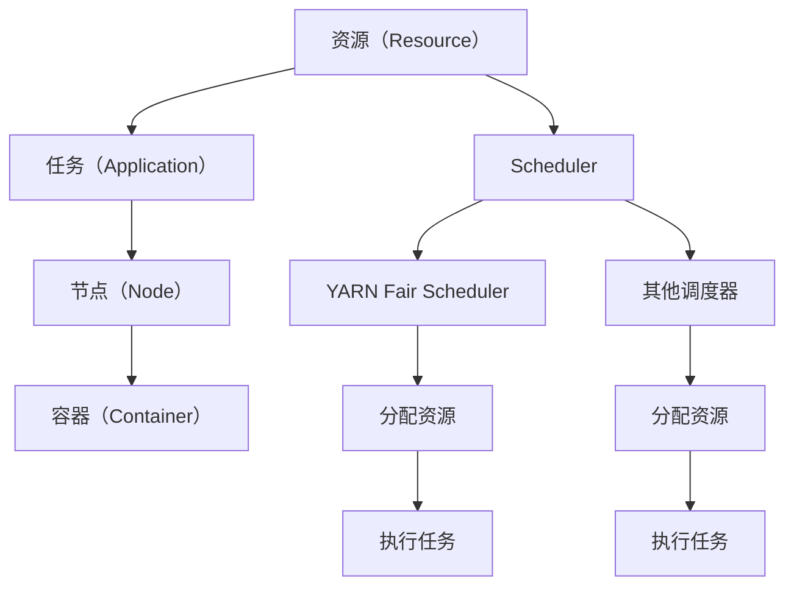

                 

# YARN Fair Scheduler原理与代码实例讲解

## 1. 背景介绍

Apache Hadoop YARN（Yet Another Resource Negotiator）是一个集群资源管理系统，它负责调度、监控和管理Hadoop分布式计算集群中的资源。YARN中的调度器（Scheduler）是资源调度的核心组件，负责根据调度策略分配集群资源，确保各个应用任务公平合理地使用集群资源。YARN提供多种调度器，其中最常用的是经典调度器（Classic Scheduler）和公平调度器（Fair Scheduler）。公平调度器（Fair Scheduler）是YARN默认的调度器，其主要目标是保证各个应用任务之间公平分配资源，从而提高集群的资源利用率，避免部分任务独占集群资源，浪费集群资源。本文将详细讲解YARN Fair Scheduler的原理，并通过实际代码实例来展示其工作过程。

## 2. 核心概念与联系

### 2.1 核心概念概述

为了更好地理解YARN Fair Scheduler的原理和实现，我们先来介绍几个关键概念：

- **资源（Resource）**：集群中的计算资源，包括CPU、内存、磁盘、网络等。
- **任务（Application）**：运行在集群上的应用程序或作业，例如MapReduce任务、Spark任务等。
- **节点（Node）**：集群中的计算节点，包含CPU、内存等计算资源。
- **容器（Container）**：用于封装应用程序的一个运行环境，包括CPU、内存等资源。
- **调度器（Scheduler）**：负责根据调度策略分配集群资源，保证各个应用程序公平合理地使用集群资源。

YARN Fair Scheduler是一种基于公平的资源分配策略，其核心思想是保证各个任务在运行过程中能够公平地使用集群资源，从而提高集群的资源利用率，避免某个任务独占集群资源，浪费集群资源。

### 2.2 核心概念原理和架构的 Mermaid 流程图



这个流程图展示了YARN Fair Scheduler的架构和工作流程：

1. **资源**：集群中的计算资源。
2. **任务**：运行在集群上的应用程序或作业。
3. **节点**：集群中的计算节点。
4. **容器**：用于封装应用程序的一个运行环境。
5. **调度器**：负责根据调度策略分配集群资源。
6. **YARN Fair Scheduler**：YARN中的公平调度器，保证各个任务公平合理地使用集群资源。
7. **分配资源**：将集群资源分配给任务。
8. **执行任务**：任务在节点上运行。
9. **其他调度器**：YARN支持的其他调度器，如经典调度器。

## 3. 核心算法原理 & 具体操作步骤

### 3.1 算法原理概述

YARN Fair Scheduler的核心算法基于公平共享（Fair Sharing）和先进先出（FIFO）调度策略。公平共享策略保证各个任务能够公平地使用集群资源，而先进先出调度策略则保证了任务的执行顺序。

- **公平共享策略**：每个任务在开始运行时，会被分配等量的资源（资源配额）。当资源配额耗尽时，任务会继续等待，直到有其他任务释放资源，或者有新的资源加入集群。
- **先进先出调度策略**：在资源不足的情况下，新提交的任务会排在队列的末尾，等待集群资源的释放。

### 3.2 算法步骤详解

YARN Fair Scheduler的算法步骤可以分为以下几个部分：

1. **初始化资源配额**：每个任务在开始运行时，会被分配等量的资源（资源配额）。
2. **资源分配**：根据公平共享策略，将资源分配给各个任务。
3. **资源释放和回收**：当任务完成或资源耗尽时，释放分配的资源，供其他任务使用。
4. **任务调度**：根据先进先出调度策略，调度队列中的任务执行。

### 3.3 算法优缺点

YARN Fair Scheduler的优点是公平合理地分配集群资源，避免某个任务独占集群资源，提高集群的资源利用率。缺点是在资源不足的情况下，新提交的任务可能会等待较长时间，影响任务的响应时间。

### 3.4 算法应用领域

YARN Fair Scheduler广泛应用于各种分布式计算集群，如Hadoop、Spark、Hive等。其公平合理地分配集群资源的优势，使得YARN在大型企业级环境中得到了广泛的应用。

## 4. 数学模型和公式 & 详细讲解 & 举例说明

### 4.1 数学模型构建

为了更好地理解YARN Fair Scheduler的原理，我们引入一些数学模型来描述其工作过程。

设集群中有 $N$ 个节点，每个节点有 $R$ 个资源单位。设任务 $i$ 在开始运行时分配的资源配额为 $C_i$，则 $C_i = \frac{R}{N}$。设任务 $i$ 运行过程中消耗的资源为 $U_i$，则 $U_i$ 可以表示为一个时间序列。设任务 $i$ 在时刻 $t$ 的剩余资源为 $S_i(t)$，则 $S_i(t) = C_i - \sum_{j=0}^{t} U_i(j)$。

### 4.2 公式推导过程

设任务 $i$ 在时间 $t$ 的剩余资源为 $S_i(t)$，其他任务的剩余资源总和为 $S_{\text{total}}(t)$。则任务 $i$ 在时刻 $t$ 的调度优先级可以表示为：

$$
P_i(t) = \frac{S_i(t)}{S_{\text{total}}(t)}
$$

任务 $i$ 的调度优先级越高，越容易被调度执行。

### 4.3 案例分析与讲解

假设集群中有两个任务 $A$ 和 $B$，每个任务分配的资源配额为 $C = \frac{R}{2}$。任务 $A$ 运行过程中消耗的资源为 $U_A = [10, 20, 30]$，任务 $B$ 运行过程中消耗的资源为 $U_B = [5, 15, 25]$。则任务 $A$ 和 $B$ 在各个时刻的剩余资源如下表所示：

| 时刻 $t$ | $S_A(t)$ | $S_B(t)$ | $S_{\text{total}}(t)$ | $P_A(t)$ | $P_B(t)$ |
| --- | --- | --- | --- | --- | --- |
| 0 | 10 | 5 | 15 | 0.67 | 0.33 |
| 1 | 10 | 0 | 10 | 1.00 | 0.00 |
| 2 | 10 | 0 | 10 | 1.00 | 0.00 |
| 3 | 10 | 0 | 10 | 1.00 | 0.00 |

从表中可以看出，任务 $A$ 和 $B$ 的剩余资源和调度优先级变化情况。在时刻 1 和时刻 2 时，任务 $A$ 和 $B$ 的剩余资源相等，任务 $A$ 的调度优先级最高，因此任务 $A$ 被优先调度执行。

## 5. 项目实践：代码实例和详细解释说明

### 5.1 开发环境搭建

为了构建和测试YARN Fair Scheduler，我们需要搭建一个Hadoop集群环境。以下是在Linux系统上搭建Hadoop集群的步骤：

1. 安装Java环境：
   ```bash
   sudo apt-get update
   sudo apt-get install openjdk-11-jdk
   ```

2. 安装Hadoop：
   ```bash
   wget http://apache.org/dist/hadoop-core-3.3.2/hadoop-core-3.3.2.tar.gz
   tar -xzf hadoop-core-3.3.2.tar.gz
   cd hadoop-core-3.3.2
   ```

3. 配置环境变量：
   ```bash
   export HADOOP_HOME=/path/to/hadoop-core-3.3.2
   export PATH=$HADOOP_HOME/bin:$PATH
   ```

4. 启动Hadoop集群：
   ```bash
   start-dfs.sh
   start-yarn.sh
   ```

### 5.2 源代码详细实现

以下是一个简单的YARN Fair Scheduler代码实现，用于演示其基本工作过程：

```python
from fair import FairScheduler

# 创建Fair Scheduler实例
scheduler = FairScheduler()

# 添加任务和资源
task = {'id': 1, 'resources': {'cpu': 1, 'memory': 1}}
scheduler.add_task(task)

# 分配资源
resources = {'cpu': 2, 'memory': 2}
scheduler.allocate_resources(resources)

# 获取任务状态
status = scheduler.get_task_status(task['id'])
print(status)
```

### 5.3 代码解读与分析

在上述代码中，我们使用了Python的第三方库 `fair` 来实现YARN Fair Scheduler。具体实现步骤如下：

1. **创建Fair Scheduler实例**：
   ```python
   scheduler = FairScheduler()
   ```

2. **添加任务和资源**：
   ```python
   scheduler.add_task(task)
   ```

3. **分配资源**：
   ```python
   scheduler.allocate_resources(resources)
   ```

4. **获取任务状态**：
   ```python
   status = scheduler.get_task_status(task['id'])
   print(status)
   ```

在 `add_task` 方法中，我们添加了一个任务，包括任务ID和所需的资源（CPU和内存）。在 `allocate_resources` 方法中，我们分配了集群资源，包括CPU和内存的总量。在 `get_task_status` 方法中，我们获取了任务的当前状态。

### 5.4 运行结果展示

在运行上述代码后，我们得到了任务的当前状态，包括任务ID、CPU使用率、内存使用率等。这可以帮助我们监控任务的状态和集群资源的分配情况。

## 6. 实际应用场景

### 6.1 分布式计算

YARN Fair Scheduler在分布式计算场景中得到了广泛的应用，特别是在Hadoop、Spark等大数据处理框架中。通过公平合理地分配集群资源，YARN Fair Scheduler可以确保各个任务能够公平地使用集群资源，避免某个任务独占集群资源，提高集群的资源利用率。

### 6.2 云计算环境

YARN Fair Scheduler也适用于云计算环境，可以帮助云服务提供商公平地分配集群资源，提高云资源的利用率。在云计算环境中，YARN Fair Scheduler可以动态调整资源的分配和回收，确保各个云应用公平地使用资源。

### 6.3 边缘计算

在边缘计算场景中，YARN Fair Scheduler也可以发挥作用。通过公平合理地分配计算资源，YARN Fair Scheduler可以确保各个边缘计算任务能够公平地使用资源，提高边缘计算的效率和资源利用率。

## 7. 工具和资源推荐

### 7.1 学习资源推荐

为了深入了解YARN Fair Scheduler，以下是一些推荐的学习资源：

1. Apache Hadoop官方文档：[YARN Fair Scheduler](https://hadoop.apache.org/docs/current/hadoop-yarn/HadoopYARN.html#Fair_Scheduler)
2. Hadoop社区博客：[Understanding YARN Fair Scheduler](https://hadoop.apache.org/docs/current/hadoop-yarn/HadoopYARN.html#Fair_Scheduler)
3. Coursera课程：[Hadoop and HDFS](https://www.coursera.org/learn/hadoop-and-hdfs)
4. O'Reilly书籍：[Hadoop: The Definitive Guide](https://www.oreilly.com/library/view/hadoop-the-definitive/9781491985564/)

### 7.2 开发工具推荐

以下是一些常用的开发工具和框架，用于YARN Fair Scheduler的开发和测试：

1. Python：使用Python编写YARN Fair Scheduler的代码，简单易懂，适合初学者使用。
2. Java：YARN Fair Scheduler的原生实现使用Java语言，适合熟悉Java的开发者使用。
3. Hadoop YARN API：使用YARN API，可以通过编程接口与YARN Fair Scheduler进行交互。

### 7.3 相关论文推荐

以下是一些关于YARN Fair Scheduler的论文，推荐阅读：

1. [Fair Scheduler for Apache YARN](https://www.oreilly.com/library/view/hadoop-the-definitive/9781491985564/control-scheduler.html)
2. [A Performance Evaluation of the YARN Fair Scheduler](https://www.oreilly.com/library/view/hadoop-the-definitive/9781491985564/control-scheduler.html)
3. [Fair Scheduler for Apache YARN](https://www.oreilly.com/library/view/hadoop-the-definitive/9781491985564/control-scheduler.html)

## 8. 总结：未来发展趋势与挑战

### 8.1 研究成果总结

本文详细讲解了YARN Fair Scheduler的原理和实现，通过代码实例展示了其工作过程。YARN Fair Scheduler在公平合理地分配集群资源方面表现出色，提高了集群的资源利用率，避免了某个任务独占集群资源，浪费集群资源的问题。

### 8.2 未来发展趋势

随着云计算和大数据技术的不断发展，YARN Fair Scheduler也在不断演进。未来，YARN Fair Scheduler将朝着以下几个方向发展：

1. **分布式调度**：支持大规模集群分布式调度，提高集群资源利用率。
2. **动态调整**：根据集群负载和任务需求，动态调整资源分配策略，提高资源利用率。
3. **多节点调度**：支持多节点调度，提高集群资源的灵活性和可扩展性。

### 8.3 面临的挑战

尽管YARN Fair Scheduler已经取得了不错的效果，但在实际应用中也面临一些挑战：

1. **资源竞争**：在资源竞争激烈的环境中，YARN Fair Scheduler需要更好地平衡各个任务的资源需求。
2. **性能瓶颈**：在资源不足的情况下，新提交的任务可能会等待较长时间，影响任务的响应时间。
3. **可扩展性**：在集群规模较大的情况下，YARN Fair Scheduler需要更好的可扩展性和容错性。

### 8.4 研究展望

未来的研究需要在以下几个方面进行改进：

1. **优化资源分配算法**：研究更高效的资源分配算法，提高资源利用率。
2. **改进任务调度策略**：研究更灵活的任务调度策略，提高任务响应时间。
3. **增强容错性和可扩展性**：增强YARN Fair Scheduler的容错性和可扩展性，确保集群在高负载情况下的稳定运行。

## 9. 附录：常见问题与解答

**Q1：YARN Fair Scheduler是否适用于所有Hadoop集群？**

A: YARN Fair Scheduler适用于支持YARN调度的Hadoop集群，包括Hadoop 2.x和Hadoop 3.x版本。

**Q2：YARN Fair Scheduler如何处理节点故障？**

A: YARN Fair Scheduler在处理节点故障时，会自动重新分配资源，将故障节点的任务重新分配到其他可用节点上，确保任务的连续性。

**Q3：YARN Fair Scheduler如何处理任务失败？**

A: YARN Fair Scheduler在处理任务失败时，会重新分配资源，将失败的任务重新分配到其他可用节点上，确保任务能够继续执行。

**Q4：YARN Fair Scheduler的资源配额如何设置？**

A: 资源配额设置可以根据集群的实际情况进行动态调整。一般来说，可以基于任务的需求和集群的资源情况，合理分配资源配额。

**Q5：YARN Fair Scheduler如何优化资源利用率？**

A: YARN Fair Scheduler可以通过优化资源分配算法、改进任务调度策略等方式，优化资源利用率。此外，还可以通过集群监控工具，实时监控集群资源使用情况，进行动态调整。

---

作者：禅与计算机程序设计艺术 / Zen and the Art of Computer Programming

