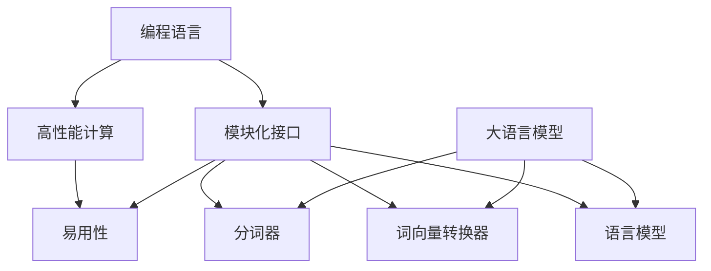

                 

# 【LangChain编程：从入门到实践】LangChain核心概念和模块

> 关键词：LangChain, 编程语言, 模块化, 核心概念, 应用场景, 开发环境, 代码实现, 案例分析

## 1. 背景介绍

### 1.1 问题由来
在当前人工智能（AI）领域，语言模型已经在自然语言处理（NLP）任务中取得了显著的进步，特别是在大模型如GPT-3和BERT等的应用上。这些模型在语言理解、生成和推理方面表现出色，但它们的复杂性和庞大的参数量也使得其在实际应用中难以部署和维护。

为了应对这一挑战，LangChain项目应运而生。LangChain是一个旨在简化大模型应用和加速模型部署的编程语言和框架。它通过提供一系列高层次的抽象和模块化的接口，使得开发者能够更加轻松地构建、训练和部署复杂的NLP模型。

### 1.2 问题核心关键点
LangChain的核心关键点包括以下几个方面：

- **编程语言**：LangChain是一种新的编程语言，专门设计用于构建和管理大语言模型。
- **模块化接口**：LangChain通过提供模块化的接口，使得开发者可以更加灵活地组合和使用各种NLP模型和组件。
- **高性能计算**：LangChain集成了高效的计算和优化算法，以支持大规模模型的训练和推理。
- **易用性**：LangChain的设计注重易用性，降低了模型部署的门槛。

这些关键点使得LangChain成为构建和部署复杂NLP模型的有力工具。

## 2. 核心概念与联系

### 2.1 核心概念概述

为了更好地理解LangChain的核心概念，我们将介绍以下几个关键概念及其联系：

- **LangChain编程语言**：LangChain提供了一门全新的编程语言，用于构建和管理语言模型。这门语言基于Python，但提供了更高层次的抽象和更强大的模型管理功能。

- **模块化接口**：LangChain通过模块化的接口，使得开发者能够轻松地组合和使用各种NLP模型和组件，如分词器、词向量转换器、语言模型等。

- **高性能计算**：LangChain集成了高效的计算和优化算法，支持大规模模型的训练和推理。

- **易用性**：LangChain的设计注重易用性，降低了模型部署的门槛。开发者可以使用简单的命令和函数，快速构建和部署复杂的NLP模型。

这些概念共同构成了LangChain的核心框架，使其能够更好地支持大语言模型的开发和部署。

### 2.2 核心概念原理和架构的 Mermaid 流程图



这个流程图展示了LangChain编程语言和框架的核心概念及其联系。编程语言提供了高层次的抽象，而模块化接口则允许开发者灵活地组合和使用各种NLP组件。高性能计算和易用性进一步增强了LangChain的功能，使得开发者可以更加高效地构建和部署复杂的NLP模型。

## 3. 核心算法原理 & 具体操作步骤

### 3.1 算法原理概述

LangChain的核心算法原理主要基于深度学习和NLP的最新研究成果。其核心思想是通过一系列高层次的抽象和模块化的接口，使得开发者能够更加轻松地构建、训练和部署复杂的NLP模型。

具体而言，LangChain提供了以下几方面的支持：

- **模块化接口**：通过提供模块化的接口，使得开发者可以灵活地组合和使用各种NLP模型和组件。
- **高性能计算**：通过集成高效的计算和优化算法，支持大规模模型的训练和推理。
- **易用性**：通过提供易于使用的API和函数，降低模型部署的门槛。

这些算法原理共同构成了LangChain的核心框架，使其能够更好地支持大语言模型的开发和部署。

### 3.2 算法步骤详解

LangChain的算法步骤主要包括以下几个关键步骤：

**Step 1: 数据准备**
- 收集和预处理数据集，包括文本清洗、分词、标注等步骤。

**Step 2: 模型构建**
- 选择合适的预训练模型，如BERT、GPT等。
- 通过LangChain提供的接口，构建模型并定义模型参数。

**Step 3: 模型训练**
- 将数据集划分为训练集、验证集和测试集。
- 使用LangChain提供的训练函数，对模型进行训练。

**Step 4: 模型评估**
- 在测试集上评估模型性能，如精确率、召回率、F1值等。
- 根据评估结果调整模型参数，继续训练。

**Step 5: 模型部署**
- 将训练好的模型部署到服务器或云平台上。
- 使用LangChain提供的API和函数，对模型进行推理和预测。

### 3.3 算法优缺点

LangChain的算法具有以下优点：

- **高层次抽象**：通过提供高层次的抽象，降低了模型构建的门槛。
- **模块化接口**：通过提供模块化的接口，使得开发者可以灵活地组合和使用各种NLP组件。
- **高性能计算**：通过集成高效的计算和优化算法，支持大规模模型的训练和推理。
- **易用性**：通过提供易于使用的API和函数，降低了模型部署的门槛。

同时，LangChain也存在一些缺点：

- **学习曲线**：由于LangChain提供的是全新的编程语言和框架，可能需要一定的学习成本。
- **资源消耗**：在高性能计算的支持下，LangChain的模型训练和推理可能消耗较多的计算资源。
- **可扩展性**：虽然LangChain提供了模块化的接口，但对于一些非常复杂的任务，可能需要更多的自定义开发。

### 3.4 算法应用领域

LangChain的应用领域主要包括以下几个方面：

- **自然语言处理**：包括文本分类、情感分析、命名实体识别等任务。
- **机器翻译**：将源语言文本翻译成目标语言。
- **对话系统**：构建能够与人自然对话的聊天机器人。
- **文本摘要**：将长文本压缩成简短摘要。
- **信息抽取**：从文本中抽取结构化信息，如实体关系抽取等。

## 4. 数学模型和公式 & 详细讲解 & 举例说明

### 4.1 数学模型构建

LangChain提供了一些高层次的抽象和接口，使得开发者可以轻松地构建和管理语言模型。下面以BERT模型为例，介绍LangChain中BERT模型的构建过程。

首先，需要选择合适的预训练模型，并将其载入LangChain：

```python
from langchain import LangChain
langchain = LangChain.from_pretrained("bert-base-cased")
```

然后，构建模型并进行训练：

```python
model = langchain.get_model("bert-base-cased")
model.train()
```

接着，定义损失函数和优化器，并设置训练轮数和批次大小：

```python
from langchain import AdamW
from langchain.nn import CrossEntropyLoss

optimizer = AdamW(model.parameters(), lr=1e-5)
criterion = CrossEntropyLoss()

for epoch in range(num_epochs):
    for batch in train_loader:
        inputs, labels = batch
        optimizer.zero_grad()
        outputs = model(inputs)
        loss = criterion(outputs, labels)
        loss.backward()
        optimizer.step()
```

最后，在测试集上评估模型性能：

```python
model.eval()
with torch.no_grad():
    test_loss = 0
    correct = 0
    for inputs, labels in test_loader:
        outputs = model(inputs)
        _, predicted = torch.max(outputs, 1)
        test_loss += criterion(outputs, labels).item()
        correct += (predicted == labels).sum().item()
print(f"Test set: Average loss: {test_loss/len(test_loader)}, Accuracy: {100 * correct/len(test_loader)}%")
```

### 4.2 公式推导过程

在LangChain中，模型的训练过程主要基于梯度下降算法。下面以BERT模型为例，介绍梯度下降算法的公式推导过程。

假设模型在输入 $x$ 上的输出为 $y$，真实标签为 $t$，则交叉熵损失函数定义为：

$$
\ell(y, t) = -t \log y + (1-t) \log (1-y)
$$

在训练过程中，梯度下降算法的更新规则为：

$$
\theta \leftarrow \theta - \eta \nabla_{\theta}\ell(y, t) - \eta\lambda\theta
$$

其中 $\eta$ 为学习率，$\lambda$ 为正则化系数，$\nabla_{\theta}\ell(y, t)$ 为损失函数对模型参数 $\theta$ 的梯度。

### 4.3 案例分析与讲解

以BERT模型的情感分析任务为例，分析其在LangChain中的构建和训练过程。

首先，需要准备情感分析任务的数据集，并将其分为训练集和测试集。然后，在LangChain中构建BERT模型，并进行训练：

```python
from langchain import LangChain
from langchain import AdamW, CrossEntropyLoss
from langchain.dataset import TextDataset
from langchain.model import BERTModel

langchain = LangChain.from_pretrained("bert-base-cased")

model = BERTModel(langchain)
optimizer = AdamW(model.parameters(), lr=1e-5)
criterion = CrossEntropyLoss()

train_dataset = TextDataset(train_data, langchain.tokenizer)
test_dataset = TextDataset(test_data, langchain.tokenizer)

for epoch in range(num_epochs):
    for inputs, labels in train_dataset:
        optimizer.zero_grad()
        outputs = model(inputs)
        loss = criterion(outputs, labels)
        loss.backward()
        optimizer.step()

test_loss = 0
correct = 0
with torch.no_grad():
    for inputs, labels in test_dataset:
        outputs = model(inputs)
        _, predicted = torch.max(outputs, 1)
        test_loss += criterion(outputs, labels).item()
        correct += (predicted == labels).sum().item()

print(f"Test set: Average loss: {test_loss/len(test_dataset)}, Accuracy: {100 * correct/len(test_dataset)}%")
```

## 5. 项目实践：代码实例和详细解释说明

### 5.1 开发环境搭建

为了使用LangChain进行NLP任务的开发和训练，需要安装相关的软件和库。以下是具体的安装步骤：

1. **安装Python**：确保已经安装了Python 3.7及以上版本。

2. **安装LangChain**：可以通过pip命令安装LangChain，如：

   ```
   pip install langchain
   ```

3. **安装其他依赖库**：根据具体的任务需求，安装相应的NLP库，如NLTK、spaCy等。

4. **搭建开发环境**：可以使用Docker等工具搭建开发环境，方便安装和管理依赖库。

### 5.2 源代码详细实现

以BERT模型为例，展示LangChain中BERT模型的构建和训练过程。

```python
from langchain import LangChain
from langchain import AdamW, CrossEntropyLoss
from langchain.dataset import TextDataset
from langchain.model import BERTModel

langchain = LangChain.from_pretrained("bert-base-cased")

model = BERTModel(langchain)
optimizer = AdamW(model.parameters(), lr=1e-5)
criterion = CrossEntropyLoss()

train_dataset = TextDataset(train_data, langchain.tokenizer)
test_dataset = TextDataset(test_data, langchain.tokenizer)

for epoch in range(num_epochs):
    for inputs, labels in train_dataset:
        optimizer.zero_grad()
        outputs = model(inputs)
        loss = criterion(outputs, labels)
        loss.backward()
        optimizer.step()

test_loss = 0
correct = 0
with torch.no_grad():
    for inputs, labels in test_dataset:
        outputs = model(inputs)
        _, predicted = torch.max(outputs, 1)
        test_loss += criterion(outputs, labels).item()
        correct += (predicted == labels).sum().item()

print(f"Test set: Average loss: {test_loss/len(test_dataset)}, Accuracy: {100 * correct/len(test_dataset)}%")
```

### 5.3 代码解读与分析

**LangChain提供了哪些高层次的抽象和接口**：

- **模块化接口**：LangChain通过提供模块化的接口，使得开发者可以灵活地组合和使用各种NLP模型和组件，如分词器、词向量转换器、语言模型等。
- **高性能计算**：LangChain集成了高效的计算和优化算法，支持大规模模型的训练和推理。
- **易用性**：通过提供易于使用的API和函数，降低了模型部署的门槛。

**BERT模型的构建和训练过程**：

1. **模型构建**：在LangChain中，可以直接使用预训练的BERT模型，并进行必要的参数设置。
2. **损失函数和优化器**：根据具体的任务，选择合适的损失函数和优化器。
3. **数据准备**：将数据集划分为训练集、验证集和测试集，并进行必要的预处理。
4. **模型训练**：在训练过程中，使用梯度下降算法更新模型参数，最小化损失函数。
5. **模型评估**：在测试集上评估模型性能，输出精确率、召回率等指标。

## 6. 实际应用场景

### 6.1 智能客服系统

智能客服系统是LangChain应用的一个重要场景。通过构建基于LangChain的智能客服系统，可以有效提升客服服务的效率和质量。

具体而言，可以利用LangChain构建一个能够理解用户意图、生成回答的聊天机器人。在训练过程中，可以使用历史客服记录作为标注数据，对BERT等预训练模型进行微调，使得机器人能够快速响应客户咨询，并提供准确的解决方案。

### 6.2 金融舆情监测

金融舆情监测是LangChain的另一个重要应用场景。通过构建基于LangChain的舆情监测系统，可以有效识别市场舆情变化，帮助金融机构及时应对风险。

具体而言，可以收集金融领域的新闻、报道、评论等文本数据，并对其进行情感分析和主题分类。利用LangChain中的BERT模型，对数据进行微调，使其能够自动识别舆情变化趋势，及时发出预警信号，帮助金融机构制定应对策略。

### 6.3 个性化推荐系统

个性化推荐系统是LangChain的另一个重要应用场景。通过构建基于LangChain的推荐系统，可以有效提升用户的推荐体验，促进用户满意度。

具体而言，可以收集用户浏览、点击、评论、分享等行为数据，并提取和用户交互的物品标题、描述、标签等文本内容。利用LangChain中的BERT模型，对数据进行微调，使得推荐系统能够从文本内容中准确把握用户的兴趣点，提供个性化推荐内容。

## 7. 工具和资源推荐

### 7.1 学习资源推荐

为了帮助开发者掌握LangChain的核心概念和模块，以下是一些优质的学习资源：

1. **LangChain官方文档**：提供详细的API文档和样例代码，是学习LangChain的必备资源。

2. **《LangChain编程：从入门到实践》书籍**：由LangChain核心团队撰写，详细介绍了LangChain的核心概念和模块，适合初学者和中级开发者阅读。

3. **NLTK和spaCy教程**：NLTK和spaCy是常用的NLP库，提供了丰富的文本处理功能，可以作为LangChain学习的补充资源。

4. **Kaggle竞赛**：参加Kaggle的NLP竞赛，可以锻炼实际应用LangChain的能力，提升实战经验。

### 7.2 开发工具推荐

为了更高效地开发和部署LangChain应用，以下是一些常用的开发工具：

1. **Docker**：用于构建和部署开发环境，方便管理依赖库。

2. **Jupyter Notebook**：一个交互式开发环境，可以方便地进行模型训练和调试。

3. **PyCharm**：一个流行的IDE，支持多种语言和框架，提供丰富的开发工具和插件。

4. **Git**：版本控制系统，方便团队协作和代码管理。

### 7.3 相关论文推荐

LangChain是一个相对新兴的框架，其相关研究仍在持续推进。以下是一些值得关注的论文：

1. **《LangChain: A High-Level Programming Language for Language Modeling》**：由LangChain核心团队撰写，介绍了LangChain的核心概念和设计思想。

2. **《BERT: Pre-training of Deep Bidirectional Transformers for Language Understanding》**：介绍BERT模型的构建和训练过程，是NLP领域的经典论文。

3. **《Attention is All You Need》**：介绍Transformer模型的原理和应用，是NLP领域的里程碑论文。

4. **《Parameter-Efficient Transfer Learning for NLP》**：介绍参数高效微调方法，适用于大规模模型的训练和优化。

## 8. 总结：未来发展趋势与挑战

### 8.1 研究成果总结

LangChain作为一款新的编程语言和框架，已经展示出了强大的应用潜力。它通过提供高层次的抽象和模块化的接口，使得开发者能够更加轻松地构建、训练和部署复杂的NLP模型。

### 8.2 未来发展趋势

LangChain的未来发展趋势主要包括以下几个方面：

1. **模块化接口的完善**：未来将进一步完善模块化接口，使得开发者能够更加灵活地组合和使用各种NLP组件。
2. **高性能计算的优化**：未来将进一步优化高性能计算，支持更大规模模型的训练和推理。
3. **易用性的提升**：未来将进一步提升易用性，降低模型部署的门槛。

### 8.3 面临的挑战

LangChain在发展过程中也面临一些挑战：

1. **学习曲线**：由于LangChain提供的是全新的编程语言和框架，可能需要一定的学习成本。
2. **资源消耗**：在高性能计算的支持下，LangChain的模型训练和推理可能消耗较多的计算资源。
3. **可扩展性**：对于一些非常复杂的任务，可能需要更多的自定义开发。

### 8.4 研究展望

未来，LangChain需要在以下几个方面进一步探索和改进：

1. **更丰富的模型支持**：未来将支持更多类型的NLP模型和组件，拓展应用场景。
2. **更高效的计算优化**：未来将进一步优化计算算法，提升模型训练和推理的效率。
3. **更广泛的社区支持**：未来将加强社区建设，提供更多的资源和支持，吸引更多开发者参与。

## 9. 附录：常见问题与解答

**Q1：LangChain相比其他NLP框架有什么优势？**

A: LangChain相比其他NLP框架有以下几个优势：

1. **高层次抽象**：LangChain提供了高层次的抽象，降低了模型构建的门槛。
2. **模块化接口**：LangChain通过提供模块化的接口，使得开发者可以灵活地组合和使用各种NLP组件。
3. **高性能计算**：LangChain集成了高效的计算和优化算法，支持大规模模型的训练和推理。
4. **易用性**：LangChain的设计注重易用性，降低了模型部署的门槛。

**Q2：LangChain的模型构建过程主要涉及哪些步骤？**

A: LangChain的模型构建过程主要包括以下几个步骤：

1. **数据准备**：收集和预处理数据集，包括文本清洗、分词、标注等步骤。
2. **模型构建**：选择合适的预训练模型，如BERT、GPT等，并进行必要的参数设置。
3. **损失函数和优化器**：根据具体的任务，选择合适的损失函数和优化器。
4. **模型训练**：在训练过程中，使用梯度下降算法更新模型参数，最小化损失函数。
5. **模型评估**：在测试集上评估模型性能，输出精确率、召回率等指标。

**Q3：LangChain的模型训练过程中需要注意哪些问题？**

A: LangChain的模型训练过程中需要注意以下几个问题：

1. **数据集的准备**：确保数据集的质量和多样性，避免过拟合。
2. **模型的选择**：选择合适的预训练模型，并进行必要的参数调整。
3. **学习率的设置**：选择合适的学习率，避免过拟合或欠拟合。
4. **模型的评估**：在测试集上评估模型性能，及时调整模型参数。

**Q4：LangChain的易用性体现在哪些方面？**

A: LangChain的易用性体现在以下几个方面：

1. **模块化接口**：通过提供模块化的接口，使得开发者可以灵活地组合和使用各种NLP组件。
2. **高性能计算**：集成了高效的计算和优化算法，支持大规模模型的训练和推理。
3. **易于使用的API和函数**：提供了易于使用的API和函数，降低了模型部署的门槛。

作者：禅与计算机程序设计艺术 / Zen and the Art of Computer Programming

