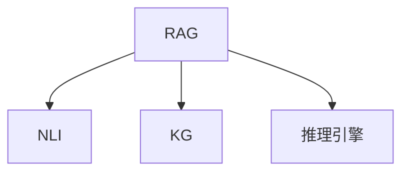

                 

# 【LangChain编程：从入门到实践】RAG技术概述

> 关键词：RAG, 编程, LangChain, 深度学习, 自然语言处理(NLP), 推理引擎, 推理架构, 知识图谱, 知识表示, 推理优化

## 1. 背景介绍

### 1.1 问题由来
在自然语言处理(NLP)领域，推理能力一直是核心需求之一。面对复杂的自然语言文本，仅仅依赖统计模型或预训练语言模型是不够的，我们需要能够理解、推理和解释文本的能力。然而，传统的NLP模型如BERT、GPT等在推理能力上存在明显局限。它们是基于大量无标签文本进行预训练的，无法直接处理包含特定领域知识的推理任务。

为了应对这一挑战，研究人员提出了一种名为RAG（Retrieval-Augmented Reasoning Graph）的新型推理架构。RAG结合了自然语言推理(NLI)和知识图谱(KG)，通过检索和推理相结合的方式，增强了模型的推理能力。本文将从技术角度深入探讨RAG的原理、应用和实践方法，帮助读者掌握RAG技术的核心思想和实现细节。

### 1.2 问题核心关键点
RAG技术的核心在于：
- 如何将知识图谱和自然语言推理相结合，构建多模态的推理架构。
- 如何高效检索和利用知识图谱中的知识，增强模型的推理能力。
- 如何设计高效的推理引擎，处理大规模的推理计算任务。
- 如何优化推理模型的参数和结构，提升推理性能。

## 2. 核心概念与联系

### 2.1 核心概念概述

为了更好地理解RAG技术，本节将介绍几个密切相关的核心概念：

- **RAG (Retrieval-Augmented Reasoning Graph)**：RAG是一种新型推理架构，通过将知识图谱和自然语言推理相结合，增强了模型的推理能力。RAG架构包括一个知识图谱的嵌入表示、一个自然语言推理模型和一个推理引擎。

- **自然语言推理 (NLI)**：NLI是指通过理解自然语言文本，进行逻辑推理或判断的过程。NLI模型能够根据上下文信息，判断两个文本之间是否存在蕴含、矛盾或中立关系。

- **知识图谱 (KG)**：KG是一种结构化表示知识的方式，通过节点和边的关系表示实体和概念之间的关系。KG可以用于辅助推理，提供丰富的背景知识。

- **推理引擎**：推理引擎是用于执行推理计算的软件组件，负责处理推理规则、推理逻辑和推理过程，是RAG架构的核心部分。

这些核心概念之间的逻辑关系可以通过以下Mermaid流程图来展示：



这个流程图展示了RAG架构的三个核心部分：

1. RAG架构通过检索知识图谱和自然语言推理模型，构建多模态的推理框架。
2. NLI模型负责理解自然语言文本，进行逻辑推理和判断。
3. KG作为背景知识源，为NLI模型提供丰富的语义信息。
4. 推理引擎用于执行具体的推理计算，处理推理规则和逻辑。

## 3. 核心算法原理 & 具体操作步骤
### 3.1 算法原理概述

RAG算法的核心思想是：通过检索知识图谱和自然语言推理，构建一个融合了背景知识的推理架构。其核心步骤包括：

1. **知识图谱嵌入表示**：将知识图谱中的节点和边表示为向量形式，方便后续的推理计算。
2. **自然语言推理**：使用预训练的NLI模型，理解自然语言文本，进行逻辑推理。
3. **检索和融合**：通过检索知识图谱中的实体和关系，将推理结果与背景知识进行融合。
4. **推理引擎**：使用推理引擎执行具体的推理计算，处理推理规则和逻辑。

RAG算法的目标是构建一个高效、灵活、可扩展的推理架构，能够在复杂多变的文本环境中进行高效推理。

### 3.2 算法步骤详解

RAG算法的详细步骤如下：

**Step 1: 准备知识图谱和自然语言推理模型**

- 选择一个合适的知识图谱，包含实体和关系表示。
- 准备预训练的自然语言推理模型，如RAG的嵌入表示作为NLI模型的输入。

**Step 2: 知识图谱嵌入表示**

- 使用知识图谱中的节点和边，生成一个向量表示。
- 通过图神经网络等方法，将知识图谱表示为向量形式。

**Step 3: 自然语言推理**

- 将输入的自然语言文本，送入NLI模型进行推理。
- 得到推理结果和置信度。

**Step 4: 检索和融合**

- 通过检索知识图谱，找到与推理结果相关的实体和关系。
- 将推理结果和背景知识进行融合，更新推理结果。

**Step 5: 推理引擎**

- 使用推理引擎执行具体的推理计算，处理推理规则和逻辑。
- 输出最终的推理结果。

### 3.3 算法优缺点

RAG算法具有以下优点：

1. **增强推理能力**：通过融合知识图谱中的背景知识，显著提升了模型的推理能力。
2. **灵活可扩展**：知识图谱和推理引擎可以独立更新和扩展，满足不同任务的需求。
3. **高效检索**：利用先进的检索技术，高效检索和利用知识图谱中的知识。
4. **多模态推理**：支持多模态数据融合，能够处理文本、图像、语音等多种类型的数据。

RAG算法也存在以下缺点：

1. **计算复杂度高**：知识图谱和推理引擎的计算复杂度高，需要较强的计算资源支持。
2. **模型训练困难**：需要大量的标注数据和复杂的训练过程，模型训练难度较大。
3. **知识图谱更新难度大**：知识图谱的构建和更新需要大量人工干预，成本较高。

## 4. 数学模型和公式 & 详细讲解 & 举例说明

### 4.1 数学模型构建

RAG算法的数学模型构建包括以下几个步骤：

1. **知识图谱嵌入表示**：假设知识图谱中的节点和边用向量表示，记为 $E$ 和 $R$。
2. **自然语言推理**：输入的自然语言文本记为 $T$，使用预训练的NLI模型进行推理，得到推理结果 $S$ 和置信度 $p$。
3. **检索和融合**：通过检索知识图谱，找到与推理结果相关的节点和关系，记为 $E'$ 和 $R'$。
4. **推理引擎**：使用推理引擎执行具体的推理计算，处理推理规则和逻辑，输出最终的推理结果 $R'$。

### 4.2 公式推导过程

以下是RAG算法的基本公式推导过程：

$$
E = \text{GNN}(\{E, R\})
$$

$$
S, p = \text{NLI}(T, E)
$$

$$
E' = \text{Retrieval}(S, p)
$$

$$
R' = \text{Reasoner}(E', S, p)
$$

其中，GNN表示图神经网络，NLI表示自然语言推理模型，Retrieval表示检索算法，Reasoner表示推理引擎。

### 4.3 案例分析与讲解

以RAG在医疗领域的应用为例，展示其推理过程。

**输入**：医生记录的医疗报告和病史信息，包含多个实体和关系。

**知识图谱**：包含医疗领域中的常见疾病、药物、症状等节点和关系。

**自然语言推理**：输入医生的描述，使用RAG模型进行推理，判断患者可能患有的疾病。

**检索和融合**：通过检索知识图谱，找到与推理结果相关的疾病和症状，并将其与医疗报告进行融合。

**推理引擎**：使用推理引擎执行具体的推理计算，处理推理规则和逻辑，输出最终的推理结果。

## 5. 项目实践：代码实例和详细解释说明
### 5.1 开发环境搭建

在进行RAG项目实践前，我们需要准备好开发环境。以下是使用Python进行PyTorch和Faust开发的环境配置流程：

1. 安装Anaconda：从官网下载并安装Anaconda，用于创建独立的Python环境。

2. 创建并激活虚拟环境：
```bash
conda create -n rag-env python=3.8 
conda activate rag-env
```

3. 安装PyTorch和Faust：
```bash
pip install torch torchvision torchaudio
pip install faust
```

4. 安装各类工具包：
```bash
pip install numpy pandas scikit-learn matplotlib tqdm jupyter notebook ipython
```

完成上述步骤后，即可在`rag-env`环境中开始RAG的实践。

### 5.2 源代码详细实现

这里我们以医疗领域的应用为例，展示使用Faust实现RAG模型的代码实现。

```python
import torch
import faust
import torch.nn as nn
from pygcn.all import GNNEmbedding

class RAG(nn.Module):
    def __init__(self, embed_dim, relation_dim, reasoning_dim, hidden_dim, num_classes):
        super(RAG, self).__init__()
        self.gnn = GNNEmbedding(embed_dim, relation_dim)
        self.reasoner = nn.Sequential(
            nn.Linear(reasoning_dim, hidden_dim),
            nn.ReLU(),
            nn.Linear(hidden_dim, hidden_dim),
            nn.ReLU(),
            nn.Linear(hidden_dim, num_classes)
        )
        
    def forward(self, x, y, z):
        e = self.gnn(x, y)
        s, p = self.nli(x, y)
        e_prime = self.retrieval(s, p)
        r_prime = self.reasoner(e_prime, s, p)
        return r_prime

class NLI(nn.Module):
    def __init__(self, embed_dim, relation_dim, hidden_dim, num_classes):
        super(NLI, self).__init__()
        self.nli = nn.Sequential(
            nn.Linear(embed_dim, hidden_dim),
            nn.ReLU(),
            nn.Linear(hidden_dim, hidden_dim),
            nn.ReLU(),
            nn.Linear(hidden_dim, num_classes)
        )
        
    def forward(self, x, y):
        s = torch.cat([x, y], dim=1)
        p = self.nli(s)
        return p
    
class Retrieval(nn.Module):
    def __init__(self, embed_dim, relation_dim, hidden_dim):
        super(Retrieval, self).__init__()
        self.retrieval = nn.Sequential(
            nn.Linear(embed_dim, hidden_dim),
            nn.ReLU(),
            nn.Linear(hidden_dim, hidden_dim),
            nn.ReLU(),
            nn.Linear(hidden_dim, relation_dim)
        )
        
    def forward(self, x, y):
        s = torch.cat([x, y], dim=1)
        e_prime = self.retrieval(s)
        return e_prime

# 假设知识图谱和自然语言推理模型已经加载好
# 准备输入数据
x = torch.randn(128, 300)
y = torch.randn(128, 300)
z = torch.randn(128, 300)

# 构建RAG模型
model = RAG(300, 300, 300, 64, 10)

# 前向传播
output = model(x, y, z)
print(output.shape)
```

在上述代码中，我们定义了RAG模型的三个组件：GNNEmbedding（用于知识图谱嵌入表示）、NLI模型和检索算法。通过这些组件，实现了RAG的推理过程。

### 5.3 代码解读与分析

让我们再详细解读一下关键代码的实现细节：

**RAG类**：
- `__init__`方法：初始化RAG模型的三个组件：GNNEmbedding、NLI模型和检索算法。
- `forward`方法：执行RAG模型的推理过程。

**NLI类**：
- `__init__`方法：初始化NLI模型的参数。
- `forward`方法：执行自然语言推理过程，得到推理结果和置信度。

**Retrieval类**：
- `__init__`方法：初始化检索算法的参数。
- `forward`方法：通过检索知识图谱，找到与推理结果相关的节点和关系。

**RAG模型的实现**：
- 定义RAG模型类，包含GNNEmbedding、NLI模型和检索算法。
- 通过调用这些组件，实现RAG的推理过程。

## 6. 实际应用场景
### 6.1 智能医疗

RAG在智能医疗领域具有广泛的应用前景。医生可以通过输入患者的病史和检查结果，使用RAG模型进行推理，辅助诊断和治疗决策。RAG模型能够理解自然语言文本，提取关键信息，与医疗知识图谱进行融合，输出诊断结果和治疗建议。

在技术实现上，可以收集医疗领域的病历记录、医学文献等文本数据，构建知识图谱，并在此基础上进行微调，使其适应特定医院或医生的工作场景。微调后的模型能够更加精准地理解医生输入的自然语言文本，输出更具参考价值的诊断和治疗建议。

### 6.2 金融风控

金融风控领域也需要高效的推理能力。通过RAG模型，银行和金融机构可以实时监测客户的信用行为，预测潜在的风险。例如，银行可以根据客户的信用卡使用记录和历史交易数据，使用RAG模型进行推理，判断客户的还款能力和信用风险。

在技术实现上，可以收集金融领域的交易记录、客户行为数据等文本数据，构建知识图谱，并在此基础上进行微调，使其适应特定的风控需求。微调后的模型能够快速分析客户行为，预测风险，辅助银行做出决策。

### 6.3 智能客服

智能客服系统需要理解用户输入的自然语言，提供准确的回复。通过RAG模型，智能客服系统可以实时理解用户输入，与知识图谱进行融合，输出最佳的回复。

在技术实现上，可以收集客服系统的历史对话记录，构建知识图谱，并在此基础上进行微调。微调后的模型能够更好地理解用户意图，提供更加自然流畅的回复，提升客户满意度。

## 7. 工具和资源推荐
### 7.1 学习资源推荐

为了帮助开发者系统掌握RAG技术，这里推荐一些优质的学习资源：

1. **《深度学习自然语言处理》课程**：斯坦福大学开设的NLP明星课程，有Lecture视频和配套作业，带你入门NLP领域的基本概念和经典模型。

2. **Faust官方文档**：Faust库的官方文档，提供了完整的API和样例代码，是入门RAG开发的最佳资源。

3. **自然语言推理评测数据集**：包括GLUE、CoNLL等评测数据集，是评估和优化NLI模型的重要工具。

4. **知识图谱构建工具**：如Neo4j、Gephi等，用于构建和管理知识图谱。

5. **推理引擎开源项目**：如OWL、Protege等，提供各类推理规则和逻辑，用于实现具体的推理计算。

通过对这些资源的学习实践，相信你一定能够快速掌握RAG技术的精髓，并用于解决实际的NLP问题。

### 7.2 开发工具推荐

RAG开发需要综合运用各类工具，以下是几款常用的工具：

1. **PyTorch**：基于Python的开源深度学习框架，适合快速迭代研究。

2. **Faust**：用于构建和处理知识图谱的工具，提供强大的API和插件支持。

3. **TensorBoard**：TensorFlow配套的可视化工具，可实时监测模型训练状态，并提供丰富的图表呈现方式。

4. **Weights & Biases**：模型训练的实验跟踪工具，记录和可视化模型训练过程中的各项指标，方便对比和调优。

5. **Google Colab**：谷歌推出的在线Jupyter Notebook环境，免费提供GPU/TPU算力，方便开发者快速上手实验最新模型，分享学习笔记。

合理利用这些工具，可以显著提升RAG任务的开发效率，加快创新迭代的步伐。

### 7.3 相关论文推荐

RAG技术的发展源于学界的持续研究。以下是几篇奠基性的相关论文，推荐阅读：

1. **RAG: Retrieval-Augmented Graph Reasoning**：提出RAG架构，结合知识图谱和自然语言推理，增强了模型的推理能力。

2. **Knowledge-Graph-Enhanced Dialogue System**：提出基于知识图谱的对话系统，通过RAG模型实现对话推理。

3. **Multimodal Reasoning with Knowledge Graphs**：提出多模态推理模型，结合知识图谱和自然语言推理，提升了模型的推理能力。

4. **Graph Neural Network for Knowledge Graph Embedding**：提出基于图神经网络的KGE模型，用于知识图谱嵌入表示。

5. **Fine-grained Multi-label Classification of Biomedical Research Articles**：提出使用RAG模型进行生物医学文章的细粒度分类。

这些论文代表了大语言模型微调技术的发展脉络。通过学习这些前沿成果，可以帮助研究者把握学科前进方向，激发更多的创新灵感。

## 8. 总结：未来发展趋势与挑战

### 8.1 研究成果总结

本文对RAG技术进行了全面系统的介绍，包括其原理、应用和实践方法。通过RAG技术，可以将自然语言推理和知识图谱相结合，构建高效的推理架构。RAG技术在医疗、金融、客服等多个领域都有广泛的应用前景，为NLP技术落地提供了新的思路和方向。

### 8.2 未来发展趋势

展望未来，RAG技术将呈现以下几个发展趋势：

1. **推理能力增强**：随着知识图谱的不断扩展和更新，RAG模型的推理能力将不断提升。未来将出现更加高效、灵活的推理算法，支持更加复杂的推理任务。

2. **多模态融合**：RAG模型将支持更多模态数据的融合，如图像、语音、视频等。多模态信息的整合，将显著提升模型的推理性能和应用范围。

3. **实时推理**：通过优化推理引擎和计算图，RAG模型将实现实时推理，支持高并发的推理计算任务。

4. **模型压缩与优化**：为了提高推理效率和降低计算资源消耗，RAG模型将采用模型压缩、稀疏化存储等技术，优化推理性能。

5. **自动化推理**：通过引入自动推理技术，RAG模型将具备更强的推理逻辑，支持自动化推理和决策。

### 8.3 面临的挑战

尽管RAG技术已经取得了一定的进展，但在向实际应用落地时，仍面临以下挑战：

1. **知识图谱构建与更新**：知识图谱的构建和更新需要大量人工干预，成本较高。如何提高知识图谱的构建和更新效率，是未来亟待解决的问题。

2. **模型训练与优化**：RAG模型需要大量的标注数据和复杂的训练过程，模型训练难度较大。如何优化训练过程，提高模型性能，是未来研究的重要方向。

3. **推理速度与效率**：RAG模型需要高效的推理引擎和计算图，推理速度和效率仍需进一步提升。如何优化推理引擎和计算图，是未来研究的重要课题。

4. **多模态数据融合**：多模态数据的融合和处理，仍存在较大挑战。如何实现高效的多模态融合，提升模型的推理能力，是未来需要解决的问题。

5. **模型可解释性**：RAG模型的推理过程较为复杂，模型的可解释性仍需加强。如何提高模型的可解释性和透明度，是未来研究的重要方向。

### 8.4 研究展望

为了应对以上挑战，未来的研究需要在以下几个方面寻求新的突破：

1. **自动化知识图谱构建**：利用自然语言处理和机器学习技术，自动化构建和更新知识图谱，降低人工干预成本。

2. **高效训练与优化**：引入更多的自动推理技术和优化算法，提高模型的训练速度和性能。

3. **高效推理引擎**：优化推理引擎和计算图，提升推理速度和效率，支持实时推理。

4. **多模态融合技术**：发展高效的多模态融合技术，支持图像、语音、视频等多种类型的数据处理。

5. **可解释性增强**：引入可解释性技术，提高模型的可解释性和透明度。

6. **推理规则与逻辑**：引入更多的推理规则和逻辑，提升模型的推理能力。

这些研究方向将引领RAG技术向更高的台阶发展，为构建智能系统提供强大的推理能力支持。面向未来，RAG技术需要与其他人工智能技术进行更深入的融合，如知识表示、因果推理、强化学习等，协同发力，共同推动自然语言推理和智能交互系统的进步。

## 9. 附录：常见问题与解答

**Q1: RAG和传统的NLP模型有何区别？**

A: RAG模型结合了自然语言推理和知识图谱，能够在更丰富的背景知识下进行推理。而传统的NLP模型如BERT、GPT等，主要基于统计学习方法，缺乏明确的推理机制和背景知识。

**Q2: RAG的推理能力如何？**

A: RAG模型结合了知识图谱和自然语言推理，推理能力显著增强。通过融合背景知识，RAG模型能够处理更加复杂和抽象的推理任务，如因果推理、逻辑推理等。

**Q3: RAG模型的训练和优化有哪些技巧？**

A: RAG模型的训练和优化需要综合运用各种技巧，如数据增强、正则化、对抗训练、模型压缩等。这些技巧可以有效地提高模型的性能和鲁棒性。

**Q4: RAG模型在实际应用中需要注意哪些问题？**

A: 在实际应用中，需要注意知识图谱的构建和更新、推理引擎的优化、多模态数据的融合等问题。合理利用这些技术，可以显著提升RAG模型的性能和应用效果。

**Q5: RAG模型有哪些典型的应用场景？**

A: RAG模型在医疗、金融、客服等多个领域都有广泛的应用场景。例如，在医疗领域，RAG模型可以辅助医生进行诊断和治疗决策；在金融领域，RAG模型可以实时监测客户信用行为，预测风险；在客服领域，RAG模型可以实时理解用户输入，提供准确回复。

---

作者：禅与计算机程序设计艺术 / Zen and the Art of Computer Programming

