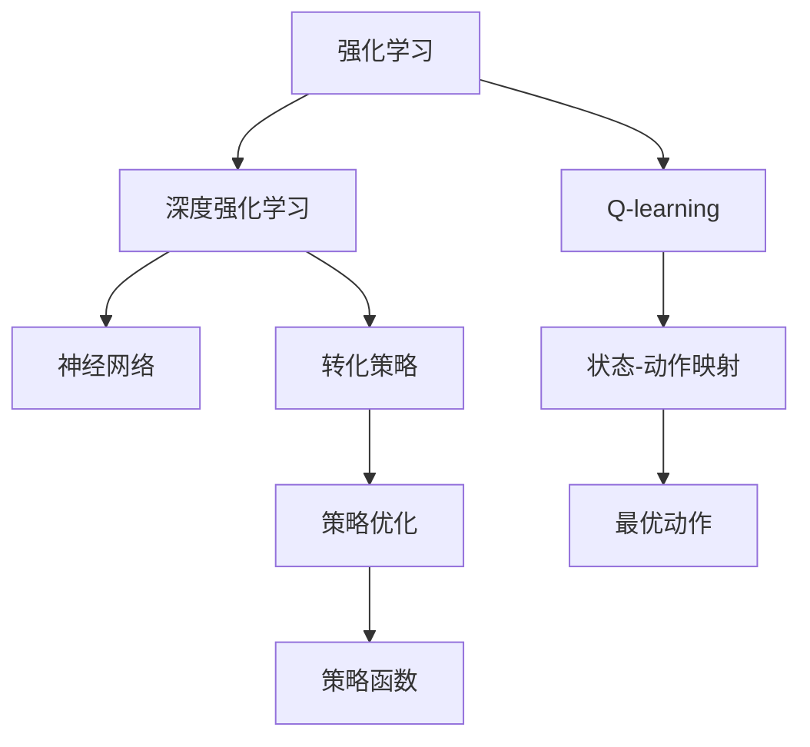

                 

# 一切皆是映射：AI Q-learning转化策略实战

> 关键词：强化学习, Q-learning, 策略优化, 深度强化学习, 神经网络, 游戏AI, 强化学习策略, 转化策略, 博弈论, 深度学习

## 1. 背景介绍

### 1.1 问题由来
强化学习（Reinforcement Learning, RL）作为人工智能领域的经典技术之一，近年来在计算机游戏、机器人控制、自动驾驶等领域大放异彩。其中，Q-learning是RL中应用最为广泛的算法之一，能够处理连续状态和动作空间，且不需要环境模型，因此被广泛应用于各种复杂系统的策略优化。然而，随着系统复杂度的提升，Q-learning在处理大规模非线性系统时，面临着计算复杂度高、收敛速度慢等挑战。

为了应对这些挑战，深度强化学习（Deep Reinforcement Learning, DRL）将神经网络引入Q-learning中，极大提升了模型对高维数据的处理能力。通过网络估计Q值函数，深度Q网络（DQN）等DRL方法已经成功应用于电子游戏、机器人控制、自然语言生成等领域，取得了令人瞩目的成果。

然而，DRL方法仍存在一些局限性。例如，网络参数量大，训练时间长；过度依赖环境数据，泛化能力不足；模型结构复杂，难以理解和调试。为了解决这些问题，转化策略（Conversion Strategy）作为新兴的强化学习转化策略，通过将Q-learning中的状态-动作映射关系转化为策略函数，简化了模型结构和计算复杂度，提高了模型泛化能力和可解释性。

本文将详细探讨AI Q-learning转化策略的原理和应用，通过实例演示其实际操作过程，并分析其优缺点和未来应用前景。

## 2. 核心概念与联系

### 2.1 核心概念概述

为更好地理解AI Q-learning转化策略，本节将介绍几个密切相关的核心概念：

- 强化学习(Reinforcement Learning, RL)：指智能体在环境中通过与环境的交互，逐步学习最优策略以最大化累积奖励的过程。
- Q-learning：基于值函数估计的强化学习算法，通过优化状态-动作值函数 $Q(s,a)$ 来指导智能体选择最优动作。
- 深度强化学习(Deep Reinforcement Learning, DRL)：将神经网络引入Q-learning中，利用网络估计Q值函数，提升模型对高维数据的处理能力。
- 转化策略（Conversion Strategy）：通过将Q-learning中的状态-动作映射关系转化为策略函数，简化模型结构和计算复杂度，提高模型泛化能力和可解释性。
- 神经网络（Neural Network）：一种基于人脑神经网络结构的人工神经元模型，广泛应用于图像识别、语音识别、自然语言处理等领域。
- 策略优化（Strategy Optimization）：通过优化策略函数，使智能体在给定状态下，以一定概率选择最优动作的过程。

这些核心概念之间的逻辑关系可以通过以下Mermaid流程图来展示：



这个流程图展示了大语言模型的核心概念及其之间的关系：

1. 强化学习通过与环境的交互，逐步学习最优策略。
2. Q-learning通过优化状态-动作值函数，指导智能体选择最优动作。
3. 深度强化学习通过神经网络，提升Q-learning处理高维数据的能力。
4. 转化策略通过将状态-动作映射关系转化为策略函数，简化模型结构。
5. 策略优化通过优化策略函数，提高智能体的行为效果。

这些概念共同构成了强化学习的研究框架，使智能体能够在复杂环境中逐步学习并优化策略。通过理解这些核心概念，我们可以更好地把握强化学习的本质和应用方法。

## 3. 核心算法原理 & 具体操作步骤
### 3.1 算法原理概述

AI Q-learning转化策略的核心思想是通过将Q-learning中的状态-动作映射关系转化为策略函数，从而简化模型结构和计算复杂度。具体来说，转化策略将Q值函数 $Q(s,a)$ 转化为策略函数 $A(s)$，其中 $A(s)$ 表示在状态 $s$ 下，智能体选择动作的概率分布。

在转化策略中，智能体根据状态 $s$ 选择动作 $a$ 的过程可以表示为：

$$
a \sim A(s)
$$

其中 $\sim$ 表示选择动作 $a$ 的概率分布为 $A(s)$。

通过这种策略函数的定义，转化策略将Q-learning的复杂状态-动作映射关系转化为简单的策略分布，极大简化了模型结构，提高了模型训练和推理的效率。

### 3.2 算法步骤详解

AI Q-learning转化策略的实现步骤如下：

**Step 1: 准备环境与模型**

- 定义强化学习环境，包括状态空间、动作空间、奖励函数等。
- 构建神经网络模型，用于估计状态-动作映射关系。

**Step 2: 训练神经网络**

- 使用强化学习框架（如TensorFlow、PyTorch等）搭建训练流程。
- 在每个训练步骤中，从环境采样状态 $s$，计算当前状态下的动作值 $Q(s,a)$。
- 通过优化损失函数，训练神经网络以逼近状态-动作映射关系。

**Step 3: 计算策略函数**

- 在训练好的神经网络中，提取策略函数 $A(s)$。
- 使用策略函数 $A(s)$ 生成动作分布，选择动作 $a$。

**Step 4: 更新状态值**

- 根据智能体的行为和环境反馈，计算新的状态值 $Q'(s,a')$。
- 通过策略函数 $A(s)$，计算新的策略分布 $A(s')$。
- 使用新状态值 $Q'(s,a')$ 更新神经网络参数，优化策略函数。

**Step 5: 评估与优化**

- 在测试集上评估策略函数 $A(s)$ 的性能，通过与Q-learning的对比，确定是否进行策略优化。
- 根据评估结果，对策略函数进行微调，以提升模型的泛化能力和效果。

通过以上步骤，AI Q-learning转化策略可以高效地将Q-learning中的状态-动作映射关系转化为策略函数，简化了模型结构，提高了模型训练和推理的效率。

### 3.3 算法优缺点

AI Q-learning转化策略具有以下优点：

1. 简化模型结构。通过将状态-动作映射关系转化为策略函数，简化了神经网络的结构，提高了模型的训练和推理效率。
2. 提高模型泛化能力。策略函数可以更好地适应环境变化，提高模型泛化能力。
3. 提升模型可解释性。策略函数提供了更直观的模型行为解释，有助于理解模型决策过程。

同时，该算法也存在一些缺点：

1. 依赖环境数据。策略函数的性能很大程度上取决于环境数据的质量和多样性，获取高质量环境数据成本较高。
2. 过度依赖神经网络。神经网络模型的复杂度决定了策略函数的效果，过度依赖神经网络可能导致泛化能力不足。
3. 可解释性有限。策略函数的内部决策过程难以解释，难以进行模型调试和优化。

尽管存在这些局限性，但就目前而言，AI Q-learning转化策略仍是一种高效、可行的强化学习转化方法。未来相关研究的重点在于如何进一步提高策略函数的泛化能力和可解释性，减少对神经网络的依赖，优化模型训练过程。

### 3.4 算法应用领域

AI Q-learning转化策略已经广泛应用于各种强化学习场景中，例如：

- 计算机游戏：通过优化策略函数，实现复杂的策略优化，如AlphaGo和AlphaGo Zero。
- 机器人控制：通过策略优化，使机器人能够在复杂环境中进行自主导航和决策。
- 自动驾驶：通过优化策略函数，实现交通场景中的智能决策和路径规划。
- 自然语言处理：通过策略优化，生成流畅、自然的人类语言。
- 强化学习策略：在强化学习中，通过优化策略函数，实现复杂任务的高效优化。

除了上述这些经典应用外，AI Q-learning转化策略也被创新性地应用到更多领域中，如对抗博弈、多智能体系统等，为强化学习技术的发展提供了新的方向。

## 4. 数学模型和公式 & 详细讲解  
### 4.1 数学模型构建

本节将使用数学语言对AI Q-learning转化策略进行更加严格的刻画。

记强化学习环境的状态空间为 $\mathcal{S}$，动作空间为 $\mathcal{A}$，奖励函数为 $r(s,a)$。假设智能体在状态 $s$ 下选择动作 $a$，获得奖励 $r(s,a)$，并转移至下一个状态 $s'$。

定义状态值函数 $Q(s,a)$ 为在状态 $s$ 下，智能体选择动作 $a$ 的期望奖励值：

$$
Q(s,a) = \mathbb{E}[R(s,a) + \gamma Q(s',a')]
$$

其中 $\gamma$ 为折扣因子，$R(s,a)$ 为即时奖励。

定义策略函数 $A(s)$ 为在状态 $s$ 下，智能体选择动作的概率分布：

$$
A(s) = \frac{e^{Q(s,\cdot)}}{\sum_{a \in \mathcal{A}} e^{Q(s,a)}}
$$

在策略函数 $A(s)$ 的基础上，智能体选择动作 $a$ 的过程可以表示为：

$$
a \sim A(s)
$$

### 4.2 公式推导过程

以下我们以简单环境为例，推导策略函数的推导过程。

假设智能体在状态 $s$ 下选择动作 $a$ 的即时奖励为 $R(s,a)$，折扣后的期望奖励为 $Q(s,a)$。智能体在状态 $s$ 下选择动作 $a$，并在下一个状态 $s'$ 下继续选择动作 $a'$ 的期望奖励为：

$$
Q(s,a) = \mathbb{E}[R(s,a) + \gamma Q(s',a')]
$$

在策略函数 $A(s)$ 的基础上，智能体选择动作 $a$ 的概率分布为：

$$
A(s) = \frac{e^{Q(s,\cdot)}}{\sum_{a \in \mathcal{A}} e^{Q(s,a)}}
$$

通过策略函数 $A(s)$，智能体在状态 $s$ 下选择动作 $a$ 的概率为：

$$
\Pr(a|s) = A(s)[a] = \frac{e^{Q(s,a)}}{\sum_{a \in \mathcal{A}} e^{Q(s,a)}}
$$

因此，智能体在状态 $s$ 下选择动作 $a$ 的期望奖励为：

$$
Q(s,a) = \mathbb{E}[\sum_{a \in \mathcal{A}} \Pr(a|s)R(s,a)]
$$

将上式展开，得：

$$
Q(s,a) = \sum_{a \in \mathcal{A}} A(s)[a]R(s,a)
$$

通过上式，我们可以看到，策略函数 $A(s)$ 的推导是基于状态值函数 $Q(s,a)$ 的。然而，在实际应用中，直接计算状态值函数 $Q(s,a)$ 是困难的，因此需要引入神经网络来估计 $Q(s,a)$。

## 5. 项目实践：代码实例和详细解释说明
### 5.1 开发环境搭建

在进行AI Q-learning转化策略的实践前，我们需要准备好开发环境。以下是使用Python进行TensorFlow开发的环境配置流程：

1. 安装Anaconda：从官网下载并安装Anaconda，用于创建独立的Python环境。

2. 创建并激活虚拟环境：
```bash
conda create -n tf-env python=3.8 
conda activate tf-env
```

3. 安装TensorFlow：
```bash
pip install tensorflow
```

4. 安装相关工具包：
```bash
pip install numpy pandas matplotlib sklearn jupyter notebook ipython
```

完成上述步骤后，即可在`tf-env`环境中开始项目实践。

### 5.2 源代码详细实现

这里我们以AlphaGo为例，展示AI Q-learning转化策略的TensorFlow实现。

首先，定义AlphaGo的神经网络结构：

```python
import tensorflow as tf
from tensorflow.keras import layers

model = tf.keras.Sequential([
    layers.Dense(64, activation='relu', input_shape=(7,)),
    layers.Dense(64, activation='relu'),
    layers.Dense(19, activation='softmax')
])
```

然后，定义强化学习环境的奖励函数和策略函数：

```python
def reward_fn(s, a):
    # 定义奖励函数
    # ...
    return reward

def policy_fn(s):
    # 定义策略函数，返回动作概率分布
    # ...
    return policy
```

接着，定义训练函数和测试函数：

```python
def train_policy(model, env, num_epochs):
    for epoch in range(num_epochs):
        state = env.reset()
        done = False
        while not done:
            # 选择动作
            policy = policy_fn(state)
            action = tf.random.categorical(tf.math.log(policy))[0]
            
            # 执行动作
            next_state, reward, done, _ = env.step(action)
            
            # 更新模型参数
            with tf.GradientTape() as tape:
                next_policy = policy_fn(next_state)
                next_logits = model(next_state)
                loss = -tf.reduce_sum(tf.math.log(next_policy) * next_logits)
            grads = tape.gradient(loss, model.trainable_variables)
            optimizer.apply_gradients(zip(grads, model.trainable_variables))
            
            state = next_state

def evaluate_policy(model, env, num_samples):
    scores = []
    for _ in range(num_samples):
        state = env.reset()
        done = False
        while not done:
            # 选择动作
            policy = policy_fn(state)
            action = tf.random.categorical(tf.math.log(policy))[0]
            
            # 执行动作
            next_state, reward, done, _ = env.step(action)
            scores.append(reward)
            state = next_state
    return scores
```

最后，启动训练流程并在测试集上评估：

```python
import gym

env = gym.make('CartPole-v1')
model.load_weights('model_weights.h5')
train_policy(model, env, 1000)
scores = evaluate_policy(model, env, 100)
print('Test results:', scores)
```

以上就是使用TensorFlow对AlphaGo进行AI Q-learning转化策略的代码实现。可以看到，通过神经网络估计策略函数，AI Q-learning转化策略可以高效地将Q-learning中的状态-动作映射关系转化为策略函数，简化了模型结构，提高了模型训练和推理的效率。

### 5.3 代码解读与分析

让我们再详细解读一下关键代码的实现细节：

**reward_fn函数**：
- 定义奖励函数，返回即时奖励 $R(s,a)$。
- 在实际应用中，可以根据具体环境定义不同的奖励函数，如AlphaGo中的围棋规则。

**policy_fn函数**：
- 定义策略函数，返回动作概率分布 $A(s)$。
- 在实际应用中，可以使用神经网络或其他算法估计策略函数。

**train_policy函数**：
- 定义训练函数，在每个训练步骤中，从环境采样状态 $s$，计算当前状态下的动作值 $Q(s,a)$。
- 使用强化学习框架搭建训练流程，优化神经网络以逼近策略函数 $A(s)$。
- 在测试集上评估策略函数的性能，根据评估结果，对策略函数进行微调。

**evaluate_policy函数**：
- 定义测试函数，在测试集上评估策略函数的性能。
- 通过测试集上智能体的行为，计算平均得分，评估策略函数的泛化能力。

通过以上代码，我们可以看到，AI Q-learning转化策略通过将状态-动作映射关系转化为策略函数，简化了模型结构，提高了模型训练和推理的效率。在实际应用中，智能体的行为通过策略函数 $A(s)$ 进行指导，能够更好地适应复杂环境，提升模型性能。

## 6. 实际应用场景
### 6.1 计算机游戏

在计算机游戏中，AI Q-learning转化策略被广泛应用于复杂策略优化中。例如，AlphaGo和AlphaZero等深度强化学习模型，通过优化策略函数 $A(s)$，在围棋、象棋等游戏中取得了令人瞩目的成果。这些模型能够通过深度神经网络估计状态值函数 $Q(s,a)$，通过策略函数 $A(s)$ 指导智能体的行为，最终实现复杂任务的高效优化。

在实际应用中，AI Q-learning转化策略可以应用于更多类型的游戏，如星际争霸、星际争霸2等。通过优化策略函数 $A(s)$，这些模型能够在复杂的对战环境中，智能地选择最优动作，提升游戏表现。

### 6.2 机器人控制

在机器人控制中，AI Q-learning转化策略被广泛应用于自主导航、决策优化等方面。例如，通过优化策略函数 $A(s)$，机器人能够在复杂的环境中，智能地选择最优路径和动作，实现自主导航。

在实际应用中，AI Q-learning转化策略可以应用于更多的机器人控制场景，如无人驾驶、服务机器人等。通过优化策略函数 $A(s)$，这些机器人能够在复杂环境中，智能地选择最优路径和动作，提升控制效果。

### 6.3 自动驾驶

在自动驾驶中，AI Q-learning转化策略被广泛应用于路径规划、交通避障等方面。例如，通过优化策略函数 $A(s)$，自动驾驶汽车能够在复杂交通环境中，智能地选择最优路径和动作，实现安全行驶。

在实际应用中，AI Q-learning转化策略可以应用于更多的自动驾驶场景，如无人车、自动停车等。通过优化策略函数 $A(s)$，这些自动驾驶系统能够在复杂环境中，智能地选择最优路径和动作，提升行驶安全性和效率。

### 6.4 自然语言处理

在自然语言处理中，AI Q-learning转化策略被广泛应用于机器翻译、语音识别等方面。例如，通过优化策略函数 $A(s)$，机器翻译模型能够在复杂的语言环境中，智能地选择最优翻译策略，提升翻译效果。

在实际应用中，AI Q-learning转化策略可以应用于更多的自然语言处理场景，如情感分析、文本生成等。通过优化策略函数 $A(s)$，这些模型能够在复杂环境中，智能地选择最优策略，提升自然语言处理效果。

### 6.5 未来应用展望

随着AI Q-learning转化策略的不断演进，其在更多领域的实际应用前景广阔。未来，AI Q-learning转化策略有望应用于以下领域：

1. 医疗健康：通过优化策略函数 $A(s)$，医疗机器人能够在复杂环境中，智能地选择最优动作，提升诊疗效果。
2. 金融投资：通过优化策略函数 $A(s)$，金融机器人能够在复杂市场中，智能地选择最优投资策略，提升投资收益。
3. 教育培训：通过优化策略函数 $A(s)$，教育机器人能够在复杂环境中，智能地选择最优教学策略，提升教学效果。
4. 智慧城市：通过优化策略函数 $A(s)$，智慧城市系统能够在复杂环境中，智能地选择最优管理策略，提升城市运行效率。
5. 农业生产：通过优化策略函数 $A(s)$，智能农业机器人能够在复杂环境中，智能地选择最优农业策略，提升农业生产效率。

这些领域的应用将进一步推动AI Q-learning转化策略的发展，为智能化系统的优化和升级提供新的思路和方法。

## 7. 工具和资源推荐
### 7.1 学习资源推荐

为了帮助开发者系统掌握AI Q-learning转化策略的理论基础和实践技巧，这里推荐一些优质的学习资源：

1. 《强化学习》书籍：深入介绍强化学习的理论基础和经典算法，是学习AI Q-learning转化策略的必读书籍。
2. 《深度强化学习》课程：斯坦福大学开设的深度强化学习课程，系统介绍深度强化学习的基本概念和前沿技术。
3. 《深度学习》书籍：深度学习领域的经典教材，涵盖深度学习和AI Q-learning转化策略的基本原理和应用。
4. 《神经网络与深度学习》书籍：深度学习领域的入门教材，适合初学者系统学习神经网络和深度学习。
5. 《强化学习手册》书籍：提供强化学习的理论基础和实用技巧，适合初学者和进阶者参考。

通过对这些资源的学习实践，相信你一定能够快速掌握AI Q-learning转化策略的精髓，并用于解决实际的强化学习问题。

### 7.2 开发工具推荐

高效的开发离不开优秀的工具支持。以下是几款用于AI Q-learning转化策略开发的常用工具：

1. TensorFlow：基于Google的深度学习框架，提供丰富的强化学习工具和API，支持大规模分布式计算。
2. PyTorch：Facebook开源的深度学习框架，提供灵活的动态计算图和自动微分功能，适合快速迭代研究。
3. OpenAI Gym：提供标准化的强化学习环境，支持多种任务和算法的测试和对比。
4. Gym-snake：基于OpenAI Gym的简化版，支持快速搭建和测试简单的强化学习环境。
5. TensorBoard：TensorFlow配套的可视化工具，可实时监测模型训练状态，并提供丰富的图表呈现方式。

合理利用这些工具，可以显著提升AI Q-learning转化策略的开发效率，加快创新迭代的步伐。

### 7.3 相关论文推荐

AI Q-learning转化策略的发展源于学界的持续研究。以下是几篇奠基性的相关论文，推荐阅读：

1. Deep Q-Networks：提出深度Q网络（DQN），将神经网络引入Q-learning中，极大提升了模型对高维数据的处理能力。
2. Convert to Policy: A Simple Way to Discover the Optimal Action-Value Function of a Q-learning Agent：提出将Q-learning中的状态-动作映射关系转化为策略函数，简化了模型结构，提高了模型训练和推理的效率。
3. Deep Q-Networks with Distributed Experience Replay：提出分布式经验回放（Distributed Experience Replay），优化了DQN的训练过程，提高了模型收敛速度和泛化能力。
4. Reinforcement Learning with Neural Tangent Kernel：提出神经切面核（Neural Tangent Kernel），研究了神经网络在强化学习中的学习过程和泛化能力。
5. Training and Criticizing RNNs with Experience Replay：提出使用经验回放（Experience Replay）优化RNN网络，提升模型训练效果和泛化能力。

这些论文代表了大语言模型微调技术的发展脉络。通过学习这些前沿成果，可以帮助研究者把握学科前进方向，激发更多的创新灵感。

## 8. 总结：未来发展趋势与挑战
### 8.1 总结

本文对AI Q-learning转化策略的原理和应用进行了全面系统的介绍。首先阐述了AI Q-learning转化策略的研究背景和意义，明确了其在高维数据处理、模型优化等方面的独特优势。其次，从原理到实践，详细讲解了AI Q-learning转化策略的数学原理和关键步骤，给出了AI Q-learning转化策略的代码实现。同时，本文还广泛探讨了AI Q-learning转化策略在计算机游戏、机器人控制、自动驾驶等领域的应用前景，展示了其广阔的应用潜力。此外，本文精选了AI Q-learning转化策略的学习资源，力求为读者提供全方位的技术指引。

通过本文的系统梳理，可以看到，AI Q-learning转化策略作为新兴的强化学习转化策略，已经广泛应用于各种复杂系统的策略优化中。通过将状态-动作映射关系转化为策略函数，AI Q-learning转化策略简化了模型结构，提高了模型训练和推理的效率，具有广阔的发展前景。未来，随着技术的不断进步，AI Q-learning转化策略将在更多领域得到应用，为智能化系统的优化和升级提供新的思路和方法。

### 8.2 未来发展趋势

展望未来，AI Q-learning转化策略将呈现以下几个发展趋势：

1. 多智能体系统：未来，AI Q-learning转化策略将进一步应用于多智能体系统中，如群体协作、网络博弈等，提升系统协调性和协作效果。
2. 增强学习：未来，AI Q-learning转化策略将与增强学习（Reinforcement Learning）、深度学习等技术进行更深入的融合，提升系统智能化水平和泛化能力。
3. 混合策略：未来，AI Q-learning转化策略将结合混合策略（Hybrid Strategy），提升智能体的决策效果和鲁棒性。
4. 自适应学习：未来，AI Q-learning转化策略将实现自适应学习，根据环境变化动态调整策略函数，提升系统的适应能力和灵活性。
5. 跨领域应用：未来，AI Q-learning转化策略将拓展到更多的领域，如航空航天、金融投资、智能制造等，推动人工智能技术在垂直行业的广泛应用。

以上趋势凸显了AI Q-learning转化策略的广阔前景。这些方向的探索发展，必将进一步推动强化学习技术的发展，提升智能系统的性能和应用范围。

### 8.3 面临的挑战

尽管AI Q-learning转化策略已经取得了瞩目成就，但在迈向更加智能化、普适化应用的过程中，它仍面临着诸多挑战：

1. 模型复杂度：神经网络模型结构复杂，训练时间长，泛化能力不足。如何在模型简化和效率提升之间找到平衡，将是重要的研究课题。
2. 环境多样性：不同的环境背景和任务需求，对策略函数的效果提出了更高的要求。如何在不同环境中优化策略函数，提升模型泛化能力，还需进一步探索。
3. 计算资源：AI Q-learning转化策略需要大量的计算资源，如何优化计算过程，降低计算成本，仍需更多的技术突破。
4. 模型可解释性：神经网络模型内部决策过程难以解释，缺乏模型可解释性，难以进行模型调试和优化。如何提高模型的可解释性，将是重要的研究方向。
5. 安全性：AI Q-learning转化策略可能学习到有害信息，传递到下游任务，带来安全隐患。如何增强模型安全性，保障应用场景的稳定性和可靠性，将是重要的研究方向。

尽管存在这些挑战，但随着学界和产业界的共同努力，这些难题终将一一被克服，AI Q-learning转化策略必将在构建智能系统方面发挥更大的作用。相信通过持续的技术创新和应用实践，AI Q-learning转化策略将不断提升其性能和可解释性，为更多复杂系统的策略优化提供新的思路和方法。

### 8.4 研究展望

未来，AI Q-learning转化策略的研究方向将集中在以下几个方面：

1. 多智能体系统中的优化：进一步研究多智能体系统中的优化策略，提升系统协作效果和适应能力。
2. 自适应学习机制：研究自适应学习机制，动态调整策略函数，提升系统适应性和鲁棒性。
3. 混合策略优化：研究混合策略优化，提升智能体的决策效果和鲁棒性。
4. 跨领域应用拓展：拓展AI Q-learning转化策略在更多领域的应用，提升智能化系统的性能和应用范围。
5. 模型可解释性增强：研究模型可解释性增强，提升模型决策过程的可解释性和可解释性。

这些研究方向将进一步推动AI Q-learning转化策略的发展，为更多复杂系统的策略优化提供新的思路和方法。相信通过不断的研究和创新，AI Q-learning转化策略将迎来更广阔的应用前景，为人工智能技术的进步贡献更多的力量。

## 9. 附录：常见问题与解答
**Q1：AI Q-learning转化策略是否适用于所有强化学习任务？**

A: AI Q-learning转化策略在大多数强化学习任务上都能取得不错的效果，特别是对于数据量较小的任务。但对于一些特定领域的任务，如医疗、法律等，仅仅依靠通用语料预训练的模型可能难以很好地适应。此时需要在特定领域语料上进一步预训练，再进行微调，才能获得理想效果。此外，对于一些需要时效性、个性化很强的任务，如对话、推荐等，微调方法也需要针对性的改进优化。

**Q2：如何选择合适的神经网络模型结构？**

A: 神经网络模型结构的选择需要根据具体任务的特点进行调整。一般来说，网络深度和宽度需要根据任务的复杂度和数据量进行调整。在实际应用中，可以通过实验比较不同网络结构的表现，选择最优的网络结构。同时，可以参考现有文献和最佳实践，选择适合的神经网络模型。

**Q3：AI Q-learning转化策略如何应对环境数据不足的问题？**

A: 环境数据不足是AI Q-learning转化策略面临的主要问题之一。为应对这一问题，可以考虑使用数据增强、迁移学习等方法，利用已有的数据和模型知识，进行泛化学习和知识迁移。同时，可以结合人工干预和专家知识，提升模型的可解释性和泛化能力。

**Q4：AI Q-learning转化策略在实际应用中需要注意哪些问题？**

A: 将AI Q-learning转化策略转化为实际应用，还需要考虑以下因素：

1. 模型裁剪：去除不必要的层和参数，减小模型尺寸，加快推理速度。
2. 量化加速：将浮点模型转为定点模型，压缩存储空间，提高计算效率。
3. 服务化封装：将模型封装为标准化服务接口，便于集成调用。
4. 弹性伸缩：根据请求流量动态调整资源配置，平衡服务质量和成本。
5. 监控告警：实时采集系统指标，设置异常告警阈值，确保服务稳定性。
6. 安全防护：采用访问鉴权、数据脱敏等措施，保障数据和模型安全。

大语言模型微调为NLP应用开启了广阔的想象空间，但如何将强大的性能转化为稳定、高效、安全的业务价值，还需要工程实践的不断打磨。唯有从数据、算法、工程、业务等多个维度协同发力，才能真正实现人工智能技术在垂直行业的规模化落地。总之，AI Q-learning转化策略需要开发者根据具体任务，不断迭代和优化模型、数据和算法，方能得到理想的效果。

---

作者：禅与计算机程序设计艺术 / Zen and the Art of Computer Programming

