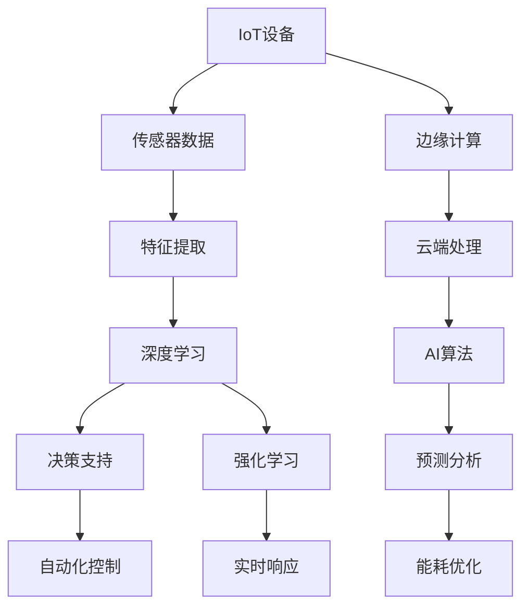

                 

# 一切皆是映射：AI在物联网(IoT)中的角色与挑战

在当今数字化和智能化的浪潮中，物联网（IoT）已经成为推动技术进步和社会发展的关键驱动力。AI作为这项技术的重要组成部分，其作用和挑战正变得愈发显著。本文将详细探讨AI在IoT中的角色、核心算法与操作流程、数学模型构建与应用，以及未来发展趋势和面临的挑战。

## 1. 背景介绍

### 1.1 物联网概述
物联网指的是将各种物体通过网络相连，实现物与物、物与人的信息交流与共享。当前，IoT的应用领域包括智能家居、工业控制、健康监测、智慧城市等，涉及传感器、边缘计算、云计算等多个技术环节。AI在IoT中的作用主要体现在数据的处理、分析与应用上，通过智能算法优化IoT系统的性能，提升用户体验。

### 1.2 AI在IoT中的角色
AI在IoT中的角色主要体现在以下几个方面：
- **数据分析与预测**：通过机器学习等算法，对IoT设备产生的大量数据进行分析和预测，实现设备状态监控、故障预测、能耗优化等功能。
- **决策支持**：基于AI的决策支持系统能够提供实时决策建议，帮助管理者更高效地运营IoT系统。
- **自动化控制**：AI能够实现IoT系统的自动化控制，如智能调温、智能灌溉等，提高资源利用率。
- **边缘计算**：在IoT边缘设备中集成AI算法，提高数据处理效率，减少延迟。

## 2. 核心概念与联系

### 2.1 核心概念概述
为了更好地理解AI在IoT中的应用，本节将介绍几个关键概念及其联系：

- **物联网（IoT）**：通过传感器、执行器等技术，实现物理对象与网络的互联，实现数据收集、处理和控制。
- **人工智能（AI）**：通过算法实现机器自主学习和决策，提升数据处理和应用能力。
- **边缘计算（Edge Computing）**：在IoT设备边缘处理数据，减少延迟和带宽压力。
- **深度学习（Deep Learning）**：一种基于神经网络的机器学习算法，用于解决复杂的数据处理问题。
- **强化学习（Reinforcement Learning）**：通过与环境交互，优化决策策略，适用于需要实时响应和控制的IoT场景。
- **迁移学习（Transfer Learning）**：利用预训练模型，在新的IoT任务上进行微调，提高模型泛化能力。

### 2.2 核心概念原理与架构的 Mermaid 流程图



这个流程图展示了IoT与AI技术的联系：

1. IoT设备采集数据，并发送到边缘计算平台进行处理。
2. 边缘计算平台进一步处理数据，并通过云端平台进行高级分析和决策。
3. AI算法在云端进行模型训练和优化，提高数据处理和决策能力。
4. AI算法通过特征提取和深度学习等技术，提升预测和决策的准确性。
5. 强化学习实现实时响应和控制，适应复杂多变的IoT环境。
6. 决策支持系统通过AI算法，提供高效的运营建议。
7. 自动化控制和实时响应系统，实现IoT的智能化管理。

## 3. 核心算法原理 & 具体操作步骤

### 3.1 算法原理概述
AI在IoT中的应用，主要通过以下几类算法实现：

- **深度学习**：通过神经网络模型对传感器数据进行特征提取和处理，实现高效的预测和决策。
- **强化学习**：通过与环境的交互，优化控制策略，实现IoT设备的自适应控制。
- **迁移学习**：在新的IoT任务上，利用预训练模型进行微调，提高模型泛化能力。
- **时间序列分析**：通过时间序列模型，预测IoT设备的运行状态，实现故障预测和能耗优化。

### 3.2 算法步骤详解
AI在IoT中的应用主要包括以下几个步骤：

1. **数据采集与预处理**：通过传感器和边缘设备采集IoT数据，并进行清洗和预处理。
2. **特征提取与表示**：使用特征提取算法将原始数据转换为可供AI算法处理的格式。
3. **模型训练与优化**：在云端或边缘设备上训练AI模型，并通过交叉验证等方法优化模型性能。
4. **模型部署与运行**：将训练好的模型部署到IoT设备和边缘计算平台，实现实时数据处理和决策。
5. **性能评估与调优**：持续评估模型性能，并通过反馈机制进行模型调优。

### 3.3 算法优缺点
AI在IoT中的应用具有以下优点：

- **高效性**：深度学习等算法能够快速处理大量数据，提供实时决策支持。
- **自适应性**：强化学习等算法能够实现自适应控制，提高IoT设备的灵活性和适应能力。
- **泛化能力**：迁移学习等技术能够在新的IoT任务上取得较好的性能。

同时，也存在一些挑战：

- **计算资源消耗大**：深度学习模型参数量巨大，对计算资源要求较高。
- **实时性要求高**：AI算法需要快速响应和处理数据，对实时性和延迟要求较高。
- **数据隐私和安全**：IoT设备采集大量敏感数据，数据隐私和安全问题需要特别关注。

### 3.4 算法应用领域
AI在IoT中的应用领域广泛，主要包括：

- **智能家居**：通过AI实现智能控制和个性化服务，如智能照明、智能温控等。
- **工业控制**：通过AI实现设备状态监控、故障预测和能耗优化，提升生产效率和资源利用率。
- **智慧医疗**：通过AI实现健康监测和预测分析，提供精准的医疗建议和诊断服务。
- **智慧城市**：通过AI实现交通管理、能源管理、公共安全等，提升城市管理水平和居民生活质量。

## 4. 数学模型和公式 & 详细讲解 & 举例说明

### 4.1 数学模型构建

在IoT中，AI的数学模型主要包括以下几个关键部分：

- **特征提取模型**：如卷积神经网络（CNN）、循环神经网络（RNN）等，用于从原始数据中提取有意义的特征。
- **预测模型**：如多层感知器（MLP）、支持向量机（SVM）等，用于对传感器数据进行预测和分类。
- **决策模型**：如决策树、随机森林等，用于提供实时决策支持。

### 4.2 公式推导过程

以深度学习中的卷积神经网络（CNN）为例，其基本的数学模型推导如下：

设输入为 $x \in \mathbb{R}^{m \times n}$，卷积层为 $h(x;\theta)$，其中 $\theta$ 为卷积核参数。卷积层输出的特征图 $y$ 为：

$$
y_{i,j} = \sum_{k=1}^K h_{k}(x_{i,j})
$$

其中 $h_k(x)$ 为卷积核，$K$ 为卷积核数量。

### 4.3 案例分析与讲解

以工业控制中的故障预测为例，利用时间序列模型进行预测。设传感器数据为 $x_t \in \mathbb{R}^d$，预测模型为 $y_t = f(x_{t-1}, x_{t-2}, ..., x_{t-h})$，其中 $h$ 为时间步长。模型的输入为过去 $h$ 个时间步的传感器数据，输出为下一个时间步的预测值。

## 5. 项目实践：代码实例和详细解释说明

### 5.1 开发环境搭建

为进行IoT相关的AI开发，需要先搭建好开发环境。以下是使用Python和TensorFlow进行开发的流程：

1. 安装Anaconda：从官网下载并安装Anaconda，用于创建独立的Python环境。
2. 创建并激活虚拟环境：
```bash
conda create -n iot-env python=3.8 
conda activate iot-env
```

3. 安装TensorFlow：根据GPU版本，从官网获取对应的安装命令。例如：
```bash
pip install tensorflow
```

4. 安装各类工具包：
```bash
pip install numpy pandas scikit-learn matplotlib tqdm jupyter notebook ipython
```

完成上述步骤后，即可在`iot-env`环境中开始AI在IoT中的开发。

### 5.2 源代码详细实现

下面以工业控制中的故障预测为例，给出使用TensorFlow进行开发的PyTorch代码实现。

首先，定义模型和训练数据：

```python
import tensorflow as tf
from tensorflow.keras.models import Sequential
from tensorflow.keras.layers import Dense, LSTM

# 定义模型
model = Sequential([
    LSTM(64, input_shape=(h, d)),
    Dense(1, activation='sigmoid')
])

# 定义训练数据
train_data = ...
```

然后，进行模型训练和预测：

```python
# 定义损失函数和优化器
loss_fn = tf.keras.losses.BinaryCrossentropy()
optimizer = tf.keras.optimizers.Adam()

# 编译模型
model.compile(optimizer=optimizer, loss=loss_fn, metrics=['accuracy'])

# 训练模型
model.fit(train_data, epochs=10, batch_size=32)

# 预测模型
test_data = ...
predictions = model.predict(test_data)
```

以上代码展示了如何使用TensorFlow进行工业控制中故障预测的模型训练和预测。

### 5.3 代码解读与分析

**LSTM层**：用于处理时间序列数据，提取长期依赖关系。

**Dense层**：用于输出预测结果，使用sigmoid激活函数，将输出映射到0到1之间，表示设备出现故障的概率。

**BinaryCrossentropy损失函数**：用于二分类问题，计算模型预测结果与真实标签之间的差异。

**Adam优化器**：一种常用的自适应学习率优化器，能够快速收敛。

## 6. 实际应用场景

### 6.1 工业控制

AI在工业控制中的应用主要体现在设备状态监控、故障预测和能耗优化上。通过IoT设备采集传感器数据，利用深度学习等算法对数据进行处理和分析，可以实现设备的实时监控和故障预测。例如，通过时间序列模型，对设备的运行状态进行预测，提前发现潜在故障，并进行维护。此外，AI还可以对设备的能耗进行优化，提升能源利用效率。

### 6.2 智慧医疗

在智慧医疗中，AI可以用于健康监测、疾病预测和个性化医疗等方面。通过IoT设备采集患者的生理数据，利用深度学习等算法进行分析和预测，实现疾病的早期发现和预防。同时，AI还可以根据患者的病历和基因信息，提供个性化的治疗建议和药物方案。

### 6.3 智慧城市

智慧城市中的AI应用主要体现在交通管理、能源管理和公共安全等方面。通过IoT设备采集交通、能源和公共安全数据，利用AI算法进行分析和预测，优化城市的资源配置和运营管理。例如，利用AI进行交通流量预测，优化交通信号灯控制，减少交通拥堵。

### 6.4 未来应用展望

未来，AI在IoT中的应用将更加广泛和深入。以下是一些未来应用展望：

- **自适应控制**：通过强化学习等算法，实现IoT设备的自适应控制，提升系统的灵活性和适应能力。
- **多模态融合**：将IoT设备采集的多模态数据进行融合，提升数据的综合分析能力。
- **联邦学习**：在分布式环境中，通过联邦学习等技术，保护数据隐私，同时提升模型的泛化能力。
- **边缘计算优化**：通过优化边缘计算平台，提高AI算法的实时性，满足IoT设备对延迟和计算资源的需求。

## 7. 工具和资源推荐

### 7.1 学习资源推荐

为了帮助开发者系统掌握AI在IoT中的应用，以下是一些优质的学习资源：

1. 《深度学习》课程：由Coursera提供的深度学习入门课程，涵盖深度学习的基本概念和应用实例。
2. TensorFlow官方文档：TensorFlow的官方文档，提供详细的API使用和示例代码。
3. 《物联网与人工智能》书籍：介绍IoT与AI的融合应用，涵盖物联网技术、AI算法和实际应用案例。
4. 《Python在物联网中的应用》书籍：详细介绍Python在IoT开发中的应用，涵盖传感器数据处理、边缘计算和云平台部署等技术。
5. Kaggle平台：提供丰富的IoT和AI数据集，可以进行实际的数据分析和模型训练。

通过对这些资源的学习实践，相信你一定能够快速掌握AI在IoT中的应用，并用于解决实际的IoT问题。

### 7.2 开发工具推荐

高效的开发离不开优秀的工具支持。以下是几款用于IoT中AI开发的常用工具：

1. TensorFlow：由Google主导开发的开源深度学习框架，生产部署方便，适合大规模工程应用。
2. PyTorch：基于Python的开源深度学习框架，灵活动态的计算图，适合快速迭代研究。
3. Jupyter Notebook：交互式开发环境，支持代码编写、数据可视化和模型训练等。
4. Google Cloud Platform：提供强大的云计算服务，支持AI和IoT应用的部署和扩展。
5. AWS IoT平台：提供IoT设备的连接和管理，支持IoT数据的上云存储和分析。

合理利用这些工具，可以显著提升AI在IoT中的开发效率，加快创新迭代的步伐。

### 7.3 相关论文推荐

AI在IoT中的应用源自学界的持续研究。以下是几篇奠基性的相关论文，推荐阅读：

1. "Deep Neural Networks for Large-Scale Image Recognition"（ImageNet论文）：提出深度学习在图像识别中的广泛应用，奠定了深度学习在IoT中的基础。
2. "Adversarial Machine Learning"：探讨AI系统中的安全问题，强调数据隐私和模型鲁棒性。
3. "Reinforcement Learning for Cyber Physical Systems"：介绍强化学习在智能系统中的应用，提升IoT系统的自适应控制能力。
4. "A Survey of Deep Learning Techniques for Industrial IoT"：综述深度学习在工业IoT中的应用，涵盖故障预测、能耗优化等方面。
5. "Federated Learning in Healthcare"：探讨联邦学习在医疗IoT中的应用，保护患者隐私的同时提升模型性能。

这些论文代表了大规模数据处理和AI算法在IoT中的最新研究进展，通过学习这些前沿成果，可以帮助研究者把握学科前进方向，激发更多的创新灵感。

## 8. 总结：未来发展趋势与挑战

### 8.1 总结

本文对AI在IoT中的应用进行了全面系统的介绍。首先阐述了IoT和AI的基本概念，明确了AI在IoT中的重要角色。其次，从原理到实践，详细讲解了AI在IoT中的应用模型和操作步骤，给出了AI在工业控制、智慧医疗、智慧城市等领域的代码实现。同时，本文还探讨了AI在IoT中的未来发展趋势和面临的挑战，力求为读者提供全方位的技术指引。

通过本文的系统梳理，可以看到，AI在IoT中的应用前景广阔，不仅能提升设备性能和运营效率，还能实现更加智能化的决策和控制。未来，随着AI和IoT技术的不断融合，相信IoT系统将变得更加智能和高效，为人类社会带来更多便利和创新。

### 8.2 未来发展趋势

展望未来，AI在IoT中的应用将呈现以下几个发展趋势：

1. **自适应控制**：通过强化学习等算法，实现IoT设备的自适应控制，提升系统的灵活性和适应能力。
2. **多模态融合**：将IoT设备采集的多模态数据进行融合，提升数据的综合分析能力。
3. **联邦学习**：在分布式环境中，通过联邦学习等技术，保护数据隐私，同时提升模型的泛化能力。
4. **边缘计算优化**：通过优化边缘计算平台，提高AI算法的实时性，满足IoT设备对延迟和计算资源的需求。

以上趋势凸显了AI在IoT中的广阔前景。这些方向的探索发展，必将进一步提升IoT系统的性能和应用范围，为人类社会带来更多便利和创新。

### 8.3 面临的挑战

尽管AI在IoT中的应用已经取得了一定的进展，但在迈向更加智能化、普适化应用的过程中，仍面临诸多挑战：

1. **计算资源消耗大**：深度学习模型参数量巨大，对计算资源要求较高。
2. **实时性要求高**：AI算法需要快速响应和处理数据，对实时性和延迟要求较高。
3. **数据隐私和安全**：IoT设备采集大量敏感数据，数据隐私和安全问题需要特别关注。

### 8.4 研究展望

面对AI在IoT中面临的这些挑战，未来的研究需要在以下几个方面寻求新的突破：

1. **计算效率优化**：开发更高效的算法和模型结构，减少计算资源消耗。
2. **实时性提升**：优化数据传输和处理流程，提高AI算法的实时响应能力。
3. **隐私保护技术**：研究数据隐私保护技术，如差分隐私、联邦学习等，保护IoT数据的安全。

这些研究方向的探索，必将引领AI在IoT中的应用迈向更高的台阶，为构建智能、安全的IoT系统铺平道路。

## 9. 附录：常见问题与解答

**Q1：如何优化IoT设备的AI算法？**

A: 优化IoT设备的AI算法需要从多个方面入手：
1. **算法选择**：根据具体应用场景，选择合适的AI算法，如深度学习、强化学习等。
2. **数据预处理**：对采集的数据进行清洗和预处理，去除噪声和异常值，提升数据质量。
3. **模型优化**：通过超参数调优、模型裁剪等方法，优化AI模型的性能。
4. **边缘计算优化**：将计算任务分配到边缘设备，减少数据传输，提高处理速度。

**Q2：如何保护IoT设备的数据隐私？**

A: 保护IoT设备的数据隐私可以从以下几个方面入手：
1. **数据加密**：对采集的数据进行加密处理，防止数据泄露。
2. **联邦学习**：在分布式环境中，通过联邦学习等技术，保护数据隐私，同时提升模型性能。
3. **差分隐私**：对数据进行差分隐私处理，保护用户隐私，同时保留数据的统计特性。
4. **边缘计算**：在边缘设备上处理数据，减少数据传输，降低隐私泄露风险。

**Q3：如何提升IoT设备算法的实时性？**

A: 提升IoT设备算法的实时性需要从多个方面入手：
1. **算法优化**：选择高效的算法，如轻量级模型、卷积神经网络等，减少计算量。
2. **数据压缩**：对数据进行压缩处理，减小数据传输和存储的带宽压力。
3. **边缘计算**：在边缘设备上处理数据，减少数据传输，提高处理速度。
4. **硬件加速**：利用硬件加速技术，如GPU、TPU等，提升计算效率。

**Q4：如何设计IoT设备的AI控制策略？**

A: 设计IoT设备的AI控制策略需要考虑以下几个方面：
1. **需求分析**：根据具体应用场景，明确控制需求，如设备状态监控、故障预测等。
2. **数据采集**：设计传感器和数据采集方案，确保数据质量。
3. **算法选择**：选择合适的AI算法，如时间序列模型、强化学习等。
4. **模型训练**：在云端或边缘设备上训练AI模型，提升模型性能。
5. **控制策略优化**：根据实际应用情况，不断优化控制策略，提升系统性能。

**Q5：AI在IoT中的未来发展方向是什么？**

A: AI在IoT中的未来发展方向主要体现在以下几个方面：
1. **自适应控制**：通过强化学习等算法，实现IoT设备的自适应控制，提升系统的灵活性和适应能力。
2. **多模态融合**：将IoT设备采集的多模态数据进行融合，提升数据的综合分析能力。
3. **联邦学习**：在分布式环境中，通过联邦学习等技术，保护数据隐私，同时提升模型的泛化能力。
4. **边缘计算优化**：通过优化边缘计算平台，提高AI算法的实时性，满足IoT设备对延迟和计算资源的需求。

**Q6：AI在IoT中的应用有哪些挑战？**

A: AI在IoT中的应用面临以下挑战：
1. **计算资源消耗大**：深度学习模型参数量巨大，对计算资源要求较高。
2. **实时性要求高**：AI算法需要快速响应和处理数据，对实时性和延迟要求较高。
3. **数据隐私和安全**：IoT设备采集大量敏感数据，数据隐私和安全问题需要特别关注。
4. **边缘计算资源有限**：边缘设备的计算和存储资源有限，需要优化算法和模型结构。

---

作者：禅与计算机程序设计艺术 / Zen and the Art of Computer Programming

