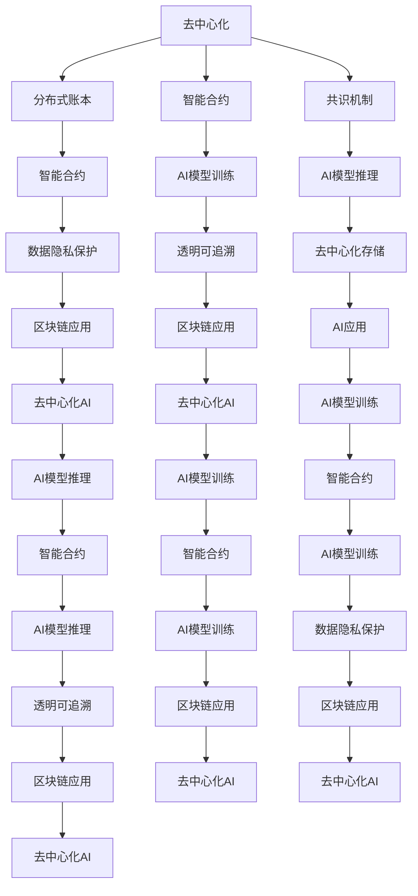

                 

# 一切皆是映射：AI的去中心化：区块链技术的融合

在当前的技术大潮中，人工智能（AI）与区块链技术的融合正成为最令人瞩目的趋势之一。AI的深度学习和预测能力，结合区块链的去中心化、不可篡改和共识机制，正在催生全新的应用模式和行业生态。本文将深入探讨这一话题，详细解析AI与区块链技术如何通过映射关系实现融合，并对这一领域的未来发展趋势和面临的挑战进行全面分析。

## 1. 背景介绍

### 1.1 问题由来

在过去的十年中，区块链技术从最初的去中心化数字货币（如比特币）的实验性应用，逐渐扩展到了金融、供应链、医疗等多个行业。而人工智能技术，特别是深度学习和自然语言处理，则正在改变我们对数据和信息处理的认知。随着数据量的激增和计算能力的提升，AI在各个领域展现出了巨大的潜力和应用价值。

然而，传统的AI模型往往依赖于中心化的数据管理和算法训练，存在数据隐私泄露、算法偏见等问题。而区块链技术的去中心化和加密特性，为AI的应用提供了新的解决方案，将AI模型的训练、推理和验证过程转移到去中心化网络上，从而确保数据的隐私和算法的透明性。

### 1.2 问题核心关键点

AI与区块链技术的融合，核心在于通过映射关系将二者的优势结合起来，即：

1. **数据隐私保护**：区块链的分布式账本确保了数据的去中心化和隐私保护，AI模型可以在不暴露数据本身的情况下进行训练和推理。
2. **透明可追溯**：区块链的不可篡改特性确保了AI模型的透明度和可追溯性，可以追溯模型的训练和推理过程。
3. **共识机制优化**：区块链的共识机制，如PoW（工作量证明）、PoS（权益证明）等，可以为AI模型的训练和推理提供去中心化的计算资源。
4. **去中心化存储**：区块链的去中心化存储系统，可以保证AI模型的高效可靠运行，并减少对中心化服务器的依赖。

## 2. 核心概念与联系

### 2.1 核心概念概述

为更好地理解AI与区块链技术的融合，本节将介绍几个关键概念：

- **去中心化**：与传统的中心化系统不同，区块链上的数据和计算资源由网络中的多个节点共同维护，不存在单一的控制点。
- **智能合约**：基于区块链的自动化合约，可以在满足特定条件时自动执行。智能合约可以与AI模型结合，自动化地进行数据处理和决策。
- **分布式账本**：区块链上的数据存储在多个节点上，每个节点都拥有完整的账本副本，保证了数据的不可篡改和透明性。
- **共识机制**：区块链上的节点通过共识算法达成一致，保证网络中的数据和状态是同步和一致的。

### 2.2 核心概念原理和架构的 Mermaid 流程图(Mermaid 流程节点中不要有括号、逗号等特殊字符)



这个流程图展示了AI与区块链技术融合的基本架构，其中：

- A（去中心化）通过B（分布式账本）和D（共识机制）保证了数据的分布式存储和一致性。
- C（智能合约）结合了AI模型，自动化地进行数据处理和决策。
- E（智能合约）确保了数据隐私保护和透明可追溯性。
- F（AI模型训练）和G（AI模型推理）通过智能合约和分布式账本实现了去中心化存储和高效计算。
- H（数据隐私保护）和Z（透明可追溯）是AI与区块链技术融合的核心优势。

## 3. 核心算法原理 & 具体操作步骤

### 3.1 算法原理概述

AI与区块链技术的融合，主要通过以下两种方式实现：

1. **去中心化AI模型训练**：将AI模型的训练过程迁移到区块链上，利用分布式账本和共识机制，保证训练过程的透明性和去中心化。
2. **去中心化AI模型推理**：将AI模型的推理过程迁移到区块链上，利用智能合约和分布式账本，实现推理结果的去中心化存储和高效计算。

### 3.2 算法步骤详解

#### 3.2.1 去中心化AI模型训练

1. **数据准备**：将训练数据拆分成多个小批次，通过智能合约分发至网络中的多个节点进行存储。
2. **模型训练**：各节点在本地训练AI模型，并通过共识机制协调更新共享的模型参数。
3. **模型验证**：在模型训练完成后，通过智能合约进行模型验证，确保模型的正确性和一致性。
4. **模型发布**：将经过验证的模型参数和训练数据上传至区块链，形成透明的公开记录。

#### 3.2.2 去中心化AI模型推理

1. **数据请求**：用户通过智能合约请求AI模型进行推理，输入推理请求和原始数据。
2. **模型推理**：智能合约根据请求数据，调用区块链上的AI模型进行推理计算。
3. **结果返回**：推理结果通过智能合约自动返回给用户，并存储在分布式账本中，确保结果的去中心化存储。

### 3.3 算法优缺点

**优点**：

1. **数据隐私保护**：区块链的去中心化特性确保了数据隐私的保护，避免数据泄露和滥用。
2. **透明可追溯**：区块链的不可篡改特性保证了AI模型的透明性和可追溯性，增强了模型的可信度。
3. **高效计算**：区块链的共识机制优化了计算资源的分配，提高了AI模型的训练和推理效率。
4. **去中心化存储**：区块链的去中心化存储系统确保了AI模型的高可靠性和可用性，减少了对中心化服务器的依赖。

**缺点**：

1. **性能瓶颈**：区块链的共识机制和分布式账本可能导致计算效率下降，增加模型推理时间。
2. **成本较高**：区块链网络的运行和维护需要较高的成本，增加了AI应用的成本。
3. **技术复杂**：智能合约和分布式账本的实现和维护需要较高的技术门槛，增加了AI应用的难度。

### 3.4 算法应用领域

AI与区块链技术的融合，已经在以下几个领域得到了广泛应用：

1. **金融领域**：利用区块链的去中心化和不可篡改特性，实现智能合约和去中心化交易。例如，智能合约可以根据市场价格自动执行买卖指令，或实现自动化的风险控制。
2. **供应链管理**：利用区块链的透明可追溯性，实现供应链数据的分布式存储和共享。例如，通过智能合约实时监控供应链中的货物流动，确保物流安全和透明。
3. **医疗健康**：利用区块链的隐私保护特性，实现医疗数据的分布式存储和共享。例如，智能合约可以根据病历数据自动生成治疗方案，或实现医疗数据的自动归档和统计分析。
4. **物联网（IoT）**：利用区块链的去中心化存储特性，实现物联网设备的分布式管理和数据共享。例如，智能合约可以根据设备状态和环境数据自动调整设备参数，实现智能化的设备管理。
5. **社交网络**：利用区块链的透明可追溯性，实现社交数据的分布式存储和共享。例如，智能合约可以根据用户行为和偏好自动推荐内容，或实现社交数据的自动备份和恢复。

## 4. 数学模型和公式 & 详细讲解 & 举例说明

### 4.1 数学模型构建

为了更好地理解AI与区块链技术的融合，我们将从数学模型角度进行详细讲解。

设有一个简单的AI模型，其输入为 $x$，输出为 $y$，模型参数为 $\theta$，训练集为 $D=\{(x_i, y_i)\}_{i=1}^N$。假设训练过程在区块链网络中进行，模型参数存储在智能合约中，训练数据存储在分布式账本中。

定义智能合约的输入为 $(x_i, y_i)$，输出为模型参数 $\theta$。训练过程通过共识算法协调各节点的计算，保证模型参数的一致性和透明性。训练过程的数学模型为：

$$
\theta = \mathop{\arg\min}_{\theta} \sum_{i=1}^N \ell(y_i, M_\theta(x_i))
$$

其中，$\ell$ 为损失函数，$M_\theta(x)$ 为模型预测函数。

### 4.2 公式推导过程

在区块链网络中进行训练的过程，可以通过以下步骤实现：

1. **数据准备**：将训练数据 $D$ 拆分成多个小批次，每个批次的大小为 $m$。
2. **模型初始化**：在区块链上初始化智能合约，存储模型参数 $\theta_0$。
3. **模型训练**：各节点在本地训练模型，并上传更新后的模型参数 $\theta_t$ 至区块链。
4. **共识机制**：各节点通过共识算法，协调更新共享的模型参数 $\theta_{t+1}$。
5. **模型验证**：在每个训练周期结束后，智能合约进行模型验证，确保模型的正确性和一致性。
6. **模型发布**：将经过验证的模型参数 $\theta_{t+1}$ 和训练数据 $D$ 上传至区块链，形成透明的公开记录。

### 4.3 案例分析与讲解

以金融领域的智能合约为例，假设用户希望通过智能合约自动执行买卖指令。智能合约可以接收用户的指令，并通过调用AI模型进行市场分析和预测。智能合约的数学模型如下：

1. **市场分析**：智能合约接收用户的买入和卖出指令，通过调用AI模型进行市场分析，得到当前市场的价格趋势和预测。
2. **自动执行**：根据市场分析和预测结果，智能合约自动生成买卖指令，并执行相应的交易操作。
3. **透明记录**：智能合约将市场分析结果和交易操作记录在区块链上，确保透明性和可追溯性。

## 5. 项目实践：代码实例和详细解释说明

### 5.1 开发环境搭建

在进行AI与区块链技术融合的开发实践前，我们需要准备好开发环境。以下是使用Python和区块链框架进行开发的常见环境配置流程：

1. **安装Python**：下载并安装最新版本的Python，确保与区块链框架兼容。
2. **安装区块链框架**：选择适合的区块链框架（如Hyperledger Fabric、Ethereum Smart Contracts等），并按照官方文档进行安装和配置。
3. **安装AI库**：安装常用的AI库（如TensorFlow、PyTorch等），以便在智能合约中调用AI模型。
4. **配置智能合约环境**：根据智能合约框架的要求，配置相应的开发环境，如虚拟机、编译器等。

### 5.2 源代码详细实现

以下是一个简单的智能合约代码示例，用于在区块链上进行AI模型的训练和推理：

```python
from tensorflow.keras.models import Sequential
from tensorflow.keras.layers import Dense
from tensorflow.keras.optimizers import Adam
from tensorflow.keras.utils import to_categorical
from web3 import Web3

# 构建AI模型
model = Sequential()
model.add(Dense(64, input_dim=100, activation='relu'))
model.add(Dense(10, activation='softmax'))
model.compile(loss='categorical_crossentropy', optimizer=Adam(), metrics=['accuracy'])

# 连接区块链网络
web3 = Web3(Web3.HTTPProvider('http://127.0.0.1:8545'))

# 上传模型参数至智能合约
def upload_model(model, contract):
    model.save('model.h5')
    with open('model.h5', 'rb') as f:
        bytes = f.read()
    contract.set_model(bytes)

# 训练AI模型
def train_model(model, data, labels, epochs, contract):
    for epoch in range(epochs):
        # 数据预处理
        X_train, y_train = data, labels
        X_train = X_train / 255.0
        y_train = to_categorical(y_train)
        
        # 训练模型
        model.fit(X_train, y_train, epochs=1, batch_size=32)
        
        # 上传模型参数至智能合约
        upload_model(model, contract)

# 推理AI模型
def predict_model(model, data, contract):
    model.load_weights('model.h5')
    # 数据预处理
    X_test = data / 255.0
    y_pred = model.predict(X_test)
    y_pred = to_categorical(y_pred)
    
    # 将结果上传至智能合约
    contract.set_predictions(y_pred)
```

### 5.3 代码解读与分析

让我们再详细解读一下关键代码的实现细节：

- **构建AI模型**：使用Keras构建一个简单的多层感知器模型，包括一个输入层、一个隐藏层和一个输出层。
- **连接区块链网络**：使用Web3连接区块链网络，以便上传和获取模型参数。
- **上传模型参数至智能合约**：通过智能合约的set_model方法上传模型参数，实现模型参数的去中心化存储。
- **训练AI模型**：在区块链网络上训练AI模型，通过循环调用训练模型和上传参数的方法，逐步更新模型参数。
- **推理AI模型**：在区块链网络上进行AI模型推理，通过智能合约的set_predictions方法上传推理结果，实现结果的去中心化存储。

## 6. 实际应用场景

### 6.1 智能合约与AI结合

智能合约与AI的结合，可以在金融、供应链、医疗等多个领域提供高效、透明、去中心化的解决方案。

#### 金融领域

智能合约结合AI模型，可以实现自动化的市场分析和交易执行，确保交易的透明性和公正性。例如，智能合约可以根据市场价格自动执行买卖指令，或实现自动化的风险控制。

#### 供应链管理

智能合约结合AI模型，可以实现供应链数据的分布式存储和共享，确保物流安全和透明。例如，通过智能合约实时监控供应链中的货物流动，确保物流数据的不可篡改和透明性。

#### 医疗健康

智能合约结合AI模型，可以实现医疗数据的分布式存储和共享，确保数据隐私和安全。例如，智能合约可以根据病历数据自动生成治疗方案，或实现医疗数据的自动归档和统计分析。

### 6.2 未来应用展望

随着AI与区块链技术的不断融合，未来的应用场景将更加多样和丰富。以下是几个值得关注的发展趋势：

1. **去中心化AI市场**：AI模型可以作为商品在区块链上进行交易和转让，实现AI市场的高效和透明。
2. **AI去中心化计算**：AI模型的训练和推理可以基于区块链的分布式计算资源，实现去中心化的AI计算。
3. **AI去中心化存储**：AI模型的数据和推理结果可以基于区块链的分布式存储系统，实现去中心化的AI存储。
4. **AI去中心化应用**：AI模型可以应用于区块链网络上的各种应用场景，如智能合约、去中心化应用（DApps）等。

## 7. 工具和资源推荐

### 7.1 学习资源推荐

为了帮助开发者系统掌握AI与区块链技术的融合，这里推荐一些优质的学习资源：

1. **《区块链原理与实践》**：介绍区块链的基础知识和应用案例，帮助理解区块链技术的基本原理和实际应用。
2. **《深度学习与区块链》**：探讨深度学习与区块链技术的结合，介绍AI与区块链技术的最新研究和应用实践。
3. **Hyperledger Fabric官方文档**：Hyperledger Fabric的官方文档，提供了丰富的智能合约开发和区块链网络搭建的详细指南。
4. **Ethereum Smart Contracts官方文档**：Ethereum智能合约的官方文档，提供了智能合约开发和部署的详细指南。
5. **TensorFlow与区块链结合的教程**：TensorFlow与区块链技术的结合教程，介绍如何在智能合约中调用AI模型。

### 7.2 开发工具推荐

高效的开发离不开优秀的工具支持。以下是几款用于AI与区块链技术融合开发的常用工具：

1. **Python**：Python是AI开发的主流语言，同时也可以用于智能合约的开发和区块链网络的管理。
2. **Web3.py**：Web3.py是一个Python库，用于连接区块链网络，提供了与智能合约交互的API。
3. **TensorFlow**：TensorFlow是AI开发的主流框架，可以与智能合约结合，实现AI模型的分布式训练和推理。
4. **Hyperledger Fabric**：Hyperledger Fabric是一个开源区块链平台，提供了智能合约开发和分布式账本的管理功能。
5. **Ethereum Smart Contracts**：Ethereum智能合约框架，提供了丰富的智能合约开发工具和网络管理功能。

### 7.3 相关论文推荐

AI与区块链技术的融合，吸引了大量学者的关注和研究。以下是几篇具有代表性的论文，推荐阅读：

1. **"Blockchain-Based Decentralized Machine Learning"**：介绍基于区块链的分布式机器学习，探讨区块链技术在机器学习中的应用。
2. **"Decentralized Artificial Intelligence with Blockchain"**：探讨区块链技术在AI应用中的潜在价值，介绍区块链与AI技术的融合。
3. **"AI-powered Smart Contracts on Blockchain"**：介绍AI技术在智能合约中的应用，讨论智能合约与AI模型的结合。
4. **"Blockchain-based Distributed AI: Challenges and Opportunities"**：探讨区块链技术在分布式AI中的应用，分析当前面临的挑战和未来的发展方向。

## 8. 总结：未来发展趋势与挑战

### 8.1 研究成果总结

AI与区块链技术的融合，为分布式计算和数据管理带来了新的思路和解决方案。通过去中心化的计算和存储，AI模型可以在不泄露数据隐私的前提下，实现高效和透明的训练和推理。

### 8.2 未来发展趋势

展望未来，AI与区块链技术的融合将呈现以下几个发展趋势：

1. **分布式计算和存储**：随着分布式计算和存储技术的进步，AI模型的训练和推理将更加高效和可靠。
2. **智能合约的广泛应用**：智能合约将广泛应用于金融、供应链、医疗等多个领域，实现去中心化的数据管理和自动化决策。
3. **AI去中心化市场**：AI模型可以作为商品在区块链上进行交易和转让，实现AI市场的高效和透明。
4. **AI去中心化计算**：AI模型的训练和推理可以基于区块链的分布式计算资源，实现去中心化的AI计算。
5. **AI去中心化应用**：AI模型可以应用于区块链网络上的各种应用场景，如智能合约、去中心化应用（DApps）等。

### 8.3 面临的挑战

尽管AI与区块链技术的融合带来了诸多便利，但在实现过程中仍面临以下挑战：

1. **性能瓶颈**：区块链的共识机制和分布式账本可能导致计算效率下降，增加模型推理时间。
2. **成本较高**：区块链网络的运行和维护需要较高的成本，增加了AI应用的成本。
3. **技术复杂**：智能合约和分布式账本的实现和维护需要较高的技术门槛，增加了AI应用的难度。
4. **隐私保护**：区块链的去中心化特性虽然保护了数据隐私，但也增加了数据传输和存储的复杂性。
5. **安全问题**：区块链的去中心化特性虽然提高了系统的安全性，但也增加了系统的复杂性，可能导致安全漏洞。

### 8.4 研究展望

面对AI与区块链技术融合过程中面临的挑战，未来的研究需要在以下几个方面寻求新的突破：

1. **优化共识机制**：开发更加高效的共识算法，提高区块链网络的处理速度和安全性。
2. **降低成本**：研究更加经济高效的区块链网络，降低AI应用的成本。
3. **简化技术复杂性**：开发更加易于使用的智能合约和区块链开发工具，降低AI应用的难度。
4. **增强隐私保护**：研究更加安全的隐私保护技术，确保数据传输和存储的安全性。
5. **加强安全性**：研究更加强大的安全机制，确保区块链网络的安全性。

## 9. 附录：常见问题与解答

**Q1：AI与区块链技术融合的核心理念是什么？**

A: AI与区块链技术的融合，核心理念是通过去中心化的计算和存储，确保AI模型的训练和推理过程的透明性、公正性和安全性。

**Q2：智能合约与AI模型如何结合？**

A: 智能合约可以通过调用AI模型进行数据处理和决策，将AI模型的训练和推理过程嵌入到智能合约中，实现AI模型的去中心化存储和高效计算。

**Q3：区块链技术在AI应用中的主要优势是什么？**

A: 区块链技术在AI应用中的主要优势包括去中心化、不可篡改、透明可追溯等。这些优势使得AI模型在数据隐私保护、透明性、安全性等方面得到了提升。

**Q4：AI与区块链技术的融合面临哪些挑战？**

A: AI与区块链技术的融合面临的主要挑战包括性能瓶颈、成本较高、技术复杂、隐私保护和安全问题。

**Q5：未来AI与区块链技术的融合将有哪些发展趋势？**

A: 未来AI与区块链技术的融合将呈现分布式计算和存储、智能合约的广泛应用、AI去中心化市场、AI去中心化计算和应用等发展趋势。

---

作者：禅与计算机程序设计艺术 / Zen and the Art of Computer Programming

