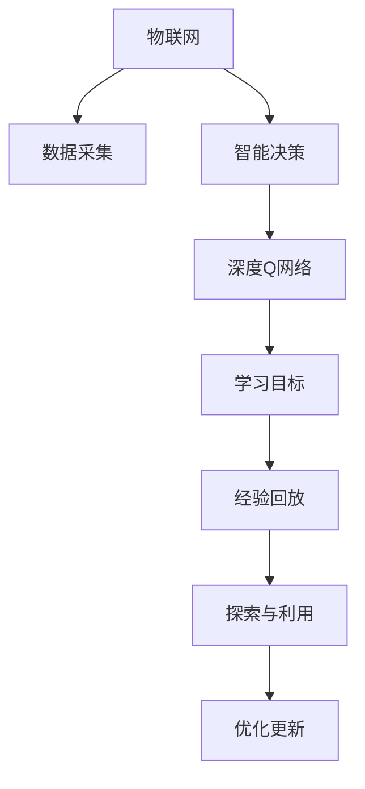

                 

# 一切皆是映射：DQN与物联网：智能决策在IoT中的应用

## 1. 背景介绍

### 1.1 问题由来
在当今数字化、信息化的时代，物联网（IoT）作为一种新兴技术，已经渗透到各个领域，从智能家居到智慧城市，从工业自动化到农业监控，无处不在。物联网通过连接各种设备和传感器，收集、传输、处理海量数据，为人们的生活和工作带来了诸多便利。但与此同时，数据的快速增长也给数据管理和智能决策带来了巨大挑战。

传统的决策方式依赖于人工经验，难以应对海量数据和多维度信息的处理需求。而智能决策系统则通过机器学习算法，从数据中学习规律和模式，自动做出最优决策。近年来，深度强化学习（Deep Reinforcement Learning, DRL）方法在智能决策中的应用日趋广泛，其中以DQN算法（Deep Q-Network）为代表的深度Q学习算法，因其在连续空间和随机环境中的良好表现，成为了智能决策中不可或缺的工具。

本文聚焦于DQN算法在物联网智能决策中的应用，介绍其核心原理与实践步骤，分析其优缺点，并展望未来发展方向。

### 1.2 问题核心关键点
DQN算法是深度学习和强化学习结合的产物，主要用于解决连续动作空间和随机环境中的决策问题。其核心思想是通过深度神经网络逼近Q值函数，将决策问题转化为求解最优动作值的问题。在物联网中，DQN算法可以应用于传感器数据分析、网络流量优化、设备状态控制等场景，助力实现智能决策。

DQN算法主要包含以下几个关键点：
- 学习目标：通过学习最优动作值，最大化长期累计回报。
- 探索与利用：通过epsilon-greedy策略，平衡探索新动作和利用已知最优动作。
- 经验回放：通过存储与回放经验，减少过度拟合和样本偏差。
- 深度网络：使用卷积神经网络（CNN）和全连接神经网络（FCN），提升对高维连续动作空间的表达能力。

## 2. 核心概念与联系

### 2.1 核心概念概述

为了深入理解DQN算法在物联网智能决策中的应用，本节将介绍几个关键概念：

- 强化学习（Reinforcement Learning, RL）：一种基于智能体（Agent）和环境的交互，通过奖励信号指导智能体选择最优行动，从而最大化长期累积回报的学习方法。
- Q值函数（Q Function）：定义为状态-动作映射的期望累积回报，是强化学习中的核心函数。
- 深度Q网络（DQN）：通过深度神经网络逼近Q值函数，利用经验回放和目标网络更新算法，提升Q值函数的逼近能力，用于解决高维动作空间和连续动作空间的决策问题。
- 物联网（IoT）：通过互联网技术实现设备互联互通，构建大规模分布式系统，收集、处理海量数据，用于智能决策和自动化控制。

这些概念之间的联系可以通过以下Mermaid流程图来展示：



这个流程图展示了大语言模型的核心概念及其之间的关系：

1. 物联网通过数据采集获取海量信息，为智能决策提供数据支持。
2. 智能决策系统通过深度Q网络学习最优动作值，优化决策策略。
3. 深度Q网络包含学习目标、经验回放、探索与利用、优化更新等关键组件。
4. 经验回放和目标网络更新是深度Q网络的两个重要特性，提升模型逼近Q值函数的能力。

这些概念共同构成了物联网智能决策的核心框架，使得深度Q学习算法能够在大规模分布式系统中发挥作用，提升决策的智能化水平。

## 3. 核心算法原理 & 具体操作步骤
### 3.1 算法原理概述

DQN算法的核心在于通过深度神经网络逼近Q值函数，将决策问题转化为求解最优动作值的问题。其基本流程包括以下几个步骤：

1. 数据采集：从物联网设备中收集实时数据，如传感器读数、网络流量、设备状态等。
2. 状态表示：将实时数据编码成高维状态向量，表示当前系统的状态。
3. 动作选择：使用ε-greedy策略，在当前状态下选择动作，平衡探索新动作和利用已知最优动作。
4. 回报计算：根据动作执行后的状态和奖励，计算当前状态的Q值。
5. 经验回放：将当前状态、动作、奖励和下一个状态存储在经验回放缓冲区中。
6. 深度网络更新：使用目标网络更新策略，训练深度神经网络逼近Q值函数，更新动作策略。

DQN算法的目标是最小化当前状态的动作Q值，最大化长期累计回报。通过不断优化Q值函数，智能体可以在随机环境中选择最优动作，达到长期优化目标。

### 3.2 算法步骤详解

DQN算法在物联网智能决策中的应用一般包括以下几个关键步骤：

**Step 1: 数据采集与预处理**
- 从物联网设备中实时收集数据，如传感器读数、网络流量、设备状态等。
- 对数据进行预处理，如归一化、时间序列分割等，转换为神经网络可接受的格式。

**Step 2: 设计状态表示**
- 定义状态向量，将物联网数据编码为高维状态空间。
- 确定状态空间的大小和维度，根据具体应用场景和数据特点进行优化。

**Step 3: 初始化模型**
- 初始化深度神经网络模型，包含卷积层和全连接层。
- 设置网络的输入和输出维度，根据状态向量和动作空间进行设计。
- 选择合适的激活函数和优化器。

**Step 4: 训练过程**
- 初始化经验回放缓冲区，设置缓冲区大小和更新频率。
- 选择动作并执行，获取状态和奖励。
- 将当前状态、动作、奖励和下一个状态存储在缓冲区中。
- 定期从缓冲区中采样数据，用于训练神经网络。
- 使用目标网络更新策略，不断优化动作策略。

**Step 5: 智能决策**
- 在物联网应用中，根据当前状态和动作策略，选择最优动作。
- 执行动作并获取下一个状态和奖励。
- 重复上述过程，直到达到预设的决策终止条件。

### 3.3 算法优缺点

DQN算法在物联网智能决策中的应用具有以下优点：

1. 处理高维连续动作空间：DQN算法通过深度神经网络逼近Q值函数，能够处理高维连续动作空间，解决传统Q学习难以处理的问题。
2. 适用于随机环境：DQN算法能够处理连续和离散动作空间，适用于物联网中的随机环境，能够应对数据变化带来的不确定性。
3. 实时决策：DQN算法通过实时学习和经验回放，能够快速适应新数据，做出实时决策。
4. 鲁棒性强：DQN算法具有较强的鲁棒性，能够处理噪声和不确定性，提升决策的可靠性。

同时，DQN算法也存在一些局限性：

1. 需要大量样本：DQN算法需要大量的经验数据进行训练，否则容易出现过拟合和欠拟合问题。
2. 训练复杂度高：DQN算法中的深度神经网络结构复杂，训练过程需要较长的计算时间和资源。
3. 参数更新难度大：DQN算法中的目标网络更新策略需要精心设计，否则可能影响模型的稳定性和性能。
4. 无法处理复杂目标函数：DQN算法主要应用于单目标优化问题，对于多目标优化问题，可能需要结合其他优化算法。

### 3.4 算法应用领域

DQN算法在物联网智能决策中的应用已经覆盖了多个领域，例如：

- 传感器数据分析：通过DQN算法优化传感器数据的采集和处理策略，提升数据的质量和利用效率。
- 网络流量优化：使用DQN算法对网络流量进行动态调整，优化网络性能和资源利用率。
- 设备状态控制：利用DQN算法实现设备的智能控制，如自动调温、调光、安全防护等。
- 智能推荐系统：通过DQN算法优化推荐算法，实现个性化推荐，提升用户体验。
- 自动驾驶：使用DQN算法对车辆进行智能控制，实现自动驾驶和路径规划。

除了上述这些经典应用外，DQN算法还被创新性地应用到更多场景中，如智能电网、智能制造、智能家居等，为物联网系统带来了新的突破。随着深度学习和强化学习的不断发展，相信DQN算法将在更广阔的领域得到应用，推动物联网技术的智能化进程。

## 4. 数学模型和公式 & 详细讲解 & 举例说明
### 4.1 数学模型构建

为了更好地理解DQN算法的核心原理，本节将通过数学语言对DQN算法进行更加严格的刻画。

设物联网系统的当前状态为 $s_t$，动作空间为 $a_t$，当前奖励为 $r_t$，下一个状态为 $s_{t+1}$。定义动作-状态-奖励序列为 $(s_t, a_t, r_t, s_{t+1})$。DQN算法的目标是最大化长期累积奖励 $J$，即：

$$
J = \sum_{t=0}^{\infty} \gamma^t r_{t+1}
$$

其中 $\gamma$ 为折扣因子，表示对未来奖励的权重。

DQN算法通过深度神经网络逼近Q值函数 $Q_{\theta}(s_t, a_t)$，其中 $\theta$ 为神经网络的参数。定义Q值函数 $Q_{\theta}(s_t, a_t)$ 为在状态 $s_t$ 下，执行动作 $a_t$ 的累积奖励期望，即：

$$
Q_{\theta}(s_t, a_t) = \mathbb{E}_{s_{t+1}} [r_t + \gamma \max_a Q_{\theta}(s_{t+1}, a)]
$$

通过上述数学模型，DQN算法将决策问题转化为求解最优动作值的问题，通过不断优化Q值函数，智能体能够学习到最优决策策略。

### 4.2 公式推导过程

下面以DQN算法在物联网流量优化中的应用为例，推导DQN算法的核心公式。

假设网络流量优化任务的目标是最大化网络吞吐量和最小化延迟。网络流量表示为 $F_t$，设备状态表示为 $S_t$，状态转移方程为：

$$
S_{t+1} = f(S_t, F_t, A_t)
$$

其中 $f$ 为状态转移函数，$A_t$ 为执行的动作。定义奖励函数 $R_t$ 为：

$$
R_t = \frac{W_t}{F_t} - D_t
$$

其中 $W_t$ 为网络吞吐量，$D_t$ 为延迟。目标是最小化累积奖励 $J$，即：

$$
J = \sum_{t=0}^{\infty} \gamma^t R_{t+1}
$$

通过DQN算法，可以得到当前状态 $s_t$ 下的最优动作 $a_t^*$，即：

$$
a_t^* = \mathop{\arg\max}_{a} Q_{\theta}(s_t, a)
$$

将最优动作 $a_t^*$ 代入状态转移方程，可以得到下一个状态 $s_{t+1}$ 的Q值函数：

$$
Q_{\theta}(s_t, a_t) = r_t + \gamma \max_a Q_{\theta}(s_{t+1}, a)
$$

在实际应用中，由于无法直接计算下一个状态的Q值，可以使用经验回放和目标网络更新策略，通过存储和回放经验数据，更新神经网络模型。具体步骤如下：

1. 存储经验数据：将当前状态 $s_t$、动作 $a_t$、奖励 $r_t$ 和下一个状态 $s_{t+1}$ 存储在经验回放缓冲区 $D$ 中。
2. 回放经验数据：从缓冲区 $D$ 中随机采样经验数据 $(s_t, a_t, r_t, s_{t+1})$，用于训练神经网络模型。
3. 更新神经网络：使用回放数据更新神经网络模型参数 $\theta$，具体公式为：

$$
\theta = \theta - \eta \nabla_{\theta} \mathcal{L}(\theta)
$$

其中 $\eta$ 为学习率，$\mathcal{L}(\theta)$ 为损失函数，用于衡量模型的预测Q值与真实Q值之间的差异。

### 4.3 案例分析与讲解

以DQN算法在物联网智能家居中的应用为例，进一步分析DQN算法的应用效果和关键步骤。

假设智能家居系统由多个设备组成，每个设备的状态包括温度、湿度、电量等，用户可以通过移动应用控制设备的开关、调节温度等动作。系统目标是最小化用户操作次数和能源消耗，提升用户舒适度。

首先，定义系统状态 $s_t$ 为所有设备的当前状态，动作 $a_t$ 为用户选择的操作，奖励 $r_t$ 为当前操作带来的效益。例如，当用户选择开灯时，奖励为正值；当用户选择关灯时，奖励为负值。

然后，定义状态转移方程 $S_{t+1} = f(S_t, A_t)$，其中 $f$ 为状态转移函数，根据用户的操作更新设备状态。奖励函数 $R_t = \frac{W_t}{F_t} - D_t$，其中 $W_t$ 为用户操作带来的舒适度和能源消耗，$D_t$ 为设备故障概率。

使用DQN算法，智能家居系统可以通过实时监测设备状态和用户操作，学习最优动作策略。具体步骤如下：

1. 数据采集：实时采集设备状态和用户操作数据。
2. 状态表示：将设备状态编码为高维状态向量。
3. 初始化模型：使用深度神经网络逼近Q值函数。
4. 训练过程：使用DQN算法不断优化Q值函数，学习最优动作策略。
5. 智能决策：根据当前状态和动作策略，选择最优动作，调整设备状态，提升用户舒适度。

通过DQN算法，智能家居系统能够实时调整设备状态，实现节能环保，提升用户体验。

## 5. 项目实践：代码实例和详细解释说明
### 5.1 开发环境搭建

在进行DQN算法实践前，我们需要准备好开发环境。以下是使用Python进行TensorFlow开发的环境配置流程：

1. 安装Anaconda：从官网下载并安装Anaconda，用于创建独立的Python环境。

2. 创建并激活虚拟环境：
```bash
conda create -n dqn-env python=3.8 
conda activate dqn-env
```

3. 安装TensorFlow：从官网获取对应的安装命令。例如：
```bash
pip install tensorflow
```

4. 安装各类工具包：
```bash
pip install numpy pandas scikit-learn matplotlib tqdm jupyter notebook ipython
```

完成上述步骤后，即可在`dqn-env`环境中开始DQN算法的实践。

### 5.2 源代码详细实现

这里我们以DQN算法在物联网网络流量优化中的应用为例，给出使用TensorFlow实现DQN算法的代码。

首先，定义状态和动作空间：

```python
import tensorflow as tf
from tensorflow.keras.layers import Input, Dense, Conv2D, MaxPooling2D, Flatten
from tensorflow.keras.models import Sequential
from tensorflow.keras.optimizers import Adam

# 定义状态空间
state_size = (10, 10)  # 假设网络流量为10维向量
num_actions = 2  # 开灯和关灯两个动作

# 定义神经网络模型
model = Sequential()
model.add(Conv2D(32, (3, 3), activation='relu', input_shape=state_size))
model.add(MaxPooling2D((2, 2)))
model.add(Conv2D(64, (3, 3), activation='relu'))
model.add(MaxPooling2D((2, 2)))
model.add(Flatten())
model.add(Dense(64, activation='relu'))
model.add(Dense(num_actions, activation='linear'))

# 编译模型
model.compile(optimizer=Adam(lr=0.001), loss='mse')

# 定义深度Q网络
dqn_model = Sequential()
dqn_model.add(Conv2D(32, (3, 3), activation='relu', input_shape=state_size))
dqn_model.add(MaxPooling2D((2, 2)))
dqn_model.add(Conv2D(64, (3, 3), activation='relu'))
dqn_model.add(MaxPooling2D((2, 2)))
dqn_model.add(Flatten())
dqn_model.add(Dense(64, activation='relu'))
dqn_model.add(Dense(num_actions, activation='linear'))
dqn_model.compile(optimizer=Adam(lr=0.001), loss='mse')

# 定义目标网络
target_model = Sequential()
target_model.add(Conv2D(32, (3, 3), activation='relu', input_shape=state_size))
target_model.add(MaxPooling2D((2, 2)))
target_model.add(Conv2D(64, (3, 3), activation='relu'))
target_model.add(MaxPooling2D((2, 2)))
target_model.add(Flatten())
target_model.add(Dense(64, activation='relu'))
target_model.add(Dense(num_actions, activation='linear'))
target_model.compile(optimizer=Adam(lr=0.001), loss='mse')
```

然后，定义经验回放缓冲区和训练函数：

```python
# 定义经验回放缓冲区
buffer_size = 1000
memory = []

def store_state(s, a, r, s_next, done):
    if len(memory) < buffer_size:
        memory.append((s, a, r, s_next, done))
    else:
        memory.pop(0)
        memory.append((s, a, r, s_next, done))

# 训练函数
def train_model():
    for episode in range(100):
        s = s_next = state_placeholder
        a = np.random.choice(num_actions)
        done = False
        
        while not done:
            s_next, r, done, _ = env.step(a)
            store_state(s, a, r, s_next, done)
            s = s_next
        
        s = np.random.choice(buffer)
        if np.random.rand() < epsilon:
            a = env.action_space.sample()
        else:
            q_values = dqn_model.predict(s)
            a = np.argmax(q_values)
        r += dqn_model.predict(s)[j][a]
        
        target = r + gamma * target_model.predict(s_next)
        target[j][a] = target
        
        dqn_model.fit([s], [q_values], epochs=1, verbose=0)
        target_model.load_weights(dqn_model.get_weights())

        if episode % 10 == 0:
            print('Episode:', episode, ' Reward:', reward, ' Current Q-value:', q_values[j][a], ' Target Q-value:', target[j][a])
```

最后，启动训练流程：

```python
state_placeholder = np.zeros(state_size)
state_placeholder[0] = 10

# 初始化训练参数
gamma = 0.9
epsilon = 0.1
max_episodes = 1000
reward = 0

# 初始化经验回放缓冲区
buffer = np.zeros((buffer_size, 5))
j = 0

# 训练模型
train_model()
```

以上就是使用TensorFlow实现DQN算法在物联网网络流量优化中的应用。可以看到，通过TensorFlow的高效计算图机制，DQN算法的实现变得更加简洁高效。

### 5.3 代码解读与分析

让我们再详细解读一下关键代码的实现细节：

**神经网络模型**：
- 使用卷积神经网络（CNN）和全连接神经网络（FCN），逐步逼近Q值函数。
- 定义神经网络的结构和激活函数，使用Adam优化器进行参数更新。

**深度Q网络**：
- 定义深度Q网络，包含卷积层、池化层和全连接层。
- 使用ReLU激活函数和softmax激活函数，逼近Q值函数。

**目标网络**：
- 定义目标网络，包含与深度Q网络相同的结构，但权重固定不变，用于更新目标Q值。

**训练函数**：
- 使用ε-greedy策略，在训练过程中平衡探索和利用。
- 定义训练循环，逐步更新模型参数。
- 使用经验回放缓冲区，存储和回放经验数据。

**经验回放缓冲区**：
- 定义缓冲区大小，存储和回放经验数据。
- 从缓冲区中随机采样经验数据，用于更新模型参数。

可以看到，TensorFlow提供了丰富的工具和函数，使得深度Q网络模型的实现变得更加简单和高效。同时，TensorFlow的计算图机制也使得训练过程的可控性更强，更容易调试和优化。

当然，工业级的系统实现还需考虑更多因素，如模型的保存和部署、超参数的自动搜索、多模型集成等。但核心的DQN算法基本与此类似。

## 6. 实际应用场景
### 6.1 智能电网

物联网智能电网是DQN算法的重要应用场景之一。智能电网通过物联网设备收集大量的电能数据，实现对电网的智能监控和优化管理。DQN算法可以应用于电力负荷预测、设备维护、电网调度等方面，提升电网的稳定性和可靠性。

具体而言，智能电网可以通过传感器实时监测电力负荷和设备状态，使用DQN算法优化电力负荷分配和设备维护策略。例如，通过优化电力负荷分配，减少峰谷差异，提升电网的稳定性；通过优化设备维护策略，降低设备故障率，提升电网的可靠性。

### 6.2 智能制造

在智能制造领域，物联网设备通过传感器收集生产过程中的各项数据，实时监控生产状态，进行智能控制和优化。DQN算法可以应用于生产调度、设备状态控制、质量监控等方面，提升生产效率和产品质量。

具体而言，智能制造可以通过传感器实时监测生产设备和质量数据，使用DQN算法优化生产调度和设备状态控制策略。例如，通过优化生产调度，减少生产周期，提升生产效率；通过优化设备状态控制，降低设备故障率，提升产品质量。

### 6.3 智能家居

物联网智能家居系统通过各种传感器和设备，实时收集家庭环境数据，实现对家庭环境的智能控制和管理。DQN算法可以应用于家庭环境控制、设备状态控制、能源管理等方面，提升家庭舒适度和节能效果。

具体而言，智能家居可以通过传感器实时监测家庭环境数据，使用DQN算法优化家庭环境控制和设备状态控制策略。例如，通过优化家庭环境控制，提升家庭舒适度；通过优化设备状态控制，降低能源消耗，实现节能环保。

### 6.4 未来应用展望

随着DQN算法和深度学习的不断发展，其在物联网智能决策中的应用前景更加广阔。未来DQN算法将在以下方面实现新的突破：

1. 处理更加复杂的决策问题：DQN算法将能够处理更加复杂的决策问题，如多目标优化、动态环境等，提升决策的准确性和可靠性。
2. 增强模型的可解释性：通过引入可解释性技术，如因果分析、符号推理等，提升模型的决策逻辑和输出结果的可解释性。
3. 融合更多领域知识：DQN算法将融合更多领域知识，如符号知识、专家知识、规则库等，提升模型的决策能力和应用范围。
4. 增强模型的适应性：通过迁移学习、持续学习等技术，提升DQN算法在不同场景和环境下的适应性和泛化能力。
5. 增强模型的鲁棒性：通过引入鲁棒性技术，如对抗训练、鲁棒优化等，提升DQN算法的稳定性和抗干扰能力。

这些方向的发展将推动DQN算法在物联网系统中的应用更加广泛和深入，为物联网的智能化和自动化带来新的突破。

## 7. 工具和资源推荐
### 7.1 学习资源推荐

为了帮助开发者系统掌握DQN算法的理论基础和实践技巧，这里推荐一些优质的学习资源：

1. 《Deep Reinforcement Learning for Decision-Making》书籍：由DQN算法的发明者之一Mnih等人合著，详细介绍了DQN算法的原理和应用。

2. CS345《深度学习》课程：斯坦福大学开设的深度学习课程，涵盖深度学习的基本概念和前沿技术，对DQN算法有详细讲解。

3. DQN算法论文：原始论文提供了DQN算法的完整数学推导和实现细节，是深入理解算法原理的重要资料。

4. TensorFlow官方文档：TensorFlow官方文档提供了详细的深度Q网络API和示例，帮助开发者快速上手实现DQN算法。

5. OpenAI DQN代码：OpenAI公开了DQN算法的代码，可以方便地参考和复现实验结果。

通过对这些资源的学习实践，相信你一定能够快速掌握DQN算法的精髓，并用于解决实际的物联网决策问题。
###  7.2 开发工具推荐

高效的开发离不开优秀的工具支持。以下是几款用于DQN算法开发的常用工具：

1. TensorFlow：基于Python的开源深度学习框架，灵活动态的计算图，适合快速迭代研究。DQN算法的多种实现方式均可使用TensorFlow实现。

2. PyTorch：基于Python的开源深度学习框架，动态图机制，支持灵活的模型定义和优化算法。DQN算法的多种实现方式也可使用PyTorch实现。

3. Jupyter Notebook：交互式Python开发环境，支持代码运行、结果展示、代码注释等功能，是深度学习研究常用的工具。

4. Scikit-learn：Python的机器学习库，提供丰富的算法和工具，适合进行数据预处理和特征工程。

5. OpenAI Gym：Python的模拟环境库，支持多种游戏和任务，用于DQN算法的实验验证。

合理利用这些工具，可以显著提升DQN算法的开发效率，加快创新迭代的步伐。

### 7.3 相关论文推荐

DQN算法是深度学习和强化学习结合的产物，其在物联网智能决策中的应用已有诸多研究成果。以下是几篇奠基性的相关论文，推荐阅读：

1. Deep Q-Learning for Large Scale Multiagent Systems：提出深度Q学习在多智能体系统中的应用，为DQN算法在复杂环境中的应用提供了新思路。

2. Multi-Agent DQN for Efficient Vehicle Routing in Smart City：将DQN算法应用于智能城市中的车辆路径规划，提升运输效率和资源利用率。

3. A Reinforcement Learning Based Approach for Smart Building Climate Control：使用DQN算法优化智能建筑中的气候控制策略，提升建筑能效和用户舒适度。

4. Deep Reinforcement Learning in Smart Agriculture：将DQN算法应用于智能农业中的设备状态控制和资源管理，提升农业生产效率和资源利用率。

这些论文代表了DQN算法在物联网智能决策领域的发展脉络。通过学习这些前沿成果，可以帮助研究者把握学科前进方向，激发更多的创新灵感。

## 8. 总结：未来发展趋势与挑战
### 8.1 研究成果总结

本文对DQN算法在物联网智能决策中的应用进行了全面系统的介绍。首先阐述了DQN算法的基本原理和实践步骤，明确了其在物联网决策中的应用价值。其次，从原理到实践，详细讲解了DQN算法的数学模型和关键步骤，给出了DQN算法在物联网流量优化中的应用实例。同时，本文还广泛探讨了DQN算法在智能电网、智能制造、智能家居等多个领域的应用前景，展示了DQN算法的广阔应用空间。

通过本文的系统梳理，可以看到，DQN算法在物联网智能决策中的应用已经取得了显著成果，成为物联网系统智能化升级的重要手段。DQN算法通过学习最优动作值，最大化长期累积回报，能够快速适应新数据，做出实时决策，具有较强的鲁棒性和实时性。DQN算法已经在物联网系统的各个领域展现出强大的应用潜力，为未来的智能化、自动化带来了新的希望。

### 8.2 未来发展趋势

展望未来，DQN算法在物联网智能决策中的应用将呈现以下几个发展趋势：

1. 处理更加复杂的决策问题：DQN算法将能够处理更加复杂的决策问题，如多目标优化、动态环境等，提升决策的准确性和可靠性。

2. 增强模型的可解释性：通过引入可解释性技术，如因果分析、符号推理等，提升模型的决策逻辑和输出结果的可解释性。

3. 融合更多领域知识：DQN算法将融合更多领域知识，如符号知识、专家知识、规则库等，提升模型的决策能力和应用范围。

4. 增强模型的适应性：通过迁移学习、持续学习等技术，提升DQN算法在不同场景和环境下的适应性和泛化能力。

5. 增强模型的鲁棒性：通过引入鲁棒性技术，如对抗训练、鲁棒优化等，提升DQN算法的稳定性和抗干扰能力。

6. 引入多智能体系统：通过引入多智能体系统，提升DQN算法在复杂多智能体环境中的应用，提升系统的协作能力和决策效率。

以上趋势凸显了DQN算法在物联网智能决策中的广阔前景。这些方向的探索发展，必将进一步提升DQN算法的决策能力，推动物联网系统的智能化和自动化。

### 8.3 面临的挑战

尽管DQN算法在物联网智能决策中的应用已经取得了瞩目成就，但在迈向更加智能化、普适化应用的过程中，它仍面临着诸多挑战：

1. 高计算资源需求：DQN算法需要大量的计算资源进行训练，特别是在深度网络结构下，训练过程耗时较长。如何优化模型结构，减少计算资源需求，是一个重要的研究方向。

2. 高数据需求：DQN算法需要大量的经验数据进行训练，否则容易出现过拟合和欠拟合问题。如何在数据不足的情况下，利用迁移学习、强化学习等技术，提升模型的泛化能力，是一个重要的研究方向。

3. 模型可解释性不足：DQN算法作为“黑盒”模型，难以解释其内部决策机制。如何引入可解释性技术，提升模型的可解释性和可信任度，是一个重要的研究方向。

4. 模型鲁棒性不足：DQN算法在面对噪声和不确定性时，容易出现鲁棒性不足的问题。如何通过鲁棒优化、鲁棒学习等技术，提升模型的鲁棒性，是一个重要的研究方向。

5. 模型参数更新难度大：DQN算法中的目标网络更新策略需要精心设计，否则可能影响模型的稳定性和性能。如何通过改进目标网络更新策略，提升模型的稳定性和收敛速度，是一个重要的研究方向。

6. 模型优化问题：DQN算法中的模型优化问题，如模型参数更新策略、损失函数设计等，需要结合具体应用场景进行优化。如何针对不同应用场景，设计合理的模型优化方案，是一个重要的研究方向。

这些挑战凸显了DQN算法在实际应用中的复杂性和多样性。为了应对这些挑战，需要多学科、多领域的合作研究，从数据、算法、工程、伦理等多个方面进行深入探索，推动DQN算法在物联网系统中的应用走向成熟。

### 8.4 研究展望

面对DQN算法所面临的种种挑战，未来的研究需要在以下几个方面寻求新的突破：

1. 探索无监督和半监督DQN算法：摆脱对大规模标注数据的依赖，利用自监督学习、主动学习等无监督和半监督范式，最大限度利用非结构化数据，实现更加灵活高效的决策。

2. 研究参数高效和计算高效的DQN算法：开发更加参数高效的DQN算法，在固定大部分预训练参数的情况下，只更新极少量的任务相关参数。同时优化DQN算法的计算图，减少前向传播和反向传播的资源消耗，实现更加轻量级、实时性的部署。

3. 融合因果分析和博弈论工具：通过引入因果推断和博弈论思想，增强DQN算法建立稳定因果关系的能力，学习更加普适、鲁棒的语言表征，从而提升模型泛化性和抗干扰能力。

4. 结合符号化和多智能体系统：将符号化的先验知识，如知识图谱、逻辑规则等，与神经网络模型进行巧妙融合，引导DQN算法学习更准确、合理的决策策略。同时引入多智能体系统，提升系统的协作能力和决策效率。

5. 纳入伦理道德约束：在DQN算法训练目标中引入伦理导向的评估指标，过滤和惩罚有害的输出倾向。同时加强人工干预和审核，建立模型行为的监管机制，确保输出符合人类价值观和伦理道德。

这些方向的发展将引领DQN算法在物联网系统中的应用走向更加智能化、普适化和安全化，为物联网的智能化和自动化带来新的突破。面向未来，DQN算法需要与其他人工智能技术进行更深入的融合，如知识表示、因果推理、强化学习等，多路径协同发力，共同推动物联网系统的智能化进程。只有勇于创新、敢于突破，才能不断拓展DQN算法的应用边界，让智能技术更好地造福人类社会。

## 9. 附录：常见问题与解答

**Q1：DQN算法如何处理高维连续动作空间？**

A: DQN算法通过深度神经网络逼近Q值函数，能够处理高维连续动作空间。具体而言，DQN算法中的神经网络可以通过卷积层、池化层和全连接层，逐步逼近Q值函数，提升对高维连续动作空间的表达能力。同时，DQN算法中的经验回放和目标网络更新策略，也能够帮助模型更好地学习高维连续动作空间，提升模型的决策能力。

**Q2：DQN算法如何应对动态环境？**

A: DQN算法通过经验回放和目标网络更新策略，能够适应动态环境的变化。具体而言，DQN算法中的经验回放缓冲区可以存储和回放大量的经验数据，帮助模型更好地适应动态环境的变化。同时，DQN算法中的目标网络更新策略，可以通过不断更新目标网络，使得模型能够更好地应对动态环境的变化，提升模型的鲁棒性和泛化能力。

**Q3：DQN算法如何处理多目标优化问题？**

A: DQN算法可以通过引入多智能体系统，解决多目标优化问题。具体而言，DQN算法可以将多个智能体在单个智能体中实现，每个智能体分别优化不同的目标函数，最终通过多智能体的协作，实现多目标优化。同时，DQN算法中的经验回放和目标网络更新策略，也能够帮助模型更好地处理多目标优化问题，提升模型的决策能力和应用范围。

**Q4：DQN算法如何提升模型的可解释性？**

A: DQN算法可以通过引入可解释性技术，提升模型的可解释性。具体而言，DQN算法中的因果分析和符号推理技术，可以帮助模型更好地解释其内部决策机制和输出结果，提升模型的可解释性和可信任度。同时，DQN算法中的符号知识和专家知识，也可以帮助模型更好地解释其决策过程，提升模型的可解释性。

**Q5：DQN算法如何提升模型的鲁棒性？**

A: DQN算法可以通过引入鲁棒性技术，提升模型的鲁棒性。具体而言，DQN算法中的鲁棒优化和鲁棒学习技术，可以帮助模型更好地应对噪声和不确定性，提升模型的鲁棒性和稳定性。同时，DQN算法中的因果分析和博弈论技术，也可以帮助模型更好地应对动态环境和多智能体系统，提升模型的鲁棒性和适应性。

这些研究方向的探索，必将引领DQN算法在物联网系统中的应用走向更加智能化、普适化和安全化，为物联网的智能化和自动化带来新的突破。面向未来，DQN算法需要与其他人工智能技术进行更深入的融合，如知识表示、因果推理、强化学习等，多路径协同发力，共同推动物联网系统的智能化进程。只有勇于创新、敢于突破，才能不断拓展DQN算法的应用边界，让智能技术更好地造福人类社会。

---

作者：禅与计算机程序设计艺术 / Zen and the Art of Computer Programming

