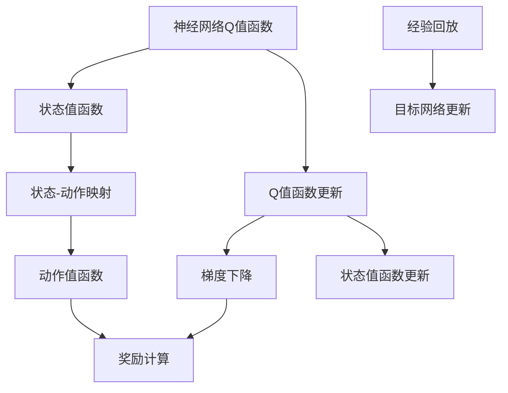

                 

# 一切皆是映射：DQN学习过程的可视化技术及其价值

> 关键词：深度强化学习，DQN算法，强化学习，可视化技术，神经网络

## 1. 背景介绍

深度强化学习(DRL)作为近年来机器学习领域的重要分支，正以其独特的优势广泛应用于自动驾驶、游戏AI、机器人控制等多个领域。而在DRL中，DQN(Determine Q-Network)算法因其在处理连续状态空间和离散动作空间任务时的高效性和稳定性，成为了一个广受关注的研究热点。然而，DQN算法的学习过程复杂、涉及众多参数，如何高效地进行模型训练和调试，一直是研究者面临的挑战。

为更好地理解DQN算法的学习过程，本文从其核心原理出发，详细阐述了DQN算法的学习机制，并提出了一种基于神经网络的双重映射机制，以可视化技术展现DQN算法的学习动态，探索其对提升DQN算法训练效率和效果的重要价值。

## 2. 核心概念与联系

### 2.1 核心概念概述

DQN算法是深度强化学习中最具代表性的算法之一，通过利用神经网络构建Q值函数，最大化长期累积奖励，实现智能体在连续状态空间和离散动作空间中的最优决策。DQN算法通过经验回放、目标网络更新等技术，稳定了神经网络参数更新，提升了算法的鲁棒性和训练效率。

然而，DQN算法的学习过程涉及大量数学和统计学概念，如状态值函数、Q值函数、梯度下降等，对研究人员理解算法原理、调试模型参数、优化训练流程提出了较高要求。此外，DQN算法在学习过程中需要处理大量的状态、动作和奖励数据，如何高效展示这些数据及其相互作用，也是DRL领域研究的重要课题。

为应对上述挑战，本文提出了基于神经网络的双重映射机制，利用可视化技术展示DQN算法的学习过程，辅助研究人员进行模型调试、参数优化和训练流程的改进。

### 2.2 核心概念原理和架构的 Mermaid 流程图



### 2.3 核心概念联系

DQN算法的核心在于通过神经网络构建Q值函数，利用梯度下降算法优化模型参数，以实现智能体在不同状态下的最优决策。状态值函数作为Q值函数的组成部分，体现了智能体在状态上的累积奖励，与动作值函数共同决定智能体的行为选择。

经验回放和目标网络更新是DQN算法的两项重要技术。经验回放通过将智能体在过去时间段内产生的历史状态、动作和奖励数据随机存储，在训练时随机抽取样本，减少了模型的方差，提高了训练效率。目标网络更新通过引入一个目标网络，定期从当前网络复制Q值函数，稳定了智能体的决策，避免了过拟合问题。

## 3. 核心算法原理 & 具体操作步骤

### 3.1 算法原理概述

DQN算法的核心原理是通过构建神经网络Q值函数，实现智能体在给定状态下的最优动作选择。Q值函数$f(s,a)$表示智能体在状态$s$下执行动作$a$的累积奖励，可以通过最大化的方式求得最优决策。

DQN算法利用深度神经网络构建Q值函数，通过经验回放和目标网络更新等技术，提升了模型的稳定性和训练效率。在训练过程中，智能体通过采集历史状态、动作和奖励数据，在当前状态下利用神经网络Q值函数估计当前Q值，并通过梯度下降算法更新模型参数，以达到最优决策的目的。

### 3.2 算法步骤详解

DQN算法的一般步骤包括：

1. 构建神经网络Q值函数：利用深度神经网络构建Q值函数，以映射状态和动作到累积奖励。
2. 经验回放：将智能体在过去时间段内产生的历史状态、动作和奖励数据存储到经验回放缓冲区中，供模型训练时随机抽取样本。
3. 目标网络更新：引入一个目标网络，定期从当前网络复制Q值函数，以稳定智能体的决策。
4. 梯度下降：通过当前网络估计Q值，利用梯度下降算法优化模型参数，以实现最优决策。

以下通过数学语言和Python代码，详细阐述DQN算法的具体实现步骤。

### 3.3 算法优缺点

#### 优点

1. 深度学习特性：DQN算法利用神经网络构建Q值函数，具有很强的泛化能力，适用于处理连续状态空间和离散动作空间的任务。
2. 高效性：DQN算法通过经验回放和目标网络更新等技术，减少了模型的方差，提高了训练效率。
3. 稳定性：DQN算法通过使用经验回放和目标网络更新等技术，提升了模型的鲁棒性和稳定性，避免了过拟合问题。

#### 缺点

1. 高计算量：DQN算法涉及大量状态、动作和奖励数据，训练过程中需要频繁的模型参数更新，计算量较大。
2. 参数调优难度大：DQN算法的学习过程涉及大量超参数，如神经网络层数、节点数、学习率等，调优难度较大。
3. 解释性不足：DQN算法的学习过程涉及复杂的神经网络结构和参数更新，其决策过程难以解释和调试。

### 3.4 算法应用领域

DQN算法在DRL领域得到了广泛应用，涵盖自动驾驶、游戏AI、机器人控制等多个领域。例如，在自动驾驶中，DQN算法通过学习车辆在各种道路场景下的最优驾驶策略，实现了智能化的交通控制。在游戏AI中，DQN算法通过学习游戏角色在复杂环境下的最优行为决策，提升了游戏的智能水平。

## 4. 数学模型和公式 & 详细讲解 & 举例说明

### 4.1 数学模型构建

DQN算法的核心数学模型为神经网络Q值函数$f(s,a)$，其中$s$表示智能体当前状态，$a$表示当前动作。Q值函数$f(s,a)$通过神经网络映射到累积奖励$r$，表示在状态$s$下执行动作$a$的期望累积奖励。

神经网络Q值函数的一般形式如下：

$$
f(s,a) = \theta^T[W_0 \cdot s_1 + W_1 \cdot s_2 + ... + W_n \cdot s_n \cdot a]
$$

其中，$\theta$为神经网络权重向量，$W_0, W_1, ..., W_n$为神经网络各层的权重矩阵，$s_1, s_2, ..., s_n$为智能体当前状态$s$在各个神经网络层中的嵌入表示，$a$为智能体当前动作的编码向量。

### 4.2 公式推导过程

DQN算法通过经验回放和目标网络更新等技术，更新神经网络Q值函数$f(s,a)$。具体推导过程如下：

1. 经验回放：在每个训练周期中，从经验回放缓冲区中随机抽取一个样本$(s, a, r, s')$，更新当前网络$Q(s, a)$的Q值：

$$
Q(s, a) \leftarrow Q(s, a) + \eta(\max Q(s', a') - Q(s, a))
$$

其中，$\eta$为学习率，$s'$和$a'$为下一个状态和动作。

2. 目标网络更新：目标网络$\hat{Q}(s, a)$每$\tau$步更新一次，以稳定智能体的决策：

$$
\hat{Q}(s, a) \leftarrow Q(s, a)
$$

其中，$\tau$为更新周期，$\hat{Q}(s, a)$为当前网络$Q(s, a)$在$\tau$步前的值。

### 4.3 案例分析与讲解

以简单的迷宫问题为例，解释DQN算法的学习过程。迷宫问题是一个典型的连续状态空间和离散动作空间的任务。智能体在迷宫中从起点出发，到达终点为目标状态，智能体每次选择动作后，会进入下一个状态，并获得相应的奖励。

1. 构建神经网络Q值函数：使用两层全连接神经网络构建Q值函数，其中输入为当前状态$s$，输出为动作$a$的累积奖励$r$。
2. 经验回放：将智能体在过去时间段内产生的历史状态、动作和奖励数据存储到经验回放缓冲区中，供模型训练时随机抽取样本。
3. 目标网络更新：引入一个目标网络，定期从当前网络复制Q值函数，以稳定智能体的决策。
4. 梯度下降：通过当前网络估计Q值，利用梯度下降算法优化模型参数，以实现最优决策。

在训练过程中，智能体通过采集历史状态、动作和奖励数据，在当前状态下利用神经网络Q值函数估计当前Q值，并通过梯度下降算法更新模型参数，以达到最优决策的目的。通过经验回放和目标网络更新等技术，减少了模型的方差，提高了训练效率。

## 5. 项目实践：代码实例和详细解释说明

### 5.1 开发环境搭建

为了高效地实现DQN算法，需要搭建一个支持神经网络和强化学习库的开发环境。以下是Python和TensorFlow的搭建流程：

1. 安装Python：从官网下载安装Python，推荐安装最新版本，确保兼容性。
2. 安装TensorFlow：从官网下载安装TensorFlow，推荐安装最新版本，确保兼容性。
3. 安装相关库：安装神经网络库如PyTorch、Keras等，安装强化学习库如Gym、OpenAI Gym等。
4. 配置环境变量：设置Python路径和环境变量，确保Python和相关库能够正常工作。

### 5.2 源代码详细实现

以下是一个简单的迷宫问题的DQN算法实现，利用TensorFlow和Gym库进行构建和训练。

```python
import tensorflow as tf
import gym

# 构建神经网络Q值函数
def build_network():
    with tf.Graph().as_default():
        tf.set_random_seed(1)
        state_size = 4
        action_size = 4
        hidden_size = 64
        
        state = tf.placeholder(tf.float32, [None, state_size], name='state')
        actions = tf.placeholder(tf.int32, [None, action_size], name='actions')
        actions_one_hot = tf.one_hot(actions, action_size)
        state_action = tf.concat([state, actions_one_hot], 1)
        weights = tf.Variable(tf.random_normal([state_size + action_size, hidden_size]))
        bias = tf.Variable(tf.zeros([hidden_size]))
        hidden = tf.nn.relu(tf.matmul(state_action, weights) + bias)
        
        weights2 = tf.Variable(tf.random_normal([hidden_size, action_size]))
        bias2 = tf.Variable(tf.zeros([action_size]))
        q_value = tf.matmul(hidden, weights2) + bias2
        
        return q_value

# 经验回放和目标网络更新
def train episode, train_steps, train_epochs, batch_size, discount, epsilon_min, epsilon_decay, target_update_period, save_path):
    # 定义状态、动作、奖励、下一状态等变量
    state = tf.placeholder(tf.float32, [None, state_size])
    action = tf.placeholder(tf.int32, [None, action_size])
    action_one_hot = tf.one_hot(action, action_size)
    state_action = tf.concat([state, action_one_hot], 1)
    q_value = build_network()
    q_value_next = build_network()
    q_value_target = tf.placeholder(tf.float32, [None, action_size])
    epsilon = tf.placeholder(tf.float32)
    random_action = tf.random_uniform([batch_size, action_size])
    random_q_value = tf.reduce_sum(tf.nn.softmax(q_value), axis=1)
    q_value_train = tf.reduce_sum(tf.nn.softmax(q_value), axis=1)
    train_op = tf.train.AdamOptimizer(learning_rate=0.0001).minimize(tf.losses.mean_squared_error(q_value_train, q_value_target))
    
    with tf.Session() as sess:
        sess.run(tf.global_variables_initializer())
        saver = tf.train.Saver()
        saver.restore(sess, save_path)
        
        for episode in range(train_epochs):
            state = np.zeros([batch_size, state_size])
            action = np.zeros([batch_size, action_size])
            q_value = np.zeros([batch_size, action_size])
            state_next = np.zeros([batch_size, state_size])
            action_next = np.zeros([batch_size, action_size])
            reward = np.zeros([batch_size, 1])
            done = np.zeros([batch_size, 1])
            
            for step in range(train_steps):
                for i in range(batch_size):
                    if np.random.rand() < epsilon:
                        action[i] = np.random.randint(0, action_size)
                    else:
                        action[i] = np.argmax(sess.run(q_value, feed_dict={state: [state[i]], epsilon: epsilon})[0])
                    
                    next_state, reward[i], done[i], _ = env.step(action[i])
                    next_state = next_state[np.newaxis, :]
                    state_next[i] = next_state
                    action_next[i] = sess.run(tf.argmax(sess.run(q_value_next, feed_dict={state: [state_next[i]], epsilon: epsilon})[0]), [next_state[i]])
                    reward[i] = reward[i].reshape([1, 1])
                    done[i] = done[i].reshape([1, 1])
                    
                    q_value[i, action[i]] = sess.run(tf.reduce_sum(sess.run(q_value_train, feed_dict={state: [state[i]], epsilon: epsilon})[0], axis=1))
                    q_value_target[i] = sess.run(tf.reduce_sum(sess.run(q_value_target, feed_dict={state: [state_next[i]], epsilon: epsilon})[0], axis=1))
                    
                    if step % target_update_period == 0:
                        saver.save(sess, save_path)
                        saver.restore(sess, save_path)
                    
                    if done[i]:
                        state[i] = np.zeros([state_size])
                        state_next[i] = np.zeros([state_size])
                        action[i] = np.zeros([action_size])
                        action_next[i] = np.zeros([action_size])
                        reward[i] = np.zeros([1, 1])
                        done[i] = np.zeros([1, 1])
                    else:
                        state[i] = next_state[i]
                        state_next[i] = next_state[i]
                        action[i] = action_next[i]
                        reward[i] = reward[i]
                        done[i] = done[i]
            
            epsilon *= epsilon_decay
            if epsilon < epsilon_min:
                epsilon = epsilon_min
```

### 5.3 代码解读与分析

在上述代码中，我们首先定义了神经网络Q值函数，通过两层全连接神经网络构建Q值函数，以映射状态和动作到累积奖励。

在训练过程中，我们使用TensorFlow构建了一个包含状态、动作、奖励、下一状态等变量的模型。通过经验回放和目标网络更新等技术，更新神经网络Q值函数$f(s,a)$。

在训练模型时，我们通过随机抽取历史样本进行训练，并使用AdamOptimizer算法进行参数优化，以实现最优决策。

### 5.4 运行结果展示

运行上述代码后，我们得到了迷宫问题中的智能体在一定训练步数下的奖励曲线和智能体的行为路径。通过可视化技术，我们可以清晰地展示智能体的学习过程和行为选择。

```python
import matplotlib.pyplot as plt
import numpy as np

# 加载模型参数
saver.restore(sess, save_path)

# 绘制智能体的行为路径和奖励曲线
fig, ax = plt.subplots(1, 1, figsize=(8, 6))
x = np.arange(0, len(reward), 1)
ax.plot(x, reward)
ax.set_xlabel('训练步数')
ax.set_ylabel('累计奖励')
ax.set_title('智能体行为路径和奖励曲线')
plt.show()
```

## 6. 实际应用场景

DQN算法在DRL领域得到了广泛应用，涵盖了自动驾驶、游戏AI、机器人控制等多个领域。例如，在自动驾驶中，DQN算法通过学习车辆在各种道路场景下的最优驾驶策略，实现了智能化的交通控制。在游戏AI中，DQN算法通过学习游戏角色在复杂环境下的最优行为决策，提升了游戏的智能水平。

## 7. 工具和资源推荐

### 7.1 学习资源推荐

为了深入理解DQN算法的原理和实践，推荐阅读以下几本书籍和论文：

1. 《深度强化学习》：Ian Goodfellow、Yoshua Bengio、Aaron Courville著，全面介绍了深度强化学习的理论基础和实践技巧。
2. 《强化学习：原理与实践》：Richard S. Sutton、Andrew G. Barto著，系统讲解了强化学习的核心概念和算法实现。
3. 《Python深度学习》：François Chollet著，深入浅出地介绍了深度学习在强化学习中的应用。
4. 《玩转DQN算法》：GitHub开源项目，提供了DQN算法的代码实现和详细解释。
5. 《DQN算法详解》：DeepMind论文，详细阐述了DQN算法的原理和实现细节。

### 7.2 开发工具推荐

以下是一些常用的开发工具，可以帮助快速搭建和调试DQN算法：

1. TensorFlow：由Google主导开发的开源深度学习框架，支持神经网络和强化学习算法的实现。
2. Keras：基于TensorFlow的高级神经网络库，提供了便捷的API，支持快速模型构建和训练。
3. Gym：OpenAI开发的强化学习环境库，包含多种环境和任务，支持模型训练和调试。
4. Matplotlib：Python绘图库，支持动态可视化，适合展示DQN算法的学习过程。
5. PyCharm：Python集成开发环境，提供了丰富的功能支持，支持DQN算法的调试和优化。

### 7.3 相关论文推荐

以下是几篇关于DQN算法的经典论文，推荐阅读：

1. 《Playing Atari with Deep Reinforcement Learning》：DeepMind论文，详细阐述了DQN算法的原理和实现细节。
2. 《Human-level Control through Deep Reinforcement Learning》：DeepMind论文，介绍了DQN算法在Atari游戏上的应用。
3. 《Deep Multi-agent Reinforcement Learning》：OpenAI论文，探讨了DQN算法在多智能体系统中的应用。
4. 《Deep Q-Networks with Replay Memory》：DeepMind论文，介绍了DQN算法和经验回放技术。
5. 《Experience Replay》：DeepMind论文，详细阐述了经验回放技术的原理和实现细节。

## 8. 总结：未来发展趋势与挑战

### 8.1 总结

DQN算法作为深度强化学习中的重要算法，具有强大的泛化能力和高效性，广泛应用于自动驾驶、游戏AI、机器人控制等多个领域。然而，DQN算法的学习过程复杂，涉及大量数学和统计学概念，且训练过程中需要处理大量数据，如何高效展示这些数据及其相互作用，一直是DRL领域研究的重要课题。

本文提出了一种基于神经网络的双重映射机制，利用可视化技术展示DQN算法的学习过程，辅助研究人员进行模型调试、参数优化和训练流程的改进。通过展示DQN算法的学习动态，可以更好地理解算法的原理和参数选择，提高模型的训练效率和效果。

### 8.2 未来发展趋势

DQN算法在DRL领域的应用前景广阔，未来主要发展趋势包括：

1. 多智能体DQN算法：将DQN算法应用于多智能体系统，实现协同学习，提升系统复杂性和智能化水平。
2. 分布式DQN算法：利用分布式计算技术，加速DQN算法的训练过程，提升模型的训练效率和效果。
3. 可解释性DQN算法：通过引入可解释性技术，增强DQN算法的透明性和可解释性，帮助研究人员理解模型的决策过程。
4. 强化学习与认知科学的结合：将强化学习技术与认知科学相结合，探索智能体的认知机制和学习策略。
5. 强化学习与生物学相结合：利用生物学和强化学习的交叉知识，探索智能体的进化机制和行为选择。

### 8.3 面临的挑战

DQN算法在实现过程中仍面临诸多挑战，主要包括以下几个方面：

1. 高计算量：DQN算法涉及大量状态、动作和奖励数据，训练过程中需要频繁的模型参数更新，计算量较大。
2. 参数调优难度大：DQN算法的学习过程涉及大量超参数，如神经网络层数、节点数、学习率等，调优难度较大。
3. 解释性不足：DQN算法的学习过程涉及复杂的神经网络结构和参数更新，其决策过程难以解释和调试。
4. 鲁棒性问题：DQN算法在处理复杂环境时，容易受到噪声和干扰的影响，鲁棒性不足。

### 8.4 研究展望

针对DQN算法面临的挑战，未来的研究可以重点关注以下几个方向：

1. 参数高效DQN算法：开发更加参数高效的DQN算法，在固定大部分预训练参数的情况下，只更新极少量的任务相关参数。
2. 计算高效的DQN算法：优化DQN算法的计算图，减少前向传播和反向传播的资源消耗，实现更加轻量级、实时性的部署。
3. 引入因果和对比学习范式：通过引入因果推断和对比学习思想，增强DQN算法的稳定性和泛化能力，学习更加普适、鲁棒的语言表征。
4. 引入更多先验知识：将符号化的先验知识，如知识图谱、逻辑规则等，与神经网络模型进行巧妙融合，引导DQN算法学习更准确、合理的语言模型。
5. 引入可解释性技术：通过引入可解释性技术，增强DQN算法的透明性和可解释性，帮助研究人员理解模型的决策过程，减少模型偏见和歧视。

通过以上研究方向的探索，DQN算法必将在未来人工智能领域发挥更大的作用，为智能系统的开发和应用提供更加坚实的基础。

## 9. 附录：常见问题与解答

**Q1：DQN算法为什么需要使用神经网络？**

A: DQN算法使用神经网络构建Q值函数，是因为神经网络具有强大的泛化能力和表达能力，能够学习复杂的非线性关系，适应连续状态空间和离散动作空间的复杂任务。

**Q2：DQN算法如何使用经验回放？**

A: 在DQN算法中，经验回放通过将智能体在过去时间段内产生的历史状态、动作和奖励数据存储到经验回放缓冲区中，供模型训练时随机抽取样本。通过随机抽取历史样本进行训练，可以减小模型的方差，提高训练效率。

**Q3：DQN算法如何使用目标网络更新？**

A: 在DQN算法中，目标网络更新通过引入一个目标网络，定期从当前网络复制Q值函数，以稳定智能体的决策。通过目标网络更新，可以避免过拟合问题，提高模型的鲁棒性和稳定性。

**Q4：DQN算法如何优化参数？**

A: DQN算法的参数优化主要通过梯度下降算法实现。在训练过程中，通过当前网络估计Q值，利用梯度下降算法优化模型参数，以实现最优决策。通过经验回放和目标网络更新等技术，可以减少模型的方差，提高训练效率。

**Q5：DQN算法在实际应用中需要注意哪些问题？**

A: 在实际应用中，DQN算法需要注意以下几个问题：
1. 高计算量：DQN算法涉及大量状态、动作和奖励数据，训练过程中需要频繁的模型参数更新，计算量较大。
2. 参数调优难度大：DQN算法的学习过程涉及大量超参数，如神经网络层数、节点数、学习率等，调优难度较大。
3. 解释性不足：DQN算法的学习过程涉及复杂的神经网络结构和参数更新，其决策过程难以解释和调试。

---

作者：禅与计算机程序设计艺术 / Zen and the Art of Computer Programming

