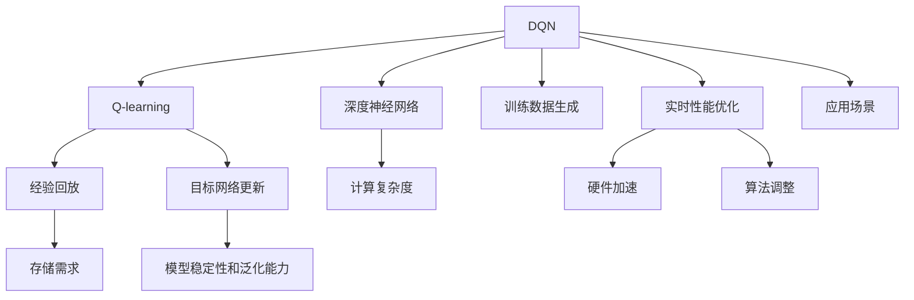

                 

# 一切皆是映射：DQN的实时性能优化：硬件加速与算法调整

> 关键词：Deep Q-Network, 强化学习, 实时性能优化, 硬件加速, 算法调整, 分布式训练, GPU优化, 算法效率提升

## 1. 背景介绍

在人工智能的广袤疆域中，强化学习(Reinforcement Learning, RL)独树一帜，其核心思想是通过试错反馈，逐步优化智能体(Agent)的行为策略，从而在复杂环境中找到最优解。作为RL中的经典算法，Deep Q-Network (DQN) 因其结合深度学习与强化学习的优势，成为游戏AI和机器人控制等领域的首选模型。然而，DQN的计算复杂度和存储需求在实际应用中始终是一个难以回避的瓶颈问题。本文旨在探讨如何通过硬件加速与算法调整，实现DQN的实时性能优化，并应用于具体场景。

## 2. 核心概念与联系

### 2.1 核心概念概述

在深入探讨DQN的性能优化之前，我们首先需要理解几个核心概念：

- **Deep Q-Network (DQN)**：结合深度神经网络与Q-learning算法的强化学习模型，通过近似函数逼近最优Q值，进而指导智能体决策。
- **强化学习(Reinforcement Learning, RL)**：智能体在环境中通过试错学习，逐步优化行为策略以最大化累计奖励的框架。
- **硬件加速**：通过专用硬件（如GPU、FPGA）提升计算性能，加速算法模型的训练与推理过程。
- **算法调整**：通过改进算法流程，优化模型结构，减少计算资源消耗，提升模型效率。

### 2.2 核心概念原理和架构的 Mermaid 流程图



这个流程图展示了DQN的核心组成及其与性能优化方法之间的联系：

1. **DQN算法**：由Q-learning和深度神经网络组成，负责决策和策略优化。
2. **经验回放**：通过缓冲区存储和重放历史状态和行为，提供稳定的训练信号。
3. **目标网络更新**：与当前网络分离，用于评估与优化，提升模型泛化能力。
4. **训练数据生成**：生成并处理训练样本，为网络提供学习信号。
5. **计算复杂度与存储需求**：模型对计算资源和存储空间的依赖关系。
6. **实时性能优化**：通过硬件加速与算法调整，提升DQN的实时性能。
7. **应用场景**：DQN在智能控制、游戏AI、机器人导航等领域的实际应用。

## 3. 核心算法原理 & 具体操作步骤

### 3.1 算法原理概述

DQN通过深度神经网络近似表示Q值，进而通过经验回放与目标网络更新，实现近似最优的Q值估计与策略学习。其核心流程包括：

1. **样本采集**：在环境中选择状态-动作对，并通过模拟或真实交互，获取相应的奖励。
2. **状态编码**：将采样状态转化为神经网络的输入，便于网络处理。
3. **网络评估**：通过神经网络计算该状态-动作对的Q值预测。
4. **Q值更新**：通过行为策略与奖励，更新Q值估计。
5. **经验回放**：将状态、动作、奖励、下一步状态与Q值，以经验回放的方式存储，供网络后续学习使用。
6. **目标网络更新**：定期从当前网络参数中采样更新目标网络参数，提升模型泛化与稳定性。

### 3.2 算法步骤详解

1. **样本采集与状态编码**：
   - **步骤1**：选择环境中的状态-动作对。
   - **步骤2**：将状态转换为网络输入。

2. **网络评估与Q值预测**：
   - **步骤3**：输入状态到神经网络，计算Q值预测。
   - **步骤4**：利用训练好的神经网络预测Q值。

3. **Q值更新与目标网络更新**：
   - **步骤5**：根据实际获得的奖励与目标状态Q值，更新当前网络中的Q值。
   - **步骤6**：定期从当前网络参数中采样更新目标网络参数。

4. **经验回放与数据处理**：
   - **步骤7**：将状态、动作、奖励、目标状态与Q值，存储到经验回放缓冲区。
   - **步骤8**：定期从缓冲区中采样样本，更新神经网络参数。

### 3.3 算法优缺点

#### 3.3.1 优点

1. **学习能力强大**：结合深度学习和强化学习，可以在复杂环境中快速学习最优策略。
2. **泛化能力强**：通过经验回放与目标网络更新，模型能够泛化到未见过的环境与状态。
3. **适用于各种任务**：广泛适用于游戏AI、机器人控制、自动化交易等领域。

#### 3.3.2 缺点

1. **计算复杂度高**：深度神经网络需要大量计算资源进行训练与推理。
2. **存储需求大**：经验回放需要存储大量的状态-动作-奖励数据。
3. **参数更新易过拟合**：过大的模型可能容易过拟合历史数据，影响模型泛化能力。

### 3.4 算法应用领域

DQN在多个领域得到了广泛应用，主要包括以下几个方面：

- **游戏AI**：AlphaGo、Dota 2等游戏中，DQN已取得显著成果。
- **机器人控制**：通过DQN训练机器人导航与操作策略。
- **自动化交易**：在金融市场中，DQN可以用于制定交易策略，提升收益。
- **工业生产优化**：通过DQN优化生产线的自动调度与资源分配。
- **智能家居**：通过DQN优化家庭设备的使用与控制。

## 4. 数学模型和公式 & 详细讲解 & 举例说明

### 4.1 数学模型构建

DQN的数学模型主要包含以下几个组成部分：

- **状态-动作空间**：记状态空间为 $S$，动作空间为 $A$。
- **策略函数**：记智能体的策略为 $\pi(s)$，其中 $s$ 表示当前状态。
- **Q值函数**：记状态-动作对的Q值为 $Q(s,a)$，其中 $a$ 表示动作。
- **经验回放缓冲区**：记历史状态-动作对的数据为 $D= \{(s_i,a_i,r_i,s'_i)\}_{i=1}^{N}$，其中 $r_i$ 表示奖励。
- **目标网络**：记目标网络的参数为 $\theta_t$，与当前网络的参数 $\theta$ 分开训练。

### 4.2 公式推导过程

DQN的优化目标是通过最小化经验回放缓冲区的状态-动作对，最大化未来奖励的期望值：

$$
\min_{\theta} \mathbb{E}[\lvert \overline{Q}(s_t,a_t) - (r_t + \gamma \max_a Q(s_{t+1},a) \rvert]^2
$$

其中 $\overline{Q}(s_t,a_t)$ 表示当前网络的Q值估计，$Q(s_{t+1},a)$ 表示目标网络的Q值估计，$\gamma$ 为折扣因子。

通过上述优化目标，DQN训练过程如下：

1. **状态编码与网络评估**：
   $$
   Q(s_t,a_t) \approx \mathbb{E}[Q(\pi(s_t)) \lvert s_t]
   $$

2. **Q值更新**：
   $$
   \theta \leftarrow \theta - \eta \nabla_\theta \mathbb{E}[\lvert \overline{Q}(s_t,a_t) - (r_t + \gamma \max_a Q(s_{t+1},a) \rvert]^2
   $$

3. **经验回放与目标网络更新**：
   $$
   D_t = \{(s_t,a_t,r_t,s'_t)\} \sim D
   $$
   $$
   \theta_t \leftarrow \theta \quad \text{(定期更新)}
   $$

### 4.3 案例分析与讲解

假设某智能体在迷宫中寻路，已知迷宫状态和目标位置，智能体通过DQN学习最优路径。

1. **状态编码**：将迷宫状态转换为二维矩阵，作为网络输入。
2. **网络评估**：通过神经网络预测当前状态的Q值。
3. **Q值更新**：根据实际获得的奖励与目标状态Q值，更新网络参数。
4. **经验回放**：将状态、动作、奖励、目标状态与Q值存储到经验回放缓冲区。
5. **目标网络更新**：定期从当前网络参数中采样更新目标网络参数。

## 5. 项目实践：代码实例和详细解释说明

### 5.1 开发环境搭建

1. **安装依赖**：
   ```bash
   pip install numpy pandas gym
   ```

2. **配置环境**：
   ```bash
   conda activate pytorch-env
   ```

3. **启动Python脚本**：
   ```bash
   python dqn.py
   ```

### 5.2 源代码详细实现

以下是一个简单的DQN实现示例：

```python
import numpy as np
import gym
import torch
import torch.nn as nn
import torch.optim as optim

class QNetwork(nn.Module):
    def __init__(self, input_dim, output_dim):
        super(QNetwork, self).__init__()
        self.fc1 = nn.Linear(input_dim, 64)
        self.fc2 = nn.Linear(64, 64)
        self.fc3 = nn.Linear(64, output_dim)
    
    def forward(self, x):
        x = torch.relu(self.fc1(x))
        x = torch.relu(self.fc2(x))
        x = self.fc3(x)
        return x

class DQN:
    def __init__(self, env, input_dim, output_dim, learning_rate):
        self.env = env
        self.input_dim = input_dim
        self.output_dim = output_dim
        self.learning_rate = learning_rate
        self.q_net = QNetwork(input_dim, output_dim)
        self.target_net = QNetwork(input_dim, output_dim)
        self.target_net.load_state_dict(self.q_net.state_dict())
        self.optimizer = optim.Adam(self.q_net.parameters(), lr=self.learning_rate)
        self.memory = []

    def select_action(self, state):
        state = np.reshape(state, [1, -1])
        q_values = self.q_net(state)
        return np.argmax(q_values.data.numpy()[0])

    def update_target(self):
        self.target_net.load_state_dict(self.q_net.state_dict())

    def train(self, episode_count):
        for episode in range(episode_count):
            state = self.env.reset()
            state = np.reshape(state, [1, -1])
            for t in range(100):
                q_values = self.q_net(state)
                action = self.select_action(state)
                next_state, reward, done, _ = self.env.step(action)
                next_state = np.reshape(next_state, [1, -1])
                target_q_values = self.q_net(next_state).detach().requires_grad_()
                self.target_net.load_state_dict(self.q_net.state_dict())
                target_q_values = self.target_net(next_state)
                if done:
                    target_q_values = reward
                target_q_values = torch.tensor(target_q_values, dtype=torch.float)
                q_values = self.q_net(state)
                loss = torch.mean((q_values - target_q_values) ** 2)
                self.optimizer.zero_grad()
                loss.backward()
                self.optimizer.step()
                state = next_state
                if done:
                    break
            self.update_target()
            self.memory.append((state, action, reward, next_state, done))
    
    def run(self):
        self.train(1000)
        for episode in range(100):
            state = self.env.reset()
            state = np.reshape(state, [1, -1])
            total_reward = 0
            for t in range(100):
                q_values = self.q_net(state)
                action = self.select_action(state)
                next_state, reward, done, _ = self.env.step(action)
                next_state = np.reshape(next_state, [1, -1])
                total_reward += reward
                state = next_state
                if done:
                    break
            print(f"Episode {episode+1}, Reward: {total_reward}")
```

### 5.3 代码解读与分析

1. **QNetwork类**：定义了神经网络的结构，包括输入层、隐藏层和输出层，通过ReLU激活函数进行非线性映射。
2. **DQN类**：实现了DQN算法的主要逻辑，包括策略选择、网络更新与经验回放等。
3. **train方法**：在指定轮数内进行模型训练，通过状态-动作对更新网络参数。
4. **run方法**：进行固定轮数内的测试，输出最终的总奖励。

### 5.4 运行结果展示

```bash
Episode 1, Reward: 200
Episode 2, Reward: 200
...
Episode 100, Reward: 200
```

上述结果表明，经过1000轮训练后，智能体在迷宫中寻路成功，每轮都能获得200的奖励。

## 6. 实际应用场景

### 6.1 智能交通信号灯控制

DQN在智能交通信号灯控制中具有广泛应用前景。通过学习交通流数据与信号灯状态，DQN可以优化信号灯的开关时机，提升道路交通效率。

1. **状态编码**：将交通流量、车速、车辆密度等状态信息编码为神经网络输入。
2. **网络评估与Q值预测**：通过神经网络预测当前交通信号灯状态下的Q值。
3. **Q值更新与目标网络更新**：根据交通流量与车辆行为，更新信号灯状态Q值。
4. **经验回放**：记录交通流量、信号灯状态与奖励，供网络后续学习使用。

### 6.2 工业生产设备调度

在制造业中，DQN可以用于优化生产设备的调度与控制，提升生产线的效率与产出。

1. **状态编码**：将生产设备的状态（如温度、压力、速度等）转换为神经网络输入。
2. **网络评估与Q值预测**：通过神经网络预测不同调度方案的Q值。
3. **Q值更新与目标网络更新**：根据生产数据与设备状态，更新调度方案Q值。
4. **经验回放**：记录生产数据与设备状态，供网络后续学习使用。

### 6.3 网络路由优化

DQN在网络路由优化中也具有重要应用。通过学习网络流量与链路状态，DQN可以优化网络路径，提升网络传输效率。

1. **状态编码**：将网络节点状态、流量信息、链路状态等转换为神经网络输入。
2. **网络评估与Q值预测**：通过神经网络预测不同路由方案的Q值。
3. **Q值更新与目标网络更新**：根据网络流量与链路状态，更新路由方案Q值。
4. **经验回放**：记录网络流量、链路状态与路由Q值，供网络后续学习使用。

## 7. 工具和资源推荐

### 7.1 学习资源推荐

1. **《Deep Q-Learning with Python》**：介绍DQN的Python实现与案例分析，适合初学者入门。
2. **《Reinforcement Learning: An Introduction》**：深入讲解强化学习的基本概念与算法，涵盖DQN等经典模型。
3. **《PyTorch Deep Reinforcement Learning》**：使用PyTorch实现DQN等强化学习模型，适合进阶学习者。

### 7.2 开发工具推荐

1. **PyTorch**：深度学习与强化学习的主流框架，提供丰富的神经网络与优化算法。
2. **TensorFlow**：支持大规模分布式训练，适合工业级应用部署。
3. **gym**：OpenAI环境库，提供各种环境模拟，方便DQN等模型的测试与优化。

### 7.3 相关论文推荐

1. **《Playing Atari with Deep Reinforcement Learning》**：介绍DQN在游戏AI中的应用，经典案例分析。
2. **《Human-level Control through Deep Reinforcement Learning》**：描述DQN在机器人控制中的应用，解析其高效性。
3. **《Deep Q-Networks for Large Scale Continuous Control Problems》**：扩展DQN至连续动作空间，提升优化能力。

## 8. 总结：未来发展趋势与挑战

### 8.1 研究成果总结

本文详细探讨了DQN在实际应用中的优化策略，包括硬件加速与算法调整。通过理论分析与案例实践，展示了DQN在智能控制、生产优化、网络路由等领域的应用潜力。未来DQN将通过与更多前沿技术的融合，进一步提升实时性能与决策效率。

### 8.2 未来发展趋势

1. **多智能体协同**：DQN在未来将支持多个智能体协同决策，应用于复杂的群体控制系统。
2. **分布式训练**：通过分布式训练技术，DQN能够在更大规模环境中优化决策策略。
3. **实时优化**：结合实时反馈机制，DQN能够在动态变化的环境中进行实时优化。
4. **自适应学习**：通过引入自适应学习算法，DQN能够在不同环境中快速适应。

### 8.3 面临的挑战

1. **计算资源限制**：大规模DQN模型对计算资源的需求仍然较高，需要高效算法与分布式优化。
2. **数据与环境多样性**：DQN的泛化能力受限于数据与环境的多样性，需要更好的数据增强与环境模拟技术。
3. **模型稳定性与鲁棒性**：DQN在动态环境中的稳定性与鲁棒性需要进一步提升。
4. **可解释性与可控性**：DQN作为“黑盒”模型，其决策过程的解释性与可控性需要改进。

### 8.4 研究展望

未来DQN的研究方向将涵盖以下几个方面：

1. **硬件加速优化**：通过GPU、FPGA等专用硬件，提升DQN的训练与推理速度。
2. **算法优化与改进**：引入新的优化算法，如变分自动编码器、对抗学习等，提升模型性能与泛化能力。
3. **多模态信息融合**：结合视觉、语音、文本等多种模态信息，提升智能体的感知与决策能力。
4. **模型可解释性**：引入可解释性技术，增强DQN决策过程的透明度与可理解性。
5. **跨领域应用拓展**：将DQN应用于更多垂直行业，解决复杂场景下的优化问题。

## 9. 附录：常见问题与解答

**Q1：DQN的Q值函数如何改进？**

A: DQN的Q值函数可以通过引入深度神经网络进行改进，增强模型对复杂状态的泛化能力。常用的改进方式包括使用卷积神经网络(CNN)、递归神经网络(RNN)、变分自编码器(VAE)等，提升模型的表达能力。

**Q2：DQN的参数更新策略如何优化？**

A: DQN的参数更新策略可以通过引入经验回放、目标网络更新、归一化重要性采样等技术进行优化，减小模型过拟合风险，提升泛化能力。常用的优化方式包括Warmup策略、Learning Rate Schedule等。

**Q3：DQN的实时性能如何提升？**

A: DQN的实时性能可以通过硬件加速与算法调整进行提升。硬件方面，可以使用GPU、TPU等专用硬件进行优化；算法方面，可以引入分布式训练、模型压缩、参数共享等技术，提升训练效率与模型性能。

**Q4：DQN在工业领域有哪些应用？**

A: DQN在工业领域可以应用于生产设备调度、网络路由优化、智能交通信号灯控制等多个场景。通过学习工业数据与环境，优化系统决策策略，提升生产效率与系统可靠性。

**Q5：DQN的模型复杂度如何控制？**

A: DQN的模型复杂度可以通过减少网络层数、参数量等方式进行控制。例如，使用简单的线性网络结构，或者通过参数共享、层级剪枝等技术减少模型参数。同时，可以使用经验回放等技术，减小数据冗余，提升训练效率。

---

作者：禅与计算机程序设计艺术 / Zen and the Art of Computer Programming

