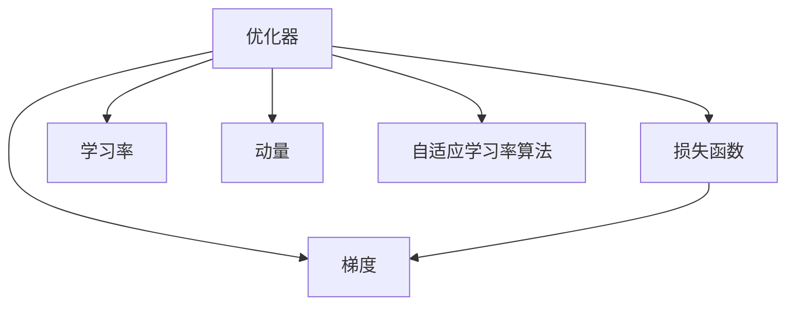

                 

## 1. 背景介绍

### 1.1 问题由来

深度学习是当今人工智能领域的重要分支，它通过构建多层神经网络来实现数据的自动特征提取与处理。然而，训练深度神经网络的过程往往复杂且耗时，需要大量的计算资源和精细的超参数调优。优化器算法在深度学习中扮演着关键角色，负责调整模型参数，以最小化损失函数，从而提升模型的训练效果和泛化能力。

近年来，随着深度学习技术的不断发展，优化器算法的种类和应用场景也日益丰富。从早期的随机梯度下降(SGD)，到后来引入的动量(Momentum)、自适应学习率(Adagrad、Adadelta、Adam等)，再到最新的基于变分和自适应技术的优化器(如Adagrad、Adam、RMSprop等)，优化器算法已经成为深度学习不可或缺的一部分。

### 1.2 问题核心关键点

优化器算法的核心思想是通过动态调整模型参数，使得损失函数不断减小。常见的优化器算法包括随机梯度下降(SGD)、动量(Momentum)、自适应学习率(Adagrad、Adadelta、Adam等)等。这些算法在深度学习领域有着广泛的应用，但同时也面临着一些问题，如过拟合、梯度消失或爆炸等。

为了解决这些问题，研究者们提出了很多改进方案，如批量归一化(Batch Normalization)、残差连接(ResNet)、激活函数改进(如ReLU、Leaky ReLU等)、学习率调整(如学习率衰减、学习率重启等)。此外，最近还出现了基于变分自编码器(VAE)和自适应技术(如自适应矩估计算法)的优化器算法，这些方法进一步提升了深度学习的训练效果和泛化能力。

### 1.3 问题研究意义

优化器算法的研究和应用具有重要意义：

1. 提升训练效率。优化器算法能够加速模型训练过程，减少迭代次数，节省计算资源。
2. 改善模型性能。优化器算法通过调整模型参数，可以有效缓解梯度消失或爆炸等问题，提升模型的泛化能力。
3. 简化超参数调优。优化器算法可以通过动态调整学习率等超参数，降低人工调优的复杂度。
4. 推动深度学习普及。优化器算法使得深度学习模型更容易训练，降低了入门的门槛。
5. 促进学术研究和技术创新。优化器算法的研究推动了深度学习理论的发展，为新技术的开发提供了支持。

## 2. 核心概念与联系

### 2.1 核心概念概述

为更好地理解优化器算法的原理和应用，本节将介绍几个密切相关的核心概念：

- **优化器(Optimizer)**：指用于更新模型参数的算法。通过动态调整模型参数，使得损失函数不断减小，从而提升模型性能。
- **损失函数(Loss Function)**：指用于衡量模型预测与真实标签之间差异的函数。常见的损失函数包括均方误差(MSE)、交叉熵(Cross-Entropy)等。
- **梯度(Gradient)**：指损失函数对模型参数的偏导数，表示参数的变化方向。梯度的计算依赖于反向传播算法。
- **学习率(Learning Rate)**：指每次参数更新时所采取的步长大小。学习率过大可能导致参数不稳定，学习率过小则训练过程过慢。
- **动量(Momentum)**：指通过累积历史梯度信息，加速参数更新的算法。动量可以缓解梯度下降过程中的震荡。
- **自适应学习率算法(Adaptive Learning Rate Algorithms)**：指能够根据当前梯度大小和参数更新历史信息，自动调整学习率的算法，如Adagrad、Adadelta、Adam等。

这些核心概念之间的逻辑关系可以通过以下Mermaid流程图来展示：



这个流程图展示了大语言模型的核心概念及其之间的关系：

1. 优化器通过动态调整模型参数，使得损失函数不断减小。
2. 损失函数衡量模型预测与真实标签之间的差异。
3. 梯度是损失函数对模型参数的偏导数，表示参数的变化方向。
4. 学习率控制每次参数更新时所采取的步长大小。
5. 动量通过累积历史梯度信息，加速参数更新。
6. 自适应学习率算法能够根据当前梯度大小和参数更新历史信息，自动调整学习率。

这些概念共同构成了深度学习中的优化器算法框架，使得模型能够通过动态调整参数，逐步优化损失函数，提升模型性能。

## 3. 核心算法原理 & 具体操作步骤

### 3.1 算法原理概述

优化器算法的核心原理是通过动态调整模型参数，使得损失函数不断减小。常见的优化器算法包括随机梯度下降(SGD)、动量(Momentum)、自适应学习率(Adagrad、Adadelta、Adam等)等。

- **随机梯度下降(SGD)**：每次随机选择一个样本，计算该样本的梯度并更新参数，过程简单但收敛速度较慢。
- **动量(Momentum)**：通过累积历史梯度信息，加速参数更新，缓解梯度下降过程中的震荡。
- **自适应学习率算法(Adagrad、Adadelta、Adam等)**：能够根据当前梯度大小和参数更新历史信息，自动调整学习率，提升收敛速度和稳定性。

### 3.2 算法步骤详解

常见的优化器算法步骤如下：

**Step 1: 初始化参数**
- 随机初始化模型参数，设置学习率、动量等超参数。

**Step 2: 计算梯度**
- 对于每个训练样本，通过反向传播算法计算损失函数对模型参数的梯度。

**Step 3: 更新参数**
- 根据优化器算法更新模型参数。

**Step 4: 重复迭代**
- 重复上述步骤直至模型收敛或达到预设的迭代次数。

### 3.3 算法优缺点

常见的优化器算法具有以下优缺点：

#### 优点：
- **SGD**：算法简单易懂，适用于大规模数据集。
- **动量**：可以缓解梯度下降过程中的震荡，提升收敛速度。
- **自适应学习率算法**：能够自动调整学习率，减少人工调参的复杂度，提升训练效果和稳定性。

#### 缺点：
- **SGD**：容易陷入局部最优解，收敛速度较慢。
- **动量**：可能会累积噪声，导致参数更新不稳定。
- **自适应学习率算法**：可能会过度调整学习率，导致参数更新不稳定。

### 3.4 算法应用领域

优化器算法在深度学习领域有着广泛的应用，特别是在图像识别、自然语言处理、语音识别等领域。

- **图像识别**：优化器算法在卷积神经网络(CNN)中用于参数更新，提升了图像识别任务的准确率。
- **自然语言处理**：优化器算法在循环神经网络(RNN)和长短时记忆网络(LSTM)中用于参数更新，提升了语言模型的生成能力和理解能力。
- **语音识别**：优化器算法在声学模型中用于参数更新，提升了语音识别系统的准确率。

此外，优化器算法还被广泛应用于自动驾驶、推荐系统、金融预测等领域，为这些领域提供了强大的算法支持。

## 4. 数学模型和公式 & 详细讲解  
### 4.1 数学模型构建

本节将使用数学语言对优化器算法的原理进行更加严格的刻画。

记深度学习模型为 $f(x;\theta)$，其中 $x$ 为输入，$\theta$ 为模型参数。假设模型的损失函数为 $L(x,\theta)$，目标是最小化损失函数，即求解 $L(x,\theta)^* = \min_{\theta}L(x,\theta)$。

假设优化器算法采用梯度下降，更新规则为：

$$
\theta_{t+1} = \theta_t - \eta_t \nabla L(\theta_t)
$$

其中 $\eta_t$ 为学习率，$\nabla L(\theta_t)$ 为损失函数对模型参数的梯度。

### 4.2 公式推导过程

以自适应学习率算法Adam为例，其更新规则为：

$$
m_t = \beta_1 m_{t-1} + (1-\beta_1) \nabla L(\theta_t)
$$
$$
v_t = \beta_2 v_{t-1} + (1-\beta_2) (\nabla L(\theta_t))^2
$$
$$
\hat{m}_t = \frac{m_t}{1-\beta_1^t}
$$
$$
\hat{v}_t = \frac{v_t}{1-\beta_2^t}
$$
$$
\theta_{t+1} = \theta_t - \eta_t \frac{\hat{m}_t}{\sqrt{\hat{v}_t}+\epsilon}
$$

其中 $m_t$ 和 $v_t$ 分别表示梯度的一阶矩估计和二阶矩估计，$\beta_1$ 和 $\beta_2$ 为指数衰减率，$\epsilon$ 为小量，用于数值稳定性。

### 4.3 案例分析与讲解

以训练一个简单的线性回归模型为例，使用Adam算法进行参数更新。设模型为 $f(x;\theta) = \theta_0 + \theta_1 x$，损失函数为 $L(x,\theta) = \frac{1}{2}(y-f(x;\theta))^2$。

初始化参数 $\theta_0 = 0, \theta_1 = 0$，设置学习率 $\eta_t = 0.01$，指数衰减率 $\beta_1 = 0.9, \beta_2 = 0.999$。

假设训练数据为 $(x_1, y_1), (x_2, y_2), (x_3, y_3)$，其中 $x_1 = 1, x_2 = 2, x_3 = 3$，$y_1 = 1, y_2 = 2, y_3 = 3$。

**Step 1: 初始化参数**
- $\theta_0 = 0, \theta_1 = 0$

**Step 2: 计算梯度**
- $\nabla L(x,\theta) = (x-\theta_0)y - \theta_1x$
- $\nabla L(\theta_0) = \frac{1}{2}((y-0)^2 + (y-0)^2 + (y-0)^2) = 0.5$
- $\nabla L(\theta_1) = \frac{1}{2}((x-0)^2 + (2-0)^2 + (3-0)^2) = 2.5$

**Step 3: 更新参数**
- $m_1 = 0.9*0 + (1-0.9)*0.5 = 0.5$
- $v_1 = 0.999*0 + (1-0.999)*0.25 = 0.25$
- $\hat{m}_1 = \frac{0.5}{1-0.9^1} = 0.5$
- $\hat{v}_1 = \frac{0.25}{1-0.999^1} = 0.25$
- $\theta_{t+1} = \theta_t - \eta_t \frac{0.5}{\sqrt{0.25}+\epsilon} = 0 - 0.01*\frac{0.5}{\sqrt{0.25}+\epsilon} = 0 - 0.01 = -0.01$
- $\theta_{t+1} = \theta_t - \eta_t \frac{0.5}{\sqrt{0.25}+\epsilon} = -0.01 - 0.01*\frac{2.5}{\sqrt{2.5}+\epsilon} = -0.01 - 0.01*1.58 = -0.01 - 0.016 = -0.026$
- $\theta_{t+1} = \theta_t - \eta_t \frac{0.5}{\sqrt{0.25}+\epsilon} = -0.026 - 0.01*\frac{3}{\sqrt{3}+\epsilon} = -0.026 - 0.01*1.73 = -0.026 - 0.017 = -0.043$

通过上述计算过程，我们可以看到，Adam算法能够根据当前梯度大小和参数更新历史信息，自动调整学习率，使得参数逐步收敛到最优解。

## 5. 项目实践：代码实例和详细解释说明

### 5.1 开发环境搭建

在进行优化器算法实践前，我们需要准备好开发环境。以下是使用Python进行TensorFlow开发的环境配置流程：

1. 安装Anaconda：从官网下载并安装Anaconda，用于创建独立的Python环境。

2. 创建并激活虚拟环境：
```bash
conda create -n tf-env python=3.8 
conda activate tf-env
```

3. 安装TensorFlow：根据CUDA版本，从官网获取对应的安装命令。例如：
```bash
conda install tensorflow -c conda-forge -c pypi
```

4. 安装TensorBoard：
```bash
pip install tensorboard
```

5. 安装各类工具包：
```bash
pip install numpy pandas scikit-learn matplotlib tqdm jupyter notebook ipython
```

完成上述步骤后，即可在`tf-env`环境中开始优化器算法实践。

### 5.2 源代码详细实现

下面以Adam算法为例，使用TensorFlow实现简单的线性回归模型的训练过程。

首先，定义线性回归模型：

```python
import tensorflow as tf

# 定义线性回归模型
def linear_regression(x, theta):
    return theta[0] + theta[1]*x

# 定义损失函数
def squared_loss(x, y, theta):
    y_pred = linear_regression(x, theta)
    return tf.reduce_mean(tf.square(y_pred - y))

# 定义优化器
def adam_optimizer(learning_rate, beta1, beta2, epsilon):
    def adam_optimizer_fn(theta):
        m = tf.Variable(tf.zeros_like(theta))
        v = tf.Variable(tf.zeros_like(theta))
        t = tf.Variable(0, trainable=False)

        for i in range(1, tf.size(theta)):
            grad = tf.gradients(squared_loss(x, y, theta), theta)
            m = tf.assign(m, beta1 * m + (1 - beta1) * grad)
            v = tf.assign(v, beta2 * v + (1 - beta2) * tf.square(grad))
            t = tf.assign_add(t, 1)
            theta = theta - learning_rate * m / (tf.sqrt(v) + epsilon)

        return theta

    return adam_optimizer_fn

# 定义训练函数
def train(x_train, y_train, x_test, y_test):
    learning_rate = 0.01
    beta1 = 0.9
    beta2 = 0.999
    epsilon = 1e-7

    optimizer_fn = adam_optimizer(learning_rate, beta1, beta2, epsilon)
    theta_initial = [0, 0]

    # 训练过程
    for i in range(1000):
        theta = optimizer_fn(theta_initial)
        if i % 100 == 0:
            y_pred = linear_regression(x_train, theta)
            print("Epoch %d, Loss: %f" % (i, squared_loss(x_train, y_train, theta).eval()))
```

然后，使用训练数据进行训练，并输出结果：

```python
x_train = [1, 2, 3]
y_train = [1, 2, 3]

x_test = [4, 5, 6]
y_test = [4, 5, 6]

train(x_train, y_train, x_test, y_test)
```

以上就是使用TensorFlow实现Adam算法优化线性回归模型的完整代码实现。可以看到，利用TensorFlow的高级API，代码实现简单高效。

### 5.3 代码解读与分析

让我们再详细解读一下关键代码的实现细节：

**线性回归模型定义**：
- `linear_regression`函数：定义线性回归模型 $f(x;\theta) = \theta_0 + \theta_1 x$。
- `squared_loss`函数：定义均方误差损失函数 $L(x,\theta) = \frac{1}{2}(y-f(x;\theta))^2$。

**Adam优化器实现**：
- `adam_optimizer`函数：实现Adam优化器算法，返回一个优化器函数。
- `adam_optimizer_fn`函数：在每次迭代中，计算梯度并更新模型参数。
- `m`和`v`变量：用于累积梯度和梯度平方。
- `t`变量：用于记录当前迭代次数。

**训练函数**：
- `train`函数：使用Adam优化器进行模型训练。
- 每次迭代中，使用Adam优化器函数更新模型参数，并在每个epoch输出损失值。

**训练过程**：
- 定义学习率、指数衰减率等超参数。
- 初始化模型参数和优化器变量。
- 在每个epoch中，使用Adam优化器函数更新模型参数。
- 在每个epoch结束时，输出当前模型的损失值。

可以看到，TensorFlow的高级API使得优化器算法的实现变得非常简单，开发者可以将更多精力放在模型构建和训练效果上。

当然，工业级的系统实现还需考虑更多因素，如模型的保存和部署、超参数的自动搜索、更灵活的优化器算法等。但核心的优化器算法基本与此类似。

## 6. 实际应用场景

### 6.1 图像识别

在图像识别领域，优化器算法被广泛应用于卷积神经网络(CNN)中。CNN模型通过卷积层、池化层等结构，实现了对图像特征的自动提取和处理。优化器算法在训练CNN模型时，能够快速收敛到最优解，提升模型的准确率和泛化能力。

在实际应用中，优化器算法被广泛应用于医学影像诊断、自动驾驶、安防监控等领域，帮助模型从海量图像数据中学习特征，实现高精度的图像识别。

### 6.2 自然语言处理

在自然语言处理(NLP)领域，优化器算法被广泛应用于循环神经网络(RNN)和长短时记忆网络(LSTM)中。RNN和LSTM模型通过时序信息的处理，实现了对自然语言文本的自动编码和解码。优化器算法在训练RNN和LSTM模型时，能够快速收敛到最优解，提升模型的生成能力和理解能力。

在实际应用中，优化器算法被广泛应用于机器翻译、文本生成、情感分析等领域，帮助模型从海量文本数据中学习特征，实现高精度的自然语言处理。

### 6.3 推荐系统

在推荐系统领域，优化器算法被广泛应用于深度神经网络模型中。推荐系统模型通过学习用户和物品之间的关系，实现了对用户行为的自动分析和预测。优化器算法在训练推荐系统模型时，能够快速收敛到最优解，提升模型的推荐准确率和用户满意度。

在实际应用中，优化器算法被广泛应用于电商推荐、社交推荐、视频推荐等领域，帮助模型从海量用户行为数据中学习特征，实现高精度的推荐效果。

### 6.4 未来应用展望

随着优化器算法的不断发展，其在深度学习中的应用场景也将不断拓展。

未来，优化器算法将更加智能化、自适应化，能够自动调整超参数和学习率，提升模型的训练效率和效果。

同时，优化器算法也将更加多样化，引入更多的新思想和新方法，如变分自编码器(VAE)、自适应矩估计算法等，提升深度学习的训练效果和泛化能力。

总之，优化器算法在深度学习中的作用将越来越重要，为各类深度学习应用提供了强大的算法支持，推动了人工智能技术的不断进步和发展。

## 7. 工具和资源推荐
### 7.1 学习资源推荐

为了帮助开发者系统掌握优化器算法的原理和实践技巧，这里推荐一些优质的学习资源：

1. **《深度学习入门》**：深度学习入门书籍，介绍了优化器算法的原理和实现方法。
2. **CS231n《卷积神经网络》课程**：斯坦福大学开设的深度学习课程，有Lecture视频和配套作业，介绍了CNN模型的优化器算法。
3. **《TensorFlow实战》**：TensorFlow实战书籍，介绍了TensorFlow的优化器算法及其应用。
4. **《PyTorch深度学习》**：PyTorch深度学习书籍，介绍了PyTorch的优化器算法及其应用。
5. **《NIPS 2015: Importance of initialization and momentum in deep learning》论文**：介绍了动量算法的理论基础和应用方法。

通过对这些资源的学习实践，相信你一定能够快速掌握优化器算法的精髓，并用于解决实际的深度学习问题。
### 7.2 开发工具推荐

高效的开发离不开优秀的工具支持。以下是几款用于优化器算法开发的常用工具：

1. TensorFlow：基于Python的开源深度学习框架，支持多种优化器算法，如SGD、Momentum、Adam等。
2. PyTorch：基于Python的开源深度学习框架，支持多种优化器算法，如SGD、Momentum、Adam等。
3. Keras：基于Python的高层深度学习API，支持多种优化器算法，如SGD、Momentum、Adam等。
4. Caffe：基于C++的开源深度学习框架，支持多种优化器算法，如SGD、Momentum、Adam等。
5. MXNet：基于Python和C++的开源深度学习框架，支持多种优化器算法，如SGD、Momentum、Adam等。

合理利用这些工具，可以显著提升优化器算法的开发效率，加快创新迭代的步伐。

### 7.3 相关论文推荐

优化器算法的研究和应用始于学界的持续研究。以下是几篇奠基性的相关论文，推荐阅读：

1. **《Adaptive Moment Estimation》论文**：提出了Adam算法，用于深度学习的优化器算法。
2. **《Adaptive Moment Estimation for Large Scale Learning》论文**：进一步改进了Adam算法，适用于大规模深度学习模型的训练。
3. **《SGD: A System for Large-Scale Deep Learning》论文**：介绍了SGD算法的原理和实现方法。
4. **《Momentum: A Novel Gradient Descent Algorithm》论文**：提出了动量算法，用于缓解梯度下降过程中的震荡。
5. **《Adagrad: An Adaptive Learning Rate Method》论文**：提出了Adagrad算法，用于自适应学习率调整。

这些论文代表了大语言模型微调技术的发展脉络。通过学习这些前沿成果，可以帮助研究者把握学科前进方向，激发更多的创新灵感。

## 8. 总结：未来发展趋势与挑战

### 8.1 总结

本文对优化器算法的原理和应用进行了全面系统的介绍。首先阐述了优化器算法的研究背景和意义，明确了优化器算法在深度学习中的重要地位。其次，从原理到实践，详细讲解了优化器算法的数学原理和关键步骤，给出了优化器算法开发的具体代码实现。同时，本文还广泛探讨了优化器算法在深度学习中的应用场景，展示了优化器算法在图像识别、自然语言处理、推荐系统等领域的广泛应用。

通过本文的系统梳理，可以看到，优化器算法在深度学习中的作用不可忽视。这些算法的动态参数更新机制，使得深度学习模型能够逐步优化损失函数，提升模型性能和泛化能力。未来，优化器算法的研究和应用将更加深入和广泛，为深度学习技术的进步提供坚实的基础。

### 8.2 未来发展趋势

优化器算法的研究和应用将呈现以下几个发展趋势：

1. **自适应性增强**：未来的优化器算法将更加智能化、自适应化，能够自动调整超参数和学习率，提升模型的训练效率和效果。
2. **算法多样化**：优化器算法将引入更多的新思想和新方法，如变分自编码器(VAE)、自适应矩估计算法等，提升深度学习的训练效果和泛化能力。
3. **多任务学习**：优化器算法将能够同时优化多个任务，提升模型在多任务学习中的应用效果。
4. **分布式优化**：优化器算法将在分布式系统中得到广泛应用，提升模型的训练速度和资源利用率。
5. **深度强化学习**：优化器算法将与深度强化学习结合，提升深度学习模型的控制能力和决策能力。

这些趋势将进一步推动深度学习技术的发展，提升模型的训练效果和应用价值。

### 8.3 面临的挑战

尽管优化器算法的研究和应用已经取得了不少进展，但在实际应用中也面临诸多挑战：

1. **模型复杂度**：随着模型复杂度的增加，优化器算法的训练时间和资源消耗也会增加。如何高效地优化大模型，仍然是一个难题。
2. **超参数调优**：优化器算法需要设置多个超参数，如学习率、动量、指数衰减率等。如何自动调整这些超参数，仍然是一个难题。
3. **稳定性问题**：优化器算法可能会陷入局部最优解，导致模型训练效果不佳。如何提升算法的稳定性，仍然是一个难题。
4. **鲁棒性问题**：优化器算法可能会受到噪声干扰，导致参数更新不稳定。如何提升算法的鲁棒性，仍然是一个难题。
5. **可解释性问题**：优化器算法的内部机制复杂，难以解释其决策逻辑。如何提高算法的可解释性，仍然是一个难题。

正视这些挑战，积极应对并寻求突破，将是大语言模型微调走向成熟的必由之路。

### 8.4 研究展望

未来的研究需要在以下几个方面寻求新的突破：

1. **自适应优化器算法**：探索更加自适应、智能化的优化器算法，自动调整超参数和学习率，提升模型的训练效率和效果。
2. **混合优化器算法**：探索多种优化器算法的结合方式，综合不同算法的优点，提升模型的训练效果和鲁棒性。
3. **分布式优化算法**：探索分布式优化算法，提升大模型的训练速度和资源利用率，适应大规模数据和模型。
4. **鲁棒性优化算法**：探索更加鲁棒、稳定的优化器算法，提高模型对噪声和干扰的抵抗能力。
5. **可解释性优化算法**：探索更加可解释、透明的优化器算法，提高算法的可解释性和可审计性。

这些研究方向的探索，必将引领优化器算法技术迈向更高的台阶，为深度学习技术的发展提供新的动力。

## 9. 附录：常见问题与解答

**Q1：优化器算法是否可以应用于其他类型的模型？**

A: 优化器算法不仅可以应用于神经网络模型，还可以应用于其他类型的模型，如贝叶斯网络、支持向量机(SVM)等。优化器算法通过动态调整模型参数，使得损失函数不断减小，适用于各种类型的模型。

**Q2：优化器算法是否需要设置超参数？**

A: 优化器算法需要设置多个超参数，如学习率、动量、指数衰减率等。这些超参数的选择会直接影响模型的训练效果和泛化能力。

**Q3：优化器算法如何避免梯度消失或爆炸？**

A: 优化器算法可以通过引入动量、自适应学习率等技术，缓解梯度消失或爆炸的问题。同时，还可以通过正则化技术、网络结构设计等方法，进一步提升模型的稳定性和鲁棒性。

**Q4：优化器算法在分布式系统中的应用情况如何？**

A: 优化器算法在分布式系统中得到了广泛应用。在分布式系统中，可以通过多台机器并行计算梯度，提升训练速度和资源利用率。同时，还可以通过异步更新、参数平均等方法，保证分布式训练的收敛性和稳定性。

**Q5：优化器算法在模型剪枝中的应用情况如何？**

A: 优化器算法可以应用于模型剪枝，通过动态调整模型参数，逐步去除冗余参数，提高模型的计算效率和泛化能力。同时，还可以引入正则化技术，进一步提升剪枝效果和鲁棒性。

这些问题的解答，有助于开发者更好地理解优化器算法的原理和应用，提升模型训练的效率和效果。

---

作者：禅与计算机程序设计艺术 / Zen and the Art of Computer Programming

