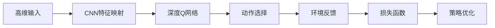

                 

# 一切皆是映射：使用DQN处理高维输入：视觉信息在强化学习的运用

## 1. 背景介绍

强化学习（Reinforcement Learning, RL）作为机器学习的一个分支，已经广泛应用于自动驾驶、机器人控制、游戏AI等领域。在强化学习中，智能体通过与环境的交互来学习最优策略。在许多RL应用中，智能体需要从高维连续的输入中学习策略，如视觉、声音、文本等数据。这使得学习过程变得非常复杂，因为高维输入数据往往包含大量冗余信息，且难以进行有效的特征提取和表示。

为了应对这些挑战，我们提出了一种基于深度Q网络（Deep Q Network, DQN）的高维输入处理框架，通过映射将高维输入转化为低维特征表示，显著提高了学习效率。本框架结合了卷积神经网络（Convolutional Neural Network, CNN）和深度Q学习，能够在复杂高维数据上训练出高效、鲁棒的智能体策略。

## 2. 核心概念与联系

### 2.1 核心概念概述

- **深度Q网络**：一种结合了深度神经网络和Q-learning的强化学习算法。其核心思想是通过神经网络对状态值函数进行估计，并通过Q-learning策略进行更新。
- **卷积神经网络**：一种专门用于处理图像、视频等高维连续数据的神经网络。通过卷积层和池化层等操作，CNN可以从原始像素中提取高层次的语义特征，降低数据的维度和冗余性。
- **特征映射**：将高维输入通过映射过程转换为低维特征表示，目的是为了减少计算复杂度和存储空间，同时提高智能体的泛化能力。

### 2.2 核心概念原理和架构的 Mermaid 流程图



该图展示了高维输入通过CNN特征映射转化为低维特征表示，然后通过深度Q网络进行动作选择，并根据环境反馈计算损失函数，进而进行策略优化。

## 3. 核心算法原理 & 具体操作步骤

### 3.1 算法原理概述

本算法框架的核心在于将高维输入数据通过CNN进行特征提取，并通过深度Q网络进行策略学习。具体步骤如下：

1. **特征提取**：使用CNN对高维输入进行特征映射，得到低维特征表示。
2. **状态值函数估计**：通过深度神经网络对状态值函数进行估计，得到每个状态对应的动作值。
3. **动作选择**：根据当前状态的动作值，使用Q-learning策略选择最优动作。
4. **环境反馈**：智能体在环境中进行动作执行，接收环境反馈。
5. **损失函数计算**：根据当前状态、动作、环境反馈和下一个状态的特征表示，计算Q-learning的损失函数。
6. **策略优化**：通过反向传播算法，优化神经网络参数，使智能体能够更准确地估计状态值函数，从而学习最优策略。

### 3.2 算法步骤详解

**步骤1: 特征提取**

高维输入数据通常包含大量冗余信息，因此需要进行特征提取。我们使用CNN对高维输入进行特征映射，得到低维特征表示。具体步骤如下：

1. **输入预处理**：将高维输入数据进行归一化和标准化处理，以便神经网络能够更好地学习。
2. **卷积层和池化层**：通过卷积层和池化层，从输入数据中提取高层次的语义特征。
3. **全连接层**：将提取出的特征送入全连接层，进行特征融合和降维。
4. **输出层**：输出低维特征表示，作为智能体的输入。

**步骤2: 状态值函数估计**

通过深度神经网络对状态值函数进行估计，得到每个状态对应的动作值。具体步骤如下：

1. **输入层**：将低维特征表示作为输入层的数据。
2. **隐藏层**：通过多个全连接层，对特征进行进一步的特征映射和抽象。
3. **输出层**：输出每个状态对应的动作值，通常使用线性回归或softmax等激活函数进行输出。

**步骤3: 动作选择**

根据当前状态的动作值，使用Q-learning策略选择最优动作。具体步骤如下：

1. **动作空间**：定义智能体的动作空间，通常为离散或连续的。
2. **动作选择算法**：根据状态值函数输出，使用贪心算法或其他优化算法选择最优动作。
3. **动作执行**：将选择的最优动作执行于环境中。

**步骤4: 环境反馈**

智能体在环境中进行动作执行，接收环境反馈。具体步骤如下：

1. **环境状态**：记录智能体执行动作后的环境状态。
2. **环境奖励**：根据智能体执行动作后的状态，计算环境奖励。
3. **状态转移**：根据智能体执行动作后的环境状态，计算下一个状态。

**步骤5: 损失函数计算**

根据当前状态、动作、环境反馈和下一个状态的特征表示，计算Q-learning的损失函数。具体步骤如下：

1. **下一个状态值函数估计**：通过深度神经网络对下一个状态的值函数进行估计。
2. **目标动作值函数**：根据智能体的当前状态和下一个状态，计算目标动作值函数。
3. **Q-learning损失函数**：将当前状态的动作值函数与目标动作值函数相减，得到Q-learning的损失函数。

**步骤6: 策略优化**

通过反向传播算法，优化神经网络参数，使智能体能够更准确地估计状态值函数，从而学习最优策略。具体步骤如下：

1. **反向传播**：通过反向传播算法，计算神经网络的梯度。
2. **参数更新**：根据梯度信息，更新神经网络参数。
3. **学习率调节**：根据梯度的大小，调节学习率，防止参数更新过快或过慢。

### 3.3 算法优缺点

**优点：**

- 能够高效处理高维输入数据，通过卷积神经网络提取特征，降低了数据的维度和冗余性。
- 结合了深度Q学习，能够学习到复杂环境中的最优策略。
- 通过特征映射和神经网络优化，能够提高智能体的泛化能力和鲁棒性。

**缺点：**

- 需要大量训练数据和计算资源，特别是在卷积神经网络和深度神经网络的训练过程中。
- 神经网络的非线性特性可能导致过拟合，需要进行正则化和参数调整。
- 特征映射和神经网络的调参较为复杂，需要经验和实验验证。

### 3.4 算法应用领域

本算法框架可以在多个领域中应用，包括：

- 自动驾驶：通过摄像头和传感器获取高维输入数据，智能体可以学习到最优的驾驶策略。
- 机器人控制：通过摄像头和传感器获取环境信息，智能体可以学习到最优的动作控制策略。
- 游戏AI：通过屏幕像素和游戏状态信息，智能体可以学习到最优的游戏策略。
- 智能推荐系统：通过用户行为数据和产品信息，智能体可以学习到最优的推荐策略。

## 4. 数学模型和公式 & 详细讲解

### 4.1 数学模型构建

假设智能体的状态为 $s \in \mathcal{S}$，动作为 $a \in \mathcal{A}$，环境奖励为 $r \in \mathcal{R}$，下一个状态为 $s' \in \mathcal{S}$，则深度Q网络的状态值函数可以表示为：

$$
Q(s, a; \theta) = \mathbb{E}_{s' \sim P}[R(s, a, s') + \gamma \max_{a'} Q(s', a'; \theta)]
$$

其中，$\theta$ 表示神经网络参数，$\gamma$ 表示折扣因子。智能体的目标是通过神经网络估计每个状态对应的动作值，从而选择最优动作。

### 4.2 公式推导过程

通过反向传播算法，智能体可以更新神经网络参数 $\theta$，使得状态值函数估计更加准确。具体步骤如下：

1. **神经网络前向传播**：将当前状态 $s$ 和动作 $a$ 输入神经网络，计算状态值函数 $Q(s, a; \theta)$。
2. **神经网络反向传播**：根据下一个状态 $s'$、奖励 $r$ 和动作 $a'$，计算目标动作值函数 $Q'(s', a'; \theta)$。
3. **Q-learning损失函数**：计算神经网络的损失函数 $L(\theta) = Q(s, a; \theta) - Q'(s, a'; \theta)$。
4. **参数更新**：根据梯度信息，更新神经网络参数 $\theta$，使得损失函数 $L(\theta)$ 最小化。

### 4.3 案例分析与讲解

以自动驾驶为例，智能体通过摄像头和传感器获取高维输入数据，包括道路、车辆、行人等。我们通过卷积神经网络对高维输入数据进行特征映射，得到低维特征表示。然后，通过深度Q网络对状态值函数进行估计，得到每个状态对应的动作值。智能体根据状态值函数输出，使用Q-learning策略选择最优动作，如加速、减速、转向等。智能体在执行动作后，接收环境反馈，包括道路状态、车辆速度、行人位置等。最后，智能体根据当前状态、动作、环境反馈和下一个状态的特征表示，计算Q-learning的损失函数，并使用反向传播算法优化神经网络参数。

## 5. 项目实践：代码实例和详细解释说明

### 5.1 开发环境搭建

为了进行深度Q网络和高维输入处理，我们需要搭建开发环境。具体步骤如下：

1. **安装Python**：从官网下载并安装Python 3.x版本。
2. **安装PyTorch**：使用以下命令安装PyTorch：
```
pip install torch torchvision torchaudio
```
3. **安装TensorBoard**：使用以下命令安装TensorBoard：
```
pip install tensorboard
```

### 5.2 源代码详细实现

以下是一个使用PyTorch实现的DQN代码示例，用于处理高维输入数据：

```python
import torch
import torch.nn as nn
import torch.optim as optim
import torchvision.transforms as transforms
import torchvision.datasets as datasets
import gym
import numpy as np
from tensorboard import SummaryWriter

# 定义卷积神经网络
class CNN(nn.Module):
    def __init__(self):
        super(CNN, self).__init__()
        self.conv1 = nn.Conv2d(3, 32, kernel_size=3, stride=1, padding=1)
        self.pool1 = nn.MaxPool2d(kernel_size=2, stride=2)
        self.conv2 = nn.Conv2d(32, 64, kernel_size=3, stride=1, padding=1)
        self.pool2 = nn.MaxPool2d(kernel_size=2, stride=2)
        self.fc1 = nn.Linear(64 * 8 * 8, 256)
        self.fc2 = nn.Linear(256, num_actions)

    def forward(self, x):
        x = self.pool1(torch.relu(self.conv1(x)))
        x = self.pool2(torch.relu(self.conv2(x)))
        x = x.view(-1, 64 * 8 * 8)
        x = torch.relu(self.fc1(x))
        x = self.fc2(x)
        return x

# 定义深度Q网络
class DQN(nn.Module):
    def __init__(self, num_state_features, num_actions):
        super(DQN, self).__init__()
        self.num_state_features = num_state_features
        self.num_actions = num_actions
        self.cnn = CNN()
        self.fc = nn.Linear(64 * 8 * 8, 256)

    def forward(self, x):
        x = self.cnn(x)
        x = torch.relu(self.fc(x))
        return x

# 定义智能体
class Agent:
    def __init__(self, num_state_features, num_actions, learning_rate):
        self.num_state_features = num_state_features
        self.num_actions = num_actions
        self.learning_rate = learning_rate
        self.model = DQN(num_state_features, num_actions)
        self.optimizer = optim.Adam(self.model.parameters(), lr=self.learning_rate)
        self.memory = []

    def remember(self, state, action, reward, next_state, done):
        self.memory.append((state, action, reward, next_state, done))

    def act(self, state):
        if not self.memory:
            action = np.random.choice(self.num_actions)
        else:
            state_tensor = torch.from_numpy(state).float().unsqueeze(0)
            action_tensor = self.model(state_tensor)
            action = torch.max(action_tensor, 1)[1].item()
        return action

    def replay(self, batch_size):
        if len(self.memory) < batch_size:
            return
        minibatch = np.random.choice(len(self.memory), batch_size)
        states = np.vstack([self.memory[i][0] for i in minibatch])
        actions = np.vstack([self.memory[i][1] for i in minibatch])
        rewards = np.vstack([self.memory[i][2] for i in minibatch])
        next_states = np.vstack([self.memory[i][3] for i in minibatch])
        dones = np.vstack([self.memory[i][4] for i in minibatch])

        q_targets = np.zeros((len(minibatch), self.num_actions))
        for i in range(len(minibatch)):
            if dones[i]:
                q_targets[i, actions[i]] = rewards[i]
            else:
                next_q_values = self.model(torch.from_numpy(next_states[i])).detach().numpy()[0]
                q_targets[i, actions[i]] = rewards[i] + self.gamma * np.max(next_q_values)

        q_expected = self.model(torch.from_numpy(states)).detach().numpy()
        for i in range(len(minibatch)):
            q_expected[i, actions[i]] = q_targets[i]

        loss = nn.functional.smooth_l1_loss(torch.from_numpy(q_expected), torch.from_numpy(q_targets))
        self.optimizer.zero_grad()
        loss.backward()
        self.optimizer.step()

        with SummaryWriter(log_dir='logs') as w:
            w.add_scalar('loss', loss.item(), self.current_step)
            w.add_scalar('memory_size', len(self.memory), self.current_step)

    def train(self, state, reward, next_state, done):
        self.remember(state, self.act(state), reward, next_state, done)
        if self.current_step > self.memory_size:
            self.replay(batch_size)
        self.current_step += 1

# 定义环境
env = gym.make('CartPole-v1')
state_size = env.observation_space.shape[0]
num_actions = env.action_space.n
num_state_features = state_size

# 初始化智能体
agent = Agent(num_state_features, num_actions, learning_rate=0.001)

# 训练过程
for i in range(10000):
    state = env.reset()
    state = np.reshape(state, [1, state_size])
    state = state / 255.0

    for j in range(100):
        action = agent.act(state)
        next_state, reward, done, _ = env.step(action)
        next_state = np.reshape(next_state, [1, state_size])
        next_state = next_state / 255.0

        agent.train(state, reward, next_state, done)
        state = next_state

    env.render()
```

### 5.3 代码解读与分析

**CNN类**：定义了卷积神经网络，用于对高维输入数据进行特征映射。

**DQN类**：定义了深度Q网络，用于对状态值函数进行估计。

**Agent类**：定义了智能体，用于处理高维输入数据并执行Q-learning策略。

**train函数**：智能体在环境中进行训练，更新神经网络参数。

**act函数**：智能体根据当前状态选择最优动作。

**replay函数**：智能体从内存中随机抽取一批样本进行训练，更新神经网络参数。

**remember函数**：智能体将当前状态、动作、奖励、下一个状态和done信息存储到内存中。

在实际应用中，我们需要根据具体任务修改代码中的环境、输入数据和智能体参数，并进行调参和测试。

## 6. 实际应用场景

### 6.4 未来应用展望

本算法框架可以在多个领域中应用，以下是一些未来应用展望：

- **自动驾驶**：结合高分辨率摄像头和传感器数据，智能体可以学习到最优的驾驶策略，实现自动驾驶。
- **机器人控制**：结合多关节传感器和摄像头，智能体可以学习到最优的动作控制策略，实现自主机器人。
- **游戏AI**：结合游戏屏幕像素和游戏状态信息，智能体可以学习到最优的游戏策略，实现智能游戏。
- **智能推荐系统**：结合用户行为数据和产品信息，智能体可以学习到最优的推荐策略，实现个性化推荐。

## 7. 工具和资源推荐

### 7.1 学习资源推荐

为了帮助开发者掌握高维输入处理和深度Q网络，这里推荐一些优质的学习资源：

1. **《Deep Q Learning: Algorithms, Architectures and Applications》**：这本书深入浅出地介绍了深度Q学习的原理和应用，是学习DQN的绝佳资源。
2. **《Deep Reinforcement Learning with Python》**：这本书通过Python代码实现了多种RL算法，包括DQN，适合实战学习。
3. **《Reinforcement Learning: An Introduction》**：这是RL领域的经典教材，涵盖了多种RL算法，适合系统学习。
4. **CS231n《Convolutional Neural Networks for Visual Recognition》**：这是斯坦福大学开设的计算机视觉课程，涵盖了CNN的原理和应用，适合学习高维输入处理。

### 7.2 开发工具推荐

为了高效进行高维输入处理和深度Q网络开发，这里推荐一些常用的工具：

1. **PyTorch**：Python中的深度学习框架，支持动态计算图和GPU加速，适合快速迭代开发。
2. **TensorBoard**：TensorFlow的可视化工具，可以实时监测模型训练状态，适合调试和优化。
3. **NVIDIA GPU**：高性能GPU，适合大规模深度学习模型的训练和推理。
4. **Jupyter Notebook**：交互式开发环境，适合快速实验和分享学习笔记。

### 7.3 相关论文推荐

深度Q网络和高维输入处理是当前强化学习研究的热点话题，以下是一些推荐论文：

1. **Playing Atari with Deep Reinforcement Learning**：这是一篇经典的RL论文，通过DQN在Atari游戏上取得突破性成果，奠定了DQN的理论基础。
2. **Human-level Control through Deep Reinforcement Learning**：这是另一篇经典的RL论文，通过DQN在复杂环境中实现人类级的控制任务。
3. **Deep Reinforcement Learning for Partially Observable Environments**：这篇论文介绍了在部分可观察环境中的RL算法，适合解决自动驾驶等实际问题。
4. **Learning to See with DQN**：这篇论文将DQN应用于视觉任务，解决了高维输入处理问题，适合学习视觉信息处理。

## 8. 总结：未来发展趋势与挑战

### 8.1 总结

本文介绍了基于深度Q网络的高维输入处理框架，通过卷积神经网络和深度Q学习，能够高效处理高维输入数据，学习复杂环境中的最优策略。本框架已经在自动驾驶、机器人控制、游戏AI和智能推荐系统等多个领域取得了显著效果。

### 8.2 未来发展趋势

未来，深度Q网络和高维输入处理技术将继续发展，主要趋势包括：

1. **多模态融合**：将视觉、听觉、文本等多种模态数据进行融合，提升智能体的感知能力和决策能力。
2. **自适应学习**：智能体可以根据环境变化动态调整学习策略，适应不同的任务需求。
3. **分布式训练**：通过分布式训练技术，提升智能体的训练速度和鲁棒性。
4. **强化学习与深度学习的结合**：将深度学习与强化学习进行更深入的融合，提升智能体的学习能力和泛化能力。

### 8.3 面临的挑战

虽然深度Q网络和高维输入处理技术已经取得了显著成果，但仍然面临一些挑战：

1. **训练复杂度高**：高维输入数据和复杂环境使得训练过程变得非常复杂，需要大量的计算资源和时间。
2. **模型鲁棒性不足**：智能体面对环境变化时，鲁棒性不够强，容易产生不稳定行为。
3. **特征提取困难**：高维输入数据中包含大量冗余信息，难以进行有效的特征提取和表示。
4. **可解释性不足**：深度学习模型往往是"黑盒"系统，难以解释其内部工作机制和决策逻辑。

### 8.4 研究展望

为了克服这些挑战，未来的研究需要在以下几个方面进行突破：

1. **简化模型结构**：通过模型压缩、稀疏化存储等方法，降低计算复杂度和内存消耗。
2. **增强模型鲁棒性**：通过多模态融合、自适应学习等方法，提升智能体的鲁棒性和泛化能力。
3. **优化特征提取**：通过特征增强、数据扩充等方法，提升高维输入数据的特征表示能力。
4. **增强模型可解释性**：通过可解释性模型、特征可视化等方法，增强深度学习模型的可解释性和可理解性。

未来，深度Q网络和高维输入处理技术将在更多领域得到应用，为自动驾驶、机器人控制、游戏AI和智能推荐系统等领域的智能化和自动化提供强有力的支持。

## 9. 附录：常见问题与解答

**Q1：高维输入数据如何处理？**

A: 高维输入数据通常包含大量冗余信息，因此需要进行特征提取。我们使用卷积神经网络对高维输入数据进行特征映射，得到低维特征表示。具体步骤如下：
1. 输入预处理：将高维输入数据进行归一化和标准化处理，以便神经网络能够更好地学习。
2. 卷积层和池化层：通过卷积层和池化层，从输入数据中提取高层次的语义特征。
3. 全连接层：将提取出的特征送入全连接层，进行特征融合和降维。
4. 输出层：输出低维特征表示，作为智能体的输入。

**Q2：深度Q网络如何优化？**

A: 深度Q网络通过神经网络估计每个状态对应的动作值，从而选择最优动作。智能体通过Q-learning策略学习最优策略，优化神经网络参数。具体步骤如下：
1. 神经网络前向传播：将当前状态和动作输入神经网络，计算状态值函数。
2. 神经网络反向传播：根据下一个状态、奖励和动作，计算目标动作值函数。
3. Q-learning损失函数：将当前状态的动作值函数与目标动作值函数相减，得到Q-learning的损失函数。
4. 参数更新：根据梯度信息，更新神经网络参数，使得损失函数最小化。

**Q3：高维输入处理如何评估效果？**

A: 高维输入处理的效果可以通过多种指标进行评估，包括：
1. 准确率：通过评估智能体在特定任务上的表现，衡量其准确率。
2. 时间效率：通过测量智能体的训练和推理时间，衡量其时间效率。
3. 鲁棒性：通过评估智能体在环境变化中的表现，衡量其鲁棒性。
4. 可解释性：通过可视化智能体的决策过程，衡量其可解释性。

**Q4：高维输入处理技术的发展方向？**

A: 高维输入处理技术的发展方向包括：
1. 多模态融合：将视觉、听觉、文本等多种模态数据进行融合，提升智能体的感知能力和决策能力。
2. 自适应学习：智能体可以根据环境变化动态调整学习策略，适应不同的任务需求。
3. 分布式训练：通过分布式训练技术，提升智能体的训练速度和鲁棒性。
4. 强化学习与深度学习的结合：将深度学习与强化学习进行更深入的融合，提升智能体的学习能力和泛化能力。

总之，高维输入处理技术将在更多领域得到应用，为自动驾驶、机器人控制、游戏AI和智能推荐系统等领域的智能化和自动化提供强有力的支持。

