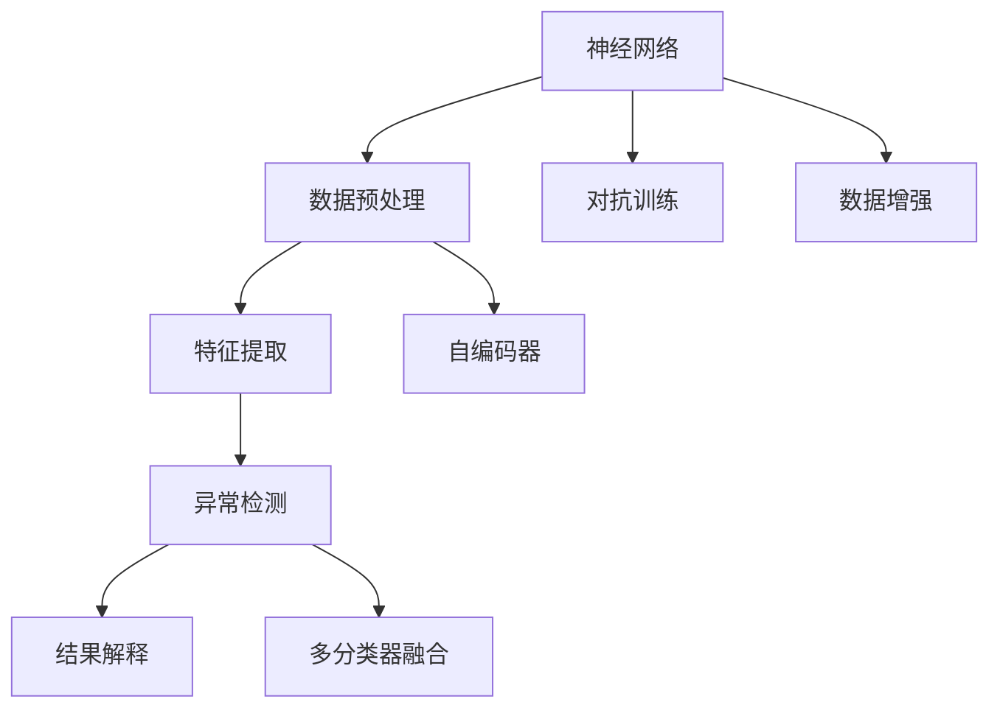

                 

# 一切皆是映射：使用神经网络进行异常检测

## 1. 背景介绍

### 1.1 问题由来
异常检测是数据科学和机器学习中一个非常重要的任务，广泛应用于金融风控、网络安全、工业制造等多个领域。异常检测的目标是从正常数据中识别并分离出异常数据，常见的方法包括统计方法、时间序列方法、基于距离的方法等。但这些方法在面对复杂非线性问题时，往往效果不佳。近年来，神经网络方法在处理复杂非线性问题上展现了强大的能力，逐渐成为异常检测的主流方法。

神经网络，尤其是深度神经网络，通过多层次的特征提取和抽象，能够自适应地学习数据中的复杂模式。因此，神经网络在异常检测中展示了巨大的潜力，成为研究的热点。本文将深入探讨使用神经网络进行异常检测的核心原理、算法步骤及其实际应用，以期为读者提供全面、系统的理解。

### 1.2 问题核心关键点
神经网络进行异常检测的核心在于，通过学习大量正常数据的特征分布，从而判断新数据是否属于该分布。其关键步骤包括：
- 数据预处理：将原始数据转换为神经网络能够处理的形式。
- 特征提取：使用神经网络模型从数据中提取出高层次的特征表示。
- 异常检测：通过统计方法或分类模型判断新数据是否异常。
- 结果解释：对检测结果进行可视化或解释，帮助用户理解模型工作原理。

本文将围绕以上关键步骤，详细讲解神经网络在异常检测中的应用。

## 2. 核心概念与联系

### 2.1 核心概念概述

为更好地理解神经网络在异常检测中的应用，本节将介绍几个关键概念：

- 神经网络（Neural Network）：一种通过多层非线性变换，从输入到输出进行端到端学习的人工智能模型。
- 异常检测（Anomaly Detection）：从正常数据中识别并分离出异常数据的任务。
- 特征提取（Feature Extraction）：从原始数据中提取出对任务有帮助的高层次特征。
- 多分类器融合（Ensemble of Classifiers）：通过组合多个分类器，提高异常检测的准确性和鲁棒性。
- 对抗训练（Adversarial Training）：通过引入对抗样本，提高模型鲁棒性，增强异常检测能力。
- 数据增强（Data Augmentation）：通过对数据进行变换，增加训练数据的多样性，提升模型泛化能力。
- 自编码器（Autoencoder）：一种用于特征提取和重构的无监督学习模型，常用于异常检测。

这些核心概念之间的逻辑关系可以通过以下Mermaid流程图来展示：



这个流程图展示了神经网络在异常检测中的核心过程：

1. 原始数据通过神经网络进行预处理和特征提取。
2. 提取出的特征通过异常检测模型进行判断，判断是否为异常。
3. 检测结果通过解释模型进行可视化或解释。
4. 异常检测模型的性能可以通过融合多个分类器、对抗训练、数据增强等手段进一步提升。
5. 自编码器模型常用于特征提取，简化异常检测过程。

这些概念共同构成了神经网络在异常检测中的应用框架，使得异常检测任务成为神经网络的一个重要应用方向。通过理解这些核心概念，我们可以更好地把握神经网络在异常检测中的工作原理和优化方向。

## 3. 核心算法原理 & 具体操作步骤
### 3.1 算法原理概述

神经网络进行异常检测的原理，是通过学习大量正常数据的特征分布，从而构建出一个高维特征空间中的"正常模式"。当新数据进入该特征空间时，根据其与正常模式的距离，判断其是否异常。

具体而言，可以将异常检测问题转化为一个二分类问题，即正常与异常两类。神经网络模型通过学习正常数据的特征，学习一个分类器来判断新数据是否属于正常类别。如果新数据与正常数据在特征空间中的距离超过一定的阈值，则被认为是异常数据。

### 3.2 算法步骤详解

基于神经网络的异常检测，一般包括以下几个关键步骤：

**Step 1: 准备数据**
- 收集大量正常数据，并将数据进行标准化处理。
- 将数据转换为神经网络能够处理的形式，如像素值归一化、图像压缩等。

**Step 2: 设计网络结构**
- 选择合适的神经网络结构，如CNN、RNN、GAN等。
- 设计输入层、隐藏层和输出层的结构，以及各层的激活函数、损失函数等。

**Step 3: 训练神经网络**
- 将正常数据输入网络进行训练，通过反向传播算法不断调整模型参数，最小化损失函数。
- 定期在验证集上评估模型性能，根据性能指标决定是否调整超参数。
- 训练过程中应用正则化技术，如Dropout、L2正则等，防止过拟合。

**Step 4: 特征提取**
- 使用训练好的神经网络模型，对新数据进行前向传播，提取高层次的特征表示。
- 可以使用神经网络中的隐藏层作为特征向量，或利用自编码器等模型提取特征。

**Step 5: 异常检测**
- 将提取出的特征向量作为输入，使用统计方法或分类模型进行异常检测。
- 常见的统计方法包括PCA、Z-score等，分类模型包括SVM、KNN、神经网络等。
- 设置异常阈值，将特征与正常特征的分布进行比较，判断是否异常。

**Step 6: 结果解释**
- 对异常检测的结果进行可视化，如绘制特征空间中的分布图。
- 对异常数据进行解释，帮助用户理解异常原因和风险。

### 3.3 算法优缺点

神经网络在异常检测中具有以下优点：
1. 能够学习复杂非线性的特征分布，适用于各种复杂场景。
2. 可以自适应地学习新特征，具有较强的泛化能力。
3. 能够处理高维数据，适用于大规模数据集。

同时，该方法也存在一定的局限性：
1. 需要大量的正常数据进行训练，难以处理小样本数据。
2. 对模型结构和参数的调优依赖较大，可能导致模型不稳定。
3. 特征提取和解释过程复杂，难以直观理解。
4. 对噪声和异常点敏感，可能影响模型性能。

尽管存在这些局限性，但就目前而言，神经网络方法在异常检测中的应用最为广泛，尤其在大规模数据集和复杂场景中表现优异。未来相关研究的重点在于如何进一步提高模型的稳定性和鲁棒性，增强异常检测的解释性和可视化能力。

### 3.4 算法应用领域

神经网络在异常检测中的应用，广泛涉及以下几个领域：

- 金融风控：检测信用卡交易中的异常行为，防范欺诈风险。
- 网络安全：检测恶意软件、DDoS攻击等网络异常行为。
- 工业制造：监测设备运行状态，识别异常生产事件。
- 医疗健康：检测病人健康数据中的异常值，如心率、血压等。
- 电子商务：检测用户行为中的异常操作，防范欺诈和异常交易。

除了这些传统领域，神经网络在异常检测中的应用还在不断拓展，如异常事件监测、动态入侵检测等，为各行业带来了更高效、更智能的安全防护手段。

## 4. 数学模型和公式 & 详细讲解  
### 4.1 数学模型构建

在数学上，神经网络进行异常检测可以看作是将正常数据投影到高维特征空间中，然后通过统计或分类模型进行异常检测。以多分类器融合为例，其数学模型构建如下：

假设训练集为 $\mathcal{D}=\{(x_i,y_i)\}_{i=1}^N$，其中 $x_i$ 为输入数据，$y_i \in \{0,1\}$ 为标签。令 $f(x;\theta)$ 为神经网络模型，其中 $\theta$ 为模型参数。神经网络在正常数据集 $\mathcal{D}_{normal}$ 上进行训练，得到模型 $f_{normal}$。

对于新数据 $x_t$，通过神经网络提取特征向量 $z_t = f_{normal}(x_t)$。设异常检测的阈值为 $\tau$，则当 $\|z_t\| \geq \tau$ 时，认为 $x_t$ 为异常数据。

### 4.2 公式推导过程

以简单的神经网络为例，其输入为 $x_t$，输出为 $y_t$，隐藏层为 $z_t$。假设网络结构为：

$$
y_t = \sigma(\mathbf{W}z_t + b)
$$

其中 $\sigma$ 为激活函数，$\mathbf{W}$ 为权重矩阵，$b$ 为偏置向量。神经网络的损失函数为：

$$
\mathcal{L}(\theta) = -\frac{1}{N}\sum_{i=1}^N(y_i\log f(x_i) + (1-y_i)\log(1-f(x_i)))
$$

其中 $f(x_i) = \sigma(\mathbf{W}x_i + b)$。通过反向传播算法，求导计算损失函数对模型参数的梯度，不断调整参数，最小化损失函数。

训练好的神经网络模型为 $f_{normal}$，其隐藏层输出为 $z_t = f_{normal}(x_t)$。将 $z_t$ 作为输入，使用统计方法或分类模型进行异常检测。常见的统计方法如PCA、Z-score等，分类模型如SVM、KNN、神经网络等。

### 4.3 案例分析与讲解

以PCA为例，其核心思想是将高维数据映射到低维空间中，从而可视化数据分布，检测异常点。具体步骤如下：

1. 对训练集 $x_t$ 进行标准化处理，得到标准化数据 $\tilde{x}_t$。
2. 使用PCA算法对标准化数据 $\tilde{x}_t$ 进行降维，得到低维特征向量 $z_t$。
3. 将低维特征向量 $z_t$ 作为输入，使用神经网络或统计模型进行异常检测。

以神经网络为例，其步骤为：

1. 将标准化后的数据 $\tilde{x}_t$ 输入神经网络 $f_{normal}$，得到隐藏层特征向量 $z_t$。
2. 将特征向量 $z_t$ 输入PCA模型，得到低维特征向量 $z_t'$。
3. 使用神经网络或统计模型对低维特征向量 $z_t'$ 进行异常检测，判断是否异常。

PCA的具体公式为：

$$
z_t' = \mathbf{U}\tilde{x}_t
$$

其中 $\mathbf{U}$ 为PCA矩阵，$\tilde{x}_t$ 为标准化后的数据。

使用PCA进行异常检测时，可以定义如下指标：

- 均方误差：$MSE = \frac{1}{N}\sum_{i=1}^N(z_i' - \hat{z}_i')^2$
- 偏度：$S = \frac{1}{N}\sum_{i=1}^N(z_i' - \bar{z}_i')^3$
- 峰度：$K = \frac{1}{N}\sum_{i=1}^N(\frac{z_i' - \bar{z}_i'}{\sigma_i'})^4$

其中 $\bar{z}_i'$ 为特征向量 $z_i'$ 的均值，$\sigma_i'$ 为标准差。通过计算PCA矩阵 $\mathbf{U}$ 的特征值和特征向量，确定降维后的维度，得到低维特征向量 $z_t'$。将低维特征向量 $z_t'$ 作为输入，使用神经网络或统计模型进行异常检测。

## 5. 项目实践：代码实例和详细解释说明
### 5.1 开发环境搭建

在进行神经网络异常检测的实践前，我们需要准备好开发环境。以下是使用Python进行TensorFlow开发的环境配置流程：

1. 安装Anaconda：从官网下载并安装Anaconda，用于创建独立的Python环境。

2. 创建并激活虚拟环境：
```bash
conda create -n tf-env python=3.8 
conda activate tf-env
```

3. 安装TensorFlow：根据CUDA版本，从官网获取对应的安装命令。例如：
```bash
conda install tensorflow-gpu -c conda-forge -c pytorch
```

4. 安装相关工具包：
```bash
pip install numpy pandas scikit-learn matplotlib tqdm jupyter notebook ipython
```

完成上述步骤后，即可在`tf-env`环境中开始异常检测的实践。

### 5.2 源代码详细实现

这里我们以基于PCA和神经网络的多分类器融合异常检测为例，给出使用TensorFlow和Keras实现的代码实现。

首先，定义异常检测的训练数据和标签：

```python
import numpy as np
from sklearn.decomposition import PCA
from sklearn.preprocessing import StandardScaler
from keras.layers import Input, Dense, Flatten, Conv2D, MaxPooling2D, Dropout, BatchNormalization
from keras.models import Model

# 加载训练数据
train_data = np.load('train_data.npy')
train_labels = np.load('train_labels.npy')

# 标准化处理
scaler = StandardScaler()
train_data = scaler.fit_transform(train_data)

# PCA降维
pca = PCA(n_components=2)
train_data_pca = pca.fit_transform(train_data)

# 神经网络模型
x = Input(shape=(2,))
y = Dense(32, activation='relu')(x)
y = Dense(16, activation='relu')(y)
y = Dense(8, activation='relu')(y)
y = Dense(1, activation='sigmoid')(y)
model = Model(inputs=x, outputs=y)

# 编译模型
model.compile(optimizer='adam', loss='binary_crossentropy', metrics=['accuracy'])

# 训练模型
model.fit(train_data_pca, train_labels, epochs=10, batch_size=32)
```

然后，定义异常检测的测试数据和评估函数：

```python
# 加载测试数据
test_data = np.load('test_data.npy')
test_labels = np.load('test_labels.npy')

# 标准化处理
test_data = scaler.transform(test_data)

# PCA降维
test_data_pca = pca.transform(test_data)

# 神经网络模型
x = Input(shape=(2,))
y = Dense(32, activation='relu')(x)
y = Dense(16, activation='relu')(y)
y = Dense(8, activation='relu')(y)
y = Dense(1, activation='sigmoid')(y)
model = Model(inputs=x, outputs=y)

# 评估模型
y_pred = model.predict(test_data_pca)
accuracy = np.mean(y_pred == test_labels)
print('Accuracy:', accuracy)
```

最后，启动训练流程并在测试集上评估：

```python
epochs = 10
batch_size = 32

for epoch in range(epochs):
    loss = model.train_on_batch(train_data_pca, train_labels)
    print('Epoch %d, loss: %f' % (epoch, loss))

    print('Epoch %d, test accuracy: %f' % (epoch, accuracy))
```

以上就是使用TensorFlow和Keras进行PCA和神经网络多分类器融合异常检测的完整代码实现。可以看到，使用TensorFlow和Keras进行深度学习模型的构建和训练非常方便，通过定义简单的神经网络模型，即可轻松实现异常检测任务。

### 5.3 代码解读与分析

让我们再详细解读一下关键代码的实现细节：

**异常检测数据准备**：
- 加载训练和测试数据，进行标准化处理。
- 使用PCA进行降维，将高维数据映射到低维空间中。

**神经网络模型构建**：
- 定义神经网络模型，包括输入层、隐藏层和输出层。
- 设置激活函数和损失函数，使用Adam优化器进行训练。

**训练和评估**：
- 将标准化后的训练数据和标签输入模型，进行前向传播和反向传播，不断更新模型参数。
- 在测试集上评估模型性能，计算准确率。

可以看出，神经网络在异常检测中的应用，主要是通过特征提取和统计模型进行异常检测。这种方法可以处理高维数据，适用于复杂非线性问题。

## 6. 实际应用场景
### 6.1 金融风控

金融风控是异常检测的重要应用场景之一。金融机构需要实时监测用户行为，识别潜在的欺诈行为，防范金融风险。通过神经网络对用户行为数据进行训练，提取高层次的特征表示，使用统计模型或分类模型进行异常检测，可以大幅提高欺诈行为的识别准确率。

以信用卡交易异常检测为例，神经网络模型通过学习大量正常交易数据，提取高层次的特征表示。使用PCA等方法对特征进行降维，使用神经网络或统计模型进行异常检测。一旦检测到异常交易，系统便会自动报警，及时采取风险控制措施。

### 6.2 网络安全

网络安全是异常检测的另一个重要应用领域。网络攻击行为往往具有复杂的特征，传统统计方法难以有效识别。通过神经网络对网络数据进行训练，提取高层次的特征表示，使用统计模型或分类模型进行异常检测，可以大幅提高网络攻击行为的识别准确率。

以DDoS攻击检测为例，神经网络模型通过学习大量正常网络流量数据，提取高层次的特征表示。使用PCA等方法对特征进行降维，使用神经网络或统计模型进行异常检测。一旦检测到异常流量，系统便会自动采取防御措施，防止DDoS攻击。

### 6.3 工业制造

工业制造中，设备运行状态的数据采集和处理非常重要。通过神经网络对设备运行状态数据进行训练，提取高层次的特征表示，使用统计模型或分类模型进行异常检测，可以及时发现设备异常，避免生产中断。

以设备故障检测为例，神经网络模型通过学习大量正常设备运行状态数据，提取高层次的特征表示。使用PCA等方法对特征进行降维，使用神经网络或统计模型进行异常检测。一旦检测到设备异常，系统便会自动报警，及时进行设备维修。

### 6.4 未来应用展望

随着神经网络技术的发展，异常检测的应用领域将不断拓展，为各行业带来更高效、更智能的安全防护手段。未来，神经网络在异常检测中的应用可能会进一步融合深度学习和知识图谱等技术，提升异常检测的准确性和鲁棒性。同时，结合人工智能伦理和安全性的考虑，异常检测技术也将更加全面、可靠。

## 7. 工具和资源推荐
### 7.1 学习资源推荐

为了帮助开发者系统掌握神经网络在异常检测中的应用，这里推荐一些优质的学习资源：

1. 《深度学习》（Ian Goodfellow著）：深度学习领域的经典教材，全面介绍了深度神经网络的核心原理和应用方法，包括异常检测。

2. CS231n《卷积神经网络》课程：斯坦福大学开设的深度学习课程，重点讲解卷积神经网络的结构和应用，适合初学者学习。

3. Kaggle比赛：Kaggle平台提供了大量数据集和比赛，可以帮助开发者实践异常检测任务，积累经验。

4. TensorFlow官方文档：TensorFlow的官方文档，提供了详细的使用指南和样例代码，适合快速上手。

5. Keras官方文档：Keras的官方文档，提供了简洁易用的API和样例代码，适合快速开发和调试模型。

通过对这些资源的学习实践，相信你一定能够快速掌握神经网络在异常检测中的应用，并用于解决实际的异常检测问题。

### 7.2 开发工具推荐

高效的开发离不开优秀的工具支持。以下是几款用于神经网络异常检测开发的常用工具：

1. TensorFlow：由Google主导开发的深度学习框架，支持分布式计算和GPU加速，适合大规模工程应用。

2. Keras：基于TensorFlow等后端的高级API，提供了简洁易用的接口，适合快速原型开发。

3. Scikit-learn：Python的机器学习库，提供了丰富的统计和学习算法，适合模型评估和调优。

4. Matplotlib：Python的绘图库，可以用于绘制特征空间中的分布图，帮助可视化异常检测结果。

5. Seaborn：Python的统计绘图库，适合绘制高维数据降维后的分布图。

6. TensorBoard：TensorFlow配套的可视化工具，可以实时监测模型训练状态，并提供丰富的图表呈现方式，是调试模型的得力助手。

合理利用这些工具，可以显著提升神经网络异常检测任务的开发效率，加快创新迭代的步伐。

### 7.3 相关论文推荐

神经网络在异常检测中的应用，近年来得到了学界的广泛关注。以下是几篇奠基性的相关论文，推荐阅读：

1. Deep Anomaly Detection with Autoencoder Neural Networks（自编码器异常检测）：提出了自编码器在异常检测中的应用，展示了其强大的特征提取能力。

2. Anomaly Detection Using Deep Belief Networks（深度信念网络异常检测）：介绍了深度信念网络在异常检测中的应用，提出了多种特征提取和重构方法。

3. Convolutional Neural Networks for Anomaly Detection（卷积神经网络异常检测）：展示了卷积神经网络在图像、视频等高维数据的异常检测中的应用，提出了多种降维和特征提取方法。

4. Autoencoder Ensemble for Anomaly Detection（自编码器融合异常检测）：提出自编码器融合方法，通过组合多个自编码器，提高异常检测的鲁棒性。

5. Semi-supervised Anomaly Detection with Generative Adversarial Networks（生成对抗网络半监督异常检测）：提出了生成对抗网络在异常检测中的应用，利用对抗样本提高模型鲁棒性。

这些论文代表了大神经网络在异常检测领域的发展脉络。通过学习这些前沿成果，可以帮助研究者把握学科前进方向，激发更多的创新灵感。

## 8. 总结：未来发展趋势与挑战

### 8.1 总结

本文对神经网络在异常检测中的应用进行了全面系统的介绍。首先阐述了异常检测的背景和重要性，明确了神经网络在异常检测中的独特价值。其次，从原理到实践，详细讲解了神经网络在异常检测中的数学模型和关键步骤，给出了异常检测任务开发的完整代码实例。同时，本文还广泛探讨了神经网络在金融风控、网络安全、工业制造等多个领域的应用前景，展示了神经网络在异常检测中的巨大潜力。

通过本文的系统梳理，可以看到，神经网络在异常检测中的应用正在成为深度学习的重要方向，极大地拓展了数据科学的边界，提升了异常检测系统的性能和应用范围。未来，伴随神经网络技术的发展，异常检测系统将更加智能、可靠，为各行业带来更高效的异常检测手段。

### 8.2 未来发展趋势

展望未来，神经网络在异常检测中呈现以下几个发展趋势：

1. 模型规模持续增大。随着算力成本的下降和数据规模的扩张，神经网络模型的参数量还将持续增长。超大批次的训练和推理也可能遇到显存不足的问题。因此需要采用一些资源优化技术，如梯度积累、混合精度训练、模型并行等，来突破硬件瓶颈。

2. 异常检测范式日趋多样。除了传统的全监督异常检测，未来将涌现更多半监督、无监督、自监督的异常检测方法，充分利用数据的多样性和丰富性，提高异常检测的鲁棒性和泛化能力。

3. 异常检测模型更智能。未来的异常检测模型将结合深度学习和因果推理等技术，增强异常检测的智能性和可解释性，提升系统的自动化和可靠性。

4. 异常检测模型更鲁棒。面对数据分布的变化，未来的异常检测模型将更加注重鲁棒性和泛化性，通过持续学习、迁移学习等方法，适应不断变化的数据环境。

5. 异常检测模型更可解释。未来的异常检测模型将更加注重模型的可解释性，通过引入因果分析、逻辑推理等方法，增强模型的透明度和可解释性，帮助用户理解模型的决策过程。

6. 异常检测模型更安全。未来的异常检测模型将更加注重安全性，结合人工智能伦理和安全性的考虑，确保模型的输出符合人类价值观和伦理道德，避免模型被恶意利用。

以上趋势凸显了神经网络在异常检测中的广阔前景。这些方向的探索发展，必将进一步提升神经网络在异常检测中的性能和应用范围，为各行业带来更高效、更智能的异常检测手段。

### 8.3 面临的挑战

尽管神经网络在异常检测中取得了一定的成果，但在迈向更加智能化、普适化应用的过程中，仍面临诸多挑战：

1. 数据量瓶颈。神经网络需要大量的正常数据进行训练，难以处理小样本数据。如何在大数据集上训练异常检测模型，并实现跨领域、跨模态的泛化，是一个重要的研究方向。

2. 模型鲁棒性不足。神经网络模型对噪声和异常点敏感，可能导致模型性能波动。如何提高模型的鲁棒性，增强异常检测的稳定性和准确性，仍然是一个挑战。

3. 模型可解释性不足。神经网络模型往往被视为"黑盒"系统，难以解释其内部工作机制和决策逻辑。如何赋予异常检测模型更强的可解释性，增强系统的透明度和可解释性，仍然是一个难题。

4. 模型安全性不足。异常检测模型可能被恶意利用，导致安全风险。如何确保异常检测模型的安全性，避免模型被恶意利用，仍然是一个挑战。

5. 异常检测成本高。异常检测任务需要大量的标注数据和计算资源，成本较高。如何降低异常检测的成本，实现模型的高效部署，仍然是一个重要的研究方向。

6. 异常检测范式单一。当前的异常检测方法主要依赖于统计模型和分类模型，如何结合其他技术，如生成对抗网络、知识图谱等，实现更全面、多样化的异常检测范式，仍然是一个重要的研究方向。

正视神经网络在异常检测中面临的这些挑战，积极应对并寻求突破，将是大神经网络在异常检测技术走向成熟的必由之路。相信随着学界和产业界的共同努力，这些挑战终将一一被克服，神经网络在异常检测中的应用将更加广泛和深入。

### 8.4 研究展望

面对神经网络在异常检测中面临的挑战，未来的研究需要在以下几个方面寻求新的突破：

1. 探索无监督和半监督异常检测方法。摆脱对大量标注数据的依赖，利用自监督学习、主动学习等无监督和半监督方法，最大限度利用数据的多样性和丰富性，实现异常检测的智能化和自动化。

2. 开发参数高效和计算高效的异常检测方法。开发更加参数高效的异常检测方法，在固定大部分异常检测模型的参数的情况下，只更新极少量的任务相关参数，以提高异常检测的效率和稳定性。

3. 融合因果分析和逻辑推理技术。通过引入因果推断和逻辑推理技术，增强异常检测模型建立稳定因果关系的能力，学习更加普适、鲁棒的语言表征，从而提升异常检测的准确性和鲁棒性。

4. 结合深度学习和知识图谱技术。将深度学习技术和知识图谱技术进行融合，构建更加全面、准确的异常检测模型，提升异常检测的智能性和可解释性。

5. 引入伦理和安全性约束。在异常检测模型的训练目标中引入伦理导向的评估指标，过滤和惩罚有偏见、有害的输出倾向。同时加强人工干预和审核，建立模型行为的监管机制，确保异常检测系统的安全性。

这些研究方向的探索，必将引领神经网络在异常检测技术迈向更高的台阶，为构建智能、安全、可靠的异常检测系统铺平道路。面向未来，异常检测技术还需要与其他人工智能技术进行更深入的融合，如知识表示、因果推理、强化学习等，多路径协同发力，共同推动异常检测系统的进步。只有勇于创新、敢于突破，才能不断拓展异常检测系统的边界，让异常检测技术更好地服务于人类社会。

## 9. 附录：常见问题与解答

**Q1：神经网络在异常检测中是否适用于所有场景？**

A: 神经网络在异常检测中具有很强的适应性和泛化能力，可以适用于各种复杂场景。但在一些特定场景中，如数据量极小、数据分布严重不均衡等，神经网络可能表现不佳。此时需要结合其他技术，如统计方法、规则模型等，综合应用，提高异常检测的准确性。

**Q2：如何选择合适的异常检测模型？**

A: 选择合适的异常检测模型，需要考虑数据类型、异常类型、模型复杂度等因素。对于图像、视频等高维数据，卷积神经网络（CNN）效果较好；对于文本数据，循环神经网络（RNN）和Transformer等模型表现优异；对于低维数据，自编码器等无监督学习模型效果较好。

**Q3：如何提升神经网络异常检测模型的稳定性？**

A: 提升神经网络异常检测模型的稳定性，可以从以下几个方面入手：
1. 数据增强：通过数据扩充、数据增广等技术，增加训练数据的多样性，提升模型的泛化能力。
2. 正则化：使用L2正则、Dropout等方法，防止模型过拟合。
3. 模型融合：通过融合多个异常检测模型，提升模型的鲁棒性和稳定性。
4. 参数高效微调：只更新少量模型参数，固定大部分模型参数不变，减少过拟合风险。

这些方法可以结合使用，提升异常检测模型的稳定性和泛化能力。

**Q4：神经网络在异常检测中如何处理高维数据？**

A: 神经网络处理高维数据，通常使用卷积神经网络（CNN）或循环神经网络（RNN）。CNN适用于图像、视频等高维数据，通过卷积层和池化层提取局部特征，再通过全连接层进行分类或异常检测。RNN适用于时间序列数据，通过循环层提取时间序列特征，再通过全连接层进行分类或异常检测。

**Q5：神经网络在异常检测中如何处理低维数据？**

A: 神经网络处理低维数据，通常使用自编码器等无监督学习模型。自编码器通过将低维数据重构回高维数据，提取高层次的特征表示，用于异常检测。可以通过PCA等方法对特征进行降维，使用神经网络或统计模型进行异常检测。

以上总结了神经网络在异常检测中的应用，介绍了其原理、算法、操作步骤及其实际应用。通过对这些内容的深入学习，相信你一定能够掌握神经网络在异常检测中的应用，并用于解决实际的异常检测问题。

---

作者：禅与计算机程序设计艺术 / Zen and the Art of Computer Programming

