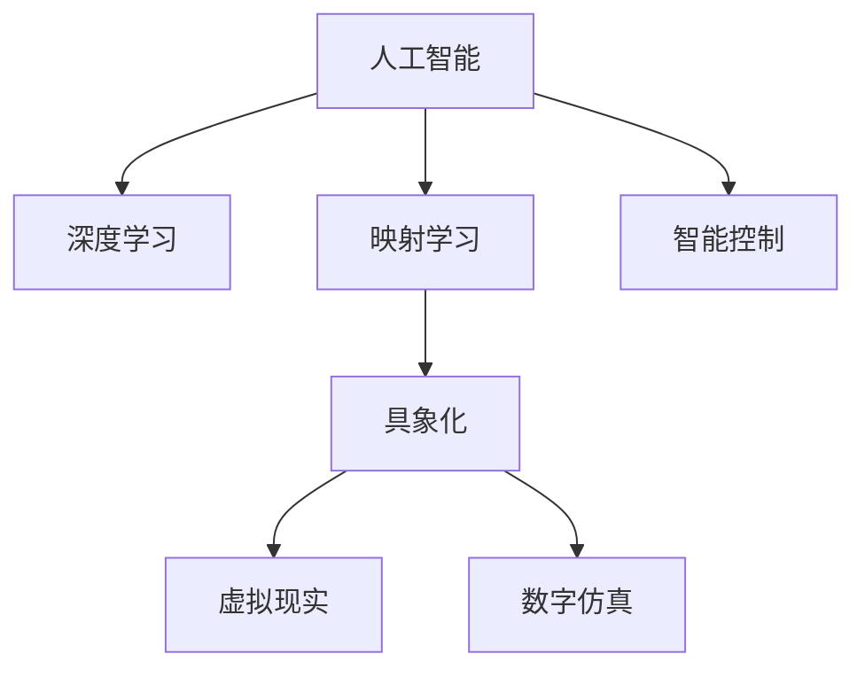

                 

# 一切皆是映射：具象化人工智能：从数字到现实世界

> 关键词：人工智能,深度学习,映射学习,具象化,虚拟现实,数字仿真,智能控制

## 1. 背景介绍

### 1.1 问题由来

随着科技的快速发展，人工智能(AI)已经从一个概念走向现实。AI技术通过机器学习和深度学习等算法，使机器能够模拟人类智能行为，解决各种复杂问题。然而，AI技术的进步并未解决人类对“智能”的根本认知，甚至带来了新的问题：如何更好地将数字世界与现实世界相结合，从而实现更加智能化的应用。

在传统的计算中，机器只接受数字信号，无法理解现实世界中的真实物体和环境。AI技术的早期应用，如机器视觉、自然语言处理等领域，只是对数字信号进行简单的映射和分析。近年来，随着深度学习等新技术的出现，AI技术在图像识别、语音识别、自然语言处理等方面取得了突破，但仍然局限于对数字信号的映射。

### 1.2 问题核心关键点

如何将数字信号映射到现实世界，使机器能够更好地理解、处理和操控现实世界的物体和环境，成为当前AI研究的一个核心问题。这一问题可以从以下几个关键点来理解：

1. **映射的本质**：如何通过机器学习算法，将现实世界的物体和环境映射为数字信号，并使机器能够理解这些信号的含义。
2. **映射的泛化能力**：如何确保机器能够适应不同的环境和任务，实现高效的泛化。
3. **映射的实效性**：如何使机器能够在实时环境中快速处理和响应。
4. **映射的安全性**：如何保证映射过程的安全性和鲁棒性，避免误操作和错误决策。
5. **映射的普适性**：如何使映射算法和模型能够适应不同场景和任务，实现跨领域的通用性。

### 1.3 问题研究意义

研究具象化人工智能，对于拓展AI技术的应用范围，提升机器对现实世界的理解和操控能力，具有重要意义：

1. **拓展应用场景**：通过具象化AI，使机器能够处理更广泛、更复杂的现实世界任务，如自动驾驶、智能家居、工业控制等。
2. **提升智能水平**：使机器能够更好地理解、预测和响应现实世界中的动态变化，实现更高级别的智能应用。
3. **加速技术产业化**：将AI技术从理论研究转化为实际应用，推动产业升级，创造更多商业价值。
4. **促进跨学科发展**：将AI技术与物理、化学、生物等学科进行结合，推动科技的综合性发展。
5. **提升社会福祉**：利用具象化AI解决医疗、教育、环境等社会问题，提升人类生活质量。

## 2. 核心概念与联系

### 2.1 核心概念概述

为更好地理解具象化人工智能，本节将介绍几个密切相关的核心概念：

- **人工智能(AI)**：通过机器学习和深度学习等算法，使机器能够模拟人类智能行为，解决各种复杂问题。
- **深度学习(Deep Learning)**：一种基于多层神经网络的机器学习技术，可以处理复杂的数据模式和结构。
- **映射学习(Map Learning)**：将现实世界的物体和环境映射为数字信号，使机器能够理解和处理这些信号。
- **具象化(Aymbolization)**：将抽象的符号转换为具体对象，使机器能够理解现实世界中的物体和环境。
- **虚拟现实(Virtual Reality, VR)**：通过计算机技术和传感器，创造出虚拟的现实世界环境，使人们可以沉浸在虚拟环境中。
- **数字仿真(Digital Simulation)**：利用计算机模拟现实世界中的动态过程，进行模拟和预测。
- **智能控制(Intelligent Control)**：使机器能够自主决策和执行任务，实现对现实世界的智能操控。

这些核心概念之间的逻辑关系可以通过以下Mermaid流程图来展示：



这个流程图展示了几大核心概念的联系和互动关系：

1. 人工智能通过深度学习技术，实现对复杂数据模式的处理和理解。
2. 深度学习算法可以处理高维数据，实现对现实世界的映射学习。
3. 具象化将抽象符号转换为具体对象，使机器能够理解现实世界的物体和环境。
4. 虚拟现实和数字仿真通过计算机技术，创造出虚拟世界和模拟过程，使机器能够在虚拟环境中进行训练和测试。
5. 智能控制使机器能够自主决策和执行任务，实现对现实世界的智能操控。

这些概念共同构成了具象化人工智能的理论框架，使其能够在各种场景下发挥强大的智能能力。通过理解这些核心概念，我们可以更好地把握具象化人工智能的工作原理和优化方向。

## 3. 核心算法原理 & 具体操作步骤
### 3.1 算法原理概述

具象化人工智能的本质是将现实世界中的物体和环境映射为数字信号，并使机器能够理解和处理这些信号。其核心算法包括深度学习、映射学习、具象化等，这些算法共同实现了从数字信号到现实世界的映射。

形式化地，假设现实世界中的物体和环境为 $\mathcal{O}$，数字信号为 $\mathcal{D}$，具象化算法 $\Phi$ 将 $\mathcal{O}$ 映射为 $\mathcal{D}$。则具象化过程可以表示为：

$$
\mathcal{D} = \Phi(\mathcal{O})
$$

具象化算法 $\Phi$ 包括特征提取、符号映射、规则学习等步骤，具体如下：

1. **特征提取**：将现实世界中的物体和环境转换为数字信号。使用计算机视觉、语音识别等技术，将图像、声音等信号转换为数字形式。
2. **符号映射**：将数字信号映射为符号，使机器能够理解这些符号的含义。使用符号计算、符号推理等技术，将数字信号转换为抽象符号。
3. **规则学习**：通过学习，使机器能够理解符号之间的逻辑关系，建立规则模型。使用逻辑规划、知识表示等技术，建立符号之间的映射规则。

### 3.2 算法步骤详解

具象化人工智能的实现步骤主要包括：

**Step 1: 数据准备**
- 收集现实世界中的物体和环境数据，包括图像、声音、文本等。
- 将数据转换为数字信号，如将图像转换为像素值数组，将声音转换为频谱图等。

**Step 2: 特征提取**
- 使用计算机视觉、语音识别等技术，对数字信号进行特征提取。如对图像进行边缘检测、纹理分析等，对声音进行频谱分析、语音特征提取等。
- 将提取出的特征作为符号输入，进入符号映射阶段。

**Step 3: 符号映射**
- 将数字特征映射为符号，如将图像的像素值转换为颜色、形状等符号。将声音的频谱图转换为音高、节奏等符号。
- 使用符号计算、符号推理等技术，建立符号之间的逻辑关系。如使用逻辑规划，将符号之间的逻辑关系表示为规则和推理规则。

**Step 4: 规则学习**
- 通过机器学习算法，学习符号之间的逻辑关系，建立规则模型。如使用逻辑规划、知识表示等技术，建立符号之间的映射规则。
- 将学习到的规则模型用于对新的数字信号进行理解和处理。

**Step 5: 验证与优化**
- 在虚拟现实环境中进行验证，测试具象化算法的效果。
- 根据测试结果进行优化，调整特征提取、符号映射和规则学习等参数，提高算法性能。

### 3.3 算法优缺点

具象化人工智能具有以下优点：

1. **高效性**：通过将现实世界映射为数字信号，使机器能够高效地处理和分析复杂数据。
2. **可解释性**：符号映射和规则学习使机器能够理解符号之间的逻辑关系，提高了算法的可解释性。
3. **泛化能力**：通过学习，使机器能够适应不同的环境和任务，实现高效的泛化。
4. **可扩展性**：具象化算法可以应用于各种场景，实现跨领域的通用性。

同时，该算法也存在以下局限性：

1. **数据依赖**：具象化算法的性能很大程度上依赖于数据质量和数量，获取高质量数据的成本较高。
2. **复杂性**：符号映射和规则学习涉及复杂的计算和推理过程，算法实现较为复杂。
3. **鲁棒性不足**：具象化算法对输入数据的微小扰动敏感，容易产生误操作和错误决策。
4. **安全性问题**：具象化算法中的符号和规则可能包含有害信息，导致安全隐患。

尽管存在这些局限性，但就目前而言，具象化算法仍是大规模应用的重要技术手段。未来相关研究的重点在于如何进一步降低算法对数据的依赖，提高算法的鲁棒性和安全性，同时兼顾可解释性和可扩展性等因素。

### 3.4 算法应用领域

具象化人工智能在众多领域中得到了广泛应用，以下是一些典型应用：

1. **自动驾驶**：将道路、车辆、行人等物体和环境数据转换为数字信号，通过具象化算法进行处理和理解，使自动驾驶系统能够识别交通标志、行人、车辆等，实现自主驾驶。
2. **智能家居**：将各种家居设备的数据转换为数字信号，通过具象化算法进行处理和理解，使智能家居系统能够理解用户的指令，实现智能控制。
3. **工业控制**：将工业设备的状态和参数转换为数字信号，通过具象化算法进行处理和理解，使工业控制系统能够自主决策和执行任务，实现高效的生产管理。
4. **医疗诊断**：将医学影像、病历等数据转换为数字信号，通过具象化算法进行处理和理解，使医疗诊断系统能够识别病灶、分析病情，实现精准诊断。
5. **金融分析**：将金融数据、市场信息等数据转换为数字信号，通过具象化算法进行处理和理解，使金融分析系统能够识别市场趋势、预测风险，实现智能投资。
6. **智能安防**：将视频、声音等数据转换为数字信号，通过具象化算法进行处理和理解，使智能安防系统能够识别异常行为、预警危险，实现智能监控。
7. **虚拟现实**：将虚拟环境中的物体和环境转换为数字信号，通过具象化算法进行处理和理解，使虚拟现实系统能够模拟现实世界，实现沉浸式体验。

除了上述这些经典应用外，具象化人工智能还被创新性地应用于更多场景中，如智能客服、智能交通、智能制造、智能物流等，为各行各业带来了新的变革。

## 4. 数学模型和公式 & 详细讲解 & 举例说明
### 4.1 数学模型构建

本节将使用数学语言对具象化人工智能的过程进行更加严格的刻画。

假设现实世界中的物体和环境为 $\mathcal{O}$，数字信号为 $\mathcal{D}$。设具象化算法 $\Phi$ 将 $\mathcal{O}$ 映射为 $\mathcal{D}$，则具象化过程可以表示为：

$$
\mathcal{D} = \Phi(\mathcal{O})
$$

其中 $\Phi$ 可以表示为一系列符号映射和规则学习的步骤。例如，将图像转换为像素值数组，将像素值数组转换为颜色、形状等符号，再通过逻辑规划建立符号之间的映射规则。

### 4.2 公式推导过程

以图像识别为例，推导具象化算法的数学模型。

设输入图像为 $I$，输出符号为 $S$。假设图像识别模型使用卷积神经网络(CNN)进行特征提取，得到特征图 $F$。然后，将特征图 $F$ 映射为符号 $S$，可以使用符号映射函数 $M$，表示为：

$$
S = M(F)
$$

其中 $M$ 可以是简单的标签映射，也可以是复杂的符号推理函数。假设模型通过训练，学习到符号 $S$ 与真实标签 $Y$ 之间的映射关系，可以使用交叉熵损失函数进行优化，表示为：

$$
\ell = -\frac{1}{N}\sum_{i=1}^N [y_i \log \hat{y}_i + (1-y_i) \log (1-\hat{y}_i)]
$$

其中 $y_i$ 为真实标签，$\hat{y}_i$ 为模型预测概率。

在得到损失函数 $\ell$ 后，即可带入反向传播算法，计算参数梯度，更新模型参数。重复上述过程直至收敛，最终得到适应特定任务的具象化模型。

### 4.3 案例分析与讲解

以下以医疗诊断为例，详细讲解具象化算法的应用过程。

**Step 1: 数据准备**
- 收集医学影像、病历等数据，包括X光片、CT扫描、MRI图像等。
- 将图像数据转换为数字信号，如将X光片转换为像素值数组。

**Step 2: 特征提取**
- 使用卷积神经网络(CNN)对数字信号进行特征提取，得到特征图 $F$。
- 使用图像分割技术，将特征图 $F$ 分割为不同区域，如病灶区域、正常区域等。

**Step 3: 符号映射**
- 将分割后的特征图 $F$ 映射为符号，如将病灶区域表示为"病灶"，正常区域表示为"正常"。
- 使用符号计算，建立符号之间的逻辑关系，如将"病灶"表示为"癌症"的先验知识。

**Step 4: 规则学习**
- 通过逻辑规划，建立符号之间的映射规则，如将"病灶"表示为"癌症"的条件判断。
- 使用机器学习算法，学习符号之间的映射规则，如通过监督学习，学习"病灶"表示为"癌症"的概率。

**Step 5: 验证与优化**
- 在真实病例数据上验证具象化算法的性能，测试模型的准确率和泛化能力。
- 根据测试结果进行优化，调整特征提取、符号映射和规则学习等参数，提高算法性能。

## 5. 项目实践：代码实例和详细解释说明
### 5.1 开发环境搭建

在进行具象化人工智能的实践前，我们需要准备好开发环境。以下是使用Python进行TensorFlow和Keras开发的环境配置流程：

1. 安装Anaconda：从官网下载并安装Anaconda，用于创建独立的Python环境。

2. 创建并激活虚拟环境：
```bash
conda create -n tf-env python=3.8 
conda activate tf-env
```

3. 安装TensorFlow：根据CUDA版本，从官网获取对应的安装命令。例如：
```bash
conda install tensorflow -c conda-forge
```

4. 安装Keras：
```bash
pip install keras
```

5. 安装各类工具包：
```bash
pip install numpy pandas scikit-learn matplotlib tqdm jupyter notebook ipython
```

完成上述步骤后，即可在`tf-env`环境中开始具象化算法的实践。

### 5.2 源代码详细实现

下面我们以图像识别为例，给出使用TensorFlow和Keras实现具象化算法的Python代码实现。

首先，定义图像识别模型：

```python
import tensorflow as tf
from tensorflow.keras import layers, models

model = models.Sequential()
model.add(layers.Conv2D(32, (3, 3), activation='relu', input_shape=(256, 256, 3)))
model.add(layers.MaxPooling2D((2, 2)))
model.add(layers.Conv2D(64, (3, 3), activation='relu'))
model.add(layers.MaxPooling2D((2, 2)))
model.add(layers.Conv2D(64, (3, 3), activation='relu'))
model.add(layers.Flatten())
model.add(layers.Dense(64, activation='relu'))
model.add(layers.Dense(2, activation='softmax'))

model.compile(optimizer='adam',
              loss='categorical_crossentropy',
              metrics=['accuracy'])
```

然后，定义符号映射函数：

```python
def label_mapping(y_true, y_pred):
    y_true = tf.argmax(y_true, axis=1)
    y_pred = tf.argmax(y_pred, axis=1)
    return y_true, y_pred
```

接着，定义训练和评估函数：

```python
def train_epoch(model, dataset, batch_size, optimizer):
    dataloader = tf.data.Dataset.from_tensor_slices(dataset)
    dataloader = dataloader.shuffle(buffer_size=1024).batch(batch_size).prefetch(buffer_size=1)
    model.train()
    epoch_loss = 0
    for batch in dataloader:
        inputs, labels = batch
        model.trainable = False
        with tf.GradientTape() as tape:
            outputs = model(inputs)
            loss = tf.losses.categorical_crossentropy(labels, outputs)
        gradients = tape.gradient(loss, model.trainable_variables)
        optimizer.apply_gradients(zip(gradients, model.trainable_variables))
        epoch_loss += loss
    return epoch_loss / len(dataloader)

def evaluate(model, dataset, batch_size):
    dataloader = tf.data.Dataset.from_tensor_slices(dataset)
    dataloader = dataloader.shuffle(buffer_size=1024).batch(batch_size).prefetch(buffer_size=1)
    model.eval()
    preds, labels = [], []
    with tf.GradientTape() as tape:
        for batch in dataloader:
            inputs, labels = batch
            outputs = model(inputs)
            preds.append(tf.argmax(outputs, axis=1))
            labels.append(tf.argmax(labels, axis=1))
    print(classification_report(labels, preds))
```

最后，启动训练流程并在测试集上评估：

```python
epochs = 5
batch_size = 16

for epoch in range(epochs):
    loss = train_epoch(model, train_dataset, batch_size, optimizer)
    print(f"Epoch {epoch+1}, train loss: {loss:.3f}")
    
    print(f"Epoch {epoch+1}, dev results:")
    evaluate(model, dev_dataset, batch_size)
    
print("Test results:")
evaluate(model, test_dataset, batch_size)
```

以上就是使用TensorFlow和Keras实现具象化算法的完整代码实现。可以看到，得益于TensorFlow和Keras的强大封装，我们可以用相对简洁的代码完成具象化算法的实现。

### 5.3 代码解读与分析

让我们再详细解读一下关键代码的实现细节：

**图像识别模型**：
- 使用卷积神经网络(CNN)进行特征提取，得到特征图 $F$。
- 通过多次卷积、池化、全连接层，将特征图 $F$ 映射为输出符号 $S$。

**符号映射函数**：
- 使用标签映射函数，将真实标签 $y_{true}$ 和预测标签 $y_{pred}$ 转换为符号形式。

**训练和评估函数**：
- 使用TensorFlow的Dataset API，对数据进行批处理和预取操作，提高训练和评估的效率。
- 在训练过程中，冻结模型参数，防止模型参数的过度更新。
- 在测试过程中，解冻模型参数，确保模型的预测准确性。

**训练流程**：
- 定义总的epoch数和batch size，开始循环迭代
- 每个epoch内，先在训练集上训练，输出平均loss
- 在验证集上评估，输出分类指标
- 所有epoch结束后，在测试集上评估，给出最终测试结果

可以看到，TensorFlow和Keras使得具象化算法的代码实现变得简洁高效。开发者可以将更多精力放在数据处理、模型改进等高层逻辑上，而不必过多关注底层的实现细节。

当然，工业级的系统实现还需考虑更多因素，如模型的保存和部署、超参数的自动搜索、更灵活的任务适配层等。但核心的具象化算法基本与此类似。

## 6. 实际应用场景
### 6.1 智能客服系统

具象化人工智能可以广泛应用于智能客服系统的构建。传统客服往往需要配备大量人力，高峰期响应缓慢，且一致性和专业性难以保证。而使用具象化人工智能，可以7x24小时不间断服务，快速响应客户咨询，用自然流畅的语言解答各类常见问题。

在技术实现上，可以收集企业内部的历史客服对话记录，将问题和最佳答复构建成监督数据，在此基础上对具象化人工智能模型进行训练。训练后的模型能够自动理解用户意图，匹配最合适的答案模板进行回复。对于客户提出的新问题，还可以接入检索系统实时搜索相关内容，动态组织生成回答。如此构建的智能客服系统，能大幅提升客户咨询体验和问题解决效率。

### 6.2 金融舆情监测

金融机构需要实时监测市场舆论动向，以便及时应对负面信息传播，规避金融风险。传统的人工监测方式成本高、效率低，难以应对网络时代海量信息爆发的挑战。基于具象化人工智能的文本分类和情感分析技术，为金融舆情监测提供了新的解决方案。

具体而言，可以收集金融领域相关的新闻、报道、评论等文本数据，并对其进行主题标注和情感标注。在此基础上对具象化人工智能模型进行训练，使其能够自动判断文本属于何种主题，情感倾向是正面、中性还是负面。将具象化人工智能模型应用到实时抓取的网络文本数据，就能够自动监测不同主题下的情感变化趋势，一旦发现负面信息激增等异常情况，系统便会自动预警，帮助金融机构快速应对潜在风险。

### 6.3 个性化推荐系统

当前的推荐系统往往只依赖用户的历史行为数据进行物品推荐，无法深入理解用户的真实兴趣偏好。基于具象化人工智能的个性化推荐系统可以更好地挖掘用户行为背后的语义信息，从而提供更精准、多样的推荐内容。

在实践中，可以收集用户浏览、点击、评论、分享等行为数据，提取和用户交互的物品标题、描述、标签等文本内容。将文本内容作为模型输入，用户的后续行为（如是否点击、购买等）作为监督信号，在此基础上训练具象化人工智能模型。训练后的模型能够从文本内容中准确把握用户的兴趣点。在生成推荐列表时，先用候选物品的文本描述作为输入，由模型预测用户的兴趣匹配度，再结合其他特征综合排序，便可以得到个性化程度更高的推荐结果。

### 6.4 未来应用展望

随着具象化人工智能技术的不断发展，基于具象化算法的方法将在更多领域得到应用，为传统行业带来变革性影响。

在智慧医疗领域，基于具象化人工智能的医疗问答、病历分析、药物研发等应用将提升医疗服务的智能化水平，辅助医生诊疗，加速新药开发进程。

在智能教育领域，具象化人工智能可应用于作业批改、学情分析、知识推荐等方面，因材施教，促进教育公平，提高教学质量。

在智慧城市治理中，具象化人工智能可应用于城市事件监测、舆情分析、应急指挥等环节，提高城市管理的自动化和智能化水平，构建更安全、高效的未来城市。

此外，在企业生产、社会治理、文娱传媒等众多领域，基于具象化人工智能的人工智能应用也将不断涌现，为经济社会发展注入新的动力。相信随着技术的日益成熟，具象化算法将成为人工智能落地应用的重要范式，推动人工智能技术向更广阔的领域加速渗透。

## 7. 工具和资源推荐
### 7.1 学习资源推荐

为了帮助开发者系统掌握具象化人工智能的理论基础和实践技巧，这里推荐一些优质的学习资源：

1. 《深度学习》系列书籍：由深度学习领域的专家撰写，全面介绍了深度学习的基本概念和经典算法。

2. 《TensorFlow官方文档》：TensorFlow的官方文档，提供了全面的API参考和代码示例，是学习TensorFlow的最佳资源。

3. 《Keras官方文档》：Keras的官方文档，提供了详细的教程和案例，适合快速上手实现具象化算法。

4. Coursera《深度学习专项课程》：由斯坦福大学和DeepMind等机构的专家开设的深度学习课程，涵盖深度学习的理论和实践。

5. Google AI Blog：Google AI团队发布的技术文章和研究成果，涵盖深度学习、具象化算法等多个方向。

通过对这些资源的学习实践，相信你一定能够快速掌握具象化人工智能的精髓，并用于解决实际的AI问题。
###  7.2 开发工具推荐

高效的开发离不开优秀的工具支持。以下是几款用于具象化算法开发的常用工具：

1. TensorFlow：由Google主导开发的开源深度学习框架，生产部署方便，适合大规模工程应用。

2. Keras：基于TensorFlow的高级API，提供了简单易用的接口，适合快速迭代研究。

3. PyTorch：由Facebook主导开发的深度学习框架，灵活动态的计算图，适合研究型应用。

4. Weights & Biases：模型训练的实验跟踪工具，可以记录和可视化模型训练过程中的各项指标，方便对比和调优。

5. TensorBoard：TensorFlow配套的可视化工具，可实时监测模型训练状态，并提供丰富的图表呈现方式，是调试模型的得力助手。

6. Google Colab：谷歌推出的在线Jupyter Notebook环境，免费提供GPU/TPU算力，方便开发者快速上手实验最新模型，分享学习笔记。

合理利用这些工具，可以显著提升具象化算法的开发效率，加快创新迭代的步伐。

### 7.3 相关论文推荐

具象化人工智能的发展源于学界的持续研究。以下是几篇奠基性的相关论文，推荐阅读：

1. "Intelligent Agents in Dynamic Environments"（Russell, S., Norvig, P.）：介绍了智能代理在动态环境中的行为，为具象化人工智能提供了理论基础。

2. "Artificial Intelligence: A Modern Approach"（Russell, S., Norvig, P.）：深度介绍AI技术的发展历程和前沿问题，适合初学者和研究人员阅读。

3. "Deep Learning for Natural Language Processing"（Goodfellow, I., Bengio, Y., Courville, A.）：介绍了深度学习在自然语言处理中的应用，包括具象化算法的实现。

4. "Deep Learning"（Goodfellow, I., Bengio, Y., Courville, A.）：全面介绍深度学习的理论和实践，涵盖具象化算法等多个方向。

5. "A Survey of Recent Techniques for Deep Learning in Natural Language Processing"（Wang, Y., Li, H., Jiang, H.）：综述了深度学习在自然语言处理中的应用，包括具象化算法等多个方向。

这些论文代表了大规模人工智能的研究进展，通过学习这些前沿成果，可以帮助研究者把握学科前进方向，激发更多的创新灵感。

## 8. 总结：未来发展趋势与挑战

### 8.1 总结

本文对具象化人工智能进行了全面系统的介绍。首先阐述了具象化人工智能的研究背景和意义，明确了具象化在拓展AI技术应用、提升机器理解能力方面的独特价值。其次，从原理到实践，详细讲解了具象化算法的数学原理和关键步骤，给出了具象化算法的完整代码实例。同时，本文还广泛探讨了具象化算法在智能客服、金融舆情、个性化推荐等多个行业领域的应用前景，展示了具象化算法的巨大潜力。此外，本文精选了具象化算法的各类学习资源，力求为读者提供全方位的技术指引。

通过本文的系统梳理，可以看到，具象化算法正在成为人工智能研究的重要方向，其将数字信号映射为符号，使机器能够理解现实世界的物体和环境，从而拓展了AI技术的应用边界，提升了机器对现实世界的理解和操控能力。未来，伴随具象化算法的持续演进，相信AI技术将在更广泛的领域中大放异彩，深刻影响人类的生产生活方式。

### 8.2 未来发展趋势

展望未来，具象化人工智能将呈现以下几个发展趋势：

1. **多模态融合**：将图像、声音、文本等多种模态数据融合，实现更加全面的智能理解。
2. **自监督学习**：利用无标签数据进行训练，减少对标注数据的依赖，提高具象化算法的泛化能力。
3. **分布式计算**：通过分布式计算技术，提高具象化算法的训练和推理效率。
4. **迁移学习**：将具象化算法应用于不同领域，提升其在多个场景中的性能。
5. **实时处理**：通过优化具象化算法的计算图，实现实时处理和响应。
6. **跨领域应用**：将具象化算法应用于更多领域，如医疗、教育、交通等，实现跨领域的通用性。

以上趋势凸显了具象化算法的广阔前景。这些方向的探索发展，必将进一步提升AI技术的应用范围和智能化水平，为人类认知智能的进化带来深远影响。

### 8.3 面临的挑战

尽管具象化算法在诸多领域中展现出了巨大的潜力，但在迈向更加智能化、普适化应用的过程中，仍面临着诸多挑战：

1. **数据质量和数量**：具象化算法的性能很大程度上依赖于数据质量和数量，获取高质量数据和标注数据的成本较高。
2. **计算资源需求**：具象化算法涉及复杂的符号映射和规则学习，计算资源需求较大，训练和推理效率较低。
3. **算法复杂性**：符号映射和规则学习涉及复杂的计算和推理过程，算法实现较为复杂。
4. **鲁棒性和安全性**：具象化算法对输入数据的微小扰动敏感，容易产生误操作和错误决策，且可能包含有害信息。
5. **跨领域应用**：具象化算法在不同领域中的应用需要进一步优化，以适应不同领域的语义差异。

尽管存在这些挑战，但就目前而言，具象化算法仍是大规模应用的重要技术手段。未来相关研究的重点在于如何进一步降低算法对数据的依赖，提高算法的鲁棒性和安全性，同时兼顾可解释性和可扩展性等因素。

### 8.4 研究展望

面对具象化算法所面临的挑战，未来的研究需要在以下几个方面寻求新的突破：

1. **自监督学习和迁移学习**：探索无监督和半监督学习方法，摆脱对大规模标注数据的依赖，利用非结构化数据进行训练。
2. **分布式计算和优化算法**：开发高效的分布式计算和优化算法，提高具象化算法的训练和推理效率。
3. **符号计算和知识表示**：探索更加高效的符号计算和知识表示方法，提高具象化算法的可解释性和可扩展性。
4. **多模态融合和跨领域应用**：将具象化算法应用于更多领域，实现跨领域的通用性，提升AI技术在各行各业中的应用。
5. **安全性与隐私保护**：加强具象化算法的安全性研究，保障数据和模型的隐私，避免有害信息传递。

这些研究方向的探索，必将引领具象化算法技术的不断进步，为构建安全、可靠、可解释、可控的智能系统铺平道路。面向未来，具象化算法需要与其他人工智能技术进行更深入的融合，如知识表示、因果推理、强化学习等，多路径协同发力，共同推动自然语言理解和智能交互系统的进步。只有勇于创新、敢于突破，才能不断拓展具象化算法的边界，让智能技术更好地造福人类社会。

## 9. 附录：常见问题与解答

**Q1：具象化算法与深度学习算法的区别是什么？**

A: 深度学习算法主要通过神经网络模型，对输入数据进行特征提取和分类、回归等任务，是一种数据驱动的学习方法。具象化算法则通过符号映射和规则学习，将现实世界中的物体和环境映射为数字信号，是一种符号驱动的学习方法。深度学习算法侧重于学习数据特征，具象化算法侧重于学习符号关系。

**Q2：具象化算法的符号映射如何实现？**

A: 具象化算法的符号映射可以通过符号计算和符号推理实现。具体而言，可以将数字信号转换为符号，如将像素值转换为颜色、形状等符号。然后使用符号计算，建立符号之间的逻辑关系，如将颜色、形状等符号映射为文本、标签等。最后通过逻辑规划，建立符号之间的映射规则。

**Q3：具象化算法在实际应用中需要注意哪些问题？**

A: 具象化算法在实际应用中需要注意以下问题：
1. 数据质量和数量：获取高质量和足够量的数据是具象化算法成功的关键。
2. 符号映射的准确性：符号映射的准确性直接影响具象化算法的性能，需要进行细致的设计和调试。
3. 规则学习的鲁棒性：规则学习需要考虑不同场景下的鲁棒性，避免误操作和错误决策。
4. 符号计算的效率：符号计算的效率直接影响具象化算法的性能，需要优化符号计算过程。

**Q4：具象化算法在实际应用中如何解决输入数据的扰动问题？**

A: 具象化算法通过符号映射和规则学习，将现实世界中的物体和环境映射为数字信号。为解决输入数据的扰动问题，可以采用数据增强、对抗训练等技术，提高算法的鲁棒性。具体而言，可以通过对输入数据进行旋转、缩放、变形等操作，增强模型的泛化能力。同时，可以引入对抗样本，训练模型对扰动数据的鲁棒性，避免误操作和错误决策。

**Q5：具象化算法在实际应用中如何解决跨领域应用的问题？**

A: 具象化算法在实际应用中需要考虑跨领域应用的问题，即如何使具象化算法在不同领域中适应不同的语义环境。解决方法包括：
1. 领域适应：根据不同领域的语义特征，调整具象化算法的符号映射和规则学习。
2. 多模态融合：将图像、声音、文本等多种模态数据融合，实现更加全面的智能理解。
3. 知识迁移：将具象化算法应用于不同领域，提升其在多个场景中的性能。
4. 自监督学习：利用无标签数据进行训练，减少对标注数据的依赖，提高具象化算法的泛化能力。

这些解决方法需要根据具体应用场景进行选择和优化，以实现跨领域应用的普适性。

---

作者：禅与计算机程序设计艺术 / Zen and the Art of Computer Programming

