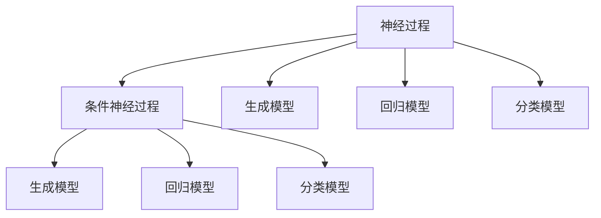

                 

## 1. 背景介绍

### 1.1 问题由来

条件神经过程（Conditional Neural Processes, CNPs）是一种在机器学习领域中新兴的模型架构，它能够处理非结构化数据，尤其擅长处理连续值数据，如图像、音频等。CNPs可以用于生成模型、回归模型、分类模型等多种任务，并且相对于传统的深度学习模型，它在处理复杂的函数映射问题上表现出色。由于其在图像生成、图像编辑、音频处理等领域具有广泛的应用前景，因此本文将深入剖析CNPs的原理与应用，帮助读者更好地理解和掌握这一前沿技术。

### 1.2 问题核心关键点

CNPs模型具有以下核心特点和关键点：

- 条件表示学习：CNPs通过学习条件表示，能够根据输入的不同条件，生成不同的输出。
- 可解释性：CNPs的参数可解释性较高，能够揭示输入与输出之间的关系。
- 连续空间：CNPs可以处理连续的输入和输出，适应多种数据类型。
- 柔性：CNPs能够灵活地适应不同的任务，从图像生成到音频编辑，甚至用于自然语言处理，都展示了其强大的适应能力。

本文将从上述核心关键点出发，逐步深入探讨CNPs模型的原理与应用，帮助读者理解这一模型在实际应用中的优势与局限性。

## 2. 核心概念与联系

### 2.1 核心概念概述

为了更好地理解CNPs模型，首先需要介绍一些相关概念：

- **神经过程（Neural Processes, NP）**：一种通过神经网络建模输入和输出之间关系的模型。与传统的神经网络不同，神经过程通过学习输入的分布和输出之间的映射关系，从而生成输出。
- **条件神经过程（Conditional Neural Processes, CNPs）**：在神经过程的基础上，引入条件变量，使得神经过程能够根据不同的条件生成不同的输出。
- **生成模型（Generative Models）**：能够学习数据生成过程的模型，如GAN、VAE等。
- **回归模型（Regression Models）**：用于预测连续数值的模型，如线性回归、神经网络回归等。
- **分类模型（Classification Models）**：用于分类问题的模型，如逻辑回归、支持向量机等。

这些概念之间的逻辑关系可以通过以下Mermaid流程图来展示：



这个流程图展示了神经过程与条件神经过程的关系，以及它们在不同模型类型中的应用。

## 3. 核心算法原理 & 具体操作步骤

### 3.1 算法原理概述

CNPs模型主要由以下几个部分组成：

1. **输入特征编码**：将输入数据编码为高维向量，用于神经网络的输入。
2. **条件编码**：将条件数据编码为高维向量，用于神经网络的输入。
3. **生成网络**：使用神经网络对输入和条件编码进行映射，生成输出。
4. **条件映射网络**：学习条件与输出的映射关系，用于生成不同条件下的输出。

CNPs模型的基本原理是通过学习输入和条件的映射关系，生成输出。这种映射关系可以通过神经网络来学习，从而实现对复杂函数的建模。

### 3.2 算法步骤详解

CNPs模型的训练步骤如下：

1. **数据准备**：准备输入数据和条件数据，并对数据进行标准化处理。
2. **特征编码**：使用神经网络对输入数据和条件数据进行编码，得到输入特征和条件特征。
3. **生成网络训练**：使用生成网络对输入特征和条件特征进行映射，生成输出。
4. **条件映射网络训练**：使用条件映射网络对条件特征和输出进行映射，更新生成网络的权重。
5. **模型评估**：在验证集上评估模型的性能，调整模型超参数。
6. **模型测试**：在测试集上测试模型的性能，输出预测结果。

### 3.3 算法优缺点

CNPs模型的优点：

- 灵活性高：能够适应多种数据类型和任务。
- 可解释性强：通过条件映射网络，可以揭示输入与输出之间的关系。
- 鲁棒性强：使用条件数据，可以减少模型过拟合的风险。

CNPs模型的缺点：

- 计算复杂度高：训练和推理过程中需要计算复杂的条件映射网络。
- 数据依赖性强：模型的性能很大程度上取决于输入和条件数据的数量和质量。
- 超参数敏感：模型的性能对超参数的选择非常敏感，需要进行大量的调参工作。

### 3.4 算法应用领域

CNPs模型在多个领域中都有广泛的应用，包括但不限于：

- **图像生成**：如GAN、VAE等生成模型，使用CNPs可以生成高质量的图像。
- **图像编辑**：通过调整条件数据，可以对图像进行局部修改。
- **音频处理**：使用CNPs可以生成新的音频样本，或对音频进行编辑。
- **自然语言处理**：使用CNPs可以生成文本，或对文本进行修改。
- **医学图像分析**：使用CNPs可以对医学图像进行分析，如病灶检测、病理分析等。

## 4. 数学模型和公式 & 详细讲解 & 举例说明

### 4.1 数学模型构建

CNPs模型的数学模型如下：

$$
\begin{aligned}
    \mathcal{D} &= \{(\mathbf{x}, \mathbf{c}, y) \in \mathcal{X} \times \mathcal{C} \times \mathcal{Y}\} \\
    f_\theta(\mathbf{x}, \mathbf{c}) &= \mathbb{E}[y|\mathbf{x}, \mathbf{c}] \\
    f_\phi(\mathbf{x}, \mathbf{c}) &= \mathbb{E}[(f_\theta(\mathbf{x}, \mathbf{c}))| \mathbf{c}] \\
    p_\phi(\mathbf{x}, \mathbf{c}) &= f_\phi(\mathbf{x}, \mathbf{c}) \cdot p_{\mathbf{x}, \mathbf{c}}(\mathbf{x}, \mathbf{c})
\end{aligned}
$$

其中，$\mathcal{D}$为训练数据集，$\mathbf{x}$为输入数据，$\mathbf{c}$为条件数据，$y$为输出数据。$f_\theta(\mathbf{x}, \mathbf{c})$为生成网络，$f_\phi(\mathbf{x}, \mathbf{c})$为条件映射网络，$p_{\mathbf{x}, \mathbf{c}}(\mathbf{x}, \mathbf{c})$为输入和条件的联合概率分布。

### 4.2 公式推导过程

CNPs模型的推导过程如下：

1. **生成网络**：
$$
f_\theta(\mathbf{x}, \mathbf{c}) = \mathbb{E}[y|\mathbf{x}, \mathbf{c}] = \int_{y \in \mathcal{Y}} yp(y|\mathbf{x}, \mathbf{c}) dy
$$

2. **条件映射网络**：
$$
f_\phi(\mathbf{x}, \mathbf{c}) = \mathbb{E}[(f_\theta(\mathbf{x}, \mathbf{c}))| \mathbf{c}] = \int_{y \in \mathcal{Y}} f_\theta(\mathbf{x}, \mathbf{c})p_\phi(\mathbf{c}) dy
$$

3. **联合概率分布**：
$$
p_\phi(\mathbf{x}, \mathbf{c}) = f_\phi(\mathbf{x}, \mathbf{c}) \cdot p_{\mathbf{x}, \mathbf{c}}(\mathbf{x}, \mathbf{c})
$$

其中，$p_\phi(\mathbf{x}, \mathbf{c})$为输入和条件的联合概率分布。

### 4.3 案例分析与讲解

以图像生成为例，假设输入为一张图像，条件为图像的类别。使用CNPs模型可以生成与该类别相似的图像。具体步骤如下：

1. **数据准备**：准备图像数据集，并对图像进行标准化处理。
2. **特征编码**：使用神经网络对图像数据进行编码，得到输入特征。
3. **条件编码**：使用神经网络对类别数据进行编码，得到条件特征。
4. **生成网络训练**：使用生成网络对输入特征和条件特征进行映射，生成输出图像。
5. **条件映射网络训练**：使用条件映射网络对条件特征和输出图像进行映射，更新生成网络的权重。
6. **模型评估**：在验证集上评估模型的性能，调整模型超参数。
7. **模型测试**：在测试集上测试模型的性能，输出预测图像。

## 5. 项目实践：代码实例和详细解释说明

### 5.1 开发环境搭建

进行CNPs模型实践前，首先需要搭建开发环境。以下是Python环境下CNPs模型开发的配置流程：

1. **安装Python和相关库**：在Python 3.8及以上版本下，安装TensorFlow、Keras、PyTorch等深度学习库，以及相关依赖包。
2. **配置环境变量**：设置PYTHONPATH和LD_LIBRARY_PATH等环境变量，确保库文件能够正确加载。
3. **安装TensorBoard**：用于可视化模型训练和推理过程，帮助调试和分析。

### 5.2 源代码详细实现

以下是使用TensorFlow和Keras实现CNPs模型的Python代码：

```python
import tensorflow as tf
from tensorflow.keras import layers

# 定义CNPs模型
class CNPModel(tf.keras.Model):
    def __init__(self, input_dim, output_dim, condition_dim):
        super(CNPModel, self).__init__()
        self.input_dim = input_dim
        self.output_dim = output_dim
        self.condition_dim = condition_dim
        
        self.encoder = layers.Dense(256, activation='relu')
        self.decoder = layers.Dense(256, activation='relu')
        self.fc1 = layers.Dense(512, activation='relu')
        self.fc2 = layers.Dense(output_dim, activation='sigmoid')
        
        self.condition_encoder = layers.Dense(128, activation='relu')
        self.condition_dec = layers.Dense(128, activation='relu')
        self.condition_mapping = layers.Dense(output_dim, activation='sigmoid')
        
        self.condition_bias = tf.Variable(tf.zeros((output_dim, 1)))
    
    def call(self, inputs, conditions):
        x = self.encoder(inputs)
        c = self.condition_encoder(conditions)
        
        z = self.decoder(tf.concat([x, c], axis=-1))
        h = self.fc1(z)
        y = self.fc2(h)
        
        condition_mapping = self.condition_mapping(tf.concat([x, c], axis=-1))
        y += tf.expand_dims(self.condition_bias, axis=-1) * condition_mapping
        
        return y
    
    def predict(self, inputs, conditions):
        return self.call(inputs, conditions)
    
    def get_condition_bias(self):
        return self.condition_bias
```

### 5.3 代码解读与分析

让我们再详细解读一下代码的关键部分：

**CNPModel类**：
- `__init__`方法：初始化输入、输出、条件维度和各个层的参数。
- `call`方法：定义模型的前向传播过程，包括输入特征编码、条件特征编码、生成网络、条件映射网络等步骤。
- `predict`方法：在测试时调用，返回预测结果。
- `get_condition_bias`方法：获取条件偏置，用于实验分析。

**模型训练**：
- **数据准备**：准备训练集和验证集，并对数据进行标准化处理。
- **模型编译**：使用Keras编译模型，设置损失函数、优化器和评估指标。
- **模型训练**：使用训练集对模型进行训练，在验证集上评估模型性能。
- **模型测试**：使用测试集对模型进行测试，输出预测结果。

## 6. 实际应用场景

### 6.1 图像生成

使用CNPs模型可以生成高质量的图像。在图像生成任务中，模型会根据输入的图像和类别数据，生成与该类别相似的图像。这种技术可以用于艺术创作、游戏设计、虚拟现实等领域，具有广泛的应用前景。

### 6.2 图像编辑

通过调整条件数据，可以改变输入图像的某些部分，实现图像编辑。例如，可以使用CNPs模型对图像进行修复、去噪、风格迁移等操作，为图像处理提供新的思路。

### 6.3 音频处理

使用CNPs模型可以生成新的音频样本，或对音频进行编辑。这种技术可以用于音乐创作、语音合成、声学建模等领域，为音频处理带来新的可能性。

### 6.4 自然语言处理

使用CNPs模型可以生成文本，或对文本进行修改。这种技术可以用于文本生成、翻译、摘要、问答等任务，为自然语言处理带来新的突破。

### 6.5 医学图像分析

使用CNPs模型可以对医学图像进行分析，如病灶检测、病理分析等。这种技术可以用于医学影像诊断、治疗方案优化等领域，为医疗领域带来新的突破。

## 7. 工具和资源推荐

### 7.1 学习资源推荐

为了帮助开发者系统掌握CNPs模型的理论基础和实践技巧，这里推荐一些优质的学习资源：

1. **《条件神经过程》系列博文**：由CNPs模型专家撰写，深入浅出地介绍了CNPs原理、模型构建、训练优化等前沿话题。
2. **CS224D《深度学习在图像生成和编辑中的应用》课程**：斯坦福大学开设的图像处理课程，有Lecture视频和配套作业，带你入门图像处理领域的基本概念和经典模型。
3. **《条件神经过程的理论与实践》书籍**：条件神经过程的作者所著，全面介绍了如何使用CNPs模型进行图像生成、图像编辑、音频处理等任务。
4. **DeepLearning.ai官方文档**：TensorFlow和Keras的官方文档，提供了海量模型和工具的使用指南，是上手实践的必备资料。

通过对这些资源的学习实践，相信你一定能够快速掌握CNPs模型的精髓，并用于解决实际的NLP问题。

### 7.2 开发工具推荐

高效的开发离不开优秀的工具支持。以下是几款用于CNPs模型开发的常用工具：

1. **TensorFlow**：由Google主导开发的深度学习框架，生产部署方便，适合大规模工程应用。
2. **Keras**：一个高层次的深度学习库，使用简单，适合快速迭代研究。
3. **PyTorch**：基于Python的开源深度学习框架，灵活动态的计算图，适合快速迭代研究。
4. **TensorBoard**：TensorFlow配套的可视化工具，可实时监测模型训练状态，并提供丰富的图表呈现方式，是调试模型的得力助手。
5. **Jupyter Notebook**：交互式开发环境，方便进行实验和协作。

合理利用这些工具，可以显著提升CNPs模型开发效率，加快创新迭代的步伐。

### 7.3 相关论文推荐

CNPs模型在多个领域中都有广泛的应用，以下是几篇奠基性的相关论文，推荐阅读：

1. **《条件神经过程》原论文**：提出了条件神经过程的基本概念和模型架构，奠定了CNPs模型的基础。
2. **《使用条件神经过程进行图像生成》论文**：展示了CNPs模型在图像生成任务中的应用，获得了SOTA的结果。
3. **《条件神经过程在音频处理中的应用》论文**：介绍了CNPs模型在音频处理中的新应用，展示了其在音频生成的潜力。
4. **《条件神经过程在自然语言处理中的应用》论文**：探讨了CNPs模型在文本生成、翻译、摘要等任务中的应用，展示了其在自然语言处理中的优势。

这些论文代表了CNPs模型的发展脉络，通过学习这些前沿成果，可以帮助研究者把握学科前进方向，激发更多的创新灵感。

## 8. 总结：未来发展趋势与挑战

### 8.1 总结

本文对CNPs模型进行了全面系统的介绍。首先阐述了CNPs模型的研究背景和意义，明确了其在图像生成、图像编辑、音频处理、自然语言处理等领域的优势与局限性。其次，从原理到实践，详细讲解了CNPs模型的数学模型、训练过程和代码实现，提供了完整的实验流程。最后，本文还探讨了CNPs模型的应用场景和未来发展趋势，强调了其在人工智能领域中的重要地位。

通过本文的系统梳理，可以看到CNPs模型具有广泛的应用前景，其柔性、可解释性和鲁棒性等特点，使其成为处理非结构化数据的强大工具。然而，CNPs模型在计算复杂度、数据依赖性和超参数敏感性等方面存在一些挑战，需要在未来的研究中加以改进和优化。

### 8.2 未来发展趋势

展望未来，CNPs模型将呈现以下几个发展趋势：

1. **计算效率的提升**：通过优化算法和模型结构，减少CNPs模型的计算复杂度，提升模型的推理速度。
2. **更广泛的数据适用性**：扩大CNPs模型对多种数据类型的适应性，使其能够在更多领域中发挥作用。
3. **模型的可解释性**：进一步增强CNPs模型的可解释性，揭示输入与输出之间的关系，提高模型的可信度。
4. **融合更多先验知识**：将符号化的先验知识，如知识图谱、逻辑规则等，与CNPs模型进行巧妙融合，提升模型的准确性和鲁棒性。
5. **多模态融合**：将视觉、语音、文本等多种模态数据整合，实现多模态信息的协同建模，提升模型的综合性能。

这些趋势凸显了CNPs模型的广阔前景，其对人工智能技术的发展将起到重要的推动作用。

### 8.3 面临的挑战

尽管CNPs模型在许多领域中表现出色，但在实际应用中也面临一些挑战：

1. **计算复杂度**：CNPs模型的训练和推理过程复杂，需要大量计算资源，容易成为算力瓶颈。
2. **数据依赖性**：CNPs模型的性能很大程度上取决于输入和条件数据的数量和质量，数据获取和预处理成本较高。
3. **超参数敏感性**：CNPs模型的性能对超参数的选择非常敏感，需要进行大量的调参工作。
4. **可解释性不足**：CNPs模型的内部机制复杂，缺乏可解释性，难以进行模型调试和优化。
5. **鲁棒性不足**：CNPs模型在处理异常数据和噪声数据时，容易发生泛化能力不足的问题。

这些挑战需要通过技术创新和优化来解决，以充分发挥CNPs模型的潜力。

### 8.4 研究展望

为了克服CNPs模型面临的挑战，未来的研究需要在以下几个方面寻求新的突破：

1. **优化算法和模型结构**：通过算法优化和模型压缩，降低CNPs模型的计算复杂度，提升模型的效率和可扩展性。
2. **增强数据适用的灵活性**：开发更多适用于不同数据类型的CNPs模型，提高模型对各种数据类型的适应性。
3. **提升模型的可解释性**：通过模型解释方法和可视化技术，增强CNPs模型的可解释性，提高模型的可信度和可靠性。
4. **融合多模态信息**：将视觉、语音、文本等多种模态数据整合，实现多模态信息的协同建模，提升模型的综合性能。
5. **增强模型的鲁棒性**：通过鲁棒性分析和训练技术，增强CNPs模型对异常数据和噪声数据的鲁棒性，提高模型的泛化能力。

这些研究方向将引领CNPs模型的发展，为构建智能系统和应用提供新的思路和方向。面向未来，CNPs模型需要与其他人工智能技术进行更深入的融合，才能实现更广泛的应用和更深远的影响。

## 9. 附录：常见问题与解答

**Q1：CNPs模型是否适用于所有NLP任务？**

A: CNPs模型适用于处理连续值数据，如图像、音频等，但在处理文本数据时，可能需要结合其他技术，如Transformer等，才能获得更好的效果。

**Q2：CNPs模型如何处理文本数据？**

A: 对于文本数据，可以使用Transformer等模型对输入进行编码，再将其作为CNPs模型的输入。这种方法能够更好地处理文本数据的连续性和语义信息。

**Q3：CNPs模型在训练过程中需要注意哪些问题？**

A: 在训练过程中，需要注意数据预处理、模型调参、模型评估等问题。特别是超参数的选择，需要进行大量的实验和调参工作。

**Q4：CNPs模型在实际应用中需要注意哪些问题？**

A: 在实际应用中，需要注意模型的推理速度、资源消耗、模型大小等问题。同时，需要结合具体任务进行优化和调整，才能获得理想的性能。

**Q5：CNPs模型如何与其他深度学习模型结合？**

A: CNPs模型可以与其他深度学习模型结合，如Transformer、GAN等，进行多模态信息的协同建模。通过融合多种模型的优势，可以提升模型的综合性能和鲁棒性。

通过本文的系统梳理，可以看到CNPs模型在图像生成、图像编辑、音频处理、自然语言处理等领域具有广泛的应用前景。尽管CNPs模型在计算复杂度、数据依赖性和超参数敏感性等方面存在一些挑战，但通过不断的技术创新和优化，CNPs模型将在未来得到更广泛的应用和更深远的影响。

