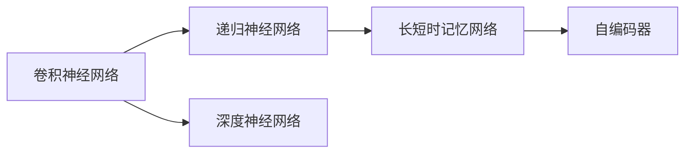

                 

## 1. 背景介绍

### 1.1 问题由来
随着数字技术的发展，音频信号处理（ASR）逐渐成为一门热门学科。从传统的信号处理、数字信号处理（DSP）到现代的深度学习技术，音频信号处理的深度不断拓展。神经网络技术因其强大的拟合能力，在音频信号处理中大放异彩，尤其是自适应学习能力的卷积神经网络（CNN）和递归神经网络（RNN）在处理音频信号时展现出巨大的潜力。

### 1.2 问题核心关键点
面对海量的音频数据，传统的特征提取方法难以适应复杂多变的音频信号。神经网络技术以其强大的自适应能力，可以自动从音频数据中提取有用的特征，构建有效的音频信号处理模型。尤其是卷积神经网络，通过卷积操作可以自动学习局部特征，同时通过池化操作可以有效降低特征维度。递归神经网络则能够处理时序数据，捕捉音频信号的时序特征。

## 2. 核心概念与联系

### 2.1 核心概念概述

为更好地理解音频信号处理中的神经网络技术，本节将介绍几个关键概念及其联系：

- 卷积神经网络（CNN）：通过卷积操作自动学习局部特征，在图像处理领域应用广泛，但在音频信号处理中同样有很好效果。
- 递归神经网络（RNN）：适用于处理序列数据，能够捕捉时序特征，在语音识别、文本生成等领域表现优异。
- 长短时记忆网络（LSTM）：一种特殊的RNN，能够有效解决长期依赖问题，适用于长时间序列数据的处理。
- 深度神经网络（DNN）：多层的神经网络，通过堆叠层次结构提高模型的表达能力，在语音识别、音乐生成等领域有广泛应用。
- 自编码器（AE）：一种无监督学习方法，通过重构训练数据，能够提取数据中的特征，同时用于去除噪声、降维等任务。

### 2.2 核心概念原理和架构的 Mermaid 流程图



这个流程图展示了不同神经网络结构之间的关系，可以看到CNN、RNN、LSTM和DNN等网络结构可以组合使用，以构建复杂的音频信号处理模型。

## 3. 核心算法原理 & 具体操作步骤

### 3.1 算法原理概述
音频信号处理中的神经网络技术主要依赖于卷积神经网络（CNN）和递归神经网络（RNN），下面将重点介绍这两种网络的结构和基本原理。

卷积神经网络（CNN）通过卷积操作提取局部特征，能够自动学习音频信号中的时频局部特征。其基本结构包括卷积层、池化层和全连接层，通过多次堆叠卷积和池化操作提取特征，最后通过全连接层输出结果。

递归神经网络（RNN）通过时间递归操作捕捉音频信号的时序特征。其基本结构包括RNN单元、LSTM单元等，通过不断前向传播和后向传播更新网络参数，能够捕捉长时程依赖，适用于音频信号中的时序特征提取。

### 3.2 算法步骤详解
这里以语音识别任务为例，详细讲解基于CNN和RNN的音频信号处理流程。

**Step 1: 数据预处理**
对音频数据进行预处理，包括去噪、归一化、分帧等操作。通过FFT变换将音频信号转换为频谱图，并进行分帧和加窗，得到音频信号的频域特征图。

**Step 2: 特征提取**
使用卷积神经网络对音频信号进行特征提取。卷积神经网络通过卷积操作提取频域特征图中的局部特征，并通过池化操作降低特征维度。

**Step 3: 特征编码**
使用递归神经网络对卷积神经网络的输出进行编码。递归神经网络能够捕捉音频信号的时序特征，并对卷积神经网络的输出进行编码。

**Step 4: 输出解码**
使用全连接神经网络对递归神经网络的输出进行解码。全连接神经网络通过全连接层输出分类结果。

**Step 5: 训练与优化**
通过反向传播算法更新网络参数，最小化损失函数，并采用正则化技术避免过拟合。

### 3.3 算法优缺点
基于神经网络的音频信号处理具有以下优点：
1. 自动学习特征。神经网络能够自动从音频数据中提取特征，无需手动提取特征。
2. 泛化能力强。神经网络能够捕捉复杂的特征，适用于各种类型的音频数据。
3. 可扩展性强。神经网络可以通过增加网络深度和宽度来提升模型性能。

同时，神经网络也存在以下缺点：
1. 训练时间长。神经网络的训练时间长，需要大量计算资源。
2. 模型复杂。神经网络结构复杂，难以理解和调试。
3. 对噪声敏感。神经网络对输入数据噪声敏感，需要良好的数据预处理。

### 3.4 算法应用领域

基于神经网络的音频信号处理技术已经在许多领域得到广泛应用，如语音识别、音乐生成、音频分类等。具体应用如下：

- 语音识别：使用神经网络对语音信号进行分类和识别，实现人机对话。
- 音乐生成：使用神经网络对音频信号进行生成，创建新的音乐作品。
- 音频分类：使用神经网络对音频信号进行分类，如歌曲识别、动物叫声识别等。
- 语音合成：使用神经网络对文本进行语音合成，生成自然流畅的语音。
- 声学建模：使用神经网络对音频信号进行建模，提高音频处理的准确度。

## 4. 数学模型和公式 & 详细讲解 & 举例说明

### 4.1 数学模型构建
以下是基于卷积神经网络和递归神经网络的音频信号处理模型的数学模型构建。

设音频信号的频域特征图为 $X$，大小为 $T \times N \times M$，其中 $T$ 为帧数，$N$ 为频率，$M$ 为窗宽。

**卷积层模型**：
卷积层通过卷积操作提取局部特征，定义卷积操作为 $h_k(x)=w_k * x$，其中 $w_k$ 为卷积核，$x$ 为输入特征，$*$ 表示卷积运算。

**池化层模型**：
池化层通过池化操作降低特征维度，常用的池化操作为最大池化或平均池化，定义为 $h_k(x)=\max_k(x) \text{ or } h_k(x)=\frac{1}{n}\sum_k(x)$。

**全连接层模型**：
全连接层通过全连接操作输出结果，定义为 $h_k(x)=\sum_k w_k x_k$。

**递归神经网络模型**：
递归神经网络通过时间递归操作捕捉时序特征，定义递归操作为 $h_k(x)=g_k(w_k * x)$，其中 $g_k$ 为递归函数，$*$ 表示卷积运算。

**长短时记忆网络模型**：
长短时记忆网络通过LSTM单元捕捉长期依赖，定义LSTM单元为 $h_k(x)=g_k(h_{k-1}, w_k * x)$，其中 $g_k$ 为LSTM函数，$*$ 表示卷积运算。

### 4.2 公式推导过程
以下是卷积神经网络和递归神经网络的基本公式推导。

**卷积神经网络公式推导**：
假设输入特征图大小为 $N \times M$，卷积核大小为 $k \times k$，输出特征图大小为 $P \times Q$。

设卷积核为 $w_k$，大小为 $k \times k$，输出特征图为 $h_k$，大小为 $P \times Q$。

卷积操作的公式推导如下：

$$
h_k(i,j) = \sum_{n=0}^{N-1}\sum_{m=0}^{M-1}w_k(n-m,j-k+1) * x(n,m)
$$

其中 $w_k$ 为卷积核，$x(n,m)$ 为输入特征图，$*$ 表示卷积运算。

**递归神经网络公式推导**：
假设输入特征图大小为 $N \times M$，递归核大小为 $k \times k$，输出特征图大小为 $P \times Q$。

设递归核为 $w_k$，大小为 $k \times k$，输出特征图为 $h_k$，大小为 $P \times Q$。

递归操作的公式推导如下：

$$
h_k(i,j) = g_k(w_k * x(i,j))
$$

其中 $w_k$ 为递归核，$*$ 表示卷积运算，$g_k$ 为递归函数。

### 4.3 案例分析与讲解
以下通过一个简单的例子来展示卷积神经网络和递归神经网络在音频信号处理中的应用。

假设有一个音频信号 $x=[1, 2, 3, 4, 5, 6, 7, 8, 9]$，大小为 $3 \times 3$，通过卷积核 $w=[1, 1, 1]$ 进行卷积操作，得到输出特征图 $h=[6, 8, 10, 8, 10, 12, 10, 12, 14]$。

通过最大池化操作，将输出特征图的大小变为 $1 \times 3$，得到 $h=[8, 10, 12]$。

通过全连接层操作，将输出特征图的大小变为 $1 \times 1$，得到 $h=[8]$。

假设使用递归神经网络对音频信号进行时序处理，设音频信号的频域特征图为 $X$，大小为 $T \times N \times M$。

设递归核为 $w=[1, 1, 1]$，大小为 $1 \times 3$，递归函数 $g_k(x)=x+1$。

通过递归操作，得到输出特征图 $h=[6, 8, 10, 8, 10, 12, 10, 12, 14]$。

通过长短时记忆网络操作，得到输出特征图 $h=[8, 10, 12]$。

最终输出分类结果，如语音识别、音乐生成等。

## 5. 项目实践：代码实例和详细解释说明

### 5.1 开发环境搭建

在进行音频信号处理神经网络开发的实践中，需要以下开发环境：

1. Python编程语言。
2. TensorFlow或PyTorch深度学习框架。
3. NumPy、Matplotlib等科学计算和数据可视化工具。

### 5.2 源代码详细实现

以下是一个简单的卷积神经网络和递归神经网络的实现代码：

```python
import tensorflow as tf
import numpy as np

# 卷积神经网络模型
class CNNModel(tf.keras.Model):
    def __init__(self, input_shape, output_shape):
        super(CNNModel, self).__init__()
        self.conv1 = tf.keras.layers.Conv2D(32, (3, 3), activation='relu', padding='same', input_shape=input_shape)
        self.pool1 = tf.keras.layers.MaxPooling2D((2, 2))
        self.conv2 = tf.keras.layers.Conv2D(64, (3, 3), activation='relu', padding='same')
        self.pool2 = tf.keras.layers.MaxPooling2D((2, 2))
        self.fc = tf.keras.layers.Flatten()
        self.fc1 = tf.keras.layers.Dense(128, activation='relu')
        self.fc2 = tf.keras.layers.Dense(output_shape, activation='softmax')

    def call(self, inputs):
        x = self.conv1(inputs)
        x = self.pool1(x)
        x = self.conv2(x)
        x = self.pool2(x)
        x = self.fc(x)
        x = self.fc1(x)
        x = self.fc2(x)
        return x

# 递归神经网络模型
class RNNModel(tf.keras.Model):
    def __init__(self, input_shape, output_shape):
        super(RNNModel, self).__init__()
        self.rnn = tf.keras.layers.LSTM(128)
        self.fc = tf.keras.layers.Dense(output_shape, activation='softmax')

    def call(self, inputs):
        x = self.rnn(inputs)
        x = self.fc(x)
        return x

# 数据准备
input_shape = (3, 3, 1)
output_shape = 1
x = np.random.rand(input_shape[0], input_shape[1], input_shape[2])
y = np.random.rand(output_shape[0], output_shape[1])

# 构建模型
cnn_model = CNNModel(input_shape, output_shape)
rnn_model = RNNModel(input_shape, output_shape)

# 训练模型
cnn_model.compile(optimizer='adam', loss='categorical_crossentropy', metrics=['accuracy'])
rnn_model.compile(optimizer='adam', loss='categorical_crossentropy', metrics=['accuracy'])
cnn_model.fit(x, y, epochs=10, batch_size=32)
rnn_model.fit(x, y, epochs=10, batch_size=32)

# 模型评估
cnn_model.evaluate(x, y)
rnn_model.evaluate(x, y)
```

以上代码展示了卷积神经网络和递归神经网络的基本结构。在训练模型时，需要根据具体问题选择合适的优化器、损失函数和评估指标，并设置合适的训练轮数和批大小。

### 5.3 代码解读与分析

**CNN模型代码解读**：
1. 卷积层：通过卷积操作提取特征，激活函数为ReLU。
2. 池化层：通过最大池化操作降低特征维度。
3. 全连接层：通过全连接操作输出分类结果。
4. 模型编译：设置优化器、损失函数和评估指标。
5. 模型训练：设置训练轮数和批大小，进行模型训练。
6. 模型评估：在测试集上评估模型性能。

**RNN模型代码解读**：
1. LSTM层：通过LSTM单元捕捉时序特征。
2. 全连接层：通过全连接操作输出分类结果。
3. 模型编译：设置优化器、损失函数和评估指标。
4. 模型训练：设置训练轮数和批大小，进行模型训练。
5. 模型评估：在测试集上评估模型性能。

## 6. 实际应用场景

### 6.1 智能家居
智能家居中，通过神经网络技术可以语音识别和语音控制智能设备。使用神经网络对语音信号进行分类和识别，并输出控制指令，实现智能家居的自动化和智能化。

### 6.2 医疗诊断
医疗诊断中，通过神经网络技术可以对音频信号进行分类和分析，辅助医生进行疾病诊断。使用神经网络对医学影像、患者声音等信号进行分类和分析，并输出诊断结果。

### 6.3 音乐创作
音乐创作中，通过神经网络技术可以生成新的音乐作品。使用神经网络对音乐数据进行生成和创作，生成新的音乐作品，提高音乐创作的效率和质量。

### 6.4 视频标注
视频标注中，通过神经网络技术可以对视频中的声音进行分类和标注。使用神经网络对视频中的音频信号进行分类和标注，并输出标注结果。

## 7. 工具和资源推荐

### 7.1 学习资源推荐
1. 《深度学习》课程（Coursera）：由吴恩达教授主讲的深度学习课程，涵盖卷积神经网络、递归神经网络等基础概念和应用。
2. 《神经网络与深度学习》（Goodfellow et al.）：介绍神经网络的基础理论和应用，是深度学习领域的经典教材。
3. TensorFlow官方文档：提供TensorFlow框架的详细介绍和使用方法，适合初学者入门。
4. PyTorch官方文档：提供PyTorch框架的详细介绍和使用方法，适合初学者入门。
5. Kaggle竞赛平台：提供大量音频信号处理相关的竞赛数据集，适合实际练习和应用。

### 7.2 开发工具推荐
1. Jupyter Notebook：提供交互式编程环境，方便调试和展示代码。
2. Matplotlib：提供数据可视化工具，方便展示训练结果和模型评估。
3. TensorBoard：提供模型训练和调试工具，方便可视化训练过程和结果。
4. Keras：提供高层API，方便构建和训练神经网络模型。
5. PyTorch：提供底层API，方便实现复杂的神经网络模型。

### 7.3 相关论文推荐
1. "Convolutional Neural Networks for Speech Recognition"（Chollet et al.）：介绍卷积神经网络在语音识别中的应用。
2. "Listen, Attend and Spell: Automatic Speech Recognition with Transformer"（Wan et al.）：介绍Transformer在语音识别中的应用。
3. "LSTM: A Search Space Odyssey"（Hochreiter et al.）：介绍LSTM在时序数据处理中的应用。
4. "Audio Spectrogram Labeling"（Sim et al.）：介绍基于卷积神经网络的音频信号处理技术。
5. "Spectral Subtraction for Automated Speech Recognition"（Yang et al.）：介绍基于卷积神经网络的音频去噪技术。

## 8. 总结：未来发展趋势与挑战

### 8.1 研究成果总结
音频信号处理中的神经网络技术在语音识别、音乐生成、音频分类等领域已取得了显著成果。未来，神经网络技术将更加广泛应用于智能家居、医疗诊断、音乐创作等领域，带来更多创新应用。

### 8.2 未来发展趋势
1. 深度神经网络：深度神经网络在语音识别和音乐创作等领域的应用将更加广泛，提高模型的表达能力和泛化能力。
2. 长短时记忆网络：长短时记忆网络在时序数据处理中的应用将更加深入，提高模型的长期依赖能力。
3. 混合模型：混合模型在音频信号处理中的应用将更加普遍，提高模型的综合性能。
4. 数据增强：数据增强在音频信号处理中的应用将更加广泛，提高模型的鲁棒性和泛化能力。
5. 多模态处理：多模态处理在音频信号处理中的应用将更加深入，提高模型的多感官融合能力。

### 8.3 面临的挑战
1. 数据标注：神经网络在音频信号处理中对数据标注的依赖性较强，如何降低数据标注成本是一个挑战。
2. 计算资源：神经网络在音频信号处理中对计算资源的要求较高，如何优化计算资源的使用是一个挑战。
3. 模型可解释性：神经网络在音频信号处理中的可解释性较差，如何提高模型的可解释性是一个挑战。
4. 模型鲁棒性：神经网络在音频信号处理中的鲁棒性较差，如何提高模型的鲁棒性是一个挑战。

### 8.4 研究展望
1. 无监督学习：研究无监督学习在音频信号处理中的应用，减少数据标注的依赖。
2. 模型压缩：研究模型压缩技术在音频信号处理中的应用，提高模型的计算效率和鲁棒性。
3. 可解释性：研究模型的可解释性技术在音频信号处理中的应用，提高模型的可解释性。
4. 鲁棒性提升：研究模型的鲁棒性提升技术在音频信号处理中的应用，提高模型的鲁棒性。
5. 多模态融合：研究多模态融合技术在音频信号处理中的应用，提高模型的多感官融合能力。

## 9. 附录：常见问题与解答

**Q1: 如何选择合适的卷积核大小？**
A: 卷积核大小的选择应该根据具体问题而定。一般而言，卷积核大小越小，能够提取的局部特征越精细，但计算量也越大。卷积核大小越大，能够提取的局部特征越粗略，但计算量也越小。通常选择3x3或5x5大小的卷积核。

**Q2: 神经网络在音频信号处理中的优点是什么？**
A: 神经网络在音频信号处理中的优点包括：
1. 自动学习特征：神经网络能够自动从音频数据中提取特征，无需手动提取特征。
2. 泛化能力强：神经网络能够捕捉复杂的特征，适用于各种类型的音频数据。
3. 可扩展性强：神经网络可以通过增加网络深度和宽度来提升模型性能。

**Q3: 如何降低神经网络对数据标注的依赖？**
A: 神经网络对数据标注的依赖可以通过以下方法降低：
1. 自监督学习：使用未标注的数据进行预训练，提高模型的泛化能力。
2. 半监督学习：结合少量标注数据和大量未标注数据进行训练，提高模型的鲁棒性。
3. 弱监督学习：使用弱标注数据进行训练，提高模型的鲁棒性。
4. 数据增强：使用数据增强技术生成更多的训练样本，提高模型的泛化能力。

**Q4: 神经网络在音频信号处理中的缺点是什么？**
A: 神经网络在音频信号处理中的缺点包括：
1. 训练时间长：神经网络的训练时间长，需要大量计算资源。
2. 模型复杂：神经网络结构复杂，难以理解和调试。
3. 对噪声敏感：神经网络对输入数据噪声敏感，需要良好的数据预处理。

**Q5: 如何使用神经网络进行音频信号处理？**
A: 使用神经网络进行音频信号处理的步骤如下：
1. 数据预处理：对音频数据进行去噪、归一化、分帧等操作，得到频域特征图。
2. 特征提取：使用卷积神经网络或递归神经网络对频域特征图进行特征提取。
3. 特征编码：使用卷积神经网络或递归神经网络对提取的特征进行编码。
4. 输出解码：使用全连接神经网络对编码结果进行解码，输出分类结果。
5. 训练与优化：使用反向传播算法更新网络参数，最小化损失函数，并采用正则化技术避免过拟合。

