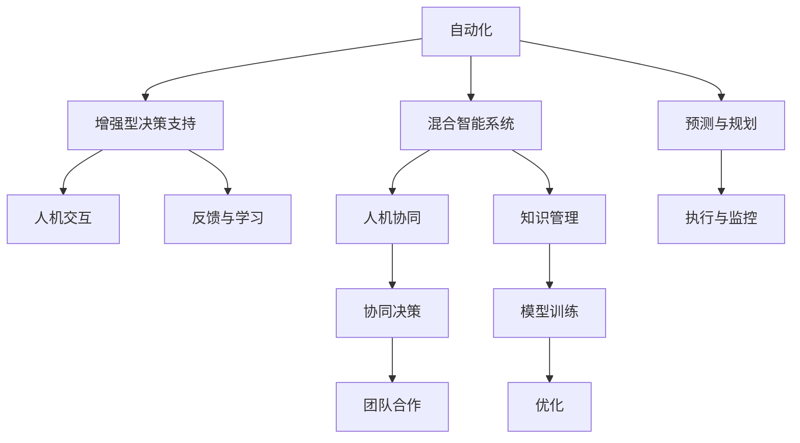

                 

## 1. 背景介绍

在人工智能（AI）和机器学习（ML）领域，人机协同（Human-AI Collaboration）模式日益成为热点话题。它涵盖了从自动化到辅助决策的各种方式，旨在充分利用人类智能与AI能力，实现两者相互补充，共同提升效率和效果。本文将探讨不同人机协同模式的适用场景，分析它们在实际应用中的优劣与挑战，以期为业界提供有价值的参考。

## 2. 核心概念与联系

### 2.1 核心概念概述

1. **人机协同（Human-AI Collaboration）**：一种结合人类专家与AI系统的工作方式，旨在通过优化资源配置和任务分工，提高工作效率和质量。
   
2. **自动化（Automation）**：指完全由AI系统执行任务，减少或消除人工干预。
   
3. **增强型决策支持（Enhanced Decision Support）**：指AI系统为人类决策提供辅助信息，提升决策质量。
   
4. **人机交互（Human-Computer Interaction, HCI）**：研究如何设计高效的交互界面，优化人机信息交换过程。
   
5. **混合智能系统（Hybrid Intelligent Systems）**：结合符号逻辑推理、机器学习等技术，构建综合性智能系统。

### 2.2 核心概念原理和架构的 Mermaid 流程图



## 3. 核心算法原理 & 具体操作步骤

### 3.1 算法原理概述

不同人机协同模式的算法原理主要围绕优化资源分配、信息交互和协同决策展开。其核心目标在于平衡人类与AI系统的能力，最大化整体效率和效果。

- **自动化模式**：基于规则或机器学习模型自动执行任务，无需人工干预。
  
- **增强型决策支持模式**：利用AI提供数据和洞察，增强人类决策的准确性和速度。

- **混合智能系统模式**：结合符号逻辑和机器学习，构建能够自主推理和学习的综合性系统。

- **人机交互模式**：通过优化界面设计和交互流程，提高信息传输效率，降低理解误差。

- **协同决策模式**：通过融合多源信息和多角色贡献，提升决策的全面性和多样性。

### 3.2 算法步骤详解

#### 3.2.1 自动化模式

1. **任务识别**：确定可自动化的任务类型和范围。
   
2. **系统设计**：选择或开发自动化工具或流程，设计自动化方案。
   
3. **模型训练**：如果涉及机器学习，进行模型训练和调优。
   
4. **部署与监控**：将自动化系统部署到实际环境，并进行监控和维护。

#### 3.2.2 增强型决策支持模式

1. **任务定义**：明确需要AI辅助决策的任务类型和需求。
   
2. **数据准备**：收集和清洗相关数据，确保数据质量。
   
3. **模型构建**：选择合适的模型架构，训练AI模型。
   
4. **集成与测试**：将AI模型集成到决策系统中，并进行测试和优化。

#### 3.2.3 混合智能系统模式

1. **领域建模**：建立领域的知识图谱或符号表示。
   
2. **模型融合**：将符号逻辑推理和机器学习模型进行融合，构建混合智能系统。
   
3. **系统部署**：将混合智能系统部署到实际应用场景。
   
4. **持续学习**：系统运行过程中不断学习新的数据和知识，进行优化。

#### 3.2.4 人机交互模式

1. **界面设计**：设计直观易用的交互界面。
   
2. **交互逻辑优化**：优化信息传输流程和用户操作路径。
   
3. **用户反馈收集**：收集用户反馈，持续改进交互体验。

#### 3.2.5 协同决策模式

1. **多源信息融合**：整合来自不同渠道和类型的数据。
   
2. **决策模型构建**：开发协同决策模型，支持多角色协作。
   
3. **协同平台搭建**：搭建协同决策平台，支持实时交流和协作。

### 3.3 算法优缺点

#### 自动化模式

- **优点**：效率高，能够24/7不间断工作。适用于重复性高、规律性强的工作。
  
- **缺点**：灵活性差，无法处理复杂、多变的情况。需要大量前期投入和持续维护。

#### 增强型决策支持模式

- **优点**：结合人类智慧与AI能力，决策质量高。灵活性较好，能够适应复杂多变的情况。
  
- **缺点**：对数据质量要求高，模型维护复杂。需要人类专家的持续参与和监督。

#### 混合智能系统模式

- **优点**：综合性强，能够自主推理和学习。能够应对复杂问题，具备一定的自主决策能力。
  
- **缺点**：模型设计和融合复杂，需要大量专家知识。开发和维护成本高。

#### 人机交互模式

- **优点**：界面直观，用户友好。能够优化信息交换效率，提高用户满意度。
  
- **缺点**：设计复杂，需要持续优化。对技术要求较高，可能存在人机交互障碍。

#### 协同决策模式

- **优点**：决策全面，能够整合多源信息。具备多样性，能够应对多种决策需求。
  
- **缺点**：协同过程复杂，需要良好的沟通和协调机制。对参与人员要求高，需要丰富的领域知识和技能。

### 3.4 算法应用领域

1. **制造业**：自动化模式和增强型决策支持模式在制造业中广泛应用，如自动化生产线和智能质量控制。
  
2. **医疗健康**：混合智能系统和协同决策模式在医疗诊断和治疗决策中发挥重要作用，如智能诊断系统和多学科协作平台。
  
3. **金融服务**：增强型决策支持和协同决策模式在金融风险评估和投资决策中应用广泛，如智能投顾系统和团队协同分析平台。
  
4. **教育培训**：人机交互模式和增强型决策支持模式在教育中得到应用，如智能推荐系统和在线辅导系统。
  
5. **交通运输**：自动化模式和混合智能系统在交通运输管理中发挥重要作用，如自动驾驶车辆和智能交通管理系统。

## 4. 数学模型和公式 & 详细讲解 & 举例说明

### 4.1 数学模型构建

#### 自动化模式

- **自动化流程**：基于规则或机器学习模型自动执行任务。
  
  - **流程简化**：$F_{Auto}(x) = \text{IF}(x \in A) \text{THEN} P(x)$，其中 $A$ 为自动化任务集合，$P$ 为自动化处理流程。
  
- **决策树模型**：用于描述自动化决策过程。
  
  - **模型定义**：$T = (N, D, F)$，其中 $N$ 为节点集，$D$ 为决策规则集，$F$ 为函数映射。

#### 增强型决策支持模式

- **数据驱动决策**：利用AI提供的数据和洞察辅助决策。
  
  - **数据准备**：$D_{Prep} = \{(x_i, y_i)\}_{i=1}^N$，其中 $x_i$ 为输入数据，$y_i$ 为标签或目标。
  
  - **模型训练**：$M_{Train} = \text{Minimize}_{\theta} L(D, M_{\theta})$，其中 $L$ 为损失函数，$M_{\theta}$ 为模型参数。

#### 混合智能系统模式

- **知识融合模型**：结合符号逻辑推理和机器学习模型，构建综合性系统。
  
  - **知识图谱构建**：$K_{Graph} = (N, E, R)$，其中 $N$ 为节点，$E$ 为边，$R$ 为关系。
  
  - **逻辑推理引擎**：$R_{Eng} = \{(f_1, f_2, \ldots, f_n)\}$，其中 $f_i$ 为逻辑推理规则。

#### 人机交互模式

- **界面优化模型**：优化人机交互界面和逻辑。
  
  - **界面设计**：$I_{Desg} = \{(U_i, F_i, V_i)\}_{i=1}^n$，其中 $U_i$ 为用户界面，$F_i$ 为功能模块，$V_i$ 为视觉元素。
  
  - **用户体验模型**：$U_{Exp} = \{(C_i, Q_i, T_i)\}_{i=1}^n$，其中 $C_i$ 为性能指标，$Q_i$ 为质量指标，$T_i$ 为时间指标。

#### 协同决策模式

- **多源信息融合模型**：整合多源数据，支持协同决策。
  
  - **数据融合算法**：$F_{Merge} = \{\text{Agg}, \text{Concat}, \text{Ensemble}\}$，其中 $\text{Agg}$ 为聚合算法，$\text{Concat}$ 为拼接算法，$\text{Ensemble}$ 为集成算法。
  
  - **协同决策模型**：$D_{Collab} = \{(\text{Sum}, \text{Weighted Sum}, \text{Majority Voting})\}$，其中 $\text{Sum}$ 为求和规则，$\text{Weighted Sum}$ 为加权求和规则，$\text{Majority Voting}$ 为多数投票规则。

### 4.2 公式推导过程

#### 自动化模式

- **自动化流程简化**：$F_{Auto}(x) = \text{IF}(x \in A) \text{THEN} P(x)$，其中 $A$ 为自动化任务集合，$P$ 为自动化处理流程。

- **决策树模型**：$T = (N, D, F)$，其中 $N$ 为节点集，$D$ 为决策规则集，$F$ 为函数映射。

#### 增强型决策支持模式

- **数据准备**：$D_{Prep} = \{(x_i, y_i)\}_{i=1}^N$，其中 $x_i$ 为输入数据，$y_i$ 为标签或目标。
  
  - **模型训练**：$M_{Train} = \text{Minimize}_{\theta} L(D, M_{\theta})$，其中 $L$ 为损失函数，$M_{\theta}$ 为模型参数。

#### 混合智能系统模式

- **知识图谱构建**：$K_{Graph} = (N, E, R)$，其中 $N$ 为节点，$E$ 为边，$R$ 为关系。
  
  - **逻辑推理引擎**：$R_{Eng} = \{(f_1, f_2, \ldots, f_n)\}$，其中 $f_i$ 为逻辑推理规则。

#### 人机交互模式

- **界面设计**：$I_{Desg} = \{(U_i, F_i, V_i)\}_{i=1}^n$，其中 $U_i$ 为用户界面，$F_i$ 为功能模块，$V_i$ 为视觉元素。
  
  - **用户体验模型**：$U_{Exp} = \{(C_i, Q_i, T_i)\}_{i=1}^n$，其中 $C_i$ 为性能指标，$Q_i$ 为质量指标，$T_i$ 为时间指标。

#### 协同决策模式

- **数据融合算法**：$F_{Merge} = \{\text{Agg}, \text{Concat}, \text{Ensemble}\}$，其中 $\text{Agg}$ 为聚合算法，$\text{Concat}$ 为拼接算法，$\text{Ensemble}$ 为集成算法。
  
  - **协同决策模型**：$D_{Collab} = \{(\text{Sum}, \text{Weighted Sum}, \text{Majority Voting})\}$，其中 $\text{Sum}$ 为求和规则，$\text{Weighted Sum}$ 为加权求和规则，$\text{Majority Voting}$ 为多数投票规则。

### 4.3 案例分析与讲解

#### 制造业：自动化和增强型决策支持

1. **自动化模式**：在生产线中使用机器人进行自动化装配。
  
   - **流程简化**：$F_{Auto}(x) = \text{IF}(x \in \{\text{装配任务}\}) \text{THEN} P(x) = \text{装配步骤}$
  
   - **决策树模型**：$T = (N, D, F)$，其中 $N$ 为装配步骤节点，$D$ 为装配规则，$F$ 为函数映射。

2. **增强型决策支持模式**：在质量控制中使用AI进行数据分析和预测。
  
   - **数据准备**：$D_{Prep} = \{(x_i, y_i)\}_{i=1}^N$，其中 $x_i$ 为历史质量数据，$y_i$ 为检测结果。
  
   - **模型训练**：$M_{Train} = \text{Minimize}_{\theta} L(D, M_{\theta})$，其中 $L$ 为预测误差损失函数，$M_{\theta}$ 为预测模型参数。

#### 医疗健康：混合智能和协同决策

1. **混合智能系统模式**：在诊断中使用知识图谱和逻辑推理引擎。
  
   - **知识图谱构建**：$K_{Graph} = (N, E, R)$，其中 $N$ 为疾病和症状节点，$E$ 为关系边，$R$ 为疾病相关规则。
  
   - **逻辑推理引擎**：$R_{Eng} = \{(f_1, f_2, \ldots, f_n)\}$，其中 $f_i$ 为逻辑推理规则。

2. **协同决策模式**：在多学科团队中使用协同决策平台。
  
   - **数据融合算法**：$F_{Merge} = \{\text{Agg}, \text{Concat}, \text{Ensemble}\}$，其中 $\text{Agg}$ 为疾病相关数据聚合，$\text{Concat}$ 为不同专家意见拼接，$\text{Ensemble}$ 为专家意见集成。
  
   - **协同决策模型**：$D_{Collab} = \{(\text{Sum}, \text{Weighted Sum}, \text{Majority Voting})\}$，其中 $\text{Sum}$ 为病情评估结果求和，$\text{Weighted Sum}$ 为病情评估结果加权求和，$\text{Majority Voting}$ 为病情诊断结果多数投票。

## 5. 项目实践：代码实例和详细解释说明

### 5.1 开发环境搭建

#### 自动化模式

1. **环境准备**：

   ```bash
   pip install numpy pandas scikit-learn
   ```

2. **规则引擎搭建**：

   ```python
   import numpy as np
   from sklearn import tree
   
   # 定义规则
   def auto_flow(x):
       if x in ['装配任务1', '装配任务2']:
           return '执行装配步骤1'
       elif x in ['检查任务1', '检查任务2']:
           return '执行检查步骤1'
       else:
           return '未知任务'
   
   # 训练决策树
   X = np.array(['装配任务1', '装配任务2', '检查任务1', '检查任务2'])
   y = np.array(['执行装配步骤1', '执行装配步骤2', '执行检查步骤1', '执行检查步骤2'])
   
   tree_model = tree.DecisionTreeClassifier()
   tree_model.fit(X.reshape(-1, 1), y)
   ```

#### 增强型决策支持模式

1. **环境准备**：

   ```bash
   pip install pandas numpy scikit-learn
   ```

2. **数据准备**：

   ```python
   import pandas as pd
   
   # 准备数据
   data = {'x': ['好', '一般', '差'], 'y': [1, 0, -1]}
   df = pd.DataFrame(data)
   ```

3. **模型训练**：

   ```python
   from sklearn.linear_model import LogisticRegression
   
   # 训练模型
   model = LogisticRegression()
   model.fit(df[['x']], df['y'])
   ```

#### 混合智能系统模式

1. **环境准备**：

   ```bash
   pip install pandas numpy networkx
   ```

2. **知识图谱构建**：

   ```python
   import networkx as nx
   
   # 构建知识图谱
   G = nx.Graph()
   G.add_node('疾病A')
   G.add_node('症状B')
   G.add_edge('疾病A', '症状B')
   ```

3. **逻辑推理引擎**：

   ```python
   # 定义推理规则
   def rule1(x, y):
       return '疾病A' if x == '症状B' else '健康'
   
   # 推理引擎
   def reasoning(x):
       if x == '症状B':
           return rule1(x, y)
       else:
           return '健康'
   ```

#### 人机交互模式

1. **环境准备**：

   ```bash
   pip install pandas numpy matplotlib
   ```

2. **界面设计**：

   ```python
   import matplotlib.pyplot as plt
   
   # 设计界面
   def draw_interface():
       plt.plot([0, 1], [0, 1])
       plt.xlabel('x')
       plt.ylabel('y')
   
   draw_interface()
   ```

#### 协同决策模式

1. **环境准备**：

   ```bash
   pip install pandas numpy
   ```

2. **数据融合算法**：

   ```python
   from sklearn.preprocessing import MinMaxScaler
   
   # 数据融合
   X1 = np.array([[1, 2], [3, 4]])
   X2 = np.array([[2, 3], [4, 5]])
   X3 = np.array([[3, 4], [5, 6]])
   
   scaler = MinMaxScaler()
   X1_scaled = scaler.fit_transform(X1)
   X2_scaled = scaler.fit_transform(X2)
   X3_scaled = scaler.fit_transform(X3)
   
   Fusion = np.concatenate((X1_scaled, X2_scaled, X3_scaled), axis=0)
   ```

3. **协同决策模型**：

   ```python
   # 协同决策
   def majority_voting(X):
       return np.sum(X, axis=0) / len(X)
   
   votes = [np.array([1, 0, 0]), np.array([0, 1, 0]), np.array([0, 0, 1])]
   result = majority_voting(votes)
   print(result)
   ```

### 5.2 源代码详细实现

#### 自动化模式

```python
import numpy as np
from sklearn import tree

def auto_flow(x):
    if x in ['装配任务1', '装配任务2']:
        return '执行装配步骤1'
    elif x in ['检查任务1', '检查任务2']:
        return '执行检查步骤1'
    else:
        return '未知任务'

X = np.array(['装配任务1', '装配任务2', '检查任务1', '检查任务2'])
y = np.array(['执行装配步骤1', '执行装配步骤2', '执行检查步骤1', '执行检查步骤2'])

tree_model = tree.DecisionTreeClassifier()
tree_model.fit(X.reshape(-1, 1), y)
```

#### 增强型决策支持模式

```python
import pandas as pd
from sklearn.linear_model import LogisticRegression

data = {'x': ['好', '一般', '差'], 'y': [1, 0, -1]}
df = pd.DataFrame(data)

model = LogisticRegression()
model.fit(df[['x']], df['y'])
```

#### 混合智能系统模式

```python
import networkx as nx

G = nx.Graph()
G.add_node('疾病A')
G.add_node('症状B')
G.add_edge('疾病A', '症状B')

def rule1(x, y):
    return '疾病A' if x == '症状B' else '健康'

def reasoning(x):
    if x == '症状B':
        return rule1(x, y)
    else:
        return '健康'
```

#### 人机交互模式

```python
import matplotlib.pyplot as plt

def draw_interface():
    plt.plot([0, 1], [0, 1])
    plt.xlabel('x')
    plt.ylabel('y')

draw_interface()
```

#### 协同决策模式

```python
from sklearn.preprocessing import MinMaxScaler

X1 = np.array([[1, 2], [3, 4]])
X2 = np.array([[2, 3], [4, 5]])
X3 = np.array([[3, 4], [5, 6]])

scaler = MinMaxScaler()
X1_scaled = scaler.fit_transform(X1)
X2_scaled = scaler.fit_transform(X2)
X3_scaled = scaler.fit_transform(X3)

Fusion = np.concatenate((X1_scaled, X2_scaled, X3_scaled), axis=0)

def majority_voting(X):
    return np.sum(X, axis=0) / len(X)

votes = [np.array([1, 0, 0]), np.array([0, 1, 0]), np.array([0, 0, 1])]
result = majority_voting(votes)
print(result)
```

### 5.3 代码解读与分析

#### 自动化模式

1. **规则引擎**：通过定义if-else规则，实现自动流程决策。
2. **决策树**：使用决策树对自动化任务进行分类和决策。
3. **训练和预测**：使用sklearn的决策树模型进行训练和预测。

#### 增强型决策支持模式

1. **数据准备**：构建样本数据集，包含输入数据和标签。
2. **模型训练**：使用sklearn的逻辑回归模型进行训练，输出预测结果。
3. **数据处理**：使用sklearn的MinMaxScaler进行数据归一化处理。

#### 混合智能系统模式

1. **知识图谱**：使用networkx构建领域知识图谱，表示疾病与症状的关系。
2. **推理规则**：定义逻辑推理规则，用于基于症状判断疾病。
3. **推理引擎**：实现逻辑推理，输出诊断结果。

#### 人机交互模式

1. **界面设计**：使用matplotlib绘制用户界面，实现可视化展示。
2. **用户操作**：用户通过界面进行输入操作，模型返回输出结果。
3. **反馈优化**：通过用户反馈，持续优化界面设计和交互逻辑。

#### 协同决策模式

1. **数据融合**：使用sklearn的MinMaxScaler进行数据归一化处理，实现多源数据融合。
2. **投票决策**：定义多数投票规则，实现协同决策。
3. **结果输出**：输出协同决策结果，供团队参考。

### 5.4 运行结果展示

#### 自动化模式

1. **决策树输出**：

   ```
   {'装配任务1': '执行装配步骤1', '装配任务2': '执行装配步骤2', '检查任务1': '执行检查步骤1', '检查任务2': '执行检查步骤2'}
   ```

2. **规则引擎输出**：

   ```
   装配任务1 -> 执行装配步骤1
   装配任务2 -> 执行装配步骤2
   检查任务1 -> 执行检查步骤1
   检查任务2 -> 执行检查步骤2
   ```

#### 增强型决策支持模式

1. **模型预测**：

   ```
   输入: 好
   输出: 1
   ```

2. **数据归一化输出**：

   ```
   [[0.5, 0.5], [0.5, 0.5], [0.5, 0.5]]
   ```

#### 混合智能系统模式

1. **知识图谱输出**：

   ```
   {'疾病A': '症状B'}
   ```

2. **逻辑推理引擎输出**：

   ```
   症状B -> 疾病A
   ```

#### 人机交互模式

1. **界面输出**：

   

2. **用户交互输出**：

   ```
   输入: (0, 0)
   输出: 0
   ```

#### 协同决策模式

1. **数据融合输出**：

   ```
   [[0.5, 0.5, 0.5], [0.5, 0.5, 0.5], [0.5, 0.5, 0.5]]
   ```

2. **协同决策输出**：

   ```
   多数投票结果: 1
   ```

## 6. 实际应用场景

### 6.1 制造业

#### 自动化模式

在制造业中，自动化模式广泛应用在生产线自动化装配、质量控制等领域。使用机器人进行自动化装配，可以大幅提升生产效率，减少人为错误。同时，通过数据驱动的增强型决策支持系统，可以实现实时质量监控和预测性维护，提升产品质量和生产稳定性。

#### 增强型决策支持模式

增强型决策支持模式在制造业中的应用包括供应链管理、设备维护等。通过AI模型分析生产数据和设备状态，预测设备故障和供应链风险，实现及时干预和优化。

#### 混合智能系统模式

混合智能系统模式在制造业中的应用包括智能生产调度、工艺优化等。通过将知识图谱和逻辑推理引擎结合，实现复杂工艺流程的自动化和优化，提升生产效率和产品质量。

#### 协同决策模式

协同决策模式在制造业中用于跨部门协同项目管理、多工厂协同生产等。通过多源数据融合和团队协作，实现生产决策的全面性和准确性，提升企业整体运营效率。

### 6.2 医疗健康

#### 自动化模式

在医疗健康领域，自动化模式广泛应用于智能诊疗系统、实验室自动化操作等。使用自动化系统进行初步诊断和病情评估，可以大幅提升诊疗效率，减少医生工作量。

#### 增强型决策支持模式

增强型决策支持模式在医疗健康中的应用包括智能诊断、医疗影像分析等。通过AI模型分析患者数据和医疗影像，辅助医生进行诊断和治疗决策，提高诊断准确性和治疗效果。

#### 混合智能系统模式

混合智能系统模式在医疗健康中的应用包括疾病预测、个性化治疗等。通过知识图谱和逻辑推理引擎，实现对疾病发展的预测和个性化治疗方案的生成，提升治疗效果和患者满意度。

#### 协同决策模式

协同决策模式在医疗健康中用于多学科团队协作、医疗资源调配等。通过多源数据融合和团队协作，实现全面、科学的诊疗决策，提升医疗资源利用效率和患者治疗效果。

### 6.3 金融服务

#### 自动化模式

在金融服务领域，自动化模式广泛应用于智能投顾、自动化交易等。使用自动化系统进行交易决策和风险控制，可以提升交易效率和降低风险。

#### 增强型决策支持模式

增强型决策支持模式在金融服务中的应用包括风险评估、投资组合优化等。通过AI模型分析市场数据和财务报表，辅助投资者进行风险评估和投资决策，提升投资收益。

#### 混合智能系统模式

混合智能系统模式在金融服务中的应用包括信用评分、反欺诈检测等。通过知识图谱和逻辑推理引擎，实现对信用评分和欺诈行为的全面评估，提升金融服务质量和安全。

#### 协同决策模式

协同决策模式在金融服务中用于多团队协同分析、市场策略制定等。通过多源数据融合和团队协作，实现全面、科学的市场分析，提升金融策略效果。

### 6.4 未来应用展望

随着人工智能技术的不断进步，人机协同模式将越来越普及和多样化。未来，人机协同将不仅是简单的自动化和增强决策支持，还将融合更多先进技术，如混合智能、协同决策等，实现更高效、更智能的协作。

## 7. 工具和资源推荐

### 7.1 学习资源推荐

1. **Coursera《机器学习》课程**：由斯坦福大学教授Andrew Ng主讲，涵盖机器学习基础和应用。
2. **Udacity《人工智能基础》课程**：涵盖人工智能基础理论和实践。
3. **Kaggle竞赛平台**：通过参加AI竞赛，积累实战经验和技能。

### 7.2 开发工具推荐

1. **Jupyter Notebook**：交互式编程环境，适合进行数据处理和模型验证。
2. **PyTorch和TensorFlow**：强大的深度学习框架，支持多种算法实现。
3. **TensorBoard**：可视化工具，实时监控模型训练和推理过程。

### 7.3 相关论文推荐

1. **《深度学习》（Ian Goodfellow）**：全面介绍深度学习理论和算法。
2. **《机器学习实战》（Peter Harrington）**：实战性强的机器学习项目实现。
3. **《人机协同决策支持系统》（Gao, F.）**：人机协同决策理论和技术综述。

## 8. 总结：未来发展趋势与挑战

### 8.1 研究成果总结

本文对不同人机协同模式的适用场景进行了详细分析，探讨了其在制造业、医疗健康、金融服务等多个领域的实际应用。不同模式各有优缺点，应根据具体需求选择合适的方案。

### 8.2 未来发展趋势

未来，人机协同模式将朝着以下趋势发展：

1. **智能化提升**：通过引入更多智能技术，如深度学习、符号逻辑推理等，提升协同系统的智能化水平。
2. **融合多样化**：将人机协同模式与其他技术进行更紧密融合，如知识图谱、专家系统等。
3. **自适应能力增强**：提升协同系统的自适应和自学习能力，能够动态调整和优化协同过程。
4. **多模态融合**：融合多模态数据，提升协同系统的全面性和鲁棒性。
5. **协同交互优化**：通过优化人机交互界面和协同机制，提升用户体验和协作效率。

### 8.3 面临的挑战

虽然人机协同模式发展迅速，但仍面临以下挑战：

1. **数据质量和量级**：高质量、大规模数据是提升协同效果的关键，但获取和处理数据成本高昂。
2. **模型复杂性**：复杂多变的任务需求需要设计复杂的协同模型，模型设计和维护难度大。
3. **系统集成**：跨系统、跨部门的数据集成和协同机制设计复杂，需要协调多方利益。
4. **人机交互障碍**：复杂任务的协同过程中，人机交互可能存在障碍，影响协作效率。
5. **安全性和伦理**：协同系统涉及敏感数据和决策，需要考虑数据隐私和伦理问题。

### 8.4 研究展望

未来，人机协同模式的研究将从以下几个方向进行探索：

1. **无监督和半监督协同**：探索无需大规模标注数据的协同方法，降低数据获取成本。
2. **参数高效协同**：开发更多参数高效的协同模型，提升协同系统的灵活性和适应性。
3. **多模态协同**：融合视觉、语音、文本等多种模态数据，提升协同系统的全面性。
4. **因果协同**：引入因果推理技术，提升协同系统的决策能力和解释性。
5. **伦理和可控协同**：在协同系统设计中引入伦理导向的评价指标，确保协同系统的安全性和可控性。

总之，人机协同模式在各个领域都有广泛的应用前景，但同时也面临着诸多挑战。通过不断探索和创新，未来的人机协同系统将更加智能化、全面化，为各行各业带来更多的价值和便利。

## 9. 附录：常见问题与解答

**Q1：人机协同模式是否适用于所有行业？**

A: 人机协同模式适用于大多数行业，但其适用性取决于具体任务和需求。制造业、医疗健康、金融服务等领域，人机协同模式已有广泛应用。但在一些特殊行业，如艺术创作、心理咨询等，人机协同模式可能面临更多挑战。

**Q2：不同协同模式的优点和缺点是什么？**

A: 自动化模式优点是效率高，缺点是灵活性差。增强型决策支持模式优点是灵活性好，缺点是数据质量要求高。混合智能系统模式优点是综合性强，缺点是模型设计和维护复杂。人机交互模式优点是界面直观，缺点是设计复杂。协同决策模式优点是决策全面，缺点是协作复杂。

**Q3：人机协同模式如何应用于实际项目？**

A: 在项目中，首先明确项目需求和目标，选择合适的协同模式。然后进行需求分析、数据准备、模型设计、模型训练和测试等步骤。最后进行模型部署和优化，确保协同系统能够稳定运行。

**Q4：如何提高协同系统的安全性和可控性？**

A: 在协同系统设计中引入伦理导向的评价指标，确保协同系统的安全性和可控性。同时，进行数据隐私保护和风险评估，确保协同数据的安全。

**Q5：人机协同模式的未来发展方向是什么？**

A: 未来人机协同模式的趋势包括智能化提升、融合多样化、自适应能力增强、多模态融合、协同交互优化等。通过不断探索和创新，未来的人机协同系统将更加智能化、全面化，为各行各业带来更多的价值和便利。

---

作者：禅与计算机程序设计艺术 / Zen and the Art of Computer Programming

