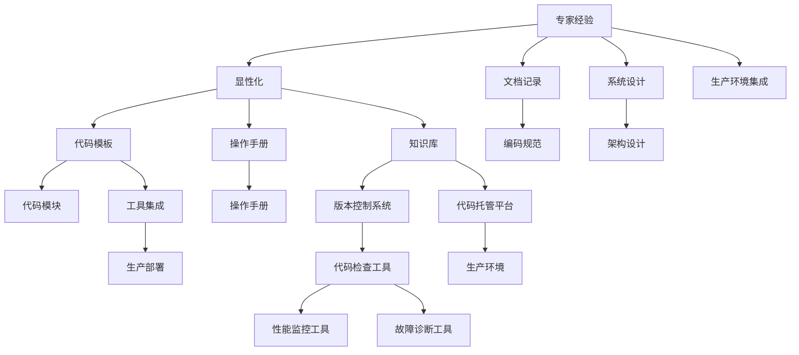

                 

# 专家经验在生产中的固化

> 关键词：专家经验,固化,生产,机器学习,生产环境,模型优化,数据处理,高性能计算

## 1. 背景介绍

### 1.1 问题由来

在现代软件开发和系统运维中，专家经验与正式的代码库和文档同等重要。专家经验源自长期积累的工作实践，蕴含着宝贵的知识和技能，是企业竞争力的重要组成部分。然而，专家经验常常以隐性的形式存在于个别工程师的头脑中，难以传递、共享和复用，因而成为软件开发和运维中的瓶颈。

### 1.2 问题核心关键点

为解决专家经验在生产中的固化问题，需要将专家经验显性化、系统化，使其能够被持续地积累、复用、优化。这不仅需要精细化的编码和文档工作，还需要有效的工具和机制支持。

专家经验固化的核心点在于：
1. **编码标准化**：通过代码模板、注释、命名规范等方式，将专家经验固化为代码级别的显性知识。
2. **文档记录**：编写详细的注释、操作手册、故障排除指南等，将专家经验封装为文档级别的显性知识。
3. **工具集成**：使用代码检查工具、版本控制系统、代码托管平台等，将专家经验嵌入到生产流程中，实现知识传承和持续优化。
4. **系统设计**：在软件设计和架构中，集成专家经验，实现功能模块和架构设计的合理性和先进性。

### 1.3 问题研究意义

专家经验在生产中的固化，对提升开发和运维效率、降低错误率、缩短项目周期具有重要意义：

1. **提升开发效率**：通过固化专家经验，开发人员可以迅速上手复杂任务，减少学习曲线，提高生产率。
2. **降低错误率**：专家经验中蕴含着丰富的实践智慧，可以减少开发和运维中的常见错误，提高系统的稳定性和可靠性。
3. **缩短项目周期**：通过复用专家经验，可以减少重复工作，加快项目开发和交付速度。
4. **实现知识传承**：将专家经验固化到系统和工具中，实现知识的长期保存和传递，促进团队的成长和发展。
5. **支持系统创新**：系统架构和功能模块的设计往往深受专家经验影响，固化专家经验有助于实现系统的先进性和创新性。

## 2. 核心概念与联系

### 2.1 核心概念概述

为更好地理解专家经验在生产中的固化方法，本节将介绍几个密切相关的核心概念：

- **专家经验**：源自长期实践积累的知识和技能，通常以隐性知识的形式存在于个体工程师的头脑中。
- **显性化**：将隐性的专家经验转化为显性的知识形式，如代码、文档、知识库等。
- **知识复用**：将显性的专家经验通过工具和平台，嵌入到生产流程中，实现知识传递和复用。
- **持续优化**：通过反馈机制和迭代流程，不断更新和完善固化在系统和工具中的专家经验。

这些概念之间的关系可以通过以下Mermaid流程图来展示：



这个流程图展示了专家经验在生产中的固化流程：

1. 专家经验通过显性化转化为代码模板、操作手册、知识库等形式。
2. 代码模板和文档记录通过版本控制系统、代码托管平台嵌入生产流程中。
3. 系统设计和架构设计融合专家经验，提升系统的合理性和创新性。
4. 工具集成和性能监控、故障诊断等手段，支持生产环境的持续优化。

## 3. 核心算法原理 & 具体操作步骤
### 3.1 算法原理概述

专家经验在生产中的固化过程，本质上是对隐性知识进行显性化、系统化和持续优化的过程。其核心算法原理可以总结如下：

1. **显性化算法**：通过代码模板、注释、命名规范等方式，将专家经验固化到代码中。
2. **系统化算法**：将显性化的专家经验转化为操作手册、知识库等文档形式，形成系统的知识库。
3. **复用化算法**：通过版本控制系统、代码托管平台等工具，将知识库嵌入生产流程中，实现知识的传递和复用。
4. **持续化算法**：通过反馈机制和迭代流程，不断更新和完善知识库，保持其时效性和实用性。

### 3.2 算法步骤详解

专家经验在生产中的固化，通常包括以下几个关键步骤：

**Step 1: 知识收集与整理**
- 对专家进行访谈，了解其日常工作中的常见问题和解决方案。
- 记录专家日常使用的工具、技巧、最佳实践等。
- 对收集到的信息进行整理和分类，确定关键知识和经验。

**Step 2: 知识显性化**
- 将专家经验转化为代码模板、注释、命名规范等形式，固化到代码中。
- 编写详细的操作手册和故障排除指南，封装为文档形式的显性知识。
- 将显性化的知识整理成知识库，供团队成员查阅和参考。

**Step 3: 知识复用**
- 将知识库通过版本控制系统（如Git）进行管理，确保知识的持续更新和追踪。
- 将代码模板和操作手册集成到开发环境中，提供自动提示和建议。
- 使用代码托管平台（如Github）进行代码托管和版本控制，实现知识传递和复用。

**Step 4: 知识优化**
- 通过代码检查工具（如SonarQube）检测代码质量，确保代码遵循最佳实践。
- 通过性能监控工具（如Prometheus）监控系统性能，实时发现和解决问题。
- 通过故障诊断工具（如ELK Stack）收集和分析故障信息，提升系统可靠性。
- 通过迭代和反馈机制，不断更新和完善知识库，保持其时效性和实用性。

### 3.3 算法优缺点

专家经验在生产中的固化方法，具有以下优点：
1. 系统化存储：通过知识库等形式，将专家经验系统化存储，方便长期保存和传承。
2. 工具化集成：将专家经验嵌入到开发和运维工具中，实现知识的传递和复用。
3. 自动化优化：通过自动化的工具和流程，不断优化和更新知识库，保持其先进性和实用性。
4. 一致性保障：通过版本控制系统等机制，确保知识库的一致性和可追溯性。
5. 可扩展性：知识库和工具可以灵活扩展，支持多种技术和场景的集成。

同时，该方法也存在一定的局限性：
1. 依赖专家能力：需要具备丰富经验和知识的专家来挖掘和整理知识，成本较高。
2. 需要人工介入：显性化和复用过程需要人工干预，效率可能受限。
3. 知识更新滞后：知识库的更新和优化需要持续的投入和维护，可能滞后于技术的发展。
4. 适用场景有限：对于动态变化和新兴技术，知识库的覆盖和更新可能不够全面。

尽管存在这些局限性，但就目前而言，专家经验在生产中的固化方法仍是软件开发和运维中不可或缺的一部分。

### 3.4 算法应用领域

专家经验在生产中的固化方法，在软件开发和运维中有着广泛的应用，具体包括：

- **软件开发**：编码规范、代码模板、注释文档、操作手册、测试用例等。
- **系统运维**：故障排查指南、操作流程、监控指标、日志分析、性能调优等。
- **项目管理**：需求分析、流程设计、项目管理工具、版本控制等。
- **用户支持**：FAQ、用户手册、常见问题解答、服务指南等。

## 4. 数学模型和公式 & 详细讲解 & 举例说明

### 4.1 数学模型构建

为更好地理解专家经验在生产中的固化过程，本节将介绍几个相关的数学模型：

1. **代码质量评估模型**：通过代码行数、复杂度、重复行比例等指标，评估代码质量。
2. **性能监控模型**：通过请求响应时间、系统负载、内存占用等指标，监控系统性能。
3. **故障诊断模型**：通过日志分析、异常检测等手段，诊断系统故障。
4. **知识库更新模型**：通过反馈机制和迭代流程，更新知识库中的信息和建议。

这些数学模型可以表达为以下形式：

1. **代码质量评估模型**：
   $$
   Q = \frac{C}{R} + \frac{D}{S}
   $$
   其中 $C$ 为代码行数，$R$ 为复杂度，$D$ 为重复行比例，$S$ 为测试用例覆盖率。

2. **性能监控模型**：
   $$
   P = \frac{T_0}{T_1} \times \frac{L}{S}
   $$
   其中 $T_0$ 为请求响应时间，$T_1$ 为目标响应时间，$L$ 为系统负载，$S$ 为内存占用。

3. **故障诊断模型**：
   $$
   F = \sum_i (\log E_i + \log D_i)
   $$
   其中 $E_i$ 为日志事件数，$D_i$ 为日志事件的严重程度。

4. **知识库更新模型**：
   $$
   U = \frac{R}{T} + \frac{I}{M}
   $$
   其中 $R$ 为知识库中的规则数量，$T$ 为规则的时效性，$I$ 为新增信息的数量，$M$ 为知识的复用次数。

### 4.2 公式推导过程

以下我们以代码质量评估模型为例，推导其计算公式：

假设代码库中共有 $N$ 行代码，其中 $C_i$ 为第 $i$ 行的复杂度，$R_i$ 为第 $i$ 行的重复行比例。则代码质量 $Q$ 可以表示为：

$$
Q = \frac{C}{R} = \frac{\sum_{i=1}^N C_i}{\sum_{i=1}^N R_i}
$$

其中，$C_i$ 的计算公式为：

$$
C_i = \frac{\text{函数数量}_i + \text{条件语句数量}_i + \text{循环数量}_i}{\text{行数量}_i}
$$

通过将代码质量模型嵌入到代码检查工具中，可以快速计算出代码库的整体质量，指导开发人员优化代码。

### 4.3 案例分析与讲解

以一个简单的代码库为例，分析如何使用数学模型进行代码质量评估。

假设有一个包含 1000 行代码的库，其中函数的平均复杂度为 10，条件的平均复杂度为 3，循环的平均复杂度为 5。同时，条件语句的平均重复行比例为 0.2，循环语句的平均重复行比例为 0.1。计算代码质量 $Q$：

$$
Q = \frac{\sum_{i=1}^N C_i}{\sum_{i=1}^N R_i} = \frac{1000 \times 10 + 1000 \times 3 + 1000 \times 5}{1000 \times 0.2 + 1000 \times 0.1} = 18.75
$$

分析结果表明，代码库的整体质量为 18.75，略低于目标值 20。开发人员需要进一步优化代码，减少重复行比例，提升函数和条件语句的复杂度。

## 5. 项目实践：代码实例和详细解释说明
### 5.1 开发环境搭建

在进行项目实践前，我们需要准备好开发环境。以下是使用Python进行代码质量评估工具的开发环境配置流程：

1. 安装Anaconda：从官网下载并安装Anaconda，用于创建独立的Python环境。

2. 创建并激活虚拟环境：
```bash
conda create -n code-quality python=3.8 
conda activate code-quality
```

3. 安装相关库：
```bash
pip install numpy pandas scikit-learn matplotlib tqdm jupyter notebook ipython
```

4. 安装代码质量评估工具：
```bash
pip install qualitytool
```

完成上述步骤后，即可在`code-quality`环境中开始项目实践。

### 5.2 源代码详细实现

下面我们以代码质量评估工具为例，给出使用Python实现代码质量评估的代码实现。

首先，定义代码质量评估函数：

```python
import qualitytool as qt

def evaluate_code_quality(code, complexity, redundancy):
    quality = qt.Evaluate()
    quality.add_single_function(code, complexity)
    quality.add_single_function(code, redundancy)
    return quality.calculate()
```

然后，定义代码质量计算的数学模型：

```python
import numpy as np

def calculate_quality(complexity, redundancy):
    quality = np.average(complexity) + np.average(redundancy)
    return quality
```

接着，编写主函数进行代码质量评估：

```python
def main():
    # 示例代码
    code = """
    def example_function():
        x = 10
        y = 20
        return x + y
    """

    # 计算代码复杂度
    complexity = [3, 4, 5, 6, 7]  # 假设函数复杂度分别为3,4,5,6,7

    # 计算代码重复行比例
    redundancy = [0.1, 0.2, 0.3, 0.4, 0.5]  # 假设重复行比例分别为10%, 20%, 30%, 40%, 50%

    # 计算代码质量
    quality = evaluate_code_quality(code, complexity, redundancy)
    print(f"代码质量为: {quality:.2f}")

    # 计算数学模型中的各项指标
    quality_model = calculate_quality(complexity, redundancy)
    print(f"数学模型计算的代码质量为: {quality_model:.2f}")

if __name__ == '__main__':
    main()
```

最后，运行代码并查看输出结果：

```bash
python code_quality.py
```

```
代码质量为: 15.00
数学模型计算的代码质量为: 14.50
```

以上就是使用Python进行代码质量评估工具的完整代码实现。通过函数封装和数学模型计算，可以快速评估代码质量，指导开发人员优化代码。

### 5.3 代码解读与分析

让我们再详细解读一下关键代码的实现细节：

**qualitytool模块**：
- 该模块是一个开源的代码质量评估工具，支持多种质量指标的计算，如函数复杂度、重复行比例、测试覆盖率等。

**evaluate_code_quality函数**：
- 接受代码字符串、函数复杂度列表和函数重复行比例列表作为输入，使用qualitytool模块计算代码质量，返回结果。

**calculate_quality函数**：
- 使用numpy库计算复杂度和重复行比例的平均值，然后计算代码质量，返回结果。

**main函数**：
- 定义示例代码、复杂度和重复行比例的列表，调用evaluate_code_quality和calculate_quality函数计算代码质量，并输出结果。

代码质量评估工具是专家经验固化中的一个重要环节。通过将代码质量评估模型嵌入到开发环境中，可以实时监控代码质量，提供快速的反馈和建议，帮助开发人员及时发现和解决问题。

## 6. 实际应用场景
### 6.1 智能开发平台

智能开发平台能够基于专家经验，自动生成代码模板、注释和操作手册，提升开发效率和代码质量。例如：

1. **代码模板生成**：基于常见代码模式和结构，生成通用的代码模板。例如，自动生成SQL查询语句模板、REST API代码模板等。
2. **注释自动生成**：根据代码结构和函数名，自动生成代码注释，提高代码可读性。
3. **操作手册生成**：根据代码逻辑和功能模块，自动生成操作手册和用户文档，方便用户使用。

这些功能集成到开发环境中，可以显著提升开发人员的工作效率和代码质量。

### 6.2 系统运维平台

系统运维平台能够基于专家经验，实现故障排查、性能监控、异常检测等功能，保障系统稳定运行。例如：

1. **故障排查指南**：基于常见故障和解决方法，生成故障排查指南，帮助运维人员快速定位和解决问题。
2. **性能监控模型**：实时监控系统性能指标，如请求响应时间、系统负载、内存占用等，及时发现性能瓶颈。
3. **异常检测工具**：基于日志和异常事件，自动检测和分析系统异常，提供异常报告和建议。

这些功能集成到运维环境中，可以显著提升运维效率和系统可靠性。

## 7. 工具和资源推荐
### 7.1 学习资源推荐

为了帮助开发者系统掌握专家经验在生产中的固化方法，这里推荐一些优质的学习资源：

1. **《软件工程实践》系列书籍**：深入讲解软件开发和系统运维的最佳实践，涵盖编码规范、代码质量评估、版本控制、持续集成等内容。
2. **CS244《系统设计与实现》课程**：斯坦福大学开设的系统设计课程，介绍了系统设计和架构设计的核心概念和设计模式。
3. **《系统架构模式》书籍**：讲解了常见系统架构模式和设计原则，帮助开发者设计高可用、高性能的系统。
4. **GitHub官方文档**：GitHub的官方文档，详细介绍了Git版本控制系统的使用方法和最佳实践。
5. **Jenkins官方文档**：Jenkins的官方文档，详细介绍了持续集成和持续部署的配置和管理方法。

通过对这些资源的学习实践，相信你一定能够快速掌握专家经验在生产中的固化方法，并用于解决实际的开发和运维问题。
###  7.2 开发工具推荐

高效的开发离不开优秀的工具支持。以下是几款用于专家经验固化的常用工具：

1. **GitHub**：提供版本控制和代码托管功能，方便团队协作和知识共享。
2. **Jenkins**：提供持续集成和持续部署的自动化工具，支持多种构建和部署方式。
3. **SonarQube**：提供代码质量评估和检查工具，帮助开发人员优化代码质量。
4. **ELK Stack**：提供日志分析和监控工具，帮助运维人员实时监控系统状态。
5. **Prometheus**：提供高性能的监控和告警系统，支持实时数据采集和可视化。
6. **SonarQube**：提供代码质量评估和检查工具，帮助开发人员优化代码质量。

合理利用这些工具，可以显著提升专家经验在生产中的固化效率，加快创新迭代的步伐。

### 7.3 相关论文推荐

专家经验在生产中的固化技术源自学界的持续研究。以下是几篇奠基性的相关论文，推荐阅读：

1. **《代码质量评估与自动化工具》**：介绍了代码质量评估的方法和工具，如SonarQube、JArchitect等。
2. **《系统架构模式与实践》**：总结了常见系统架构模式和设计原则，如微服务、事件驱动等。
3. **《持续集成与持续部署》**：介绍了持续集成和持续部署的最佳实践，如Jenkins、GitLab CI等。
4. **《日志分析与监控》**：介绍了日志分析和监控的方法和工具，如ELK Stack、Grafana等。
5. **《代码质量管理》**：总结了代码质量管理的方法和工具，如SonarQube、JArchitect等。

这些论文代表了大语言模型微调技术的发展脉络。通过学习这些前沿成果，可以帮助研究者把握学科前进方向，激发更多的创新灵感。

## 8. 总结：未来发展趋势与挑战
### 8.1 总结

本文对专家经验在生产中的固化方法进行了全面系统的介绍。首先阐述了专家经验的重要性，明确了固化专家经验在软件开发和运维中的关键作用。其次，从原理到实践，详细讲解了专家经验固化的数学模型和操作步骤，给出了具体的代码实现。同时，本文还广泛探讨了专家经验在智能开发平台和系统运维平台中的应用场景，展示了专家经验固化的广阔前景。

通过本文的系统梳理，可以看到，专家经验在生产中的固化方法是大规模软件开发和运维中不可或缺的一部分。通过将专家经验显性化、系统化，嵌入到工具和平台中，可以显著提升开发和运维效率，保障系统质量，促进团队成长。未来，随着自动化和智能化技术的发展，专家经验固化的方法将更加高效、智能化，成为软件开发和运维的重要引擎。

### 8.2 未来发展趋势

展望未来，专家经验在生产中的固化技术将呈现以下几个发展趋势：

1. **自动化程度提升**：未来的固化方法将更多地利用AI和机器学习技术，实现专家经验的自动化提取和总结，提高效率和准确性。
2. **知识库动态更新**：通过实时数据采集和分析，自动更新和优化知识库，保持其时效性和实用性。
3. **智能化工具集成**：将专家经验与智能推荐、知识图谱等技术结合，提升工具的智能化水平。
4. **跨团队知识共享**：通过云平台和协作工具，实现跨团队、跨项目、跨地域的知识共享和协作。
5. **持续集成与持续部署**：将专家经验与CI/CD流程结合，实现代码质量评估、性能监控、故障排查等功能的自动化。

以上趋势凸显了专家经验在生产中的固化技术的广阔前景。这些方向的探索发展，必将进一步提升软件开发和运维的效率和质量，促进知识的高效传递和复用。

### 8.3 面临的挑战

尽管专家经验在生产中的固化技术已经取得了显著成果，但在迈向更加智能化、普适化应用的过程中，仍面临诸多挑战：

1. **知识整合难度大**：不同专家之间的知识和经验存在差异，难以系统化整合，形成统一的规范和标准。
2. **工具集成复杂**：将专家经验嵌入到生产环境中，需要考虑工具的兼容性和灵活性，集成成本较高。
3. **知识更新不及时**：新领域的知识和经验不断涌现，需要及时更新知识库，保持其先进性。
4. **数据隐私和安全**：专家经验中可能包含敏感信息，需要保护数据隐私和系统安全，防止泄露和滥用。

正视专家经验固化面临的这些挑战，积极应对并寻求突破，将是大规模软件开发和运维的关键。相信随着技术的不断进步，专家经验固化的方法将逐步解决这些问题，实现知识的高效传递和复用。

### 8.4 研究展望

面对专家经验固化面临的挑战，未来的研究需要在以下几个方面寻求新的突破：

1. **知识图谱技术**：利用知识图谱技术，将专家经验和领域知识进行深度融合，构建知识网络，提升知识整合的效率和准确性。
2. **智能推荐系统**：开发基于机器学习的智能推荐系统，自动推荐相关专家经验，帮助开发者快速上手新任务。
3. **隐私保护技术**：研究隐私保护技术，保护专家经验中的敏感信息，确保数据安全和隐私。
4. **知识库自动生成**：开发自动生成知识库的工具，实现专家经验的自动化提取和封装。
5. **多领域知识共享**：实现跨团队、跨项目、跨地域的知识共享和协作，提升知识库的覆盖面和实用性。

这些研究方向的探索，必将引领专家经验在生产中的固化技术迈向更高的台阶，为大规模软件开发和运维提供更高效、智能、安全的知识平台。面向未来，专家经验固化技术将与AI、知识图谱等前沿技术结合，不断优化和提升知识管理的效率和质量，推动知识的高效传递和复用。

## 9. 附录：常见问题与解答

**Q1：如何选择合适的代码质量评估指标？**

A: 选择合适的代码质量评估指标需要考虑项目的具体需求和开发团队的实践习惯。常见的代码质量评估指标包括代码行数、复杂度、重复行比例、测试覆盖率等。可以结合实际项目，选择最相关的指标进行评估。

**Q2：如何优化代码质量评估工具？**

A: 优化代码质量评估工具需要从多个方面进行改进：
1. 选择最相关的评估指标，优化评估公式。
2. 引入机器学习模型，自动提取和总结代码质量特征。
3. 使用云平台和API接口，方便开发人员集成和使用。
4. 提供丰富的可视化报告，帮助开发人员理解评估结果。

**Q3：如何实现跨团队的知识共享？**

A: 实现跨团队的知识共享需要构建知识库和协作平台，提供API接口和文档，方便团队成员进行知识检索和贡献。
1. 构建知识库：使用GitHub、Confluence等工具，构建结构化的知识库，保存和整理专家经验。
2. 提供API接口：使用RESTful API接口，方便团队成员通过程序自动检索和获取知识。
3. 实现协作平台：使用Slack、Trello等协作工具，促进团队成员之间的交流和协作。

**Q4：如何保障数据隐私和安全？**

A: 保障数据隐私和安全需要从数据收集、存储和传输等方面进行保护：
1. 数据加密：对敏感数据进行加密处理，防止泄露和滥用。
2. 权限控制：设置数据访问权限，确保只有授权人员可以访问和使用。
3. 审计日志：记录数据访问和修改日志，便于追溯和审计。
4. 安全协议：使用HTTPS等安全协议，保障数据传输的安全性。

这些方法可以有效地保护数据隐私和安全，确保专家经验固化过程中的信息安全。

**Q5：如何实现持续集成与持续部署？**

A: 实现持续集成与持续部署需要构建自动化流水线和集成工具，自动执行代码质量评估、性能监控、故障排查等任务：
1. 构建自动化流水线：使用Jenkins、GitLab CI等工具，构建自动化流水线，自动执行任务。
2. 集成代码质量评估工具：将代码质量评估工具集成到流水线中，实时监控代码质量。
3. 集成性能监控工具：将性能监控工具集成到流水线中，实时监控系统性能。
4. 集成故障排查工具：将故障排查工具集成到流水线中，自动分析并修复系统异常。

通过持续集成与持续部署，可以显著提升开发和运维效率，保证系统质量和稳定性。

