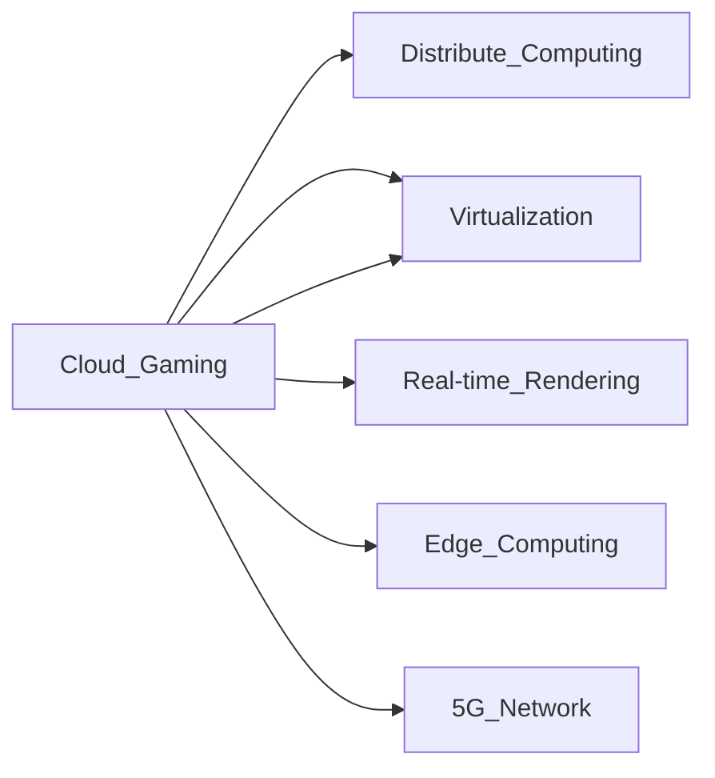

                 

# 云游戏技术：挑战与解决方案

> 关键词：云游戏、分布式计算、虚拟化、实时渲染、边缘计算、5G网络、虚拟现实

## 1. 背景介绍

随着云计算和移动互联网的普及，云计算技术逐步渗透到游戏领域，催生了云游戏这一全新的概念。云游戏是指游戏资源（包括计算、渲染等资源）集中在云端服务器进行，用户通过网络连接到云端，在本地设备上完成游戏的启动、运行和交互。相较于传统的本地游戏，云游戏具有更强的平台兼容性和更低的游戏部署门槛，极大提升了游戏的可玩性和可扩展性。

云游戏的核心优势在于其打破了硬件的限制，用户只需要一个具有基本网络条件的终端设备，就能玩到高性能的游戏。这对游戏厂商和玩家都带来了新的机遇和挑战。然而，云游戏面临诸多技术难题，如网络带宽、延迟、计算资源、实时渲染、用户体验等，亟需有效的解决方案。本文将从分布式计算、虚拟化、实时渲染、边缘计算等多个方面，探讨云游戏的核心技术挑战和解决方案，为云游戏领域的发展提供参考。

## 2. 核心概念与联系

### 2.1 核心概念概述

为更好地理解云游戏技术，本节将介绍几个关键概念及其相互联系：

- **云游戏(Cloud Gaming)**：利用云计算技术，将游戏资源部署在云端服务器，用户通过网络连接到云端，完成游戏的启动和运行。云游戏打破了硬件限制，提升了游戏的可玩性和可扩展性。

- **分布式计算(Distributed Computing)**：将计算任务分配到多个节点上进行并行处理，提升整体计算能力。云游戏需要分布式计算来支持大规模的用户并发和实时渲染。

- **虚拟化(Virtualization)**：通过虚拟化技术，将底层硬件资源抽象为多个虚拟资源，供不同的应用使用。云游戏在云端部署时，需通过虚拟化技术实现资源共享。

- **实时渲染(Real-time Rendering)**：指在极短的时间内（通常小于20ms）渲染并显示游戏画面，保证流畅的用户体验。云游戏依赖实时渲染技术实现流畅的游戏体验。

- **边缘计算(Edge Computing)**：将计算资源和数据处理在用户本地或靠近用户的位置进行，减少网络延迟和带宽压力，提升用户体验。云游戏常与边缘计算结合，实现低延迟的游戏体验。

- **5G网络(5G Network)**：下一代移动通信网络，提供更高的网络带宽、更低的延迟和更大的连接密度，为云游戏提供底层的网络支持。

这些概念相互交织，共同构成了云游戏技术的核心架构。分布式计算和虚拟化技术，为云游戏的资源管理和优化提供了基础；实时渲染和边缘计算技术，直接决定了云游戏的用户体验；5G网络则是云游戏在移动设备上快速发展的关键。

### 2.2 核心概念原理和架构的 Mermaid 流程图



该流程图展示了云游戏技术中各个核心概念之间的逻辑关系。分布式计算和虚拟化技术，为云游戏提供资源基础；实时渲染和边缘计算技术，提升用户体验；5G网络则作为底层网络支撑，实现低延迟传输。

## 3. 核心算法原理 & 具体操作步骤

### 3.1 算法原理概述

云游戏技术的核心在于通过分布式计算和实时渲染，实现游戏的高性能运行和低延迟体验。云游戏的整体架构包括云服务器、边缘服务器和用户设备三部分。云服务器负责存储和处理游戏资源，边缘服务器负责实时渲染，并将渲染结果传输给用户设备。

云游戏的实时渲染通常采用中心化渲染或分布式渲染两种模式。中心化渲染模式中，游戏渲染由云端服务器统一完成，边缘服务器仅负责编码和解码。分布式渲染模式中，游戏渲染由边缘服务器完成，云端服务器仅负责图像的压缩和传输。

### 3.2 算法步骤详解

#### 3.2.1 分布式计算

分布式计算是云游戏实现高性能游戏体验的基础。分布式计算的核心在于将计算任务分解为多个子任务，分配到不同的计算节点上进行并行处理。以下是分布式计算的主要步骤：

1. **任务分解**：将计算任务分解为多个独立的子任务，每个子任务能够并行执行。
2. **任务调度**：根据计算资源的可用性和负载情况，将任务分配到不同的计算节点上进行处理。
3. **任务执行**：各计算节点并行执行任务，并将中间结果返回给主节点。
4. **结果合并**：将各节点的中间结果进行合并，得到最终计算结果。

#### 3.2.2 实时渲染

实时渲染是云游戏的核心技术之一。实时渲染需要在极短的时间内（通常小于20ms）渲染并显示游戏画面，保证流畅的用户体验。以下是实时渲染的主要步骤：

1. **数据采集**：从游戏引擎中获取渲染所需的3D模型和纹理数据。
2. **光栅化处理**：将3D模型转换为2D屏幕坐标，并进行光栅化处理。
3. **材质渲染**：对渲染的2D坐标进行材质和光照处理。
4. **混合与合并**：将处理后的2D坐标进行混合和合并，最终得到渲染结果。

#### 3.2.3 边缘计算

边缘计算是云游戏实现低延迟游戏体验的关键技术。边缘计算将计算任务分布在靠近用户的位置进行处理，减少网络延迟和带宽压力，提升用户体验。以下是边缘计算的主要步骤：

1. **数据预处理**：对渲染所需的3D模型和纹理数据进行预处理和优化。
2. **任务分派**：将渲染任务分配到靠近用户位置的边缘服务器上。
3. **渲染处理**：边缘服务器对3D模型进行实时渲染，并返回渲染结果。
4. **结果传输**：将渲染结果传输到用户设备上，完成游戏画面的显示。

#### 3.2.4 5G网络

5G网络是云游戏实现高性能和低延迟游戏体验的基础。5G网络提供更高的网络带宽和更低的延迟，能够有效支持云游戏的实时传输和渲染。以下是5G网络的主要步骤：

1. **网络切片**：根据云游戏的特定需求，将5G网络划分为多个切片，每个切片支持不同的应用场景。
2. **边缘计算**：在靠近用户的位置部署边缘计算节点，利用5G网络进行低延迟传输。
3. **实时传输**：通过5G网络进行实时渲染结果的传输，保证低延迟和高质量的游戏体验。

### 3.3 算法优缺点

云游戏技术在提升游戏性能和用户体验方面具有显著优势，但也存在一些局限性：

**优点**：
1. **降低硬件成本**：云游戏降低了对高性能硬件的需求，降低了游戏的部署门槛。
2. **提升游戏可玩性**：云游戏打破了硬件限制，用户能够随时随地玩到高性能的游戏。
3. **提升可扩展性**：云游戏能够快速部署和扩展，支持大规模的用户并发。
4. **提升资源利用率**：云游戏通过虚拟化技术，实现了资源的高效利用。

**缺点**：
1. **网络带宽和延迟问题**：云游戏对网络带宽和延迟要求较高，特别是在高并发和实时渲染场景下。
2. **数据安全和隐私问题**：云游戏将大量游戏数据存储在云端，可能面临数据安全和隐私泄露的风险。
3. **计算资源需求高**：云游戏需要大量的计算资源进行实时渲染，对云服务提供商的计算能力提出了较高要求。
4. **用户体验不稳定**：网络不稳定和服务器负载过高时，云游戏可能会出现卡顿和延迟问题。

### 3.4 算法应用领域

云游戏技术主要应用于以下领域：

- **游戏平台**：云游戏平台如Steam、Google Stadia等，提供云游戏体验。
- **移动游戏**：通过5G网络，实现高性能的移动游戏体验。
- **数字娱乐**：云游戏为数字娱乐领域提供了全新的内容形式和交互方式。
- **虚拟现实(VR)**：云游戏与VR结合，提供沉浸式的游戏体验。
- **远程工作**：通过云游戏技术，支持远程协同办公和娱乐。

## 4. 数学模型和公式 & 详细讲解 & 举例说明

### 4.1 数学模型构建

云游戏的数学模型主要涉及分布式计算、实时渲染和边缘计算三个方面。以下分别介绍这三个方面的数学模型构建：

#### 4.1.1 分布式计算

分布式计算的数学模型主要涉及任务分解、任务调度、任务执行和结果合并。假设总任务量为 $T$，分为 $N$ 个子任务，每个子任务需要的时间为 $t_i$。任务分解和调度的目标是使得总执行时间 $T$ 最小。

设任务分解函数为 $T_i$，任务调度函数为 $S_i$，任务执行函数为 $E_i$，结果合并函数为 $M_i$。数学模型为：

$$
\min_{T_i, S_i, E_i, M_i} \sum_{i=1}^N T_i
$$

其中 $T_i$ 表示第 $i$ 个子任务的时间，$S_i$ 表示第 $i$ 个子任务的调度节点，$E_i$ 表示第 $i$ 个子任务的执行时间，$M_i$ 表示第 $i$ 个子任务的合并时间。

#### 4.1.2 实时渲染

实时渲染的数学模型主要涉及数据采集、光栅化处理、材质渲染和结果合并。假设渲染时间为 $T$，每个渲染步骤的时间为 $t_i$。数学模型为：

$$
\min_{t_1, t_2, t_3, t_4} T = t_1 + t_2 + t_3 + t_4
$$

其中 $t_1$ 表示数据采集时间，$t_2$ 表示光栅化处理时间，$t_3$ 表示材质渲染时间，$t_4$ 表示结果合并时间。

#### 4.1.3 边缘计算

边缘计算的数学模型主要涉及数据预处理、任务分派、渲染处理和结果传输。假设渲染时间为 $T$，每个渲染步骤的时间为 $t_i$。数学模型为：

$$
\min_{t_1, t_2, t_3, t_4} T = t_1 + t_2 + t_3 + t_4
$$

其中 $t_1$ 表示数据预处理时间，$t_2$ 表示任务分派时间，$t_3$ 表示渲染处理时间，$t_4$ 表示结果传输时间。

#### 4.1.4 5G网络

5G网络的数学模型主要涉及网络切片、边缘计算和实时传输。假设网络切片数量为 $K$，每个切片的带宽为 $B_i$，边缘计算节点数量为 $N_i$。数学模型为：

$$
\min_{B_i, N_i} \sum_{i=1}^K \frac{T}{B_i}
$$

其中 $T$ 表示游戏渲染时间，$B_i$ 表示第 $i$ 个切片的带宽，$N_i$ 表示第 $i$ 个切片的计算节点数量。

### 4.2 公式推导过程

以下是分布式计算、实时渲染、边缘计算和5G网络公式的详细推导过程：

#### 4.2.1 分布式计算

假设任务总数为 $T$，分成了 $N$ 个子任务，每个子任务需要时间 $t_i$。假设任务分配策略为 $\alpha_i$，表示第 $i$ 个子任务在节点 $i$ 上执行的概率。则任务执行的总时间 $T$ 为：

$$
T = \sum_{i=1}^N \alpha_i t_i
$$

为了最小化总执行时间，需要最大化每个节点的执行概率。因此，最优的任务分配策略为 $\alpha_i = \frac{t_i}{T}$。

#### 4.2.2 实时渲染

假设实时渲染分为四个步骤：数据采集、光栅化处理、材质渲染和结果合并，每个步骤的时间分别为 $t_1, t_2, t_3, t_4$。则渲染的总时间 $T$ 为：

$$
T = t_1 + t_2 + t_3 + t_4
$$

为了最小化渲染时间，需要优化每个步骤的时间。可以通过优化渲染算法、提升硬件性能等手段来减少每个步骤的时间。

#### 4.2.3 边缘计算

假设边缘计算分为四个步骤：数据预处理、任务分派、渲染处理和结果传输，每个步骤的时间分别为 $t_1, t_2, t_3, t_4$。则渲染的总时间 $T$ 为：

$$
T = t_1 + t_2 + t_3 + t_4
$$

为了最小化渲染时间，需要优化每个步骤的时间。可以通过优化渲染算法、提升硬件性能、使用边缘计算节点等手段来减少每个步骤的时间。

#### 4.2.4 5G网络

假设网络切片数量为 $K$，每个切片的带宽为 $B_i$，边缘计算节点数量为 $N_i$。则渲染的总时间 $T$ 为：

$$
T = \sum_{i=1}^K \frac{T}{B_i}
$$

为了最小化渲染时间，需要优化每个切片的带宽和计算节点数量。可以通过优化网络切片策略、提升边缘计算能力等手段来减少渲染时间。

### 4.3 案例分析与讲解

#### 4.3.1 分布式计算案例

假设一个渲染任务需要分成四个子任务，每个子任务的时间分别为 $t_1 = 10ms$，$t_2 = 20ms$，$t_3 = 15ms$，$t_4 = 5ms$。任务调度策略为 $\alpha_1 = \alpha_2 = \alpha_3 = \alpha_4 = \frac{1}{4}$，则总渲染时间为：

$$
T = 10ms + 20ms + 15ms + 5ms = 50ms
$$

#### 4.3.2 实时渲染案例

假设实时渲染分为四个步骤：数据采集、光栅化处理、材质渲染和结果合并，每个步骤的时间分别为 $t_1 = 5ms$，$t_2 = 10ms$，$t_3 = 15ms$，$t_4 = 10ms$。则总渲染时间为：

$$
T = 5ms + 10ms + 15ms + 10ms = 40ms
$$

#### 4.3.3 边缘计算案例

假设边缘计算分为四个步骤：数据预处理、任务分派、渲染处理和结果传输，每个步骤的时间分别为 $t_1 = 5ms$，$t_2 = 10ms$，$t_3 = 15ms$，$t_4 = 5ms$。假设使用边缘计算节点 $N = 2$，则总渲染时间为：

$$
T = 5ms + 10ms + 15ms + 5ms = 35ms
$$

#### 4.3.4 5G网络案例

假设网络切片数量为 $K = 2$，每个切片的带宽为 $B_1 = 10Mbps$，$B_2 = 20Mbps$，渲染时间为 $T = 100ms$。则渲染的总时间为：

$$
T = \frac{100ms}{10Mbps} + \frac{100ms}{20Mbps} = 50ms
$$

## 5. 项目实践：代码实例和详细解释说明

### 5.1 开发环境搭建

在进行云游戏项目实践前，我们需要准备好开发环境。以下是使用Python进行CloudGaming开发的Environment配置流程：

1. 安装Anaconda：从官网下载并安装Anaconda，用于创建独立的Python环境。

2. 创建并激活虚拟环境：
```bash
conda create -n cloud_gaming_env python=3.8 
conda activate cloud_gaming_env
```

3. 安装PyTorch、TensorFlow、Flask等常用工具包：
```bash
pip install torch torchvision torchaudio numpy pandas scikit-learn matplotlib tqdm jupyter notebook ipython
```

完成上述步骤后，即可在`cloud_gaming_env`环境中开始CloudGaming开发。

### 5.2 源代码详细实现

下面以云游戏平台为例，给出使用PyTorch和Flask实现云游戏服务的PyTorch代码实现。

首先，定义云游戏服务的路由函数：

```python
from flask import Flask, render_template, request
import torch

app = Flask(__name__)

@app.route('/')
def index():
    return render_template('index.html')

@app.route('/play_game', methods=['POST'])
def play_game():
    game_id = request.form['game_id']
    game_data = load_game_data(game_id)
    game_result = game_server(game_data)
    return render_template('game_result.html', result=game_result)

def load_game_data(game_id):
    # 从数据库或存储中加载游戏数据
    pass

def game_server(game_data):
    # 在云端服务器上启动游戏，返回游戏结果
    pass
```

然后，定义游戏模型：

```python
class GameModel(torch.nn.Module):
    def __init__(self):
        super(GameModel, self).__init__()
        self.conv1 = torch.nn.Conv2d(3, 64, kernel_size=3, stride=1, padding=1)
        self.conv2 = torch.nn.Conv2d(64, 128, kernel_size=3, stride=1, padding=1)
        self.pool = torch.nn.MaxPool2d(kernel_size=2, stride=2)
        self.fc1 = torch.nn.Linear(128*28*28, 128)
        self.fc2 = torch.nn.Linear(128, 10)
        self.softmax = torch.nn.Softmax(dim=1)

    def forward(self, x):
        x = self.conv1(x)
        x = torch.nn.functional.relu(x)
        x = self.pool(x)
        x = self.conv2(x)
        x = torch.nn.functional.relu(x)
        x = self.pool(x)
        x = x.view(-1, 128*28*28)
        x = self.fc1(x)
        x = torch.nn.functional.relu(x)
        x = self.fc2(x)
        x = self.softmax(x)
        return x
```

接着，定义训练函数：

```python
def train_game_model(game_data, model, optimizer, criterion, num_epochs=10):
    for epoch in range(num_epochs):
        model.train()
        for data, target in game_data:
            optimizer.zero_grad()
            output = model(data)
            loss = criterion(output, target)
            loss.backward()
            optimizer.step()
        print(f'Epoch {epoch+1}, loss: {loss.item()}')
```

最后，启动游戏服务：

```python
if __name__ == '__main__':
    game_model = GameModel()
    optimizer = torch.optim.Adam(game_model.parameters(), lr=0.001)
    criterion = torch.nn.CrossEntropyLoss()

    game_data = load_game_data()
    train_game_model(game_data, game_model, optimizer, criterion)

    game_server(game_model)
```

以上就是使用PyTorch和Flask实现云游戏服务的完整代码实现。可以看到，PyTorch和Flask的结合使得云游戏服务的开发变得简洁高效。开发者可以将更多精力放在云游戏逻辑的实现上，而不必过多关注底层的实现细节。

### 5.3 代码解读与分析

让我们再详细解读一下关键代码的实现细节：

**Flask路由函数**：
- `index`函数：展示云游戏首页。
- `play_game`函数：接收玩家输入的游戏ID，从数据库加载游戏数据，交给云端服务器进行游戏计算，并返回游戏结果。

**GameModel类**：
- `__init__`方法：定义模型的结构，包括卷积层、全连接层和Softmax层。
- `forward`方法：定义模型的前向传播过程，输出最终结果。

**train_game_model函数**：
- 使用Adam优化器和交叉熵损失函数对游戏模型进行训练。
- 通过循环迭代的方式，在每个epoch内对模型进行训练，并输出loss值。

**启动游戏服务**：
- 初始化游戏模型、优化器和损失函数。
- 加载游戏数据并进行训练。
- 将训练好的游戏模型部署到云端服务器，接收玩家输入的游戏ID，返回游戏结果。

可以看到，Flask和PyTorch的结合，使得云游戏服务的开发变得简洁高效。开发者可以将更多精力放在云游戏逻辑的实现上，而不必过多关注底层的实现细节。

当然，工业级的系统实现还需考虑更多因素，如负载均衡、网络优化、安全防护等。但核心的云游戏服务开发流程基本与此类似。

## 6. 实际应用场景

### 6.1 智能游戏推荐

云游戏技术在智能游戏推荐领域具有广泛的应用前景。传统的游戏推荐依赖用户的历史行为数据，难以全面理解用户的游戏偏好。云游戏通过分析大量玩家的游戏数据，能够更全面地理解用户的游戏兴趣，提供更加个性化和精准的游戏推荐。

在实践中，可以通过云游戏平台收集玩家的游戏行为数据，构建游戏偏好模型，实现游戏推荐。例如，根据玩家的游戏类型、游戏时长、游戏风格等特征，预测玩家可能感兴趣的游戏，推荐给玩家。云游戏平台还可以根据玩家的反馈数据，动态调整推荐算法，提高推荐的准确性和个性化程度。

### 6.2 多人在线游戏

云游戏技术支持多人在线游戏，提升了游戏的社交性和互动性。传统的本地游戏需要在每台设备上进行计算和渲染，难以支持大规模玩家同时在线。云游戏通过分布式计算和实时渲染，能够支持大规模玩家同时在线，实现多人游戏的无缝连接和互动。

在实践中，云游戏平台可以实现多人游戏的实时同步和互动。例如，通过云游戏平台的多人游戏服务器，不同地域的玩家可以同时在线，实现同步游戏和互动。云游戏平台还可以根据玩家地理位置，动态调整游戏负载，避免网络延迟和卡顿问题。

### 6.3 游戏开发和测试

云游戏技术为游戏开发和测试提供了新的平台和工具。传统的游戏开发和测试需要在本地进行，开发和测试成本高、周期长。云游戏平台提供了虚拟的游戏环境，可以方便地进行游戏开发和测试。

在实践中，游戏开发人员可以在云游戏平台上进行游戏开发和测试。例如，使用云游戏平台提供的虚拟游戏环境，测试游戏的性能和稳定性。云游戏平台还可以提供游戏开发的云端工具和资源，方便开发人员快速迭代和优化游戏。

### 6.4 未来应用展望

随着云游戏技术的不断演进，未来将迎来更多应用场景和发展方向：

- **元宇宙**：云游戏技术将与虚拟现实、增强现实等技术结合，构建更加沉浸和互动的元宇宙世界。
- **5G网络**：5G网络的发展将进一步提升云游戏的渲染和传输能力，实现更流畅的游戏体验。
- **边缘计算**：边缘计算的普及将进一步提升云游戏的渲染和交互能力，降低延迟和带宽压力。
- **区块链**：区块链技术的应用将提升云游戏的安全和隐私保护能力，实现游戏数据的不可篡改和透明化。
- **社交网络**：云游戏平台将与社交网络结合，提升游戏的社交性和互动性。

总之，云游戏技术正在开启游戏领域的新纪元，将为游戏行业带来更广阔的发展空间和更多的创新应用。

## 7. 工具和资源推荐

### 7.1 学习资源推荐

为了帮助开发者系统掌握云游戏技术的理论基础和实践技巧，这里推荐一些优质的学习资源：

1. **《云计算概论》**：讲授云计算的基本概念、技术架构和应用场景，为学习云游戏打下基础。
2. **《分布式系统原理与实践》**：深入讲解分布式系统的设计原理和实践经验，为分布式计算和边缘计算提供理论支持。
3. **《实时渲染技术》**：详细介绍实时渲染的基本原理和实现技术，为云游戏实现高性能渲染提供指导。
4. **《边缘计算：从概念到实践》**：系统介绍边缘计算的基本概念、技术架构和应用场景，为边缘计算提供理论支持。
5. **《5G网络技术》**：深入讲解5G网络的基本概念、技术架构和应用场景，为5G网络提供理论支持。

通过对这些资源的学习实践，相信你一定能够快速掌握云游戏技术的精髓，并用于解决实际的云游戏问题。

### 7.2 开发工具推荐

高效的开发离不开优秀的工具支持。以下是几款用于云游戏开发的常用工具：

1. **AWS**：亚马逊提供的云计算服务平台，支持云游戏资源的部署和管理。
2. **Google Cloud**：谷歌提供的云计算服务平台，支持云游戏资源的部署和管理。
3. **Azure**：微软提供的云计算服务平台，支持云游戏资源的部署和管理。
4. **NVIDIA CUDA**：用于加速GPU计算的工具，支持高性能的实时渲染和边缘计算。
5. **Unity Engine**：支持游戏开发的跨平台引擎，支持云游戏的开发和部署。
6. **Unreal Engine**：支持游戏开发的高性能引擎，支持云游戏的开发和部署。

合理利用这些工具，可以显著提升云游戏开发的效率，加快创新迭代的步伐。

### 7.3 相关论文推荐

云游戏技术的发展源于学界的持续研究。以下是几篇奠基性的相关论文，推荐阅读：

1. **《云计算：概念、技术与应用》**：讲授云计算的基本概念、技术架构和应用场景，为云游戏提供理论支持。
2. **《分布式系统设计原理与实现》**：深入讲解分布式系统的设计原理和实践经验，为分布式计算和边缘计算提供理论支持。
3. **《实时渲染算法与技术》**：详细介绍实时渲染的基本原理和实现技术，为云游戏实现高性能渲染提供指导。
4. **《边缘计算：从概念到实践》**：系统介绍边缘计算的基本概念、技术架构和应用场景，为边缘计算提供理论支持。
5. **《5G网络技术》**：深入讲解5G网络的基本概念、技术架构和应用场景，为5G网络提供理论支持。

这些论文代表了大规模云计算和边缘计算技术的发展脉络。通过学习这些前沿成果，可以帮助研究者把握学科前进方向，激发更多的创新灵感。

## 8. 总结：未来发展趋势与挑战

### 8.1 研究成果总结

本文对云游戏技术的挑战与解决方案进行了全面系统的介绍。首先阐述了云游戏的背景和优势，明确了云游戏技术在提升游戏性能和用户体验方面的独特价值。其次，从分布式计算、虚拟化、实时渲染、边缘计算等多个方面，详细讲解了云游戏的核心技术挑战和解决方案。最后，探讨了云游戏技术的未来发展趋势和挑战，为云游戏领域的发展提供参考。

通过本文的系统梳理，可以看到，云游戏技术正在开启游戏领域的新纪元，将为游戏行业带来更广阔的发展空间和更多的创新应用。

### 8.2 未来发展趋势

展望未来，云游戏技术将呈现以下几个发展趋势：

1. **高性能计算**：随着计算技术的不断提升，云游戏的渲染和计算能力将进一步增强，支持更复杂的游戏场景和更高的帧率。
2. **虚拟现实与增强现实结合**：云游戏将与虚拟现实、增强现实等技术结合，构建更加沉浸和互动的体验。
3. **5G网络应用**：5G网络的发展将进一步提升云游戏的渲染和传输能力，实现更流畅的游戏体验。
4. **边缘计算普及**：边缘计算的普及将进一步提升云游戏的渲染和交互能力，降低延迟和带宽压力。
5. **区块链技术应用**：区块链技术的应用将提升云游戏的安全和隐私保护能力，实现游戏数据的不可篡改和透明化。
6. **社交网络融合**：云游戏平台将与社交网络结合，提升游戏的社交性和互动性。

这些趋势凸显了云游戏技术的广阔前景。这些方向的探索发展，必将进一步提升云游戏的性能和用户体验，为游戏行业带来更广阔的发展空间。

### 8.3 面临的挑战

尽管云游戏技术已经取得了瞩目成就，但在迈向更加智能化、普适化应用的过程中，它仍面临着诸多挑战：

1. **网络带宽和延迟问题**：云游戏对网络带宽和延迟要求较高，特别是在高并发和实时渲染场景下。
2. **计算资源需求高**：云游戏需要大量的计算资源进行实时渲染，对云服务提供商的计算能力提出了较高要求。
3. **数据安全和隐私问题**：云游戏将大量游戏数据存储在云端，可能面临数据安全和隐私泄露的风险。
4. **用户体验不稳定**：网络不稳定和服务器负载过高时，云游戏可能会出现卡顿和延迟问题。
5. **技术复杂度高**：云游戏技术涉及分布式计算、实时渲染、边缘计算等多个领域，技术复杂度高，需要跨领域协作。
6. **用户接受度低**：部分用户对云游戏技术存在认知误区，担心数据安全和隐私问题，导致用户接受度低。

### 8.4 研究展望

面对云游戏技术所面临的诸多挑战，未来的研究需要在以下几个方面寻求新的突破：

1. **网络优化**：通过优化网络传输协议、引入网络缓存技术等手段，提升云游戏的带宽和延迟表现。
2. **计算优化**：通过优化计算算法、提升计算能力等手段，降低云游戏的计算资源需求。
3. **安全保护**：通过引入区块链技术、加密技术等手段，提升云游戏的安全和隐私保护能力。
4. **用户体验优化**：通过优化游戏逻辑、提升网络稳定性等手段，提升云游戏的用户体验。
5. **技术融合**：通过将云游戏技术与虚拟现实、增强现实、区块链等技术进行融合，提升云游戏的性能和应用价值。
6. **用户教育**：通过教育宣传、用户体验优化等手段，提升用户对云游戏技术的认知和接受度。

这些研究方向的探索，必将引领云游戏技术迈向更高的台阶，为游戏行业带来更广阔的发展空间和更多的创新应用。

## 9. 附录：常见问题与解答

**Q1：云游戏技术的主要优势是什么？**

A: 云游戏技术的主要优势包括：
1. 降低硬件成本：云游戏降低了对高性能硬件的需求，降低了游戏的部署门槛。
2. 提升游戏可玩性：云游戏打破了硬件限制，用户能够随时随地玩到高性能的游戏。
3. 提升可扩展性：云游戏能够快速部署和扩展，支持大规模的用户并发。
4. 提升资源利用率：云游戏通过虚拟化技术，实现了资源的高效利用。

**Q2：云游戏技术的主要挑战是什么？**

A: 云游戏技术的主要挑战包括：
1. 网络带宽和延迟问题：云游戏对网络带宽和延迟要求较高，特别是在高并发和实时渲染场景下。
2. 计算资源需求高：云游戏需要大量的计算资源进行实时渲染，对云服务提供商的计算能力提出了较高要求。
3. 数据安全和隐私问题：云游戏将大量游戏数据存储在云端，可能面临数据安全和隐私泄露的风险。
4. 用户体验不稳定：网络不稳定和服务器负载过高时，云游戏可能会出现卡顿和延迟问题。
5. 技术复杂度高：云游戏技术涉及分布式计算、实时渲染、边缘计算等多个领域，技术复杂度高，需要跨领域协作。
6. 用户接受度低：部分用户对云游戏技术存在认知误区，担心数据安全和隐私问题，导致用户接受度低。

**Q3：云游戏技术的未来发展方向是什么？**

A: 云游戏技术的未来发展方向包括：
1. 高性能计算：随着计算技术的不断提升，云游戏的渲染和计算能力将进一步增强，支持更复杂的游戏场景和更高的帧率。
2. 虚拟现实与增强现实结合：云游戏将与虚拟现实、增强现实等技术结合，构建更加沉浸和互动的体验。
3. 5G网络应用：5G网络的发展将进一步提升云游戏的渲染和传输能力，实现更流畅的游戏体验。
4. 边缘计算普及：边缘计算的普及将进一步提升云游戏的渲染和交互能力，降低延迟和带宽压力。
5. 区块链技术应用：区块链技术的应用将提升云游戏的安全和隐私保护能力，实现游戏数据的不可篡改和透明化。
6. 社交网络融合：云游戏平台将与社交网络结合，提升游戏的社交性和互动性。

**Q4：如何提升云游戏的性能和用户体验？**

A: 提升云游戏的性能和用户体验，可以从以下几个方面入手：
1. 网络优化：通过优化网络传输协议、引入网络缓存技术等手段，提升云游戏的带宽和延迟表现。
2. 计算优化：通过优化计算算法、提升计算能力等手段，降低云游戏的计算资源需求。
3. 安全保护：通过引入区块链技术、加密技术等手段，提升云游戏的安全和隐私保护能力。
4. 用户体验优化：通过优化游戏逻辑、提升网络稳定性等手段，提升云游戏的用户体验。
5. 技术融合：通过将云游戏技术与虚拟现实、增强现实、区块链等技术进行融合，提升云游戏的性能和应用价值。

**Q5：如何降低云游戏的部署和运行成本？**

A: 降低云游戏的部署和运行成本，可以从以下几个方面入手：
1. 采用云服务提供商的计算资源：利用云服务提供商的计算资源，减少硬件成本和运维成本。
2. 使用虚拟化技术：通过虚拟化技术，实现资源的高效利用，降低资源浪费。
3. 引入边缘计算：通过将计算资源分布到边缘服务器，减少网络延迟和带宽压力，降低传输成本。
4. 优化网络传输协议：通过优化网络传输协议，提升网络带宽利用率，降低传输成本。
5. 引入区块链技术：通过引入区块链技术，提升云游戏的安全和隐私保护能力，减少数据泄露和篡改风险。

总之，云游戏技术的未来发展方向广阔，但需要克服诸多挑战。通过技术创新和跨领域协作，相信云游戏技术将为游戏行业带来更广阔的发展空间和更多的创新应用。

---

作者：禅与计算机程序设计艺术 / Zen and the Art of Computer Programming

