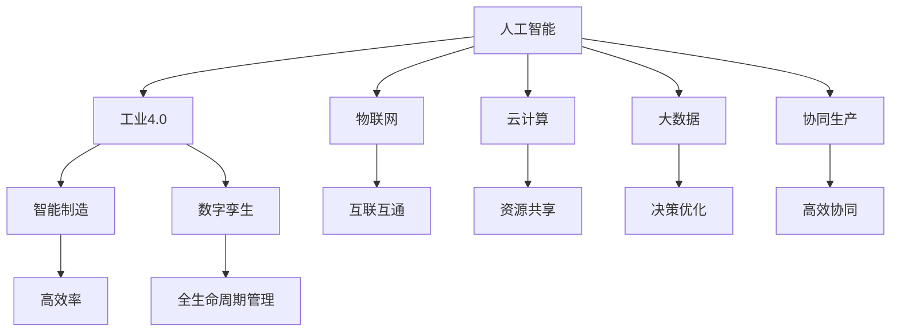

                 

# 产业升级的新质生产力推动力

> 关键词：产业升级, 新质生产力, 人工智能, 数字化转型, 智能化制造, 数据驱动, 科技创新, 效率提升

## 1. 背景介绍

### 1.1 问题由来

在当前全球经济格局下，产业升级已成为一个不可逆转的趋势。传统制造业正面临着劳动力成本上升、资源环境约束加剧、市场需求变化等多重挑战。为了适应这些挑战，产业升级迫切需要新的生产力和动力源。以人工智能(AI)为代表的新一代信息技术，通过数字化、智能化、网络化的方式，正在重塑产业结构和生产方式，催生了新质生产力，推动了产业的全面转型升级。

### 1.2 问题核心关键点

新质生产力是数字化、智能化生产方式下，由新一代信息技术引发的生产率提升和产业创新能力提升。其核心关键点在于：

- 数据驱动。通过收集、分析和利用海量数据，实现精确决策和高效管理。
- 智能制造。借助机器人、自动化设备、物联网(IoT)等技术，实现生产过程的自动化、智能化。
- 协同生产。通过工业互联网、供应链管理等手段，实现企业间、设备间的高效协同。
- 创新能力。利用AI、大数据、云计算等技术，加速产品创新、流程优化、服务升级等。
- 绿色发展。通过能源管理、环境监测、资源优化等手段，实现生产过程的绿色化、低碳化。

这些关键点共同构成了新质生产力的主要特征，为产业升级提供了新的动力和方向。

### 1.3 问题研究意义

研究新质生产力推动力，对于推动传统产业数字化、智能化转型，提升企业核心竞争力，具有重要意义：

- 提高生产效率。通过智能制造、协同生产等手段，实现生产过程的自动化、智能化，大幅提升生产效率和产品质量。
- 降低运营成本。借助数据驱动、智能管理等技术，优化资源配置，降低能源消耗、原材料浪费，提升运营效率。
- 激发创新潜力。AI、大数据、云计算等技术的广泛应用，催生了新的商业模式、业务流程，推动企业持续创新。
- 实现绿色发展。通过智能监测、节能减排、资源优化等技术，提升环保意识，实现可持续发展。
- 增强国际竞争力。新技术、新业态、新模式的涌现，为我国企业在国际市场上提供新的竞争优势。

## 2. 核心概念与联系

### 2.1 核心概念概述

为更好地理解新质生产力的构成和作用，本节将介绍几个密切相关的核心概念：

- 人工智能(AI)：通过模拟、延伸和扩展人的智能能力，实现感知、学习、推理等智能行为。AI技术包括机器学习、深度学习、自然语言处理、计算机视觉等。
- 工业4.0：以智能制造、互联网+、个性化定制为核心的新一代工业发展模式。通过数字化、智能化、网络化的方式，实现生产效率和生产质量的大幅提升。
- 物联网(IoT)：通过传感器、智能设备等技术，将物理世界与信息世界紧密连接，实现万物互联。
- 云计算(Cloud Computing)：通过分布式计算和网络存储技术，实现数据、计算资源的高效共享和协同。
- 大数据(Big Data)：通过收集、处理和分析海量数据，实现洞察、决策和优化。
- 数字孪生(Digital Twin)：利用虚拟模型与物理实体之间的双向映射关系，实现全生命周期管理。

这些概念之间的逻辑关系可以通过以下Mermaid流程图来展示：



这个流程图展示了新质生产力所依赖的技术栈和应用场景：

1. 人工智能技术是基础，通过深度学习、自然语言处理等方法，实现智能决策和高效管理。
2. 工业4.0是核心，通过智能制造、个性化定制等手段，实现生产过程的自动化、智能化。
3. 物联网技术是支撑，通过互联互通、数据采集等手段，实现全要素、全过程的信息感知。
4. 云计算技术是底层，通过资源共享、弹性计算等手段，实现算力、存储的按需分配。
5. 大数据技术是方法，通过数据分析、模式识别等手段，实现洞察、决策和优化。
6. 数字孪生技术是应用，通过虚拟模型与物理实体之间的双向映射，实现全生命周期管理。
7. 协同生产是目标，通过工业互联网、供应链管理等手段，实现企业间、设备间的高效协同。

这些概念共同构成了新质生产力的框架，使其能够在各类产业中发挥重要作用。

## 3. 核心算法原理 & 具体操作步骤
### 3.1 算法原理概述

新质生产力推动力主要体现在智能制造、数据驱动、协同生产等几个关键方面。其核心算法原理和操作步骤如下：

### 3.2 算法步骤详解

1. **数据采集与处理**

   - **数据采集**：通过传感器、监控设备、物联网设备等，实时采集生产过程中的各类数据。
   - **数据处理**：利用大数据技术，对采集到的数据进行清洗、去重、归一化等处理，确保数据质量和一致性。

2. **智能决策与优化**

   - **智能分析**：利用AI技术，对处理后的数据进行建模、分析和预测，提供决策支持。
   - **优化调整**：根据智能分析结果，调整生产参数、设备运行状态等，实现生产过程的优化。

3. **协同生产与物流**

   - **工业互联网**：通过工业互联网平台，实现企业间、设备间的互联互通，形成完整的生产生态圈。
   - **供应链管理**：通过供应链管理系统，优化资源配置，提高物流效率，降低运营成本。

4. **产品设计与创新**

   - **模拟仿真**：利用数字孪生技术，对产品设计和生产过程进行模拟仿真，提前发现潜在问题。
   - **创新设计**：通过AI和大数据技术，分析用户需求和市场趋势，指导产品设计和研发。

5. **智能制造与自动化**

   - **智能设备**：引入自动化设备、机器人等，实现生产过程的自动化、智能化。
   - **柔性生产**：通过模块化设计、参数配置等手段，实现生产过程的柔性化和定制化。

### 3.3 算法优缺点

新质生产力的算法优点主要体现在以下几个方面：

- **高效生产**：通过自动化、智能化的生产方式，大幅提升生产效率和产品质量。
- **资源优化**：利用大数据技术，优化资源配置，降低能源消耗、原材料浪费。
- **精准决策**：通过智能分析和决策支持，实现生产过程的精准控制和优化。
- **环境友好**：通过智能监测、节能减排等手段，实现生产过程的绿色化、低碳化。

但其缺点也显而易见：

- **初始投入高**：需要大量的设备、软件、数据等基础设施投入，对企业的资本和资源要求较高。
- **技术复杂度高**：涉及多种新兴技术，对企业技术能力和人才储备提出了更高要求。
- **数据安全风险**：数据采集、处理和传输过程中，存在数据泄露、篡改等风险，需要加强安全防护。
- **业务影响大**：新质生产力对企业运营模式、管理方式等带来了巨大变化，需要全面转型。

### 3.4 算法应用领域

新质生产力技术在多个领域得到了广泛应用，以下是几个典型应用场景：

- **制造业**：通过智能制造、柔性生产、协同生产等手段，实现生产过程的自动化、智能化，提升生产效率和产品质量。
- **能源行业**：通过智能监测、节能减排、资源优化等手段，实现能源消耗的精准控制和管理，提升能源利用效率。
- **农业**：通过物联网技术、大数据分析等手段，实现农业生产的精准化、智能化，提升农产品产量和品质。
- **医疗健康**：通过智能诊断、个性化治疗、远程医疗等手段，实现医疗服务的精准化、个性化，提升医疗服务质量。
- **金融服务**：通过智能分析、风险控制、客户管理等手段，实现金融服务的智能化、高效化，提升金融服务水平。
- **物流行业**：通过智能仓储、运输、配送等手段，实现物流过程的自动化、智能化，提升物流效率和客户体验。

## 4. 数学模型和公式 & 详细讲解  
### 4.1 数学模型构建

新质生产力推动力涉及多个领域的数据建模和算法优化。以下是几个核心数学模型和公式的详细构建过程：

### 4.2 公式推导过程

1. **线性回归模型**

   $$
   y = \beta_0 + \beta_1 x_1 + \beta_2 x_2 + \ldots + \beta_n x_n + \epsilon
   $$

   其中，$y$为预测值，$\beta$为系数，$x_i$为自变量，$\epsilon$为误差项。该模型适用于分析线性关系的数据集，可用于生产效率的预测和优化。

2. **决策树模型**

   $$
   \begin{aligned}
   &\text{if} \ x_1 > \text{threshold}_1 \\
   &\text{classify} \ x_2 \text{as} \ 0 \\
   &\text{else} \ \text{if} \ x_2 > \text{threshold}_2 \\
   &\text{classify} \ x_3 \text{as} \ 1 \\
   &\text{else} \ \text{classify} \ x_4 \text{as} \ 2 \\
   \end{aligned}
   $$

   该模型适用于分类任务，通过树状结构进行决策，可用于产品质量的分类和分析。

3. **支持向量机模型**

   $$
   \text{minimize} \ \frac{1}{2} \sum_{i=1}^N \|w\|^2 + C \sum_{i=1}^N \xi_i
   $$
   
   $$
   \text{subject to} \ y_i(w \cdot x_i + b) \geq 1 - \xi_i, \ \forall i \in [1, N]
   $$
   
   该模型适用于分类和回归任务，通过寻找最优分割超平面，实现数据的高效分类和预测。

### 4.3 案例分析与讲解

以制造业的智能制造为例，分析新质生产力的应用：

1. **数据采集**

   通过传感器和监控设备，实时采集生产过程中的温度、压力、速度等数据，形成实时数据流。

2. **数据处理**

   利用大数据技术，对采集到的数据进行清洗、去重、归一化等处理，确保数据质量和一致性。

3. **智能分析**

   通过机器学习算法，对处理后的数据进行建模、分析和预测，提供生产效率的决策支持。

4. **优化调整**

   根据智能分析结果，调整生产参数、设备运行状态等，实现生产过程的优化和改进。

5. **协同生产**

   通过工业互联网平台，实现企业间、设备间的互联互通，形成完整的生产生态圈，提升整体生产效率。

## 5. 项目实践：代码实例和详细解释说明
### 5.1 开发环境搭建

在进行新质生产力项目实践前，我们需要准备好开发环境。以下是使用Python进行TensorFlow开发的环境配置流程：

1. 安装Anaconda：从官网下载并安装Anaconda，用于创建独立的Python环境。

2. 创建并激活虚拟环境：
```bash
conda create -n tf-env python=3.8 
conda activate tf-env
```

3. 安装TensorFlow：根据CUDA版本，从官网获取对应的安装命令。例如：
```bash
conda install tensorflow -c pytorch -c conda-forge
```

4. 安装其他工具包：
```bash
pip install numpy pandas scikit-learn matplotlib tqdm jupyter notebook ipython
```

完成上述步骤后，即可在`tf-env`环境中开始新质生产力项目的开发。

### 5.2 源代码详细实现

以下是使用TensorFlow进行工业互联网平台开发的PyTorch代码实现：

```python
import tensorflow as tf
from tensorflow.keras import layers, models

# 定义数据集
class Dataset(tf.keras.utils.Sequence):
    def __init__(self, data, batch_size):
        self.data = data
        self.batch_size = batch_size
    
    def __len__(self):
        return len(self.data) // self.batch_size
    
    def __getitem__(self, idx):
        x, y = self.data[idx]
        return x, y

# 定义模型
model = models.Sequential([
    layers.Dense(64, activation='relu', input_shape=(input_shape,)),
    layers.Dense(32, activation='relu'),
    layers.Dense(1, activation='sigmoid')
])

# 定义优化器
optimizer = tf.keras.optimizers.Adam(learning_rate=0.001)

# 定义损失函数
loss_fn = tf.keras.losses.BinaryCrossentropy()

# 定义评估指标
accuracy_fn = tf.keras.metrics.BinaryAccuracy()

# 训练模型
model.compile(optimizer=optimizer, loss=loss_fn, metrics=[accuracy_fn])
model.fit(data, epochs=10, validation_data=val_data)

# 测试模型
test_loss, test_accuracy = model.evaluate(test_data)
print(f'Test loss: {test_loss:.4f}')
print(f'Test accuracy: {test_accuracy:.4f}')
```

### 5.3 代码解读与分析

以上代码实现了基于TensorFlow的工业互联网平台，用于实时采集、处理和分析生产数据，实现智能决策和优化。代码解释如下：

- `Dataset`类：用于定义数据集，实现数据分批次加载和处理。
- `model`定义：通过`Sequential`模型定义，实现简单的神经网络结构。
- `optimizer`定义：使用Adam优化器，设置学习率为0.001。
- `loss_fn`定义：使用二元交叉熵损失函数。
- `accuracy_fn`定义：使用二元准确率指标。
- `model.compile`：将模型、优化器和损失函数进行编译，设置评估指标。
- `model.fit`：在训练集上进行模型训练，设置迭代轮数为10。
- `model.evaluate`：在测试集上评估模型性能，输出损失和准确率。

## 6. 实际应用场景
### 6.1 智能制造

智能制造是新质生产力的重要应用领域。通过物联网技术、工业互联网平台等手段，实现生产过程的自动化、智能化，提升生产效率和产品质量。

具体而言，智能制造可以通过以下几个步骤实现：

1. **数据采集**：通过传感器、监控设备等，实时采集生产过程中的各类数据。
2. **数据处理**：利用大数据技术，对采集到的数据进行清洗、去重、归一化等处理。
3. **智能分析**：通过机器学习算法，对处理后的数据进行建模、分析和预测，提供决策支持。
4. **优化调整**：根据智能分析结果，调整生产参数、设备运行状态等，实现生产过程的优化。
5. **协同生产**：通过工业互联网平台，实现企业间、设备间的互联互通，形成完整的生产生态圈，提升整体生产效率。

### 6.2 智慧医疗

智慧医疗是新质生产力的典型应用之一。通过AI、大数据、物联网等技术，实现医疗服务的精准化、智能化，提升医疗服务质量。

具体而言，智慧医疗可以通过以下几个步骤实现：

1. **数据采集**：通过物联网设备、电子病历系统等，实时采集医疗数据。
2. **数据处理**：利用大数据技术，对采集到的数据进行清洗、去重、归一化等处理。
3. **智能分析**：通过深度学习算法，对处理后的数据进行建模、分析和预测，提供诊疗支持。
4. **优化调整**：根据智能分析结果，调整诊疗方案、用药剂量等，实现精准诊疗。
5. **协同医疗**：通过远程医疗、医疗协作平台等手段，实现医疗资源的协同共享，提升医疗服务效率。

### 6.3 智慧城市

智慧城市是新质生产力的重要应用方向。通过物联网技术、大数据分析等手段，实现城市管理的智能化、高效化，提升城市运行效率和居民生活质量。

具体而言，智慧城市可以通过以下几个步骤实现：

1. **数据采集**：通过物联网设备、视频监控系统等，实时采集城市运行数据。
2. **数据处理**：利用大数据技术，对采集到的数据进行清洗、去重、归一化等处理。
3. **智能分析**：通过深度学习算法，对处理后的数据进行建模、分析和预测，提供决策支持。
4. **优化调整**：根据智能分析结果，调整城市管理方案、交通调控等，实现城市运行优化。
5. **协同管理**：通过城市管理平台、智能交通系统等手段，实现城市各部门的协同管理，提升城市管理效率。

## 7. 工具和资源推荐
### 7.1 学习资源推荐

为了帮助开发者系统掌握新质生产力的理论基础和实践技巧，这里推荐一些优质的学习资源：

1. 《深度学习》系列博文：由深度学习领域的专家撰写，深入浅出地介绍了深度学习的基础知识和应用案例。
2. 《TensorFlow实战》书籍：谷歌深度学习框架TensorFlow的官方文档，提供了丰富的示例代码和详细的使用指南。
3. 《人工智能实战》书籍：实战型的AI开发指南，涵盖深度学习、自然语言处理、计算机视觉等多个领域的实践技巧。
4. 《工业4.0技术与应用》课程：介绍工业4.0的核心技术和应用场景，适合有一定基础的开发者深入学习。
5. 《物联网技术与应用》课程：介绍物联网的基本原理和关键技术，适合对物联网感兴趣的开发者。

通过对这些资源的学习实践，相信你一定能够快速掌握新质生产力的核心概念和技术实现，并用于解决实际的工业问题。
###  7.2 开发工具推荐

高效的开发离不开优秀的工具支持。以下是几款用于新质生产力项目开发的常用工具：

1. TensorFlow：谷歌开源的深度学习框架，支持分布式计算、动态图等特性，适用于各种深度学习项目。
2. PyTorch：Facebook开源的深度学习框架，易于使用、灵活高效，适用于快速迭代的研究开发。
3. OpenCV：开源计算机视觉库，提供丰富的图像处理和分析功能，适用于计算机视觉项目。
4. Pandas：开源数据处理库，提供高效的数据清洗、分析和可视化功能，适用于数据分析项目。
5. Plotly：开源数据可视化库，提供丰富的图表类型和交互功能，适用于数据可视化和报告生成。

合理利用这些工具，可以显著提升新质生产力项目的开发效率，加快创新迭代的步伐。

### 7.3 相关论文推荐

新质生产力技术的发展源于学界的持续研究。以下是几篇奠基性的相关论文，推荐阅读：

1. 《工业4.0技术概述》：介绍了工业4.0的核心技术，如智能制造、工业互联网、云计算等。
2. 《深度学习在医疗领域的应用》：介绍了深度学习在医疗诊断、治疗、管理等方面的应用。
3. 《物联网技术基础与展望》：介绍了物联网的基本原理和关键技术，展望了物联网的发展前景。
4. 《人工智能在智慧城市中的应用》：介绍了人工智能在智慧城市建设中的作用和应用。
5. 《面向工业的深度学习框架TensorFlow》：介绍了TensorFlow框架的核心技术和应用案例，适合深度学习开发者参考。

这些论文代表了大规模生产力和生产关系变革的最新趋势，为工业智能化转型提供了理论支持和实践指导。

## 8. 总结：未来发展趋势与挑战
### 8.1 总结

本文对新质生产力推动力进行了全面系统的介绍。首先阐述了新质生产力的背景和意义，明确了其在新一代工业发展模式中的关键作用。其次，从原理到实践，详细讲解了新质生产力的数学模型和操作步骤，给出了新质生产力项目开发的完整代码实例。同时，本文还广泛探讨了新质生产力在智能制造、智慧医疗、智慧城市等多个领域的应用前景，展示了其广阔的潜在价值。

通过本文的系统梳理，可以看到，新质生产力技术的全面应用，正在引领工业智能化转型，提升企业生产效率和竞争力。未来，伴随技术的不断演进和市场的快速变化，新质生产力还将迎来更多创新突破，推动更多行业实现数字化、智能化升级。

### 8.2 未来发展趋势

展望未来，新质生产力技术将呈现以下几个发展趋势：

1. **融合创新**：新质生产力技术将与大数据、物联网、区块链等新兴技术深度融合，形成更加全面、智能的生产力体系。
2. **数据驱动**：数据将成为新质生产力的核心驱动力，通过数据驱动和智能决策，实现生产过程的精准优化和高效管理。
3. **平台化**：工业互联网、智慧城市等平台将成为新质生产力的重要载体，实现企业间、部门间的协同管理和资源共享。
4. **智能化**：智能设备、智能制造、智能分析等技术将进一步普及，实现生产过程的全要素、全过程智能化。
5. **绿色化**：通过能源管理、环境监测、资源优化等手段，实现生产过程的绿色化、低碳化，提升环境可持续性。
6. **个性化**：通过智能推荐、个性化定制等手段，实现产品和服务的高定制化、精准化，提升用户体验。

这些趋势凸显了新质生产力技术的广阔前景。这些方向的探索发展，必将进一步推动工业智能化转型，提升企业核心竞争力，为经济社会发展注入新的动力。

### 8.3 面临的挑战

尽管新质生产力技术已经取得了瞩目成就，但在迈向更加智能化、普适化应用的过程中，它仍面临诸多挑战：

1. **数据质量和安全**：数据的完整性、准确性和安全性问题，可能对生产决策和运营管理带来风险。
2. **技术复杂度**：涉及多种新兴技术，对企业技术能力和人才储备提出了更高要求。
3. **业务融合难度**：将新质生产力技术融入现有业务流程，可能面临巨大的组织和流程变革挑战。
4. **资源配置挑战**：新质生产力技术的引入和应用，需要投入大量资金和资源，对企业财务和资源配置提出挑战。
5. **市场竞争压力**：新技术的引入和应用，可能面临来自传统企业的竞争压力和市场壁垒。

这些挑战需要企业在技术、业务、资源、市场等多个维度协同发力，才能顺利推进新质生产力的落地应用。相信随着技术不断成熟和市场不断扩大，新质生产力技术将逐步克服这些挑战，实现更加广泛的普及和应用。

### 8.4 研究展望

面向未来，新质生产力技术的研究需要在以下几个方面寻求新的突破：

1. **数据治理和隐私保护**：加强数据质量控制和安全防护，确保数据可用性和安全性。
2. **技术标准化**：推动新质生产力技术标准的制定和应用，实现技术的规范化和可复用性。
3. **行业应用深化**：深化新质生产力技术在各行业的应用，提升技术的实用性和落地性。
4. **跨学科融合**：推动跨学科技术的融合创新，提升新质生产力的综合应用能力。
5. **国际合作与交流**：加强国际合作与交流，促进新质生产力技术的全球普及和应用。

这些研究方向和创新方向，将推动新质生产力技术的不断进步，为全球工业智能化转型提供新的动能和机遇。

## 9. 附录：常见问题与解答

**Q1：新质生产力是否适用于所有工业领域？**

A: 新质生产力技术可以应用于大多数工业领域，特别是那些对数据和智能化需求较高的行业，如制造业、能源行业、农业、医疗、金融、物流等。然而，对于一些对数据敏感度较低的行业，如传统农业、小型零售等，新质生产力的应用价值可能相对有限。

**Q2：如何选择合适的生产数据采集设备？**

A: 选择合适的生产数据采集设备需要考虑以下几个因素：
1. 数据类型：根据生产过程的特点，选择适合的传感器和监控设备。
2. 数据质量：选择稳定、可靠、高精度的设备，确保数据的准确性和一致性。
3. 设备成本：根据企业预算，选择性价比高的设备，平衡成本和性能。
4. 设备兼容：选择与现有系统兼容的设备，减少集成和部署的难度。
5. 设备维护：选择易于维护和升级的设备，确保长期稳定运行。

**Q3：新质生产力的初始投入成本较高，如何控制成本？**

A: 控制新质生产力的初始投入成本需要从以下几个方面进行优化：
1. 分步实施：将新质生产力项目分为多个阶段，逐步推进，控制初始投入。
2. 选择合适的技术方案：根据企业实际情况，选择合适的技术方案，避免盲目追求高端技术。
3. 优化设备配置：合理配置设备和资源，避免资源浪费。
4. 外包合作：将部分任务外包给专业的第三方服务提供商，降低企业内部投入。
5. 利用开源资源：利用开源软件、开源硬件等资源，降低项目成本。

**Q4：新质生产力对企业运营模式有何影响？**

A: 新质生产力对企业运营模式有以下几方面的影响：
1. 数据驱动：通过数据驱动决策，提高企业运营的科学性和精准性。
2. 智能化管理：引入自动化、智能化的管理手段，提高企业的管理效率和质量。
3. 协同生产：实现企业间、部门间的协同管理，提升整体运营效率。
4. 持续创新：通过智能化、数据化的方式，加速企业产品和服务的创新。
5. 优化资源配置：通过数据和智能分析，优化企业的资源配置和运营管理。

**Q5：新质生产力技术如何与企业现有系统集成？**

A: 新质生产力技术与企业现有系统的集成需要考虑以下几个方面：
1. 接口设计：设计标准化的接口，确保新质生产力技术能够无缝对接现有系统。
2. 数据同步：通过数据同步机制，确保新旧系统之间的数据一致性。
3. 系统兼容性：选择与现有系统兼容的技术方案，减少系统集成的难度。
4. 业务融合：将新质生产力技术与现有业务流程进行有机融合，确保新旧系统协同工作。
5. 技术支持：提供技术支持和服务，帮助企业解决集成过程中遇到的问题。

通过对这些问题的回答，希望能为你在新质生产力的项目实践中提供一些参考和帮助，助你顺利推进新质生产力的落地应用。

---

作者：禅与计算机程序设计艺术 / Zen and the Art of Computer Programming

