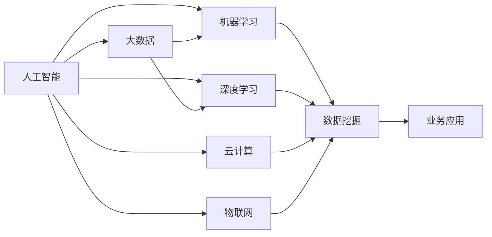

                 

# 人工智能与大数据的未来发展和应用

> 关键词：人工智能(AI), 大数据(Big Data), 机器学习(Machine Learning), 深度学习(Deep Learning), 数据挖掘(Data Mining), 云计算(Cloud Computing), 物联网(IoT)

## 1. 背景介绍

### 1.1 问题由来

在信息化和数字化浪潮的推动下，全球数据生成速度呈指数级增长，从移动互联网到物联网，从社交媒体到智慧城市，各行各业的数据量都在迅猛积累。与此同时，以人工智能为核心的新一代信息技术正快速崛起，成为驱动经济社会发展的新引擎。

人工智能与大数据技术的结合，极大地提升了数据处理和分析的能力，为各行各业带来了革命性的变化。从自动驾驶、工业互联网到智能医疗、金融科技，人工智能和大数据的应用已经渗透到社会的方方面面，正在重塑传统的生产方式、生活方式和思维模式。

在当前的科技发展态势下，人工智能和大数据技术的未来发展方向和应用前景备受关注。本文将系统阐述人工智能和大数据技术的融合趋势，重点分析其未来发展方向和潜在应用，并展望其对各行各业的影响。

## 2. 核心概念与联系

### 2.1 核心概念概述

为更好理解人工智能与大数据的融合应用，本节介绍几个核心概念：

- **人工智能(AI)**：利用算法和计算资源，使计算机系统具备智能分析、决策和执行的能力。AI分为弱人工智能(狭义AI)、强人工智能和通用人工智能(GA)三个层次。

- **大数据(Big Data)**：通常指规模巨大、复杂多样、速度快速、真实可靠的数据集合，包括结构化数据、非结构化数据和半结构化数据。大数据技术主要涉及数据采集、存储、处理、分析和应用。

- **机器学习(Machine Learning, ML)**：通过让计算机从数据中学习规律，从而进行预测和决策。机器学习主要分为监督学习、无监督学习和强化学习。

- **深度学习(Deep Learning, DL)**：一种特殊的机器学习技术，主要利用多层神经网络进行特征学习和模式识别。深度学习在图像识别、自然语言处理等领域取得了突破性进展。

- **数据挖掘(Data Mining)**：从大量数据中挖掘出有用的信息和知识，应用于市场分析、客户关系管理、金融风险预测等领域。

- **云计算(Cloud Computing)**：通过互联网提供按需、易扩展、弹性、高可用性的计算资源和服务，广泛应用于各类数据驱动的业务。

- **物联网(IoT)**：通过各类传感器、设备将物理世界与数字世界连接起来，实现数据的实时收集、传输和分析，推动智慧城市的建设。

这些核心概念通过一系列技术和算法的相互关联，共同构成了一个广泛而复杂的技术生态系统，为人工智能与大数据的未来发展提供了坚实的基础。

### 2.2 核心概念联系

下图展示了人工智能与大数据核心概念之间的联系和互动：



这个流程图展示了人工智能与大数据技术之间的紧密联系和互动关系。人工智能利用大数据进行算法训练和模型优化，大数据依托于云计算和物联网技术进行数据采集和存储，最终应用于各类业务场景中，推动数据驱动的决策和创新。

## 3. 核心算法原理 & 具体操作步骤

### 3.1 算法原理概述

人工智能与大数据的融合主要通过机器学习和深度学习技术实现。机器学习模型通常需要大量的数据进行训练，大数据技术提供了一个高效的数据存储、处理和分析平台，从而使得大规模数据驱动的机器学习成为可能。

深度学习则进一步提升了数据利用效率，通过多层神经网络的堆叠，深度学习可以从原始数据中自动提取复杂特征，无需人工干预，具有强大的模式识别和决策能力。

机器学习和深度学习的原理如下：

1. **监督学习**：通过标注数据训练模型，使其能够预测新的、未标注的数据。监督学习主要应用于图像识别、语音识别、自然语言处理等领域。
2. **无监督学习**：通过未标注数据训练模型，发现数据的内在结构。无监督学习主要应用于聚类、降维、异常检测等。
3. **强化学习**：通过与环境的交互，使模型通过奖励机制进行学习，主要应用于游戏、机器人控制等领域。
4. **深度学习**：通过多层神经网络进行特征提取和模式识别，主要应用于图像识别、语音识别、自然语言处理等领域。

### 3.2 算法步骤详解

人工智能与大数据的融合主要包括以下几个步骤：

**Step 1: 数据采集和预处理**
- 从物联网、社交媒体、企业内部系统等渠道收集原始数据。
- 清洗和处理数据，去除噪声和错误，确保数据的质量和一致性。

**Step 2: 数据存储和管理**
- 使用大数据技术将清洗后的数据存储到分布式数据库中，如Hadoop、Spark等。
- 对存储的数据进行分区、分片、备份等操作，确保数据的高可用性和可扩展性。

**Step 3: 数据特征提取**
- 利用机器学习算法，从原始数据中提取有用的特征。
- 使用深度学习模型，自动发现数据中的复杂结构和高阶特征。

**Step 4: 模型训练和优化**
- 在存储的大规模数据上，训练机器学习或深度学习模型。
- 通过超参数调优、正则化、特征工程等手段，优化模型性能。

**Step 5: 模型应用和评估**
- 将训练好的模型应用于实际业务场景，进行预测、分类、聚类等操作。
- 利用评估指标（如准确率、召回率、F1分数等）对模型效果进行评估，发现并改进模型的缺陷。

### 3.3 算法优缺点

人工智能与大数据融合的优势包括：

- **数据驱动决策**：大数据提供了海量数据支持，使得模型训练和决策过程更加科学和可靠。
- **智能分析和预测**：通过机器学习和深度学习算法，可以从复杂数据中挖掘出有价值的信息和知识。
- **高效计算能力**：云计算提供了强大的计算资源，能够快速处理大规模数据，满足实时性需求。

其不足之处在于：

- **数据隐私和安全**：大规模数据收集和处理过程中，如何保护用户隐私和安全是一个重要问题。
- **模型复杂性**：深度学习模型的复杂性和黑盒性，使得模型的可解释性和透明性难以保证。
- **数据质量要求高**：机器学习和深度学习模型对数据质量要求较高，数据清洗和特征提取的复杂性较大。
- **计算资源需求大**：深度学习模型对计算资源的要求较高，训练和推理过程可能耗费大量时间。

### 3.4 算法应用领域

人工智能与大数据技术广泛应用于以下领域：

- **医疗健康**：利用大数据分析患者历史数据和实时监测数据，进行疾病预测、个性化诊疗和医疗资源优化。
- **金融科技**：通过大数据分析交易数据和用户行为数据，进行风险控制、信用评估和智能投顾。
- **智能制造**：通过物联网设备采集生产数据，利用大数据和人工智能进行质量控制、设备维护和生产调度。
- **智慧城市**：利用大数据和人工智能技术，进行交通管理、环境监测、能源管理等城市治理应用。
- **智能客服**：通过大数据分析和自然语言处理技术，提供7x24小时智能客服，提升客户体验。
- **农业科技**：利用遥感数据和大数据分析，进行农作物生长监测、病虫害预测和精准农业管理。

## 4. 数学模型和公式 & 详细讲解  
### 4.1 数学模型构建

在人工智能与大数据融合过程中，常用的数学模型包括线性回归、逻辑回归、支持向量机(SVM)、决策树、随机森林、神经网络等。这里以神经网络为例，说明模型的构建过程。

假设输入数据为 $x$，模型参数为 $\theta$，输出结果为 $y$。神经网络模型可以表示为：

$$
y = \sigma(\theta^T \cdot x + b)
$$

其中 $\sigma$ 为激活函数，常用的激活函数包括 sigmoid、ReLU、tanh 等。$\theta$ 为权重矩阵，$b$ 为偏置项。

### 4.2 公式推导过程

以神经网络模型为例，详细推导损失函数的计算过程。

假设模型的预测结果为 $\hat{y}$，真实结果为 $y$。常用的损失函数包括均方误差(MSE)、交叉熵损失(Cross Entropy Loss)等。这里以交叉熵损失为例：

$$
\mathcal{L}(\theta) = -\frac{1}{N} \sum_{i=1}^N \sum_{j=1}^C y_j \log \hat{y}_j
$$

其中 $N$ 为样本数，$C$ 为类别数。$y_j$ 为样本 $i$ 属于类别 $j$ 的真实标签，$\hat{y}_j$ 为模型对样本 $i$ 属于类别 $j$ 的预测概率。

通过反向传播算法，可以得到损失函数对模型参数 $\theta$ 的梯度：

$$
\frac{\partial \mathcal{L}(\theta)}{\partial \theta} = -\frac{1}{N} \sum_{i=1}^N \sum_{j=1}^C \frac{y_j - \hat{y}_j}{\hat{y}_j(1 - \hat{y}_j)}
$$

通过梯度下降等优化算法，不断更新模型参数 $\theta$，最小化损失函数 $\mathcal{L}(\theta)$，使得模型输出逼近真实标签 $y$。

### 4.3 案例分析与讲解

以房价预测为例，说明如何利用神经网络进行数据分析和预测。

假设有一个包含房屋面积、卧室数量、地段等特征的数据集，需要预测房屋的价格。

**Step 1: 数据预处理**

将原始数据进行清洗、归一化和特征编码等预处理操作，确保数据质量。

**Step 2: 数据划分**

将数据集划分为训练集和测试集，通常采用 70% 的训练数据和 30% 的测试数据。

**Step 3: 模型构建**

利用神经网络模型，通过多层感知器(MLP)进行特征提取和价格预测。

**Step 4: 模型训练**

在训练集上训练神经网络模型，不断调整参数，优化模型性能。

**Step 5: 模型评估**

在测试集上评估模型性能，计算准确率、均方误差等指标。

**Step 6: 模型应用**

利用训练好的模型，对新的房屋数据进行价格预测。

## 5. 项目实践：代码实例和详细解释说明

### 5.1 开发环境搭建

在进行人工智能与大数据融合应用实践前，需要准备好开发环境。以下是使用Python进行TensorFlow和Keras开发的环境配置流程：

1. 安装Anaconda：从官网下载并安装Anaconda，用于创建独立的Python环境。

2. 创建并激活虚拟环境：
```bash
conda create -n tf-env python=3.8 
conda activate tf-env
```

3. 安装TensorFlow和Keras：
```bash
pip install tensorflow==2.3
pip install keras==2.4
```

4. 安装各类工具包：
```bash
pip install numpy pandas scikit-learn matplotlib tqdm jupyter notebook ipython
```

完成上述步骤后，即可在`tf-env`环境中开始实践。

### 5.2 源代码详细实现

这里我们以房价预测为例，给出使用TensorFlow和Keras进行神经网络训练的完整代码实现。

```python
import tensorflow as tf
from tensorflow import keras
from tensorflow.keras import layers

# 加载数据集
(x_train, y_train), (x_test, y_test) = keras.datasets.boston_housing.load_data()

# 数据预处理
x_train = x_train.reshape(-1, 13).astype('float32') / 10
x_test = x_test.reshape(-1, 13).astype('float32') / 10
y_train = y_train.astype('float32')

# 定义模型
model = keras.Sequential([
    layers.Dense(64, activation='relu', input_shape=(13,)),
    layers.Dense(64, activation='relu'),
    layers.Dense(1)
])

# 编译模型
model.compile(optimizer='adam', loss='mse', metrics=['mae'])

# 训练模型
model.fit(x_train, y_train, epochs=100, validation_split=0.2)

# 评估模型
model.evaluate(x_test, y_test)

# 预测房价
new_house = [[0.03, 18, 2.31, 0, 0, 5.84, 6.75, 90, 15, 390, 2, 12.0, 5.69, 5.36, 7.67]]
new_house = new_house.reshape(-1, 13).astype('float32') / 10
predicted_price = model.predict(new_house)
```

### 5.3 代码解读与分析

让我们再详细解读一下关键代码的实现细节：

**数据预处理**：
- 将原始数据进行归一化处理，确保数据在[0,1]之间。
- 利用Keras的`Sequential`模型构建多层神经网络。
- 使用`Dense`层进行特征提取和价格预测，使用ReLU激活函数。

**模型训练**：
- 通过`compile`方法设置优化器、损失函数和评估指标。
- 利用`fit`方法训练模型，设置迭代轮数和验证集比例。
- 利用`evaluate`方法在测试集上评估模型性能。

**模型应用**：
- 使用`predict`方法对新样本进行价格预测。

可以看到，TensorFlow和Keras提供了方便的API接口，使得神经网络模型的构建和训练过程非常简洁。开发者可以将更多精力放在数据预处理和模型优化等高层逻辑上，而不必过多关注底层实现细节。

## 6. 实际应用场景

### 6.1 智慧医疗

人工智能与大数据在医疗健康领域的应用，已经显现出巨大的潜力。通过分析患者历史数据、实时监测数据和电子病历，可以实现疾病预测、个性化诊疗和医疗资源优化。

具体而言，可以构建基于深度学习的诊断模型，对医学影像进行分析和识别。利用自然语言处理技术，分析和整理医生的电子病历，提取有价值的医疗信息。结合大数据分析，预测患者的病情变化和疾病风险，实现个性化诊疗方案的推荐。

### 6.2 金融科技

在金融领域，人工智能与大数据的融合，极大地提升了风险控制和客户服务能力。通过分析交易数据、用户行为数据和市场数据，可以实现信用评估、风险预警、智能投顾等功能。

具体而言，可以构建基于深度学习的信用评分模型，对用户的还款能力和信用风险进行评估。利用自然语言处理技术，分析金融机构的报告和公告，提取有价值的信息。结合大数据分析，进行市场分析和趋势预测，实现智能投顾系统的开发。

### 6.3 智能制造

智能制造是制造业未来发展的方向，人工智能与大数据的融合，将显著提升生产效率和质量。通过物联网设备采集生产数据，利用大数据和人工智能进行质量控制、设备维护和生产调度。

具体而言，可以构建基于机器学习的质量控制模型，对生产过程中的异常情况进行检测和预测。利用深度学习技术，分析设备的运行数据，预测设备的故障和维护需求。结合大数据分析，进行生产调度和优化，实现智能制造的自动化和智能化。

### 6.4 智慧城市

智慧城市是城市未来发展的方向，人工智能与大数据的融合，将带来城市管理的新模式。通过分析交通数据、环境数据和社会数据，可以实现交通管理、环境监测和能源管理等功能。

具体而言，可以构建基于深度学习的交通分析模型，对交通流量进行预测和优化。利用自然语言处理技术，分析社交媒体和新闻报道，提取城市事件和舆情信息。结合大数据分析，进行城市事件的监测和预警，实现智慧城市的建设。

## 7. 工具和资源推荐

### 7.1 学习资源推荐

为了帮助开发者系统掌握人工智能与大数据融合的应用技术，这里推荐一些优质的学习资源：

1. 《深度学习》课程（斯坦福大学）：由斯坦福大学Andrew Ng教授主讲，深入浅出地介绍了深度学习的基本概念和算法。

2. 《机器学习实战》书籍：通过大量实战案例，帮助读者理解机器学习算法的实际应用。

3. Kaggle平台：提供各种数据科学竞赛和社区资源，可以练习和应用机器学习技术。

4. Coursera平台：提供各类人工智能和数据科学课程，涵盖从入门到高级的各个层次。

5. GitHub资源库：包含各种开源项目和代码示例，可以学习和借鉴其他开发者的工作。

通过对这些资源的学习实践，相信你一定能够快速掌握人工智能与大数据融合的技术要领，并用于解决实际的业务问题。

### 7.2 开发工具推荐

高效的开发离不开优秀的工具支持。以下是几款用于人工智能与大数据融合开发的常用工具：

1. TensorFlow：由Google主导开发的深度学习框架，提供丰富的API接口和可视化工具，适用于大规模深度学习应用。

2. PyTorch：由Facebook主导开发的深度学习框架，支持动态计算图和GPU加速，适用于科研和工业应用。

3. Keras：基于TensorFlow和Theano开发的高级深度学习框架，提供简洁的API接口和丰富的模型库。

4. Jupyter Notebook：开源的交互式计算环境，支持Python、R等多种编程语言，适用于数据科学和机器学习开发。

5. Google Colab：谷歌提供的免费Jupyter Notebook环境，支持GPU/TPU计算，方便快速实验和分享。

合理利用这些工具，可以显著提升人工智能与大数据融合的开发效率，加快创新迭代的步伐。

### 7.3 相关论文推荐

人工智能与大数据融合技术的发展离不开学界的持续研究。以下是几篇奠基性的相关论文，推荐阅读：

1. Deep Learning（Goodfellow等，2016）：全面介绍了深度学习的理论和应用，是深度学习领域的经典著作。

2. Machine Learning（Tom Mitchell，1997）：介绍了机器学习的基本概念和算法，是机器学习领域的经典著作。

3. TensorFlow：TensorFlow团队发布的白皮书，详细介绍了TensorFlow的架构和应用。

4. PyTorch：PyTorch团队的论文，介绍了PyTorch的设计思想和优势。

5. Keras：Keras团队的论文，介绍了Keras的设计思想和应用。

这些论文代表了大数据与人工智能融合技术的发展脉络。通过学习这些前沿成果，可以帮助研究者把握学科前进方向，激发更多的创新灵感。

## 8. 总结：未来发展趋势与挑战

### 8.1 研究成果总结

人工智能与大数据技术的融合，已经在医疗、金融、制造等多个领域展示了强大的应用潜力。通过数据分析和机器学习模型的训练，可以实现智能决策和自动化操作，显著提升生产效率和服务质量。

### 8.2 未来发展趋势

展望未来，人工智能与大数据技术的融合将呈现以下几个发展趋势：

1. **自动化和智能化**：随着算法和技术的不断进步，人工智能将进一步自动化和智能化，成为各行各业的核心能力。

2. **实时化和个性化**：通过大数据的实时分析和预测，可以实现更个性化的服务，满足用户的个性化需求。

3. **跨领域融合**：人工智能与大数据技术将与其他技术进行更深入的融合，如物联网、云计算、区块链等，推动更多垂直行业的智能化转型。

4. **数据安全与隐私保护**：随着数据应用范围的扩大，数据安全和隐私保护将成为一个重要问题，需要引入更多的技术手段进行保障。

5. **伦理和规范**：人工智能与大数据技术的广泛应用，将带来伦理和规范方面的挑战，需要制定相应的法律法规和标准。

6. **人机协同**：未来的人工智能系统将更多地与人类进行协作，提升系统的可解释性和透明性，增强用户信任和接受度。

### 8.3 面临的挑战

尽管人工智能与大数据技术的融合已经取得了显著进展，但在迈向更加智能化、普适化应用的过程中，仍面临以下挑战：

1. **数据隐私和安全**：大规模数据收集和处理过程中，如何保护用户隐私和安全是一个重要问题。

2. **模型复杂性**：深度学习模型的复杂性和黑盒性，使得模型的可解释性和透明性难以保证。

3. **计算资源需求大**：深度学习模型对计算资源的要求较高，训练和推理过程可能耗费大量时间。

4. **数据质量要求高**：机器学习和深度学习模型对数据质量要求较高，数据清洗和特征提取的复杂性较大。

5. **伦理和规范问题**：人工智能与大数据技术的广泛应用，将带来伦理和规范方面的挑战，需要制定相应的法律法规和标准。

6. **人机协同**：未来的人工智能系统将更多地与人类进行协作，提升系统的可解释性和透明性，增强用户信任和接受度。

### 8.4 研究展望

未来的研究需要在以下几个方面寻求新的突破：

1. **数据隐私保护**：引入差分隐私等技术，保护用户隐私，同时实现数据的有效利用。

2. **模型透明性**：引入可解释性算法，提升模型的透明性和可解释性，增强用户信任。

3. **实时处理能力**：通过分布式计算和边缘计算技术，提升模型的实时处理能力，满足实际应用的需求。

4. **跨领域融合**：加强人工智能与大数据技术与物联网、区块链等技术的融合，拓展应用场景。

5. **伦理和规范**：制定人工智能和数据科学领域的伦理规范和标准，推动技术健康发展。

6. **人机协同**：研究人机协作机制，提升系统的可解释性和透明性，增强用户信任和接受度。

这些研究方向的探索，必将引领人工智能与大数据技术的融合技术迈向更高的台阶，为构建安全、可靠、可解释、可控的智能系统铺平道路。面向未来，人工智能与大数据技术的融合将继续深化，推动数据驱动的决策和创新，全面提升人类社会的智能化水平。

## 9. 附录：常见问题与解答

**Q1：如何提高人工智能与大数据融合的模型性能？**

A: 提高模型性能需要从数据、算法和工程等多个方面进行优化：
1. 数据预处理：清洗数据，去除噪声和错误，确保数据质量。
2. 特征工程：选择和提取有价值的特征，提升模型的表达能力。
3. 算法优化：选择合适的模型和算法，调整超参数，优化模型性能。
4. 模型集成：利用多个模型的输出进行集成，提高模型的泛化能力。

**Q2：人工智能与大数据融合的模型如何部署？**

A: 将模型部署到生产环境中，需要进行以下步骤：
1. 模型训练和保存：使用训练好的模型进行保存，生成模型文件。
2. 模型加载和推理：在生产环境中，加载模型文件，对新数据进行推理。
3. 接口封装：将模型封装为API接口，方便调用和集成。

**Q3：人工智能与大数据融合的模型如何保护数据隐私和安全？**

A: 保护数据隐私和安全需要采取以下措施：
1. 数据匿名化：对敏感数据进行匿名化处理，确保数据隐私。
2. 差分隐私：引入差分隐私技术，保护个体隐私。
3. 访问控制：对数据进行严格的访问控制，确保数据安全。
4. 数据加密：对数据进行加密处理，防止数据泄露。

**Q4：人工智能与大数据融合的模型如何提升透明性和可解释性？**

A: 提升透明性和可解释性需要引入以下方法：
1. 可解释性算法：使用可解释性算法，提升模型的透明性和可解释性。
2. 模型可视化：使用可视化工具，对模型的决策过程进行可视化展示。
3. 用户反馈：收集用户反馈，不断优化模型性能和解释能力。

**Q5：人工智能与大数据融合的模型如何应对算力瓶颈？**

A: 应对算力瓶颈需要采取以下措施：
1. 分布式计算：利用分布式计算技术，提升计算能力。
2. 边缘计算：利用边缘计算技术，实现数据的本地处理。
3. 模型压缩：使用模型压缩技术，减小模型体积，提高计算效率。

通过这些方法，可以最大限度地提升人工智能与大数据融合的模型性能，实现更加高效、智能的业务应用。

---

作者：禅与计算机程序设计艺术 / Zen and the Art of Computer Programming

