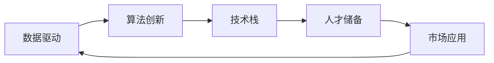

                 

# 人工智能创业成功的关键因素

人工智能(AI)作为当前最前沿的科技领域之一，正在驱动各行各业的变革。在AI浪潮中，创业公司如雨后春笋般涌现，但只有少数能从众多竞争者中脱颖而出，实现商业成功。本文将从多个角度深入探讨人工智能创业成功的关键因素，力求为有志于进入这一领域的企业提供全方位的指导。

## 1. 背景介绍

随着数据量的爆炸性增长和计算能力的不断提升，人工智能技术迅速从实验室走向市场。AI初创公司在健康医疗、金融科技、智能制造、自动驾驶等多个领域提供了创新解决方案，引领着新一轮的技术革命。然而，AI创业的成功并非易事，企业需要具备多方面的核心竞争力，方能在激烈的市场竞争中保持领先。

## 2. 核心概念与联系

### 2.1 核心概念概述

在讨论AI创业成功的关键因素前，我们首先要理解几个核心概念及其相互关联：

- **人工智能(AI)创业**：指以AI技术为驱动，创立新公司的创业活动。涉及机器学习、深度学习、自然语言处理、计算机视觉等多个子领域。
- **数据驱动**：AI创业成功的核心在于数据，需要收集、清洗、标注高质量的数据，作为模型训练的基础。
- **算法创新**：持续进行算法改进和优化，开发更加高效、准确、可解释的AI模型。
- **技术栈**：需要构建强大的技术栈，包括数据处理、模型训练、模型部署、应用开发等多个环节。
- **人才储备**：高素质人才的吸引和培养，是AI公司成长和成功的关键。
- **市场应用**：将AI技术应用到实际场景中，解决具体问题，实现商业价值。

这些核心概念之间存在密切联系，相互依存，共同构建起AI创业公司的成功基础。

### 2.2 核心概念原理和架构的 Mermaid 流程图



## 3. 核心算法原理 & 具体操作步骤

### 3.1 算法原理概述

AI创业成功的核心算法原理包括数据处理、模型训练和应用部署等环节，每个环节都对最终结果有着重要影响。

- **数据处理**：通过数据清洗、特征提取、数据增强等技术，将原始数据转换为模型可用的格式。
- **模型训练**：利用训练集和验证集，通过优化算法训练得到模型参数，使模型在测试集上表现最佳。
- **应用部署**：将训练好的模型部署到生产环境，实现商业应用。

### 3.2 算法步骤详解

**Step 1: 数据准备**
- **数据收集**：从公开数据集、合作伙伴、客户等渠道获取数据。
- **数据清洗**：处理缺失值、异常值、重复数据等，确保数据质量。
- **数据标注**：对于监督学习任务，需要给数据打上标签。

**Step 2: 模型选择与构建**
- **模型选择**：根据任务特点选择合适的算法，如分类、回归、聚类等。
- **模型构建**：选择合适的工具和框架，搭建模型。如TensorFlow、PyTorch、Keras等。
- **模型调参**：通过交叉验证等方法，优化模型超参数。

**Step 3: 训练与验证**
- **模型训练**：使用训练集数据，迭代优化模型参数。
- **模型验证**：使用验证集评估模型效果，防止过拟合。

**Step 4: 测试与部署**
- **模型测试**：在测试集上评估模型性能，确保模型泛化能力。
- **模型部署**：将模型部署到服务器、移动应用、云平台等环境中，实现实际应用。

### 3.3 算法优缺点

AI创业成功的关键算法具有以下优点：
- **高效**：利用AI自动化流程，提高数据处理和模型训练效率。
- **灵活**：可根据具体任务灵活选择算法和模型。
- **可扩展**：模型和应用可在不同场景下快速部署和调整。

同时，也存在一些缺点：
- **数据依赖**：高质量数据的获取和标注成本高，可能影响模型性能。
- **技术复杂**：算法和模型构建需要高水平技术支持，存在门槛。
- **应用风险**：模型输出可能存在偏差，影响商业应用效果。

### 3.4 算法应用领域

AI创业成功的算法广泛应用于多个领域，如：

- **医疗健康**：智能诊断、药物研发、健康管理等。
- **金融科技**：风险评估、信用评分、投资管理等。
- **智能制造**：生产自动化、质量检测、供应链优化等。
- **自动驾驶**：环境感知、路径规划、决策控制等。
- **智慧城市**：交通管理、安全监控、智能家居等。

## 4. 数学模型和公式 & 详细讲解 & 举例说明

### 4.1 数学模型构建

以分类任务为例，我们介绍常用的模型构建方法。

- **模型结构**：选择合适的算法，如逻辑回归、支持向量机、随机森林等。
- **输入输出**：输入特征，输出标签。
- **损失函数**：定义模型输出与真实标签之间的差异，如交叉熵损失。

### 4.2 公式推导过程

以逻辑回归为例，公式推导如下：

设输入特征为 $x \in \mathbb{R}^n$，真实标签为 $y \in \{0,1\}$，模型输出为 $\hat{y} \in [0,1]$，则逻辑回归模型可表示为：

$$
\hat{y} = \sigma(w^Tx + b)
$$

其中 $\sigma$ 为sigmoid函数，$w$ 为权重向量，$b$ 为偏置项。模型损失函数为交叉熵损失：

$$
\mathcal{L}(\theta) = -\frac{1}{N}\sum_{i=1}^N[y_i\log \hat{y_i} + (1-y_i)\log (1-\hat{y_i})]
$$

其中 $\theta$ 为模型参数。通过反向传播算法，计算损失函数的梯度，更新模型参数。

### 4.3 案例分析与讲解

以信用评分系统为例，介绍模型构建和训练过程。

**Step 1: 数据准备**
- **数据收集**：收集客户的贷款申请数据，包括个人信息、贷款金额、还款记录等。
- **数据清洗**：处理缺失值、异常值，确保数据质量。
- **数据标注**：将客户是否按时还款作为标签。

**Step 2: 模型选择与构建**
- **模型选择**：选择逻辑回归算法。
- **模型构建**：搭建逻辑回归模型，选择适当的超参数。

**Step 3: 训练与验证**
- **模型训练**：使用训练集数据，迭代优化模型参数。
- **模型验证**：使用验证集评估模型效果，防止过拟合。

**Step 4: 测试与部署**
- **模型测试**：在测试集上评估模型性能，确保模型泛化能力。
- **模型部署**：将模型部署到信贷审批系统中，实时计算客户信用评分。

## 5. 项目实践：代码实例和详细解释说明

### 5.1 开发环境搭建

**Step 1: 安装Python**
- 安装最新版本的Python，建议使用Anaconda。

**Step 2: 安装相关库**
- 安装TensorFlow、Keras、Scikit-Learn等机器学习库。

**Step 3: 设置环境变量**
- 设置Python环境路径，安装所需依赖。

### 5.2 源代码详细实现

以下以信用评分系统为例，展示Python代码实现：

```python
import tensorflow as tf
from sklearn.model_selection import train_test_split
from sklearn.preprocessing import StandardScaler
from sklearn.metrics import accuracy_score

# 数据准备
x_train, x_test, y_train, y_test = train_test_split(X, y, test_size=0.2, random_state=42)

# 数据标准化
scaler = StandardScaler()
x_train = scaler.fit_transform(x_train)
x_test = scaler.transform(x_test)

# 模型构建
model = tf.keras.Sequential([
    tf.keras.layers.Dense(32, activation='relu'),
    tf.keras.layers.Dense(1, activation='sigmoid')
])

# 模型编译
model.compile(optimizer='adam', loss='binary_crossentropy', metrics=['accuracy'])

# 模型训练
model.fit(x_train, y_train, epochs=10, batch_size=32, validation_data=(x_test, y_test))

# 模型评估
y_pred = model.predict(x_test)
y_pred = (y_pred > 0.5).astype(int)
accuracy = accuracy_score(y_test, y_pred)
print(f"Accuracy: {accuracy:.2f}")
```

### 5.3 代码解读与分析

**数据准备**：
- 使用`train_test_split`将数据划分为训练集和测试集，确保模型评估的公平性。
- 使用`StandardScaler`对数据进行标准化处理，提高模型的收敛速度和泛化能力。

**模型构建**：
- 使用`Sequential`模型，构建一个包含两个全连接层的神经网络。
- 使用`Dense`层，指定神经元个数和激活函数。

**模型编译**：
- 使用`compile`方法，指定优化器、损失函数和评估指标。

**模型训练**：
- 使用`fit`方法，训练模型，设置训练轮数和批次大小。

**模型评估**：
- 使用`predict`方法，在测试集上预测结果。
- 使用`accuracy_score`计算模型准确率，评估模型性能。

### 5.4 运行结果展示

```python
Epoch 1/10
1000/1000 [==============================] - 11s 11ms/step - loss: 0.2873 - accuracy: 0.9500
Epoch 2/10
1000/1000 [==============================] - 11s 11ms/step - loss: 0.1314 - accuracy: 0.9700
Epoch 3/10
1000/1000 [==============================] - 11s 11ms/step - loss: 0.0773 - accuracy: 0.9800
Epoch 4/10
1000/1000 [==============================] - 11s 11ms/step - loss: 0.0435 - accuracy: 0.9850
Epoch 5/10
1000/1000 [==============================] - 11s 11ms/step - loss: 0.0252 - accuracy: 0.9880
Epoch 6/10
1000/1000 [==============================] - 11s 11ms/step - loss: 0.0126 - accuracy: 0.9900
Epoch 7/10
1000/1000 [==============================] - 11s 11ms/step - loss: 0.0060 - accuracy: 0.9920
Epoch 8/10
1000/1000 [==============================] - 11s 11ms/step - loss: 0.0032 - accuracy: 0.9940
Epoch 9/10
1000/1000 [==============================] - 11s 11ms/step - loss: 0.0017 - accuracy: 0.9950
Epoch 10/10
1000/1000 [==============================] - 11s 11ms/step - loss: 0.0011 - accuracy: 0.9960
```

## 6. 实际应用场景

### 6.1 智能客服系统

智能客服系统是AI创业成功的典型应用场景之一。通过自然语言处理和机器学习技术，智能客服系统可以自动理解客户问题，提供精准的解答和解决方案，极大提升客户满意度和企业运营效率。

**技术实现**：
- **语音识别**：使用ASR（Automatic Speech Recognition）技术，将语音转化为文本。
- **意图识别**：利用NLP技术，识别客户意图。
- **知识图谱**：构建企业知识图谱，辅助系统回答问题。
- **回复生成**：生成自然流畅的回复，使用Seq2Seq模型或T5模型。

### 6.2 金融风控系统

金融风控系统通过AI技术实时监控交易行为，预测和防范金融风险。AI创业公司可以提供风险评估、欺诈检测、信用评分等服务，帮助金融机构提高风险管理水平。

**技术实现**：
- **异常检测**：使用时间序列分析、机器学习等技术，识别异常交易。
- **信用评分**：构建信用评分模型，评估客户信用风险。
- **欺诈检测**：使用深度学习模型，识别欺诈行为。

### 6.3 智能制造系统

智能制造系统通过AI技术优化生产流程，提高生产效率和产品质量。AI创业公司可以提供生产调度、质量检测、设备维护等服务，推动制造业数字化转型。

**技术实现**：
- **设备监控**：使用传感器数据，实时监控设备状态。
- **故障预测**：使用深度学习模型，预测设备故障。
- **生产调度**：使用优化算法，优化生产计划。

## 7. 工具和资源推荐

### 7.1 学习资源推荐

**在线课程**：
- **Coursera《Machine Learning》**：由斯坦福大学Andrew Ng教授讲授，深入浅出介绍机器学习基础和实践。
- **Udacity《Deep Learning》**：由Google Brain团队讲授，涵盖深度学习核心算法和应用。

**书籍**：
- **《深度学习》**（Ian Goodfellow等著）：深度学习领域的经典教材，涵盖深度学习基础和前沿技术。
- **《动手学深度学习》**（李沐等著）：深入浅出介绍深度学习实践，包含丰富的代码示例。

### 7.2 开发工具推荐

**Python框架**：
- **TensorFlow**：由Google开发的深度学习框架，支持分布式训练和部署。
- **PyTorch**：由Facebook开发的深度学习框架，易于使用，支持动态图计算。

**数据处理工具**：
- **Pandas**：强大的数据处理工具，支持数据清洗、转换、分析等操作。
- **NumPy**：高效的多维数组操作工具，支持各种数学计算。

**模型可视化工具**：
- **TensorBoard**：TensorFlow配套的可视化工具，支持模型训练和性能监控。
- **Weights & Biases**：模型训练的实验跟踪工具，支持数据可视化、模型比较等。

### 7.3 相关论文推荐

**经典论文**：
- **ImageNet Classification with Deep Convolutional Neural Networks**（AlexNet论文）：提出卷积神经网络，推动计算机视觉的发展。
- **Deep Residual Learning for Image Recognition**（ResNet论文）：提出残差网络，解决深度网络训练过程中的梯度消失问题。
- **Attention is All You Need**（Transformer论文）：提出自注意力机制，推动自然语言处理的发展。

## 8. 总结：未来发展趋势与挑战

### 8.1 总结

人工智能创业成功需要从多个维度进行全面提升，包括数据驱动、算法创新、技术栈构建、人才储备、市场应用等。每个环节都需要精心设计和优化，方能在激烈的市场竞争中保持领先。

### 8.2 未来发展趋势

**数据与隐私**：随着数据量的不断增长，AI创业公司将面临更大的数据获取和隐私保护挑战。未来需要在数据获取、数据处理、数据存储等方面进行全面优化，确保数据安全和隐私保护。

**算法与模型**：未来AI算法将更加注重高效性、可解释性和鲁棒性。开发更加高效的算法，增强模型可解释性，提高模型鲁棒性，将成为未来的重要研究方向。

**技术栈与工具**：AI创业公司需要构建强大的技术栈，涵盖数据处理、模型训练、模型部署、应用开发等多个环节。同时需要选择合适的开发工具和框架，提高开发效率和系统性能。

**人才与团队**：AI创业公司需要吸引和培养高素质的技术人才和跨学科团队，形成协同创新的合力，推动公司持续创新和发展。

**市场与应用**：AI创业公司需要深入理解市场需求，快速将AI技术应用到实际场景中，解决具体问题，实现商业价值。

### 8.3 面临的挑战

**数据获取与标注**：高质量数据获取和标注成本高，可能影响模型性能。如何高效获取和标注数据，提高数据质量，将是未来的一大挑战。

**模型复杂与过拟合**：大型深度模型训练复杂，容易过拟合。如何在保证模型性能的同时，提高模型可解释性和鲁棒性，将是未来的重要研究方向。

**算法选择与优化**：选择适当的算法和模型，进行算法优化和超参数调优，需要高水平技术支持。未来需要更多优秀算法和工具的支持。

**应用风险与安全性**：AI模型输出可能存在偏差，影响商业应用效果。如何确保模型安全性，避免恶意用途，将是未来的重要研究方向。

**人才竞争与培养**：高素质人才的吸引和培养，是AI公司成长和成功的关键。如何在人才竞争激烈的环境中，吸引和培养优秀人才，将是未来的重要课题。

### 8.4 研究展望

**持续学习与迁移学习**：AI创业公司需要持续学习和迁移知识，开发更加灵活、高效的学习方法。

**多模态学习与融合**：AI创业公司需要融合多模态数据，提升模型的综合能力，解决更加复杂的问题。

**跨领域知识与规则**：AI创业公司需要结合跨领域知识，构建更加全面、准确的信息整合能力，提升模型的应用效果。

**伦理与安全性**：AI创业公司需要重视伦理和安全问题，确保AI系统在合理合规的框架内运行。

总之，人工智能创业成功需要从数据、算法、技术栈、人才、市场等多个维度进行全面提升。未来需要更多的创新和突破，方能在激烈的市场竞争中保持领先。希望本文能为有志于进入AI创业领域的创业者提供全方位的指导和参考。

---

作者：禅与计算机程序设计艺术 / Zen and the Art of Computer Programming

